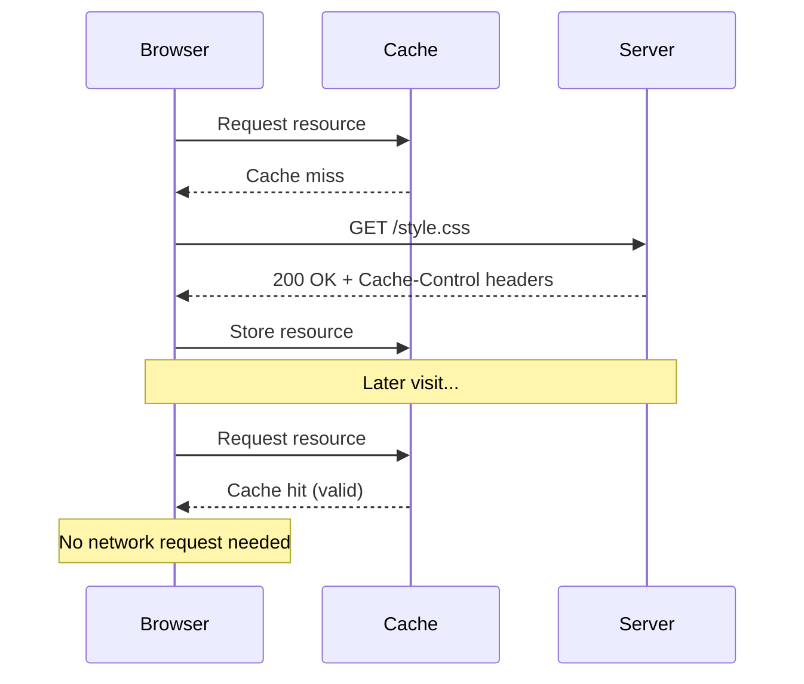
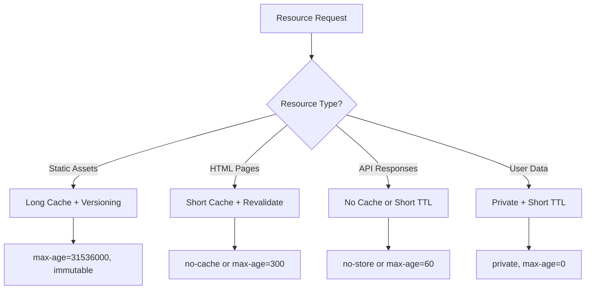
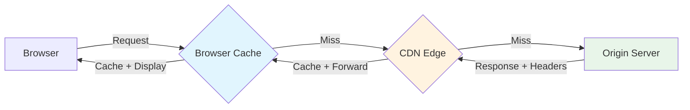

# How to Configure Browser Caching

Author: [nawazdhandala](https://www.github.com/nawazdhandala)

Tags: Caching, Performance, Web Development, HTTP Headers, CDN, Nginx, Apache

Description: A comprehensive guide to configuring browser caching for web applications, covering HTTP cache headers, cache strategies, and implementation examples for popular web servers.

---

> Browser caching is one of the most effective ways to improve website performance. By storing static assets locally on the user's device, you can dramatically reduce page load times and decrease server load. This guide covers everything you need to know about configuring browser caching effectively.

Understanding how browser caching works and implementing it correctly can reduce your page load times by 50% or more for returning visitors. Let's dive into the mechanics and practical implementation.

---

## How Browser Caching Works

When a browser requests a resource, the server can include HTTP headers that tell the browser how long to cache that resource. On subsequent visits, the browser serves the cached version instead of making a network request.



---

## Key HTTP Cache Headers

### Cache-Control Header

The `Cache-Control` header is the primary mechanism for controlling caching behavior. Here are the most important directives:

```bash
# Allow browser and CDN caching for 1 year (immutable assets)
Cache-Control: public, max-age=31536000, immutable

# Allow only browser caching for 1 hour
Cache-Control: private, max-age=3600

# Revalidate with server before using cached version
Cache-Control: no-cache

# Never cache this response
Cache-Control: no-store

# Allow caching but must revalidate after expiry
Cache-Control: public, max-age=86400, must-revalidate
```

### ETag and Last-Modified Headers

These headers enable conditional requests, allowing the browser to check if a cached resource is still valid:

```http
# Server response with ETag
HTTP/1.1 200 OK
ETag: "abc123def456"
Last-Modified: Fri, 24 Jan 2026 10:00:00 GMT
Cache-Control: no-cache

# Browser's conditional request
GET /api/data HTTP/1.1
If-None-Match: "abc123def456"
If-Modified-Since: Fri, 24 Jan 2026 10:00:00 GMT

# Server response if unchanged
HTTP/1.1 304 Not Modified
```

---

## Cache Strategy by Resource Type

Different resources require different caching strategies. Here's a recommended approach:



### Recommended Cache Durations

```yaml
# Static assets with cache busting (hashed filenames)
CSS/JS bundles: 1 year (31536000 seconds)
Images/Fonts: 1 year (31536000 seconds)
Video/Audio: 1 year (31536000 seconds)

# Assets that may change
Favicon: 1 week (604800 seconds)
Manifest files: 1 day (86400 seconds)

# Dynamic content
HTML pages: 5-15 minutes or no-cache
API responses: 0-60 seconds based on freshness needs
User-specific data: no-store or private
```

---

## Nginx Configuration

### Basic Caching Setup

Configure caching rules in your Nginx server block:

```nginx
server {
    listen 80;
    server_name example.com;
    root /var/www/html;

    # Static assets with long cache duration
    # Using regex to match common static file extensions
    location ~* \.(css|js|jpg|jpeg|png|gif|ico|svg|woff|woff2|ttf|eot)$ {
        # Cache for 1 year - these files should use cache busting
        expires 1y;

        # Allow CDN and browser caching
        add_header Cache-Control "public, max-age=31536000, immutable";

        # Remove ETag to reduce header size (optional)
        etag off;

        # Enable gzip for text-based assets
        gzip on;
        gzip_types text/css application/javascript image/svg+xml;
    }

    # HTML files - short cache with revalidation
    location ~* \.html$ {
        # Always revalidate with server
        add_header Cache-Control "no-cache, must-revalidate";

        # Keep ETag for conditional requests
        etag on;
    }

    # API endpoints - no caching
    location /api/ {
        # Prevent all caching for dynamic API responses
        add_header Cache-Control "no-store, no-cache, must-revalidate";
        add_header Pragma "no-cache";

        proxy_pass http://backend;
    }

    # Service worker - never cache to ensure updates propagate
    location = /sw.js {
        add_header Cache-Control "no-store";
        expires off;
    }
}
```

### Advanced Nginx Configuration with Versioned Assets

```nginx
server {
    listen 80;
    server_name example.com;

    # Versioned assets (e.g., /assets/app.abc123.js)
    # These contain a hash in the filename and can be cached forever
    location ~* /assets/.*\.[a-f0-9]{8,}\.(css|js)$ {
        expires max;
        add_header Cache-Control "public, max-age=31536000, immutable";

        # Security headers
        add_header X-Content-Type-Options "nosniff";
    }

    # Non-versioned assets need shorter cache
    location /assets/ {
        expires 7d;
        add_header Cache-Control "public, max-age=604800";
    }

    # Conditional caching based on query parameters
    location /images/ {
        # If URL has version parameter, cache forever
        if ($args ~* "v=") {
            expires max;
            add_header Cache-Control "public, max-age=31536000";
        }

        # Default: cache for 1 day
        expires 1d;
        add_header Cache-Control "public, max-age=86400";
    }
}
```

---

## Apache Configuration

### Using .htaccess

```apache
# Enable mod_expires and mod_headers
<IfModule mod_expires.c>
    ExpiresActive On

    # Default expiration: 1 hour
    ExpiresDefault "access plus 1 hour"

    # Static assets: 1 year
    # CSS files
    ExpiresByType text/css "access plus 1 year"

    # JavaScript files
    ExpiresByType application/javascript "access plus 1 year"
    ExpiresByType text/javascript "access plus 1 year"

    # Images
    ExpiresByType image/jpeg "access plus 1 year"
    ExpiresByType image/png "access plus 1 year"
    ExpiresByType image/gif "access plus 1 year"
    ExpiresByType image/svg+xml "access plus 1 year"
    ExpiresByType image/webp "access plus 1 year"

    # Fonts
    ExpiresByType font/woff "access plus 1 year"
    ExpiresByType font/woff2 "access plus 1 year"
    ExpiresByType application/font-woff "access plus 1 year"

    # HTML - short cache
    ExpiresByType text/html "access plus 5 minutes"

    # JSON/XML API responses - no cache by default
    ExpiresByType application/json "access plus 0 seconds"
    ExpiresByType application/xml "access plus 0 seconds"
</IfModule>

# Add Cache-Control headers
<IfModule mod_headers.c>
    # Static assets with immutable flag
    <FilesMatch "\.(css|js|jpg|jpeg|png|gif|ico|svg|woff|woff2)$">
        Header set Cache-Control "public, max-age=31536000, immutable"
    </FilesMatch>

    # HTML files - revalidate
    <FilesMatch "\.html$">
        Header set Cache-Control "no-cache, must-revalidate"
    </FilesMatch>

    # Prevent caching of sensitive files
    <FilesMatch "\.(php|json)$">
        Header set Cache-Control "no-store, no-cache, must-revalidate"
        Header set Pragma "no-cache"
    </FilesMatch>
</IfModule>

# Enable ETag based on file properties
FileETag MTime Size
```

---

## Express.js / Node.js Configuration

### Setting Cache Headers in Express

```javascript
const express = require('express');
const path = require('path');

const app = express();

// Middleware for setting cache headers based on file type
const cacheMiddleware = (req, res, next) => {
    // Get the file extension
    const ext = path.extname(req.path).toLowerCase();

    // Define cache durations by file type
    const cacheDurations = {
        '.css': 31536000,      // 1 year
        '.js': 31536000,       // 1 year
        '.png': 31536000,      // 1 year
        '.jpg': 31536000,      // 1 year
        '.jpeg': 31536000,     // 1 year
        '.gif': 31536000,      // 1 year
        '.svg': 31536000,      // 1 year
        '.woff': 31536000,     // 1 year
        '.woff2': 31536000,    // 1 year
        '.html': 300,          // 5 minutes
        '.json': 0             // No cache
    };

    const duration = cacheDurations[ext];

    if (duration !== undefined) {
        if (duration === 0) {
            // No caching
            res.setHeader('Cache-Control', 'no-store, no-cache, must-revalidate');
            res.setHeader('Pragma', 'no-cache');
        } else {
            // Enable caching with specified duration
            res.setHeader('Cache-Control', `public, max-age=${duration}, immutable`);
        }
    }

    next();
};

// Apply cache middleware before static file serving
app.use(cacheMiddleware);

// Serve static files from the public directory
app.use(express.static('public', {
    // Enable ETag generation
    etag: true,

    // Set Last-Modified header
    lastModified: true,

    // Custom headers per file type
    setHeaders: (res, filePath) => {
        // Check if file is in the versioned assets folder
        if (filePath.includes('/assets/') && /\.[a-f0-9]{8,}\./.test(filePath)) {
            res.setHeader('Cache-Control', 'public, max-age=31536000, immutable');
        }
    }
}));

// API routes - no caching
app.get('/api/*', (req, res, next) => {
    res.setHeader('Cache-Control', 'no-store');
    next();
});

app.listen(3000, () => {
    console.log('Server running on port 3000');
});
```

---

## CDN Integration

When using a CDN, you need to consider both browser caching and CDN caching:



### CDN Cache Headers

```nginx
# Nginx configuration for CDN caching
location /static/ {
    # Browser cache: 1 day
    # CDN cache: 7 days (using s-maxage)
    add_header Cache-Control "public, max-age=86400, s-maxage=604800";

    # Surrogate-Control for advanced CDN features
    add_header Surrogate-Control "max-age=604800";

    # Vary header for proper cache key generation
    add_header Vary "Accept-Encoding";
}

# Different cache times for browser vs CDN
location /api/public/ {
    # Browser: no cache (always fresh)
    # CDN: cache for 5 minutes
    add_header Cache-Control "public, max-age=0, s-maxage=300";

    # Stale-while-revalidate for better performance
    add_header Cache-Control "public, max-age=0, s-maxage=300, stale-while-revalidate=60";
}
```

---

## Cache Busting Strategies

To ensure users get updated files when you deploy changes, implement cache busting:

### Filename Hashing

```javascript
// webpack.config.js
module.exports = {
    output: {
        // Include content hash in filename
        filename: '[name].[contenthash].js',
        chunkFilename: '[name].[contenthash].chunk.js'
    },
    plugins: [
        new MiniCssExtractPlugin({
            filename: '[name].[contenthash].css'
        })
    ]
};

// Result: app.a1b2c3d4.js, styles.e5f6g7h8.css
// When content changes, hash changes, browser fetches new file
```

### Query String Versioning

```html
<!-- Simple approach using build timestamp or version -->
<link rel="stylesheet" href="/styles/main.css?v=1.2.3">
<script src="/js/app.js?v=1706097600"></script>

<!-- PHP example -->
<link rel="stylesheet" href="/styles/main.css?v=<?= filemtime('styles/main.css') ?>">
```

---

## Testing Your Cache Configuration

### Using curl to Check Headers

```bash
# Check cache headers for a resource
curl -I https://example.com/assets/style.css

# Expected output
# HTTP/2 200
# cache-control: public, max-age=31536000, immutable
# etag: "abc123"
# last-modified: Fri, 24 Jan 2026 10:00:00 GMT

# Test conditional request
curl -I -H "If-None-Match: \"abc123\"" https://example.com/assets/style.css

# Expected: 304 Not Modified if ETag matches
```

### Browser DevTools

Check the Network tab in your browser's developer tools:
- Look for `(from disk cache)` or `(from memory cache)` indicators
- Verify Cache-Control headers in response headers
- Check the Size column to identify cached resources

---

## Best Practices

1. **Use content hashing for static assets** - This allows you to set long cache times safely since the filename changes when content changes.

2. **Set appropriate cache durations** - Static assets can be cached for a year, but HTML and API responses need shorter or no caching.

3. **Always include Vary header** - When responses differ based on request headers (like Accept-Encoding), include the Vary header.

4. **Use immutable for versioned assets** - The `immutable` directive tells browsers not to revalidate during page navigation.

5. **Implement stale-while-revalidate** - This allows serving stale content while fetching updates in the background.

6. **Monitor cache hit rates** - Use your CDN or server analytics to ensure caching is working effectively.

---

## Conclusion

Proper browser caching configuration is essential for web performance. By setting appropriate cache headers based on resource type, implementing cache busting for updates, and leveraging CDN caching, you can significantly improve page load times and reduce server load.

The key is matching cache duration to how often content changes. Static assets with hash-based filenames can be cached indefinitely, while dynamic content needs shorter or no caching to ensure freshness.

---

*Want to monitor how caching affects your application performance? [OneUptime](https://oneuptime.com) provides comprehensive performance monitoring that helps you understand cache hit rates and their impact on user experience.*

**Related Reading:**
- [How to Implement CDN for Better Performance](https://oneuptime.com/blog)
- [Web Performance Optimization Best Practices](https://oneuptime.com/blog)
