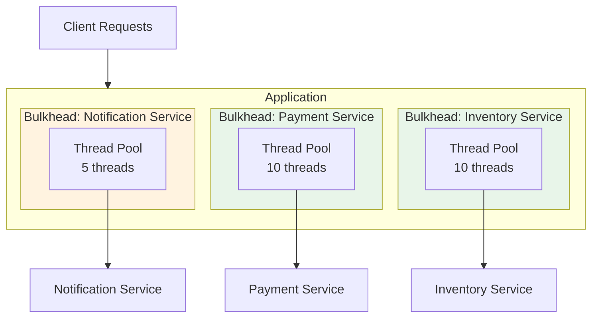
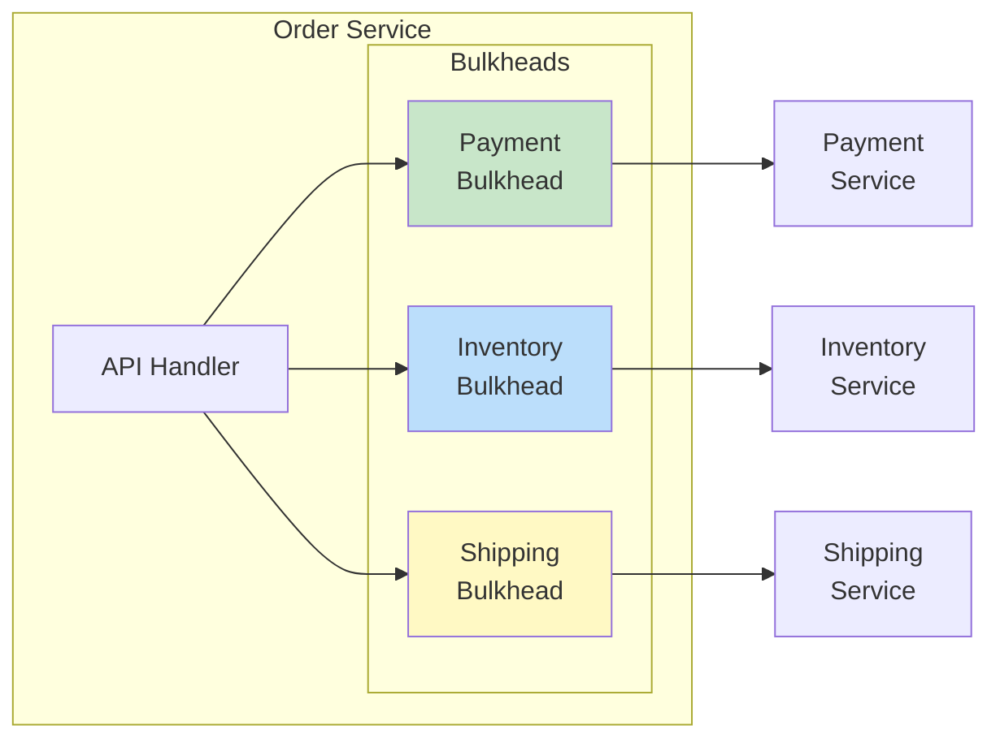

# How to Handle Bulkhead Pattern Implementation

Author: [nawazdhandala](https://www.github.com/nawazdhandala)

Tags: Microservices, Resilience, Bulkhead Pattern, Fault Isolation, System Design, Python, Java

Description: A practical guide to implementing the Bulkhead pattern to isolate failures in distributed systems and prevent cascading outages across services.

---

> The Bulkhead pattern, inspired by ship design, isolates components so that a failure in one does not sink the entire system. This guide shows you how to implement effective bulkheads in your applications to contain failures and maintain system stability.

In distributed systems, a single failing component can bring down your entire application through resource exhaustion. The Bulkhead pattern creates isolated pools of resources, ensuring that failures remain contained within their compartment.

---

## Understanding the Bulkhead Pattern

The Bulkhead pattern partitions resources into isolated pools. When one pool is exhausted or failing, other pools continue operating normally.



---

## Types of Bulkheads

### Thread Pool Bulkhead

Isolates operations using dedicated thread pools:

```python
# bulkhead.py
import threading
from concurrent.futures import ThreadPoolExecutor, TimeoutError
from typing import Callable, Any, Dict
from dataclasses import dataclass
from functools import wraps
import time

@dataclass
class BulkheadConfig:
    """Configuration for a bulkhead"""
    max_concurrent: int          # Maximum concurrent calls
    max_wait_time: float         # Maximum time to wait for a slot (seconds)
    name: str                    # Name for logging and metrics


class BulkheadFullException(Exception):
    """Raised when bulkhead is at capacity"""
    def __init__(self, bulkhead_name: str):
        self.bulkhead_name = bulkhead_name
        super().__init__(f"Bulkhead '{bulkhead_name}' is full")


class ThreadPoolBulkhead:
    """Thread pool based bulkhead for isolation"""

    def __init__(self, config: BulkheadConfig):
        self.config = config
        self.executor = ThreadPoolExecutor(
            max_workers=config.max_concurrent,
            thread_name_prefix=f"bulkhead-{config.name}"
        )
        self.semaphore = threading.Semaphore(config.max_concurrent)
        self.metrics = BulkheadMetrics(config.name)

    def execute(self, func: Callable, *args, **kwargs) -> Any:
        """Execute a function within the bulkhead"""

        # Try to acquire a slot within the wait time
        acquired = self.semaphore.acquire(
            blocking=True,
            timeout=self.config.max_wait_time
        )

        if not acquired:
            self.metrics.record_rejected()
            raise BulkheadFullException(self.config.name)

        self.metrics.record_call_started()
        start_time = time.time()

        try:
            # Submit to thread pool and wait for result
            future = self.executor.submit(func, *args, **kwargs)
            result = future.result()

            self.metrics.record_success(time.time() - start_time)
            return result

        except Exception as e:
            self.metrics.record_failure(time.time() - start_time)
            raise

        finally:
            self.semaphore.release()
            self.metrics.record_call_finished()

    async def execute_async(self, func: Callable, *args, **kwargs) -> Any:
        """Async version using asyncio"""
        import asyncio

        loop = asyncio.get_event_loop()
        return await loop.run_in_executor(
            self.executor,
            lambda: func(*args, **kwargs)
        )

    def shutdown(self):
        """Gracefully shutdown the bulkhead"""
        self.executor.shutdown(wait=True)


class BulkheadMetrics:
    """Metrics collection for bulkhead monitoring"""

    def __init__(self, name: str):
        self.name = name
        self._lock = threading.Lock()
        self.active_calls = 0
        self.total_calls = 0
        self.successful_calls = 0
        self.failed_calls = 0
        self.rejected_calls = 0
        self.total_duration = 0.0

    def record_call_started(self):
        with self._lock:
            self.active_calls += 1
            self.total_calls += 1

    def record_call_finished(self):
        with self._lock:
            self.active_calls -= 1

    def record_success(self, duration: float):
        with self._lock:
            self.successful_calls += 1
            self.total_duration += duration

    def record_failure(self, duration: float):
        with self._lock:
            self.failed_calls += 1
            self.total_duration += duration

    def record_rejected(self):
        with self._lock:
            self.rejected_calls += 1

    def get_stats(self) -> Dict:
        with self._lock:
            avg_duration = (
                self.total_duration / self.successful_calls
                if self.successful_calls > 0 else 0
            )
            return {
                "bulkhead": self.name,
                "active_calls": self.active_calls,
                "total_calls": self.total_calls,
                "successful_calls": self.successful_calls,
                "failed_calls": self.failed_calls,
                "rejected_calls": self.rejected_calls,
                "average_duration_ms": avg_duration * 1000
            }
```

---

## Semaphore Bulkhead

A lighter-weight alternative using semaphores:

```python
# semaphore_bulkhead.py
import asyncio
import threading
from contextlib import contextmanager, asynccontextmanager
from typing import Optional
import time


class SemaphoreBulkhead:
    """Semaphore-based bulkhead for limiting concurrent access"""

    def __init__(
        self,
        name: str,
        max_concurrent: int,
        max_wait_time: float = 0
    ):
        self.name = name
        self.max_concurrent = max_concurrent
        self.max_wait_time = max_wait_time
        self._semaphore = threading.Semaphore(max_concurrent)
        self._async_semaphore: Optional[asyncio.Semaphore] = None

    @contextmanager
    def acquire(self):
        """Context manager for synchronous bulkhead access"""

        acquired = self._semaphore.acquire(
            blocking=True,
            timeout=self.max_wait_time if self.max_wait_time > 0 else None
        )

        if not acquired:
            raise BulkheadFullException(self.name)

        try:
            yield
        finally:
            self._semaphore.release()

    @asynccontextmanager
    async def acquire_async(self):
        """Context manager for async bulkhead access"""

        # Lazily create async semaphore
        if self._async_semaphore is None:
            self._async_semaphore = asyncio.Semaphore(self.max_concurrent)

        try:
            await asyncio.wait_for(
                self._async_semaphore.acquire(),
                timeout=self.max_wait_time if self.max_wait_time > 0 else None
            )
        except asyncio.TimeoutError:
            raise BulkheadFullException(self.name)

        try:
            yield
        finally:
            self._async_semaphore.release()


# Usage example
payment_bulkhead = SemaphoreBulkhead(
    name="payment-service",
    max_concurrent=10,
    max_wait_time=5.0
)

def process_payment(order_id: str, amount: float):
    """Process payment with bulkhead protection"""

    with payment_bulkhead.acquire():
        # This block is protected by the bulkhead
        # Only 10 concurrent calls allowed
        return call_payment_gateway(order_id, amount)


async def process_payment_async(order_id: str, amount: float):
    """Async payment processing with bulkhead"""

    async with payment_bulkhead.acquire_async():
        return await call_payment_gateway_async(order_id, amount)
```

---

## Bulkhead Registry

Manage multiple bulkheads centrally:

```python
# bulkhead_registry.py
from typing import Dict, Optional
import threading
import yaml


class BulkheadRegistry:
    """Central registry for managing bulkheads"""

    _instance: Optional['BulkheadRegistry'] = None
    _lock = threading.Lock()

    def __new__(cls):
        if cls._instance is None:
            with cls._lock:
                if cls._instance is None:
                    cls._instance = super().__new__(cls)
                    cls._instance._bulkheads: Dict[str, ThreadPoolBulkhead] = {}
                    cls._instance._configs: Dict[str, BulkheadConfig] = {}
        return cls._instance

    def register(self, config: BulkheadConfig) -> ThreadPoolBulkhead:
        """Register a new bulkhead"""

        if config.name in self._bulkheads:
            return self._bulkheads[config.name]

        bulkhead = ThreadPoolBulkhead(config)
        self._bulkheads[config.name] = bulkhead
        self._configs[config.name] = config

        return bulkhead

    def get(self, name: str) -> Optional[ThreadPoolBulkhead]:
        """Get a bulkhead by name"""
        return self._bulkheads.get(name)

    def get_or_create(
        self,
        name: str,
        max_concurrent: int = 10,
        max_wait_time: float = 5.0
    ) -> ThreadPoolBulkhead:
        """Get existing bulkhead or create new one"""

        if name not in self._bulkheads:
            config = BulkheadConfig(
                name=name,
                max_concurrent=max_concurrent,
                max_wait_time=max_wait_time
            )
            return self.register(config)

        return self._bulkheads[name]

    def load_from_config(self, config_path: str):
        """Load bulkhead configurations from YAML file"""

        with open(config_path, 'r') as f:
            config_data = yaml.safe_load(f)

        for name, settings in config_data.get('bulkheads', {}).items():
            config = BulkheadConfig(
                name=name,
                max_concurrent=settings.get('max_concurrent', 10),
                max_wait_time=settings.get('max_wait_time', 5.0)
            )
            self.register(config)

    def get_all_metrics(self) -> Dict:
        """Get metrics from all bulkheads"""
        return {
            name: bulkhead.metrics.get_stats()
            for name, bulkhead in self._bulkheads.items()
        }

    def shutdown_all(self):
        """Shutdown all bulkheads"""
        for bulkhead in self._bulkheads.values():
            bulkhead.shutdown()


# Global registry instance
bulkhead_registry = BulkheadRegistry()
```

Configuration file example:

```yaml
# bulkheads.yaml
bulkheads:
  payment-service:
    max_concurrent: 10
    max_wait_time: 5.0

  inventory-service:
    max_concurrent: 20
    max_wait_time: 3.0

  notification-service:
    max_concurrent: 5
    max_wait_time: 1.0

  external-api:
    max_concurrent: 15
    max_wait_time: 10.0
```

---

## Decorator-Based Bulkhead

Apply bulkheads declaratively with decorators:

```python
# bulkhead_decorator.py
from functools import wraps
from typing import Callable, Optional
import asyncio


def bulkhead(
    name: str,
    max_concurrent: int = 10,
    max_wait_time: float = 5.0,
    fallback: Optional[Callable] = None
):
    """Decorator to apply bulkhead protection to a function"""

    def decorator(func: Callable):
        # Get or create bulkhead from registry
        bh = bulkhead_registry.get_or_create(
            name=name,
            max_concurrent=max_concurrent,
            max_wait_time=max_wait_time
        )

        @wraps(func)
        def sync_wrapper(*args, **kwargs):
            try:
                return bh.execute(func, *args, **kwargs)
            except BulkheadFullException:
                if fallback:
                    return fallback(*args, **kwargs)
                raise

        @wraps(func)
        async def async_wrapper(*args, **kwargs):
            try:
                return await bh.execute_async(func, *args, **kwargs)
            except BulkheadFullException:
                if fallback:
                    if asyncio.iscoroutinefunction(fallback):
                        return await fallback(*args, **kwargs)
                    return fallback(*args, **kwargs)
                raise

        if asyncio.iscoroutinefunction(func):
            return async_wrapper
        return sync_wrapper

    return decorator


# Usage examples
def payment_fallback(order_id: str, amount: float):
    """Fallback when payment bulkhead is full"""
    return {"status": "queued", "message": "Payment queued for processing"}


@bulkhead(
    name="payment-service",
    max_concurrent=10,
    max_wait_time=5.0,
    fallback=payment_fallback
)
def process_payment(order_id: str, amount: float):
    """Protected payment processing"""
    return call_payment_gateway(order_id, amount)


@bulkhead(name="inventory-service", max_concurrent=20)
def check_inventory(product_id: str, quantity: int):
    """Protected inventory check"""
    return inventory_service.check(product_id, quantity)


@bulkhead(name="notification-service", max_concurrent=5)
async def send_notification(user_id: str, message: str):
    """Protected async notification"""
    return await notification_service.send(user_id, message)
```

---

## Integration with FastAPI

```python
# fastapi_bulkhead.py
from fastapi import FastAPI, HTTPException, Depends
from pydantic import BaseModel
from typing import Dict

app = FastAPI()

# Initialize bulkheads
bulkhead_registry.load_from_config("bulkheads.yaml")


class PaymentRequest(BaseModel):
    order_id: str
    amount: float
    currency: str = "USD"


class PaymentResponse(BaseModel):
    transaction_id: str
    status: str


@app.post("/api/payments", response_model=PaymentResponse)
async def create_payment(request: PaymentRequest):
    """Create payment with bulkhead protection"""

    payment_bulkhead = bulkhead_registry.get("payment-service")

    try:
        result = await payment_bulkhead.execute_async(
            process_payment_call,
            request.order_id,
            request.amount,
            request.currency
        )
        return PaymentResponse(**result)

    except BulkheadFullException as e:
        raise HTTPException(
            status_code=503,
            detail={
                "error": "Service temporarily unavailable",
                "reason": f"Bulkhead '{e.bulkhead_name}' at capacity",
                "retry_after": 5
            }
        )


@app.get("/api/health/bulkheads")
async def bulkhead_health() -> Dict:
    """Health check endpoint for bulkhead metrics"""
    return bulkhead_registry.get_all_metrics()


# Dependency injection approach
def get_bulkhead(name: str):
    """Dependency to get bulkhead by name"""
    def dependency():
        bh = bulkhead_registry.get(name)
        if bh is None:
            raise HTTPException(
                status_code=500,
                detail=f"Bulkhead '{name}' not configured"
            )
        return bh
    return Depends(dependency)


@app.post("/api/orders/{order_id}/ship")
async def ship_order(
    order_id: str,
    inventory_bh: ThreadPoolBulkhead = get_bulkhead("inventory-service")
):
    """Ship order with inventory bulkhead"""

    try:
        # Check inventory with bulkhead protection
        inventory_result = await inventory_bh.execute_async(
            check_and_reserve_inventory,
            order_id
        )

        # Process shipment
        return await create_shipment(order_id, inventory_result)

    except BulkheadFullException:
        raise HTTPException(
            status_code=503,
            detail="Inventory service temporarily unavailable"
        )
```

---

## Bulkhead Architecture Patterns

### Per-Service Bulkhead



### Per-Operation Bulkhead

```python
# per_operation_bulkhead.py
class OrderService:
    """Order service with per-operation bulkheads"""

    def __init__(self):
        # Different bulkheads for different operations
        self.create_bulkhead = bulkhead_registry.get_or_create(
            "order-create",
            max_concurrent=50,
            max_wait_time=10.0
        )

        self.query_bulkhead = bulkhead_registry.get_or_create(
            "order-query",
            max_concurrent=100,
            max_wait_time=5.0
        )

        self.update_bulkhead = bulkhead_registry.get_or_create(
            "order-update",
            max_concurrent=30,
            max_wait_time=10.0
        )

    def create_order(self, order_data: dict):
        """Create order with dedicated bulkhead"""
        return self.create_bulkhead.execute(
            self._do_create_order,
            order_data
        )

    def get_order(self, order_id: str):
        """Query order with dedicated bulkhead"""
        return self.query_bulkhead.execute(
            self._do_get_order,
            order_id
        )

    def update_order(self, order_id: str, updates: dict):
        """Update order with dedicated bulkhead"""
        return self.update_bulkhead.execute(
            self._do_update_order,
            order_id,
            updates
        )
```

---

## Combining Bulkhead with Circuit Breaker

```python
# bulkhead_circuit_breaker.py
from enum import Enum
import time
import threading


class CircuitState(Enum):
    CLOSED = "closed"
    OPEN = "open"
    HALF_OPEN = "half_open"


class CircuitBreaker:
    """Simple circuit breaker implementation"""

    def __init__(
        self,
        failure_threshold: int = 5,
        recovery_timeout: float = 30.0,
        half_open_max_calls: int = 3
    ):
        self.failure_threshold = failure_threshold
        self.recovery_timeout = recovery_timeout
        self.half_open_max_calls = half_open_max_calls

        self._state = CircuitState.CLOSED
        self._failure_count = 0
        self._last_failure_time = 0
        self._half_open_calls = 0
        self._lock = threading.Lock()

    @property
    def state(self) -> CircuitState:
        with self._lock:
            if self._state == CircuitState.OPEN:
                if time.time() - self._last_failure_time > self.recovery_timeout:
                    self._state = CircuitState.HALF_OPEN
                    self._half_open_calls = 0
            return self._state

    def record_success(self):
        with self._lock:
            if self._state == CircuitState.HALF_OPEN:
                self._half_open_calls += 1
                if self._half_open_calls >= self.half_open_max_calls:
                    self._state = CircuitState.CLOSED
                    self._failure_count = 0
            elif self._state == CircuitState.CLOSED:
                self._failure_count = 0

    def record_failure(self):
        with self._lock:
            self._failure_count += 1
            self._last_failure_time = time.time()

            if self._state == CircuitState.HALF_OPEN:
                self._state = CircuitState.OPEN
            elif self._failure_count >= self.failure_threshold:
                self._state = CircuitState.OPEN

    def allow_request(self) -> bool:
        return self.state != CircuitState.OPEN


class ResilientBulkhead:
    """Bulkhead combined with circuit breaker"""

    def __init__(
        self,
        name: str,
        max_concurrent: int = 10,
        max_wait_time: float = 5.0,
        failure_threshold: int = 5,
        recovery_timeout: float = 30.0
    ):
        self.name = name
        self.bulkhead = SemaphoreBulkhead(name, max_concurrent, max_wait_time)
        self.circuit_breaker = CircuitBreaker(
            failure_threshold=failure_threshold,
            recovery_timeout=recovery_timeout
        )

    def execute(self, func, *args, **kwargs):
        """Execute with both bulkhead and circuit breaker protection"""

        # Check circuit breaker first
        if not self.circuit_breaker.allow_request():
            raise CircuitOpenException(self.name)

        # Then apply bulkhead
        with self.bulkhead.acquire():
            try:
                result = func(*args, **kwargs)
                self.circuit_breaker.record_success()
                return result
            except Exception as e:
                self.circuit_breaker.record_failure()
                raise


class CircuitOpenException(Exception):
    """Raised when circuit breaker is open"""
    pass


# Usage
resilient_payment = ResilientBulkhead(
    name="payment-service",
    max_concurrent=10,
    max_wait_time=5.0,
    failure_threshold=5,
    recovery_timeout=30.0
)

def process_payment_resilient(order_id: str, amount: float):
    """Payment processing with full resilience"""
    try:
        return resilient_payment.execute(
            call_payment_gateway,
            order_id,
            amount
        )
    except BulkheadFullException:
        return {"status": "queued", "reason": "high_load"}
    except CircuitOpenException:
        return {"status": "failed", "reason": "service_unavailable"}
```

---

## Monitoring and Alerting

```python
# bulkhead_monitoring.py
from prometheus_client import Gauge, Counter, Histogram
import threading
import time


class BulkheadPrometheusMetrics:
    """Prometheus metrics for bulkhead monitoring"""

    def __init__(self, name: str):
        self.name = name

        # Active calls gauge
        self.active_calls = Gauge(
            'bulkhead_active_calls',
            'Number of active calls in bulkhead',
            ['bulkhead']
        )

        # Available permits gauge
        self.available_permits = Gauge(
            'bulkhead_available_permits',
            'Number of available permits in bulkhead',
            ['bulkhead']
        )

        # Call counter
        self.calls_total = Counter(
            'bulkhead_calls_total',
            'Total number of calls',
            ['bulkhead', 'result']
        )

        # Rejected calls counter
        self.rejected_total = Counter(
            'bulkhead_rejected_total',
            'Total number of rejected calls',
            ['bulkhead']
        )

        # Call duration histogram
        self.call_duration = Histogram(
            'bulkhead_call_duration_seconds',
            'Call duration in seconds',
            ['bulkhead'],
            buckets=[.005, .01, .025, .05, .1, .25, .5, 1, 2.5, 5, 10]
        )

    def record_call_started(self, active: int, available: int):
        self.active_calls.labels(bulkhead=self.name).set(active)
        self.available_permits.labels(bulkhead=self.name).set(available)

    def record_call_finished(self, duration: float, success: bool):
        result = "success" if success else "failure"
        self.calls_total.labels(bulkhead=self.name, result=result).inc()
        self.call_duration.labels(bulkhead=self.name).observe(duration)

    def record_rejected(self):
        self.rejected_total.labels(bulkhead=self.name).inc()


class MonitoredBulkhead(ThreadPoolBulkhead):
    """Bulkhead with Prometheus metrics"""

    def __init__(self, config: BulkheadConfig):
        super().__init__(config)
        self.prometheus_metrics = BulkheadPrometheusMetrics(config.name)

    def execute(self, func, *args, **kwargs):
        # Update metrics before call
        active = self.config.max_concurrent - self.semaphore._value
        available = self.semaphore._value
        self.prometheus_metrics.record_call_started(active, available)

        start_time = time.time()
        success = True

        try:
            return super().execute(func, *args, **kwargs)
        except BulkheadFullException:
            self.prometheus_metrics.record_rejected()
            raise
        except Exception:
            success = False
            raise
        finally:
            duration = time.time() - start_time
            self.prometheus_metrics.record_call_finished(duration, success)
```

---

## Best Practices

### 1. Size Bulkheads Appropriately

```python
# Consider downstream service capacity
# If payment service handles 100 TPS, size bulkhead accordingly

payment_config = BulkheadConfig(
    name="payment-service",
    max_concurrent=50,      # Half of downstream capacity
    max_wait_time=5.0       # Reasonable wait time
)
```

### 2. Use Fallbacks for Critical Paths

```python
@bulkhead(
    name="inventory-service",
    fallback=lambda product_id: {"available": True, "source": "cache"}
)
def check_inventory(product_id: str):
    return inventory_service.check(product_id)
```

### 3. Monitor Rejection Rates

```python
# Alert when rejection rate exceeds threshold
if metrics.rejected_calls / metrics.total_calls > 0.1:
    alert("Bulkhead rejection rate > 10%")
```

### 4. Adjust Dynamically

```python
class AdaptiveBulkhead:
    """Bulkhead that adjusts capacity based on load"""

    def adjust_capacity(self, success_rate: float):
        if success_rate > 0.95 and self.current_capacity < self.max_capacity:
            self.increase_capacity()
        elif success_rate < 0.8:
            self.decrease_capacity()
```

---

## Conclusion

The Bulkhead pattern is essential for building resilient distributed systems. Key takeaways:

- **Isolate failures**: Prevent one failing component from affecting others
- **Size appropriately**: Consider downstream service capacity
- **Combine with circuit breakers**: For comprehensive fault tolerance
- **Monitor actively**: Track rejection rates and capacity utilization
- **Provide fallbacks**: Degrade gracefully when bulkheads are full

With properly implemented bulkheads, your system can withstand partial failures without complete outages.

---

*Need to monitor bulkhead health across your services? [OneUptime](https://oneuptime.com) provides real-time metrics and alerting for distributed system resilience patterns.*
