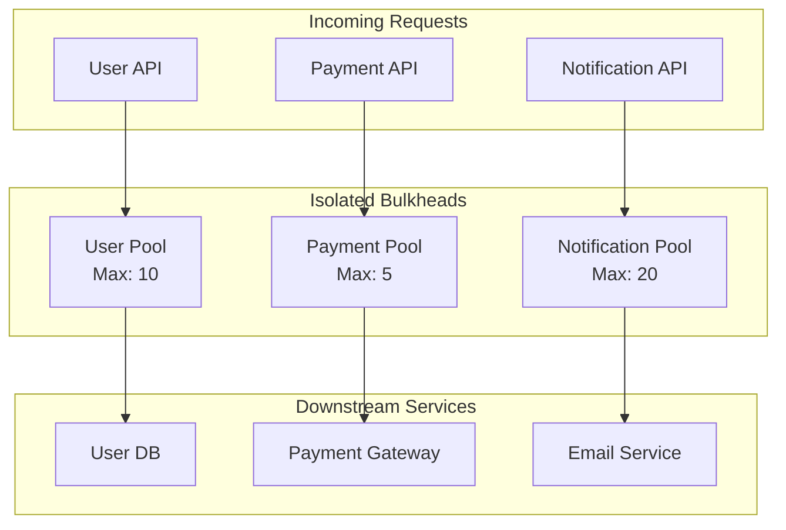

# How to Implement Bulkhead Pattern in Node.js

Author: [nawazdhandala](https://www.github.com/nawazdhandala)

Tags: Node.js, Bulkhead Pattern, Resilience, Microservices, Fault Isolation, Design Patterns, Concurrency

Description: Learn how to implement the bulkhead pattern in Node.js to isolate failures and prevent cascading outages. This guide covers resource pooling, semaphores, and practical implementations for building resilient services.

---

> When one part of your system fails, the whole thing should not go down with it. The bulkhead pattern isolates components so that failures stay contained. Like watertight compartments in a ship, bulkheads keep your services afloat.

A single slow database query or external API can consume all your resources, starving other requests. Bulkheads prevent this by limiting resource consumption per component.

---

## Overview



---

## Why Use Bulkheads?

Without bulkheads, a slow external service can cascade failures:

1. Payment API becomes slow
2. All threads wait on payment calls
3. No threads left for user requests
4. Entire application becomes unresponsive

Bulkheads limit concurrent operations per component, ensuring failures stay isolated.

---

## Basic Semaphore Implementation

A semaphore limits concurrent access to a resource:

```typescript
// semaphore.ts

// Semaphore controls access to a limited resource pool
// Only a fixed number of operations can run concurrently
class Semaphore {
  private permits: number;
  private waitQueue: Array<() => void> = [];

  constructor(permits: number) {
    // Maximum concurrent operations allowed
    this.permits = permits;
  }

  // Acquire a permit before accessing the protected resource
  // Returns a promise that resolves when a permit is available
  async acquire(): Promise<void> {
    if (this.permits > 0) {
      // Permit available, decrement and proceed immediately
      this.permits--;
      return Promise.resolve();
    }

    // No permits available, wait in queue
    return new Promise<void>((resolve) => {
      this.waitQueue.push(resolve);
    });
  }

  // Release a permit after completing the operation
  // This allows the next waiting operation to proceed
  release(): void {
    if (this.waitQueue.length > 0) {
      // Someone is waiting, give them the permit
      const nextInLine = this.waitQueue.shift()!;
      nextInLine();
    } else {
      // No one waiting, return permit to pool
      this.permits++;
    }
  }

  // Get current number of available permits
  available(): number {
    return this.permits;
  }

  // Get number of operations waiting for permits
  waiting(): number {
    return this.waitQueue.length;
  }
}

// Usage example
const dbSemaphore = new Semaphore(10);  // Max 10 concurrent DB operations

async function queryDatabase(sql: string): Promise<any> {
  await dbSemaphore.acquire();
  try {
    // Execute database query
    return await db.query(sql);
  } finally {
    // Always release, even if query fails
    dbSemaphore.release();
  }
}
```

---

## Bulkhead with Timeout

Add timeout support to prevent indefinite waiting:

```typescript
// bulkhead.ts

interface BulkheadOptions {
  maxConcurrent: number;      // Maximum concurrent operations
  maxWaiting: number;         // Maximum operations in wait queue
  timeoutMs: number;          // Maximum time to wait for a permit
}

class Bulkhead {
  private name: string;
  private permits: number;
  private maxWaiting: number;
  private timeoutMs: number;
  private waitQueue: Array<{
    resolve: () => void;
    reject: (error: Error) => void;
    timer: NodeJS.Timeout;
  }> = [];

  // Track metrics for monitoring
  private metrics = {
    acquired: 0,
    rejected: 0,
    timedOut: 0,
    completed: 0,
    failed: 0
  };

  constructor(name: string, options: BulkheadOptions) {
    this.name = name;
    this.permits = options.maxConcurrent;
    this.maxWaiting = options.maxWaiting;
    this.timeoutMs = options.timeoutMs;
  }

  async acquire(): Promise<void> {
    if (this.permits > 0) {
      this.permits--;
      this.metrics.acquired++;
      return;
    }

    // Check if wait queue is full
    if (this.waitQueue.length >= this.maxWaiting) {
      this.metrics.rejected++;
      throw new BulkheadRejectedException(
        `Bulkhead ${this.name} is full. Max concurrent: ${this.permits}, waiting: ${this.waitQueue.length}`
      );
    }

    // Wait for a permit with timeout
    return new Promise<void>((resolve, reject) => {
      // Set timeout to reject if we wait too long
      const timer = setTimeout(() => {
        // Remove from queue
        const index = this.waitQueue.findIndex(w => w.timer === timer);
        if (index !== -1) {
          this.waitQueue.splice(index, 1);
        }
        this.metrics.timedOut++;
        reject(new BulkheadTimeoutException(
          `Bulkhead ${this.name} timeout after ${this.timeoutMs}ms`
        ));
      }, this.timeoutMs);

      this.waitQueue.push({ resolve, reject, timer });
    });
  }

  release(success: boolean = true): void {
    if (success) {
      this.metrics.completed++;
    } else {
      this.metrics.failed++;
    }

    if (this.waitQueue.length > 0) {
      const next = this.waitQueue.shift()!;
      clearTimeout(next.timer);
      this.metrics.acquired++;
      next.resolve();
    } else {
      this.permits++;
    }
  }

  // Execute a function within the bulkhead
  async execute<T>(fn: () => Promise<T>): Promise<T> {
    await this.acquire();
    let success = true;
    try {
      return await fn();
    } catch (error) {
      success = false;
      throw error;
    } finally {
      this.release(success);
    }
  }

  getMetrics() {
    return {
      name: this.name,
      availablePermits: this.permits,
      waitingCount: this.waitQueue.length,
      ...this.metrics
    };
  }
}

// Custom error types for different failure modes
class BulkheadRejectedException extends Error {
  constructor(message: string) {
    super(message);
    this.name = 'BulkheadRejectedException';
  }
}

class BulkheadTimeoutException extends Error {
  constructor(message: string) {
    super(message);
    this.name = 'BulkheadTimeoutException';
  }
}
```

---

## Bulkhead Registry

Create a registry to manage multiple bulkheads:

```typescript
// bulkhead-registry.ts

interface BulkheadConfig {
  maxConcurrent: number;
  maxWaiting: number;
  timeoutMs: number;
}

// Default configurations for different service types
const DEFAULT_CONFIGS: Record<string, BulkheadConfig> = {
  database: { maxConcurrent: 20, maxWaiting: 50, timeoutMs: 5000 },
  externalApi: { maxConcurrent: 10, maxWaiting: 20, timeoutMs: 10000 },
  cache: { maxConcurrent: 50, maxWaiting: 100, timeoutMs: 1000 }
};

class BulkheadRegistry {
  private bulkheads: Map<string, Bulkhead> = new Map();

  // Register a new bulkhead with custom configuration
  register(name: string, config: BulkheadConfig): Bulkhead {
    if (this.bulkheads.has(name)) {
      throw new Error(`Bulkhead ${name} already registered`);
    }

    const bulkhead = new Bulkhead(name, config);
    this.bulkheads.set(name, bulkhead);
    return bulkhead;
  }

  // Get an existing bulkhead or create with default config
  get(name: string, type: string = 'database'): Bulkhead {
    if (!this.bulkheads.has(name)) {
      const config = DEFAULT_CONFIGS[type] || DEFAULT_CONFIGS.database;
      this.register(name, config);
    }
    return this.bulkheads.get(name)!;
  }

  // Get metrics for all registered bulkheads
  getAllMetrics(): Record<string, any> {
    const metrics: Record<string, any> = {};
    for (const [name, bulkhead] of this.bulkheads) {
      metrics[name] = bulkhead.getMetrics();
    }
    return metrics;
  }

  // Reset all bulkheads (useful for testing)
  reset(): void {
    this.bulkheads.clear();
  }
}

// Singleton instance for application-wide use
export const bulkheadRegistry = new BulkheadRegistry();
```

---

## Decorator Pattern for Easy Usage

Create decorators for applying bulkheads to class methods:

```typescript
// decorators.ts
import { bulkheadRegistry } from './bulkhead-registry';

// Decorator factory for protecting methods with bulkheads
function WithBulkhead(bulkheadName: string, type?: string) {
  return function (
    target: any,
    propertyKey: string,
    descriptor: PropertyDescriptor
  ) {
    const originalMethod = descriptor.value;

    descriptor.value = async function (...args: any[]) {
      const bulkhead = bulkheadRegistry.get(bulkheadName, type);

      return bulkhead.execute(async () => {
        return originalMethod.apply(this, args);
      });
    };

    return descriptor;
  };
}

// Example service using the decorator
class PaymentService {

  // This method is protected by a bulkhead with max 5 concurrent calls
  @WithBulkhead('payment-gateway', 'externalApi')
  async processPayment(orderId: string, amount: number): Promise<PaymentResult> {
    // Call external payment gateway
    const response = await fetch('https://api.payment.com/charge', {
      method: 'POST',
      headers: { 'Content-Type': 'application/json' },
      body: JSON.stringify({ orderId, amount })
    });

    return response.json();
  }

  @WithBulkhead('payment-db', 'database')
  async saveTransaction(transaction: Transaction): Promise<void> {
    await db.query(
      'INSERT INTO transactions (id, order_id, amount, status) VALUES ($1, $2, $3, $4)',
      [transaction.id, transaction.orderId, transaction.amount, transaction.status]
    );
  }
}

interface PaymentResult {
  success: boolean;
  transactionId: string;
}

interface Transaction {
  id: string;
  orderId: string;
  amount: number;
  status: string;
}
```

---

## Thread Pool Bulkhead

For CPU-intensive operations, use worker threads with bulkheads:

```typescript
// worker-bulkhead.ts
import { Worker } from 'worker_threads';
import * as os from 'os';

interface WorkerTask<T> {
  resolve: (value: T) => void;
  reject: (error: Error) => void;
  script: string;
  data: any;
}

// Bulkhead that manages a pool of worker threads
class WorkerPoolBulkhead {
  private workers: Worker[] = [];
  private availableWorkers: Worker[] = [];
  private taskQueue: WorkerTask<any>[] = [];
  private maxWorkers: number;
  private maxQueueSize: number;

  constructor(
    maxWorkers: number = os.cpus().length,
    maxQueueSize: number = 100
  ) {
    this.maxWorkers = maxWorkers;
    this.maxQueueSize = maxQueueSize;
  }

  // Execute a script in a worker thread
  async execute<T>(script: string, data: any): Promise<T> {
    // Check if queue is full
    if (this.taskQueue.length >= this.maxQueueSize) {
      throw new Error('Worker pool queue is full');
    }

    return new Promise<T>((resolve, reject) => {
      const task: WorkerTask<T> = { resolve, reject, script, data };

      if (this.availableWorkers.length > 0) {
        // Worker available, run immediately
        this.runTask(this.availableWorkers.pop()!, task);
      } else if (this.workers.length < this.maxWorkers) {
        // Can create new worker
        const worker = this.createWorker();
        this.runTask(worker, task);
      } else {
        // All workers busy, queue the task
        this.taskQueue.push(task);
      }
    });
  }

  private createWorker(): Worker {
    // Create a generic worker that can run any script
    const workerCode = `
      const { parentPort, workerData } = require('worker_threads');
      const vm = require('vm');

      parentPort.on('message', async (task) => {
        try {
          // Run the provided script with the data
          const fn = new Function('data', task.script);
          const result = await fn(task.data);
          parentPort.postMessage({ success: true, result });
        } catch (error) {
          parentPort.postMessage({ success: false, error: error.message });
        }
      });
    `;

    const worker = new Worker(workerCode, { eval: true });
    this.workers.push(worker);
    return worker;
  }

  private runTask<T>(worker: Worker, task: WorkerTask<T>): void {
    // Set up one-time message handler for this task
    const handler = (message: { success: boolean; result?: T; error?: string }) => {
      worker.off('message', handler);

      if (message.success) {
        task.resolve(message.result!);
      } else {
        task.reject(new Error(message.error));
      }

      // Worker is now available
      this.onWorkerAvailable(worker);
    };

    worker.on('message', handler);
    worker.postMessage({ script: task.script, data: task.data });
  }

  private onWorkerAvailable(worker: Worker): void {
    if (this.taskQueue.length > 0) {
      // More tasks waiting, run next one
      const nextTask = this.taskQueue.shift()!;
      this.runTask(worker, nextTask);
    } else {
      // No tasks, mark worker as available
      this.availableWorkers.push(worker);
    }
  }

  // Get pool statistics
  getStats() {
    return {
      totalWorkers: this.workers.length,
      availableWorkers: this.availableWorkers.length,
      queuedTasks: this.taskQueue.length
    };
  }

  // Shutdown all workers
  async shutdown(): Promise<void> {
    await Promise.all(this.workers.map(w => w.terminate()));
    this.workers = [];
    this.availableWorkers = [];
  }
}

// Usage example
const cpuBulkhead = new WorkerPoolBulkhead(4, 50);

async function processImage(imageData: Buffer): Promise<Buffer> {
  return cpuBulkhead.execute<Buffer>(
    `
      // CPU-intensive image processing
      const sharp = require('sharp');
      return sharp(data)
        .resize(800, 600)
        .jpeg({ quality: 80 })
        .toBuffer();
    `,
    imageData
  );
}
```

---

## Express Middleware Integration

Integrate bulkheads with Express routes:

```typescript
// middleware.ts
import { Request, Response, NextFunction } from 'express';
import { bulkheadRegistry } from './bulkhead-registry';
import { BulkheadRejectedException, BulkheadTimeoutException } from './bulkhead';

// Middleware factory that applies bulkhead to a route
function bulkheadMiddleware(bulkheadName: string, type?: string) {
  return async (req: Request, res: Response, next: NextFunction) => {
    const bulkhead = bulkheadRegistry.get(bulkheadName, type);

    try {
      await bulkhead.acquire();

      // Release bulkhead when response finishes
      res.on('finish', () => {
        bulkhead.release(res.statusCode < 500);
      });

      // Release on connection close (client disconnect)
      res.on('close', () => {
        if (!res.writableEnded) {
          bulkhead.release(false);
        }
      });

      next();
    } catch (error) {
      if (error instanceof BulkheadRejectedException) {
        // Service overloaded, return 503
        res.status(503).json({
          error: 'Service Unavailable',
          message: 'Server is overloaded. Please try again later.',
          retryAfter: 5
        });
      } else if (error instanceof BulkheadTimeoutException) {
        // Timeout waiting for resources
        res.status(504).json({
          error: 'Gateway Timeout',
          message: 'Request timed out waiting for resources.'
        });
      } else {
        next(error);
      }
    }
  };
}

// Apply to routes
import express from 'express';

const app = express();

// Payment routes have strict concurrency limits
app.post('/api/payments',
  bulkheadMiddleware('payment-api', 'externalApi'),
  async (req, res) => {
    const result = await paymentService.processPayment(req.body);
    res.json(result);
  }
);

// User routes can handle more traffic
app.get('/api/users/:id',
  bulkheadMiddleware('user-api', 'database'),
  async (req, res) => {
    const user = await userService.findById(req.params.id);
    res.json(user);
  }
);

// Health check endpoint exposes bulkhead metrics
app.get('/health/bulkheads', (req, res) => {
  res.json(bulkheadRegistry.getAllMetrics());
});
```

---

## Monitoring and Alerting

Export bulkhead metrics for monitoring systems:

```typescript
// metrics.ts
import { Registry, Gauge, Counter } from 'prom-client';
import { bulkheadRegistry } from './bulkhead-registry';

const register = new Registry();

// Create Prometheus metrics for bulkheads
const availablePermits = new Gauge({
  name: 'bulkhead_available_permits',
  help: 'Number of available permits in bulkhead',
  labelNames: ['bulkhead'],
  registers: [register]
});

const waitingCount = new Gauge({
  name: 'bulkhead_waiting_count',
  help: 'Number of operations waiting for permits',
  labelNames: ['bulkhead'],
  registers: [register]
});

const rejectedTotal = new Counter({
  name: 'bulkhead_rejected_total',
  help: 'Total rejected operations',
  labelNames: ['bulkhead'],
  registers: [register]
});

const timeoutTotal = new Counter({
  name: 'bulkhead_timeout_total',
  help: 'Total timed out operations',
  labelNames: ['bulkhead'],
  registers: [register]
});

// Update metrics periodically
setInterval(() => {
  const allMetrics = bulkheadRegistry.getAllMetrics();

  for (const [name, metrics] of Object.entries(allMetrics)) {
    availablePermits.set({ bulkhead: name }, metrics.availablePermits);
    waitingCount.set({ bulkhead: name }, metrics.waitingCount);
  }
}, 5000);

// Export metrics endpoint
export async function getMetrics(): Promise<string> {
  return register.metrics();
}
```

---

## Best Practices

1. **Size bulkheads appropriately** based on downstream capacity
2. **Monitor queue depths** and alert on sustained high levels
3. **Set realistic timeouts** to fail fast when overloaded
4. **Use different bulkheads** for different downstream services
5. **Combine with circuit breakers** for complete resilience
6. **Test under load** to validate bulkhead sizing

---

## Conclusion

The bulkhead pattern prevents cascading failures by isolating resource consumption. Key takeaways:

- **Semaphores** limit concurrent operations
- **Timeouts** prevent indefinite waiting
- **Separate bulkheads** for different services
- **Metrics** help right-size your bulkheads

Combined with circuit breakers and retry logic, bulkheads form the foundation of resilient microservices architecture.

---

*Need visibility into your service resilience? [OneUptime](https://oneuptime.com) provides monitoring and alerting that helps you track bulkhead metrics and respond to capacity issues before they become outages.*
