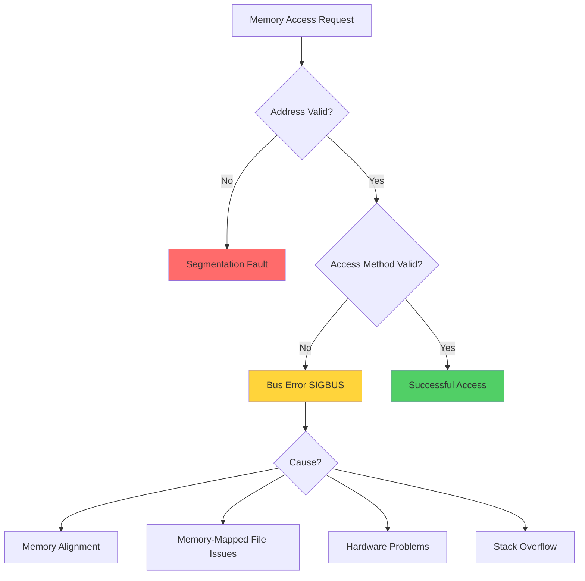
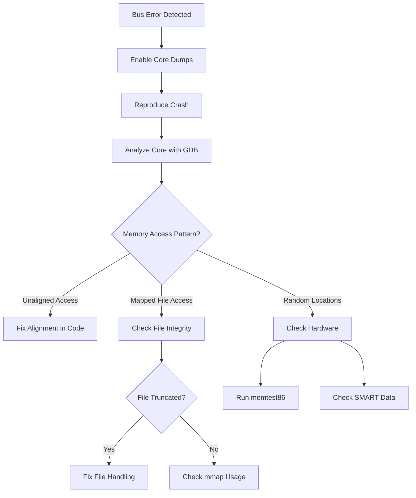

# How to Fix "Bus Error" Errors in Linux

Author: [nawazdhandala](https://www.github.com/nawazdhandala)

Tags: Linux, Troubleshooting, Memory, Hardware, System Administration, Debugging, Signals

Description: Learn how to diagnose and fix bus error (SIGBUS) errors in Linux, including memory alignment issues, memory-mapped file problems, and hardware failures.

---

A bus error (SIGBUS) is one of the more cryptic errors you might encounter on Linux systems. Unlike segmentation faults which indicate memory access to invalid addresses, bus errors typically indicate issues with how memory is being accessed. This guide explains the causes of bus errors and provides practical solutions for diagnosing and fixing them.

## Understanding Bus Errors

A bus error occurs when the CPU cannot complete a memory access operation. This is fundamentally different from a segmentation fault, which occurs when accessing invalid memory addresses. Bus errors happen when accessing valid addresses in invalid ways.



## Common Causes of Bus Errors

### 1. Memory Alignment Issues

Some CPU architectures require data to be aligned to specific memory boundaries. Accessing unaligned memory can cause bus errors.

```c
/*
 * Example of memory alignment issue (C code)
 * This demonstrates how misaligned access can cause bus errors
 */
#include <stdio.h>
#include <stdlib.h>

int main() {
    // Allocate a character array
    char buffer[10];

    // Create a misaligned integer pointer
    // The +1 offset means the pointer is not aligned to 4-byte boundary
    int *misaligned = (int *)(buffer + 1);

    // This access may cause a bus error on strict alignment architectures
    // On x86/x64, this might work but be slower
    // On ARM or SPARC, this will likely cause SIGBUS
    *misaligned = 42;  // Potential bus error!

    return 0;
}
```

### 2. Memory-Mapped File Problems

Bus errors commonly occur with memory-mapped files when the underlying file is truncated or removed.

```c
/*
 * Example of memory-mapped file causing bus error
 */
#include <stdio.h>
#include <sys/mman.h>
#include <fcntl.h>
#include <unistd.h>

int main() {
    int fd = open("test.txt", O_RDWR);

    // Memory map the file
    char *mapped = mmap(NULL, 4096, PROT_READ | PROT_WRITE,
                        MAP_SHARED, fd, 0);

    // If another process truncates the file while we have it mapped,
    // accessing the mapped region will cause a bus error

    // This access causes SIGBUS if file was truncated
    char c = mapped[1000];  // Bus error if offset beyond file size!

    munmap(mapped, 4096);
    close(fd);
    return 0;
}
```

### 3. Hardware Memory Issues

Faulty RAM or storage devices can cause bus errors when accessing corrupted memory regions.

## Diagnosing Bus Errors

### Step 1: Capture Core Dump

First, ensure core dumps are enabled to capture debugging information.

```bash
# Check current core dump settings
ulimit -c

# Enable core dumps (no size limit)
ulimit -c unlimited

# Set core dump file location
# Creates core files with process ID in /tmp
echo '/tmp/core.%e.%p' | sudo tee /proc/sys/kernel/core_pattern

# Make the setting permanent by adding to sysctl.conf
echo 'kernel.core_pattern=/tmp/core.%e.%p' | sudo tee -a /etc/sysctl.conf
sudo sysctl -p
```

### Step 2: Analyze with GDB

```bash
# Run the crashing program under GDB
gdb ./your_program

# Inside GDB, run the program
(gdb) run

# When it crashes, examine the backtrace
(gdb) backtrace
# or the shorter form
(gdb) bt

# Examine the registers at crash time
(gdb) info registers

# Look at the faulting instruction
(gdb) x/i $pc

# If you have a core dump file, analyze it
gdb ./your_program /tmp/core.your_program.12345
(gdb) bt
```

### Step 3: Use strace to Trace System Calls

```bash
# Trace system calls and signals
# This shows what the program was doing before the crash
strace -f ./your_program 2>&1 | tee strace_output.txt

# Look for the fatal signal
grep -E '(SIGBUS|mmap|munmap)' strace_output.txt

# Trace memory-related system calls specifically
strace -e trace=memory ./your_program
```

### Step 4: Check for Memory-Mapped File Issues

```bash
# Check what files a process has mapped
# Replace PID with the actual process ID
cat /proc/<PID>/maps

# Check open file descriptors
ls -la /proc/<PID>/fd

# Monitor file system events that might affect mapped files
inotifywait -m /path/to/mapped/files/
```



## Fixing Bus Errors

### Fix 1: Memory Alignment Issues

```c
/*
 * Safe way to handle potentially unaligned data
 */
#include <string.h>
#include <stdint.h>

// Instead of casting pointers directly, use memcpy
void safe_read_int(char *buffer, int offset, int *result) {
    // memcpy handles alignment safely on all architectures
    memcpy(result, buffer + offset, sizeof(int));
}

// For structures, use compiler attributes to ensure alignment
struct __attribute__((aligned(8))) aligned_data {
    uint64_t value;
    char name[32];
};

// Or use packed structures when reading binary data
struct __attribute__((packed)) binary_header {
    uint32_t magic;
    uint16_t version;
    uint32_t size;
};

int main() {
    char buffer[100];
    int value;

    // Safe unaligned read
    safe_read_int(buffer, 1, &value);

    return 0;
}
```

### Fix 2: Proper Memory-Mapped File Handling

```c
/*
 * Safe memory-mapped file handling with error checking
 */
#include <stdio.h>
#include <stdlib.h>
#include <sys/mman.h>
#include <sys/stat.h>
#include <fcntl.h>
#include <unistd.h>
#include <signal.h>
#include <setjmp.h>

static sigjmp_buf jump_buffer;
static volatile sig_atomic_t got_sigbus = 0;

// Signal handler for SIGBUS
void sigbus_handler(int sig) {
    got_sigbus = 1;
    siglongjmp(jump_buffer, 1);
}

// Safe memory-mapped file access
int safe_mmap_access(const char *filename) {
    int fd = open(filename, O_RDONLY);
    if (fd < 0) {
        perror("open failed");
        return -1;
    }

    // Get the current file size
    struct stat st;
    if (fstat(fd, &st) < 0) {
        perror("fstat failed");
        close(fd);
        return -1;
    }

    if (st.st_size == 0) {
        fprintf(stderr, "File is empty\n");
        close(fd);
        return -1;
    }

    // Map the file
    char *mapped = mmap(NULL, st.st_size, PROT_READ,
                        MAP_PRIVATE, fd, 0);
    if (mapped == MAP_FAILED) {
        perror("mmap failed");
        close(fd);
        return -1;
    }

    // Set up SIGBUS handler
    struct sigaction sa, old_sa;
    sa.sa_handler = sigbus_handler;
    sigemptyset(&sa.sa_mask);
    sa.sa_flags = 0;
    sigaction(SIGBUS, &sa, &old_sa);

    // Safe access with signal handling
    if (sigsetjmp(jump_buffer, 1) == 0) {
        // Normal execution - access the mapped memory
        for (off_t i = 0; i < st.st_size; i++) {
            // Process each byte
            char c = mapped[i];
            // ... do something with c
        }
    } else {
        // Got SIGBUS - handle the error
        fprintf(stderr, "Bus error accessing mapped file\n");
    }

    // Restore original signal handler
    sigaction(SIGBUS, &old_sa, NULL);

    // Clean up
    munmap(mapped, st.st_size);
    close(fd);

    return got_sigbus ? -1 : 0;
}
```

### Fix 3: Using madvise for Large Mappings

```bash
# For shell scripts dealing with memory-mapped files
# Use mmap-friendly tools and settings
```

```c
/*
 * Use madvise to hint to the kernel about memory access patterns
 */
#include <sys/mman.h>

void setup_mmap_hints(void *addr, size_t length) {
    // Tell the kernel we will access sequentially
    // This helps the kernel prefetch data and handle page faults better
    madvise(addr, length, MADV_SEQUENTIAL);

    // Or if random access pattern
    // madvise(addr, length, MADV_RANDOM);

    // Advise that the pages will be needed soon
    madvise(addr, length, MADV_WILLNEED);
}
```

### Fix 4: Handling Hardware Issues

```bash
# Check system memory for errors
# This requires a reboot and runs from GRUB or boot menu
# Schedule memtest86+ at next boot

# On systems with memtest installed
sudo memtest86+

# Check SMART status of storage devices
# This helps identify failing drives that might cause bus errors
sudo smartctl -a /dev/sda

# Look for specific error indicators
sudo smartctl -a /dev/sda | grep -E '(Reallocated|Pending|Uncorrectable)'

# Check kernel messages for hardware errors
dmesg | grep -iE '(error|hardware|bus|memory|mce)'

# Check for Machine Check Exceptions (MCEs)
# These indicate hardware errors reported by the CPU
sudo mcelog --client

# Install and configure mcelog for continuous monitoring
sudo apt install mcelog    # Debian/Ubuntu
sudo yum install mcelog    # RHEL/CentOS
sudo systemctl enable mcelog
sudo systemctl start mcelog
```

### Fix 5: Stack Overflow Prevention

Bus errors can occur due to stack overflow. Increase stack size if needed.

```bash
# Check current stack size limit
ulimit -s

# Increase stack size to 16MB
ulimit -s 16384

# Make permanent for a user by adding to .bashrc
echo 'ulimit -s 16384' >> ~/.bashrc

# For system-wide changes, edit limits.conf
echo '* soft stack 16384' | sudo tee -a /etc/security/limits.conf
echo '* hard stack 32768' | sudo tee -a /etc/security/limits.conf
```

```c
/*
 * Example: Detecting stack overflow potential
 */
#include <stdio.h>
#include <sys/resource.h>

void check_stack_usage() {
    struct rlimit rl;
    getrlimit(RLIMIT_STACK, &rl);

    printf("Stack soft limit: %lu bytes\n", rl.rlim_cur);
    printf("Stack hard limit: %lu bytes\n", rl.rlim_max);
}

// Avoid deep recursion that can cause stack overflow
// Use iterative approaches instead
int factorial_iterative(int n) {
    int result = 1;
    for (int i = 2; i <= n; i++) {
        result *= i;
    }
    return result;
}
```

## Debugging Tools Summary

```mermaid
flowchart LR
    subgraph Analysis Tools
        A[GDB]
        B[strace]
        C[ltrace]
        D[valgrind]
    end

    subgraph Hardware Diagnostics
        E[memtest86+]
        F[smartctl]
        G[mcelog]
    end

    subgraph System Info
        H[dmesg]
        I[/proc/maps]
        J[core dumps]
    end

    A --> K[Memory Issues]
    B --> K
    D --> K
    E --> L[Hardware Issues]
    F --> L
    G --> L
```

### Using Valgrind for Memory Analysis

```bash
# Run program under valgrind to detect memory issues
# This is slower but provides detailed memory error information
valgrind --tool=memcheck --leak-check=full ./your_program

# For alignment issues specifically
valgrind --tool=exp-sgcheck ./your_program

# Generate a detailed report
valgrind --tool=memcheck --xml=yes --xml-file=valgrind_report.xml ./your_program
```

## Prevention Best Practices

### 1. Code Review Checklist

- Verify pointer alignment before type casting
- Check file sizes before mapping
- Handle SIGBUS in memory-mapped file code
- Avoid deep recursion
- Use safe memory copy functions

### 2. Testing Strategies

```bash
# Test with Address Sanitizer during development
# Compile with sanitizer flags
gcc -fsanitize=address -g -o program program.c

# Run the sanitized program
./program

# The sanitizer will report memory issues with detailed backtraces
```

### 3. Monitoring in Production

```bash
#!/bin/bash
# Monitor for bus errors in system logs

# Create a monitoring script
cat << 'EOF' > /usr/local/bin/monitor-bus-errors.sh
#!/bin/bash

# Check dmesg for bus error related messages
bus_errors=$(dmesg | grep -ic "bus error\|sigbus")

if [ "$bus_errors" -gt 0 ]; then
    echo "Warning: $bus_errors bus error related messages found in dmesg"
    dmesg | grep -i "bus error\|sigbus" | tail -10
fi

# Check for core dumps from bus errors
if ls /tmp/core.* 1> /dev/null 2>&1; then
    echo "Core dumps found:"
    ls -la /tmp/core.* | tail -10
fi
EOF

chmod +x /usr/local/bin/monitor-bus-errors.sh
```

## Conclusion

Bus errors can be challenging to debug because they often indicate issues at the boundary between software and hardware. By understanding the common causes - memory alignment, memory-mapped file issues, and hardware problems - you can systematically diagnose and fix these errors.

**Key Takeaways:**
- Bus errors are different from segmentation faults - they indicate invalid access methods, not invalid addresses
- Memory alignment issues are architecture-dependent - code that works on x86 may fail on ARM
- Memory-mapped files require careful handling when the underlying file changes
- Hardware diagnostics are essential when bus errors occur randomly
- Use proper signal handlers and error checking in production code

**Related Reading:**
- [How to Fix "Broken Pipe" Errors in Linux](https://oneuptime.com/blog/post/2026-01-24-broken-pipe-errors/view)
- [How to Fix "Read-Only File System" Errors](https://oneuptime.com/blog/post/2026-01-24-read-only-file-system-errors/view)
