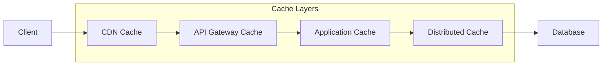
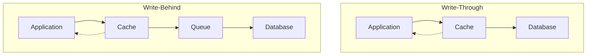
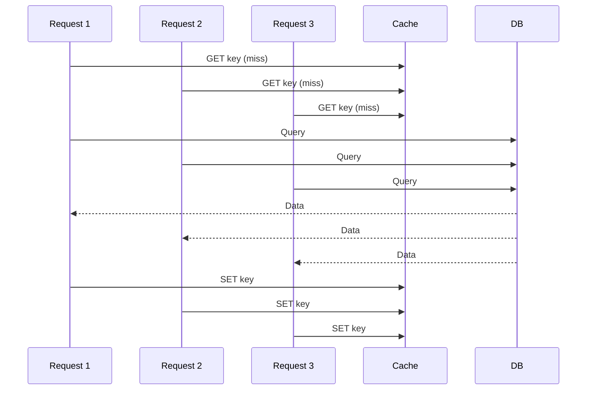

# How to Handle Caching Strategies

Author: [nawazdhandala](https://www.github.com/nawazdhandala)

Tags: Caching, Performance, Redis, Architecture, Backend, DevOps

Description: Learn how to implement effective caching strategies including cache invalidation patterns, multi-tier caching, and best practices for high-performance applications.

---

Caching is one of the most effective ways to improve application performance. A well-designed caching strategy can reduce database load by 90%, cut response times from seconds to milliseconds, and handle traffic spikes that would otherwise overwhelm your infrastructure. But caching done poorly creates stale data bugs, memory bloat, and debugging nightmares. This guide covers practical caching strategies that actually work in production.

## Understanding Cache Layers

Modern applications typically use multiple cache layers, each serving a different purpose:



| Cache Layer | Location | TTL Range | Use Case |
|-------------|----------|-----------|----------|
| **Browser Cache** | Client | Minutes to days | Static assets, API responses |
| **CDN Cache** | Edge servers | Hours to days | Static content, public API responses |
| **Application Cache** | Memory | Seconds to minutes | Hot data, computed values |
| **Distributed Cache** | Redis/Memcached | Minutes to hours | Session data, shared state |

## Cache-Aside Pattern

The cache-aside pattern is the most common caching strategy. The application checks the cache first, and on a miss, fetches from the database and populates the cache.

```javascript
// cache-aside.js - Basic cache-aside implementation
const Redis = require('ioredis');
const redis = new Redis(process.env.REDIS_URL);

class CacheAside {
  constructor(options = {}) {
    this.defaultTTL = options.ttl || 3600; // 1 hour default
    this.prefix = options.prefix || 'cache:';
  }

  // Generate cache key from function name and arguments
  generateKey(namespace, ...args) {
    const argsHash = JSON.stringify(args);
    return `${this.prefix}${namespace}:${argsHash}`;
  }

  async get(key) {
    const data = await redis.get(key);
    if (data) {
      return JSON.parse(data);
    }
    return null;
  }

  async set(key, value, ttl = this.defaultTTL) {
    await redis.setex(key, ttl, JSON.stringify(value));
  }

  async delete(key) {
    await redis.del(key);
  }

  // Wrapper function for cache-aside pattern
  async wrap(namespace, fetchFn, ttl = this.defaultTTL, ...args) {
    const key = this.generateKey(namespace, ...args);

    // Try cache first
    let data = await this.get(key);
    if (data !== null) {
      return data;
    }

    // Cache miss - fetch from source
    data = await fetchFn(...args);

    // Store in cache (don't await to avoid blocking)
    this.set(key, data, ttl).catch(err => {
      console.error('Cache set failed:', err);
    });

    return data;
  }
}

// Usage example
const cache = new CacheAside({ prefix: 'app:', ttl: 300 });

async function getUserById(userId) {
  return cache.wrap(
    'user',
    async (id) => {
      // This only runs on cache miss
      const user = await db.query('SELECT * FROM users WHERE id = ?', [id]);
      return user;
    },
    300, // 5 minute TTL
    userId
  );
}
```

## Write-Through and Write-Behind Patterns

For write-heavy workloads, consider write-through or write-behind caching:



```javascript
// write-through.js - Write-through cache implementation
class WriteThroughCache {
  constructor(redis, db) {
    this.redis = redis;
    this.db = db;
    this.prefix = 'wt:';
  }

  async get(key) {
    const cached = await this.redis.get(this.prefix + key);
    if (cached) {
      return JSON.parse(cached);
    }

    // Fetch from DB and cache
    const data = await this.db.get(key);
    if (data) {
      await this.redis.setex(this.prefix + key, 3600, JSON.stringify(data));
    }
    return data;
  }

  // Write-through: write to both cache and DB synchronously
  async set(key, value, ttl = 3600) {
    // Write to database first (source of truth)
    await this.db.set(key, value);

    // Then update cache
    await this.redis.setex(this.prefix + key, ttl, JSON.stringify(value));

    return value;
  }

  async delete(key) {
    // Delete from both
    await Promise.all([
      this.db.delete(key),
      this.redis.del(this.prefix + key)
    ]);
  }
}

// write-behind.js - Write-behind with queue
class WriteBehindCache {
  constructor(redis, db, queue) {
    this.redis = redis;
    this.db = db;
    this.queue = queue;
    this.prefix = 'wb:';
  }

  async set(key, value, ttl = 3600) {
    // Write to cache immediately (fast response)
    await this.redis.setex(this.prefix + key, ttl, JSON.stringify(value));

    // Queue database write (async, may be batched)
    await this.queue.add('db-write', {
      operation: 'set',
      key,
      value,
      timestamp: Date.now()
    });

    return value;
  }
}

// Queue worker for write-behind
async function processWriteBehindQueue(job) {
  const { operation, key, value } = job.data;

  if (operation === 'set') {
    await db.set(key, value);
  } else if (operation === 'delete') {
    await db.delete(key);
  }
}
```

## Cache Invalidation Strategies

Cache invalidation is famously one of the hardest problems in computer science. Here are proven strategies:

### Time-Based Expiration (TTL)

The simplest approach - let cached data expire after a set time:

```javascript
// ttl-strategy.js - TTL-based caching with staggered expiration
class TTLCache {
  constructor(redis) {
    this.redis = redis;
  }

  // Add jitter to prevent thundering herd
  calculateTTL(baseTTL) {
    const jitter = Math.floor(Math.random() * (baseTTL * 0.1));
    return baseTTL + jitter;
  }

  async set(key, value, baseTTL) {
    const ttl = this.calculateTTL(baseTTL);
    await this.redis.setex(key, ttl, JSON.stringify(value));
  }

  // Stale-while-revalidate pattern
  async getWithRevalidation(key, fetchFn, ttl, staleThreshold = 0.8) {
    const data = await this.redis.get(key);
    const remaining = await this.redis.ttl(key);

    if (data) {
      const parsed = JSON.parse(data);

      // If TTL is below threshold, revalidate in background
      if (remaining < ttl * (1 - staleThreshold)) {
        this.revalidate(key, fetchFn, ttl).catch(console.error);
      }

      return parsed;
    }

    // Cache miss
    const freshData = await fetchFn();
    await this.set(key, freshData, ttl);
    return freshData;
  }

  async revalidate(key, fetchFn, ttl) {
    const freshData = await fetchFn();
    await this.set(key, freshData, ttl);
  }
}
```

### Event-Based Invalidation

Invalidate cache when data changes:

```javascript
// event-invalidation.js - Event-driven cache invalidation
const EventEmitter = require('events');

class EventBasedCache extends EventEmitter {
  constructor(redis) {
    super();
    this.redis = redis;
    this.setupSubscriber();
  }

  setupSubscriber() {
    // Separate connection for pub/sub
    this.subscriber = this.redis.duplicate();

    this.subscriber.subscribe('cache:invalidate', (err) => {
      if (err) console.error('Subscribe error:', err);
    });

    this.subscriber.on('message', async (channel, message) => {
      const { pattern, keys } = JSON.parse(message);

      if (pattern) {
        // Invalidate by pattern
        const matchingKeys = await this.redis.keys(pattern);
        if (matchingKeys.length > 0) {
          await this.redis.del(...matchingKeys);
        }
      } else if (keys) {
        // Invalidate specific keys
        await this.redis.del(...keys);
      }

      this.emit('invalidated', { pattern, keys });
    });
  }

  async invalidate(keys) {
    await this.redis.publish('cache:invalidate', JSON.stringify({ keys }));
  }

  async invalidatePattern(pattern) {
    await this.redis.publish('cache:invalidate', JSON.stringify({ pattern }));
  }
}

// Usage with database triggers
async function updateUser(userId, data) {
  await db.query('UPDATE users SET ? WHERE id = ?', [data, userId]);

  // Invalidate all caches related to this user
  await cache.invalidate([
    `user:${userId}`,
    `user:profile:${userId}`,
    `user:settings:${userId}`
  ]);

  // Invalidate list caches that might include this user
  await cache.invalidatePattern('users:list:*');
}
```

### Version-Based Invalidation

Use version numbers to invalidate entire cache namespaces:

```javascript
// version-cache.js - Version-based cache invalidation
class VersionedCache {
  constructor(redis) {
    this.redis = redis;
  }

  async getVersion(namespace) {
    const version = await this.redis.get(`version:${namespace}`);
    return version || '1';
  }

  async incrementVersion(namespace) {
    return await this.redis.incr(`version:${namespace}`);
  }

  buildKey(namespace, key, version) {
    return `${namespace}:v${version}:${key}`;
  }

  async get(namespace, key) {
    const version = await this.getVersion(namespace);
    const fullKey = this.buildKey(namespace, key, version);
    const data = await this.redis.get(fullKey);
    return data ? JSON.parse(data) : null;
  }

  async set(namespace, key, value, ttl = 3600) {
    const version = await this.getVersion(namespace);
    const fullKey = this.buildKey(namespace, key, version);
    await this.redis.setex(fullKey, ttl, JSON.stringify(value));
  }

  // Invalidate entire namespace by incrementing version
  // Old keys will expire naturally
  async invalidateNamespace(namespace) {
    await this.incrementVersion(namespace);
  }
}

// Usage
const cache = new VersionedCache(redis);

// Normal operations
await cache.set('products', 'product:123', productData);
const product = await cache.get('products', 'product:123');

// After bulk product import, invalidate all product caches
await cache.invalidateNamespace('products');
```

## Multi-Tier Caching

Combine in-memory and distributed caching for optimal performance:

```javascript
// multi-tier-cache.js - L1 (memory) + L2 (Redis) caching
const LRU = require('lru-cache');

class MultiTierCache {
  constructor(redis, options = {}) {
    this.redis = redis;

    // L1: In-memory LRU cache
    this.l1 = new LRU({
      max: options.l1MaxItems || 1000,
      ttl: options.l1TTL || 60000, // 1 minute
      updateAgeOnGet: true
    });

    this.l2Prefix = options.prefix || 'l2:';
    this.l2TTL = options.l2TTL || 3600;
  }

  async get(key) {
    // Check L1 first (fastest)
    let value = this.l1.get(key);
    if (value !== undefined) {
      return value;
    }

    // Check L2 (Redis)
    const l2Key = this.l2Prefix + key;
    const data = await this.redis.get(l2Key);

    if (data) {
      value = JSON.parse(data);
      // Populate L1 for next access
      this.l1.set(key, value);
      return value;
    }

    return null;
  }

  async set(key, value, l2TTL = this.l2TTL) {
    // Set in both tiers
    this.l1.set(key, value);

    const l2Key = this.l2Prefix + key;
    await this.redis.setex(l2Key, l2TTL, JSON.stringify(value));
  }

  async delete(key) {
    this.l1.delete(key);
    await this.redis.del(this.l2Prefix + key);
  }

  // Get stats for monitoring
  getStats() {
    return {
      l1Size: this.l1.size,
      l1MaxSize: this.l1.max
    };
  }
}
```

## Handling Cache Stampede

When a popular cache key expires, multiple requests may simultaneously try to regenerate it:



Prevent stampede with locking:

```javascript
// stampede-protection.js - Mutex-based stampede protection
class StampedeProtectedCache {
  constructor(redis) {
    this.redis = redis;
    this.lockTTL = 10; // 10 seconds max lock time
  }

  async acquireLock(key) {
    const lockKey = `lock:${key}`;
    const acquired = await this.redis.set(
      lockKey,
      '1',
      'EX',
      this.lockTTL,
      'NX'
    );
    return acquired === 'OK';
  }

  async releaseLock(key) {
    await this.redis.del(`lock:${key}`);
  }

  async getOrSet(key, fetchFn, ttl = 3600) {
    // Try cache first
    let data = await this.redis.get(key);
    if (data) {
      return JSON.parse(data);
    }

    // Try to acquire lock
    const hasLock = await this.acquireLock(key);

    if (hasLock) {
      try {
        // Double-check cache after acquiring lock
        data = await this.redis.get(key);
        if (data) {
          return JSON.parse(data);
        }

        // Fetch and cache
        const freshData = await fetchFn();
        await this.redis.setex(key, ttl, JSON.stringify(freshData));
        return freshData;
      } finally {
        await this.releaseLock(key);
      }
    } else {
      // Wait for lock holder to populate cache
      for (let i = 0; i < 50; i++) {
        await new Promise(r => setTimeout(r, 100));
        data = await this.redis.get(key);
        if (data) {
          return JSON.parse(data);
        }
      }

      // Timeout - fetch anyway
      return await fetchFn();
    }
  }
}
```

## Best Practices Summary

| Practice | Description |
|----------|-------------|
| **Use appropriate TTLs** | Short for volatile data, longer for stable data |
| **Add jitter to TTLs** | Prevent synchronized expiration |
| **Implement stampede protection** | Use locks or probabilistic early expiration |
| **Monitor hit rates** | Target 90%+ for effective caching |
| **Use multi-tier caching** | Combine memory and distributed caches |
| **Plan for invalidation** | Design invalidation strategy before implementing cache |
| **Handle failures gracefully** | Cache misses should not break the application |
| **Size caches appropriately** | Monitor memory usage and eviction rates |

Effective caching requires understanding your data access patterns and choosing the right strategy for each use case. Start simple with TTL-based cache-aside, then add complexity like write-through or multi-tier caching as your performance requirements grow.
