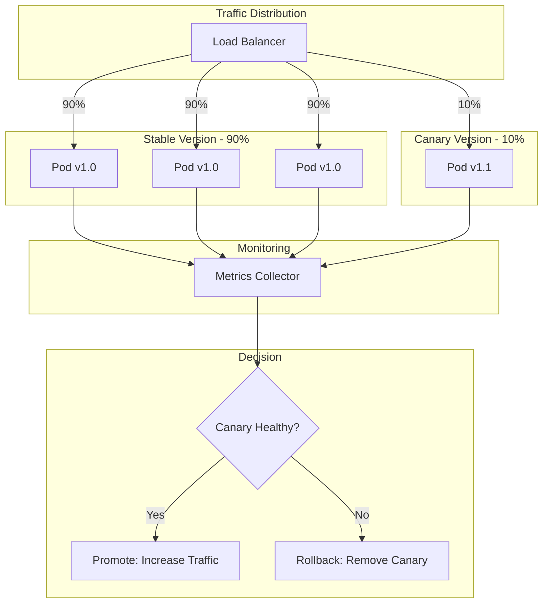
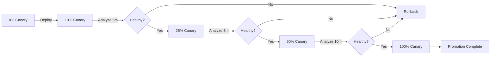

# How to Handle Canary Deployments

Author: [nawazdhandala](https://www.github.com/nawazdhandala)

Tags: Canary Deployment, Kubernetes, Progressive Delivery, Argo Rollouts, Flagger, DevOps, Traffic Management

Description: A comprehensive guide to implementing canary deployments for safe, gradual rollouts with automatic rollback based on metrics and health checks.

---

Canary deployments let you release changes to a small subset of users before rolling out to the entire infrastructure. By monitoring the canary for errors and performance issues, you can catch problems early and automatically roll back if needed. This guide covers implementing canary deployments effectively.

## Understanding Canary Deployment Flow

A canary deployment gradually shifts traffic from the old version to the new version while monitoring for issues.



## Canary Deployment Progression

The canary receives increasing traffic as it proves stable.



## Native Kubernetes Canary Implementation

Implement canary deployments using native Kubernetes resources.

```yaml
# canary-deployment.yaml - Kubernetes native canary deployment
apiVersion: apps/v1
kind: Deployment
metadata:
  name: myapp-stable
  labels:
    app: myapp
    track: stable
spec:
  replicas: 9
  selector:
    matchLabels:
      app: myapp
      track: stable
  template:
    metadata:
      labels:
        app: myapp
        track: stable
        version: v1.0.0
    spec:
      containers:
      - name: myapp
        image: myapp:1.0.0
        ports:
        - containerPort: 8080
        resources:
          requests:
            memory: "256Mi"
            cpu: "250m"
        readinessProbe:
          httpGet:
            path: /health
            port: 8080
          initialDelaySeconds: 5
          periodSeconds: 5
        livenessProbe:
          httpGet:
            path: /health
            port: 8080
          initialDelaySeconds: 10
          periodSeconds: 10
---
apiVersion: apps/v1
kind: Deployment
metadata:
  name: myapp-canary
  labels:
    app: myapp
    track: canary
spec:
  replicas: 1  # Start with 1 replica for ~10% traffic
  selector:
    matchLabels:
      app: myapp
      track: canary
  template:
    metadata:
      labels:
        app: myapp
        track: canary
        version: v1.1.0
    spec:
      containers:
      - name: myapp
        image: myapp:1.1.0
        ports:
        - containerPort: 8080
        resources:
          requests:
            memory: "256Mi"
            cpu: "250m"
        readinessProbe:
          httpGet:
            path: /health
            port: 8080
          initialDelaySeconds: 5
          periodSeconds: 5
---
# Service selects both stable and canary pods
apiVersion: v1
kind: Service
metadata:
  name: myapp
spec:
  selector:
    app: myapp  # Matches both tracks
  ports:
  - port: 80
    targetPort: 8080
```

## Automated Canary Controller

Build an automated canary deployment controller with metrics-based promotion.

```python
#!/usr/bin/env python3
# canary_controller.py - Automated canary deployment controller

import subprocess
import json
import time
import logging
import sys
from dataclasses import dataclass
from typing import List, Optional, Dict
from enum import Enum
import requests

logging.basicConfig(level=logging.INFO)
logger = logging.getLogger(__name__)

class CanaryPhase(Enum):
    """Phases of a canary deployment."""
    PENDING = "pending"
    PROGRESSING = "progressing"
    PAUSED = "paused"
    PROMOTING = "promoting"
    ROLLING_BACK = "rolling_back"
    COMPLETED = "completed"
    FAILED = "failed"


@dataclass
class CanaryStep:
    """A step in the canary progression."""
    weight: int           # Traffic percentage for canary
    pause_duration: int   # Seconds to wait before next step
    analysis_required: bool = True


@dataclass
class CanaryMetrics:
    """Metrics for canary analysis."""
    success_rate: float
    error_rate: float
    latency_p50_ms: float
    latency_p99_ms: float
    request_count: int


@dataclass
class CanaryConfig:
    """Configuration for a canary deployment."""
    app_name: str
    namespace: str
    stable_image: str
    canary_image: str
    steps: List[CanaryStep]
    success_rate_threshold: float = 0.99
    max_error_rate: float = 0.01
    max_latency_p99_ms: float = 500


class MetricsAnalyzer:
    """
    Analyzes metrics to determine canary health.
    """

    def __init__(self, prometheus_url: str):
        """
        Initialize metrics analyzer.

        Args:
            prometheus_url: URL of Prometheus server
        """
        self.prometheus_url = prometheus_url.rstrip('/')

    def query_prometheus(self, query: str) -> Optional[float]:
        """Execute a Prometheus query."""
        try:
            response = requests.get(
                f"{self.prometheus_url}/api/v1/query",
                params={"query": query},
                timeout=10
            )
            response.raise_for_status()
            data = response.json()

            if data["status"] == "success" and data["data"]["result"]:
                return float(data["data"]["result"][0]["value"][1])
            return None

        except Exception as e:
            logger.error(f"Prometheus query failed: {e}")
            return None

    def get_canary_metrics(
        self,
        app_name: str,
        namespace: str,
        window: str = "5m"
    ) -> Optional[CanaryMetrics]:
        """
        Get metrics for canary analysis.

        Args:
            app_name: Application name
            namespace: Kubernetes namespace
            window: Time window for metrics

        Returns:
            CanaryMetrics or None
        """
        # Success rate query
        success_rate = self.query_prometheus(
            f'sum(rate(http_requests_total{{app="{app_name}",namespace="{namespace}",'
            f'track="canary",status=~"2.."}}[{window}])) / '
            f'sum(rate(http_requests_total{{app="{app_name}",namespace="{namespace}",'
            f'track="canary"}}[{window}]))'
        )

        # Error rate query
        error_rate = self.query_prometheus(
            f'sum(rate(http_requests_total{{app="{app_name}",namespace="{namespace}",'
            f'track="canary",status=~"5.."}}[{window}])) / '
            f'sum(rate(http_requests_total{{app="{app_name}",namespace="{namespace}",'
            f'track="canary"}}[{window}]))'
        )

        # Latency queries
        latency_p50 = self.query_prometheus(
            f'histogram_quantile(0.50, sum(rate(http_request_duration_seconds_bucket'
            f'{{app="{app_name}",namespace="{namespace}",track="canary"}}[{window}])) '
            f'by (le)) * 1000'
        )

        latency_p99 = self.query_prometheus(
            f'histogram_quantile(0.99, sum(rate(http_request_duration_seconds_bucket'
            f'{{app="{app_name}",namespace="{namespace}",track="canary"}}[{window}])) '
            f'by (le)) * 1000'
        )

        # Request count
        request_count = self.query_prometheus(
            f'sum(increase(http_requests_total{{app="{app_name}",namespace="{namespace}",'
            f'track="canary"}}[{window}]))'
        )

        if any(v is None for v in [success_rate, error_rate, latency_p50, latency_p99]):
            return None

        return CanaryMetrics(
            success_rate=success_rate or 0,
            error_rate=error_rate or 0,
            latency_p50_ms=latency_p50 or 0,
            latency_p99_ms=latency_p99 or 0,
            request_count=int(request_count or 0)
        )


class CanaryController:
    """
    Controls canary deployment progression.

    Features:
    - Automatic traffic shifting
    - Metrics-based analysis
    - Automatic rollback on failures
    - Manual pause and resume
    """

    def __init__(
        self,
        config: CanaryConfig,
        metrics_analyzer: MetricsAnalyzer
    ):
        """
        Initialize canary controller.

        Args:
            config: Canary deployment configuration
            metrics_analyzer: Metrics analyzer instance
        """
        self.config = config
        self.metrics = metrics_analyzer
        self.phase = CanaryPhase.PENDING
        self.current_step = 0
        self.current_weight = 0

    def _run_kubectl(self, args: List[str]) -> str:
        """Run kubectl command."""
        cmd = ["kubectl", "-n", self.config.namespace] + args
        result = subprocess.run(cmd, capture_output=True, text=True, check=True)
        return result.stdout

    def _set_canary_weight(self, weight: int) -> None:
        """
        Set canary traffic weight.

        This example uses replica scaling for weight approximation.
        For precise weights, use Istio VirtualService or similar.
        """
        total_replicas = 10
        canary_replicas = max(1, int(total_replicas * weight / 100))
        stable_replicas = total_replicas - canary_replicas

        logger.info(
            f"Setting weight: canary={weight}% "
            f"(stable={stable_replicas}, canary={canary_replicas} replicas)"
        )

        # Scale deployments
        self._run_kubectl([
            "scale", "deployment",
            f"{self.config.app_name}-stable",
            f"--replicas={stable_replicas}"
        ])

        self._run_kubectl([
            "scale", "deployment",
            f"{self.config.app_name}-canary",
            f"--replicas={canary_replicas}"
        ])

        self.current_weight = weight

    def _deploy_canary(self) -> bool:
        """Deploy the canary version."""
        try:
            # Update canary deployment image
            self._run_kubectl([
                "set", "image",
                f"deployment/{self.config.app_name}-canary",
                f"{self.config.app_name}={self.config.canary_image}"
            ])

            # Wait for rollout
            self._run_kubectl([
                "rollout", "status",
                f"deployment/{self.config.app_name}-canary",
                "--timeout=300s"
            ])

            return True

        except subprocess.CalledProcessError as e:
            logger.error(f"Canary deployment failed: {e}")
            return False

    def _analyze_canary(self) -> bool:
        """
        Analyze canary metrics.

        Returns:
            True if canary is healthy
        """
        metrics = self.metrics.get_canary_metrics(
            self.config.app_name,
            self.config.namespace
        )

        if metrics is None:
            logger.warning("Could not retrieve canary metrics")
            # If no metrics, assume healthy but log warning
            return True

        logger.info(
            f"Canary metrics: success_rate={metrics.success_rate:.2%}, "
            f"error_rate={metrics.error_rate:.2%}, "
            f"p99_latency={metrics.latency_p99_ms:.0f}ms, "
            f"requests={metrics.request_count}"
        )

        # Check thresholds
        if metrics.success_rate < self.config.success_rate_threshold:
            logger.error(
                f"Success rate {metrics.success_rate:.2%} below threshold "
                f"{self.config.success_rate_threshold:.2%}"
            )
            return False

        if metrics.error_rate > self.config.max_error_rate:
            logger.error(
                f"Error rate {metrics.error_rate:.2%} above threshold "
                f"{self.config.max_error_rate:.2%}"
            )
            return False

        if metrics.latency_p99_ms > self.config.max_latency_p99_ms:
            logger.error(
                f"P99 latency {metrics.latency_p99_ms:.0f}ms above threshold "
                f"{self.config.max_latency_p99_ms:.0f}ms"
            )
            return False

        return True

    def _rollback(self) -> None:
        """Rollback canary deployment."""
        logger.warning("Rolling back canary deployment")
        self.phase = CanaryPhase.ROLLING_BACK

        # Scale down canary
        self._run_kubectl([
            "scale", "deployment",
            f"{self.config.app_name}-canary",
            "--replicas=0"
        ])

        # Scale up stable
        self._run_kubectl([
            "scale", "deployment",
            f"{self.config.app_name}-stable",
            "--replicas=10"
        ])

        # Revert canary image
        self._run_kubectl([
            "set", "image",
            f"deployment/{self.config.app_name}-canary",
            f"{self.config.app_name}={self.config.stable_image}"
        ])

        self.phase = CanaryPhase.FAILED
        logger.info("Rollback completed")

    def _promote(self) -> None:
        """Promote canary to stable."""
        logger.info("Promoting canary to stable")
        self.phase = CanaryPhase.PROMOTING

        # Update stable deployment with canary image
        self._run_kubectl([
            "set", "image",
            f"deployment/{self.config.app_name}-stable",
            f"{self.config.app_name}={self.config.canary_image}"
        ])

        # Wait for stable rollout
        self._run_kubectl([
            "rollout", "status",
            f"deployment/{self.config.app_name}-stable",
            "--timeout=300s"
        ])

        # Scale stable to full
        self._run_kubectl([
            "scale", "deployment",
            f"{self.config.app_name}-stable",
            "--replicas=10"
        ])

        # Scale down canary
        self._run_kubectl([
            "scale", "deployment",
            f"{self.config.app_name}-canary",
            "--replicas=0"
        ])

        self.phase = CanaryPhase.COMPLETED
        logger.info("Promotion completed")

    def run(self) -> bool:
        """
        Run the canary deployment.

        Returns:
            True if deployment succeeded
        """
        logger.info(f"Starting canary deployment for {self.config.app_name}")
        logger.info(f"Canary image: {self.config.canary_image}")

        # Deploy canary
        self.phase = CanaryPhase.PROGRESSING
        if not self._deploy_canary():
            self._rollback()
            return False

        # Progress through steps
        for i, step in enumerate(self.config.steps):
            self.current_step = i
            logger.info(f"Step {i+1}/{len(self.config.steps)}: weight={step.weight}%")

            # Set traffic weight
            self._set_canary_weight(step.weight)

            # Wait and analyze
            logger.info(f"Waiting {step.pause_duration}s for analysis...")
            time.sleep(step.pause_duration)

            if step.analysis_required:
                if not self._analyze_canary():
                    self._rollback()
                    return False

            logger.info(f"Step {i+1} passed")

        # All steps passed - promote
        self._promote()
        return True

    def get_status(self) -> Dict:
        """Get current canary status."""
        return {
            "phase": self.phase.value,
            "current_step": self.current_step,
            "total_steps": len(self.config.steps),
            "current_weight": self.current_weight,
            "app_name": self.config.app_name,
            "canary_image": self.config.canary_image
        }


def main():
    """Main entry point."""
    import argparse

    parser = argparse.ArgumentParser(description="Canary Deployment Controller")
    parser.add_argument("--app", required=True, help="Application name")
    parser.add_argument("--namespace", default="default", help="Kubernetes namespace")
    parser.add_argument("--stable-image", required=True, help="Current stable image")
    parser.add_argument("--canary-image", required=True, help="New canary image")
    parser.add_argument("--prometheus-url", default="http://prometheus:9090",
                       help="Prometheus URL")

    args = parser.parse_args()

    # Define canary steps
    steps = [
        CanaryStep(weight=10, pause_duration=300),   # 10% for 5 minutes
        CanaryStep(weight=25, pause_duration=300),   # 25% for 5 minutes
        CanaryStep(weight=50, pause_duration=600),   # 50% for 10 minutes
        CanaryStep(weight=75, pause_duration=600),   # 75% for 10 minutes
        CanaryStep(weight=100, pause_duration=300),  # 100% for 5 minutes
    ]

    config = CanaryConfig(
        app_name=args.app,
        namespace=args.namespace,
        stable_image=args.stable_image,
        canary_image=args.canary_image,
        steps=steps
    )

    analyzer = MetricsAnalyzer(args.prometheus_url)
    controller = CanaryController(config, analyzer)

    success = controller.run()
    sys.exit(0 if success else 1)


if __name__ == "__main__":
    main()
```

## Argo Rollouts Canary Implementation

Use Argo Rollouts for advanced canary deployments with automatic analysis.

```yaml
# argo-rollout-canary.yaml - Argo Rollouts canary deployment
apiVersion: argoproj.io/v1alpha1
kind: Rollout
metadata:
  name: myapp
spec:
  replicas: 10
  selector:
    matchLabels:
      app: myapp
  template:
    metadata:
      labels:
        app: myapp
    spec:
      containers:
      - name: myapp
        image: myapp:1.0.0
        ports:
        - containerPort: 8080
        resources:
          requests:
            memory: "256Mi"
            cpu: "250m"
        readinessProbe:
          httpGet:
            path: /health
            port: 8080
          initialDelaySeconds: 5
          periodSeconds: 5
  strategy:
    canary:
      # Traffic management using Istio
      trafficRouting:
        istio:
          virtualService:
            name: myapp-vsvc
            routes:
            - primary
      # Canary steps
      steps:
      - setWeight: 10
      - pause: {duration: 5m}
      - analysis:
          templates:
          - templateName: success-rate
          args:
          - name: service-name
            value: myapp
      - setWeight: 25
      - pause: {duration: 5m}
      - analysis:
          templates:
          - templateName: success-rate
      - setWeight: 50
      - pause: {duration: 10m}
      - analysis:
          templates:
          - templateName: success-rate
      - setWeight: 75
      - pause: {duration: 10m}
      - setWeight: 100
      # Rollback on failure
      maxSurge: "25%"
      maxUnavailable: 0
---
# Analysis template for success rate
apiVersion: argoproj.io/v1alpha1
kind: AnalysisTemplate
metadata:
  name: success-rate
spec:
  args:
  - name: service-name
  metrics:
  - name: success-rate
    interval: 1m
    count: 5
    successCondition: result[0] >= 0.99
    failureLimit: 3
    provider:
      prometheus:
        address: http://prometheus:9090
        query: |
          sum(rate(http_requests_total{
            app="{{args.service-name}}",
            status=~"2.."
          }[5m])) /
          sum(rate(http_requests_total{
            app="{{args.service-name}}"
          }[5m]))
  - name: error-rate
    interval: 1m
    count: 5
    successCondition: result[0] <= 0.01
    failureLimit: 3
    provider:
      prometheus:
        address: http://prometheus:9090
        query: |
          sum(rate(http_requests_total{
            app="{{args.service-name}}",
            status=~"5.."
          }[5m])) /
          sum(rate(http_requests_total{
            app="{{args.service-name}}"
          }[5m]))
  - name: latency-p99
    interval: 1m
    count: 5
    successCondition: result[0] <= 500
    failureLimit: 3
    provider:
      prometheus:
        address: http://prometheus:9090
        query: |
          histogram_quantile(0.99,
            sum(rate(http_request_duration_seconds_bucket{
              app="{{args.service-name}}"
            }[5m])) by (le)
          ) * 1000
---
# Istio VirtualService for traffic splitting
apiVersion: networking.istio.io/v1beta1
kind: VirtualService
metadata:
  name: myapp-vsvc
spec:
  hosts:
  - myapp
  http:
  - name: primary
    route:
    - destination:
        host: myapp
        subset: stable
      weight: 100
    - destination:
        host: myapp
        subset: canary
      weight: 0
---
# Destination rule for subsets
apiVersion: networking.istio.io/v1beta1
kind: DestinationRule
metadata:
  name: myapp-destrule
spec:
  host: myapp
  subsets:
  - name: stable
    labels:
      app: myapp
  - name: canary
    labels:
      app: myapp
```

## Canary Metrics Dashboard

Create a monitoring dashboard for canary deployments.

```python
# canary_dashboard.py - Canary deployment monitoring dashboard
import json
from dataclasses import dataclass, asdict
from typing import List, Dict, Optional
from datetime import datetime

@dataclass
class CanarySnapshot:
    """Point-in-time snapshot of canary metrics."""
    timestamp: str
    phase: str
    weight: int
    stable_success_rate: float
    canary_success_rate: float
    stable_latency_p99: float
    canary_latency_p99: float
    stable_requests: int
    canary_requests: int


class CanaryDashboard:
    """
    Dashboard for monitoring canary deployments.
    """

    def __init__(self, prometheus_url: str):
        """
        Initialize dashboard.

        Args:
            prometheus_url: Prometheus server URL
        """
        self.prometheus_url = prometheus_url
        self._snapshots: List[CanarySnapshot] = []

    def collect_snapshot(
        self,
        app_name: str,
        namespace: str,
        phase: str,
        weight: int
    ) -> CanarySnapshot:
        """
        Collect a metrics snapshot.

        Args:
            app_name: Application name
            namespace: Kubernetes namespace
            phase: Current deployment phase
            weight: Current canary weight

        Returns:
            CanarySnapshot
        """
        import requests

        def query(q: str) -> float:
            try:
                resp = requests.get(
                    f"{self.prometheus_url}/api/v1/query",
                    params={"query": q},
                    timeout=10
                )
                data = resp.json()
                if data["data"]["result"]:
                    return float(data["data"]["result"][0]["value"][1])
            except Exception:
                pass
            return 0.0

        snapshot = CanarySnapshot(
            timestamp=datetime.utcnow().isoformat(),
            phase=phase,
            weight=weight,
            stable_success_rate=query(
                f'sum(rate(http_requests_total{{app="{app_name}",track="stable",'
                f'status=~"2.."}}[1m])) / '
                f'sum(rate(http_requests_total{{app="{app_name}",track="stable"}}[1m]))'
            ),
            canary_success_rate=query(
                f'sum(rate(http_requests_total{{app="{app_name}",track="canary",'
                f'status=~"2.."}}[1m])) / '
                f'sum(rate(http_requests_total{{app="{app_name}",track="canary"}}[1m]))'
            ),
            stable_latency_p99=query(
                f'histogram_quantile(0.99, sum(rate(http_request_duration_seconds_bucket'
                f'{{app="{app_name}",track="stable"}}[1m])) by (le)) * 1000'
            ),
            canary_latency_p99=query(
                f'histogram_quantile(0.99, sum(rate(http_request_duration_seconds_bucket'
                f'{{app="{app_name}",track="canary"}}[1m])) by (le)) * 1000'
            ),
            stable_requests=int(query(
                f'sum(increase(http_requests_total{{app="{app_name}",track="stable"}}[1m]))'
            )),
            canary_requests=int(query(
                f'sum(increase(http_requests_total{{app="{app_name}",track="canary"}}[1m]))'
            ))
        )

        self._snapshots.append(snapshot)
        return snapshot

    def generate_report(self) -> Dict:
        """Generate deployment report."""
        if not self._snapshots:
            return {"error": "No snapshots collected"}

        first = self._snapshots[0]
        last = self._snapshots[-1]

        # Calculate averages
        canary_success_rates = [s.canary_success_rate for s in self._snapshots if s.canary_success_rate > 0]
        canary_latencies = [s.canary_latency_p99 for s in self._snapshots if s.canary_latency_p99 > 0]

        return {
            "deployment_summary": {
                "start_time": first.timestamp,
                "end_time": last.timestamp,
                "final_phase": last.phase,
                "final_weight": last.weight,
                "total_snapshots": len(self._snapshots)
            },
            "canary_metrics": {
                "avg_success_rate": sum(canary_success_rates) / len(canary_success_rates) if canary_success_rates else 0,
                "min_success_rate": min(canary_success_rates) if canary_success_rates else 0,
                "avg_latency_p99_ms": sum(canary_latencies) / len(canary_latencies) if canary_latencies else 0,
                "max_latency_p99_ms": max(canary_latencies) if canary_latencies else 0,
                "total_requests": sum(s.canary_requests for s in self._snapshots)
            },
            "comparison": {
                "success_rate_diff": (
                    last.canary_success_rate - last.stable_success_rate
                    if last.canary_success_rate and last.stable_success_rate else 0
                ),
                "latency_diff_ms": (
                    last.canary_latency_p99 - last.stable_latency_p99
                    if last.canary_latency_p99 and last.stable_latency_p99 else 0
                )
            },
            "snapshots": [asdict(s) for s in self._snapshots]
        }

    def print_live_status(self, snapshot: CanarySnapshot) -> None:
        """Print live status to console."""
        print(f"\n{'='*60}")
        print(f"Canary Deployment Status - {snapshot.timestamp}")
        print(f"{'='*60}")
        print(f"Phase: {snapshot.phase}")
        print(f"Canary Weight: {snapshot.weight}%")
        print(f"\n{'Metric':<25} {'Stable':<15} {'Canary':<15}")
        print(f"{'-'*55}")
        print(f"{'Success Rate':<25} {snapshot.stable_success_rate:.2%:<15} {snapshot.canary_success_rate:.2%:<15}")
        print(f"{'P99 Latency (ms)':<25} {snapshot.stable_latency_p99:.0f:<15} {snapshot.canary_latency_p99:.0f:<15}")
        print(f"{'Requests/min':<25} {snapshot.stable_requests:<15} {snapshot.canary_requests:<15}")
        print(f"{'='*60}")
```

## Best Practices

1. **Start with small traffic percentages** - Begin with 1-5% traffic to minimize impact from potential issues.

2. **Define clear success criteria** - Set specific thresholds for success rate, latency, and error rate before deployment.

3. **Monitor both canary and stable** - Compare canary metrics against stable to detect regressions.

4. **Automate rollback** - Configure automatic rollback when metrics exceed thresholds.

5. **Use gradual progression** - Increase traffic in small increments with analysis between each step.

6. **Ensure sufficient traffic** - Make sure the canary receives enough traffic for statistically significant metrics.

7. **Test rollback procedures** - Regularly verify that rollback works correctly and quickly.

8. **Keep deployment windows reasonable** - Balance between thorough validation and deployment speed.

Canary deployments provide a safe way to release changes with confidence, catching issues before they affect all users.
