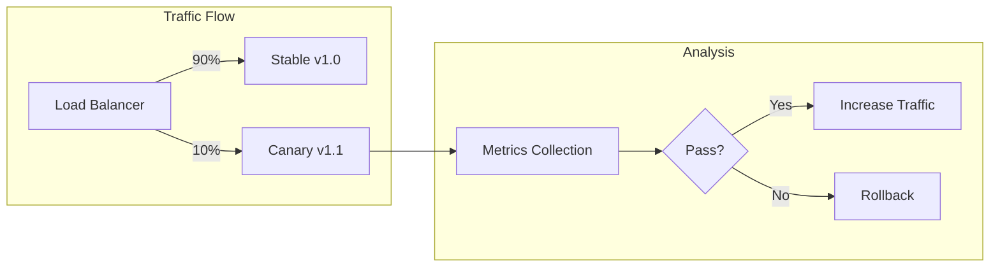

# How to Configure Canary Deployments

Author: [nawazdhandala](https://www.github.com/nawazdhandala)

Tags: Canary Deployments, Kubernetes, Progressive Delivery, Argo Rollouts, Flagger, DevOps, CI/CD

Description: A complete guide to configuring canary deployments in Kubernetes using native resources, Argo Rollouts, and Flagger for safe, automated progressive delivery.

---

Canary deployments let you release new versions to a small subset of users before rolling out to everyone. If something goes wrong, only a fraction of your traffic is affected. This guide covers three approaches to canary deployments: native Kubernetes, Argo Rollouts, and Flagger.

## Understanding Canary Deployments

A canary deployment gradually shifts traffic from the old version to the new version while monitoring for errors. If metrics look good, more traffic shifts to the canary. If problems appear, traffic rolls back to the stable version.



## Native Kubernetes Canary Deployments

You can implement basic canary deployments using standard Kubernetes resources. This approach works without additional tools but requires manual traffic management.

Create two deployments with different replica counts to control traffic distribution:

```yaml
# stable-deployment.yaml
apiVersion: apps/v1
kind: Deployment
metadata:
  name: myapp-stable
  labels:
    app: myapp
    version: stable
spec:
  replicas: 9  # 90% of total replicas
  selector:
    matchLabels:
      app: myapp
      version: stable
  template:
    metadata:
      labels:
        app: myapp
        version: stable
    spec:
      containers:
        - name: myapp
          image: myapp:1.0.0
          ports:
            - containerPort: 8080
---
# canary-deployment.yaml
apiVersion: apps/v1
kind: Deployment
metadata:
  name: myapp-canary
  labels:
    app: myapp
    version: canary
spec:
  replicas: 1  # 10% of total replicas
  selector:
    matchLabels:
      app: myapp
      version: canary
  template:
    metadata:
      labels:
        app: myapp
        version: canary
    spec:
      containers:
        - name: myapp
          image: myapp:1.1.0
          ports:
            - containerPort: 8080
```

Create a service that routes to both deployments:

```yaml
# service.yaml
apiVersion: v1
kind: Service
metadata:
  name: myapp
spec:
  selector:
    app: myapp  # Matches both stable and canary
  ports:
    - port: 80
      targetPort: 8080
```

Manually adjust traffic by changing replica counts:

```bash
# Start with 10% canary traffic
kubectl scale deployment myapp-stable --replicas=9
kubectl scale deployment myapp-canary --replicas=1

# Increase to 30% canary traffic
kubectl scale deployment myapp-stable --replicas=7
kubectl scale deployment myapp-canary --replicas=3

# Full rollout
kubectl scale deployment myapp-stable --replicas=0
kubectl scale deployment myapp-canary --replicas=10

# Rollback if needed
kubectl scale deployment myapp-canary --replicas=0
kubectl scale deployment myapp-stable --replicas=10
```

## Canary Deployments with Argo Rollouts

Argo Rollouts provides automated canary deployments with analysis-based promotion. Install it first:

```bash
# Install Argo Rollouts
kubectl create namespace argo-rollouts
kubectl apply -n argo-rollouts -f https://github.com/argoproj/argo-rollouts/releases/latest/download/install.yaml

# Install kubectl plugin for easier management
brew install argoproj/tap/kubectl-argo-rollouts
```

Create a Rollout resource that defines your canary strategy:

```yaml
# rollout.yaml
apiVersion: argoproj.io/v1alpha1
kind: Rollout
metadata:
  name: myapp
spec:
  replicas: 10
  selector:
    matchLabels:
      app: myapp
  template:
    metadata:
      labels:
        app: myapp
    spec:
      containers:
        - name: myapp
          image: myapp:1.0.0
          ports:
            - containerPort: 8080
          resources:
            requests:
              memory: "128Mi"
              cpu: "100m"
  strategy:
    canary:
      # Traffic routing configuration
      canaryService: myapp-canary
      stableService: myapp-stable
      trafficRouting:
        nginx:
          stableIngress: myapp-ingress
      # Step-by-step rollout
      steps:
        # Start with 10% traffic
        - setWeight: 10
        # Wait and analyze
        - pause: {duration: 5m}
        # Increase to 30%
        - setWeight: 30
        - pause: {duration: 5m}
        # Increase to 50%
        - setWeight: 50
        - pause: {duration: 5m}
        # Full rollout
        - setWeight: 100
      # Automatic rollback on failure
      analysis:
        templates:
          - templateName: success-rate
        startingStep: 2
        args:
          - name: service-name
            value: myapp-canary
```

Create the analysis template to define success criteria:

```yaml
# analysis-template.yaml
apiVersion: argoproj.io/v1alpha1
kind: AnalysisTemplate
metadata:
  name: success-rate
spec:
  args:
    - name: service-name
  metrics:
    - name: success-rate
      # Query Prometheus for success rate
      interval: 1m
      successCondition: result[0] >= 0.95
      failureLimit: 3
      provider:
        prometheus:
          address: http://prometheus.monitoring:9090
          query: |
            sum(rate(http_requests_total{
              service="{{args.service-name}}",
              status=~"2.."
            }[5m])) /
            sum(rate(http_requests_total{
              service="{{args.service-name}}"
            }[5m]))
    - name: latency-p99
      interval: 1m
      successCondition: result[0] < 500
      failureLimit: 3
      provider:
        prometheus:
          address: http://prometheus.monitoring:9090
          query: |
            histogram_quantile(0.99,
              sum(rate(http_request_duration_seconds_bucket{
                service="{{args.service-name}}"
              }[5m])) by (le)
            ) * 1000
```

Set up the required services and ingress:

```yaml
# services.yaml
apiVersion: v1
kind: Service
metadata:
  name: myapp-stable
spec:
  selector:
    app: myapp
  ports:
    - port: 80
      targetPort: 8080
---
apiVersion: v1
kind: Service
metadata:
  name: myapp-canary
spec:
  selector:
    app: myapp
  ports:
    - port: 80
      targetPort: 8080
---
# ingress.yaml
apiVersion: networking.k8s.io/v1
kind: Ingress
metadata:
  name: myapp-ingress
  annotations:
    kubernetes.io/ingress.class: nginx
spec:
  rules:
    - host: myapp.example.com
      http:
        paths:
          - path: /
            pathType: Prefix
            backend:
              service:
                name: myapp-stable
                port:
                  number: 80
```

Manage the rollout with the kubectl plugin:

```bash
# Update the image to trigger a canary rollout
kubectl argo rollouts set image myapp myapp=myapp:1.1.0

# Watch the rollout progress
kubectl argo rollouts get rollout myapp --watch

# Manually promote if paused
kubectl argo rollouts promote myapp

# Abort and rollback
kubectl argo rollouts abort myapp
```

## Canary Deployments with Flagger

Flagger works with service meshes like Istio and Linkerd for traffic management. Here is an example with Istio:

```bash
# Install Flagger with Istio support
helm repo add flagger https://flagger.app
helm upgrade -i flagger flagger/flagger \
  --namespace istio-system \
  --set meshProvider=istio \
  --set metricsServer=http://prometheus:9090
```

Create a Canary resource:

```yaml
# canary.yaml
apiVersion: flagger.app/v1beta1
kind: Canary
metadata:
  name: myapp
spec:
  # Reference the deployment to manage
  targetRef:
    apiVersion: apps/v1
    kind: Deployment
    name: myapp
  # Istio virtual service for traffic routing
  service:
    port: 80
    targetPort: 8080
    gateways:
      - public-gateway.istio-system.svc.cluster.local
    hosts:
      - myapp.example.com
  # Canary analysis configuration
  analysis:
    # Check every minute
    interval: 1m
    # Max traffic weight
    maxWeight: 50
    # Increment step
    stepWeight: 10
    # Number of successful checks before promotion
    threshold: 5
    # Metrics for analysis
    metrics:
      - name: request-success-rate
        # Minimum success rate
        thresholdRange:
          min: 99
        interval: 1m
      - name: request-duration
        # Maximum latency in milliseconds
        thresholdRange:
          max: 500
        interval: 1m
    # Webhooks for custom checks
    webhooks:
      - name: load-test
        url: http://flagger-loadtester.test/
        timeout: 5s
        metadata:
          cmd: "hey -z 1m -q 10 -c 2 http://myapp-canary.myapp:80/"
```

The standard Deployment that Flagger will manage:

```yaml
# deployment.yaml
apiVersion: apps/v1
kind: Deployment
metadata:
  name: myapp
spec:
  replicas: 3
  selector:
    matchLabels:
      app: myapp
  template:
    metadata:
      labels:
        app: myapp
    spec:
      containers:
        - name: myapp
          image: myapp:1.0.0
          ports:
            - containerPort: 8080
          resources:
            requests:
              memory: "128Mi"
              cpu: "100m"
```

Monitor Flagger canary deployments:

```bash
# Watch canary status
kubectl get canary myapp --watch

# Get detailed canary information
kubectl describe canary myapp

# Check events
kubectl get events --field-selector involvedObject.name=myapp
```

## Configuring Traffic Routing with Istio

For fine-grained traffic control, use Istio VirtualService directly:

```yaml
# virtual-service.yaml
apiVersion: networking.istio.io/v1beta1
kind: VirtualService
metadata:
  name: myapp
spec:
  hosts:
    - myapp.example.com
  gateways:
    - myapp-gateway
  http:
    - match:
        # Route specific users to canary
        - headers:
            x-canary:
              exact: "true"
      route:
        - destination:
            host: myapp-canary
            port:
              number: 80
    - route:
        # Weighted traffic split
        - destination:
            host: myapp-stable
            port:
              number: 80
          weight: 90
        - destination:
            host: myapp-canary
            port:
              number: 80
          weight: 10
```

## Monitoring Canary Deployments

Set up dashboards to monitor your canaries:

```yaml
# prometheus-rules.yaml
apiVersion: monitoring.coreos.com/v1
kind: PrometheusRule
metadata:
  name: canary-alerts
spec:
  groups:
    - name: canary
      rules:
        - alert: CanaryErrorRateHigh
          expr: |
            sum(rate(http_requests_total{
              deployment="canary",
              status=~"5.."
            }[5m])) /
            sum(rate(http_requests_total{
              deployment="canary"
            }[5m])) > 0.05
          for: 2m
          labels:
            severity: critical
          annotations:
            summary: "Canary error rate exceeds 5%"
            description: "Canary deployment has {{ $value | humanizePercentage }} error rate"

        - alert: CanaryLatencyHigh
          expr: |
            histogram_quantile(0.99,
              sum(rate(http_request_duration_seconds_bucket{
                deployment="canary"
              }[5m])) by (le)
            ) > 1
          for: 2m
          labels:
            severity: warning
          annotations:
            summary: "Canary p99 latency exceeds 1 second"
```

## Best Practices for Canary Deployments

**Start small and increase gradually** - Begin with 1-5% of traffic. This limits the blast radius if something goes wrong.

**Define clear success metrics** - Error rates and latency are essential, but also consider business metrics like conversion rates or user engagement.

**Automate rollback** - Configure automatic rollback when metrics breach thresholds. Do not rely on manual intervention during incidents.

**Test your rollback** - Regularly verify that rollbacks work correctly. A broken rollback process is worse than no canary at all.

**Use feature flags with canaries** - Combine canary deployments with feature flags for even finer control over which users see new functionality.

```yaml
# Combined canary + feature flag strategy
strategy:
  canary:
    steps:
      # First, enable for internal users only
      - setHeaderRoute:
          name: internal-users
          match:
            - headerName: x-internal
              headerValue:
                exact: "true"
      - pause: {duration: 1h}
      # Then percentage-based rollout
      - setWeight: 10
      - pause: {duration: 30m}
      - setWeight: 50
      - pause: {duration: 30m}
```

Canary deployments add safety to your release process. Start with the native Kubernetes approach to understand the concepts, then adopt Argo Rollouts or Flagger for automated analysis and promotion. The investment in setting up proper canary infrastructure pays off when it catches a bad deployment before it affects all your users.
