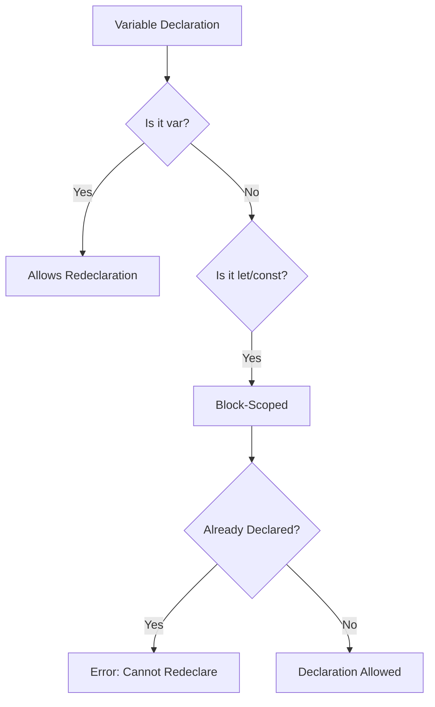
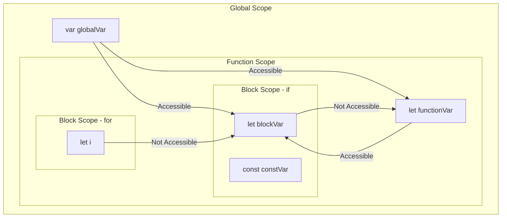

# How to Fix 'Cannot Redeclare Block-Scoped Variable'

Author: [nawazdhandala](https://www.github.com/nawazdhandala)

Tags: TypeScript, JavaScript, Debugging, Scope, Variables, Error Handling

Description: Learn how to diagnose and fix the 'Cannot redeclare block-scoped variable' error in TypeScript, including common causes and best practices for variable scoping.

---

If you have worked with TypeScript for any length of time, you have likely encountered the dreaded "Cannot redeclare block-scoped variable" error. This error can be frustrating, especially when your code looks perfectly fine at first glance. In this guide, we will explore what causes this error, why it happens, and how to fix it using practical examples.

## Understanding the Error

The "Cannot redeclare block-scoped variable" error occurs when TypeScript detects that you are trying to declare a variable with `let` or `const` that already exists in the same scope. Unlike `var`, which allows redeclaration within the same scope, block-scoped variables (`let` and `const`) follow stricter rules.



## Common Causes and Solutions

### Cause 1: Script Mode vs Module Mode

One of the most common causes of this error is that TypeScript treats your file as a script rather than a module. In script mode, all top-level declarations are considered global, which can cause conflicts with other files or built-in types.

```typescript
// file1.ts - Treated as a script
let name = "Alice";  // Error: Cannot redeclare block-scoped variable 'name'

// The error occurs because 'name' already exists in the global scope
// from lib.dom.d.ts (window.name)
```

**Solution: Convert to a module by adding an export or import statement.**

```typescript
// file1.ts - Now treated as a module
export {};  // This makes the file a module

let name = "Alice";  // Works fine now - scoped to this module
```

Alternatively, you can add any import statement:

```typescript
// file1.ts - Module due to import
import { something } from "./somewhere";

let name = "Alice";  // Works fine - module scope
```

### Cause 2: Multiple Declarations in Same Scope

Another common cause is accidentally declaring the same variable twice within the same block scope.

```typescript
function processUser(userId: string): void {
    let result = fetchUser(userId);

    // Some code later...

    let result = transformUser(result);  // Error: Cannot redeclare 'result'
}
```

**Solution: Use assignment instead of redeclaration, or use different variable names.**

```typescript
// Option 1: Use assignment
function processUser(userId: string): void {
    let result = fetchUser(userId);

    // Reassign instead of redeclare
    result = transformUser(result);
}

// Option 2: Use different variable names for clarity
function processUserBetter(userId: string): void {
    const rawUser = fetchUser(userId);
    const transformedUser = transformUser(rawUser);
    return transformedUser;
}
```

### Cause 3: Conflicts with Type Declarations

Sometimes your variable name conflicts with a type declaration from a library or your own code.

```typescript
// types.ts
export interface Request {
    body: unknown;
    params: Record<string, string>;
}

// handler.ts
import { Request } from "./types";

// Error: Cannot redeclare block-scoped variable 'Request'
const Request = (url: string) => fetch(url);
```

**Solution: Rename your variable or use different import names.**

```typescript
// Option 1: Rename your variable
import { Request } from "./types";

const makeRequest = (url: string) => fetch(url);

// Option 2: Rename the import
import { Request as RequestType } from "./types";

const Request = (url: string) => fetch(url);
```

### Cause 4: Duplicate Variable in Merged Declarations

When working with declaration merging or multiple script files, you might accidentally create duplicate declarations.

```typescript
// globals.d.ts
declare const API_URL: string;

// config.ts
const API_URL = "https://api.example.com";  // Error in script mode
```

**Solution: Ensure your config file is a module or use declaration merging correctly.**

```typescript
// config.ts - Make it a module
export const API_URL = "https://api.example.com";

// Or if you need it global, augment properly
// globals.d.ts
declare global {
    const API_URL: string;
}

export {};  // Make this a module too
```

## Understanding Block Scope

To truly fix and prevent this error, you need to understand how block scoping works in TypeScript.



### var vs let vs const Behavior

Here is a comparison of how each keyword behaves:

```typescript
// var - function scoped, allows redeclaration
function testVar(): void {
    var x = 1;
    var x = 2;  // No error - var allows redeclaration
    console.log(x);  // 2
}

// let - block scoped, no redeclaration
function testLet(): void {
    let y = 1;
    // let y = 2;  // Error: Cannot redeclare block-scoped variable 'y'
    y = 2;  // This is fine - reassignment, not redeclaration
    console.log(y);  // 2
}

// const - block scoped, no redeclaration, no reassignment
function testConst(): void {
    const z = 1;
    // const z = 2;  // Error: Cannot redeclare block-scoped variable 'z'
    // z = 2;  // Error: Cannot assign to 'z' because it is a constant
    console.log(z);  // 1
}
```

### Block Scope in Loops

A common pattern that trips up developers is loop variables:

```typescript
// Using var - shares the same variable across iterations
for (var i = 0; i < 3; i++) {
    setTimeout(() => console.log(i), 100);  // Prints: 3, 3, 3
}

// Using let - creates a new binding for each iteration
for (let j = 0; j < 3; j++) {
    setTimeout(() => console.log(j), 100);  // Prints: 0, 1, 2
}
```

## TypeScript Configuration Options

Your `tsconfig.json` settings can affect how this error appears.

```json
{
    "compilerOptions": {
        // Determines which lib files to include
        // Including "DOM" adds window.name and other globals
        "lib": ["ES2022", "DOM"],

        // Module system affects script vs module mode
        "module": "ESNext",
        "moduleResolution": "bundler",

        // Strict mode catches more potential issues
        "strict": true,

        // Isolated modules ensures each file is a valid module
        "isolatedModules": true
    }
}
```

### Using isolatedModules

When `isolatedModules` is enabled, TypeScript requires each file to be a valid standalone module. This helps catch the script-mode issue early:

```typescript
// With isolatedModules: true
// This file has no imports or exports, so TypeScript warns you

let name = "test";  // Error: 'name' cannot be used as a value
                    // because it was imported using 'import type'

// Add an export to fix
export {};
let name = "test";  // Now works
```

## Best Practices to Avoid This Error

### 1. Always Use Module Syntax

Make sure every TypeScript file is a module by including at least one import or export:

```typescript
// Even if you do not export anything meaningful,
// adding this makes the file a module
export {};

// Now your variables are scoped to this module
let name = "Alice";
let document = createDocument();  // No conflict with window.document
```

### 2. Use Descriptive Variable Names

Avoid generic names that might conflict with globals or library types:

```typescript
// Bad - conflicts with global 'name'
let name = "Alice";

// Good - specific and clear
let userName = "Alice";
let customerName = "Alice";
let displayName = "Alice";
```

### 3. Prefer const Over let

Using `const` by default helps prevent accidental redeclaration:

```typescript
// Prefer const for values that do not change
const API_ENDPOINT = "/api/v1";
const MAX_RETRIES = 3;

// Use let only when reassignment is needed
let currentRetry = 0;
while (currentRetry < MAX_RETRIES) {
    currentRetry++;
}
```

### 4. Use Namespaces or Modules for Organization

When you have many related declarations, organize them properly:

```typescript
// config/api.ts
export const api = {
    baseUrl: "https://api.example.com",
    timeout: 5000,
    retries: 3,
} as const;

// Usage
import { api } from "./config/api";
console.log(api.baseUrl);
```

## Debugging the Error

When you encounter this error, follow this checklist:

1. **Check if the file is a module**: Does it have any import or export statements?
2. **Search for duplicate declarations**: Use your editor's "Find All References" feature.
3. **Check global declarations**: Look in `.d.ts` files and `node_modules/@types`.
4. **Review tsconfig.json**: Check the `lib` array for included type definitions.
5. **Check for declaration merging**: Look for ambient declarations that might conflict.

```typescript
// Quick debugging helper - add at the top of your file
export {};  // Force module mode

// If the error goes away, your file was in script mode
// and conflicting with global declarations
```

## Conclusion

The "Cannot redeclare block-scoped variable" error in TypeScript is a safety feature that helps you write more predictable code. Understanding block scope and the difference between script and module mode is key to avoiding and fixing this error.

Key takeaways:

- Always make your TypeScript files modules by adding exports or imports
- Use `const` by default and `let` only when reassignment is needed
- Choose descriptive variable names that do not conflict with globals
- Understand how your `tsconfig.json` settings affect type declarations
- When in doubt, add `export {}` to the top of your file to force module mode

By following these practices, you will encounter this error less frequently and know exactly how to fix it when it does appear.

---

**Related Reading:**

- [How to Configure TypeScript with Node.js](https://oneuptime.com/blog/post/2026-01-24-configure-typescript-with-nodejs/view)
- [How to Fix "Expected X Arguments but Got Y" Errors](https://oneuptime.com/blog/post/2026-01-24-expected-x-arguments-but-got-y/view)
- [How to Fix "Module Has No Default Export" Errors](https://oneuptime.com/blog/post/2026-01-24-module-has-no-default-export/view)
