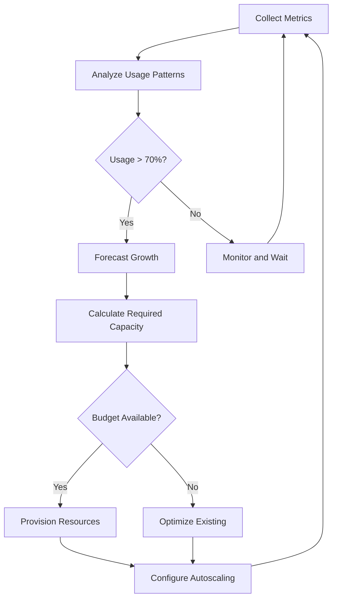

# How to Fix "Capacity Planning" Issues

Author: [nawazdhandala](https://www.github.com/nawazdhandala)

Tags: Capacity Planning, DevOps, Infrastructure, Scaling, Monitoring, Kubernetes

Description: Learn how to identify and fix capacity planning issues in your infrastructure, including resource forecasting, scaling strategies, and monitoring best practices.

---

Capacity planning is one of those things that seems straightforward until your system goes down during a traffic spike. The goal is simple: make sure you have enough resources to handle demand without overspending on idle capacity. Getting this balance right requires data, automation, and a solid understanding of your workload patterns.

## Why Capacity Planning Fails

Most capacity planning issues boil down to a few common problems:

- **Guessing instead of measuring** - Teams estimate resource needs without historical data
- **Static allocation** - Resources are set once and never adjusted
- **Missing the growth curve** - Traffic grows faster than infrastructure can scale
- **Ignoring burst patterns** - Average usage looks fine, but peaks cause outages

## Understanding Your Current Capacity

Before you can plan for the future, you need to know where you stand today. Start by collecting metrics on CPU, memory, disk, and network usage across all your services.

This Prometheus query shows CPU usage over the last 24 hours, which helps you understand typical patterns.

```promql
# Average CPU usage per service over the last 24 hours
avg by (service) (
  rate(container_cpu_usage_seconds_total[24h])
)

# Peak CPU usage to identify spikes
max by (service) (
  rate(container_cpu_usage_seconds_total[5m])
)
```

For memory, you want to track both current usage and the trend over time.

```promql
# Memory usage percentage by container
sum by (container) (
  container_memory_usage_bytes
) / sum by (container) (
  container_spec_memory_limit_bytes
) * 100

# Memory trend over 7 days
predict_linear(
  container_memory_usage_bytes[7d],
  86400 * 30  # Predict 30 days ahead
)
```

## Setting Up Resource Monitoring

A proper monitoring stack gives you the data you need for capacity decisions. Here is a basic setup using Prometheus and Grafana.

```yaml
# prometheus-config.yaml
apiVersion: v1
kind: ConfigMap
metadata:
  name: prometheus-config
data:
  prometheus.yml: |
    global:
      scrape_interval: 15s
      evaluation_interval: 15s

    rule_files:
      - /etc/prometheus/rules/*.yml

    scrape_configs:
      # Scrape Kubernetes nodes for resource metrics
      - job_name: 'kubernetes-nodes'
        kubernetes_sd_configs:
          - role: node
        relabel_configs:
          - action: labelmap
            regex: __meta_kubernetes_node_label_(.+)

      # Scrape pods for application metrics
      - job_name: 'kubernetes-pods'
        kubernetes_sd_configs:
          - role: pod
        relabel_configs:
          - source_labels: [__meta_kubernetes_pod_annotation_prometheus_io_scrape]
            action: keep
            regex: true
```

Create alerting rules that warn you before capacity becomes critical.

```yaml
# capacity-alerts.yml
groups:
  - name: capacity
    rules:
      # Alert when CPU usage exceeds 80% for 15 minutes
      - alert: HighCPUUsage
        expr: |
          avg by (namespace, pod) (
            rate(container_cpu_usage_seconds_total[5m])
          ) / avg by (namespace, pod) (
            kube_pod_container_resource_limits{resource="cpu"}
          ) > 0.8
        for: 15m
        labels:
          severity: warning
        annotations:
          summary: "High CPU usage on {{ $labels.pod }}"
          description: "CPU usage is above 80% for more than 15 minutes"

      # Alert when memory is approaching limit
      - alert: MemoryNearLimit
        expr: |
          container_memory_usage_bytes /
          container_spec_memory_limit_bytes > 0.85
        for: 10m
        labels:
          severity: warning
        annotations:
          summary: "Memory near limit on {{ $labels.container }}"
```

## Implementing Autoscaling

Static resource allocation is a recipe for either waste or outages. Autoscaling adjusts capacity based on actual demand.

The Horizontal Pod Autoscaler (HPA) is the starting point for most Kubernetes workloads.

```yaml
# hpa.yaml
apiVersion: autoscaling/v2
kind: HorizontalPodAutoscaler
metadata:
  name: api-server-hpa
  namespace: production
spec:
  scaleTargetRef:
    apiVersion: apps/v1
    kind: Deployment
    name: api-server
  minReplicas: 3
  maxReplicas: 20
  metrics:
    # Scale based on CPU usage
    - type: Resource
      resource:
        name: cpu
        target:
          type: Utilization
          averageUtilization: 70
    # Also consider memory
    - type: Resource
      resource:
        name: memory
        target:
          type: Utilization
          averageUtilization: 75
  behavior:
    # Scale up quickly when needed
    scaleUp:
      stabilizationWindowSeconds: 60
      policies:
        - type: Percent
          value: 100
          periodSeconds: 60
    # Scale down slowly to avoid thrashing
    scaleDown:
      stabilizationWindowSeconds: 300
      policies:
        - type: Percent
          value: 10
          periodSeconds: 60
```

For workloads where vertical scaling makes more sense, use the Vertical Pod Autoscaler.

```yaml
# vpa.yaml
apiVersion: autoscaling.k8s.io/v1
kind: VerticalPodAutoscaler
metadata:
  name: api-server-vpa
  namespace: production
spec:
  targetRef:
    apiVersion: apps/v1
    kind: Deployment
    name: api-server
  updatePolicy:
    updateMode: "Auto"  # Automatically apply recommendations
  resourcePolicy:
    containerPolicies:
      - containerName: api-server
        minAllowed:
          cpu: 100m
          memory: 128Mi
        maxAllowed:
          cpu: 4
          memory: 8Gi
        controlledResources: ["cpu", "memory"]
```

## Capacity Planning Workflow

The following diagram shows how data flows through a capacity planning process.



## Forecasting Future Capacity

Looking at historical data helps predict future needs. This Python script analyzes trends and forecasts capacity requirements.

```python
# capacity_forecast.py
import pandas as pd
import numpy as np
from datetime import datetime, timedelta

def analyze_capacity_trends(metrics_data):
    """
    Analyze historical metrics and forecast future capacity needs.
    Returns recommended capacity and confidence interval.
    """
    df = pd.DataFrame(metrics_data)
    df['timestamp'] = pd.to_datetime(df['timestamp'])
    df = df.set_index('timestamp')

    # Calculate daily averages and peaks
    daily_avg = df.resample('D').mean()
    daily_peak = df.resample('D').max()

    # Calculate growth rate
    growth_rate = (daily_avg.iloc[-1] - daily_avg.iloc[0]) / len(daily_avg)

    # Project 30 days ahead
    projected_avg = daily_avg.iloc[-1] + (growth_rate * 30)
    projected_peak = daily_peak.iloc[-1] * 1.2  # Add 20% buffer for peaks

    return {
        'current_avg': float(daily_avg.iloc[-1]),
        'current_peak': float(daily_peak.iloc[-1]),
        'growth_rate_daily': float(growth_rate),
        'projected_30d_avg': float(projected_avg),
        'recommended_capacity': float(projected_peak * 1.25),  # 25% headroom
    }

def generate_capacity_report(services):
    """
    Generate a capacity planning report for all services.
    """
    report = []
    for service in services:
        metrics = fetch_prometheus_metrics(service)
        analysis = analyze_capacity_trends(metrics)

        report.append({
            'service': service,
            'current_usage': f"{analysis['current_avg']:.1f}%",
            'growth_rate': f"{analysis['growth_rate_daily']:.2f}% per day",
            'recommended_capacity': f"{analysis['recommended_capacity']:.0f} units",
            'action_needed': analysis['current_avg'] > 60
        })

    return pd.DataFrame(report)
```

## Right-Sizing Resources

Over-provisioned resources waste money. Under-provisioned resources cause outages. Use actual usage data to find the right balance.

This script analyzes current resource usage and generates recommendations.

```bash
#!/bin/bash
# right-size-recommendations.sh

# Get resource recommendations for all deployments
for deployment in $(kubectl get deployments -A -o jsonpath='{range .items[*]}{.metadata.namespace}/{.metadata.name}{"\n"}{end}'); do
    namespace=$(echo $deployment | cut -d'/' -f1)
    name=$(echo $deployment | cut -d'/' -f2)

    # Get current requests
    current_cpu=$(kubectl get deployment -n $namespace $name -o jsonpath='{.spec.template.spec.containers[0].resources.requests.cpu}')
    current_memory=$(kubectl get deployment -n $namespace $name -o jsonpath='{.spec.template.spec.containers[0].resources.requests.memory}')

    # Get actual usage from metrics-server
    actual_cpu=$(kubectl top pods -n $namespace -l app=$name --no-headers 2>/dev/null | awk '{sum+=$2} END {print sum/NR}')
    actual_memory=$(kubectl top pods -n $namespace -l app=$name --no-headers 2>/dev/null | awk '{sum+=$3} END {print sum/NR}')

    echo "Deployment: $namespace/$name"
    echo "  Current: CPU=$current_cpu, Memory=$current_memory"
    echo "  Actual:  CPU=${actual_cpu}m, Memory=${actual_memory}Mi"
    echo ""
done
```

## Handling Traffic Spikes

Traffic spikes can overwhelm even well-planned capacity. Prepare for them with these strategies.

Pre-scale before known events like product launches or marketing campaigns.

```yaml
# pre-scale-job.yaml
apiVersion: batch/v1
kind: CronJob
metadata:
  name: pre-scale-for-launch
spec:
  schedule: "0 6 15 1 *"  # January 15th at 6 AM
  jobTemplate:
    spec:
      template:
        spec:
          containers:
            - name: pre-scaler
              image: bitnami/kubectl:latest
              command:
                - /bin/sh
                - -c
                - |
                  # Scale up before product launch
                  kubectl scale deployment api-server --replicas=20
                  kubectl scale deployment web-frontend --replicas=15
                  kubectl scale deployment worker --replicas=10

                  # Verify scaling completed
                  kubectl rollout status deployment/api-server
                  kubectl rollout status deployment/web-frontend
          restartPolicy: OnFailure
```

## Cost-Aware Capacity Planning

Capacity planning is not just about having enough resources. It is also about not wasting money on resources you do not need.

```yaml
# cost-aware-hpa.yaml
apiVersion: autoscaling/v2
kind: HorizontalPodAutoscaler
metadata:
  name: cost-aware-api
spec:
  scaleTargetRef:
    apiVersion: apps/v1
    kind: Deployment
    name: api-server
  minReplicas: 2
  maxReplicas: 50
  metrics:
    - type: Resource
      resource:
        name: cpu
        target:
          type: Utilization
          averageUtilization: 75  # Higher threshold saves cost
  behavior:
    scaleDown:
      stabilizationWindowSeconds: 600  # Wait 10 min before scaling down
      policies:
        - type: Pods
          value: 1
          periodSeconds: 120  # Remove max 1 pod every 2 minutes
```

## Best Practices

1. **Measure before planning** - Never guess at capacity. Use real metrics.
2. **Plan for peaks, not averages** - Your system needs to handle the worst day, not the average day.
3. **Add headroom** - Keep 20-30% spare capacity for unexpected spikes.
4. **Automate scaling** - Manual scaling is too slow for modern traffic patterns.
5. **Review regularly** - Traffic patterns change. Review capacity monthly.
6. **Test your limits** - Run load tests to know where your breaking points are.

## Quick Fixes Checklist

- [ ] Set up resource monitoring for all services
- [ ] Configure alerts for 70% and 90% resource usage
- [ ] Implement HPA for stateless workloads
- [ ] Review resource requests vs actual usage
- [ ] Create capacity forecasting reports
- [ ] Document scaling procedures for on-call

---

Capacity planning is an ongoing process, not a one-time task. Start with good metrics, automate what you can, and review regularly. The goal is not to predict the future perfectly but to build systems that can adapt when your predictions are wrong.
