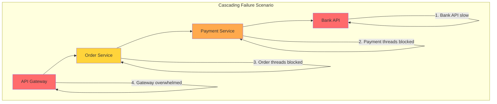
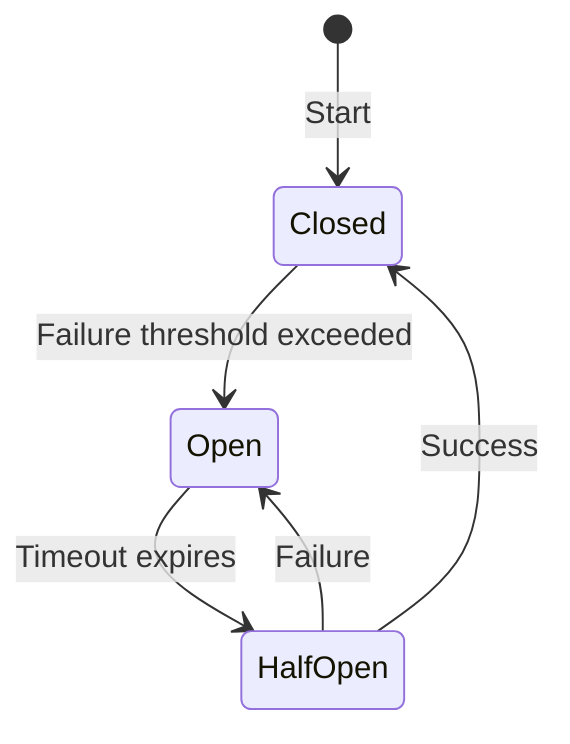
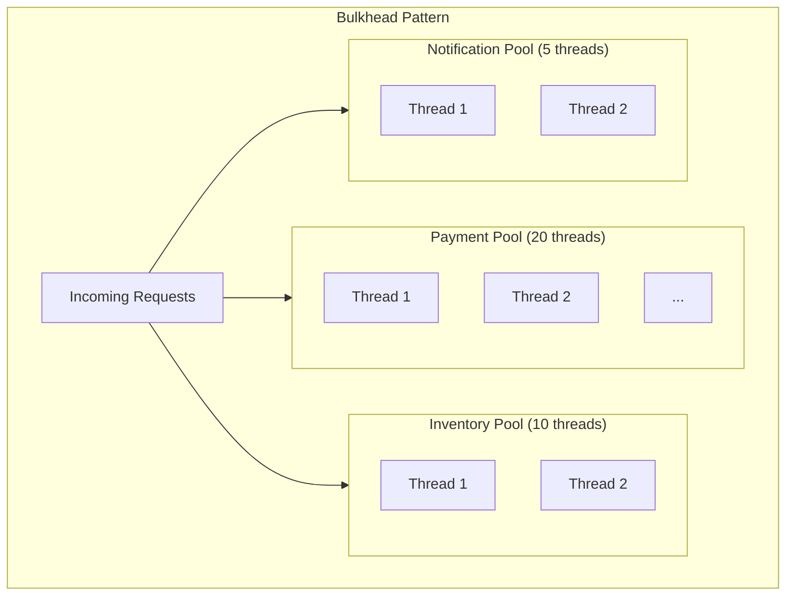
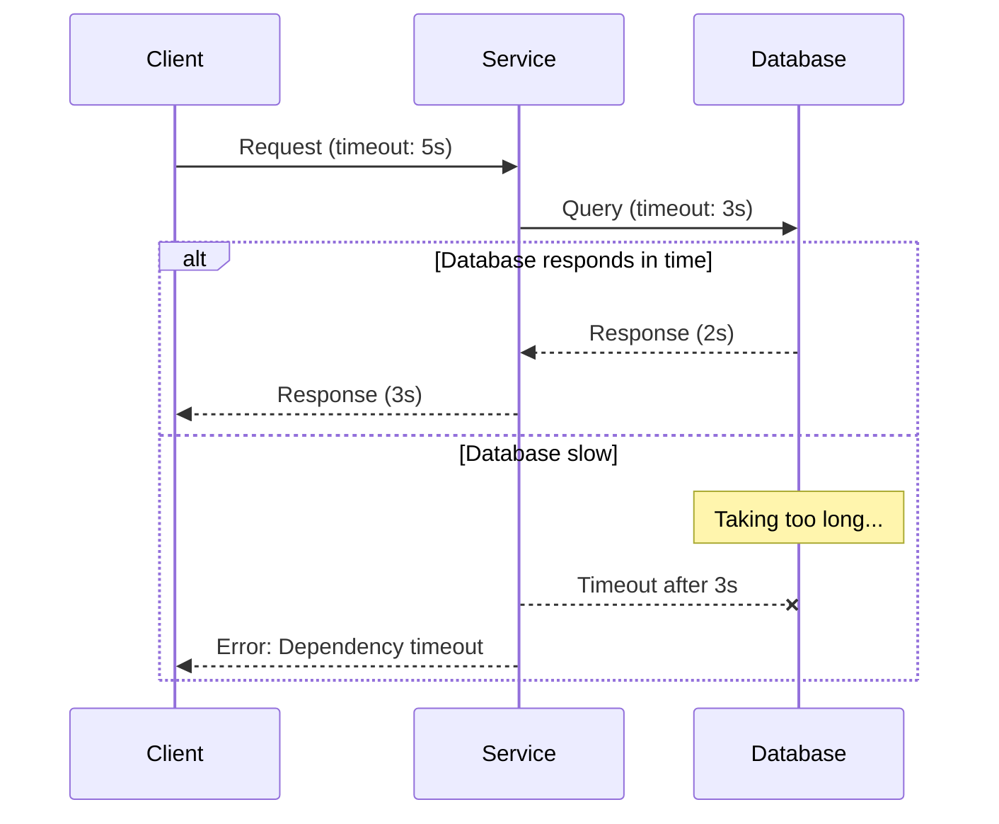
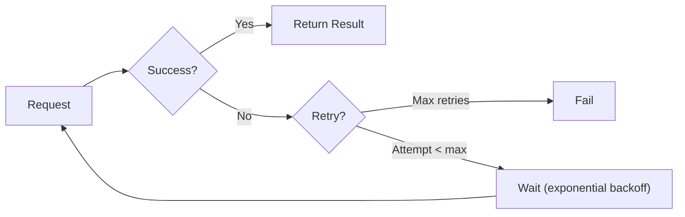
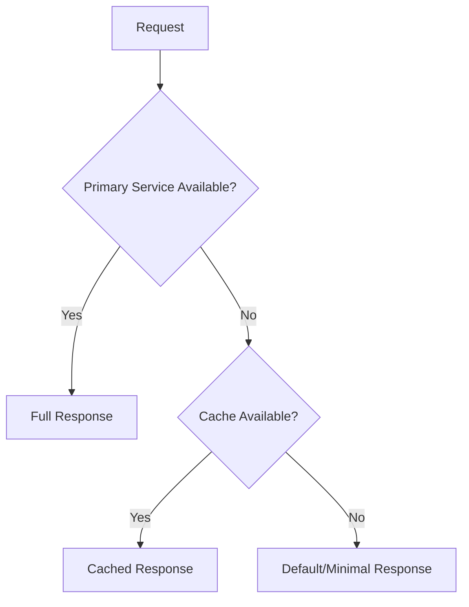
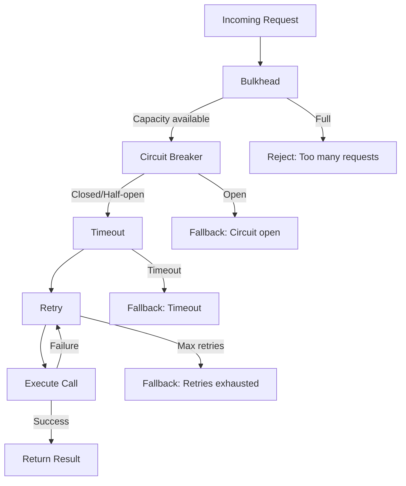

# How to Fix "Cascading Failures" in Microservices

Author: [nawazdhandala](https://www.github.com/nawazdhandala)

Tags: Microservices, Cascading Failures, Circuit Breaker, Resilience, Bulkhead, Timeout, Retry, Fault Tolerance

Description: A practical guide to preventing and recovering from cascading failures in microservices using circuit breakers, bulkheads, timeouts, and graceful degradation patterns.

---

> A single slow service can bring down your entire microservices architecture. When Service A waits for Service B, which waits for Service C, and Service C is slow, the entire chain backs up. Threads exhaust, connections pool, and suddenly everything is failing. This guide shows you how to prevent and recover from cascading failures.

Cascading failures occur when a failure in one service propagates through the system, causing other services to fail. Understanding and preventing these failures is critical for building resilient distributed systems.

---

## Understanding Cascading Failures



### Common Causes

1. **Slow dependencies**: A downstream service responding slowly
2. **Resource exhaustion**: Thread pools, connection pools depleted
3. **Unbounded queues**: Requests piling up with no limit
4. **Missing timeouts**: Waiting forever for responses
5. **Retry storms**: Failed retries amplifying the problem

---

## Pattern 1: Circuit Breaker

The circuit breaker prevents calls to a failing service, allowing it time to recover.



### Implementation with Resilience4j (Java)

```java
// CircuitBreakerConfig.java
package com.example.resilience;

import io.github.resilience4j.circuitbreaker.CircuitBreaker;
import io.github.resilience4j.circuitbreaker.CircuitBreakerConfig;
import io.github.resilience4j.circuitbreaker.CircuitBreakerRegistry;
import org.springframework.context.annotation.Bean;
import org.springframework.context.annotation.Configuration;

import java.time.Duration;

@Configuration
public class CircuitBreakerConfiguration {

    @Bean
    public CircuitBreakerRegistry circuitBreakerRegistry() {
        // Default configuration for all circuit breakers
        CircuitBreakerConfig defaultConfig = CircuitBreakerConfig.custom()
            // Failure rate threshold (percentage)
            .failureRateThreshold(50)
            // Minimum calls before calculating failure rate
            .minimumNumberOfCalls(10)
            // Time to wait in open state before transitioning to half-open
            .waitDurationInOpenState(Duration.ofSeconds(30))
            // Number of calls permitted in half-open state
            .permittedNumberOfCallsInHalfOpenState(5)
            // Sliding window type and size
            .slidingWindowType(CircuitBreakerConfig.SlidingWindowType.COUNT_BASED)
            .slidingWindowSize(20)
            // Slow call configuration
            .slowCallRateThreshold(80)
            .slowCallDurationThreshold(Duration.ofSeconds(2))
            // Record these exceptions as failures
            .recordExceptions(
                java.io.IOException.class,
                java.util.concurrent.TimeoutException.class,
                org.springframework.web.client.HttpServerErrorException.class
            )
            // Ignore these exceptions (don't count as failures)
            .ignoreExceptions(
                org.springframework.web.client.HttpClientErrorException.class
            )
            .build();

        return CircuitBreakerRegistry.of(defaultConfig);
    }

    @Bean
    public CircuitBreaker paymentServiceCircuitBreaker(CircuitBreakerRegistry registry) {
        // Custom configuration for payment service
        CircuitBreakerConfig paymentConfig = CircuitBreakerConfig.custom()
            .failureRateThreshold(30)  // More sensitive for critical service
            .waitDurationInOpenState(Duration.ofSeconds(60))
            .minimumNumberOfCalls(5)
            .build();

        return registry.circuitBreaker("paymentService", paymentConfig);
    }
}
```

```java
// PaymentServiceClient.java
package com.example.service;

import io.github.resilience4j.circuitbreaker.CircuitBreaker;
import io.github.resilience4j.circuitbreaker.CallNotPermittedException;
import io.vavr.control.Try;
import org.springframework.stereotype.Service;
import org.springframework.web.client.RestTemplate;

@Service
public class PaymentServiceClient {

    private final RestTemplate restTemplate;
    private final CircuitBreaker circuitBreaker;

    public PaymentServiceClient(
        RestTemplate restTemplate,
        CircuitBreaker paymentServiceCircuitBreaker
    ) {
        this.restTemplate = restTemplate;
        this.circuitBreaker = paymentServiceCircuitBreaker;

        // Register event handlers for monitoring
        circuitBreaker.getEventPublisher()
            .onStateTransition(event ->
                log.warn("Circuit breaker state changed: {} -> {}",
                    event.getStateTransition().getFromState(),
                    event.getStateTransition().getToState()))
            .onFailureRateExceeded(event ->
                log.error("Failure rate exceeded: {}%", event.getFailureRate()))
            .onCallNotPermitted(event ->
                log.warn("Call not permitted - circuit is open"));
    }

    public PaymentResult processPayment(PaymentRequest request) {
        // Wrap the call with circuit breaker
        return Try.ofSupplier(
            CircuitBreaker.decorateSupplier(circuitBreaker, () ->
                restTemplate.postForObject(
                    "http://payment-service/api/payments",
                    request,
                    PaymentResult.class
                )
            )
        )
        .recover(CallNotPermittedException.class, e -> {
            // Fallback when circuit is open
            log.warn("Circuit open, using fallback for payment");
            return PaymentResult.pending(request.getOrderId());
        })
        .recover(Exception.class, e -> {
            // Fallback for other failures
            log.error("Payment failed, using fallback", e);
            return PaymentResult.failed(request.getOrderId(), e.getMessage());
        })
        .get();
    }
}
```

### Implementation with Python

```python
# circuit_breaker.py
from enum import Enum
from dataclasses import dataclass, field
from typing import Callable, Optional, Type, Tuple
from datetime import datetime, timedelta
import threading
import time
import functools

class CircuitState(Enum):
    CLOSED = "closed"
    OPEN = "open"
    HALF_OPEN = "half_open"

@dataclass
class CircuitBreakerConfig:
    failure_threshold: int = 5
    success_threshold: int = 3
    timeout: float = 30.0  # seconds in open state
    half_open_max_calls: int = 3
    slow_call_threshold: float = 2.0  # seconds
    slow_call_rate_threshold: float = 0.8

@dataclass
class CircuitBreakerMetrics:
    total_calls: int = 0
    failed_calls: int = 0
    successful_calls: int = 0
    slow_calls: int = 0
    not_permitted_calls: int = 0
    last_failure_time: Optional[datetime] = None

class CircuitBreaker:
    """
    Circuit breaker implementation for preventing cascading failures.
    """

    def __init__(self, name: str, config: CircuitBreakerConfig = None):
        self.name = name
        self.config = config or CircuitBreakerConfig()
        self._state = CircuitState.CLOSED
        self._failure_count = 0
        self._success_count = 0
        self._half_open_calls = 0
        self._last_failure_time: Optional[datetime] = None
        self._lock = threading.Lock()
        self.metrics = CircuitBreakerMetrics()
        self._state_change_callbacks = []

    @property
    def state(self) -> CircuitState:
        with self._lock:
            self._check_state_transition()
            return self._state

    def _check_state_transition(self):
        """Check if state should transition based on timeout."""
        if self._state == CircuitState.OPEN and self._last_failure_time:
            elapsed = (datetime.now() - self._last_failure_time).total_seconds()
            if elapsed >= self.config.timeout:
                self._transition_to(CircuitState.HALF_OPEN)

    def _transition_to(self, new_state: CircuitState):
        """Transition to a new state."""
        old_state = self._state
        self._state = new_state

        if new_state == CircuitState.HALF_OPEN:
            self._half_open_calls = 0
            self._success_count = 0
        elif new_state == CircuitState.CLOSED:
            self._failure_count = 0

        # Notify callbacks
        for callback in self._state_change_callbacks:
            try:
                callback(self.name, old_state, new_state)
            except Exception:
                pass

    def on_state_change(self, callback: Callable):
        """Register a callback for state changes."""
        self._state_change_callbacks.append(callback)

    def call(self, func: Callable, *args, **kwargs):
        """
        Execute a function through the circuit breaker.
        """
        with self._lock:
            self._check_state_transition()

            if self._state == CircuitState.OPEN:
                self.metrics.not_permitted_calls += 1
                raise CircuitOpenError(
                    f"Circuit breaker '{self.name}' is open"
                )

            if self._state == CircuitState.HALF_OPEN:
                if self._half_open_calls >= self.config.half_open_max_calls:
                    raise CircuitOpenError(
                        f"Circuit breaker '{self.name}' half-open call limit reached"
                    )
                self._half_open_calls += 1

        # Execute the call
        start_time = time.time()
        try:
            result = func(*args, **kwargs)
            duration = time.time() - start_time
            self._on_success(duration)
            return result

        except Exception as e:
            self._on_failure(e)
            raise

    def _on_success(self, duration: float):
        """Handle successful call."""
        with self._lock:
            self.metrics.total_calls += 1
            self.metrics.successful_calls += 1

            if duration > self.config.slow_call_threshold:
                self.metrics.slow_calls += 1

            if self._state == CircuitState.HALF_OPEN:
                self._success_count += 1
                if self._success_count >= self.config.success_threshold:
                    self._transition_to(CircuitState.CLOSED)
            elif self._state == CircuitState.CLOSED:
                # Reset failure count on success
                self._failure_count = 0

    def _on_failure(self, error: Exception):
        """Handle failed call."""
        with self._lock:
            self.metrics.total_calls += 1
            self.metrics.failed_calls += 1
            self._last_failure_time = datetime.now()
            self.metrics.last_failure_time = self._last_failure_time

            if self._state == CircuitState.HALF_OPEN:
                self._transition_to(CircuitState.OPEN)
            elif self._state == CircuitState.CLOSED:
                self._failure_count += 1
                if self._failure_count >= self.config.failure_threshold:
                    self._transition_to(CircuitState.OPEN)


class CircuitOpenError(Exception):
    """Raised when circuit breaker is open."""
    pass


def circuit_breaker(
    name: str,
    config: CircuitBreakerConfig = None,
    fallback: Callable = None
):
    """
    Decorator to apply circuit breaker to a function.
    """
    cb = CircuitBreaker(name, config)

    def decorator(func: Callable):
        @functools.wraps(func)
        def wrapper(*args, **kwargs):
            try:
                return cb.call(func, *args, **kwargs)
            except CircuitOpenError:
                if fallback:
                    return fallback(*args, **kwargs)
                raise

        # Expose circuit breaker for monitoring
        wrapper.circuit_breaker = cb
        return wrapper

    return decorator


# Usage example
@circuit_breaker(
    name="payment-service",
    config=CircuitBreakerConfig(
        failure_threshold=5,
        timeout=30.0,
        success_threshold=3
    ),
    fallback=lambda order_id, amount: {"status": "pending", "order_id": order_id}
)
def process_payment(order_id: str, amount: float) -> dict:
    """Process payment through external service."""
    response = requests.post(
        "http://payment-service/api/payments",
        json={"order_id": order_id, "amount": amount},
        timeout=5.0
    )
    response.raise_for_status()
    return response.json()
```

---

## Pattern 2: Bulkhead

Bulkheads isolate failures by partitioning resources, preventing one component from consuming all resources.



### Thread Pool Bulkhead

```python
# bulkhead.py
from concurrent.futures import ThreadPoolExecutor, TimeoutError
from dataclasses import dataclass
from typing import Callable, Dict
import threading
import time

@dataclass
class BulkheadConfig:
    max_concurrent_calls: int = 10
    max_wait_duration: float = 5.0  # seconds

class ThreadPoolBulkhead:
    """
    Thread pool bulkhead for isolating concurrent calls.
    """

    def __init__(self, name: str, config: BulkheadConfig = None):
        self.name = name
        self.config = config or BulkheadConfig()
        self._executor = ThreadPoolExecutor(
            max_workers=self.config.max_concurrent_calls,
            thread_name_prefix=f"bulkhead-{name}"
        )
        self._semaphore = threading.Semaphore(self.config.max_concurrent_calls)
        self._metrics = {
            "total_calls": 0,
            "rejected_calls": 0,
            "successful_calls": 0,
            "failed_calls": 0
        }

    def call(self, func: Callable, *args, **kwargs):
        """
        Execute a function within the bulkhead.
        """
        self._metrics["total_calls"] += 1

        # Try to acquire semaphore within wait duration
        acquired = self._semaphore.acquire(
            timeout=self.config.max_wait_duration
        )

        if not acquired:
            self._metrics["rejected_calls"] += 1
            raise BulkheadFullError(
                f"Bulkhead '{self.name}' is full, "
                f"max concurrent calls: {self.config.max_concurrent_calls}"
            )

        try:
            result = func(*args, **kwargs)
            self._metrics["successful_calls"] += 1
            return result
        except Exception as e:
            self._metrics["failed_calls"] += 1
            raise
        finally:
            self._semaphore.release()

    async def call_async(self, func: Callable, *args, timeout: float = None, **kwargs):
        """
        Execute a function asynchronously within the bulkhead.
        """
        self._metrics["total_calls"] += 1

        future = self._executor.submit(func, *args, **kwargs)

        try:
            result = future.result(timeout=timeout or self.config.max_wait_duration)
            self._metrics["successful_calls"] += 1
            return result
        except TimeoutError:
            self._metrics["failed_calls"] += 1
            raise BulkheadTimeoutError(
                f"Call to bulkhead '{self.name}' timed out"
            )
        except Exception as e:
            self._metrics["failed_calls"] += 1
            raise

    @property
    def metrics(self) -> Dict:
        return self._metrics.copy()


class BulkheadFullError(Exception):
    """Raised when bulkhead is at capacity."""
    pass


class BulkheadTimeoutError(Exception):
    """Raised when call times out waiting for bulkhead."""
    pass


# Bulkhead registry for managing multiple bulkheads
class BulkheadRegistry:
    """
    Registry for managing multiple bulkheads.
    """

    def __init__(self):
        self._bulkheads: Dict[str, ThreadPoolBulkhead] = {}

    def get_or_create(
        self,
        name: str,
        config: BulkheadConfig = None
    ) -> ThreadPoolBulkhead:
        """Get existing bulkhead or create new one."""
        if name not in self._bulkheads:
            self._bulkheads[name] = ThreadPoolBulkhead(name, config)
        return self._bulkheads[name]

    def get_all_metrics(self) -> Dict[str, Dict]:
        """Get metrics for all bulkheads."""
        return {
            name: bulkhead.metrics
            for name, bulkhead in self._bulkheads.items()
        }


# Usage
bulkhead_registry = BulkheadRegistry()

# Create bulkheads for different services
payment_bulkhead = bulkhead_registry.get_or_create(
    "payment",
    BulkheadConfig(max_concurrent_calls=20, max_wait_duration=5.0)
)

inventory_bulkhead = bulkhead_registry.get_or_create(
    "inventory",
    BulkheadConfig(max_concurrent_calls=10, max_wait_duration=3.0)
)

# Use bulkhead
def process_order(order_id: str):
    # Payment call is isolated in its own thread pool
    payment_result = payment_bulkhead.call(
        process_payment,
        order_id
    )

    # Inventory call uses a separate thread pool
    inventory_result = inventory_bulkhead.call(
        reserve_inventory,
        order_id
    )

    return {"payment": payment_result, "inventory": inventory_result}
```

---

## Pattern 3: Timeouts

Timeouts prevent indefinite waiting and are the foundation of resilience.



```python
# timeouts.py
import asyncio
import httpx
from typing import TypeVar, Callable
from functools import wraps

T = TypeVar("T")

def with_timeout(timeout_seconds: float):
    """
    Decorator to add timeout to async functions.
    """
    def decorator(func: Callable[..., T]) -> Callable[..., T]:
        @wraps(func)
        async def wrapper(*args, **kwargs) -> T:
            try:
                return await asyncio.wait_for(
                    func(*args, **kwargs),
                    timeout=timeout_seconds
                )
            except asyncio.TimeoutError:
                raise TimeoutError(
                    f"Function {func.__name__} timed out after {timeout_seconds}s"
                )
        return wrapper
    return decorator


class TimeoutConfig:
    """
    Centralized timeout configuration.
    """
    # External service calls
    PAYMENT_SERVICE_TIMEOUT = 5.0
    INVENTORY_SERVICE_TIMEOUT = 3.0
    NOTIFICATION_SERVICE_TIMEOUT = 2.0

    # Database operations
    DB_READ_TIMEOUT = 2.0
    DB_WRITE_TIMEOUT = 5.0

    # Cache operations
    CACHE_TIMEOUT = 0.5

    # HTTP client defaults
    CONNECT_TIMEOUT = 3.0
    READ_TIMEOUT = 10.0
    TOTAL_TIMEOUT = 15.0


class ResilientHttpClient:
    """
    HTTP client with built-in timeout handling.
    """

    def __init__(
        self,
        connect_timeout: float = TimeoutConfig.CONNECT_TIMEOUT,
        read_timeout: float = TimeoutConfig.READ_TIMEOUT,
        total_timeout: float = TimeoutConfig.TOTAL_TIMEOUT
    ):
        self.timeout = httpx.Timeout(
            connect=connect_timeout,
            read=read_timeout,
            write=read_timeout,
            pool=total_timeout
        )
        self.client = httpx.AsyncClient(timeout=self.timeout)

    async def get(self, url: str, **kwargs) -> httpx.Response:
        """GET request with timeout."""
        return await self.client.get(url, **kwargs)

    async def post(self, url: str, **kwargs) -> httpx.Response:
        """POST request with timeout."""
        return await self.client.post(url, **kwargs)

    async def request_with_timeout(
        self,
        method: str,
        url: str,
        timeout: float = None,
        **kwargs
    ) -> httpx.Response:
        """
        Make a request with custom timeout.
        """
        if timeout:
            kwargs["timeout"] = httpx.Timeout(timeout)
        return await self.client.request(method, url, **kwargs)

    async def close(self):
        await self.client.aclose()


# Usage
client = ResilientHttpClient()

@with_timeout(TimeoutConfig.PAYMENT_SERVICE_TIMEOUT)
async def process_payment(order_id: str, amount: float) -> dict:
    """Process payment with timeout."""
    response = await client.post(
        "http://payment-service/api/payments",
        json={"order_id": order_id, "amount": amount}
    )
    return response.json()


# Timeout with fallback
async def get_user_with_fallback(user_id: str) -> dict:
    """Get user data with fallback on timeout."""
    try:
        async with asyncio.timeout(TimeoutConfig.DB_READ_TIMEOUT):
            return await fetch_user_from_db(user_id)
    except asyncio.TimeoutError:
        # Try cache as fallback
        cached = await get_from_cache(f"user:{user_id}")
        if cached:
            return cached
        raise ServiceUnavailableError("User service timeout")
```

---

## Pattern 4: Retry with Backoff

Smart retries recover from transient failures without overwhelming the system.



```python
# retry.py
import asyncio
import random
from typing import Callable, Type, Tuple
from functools import wraps
import logging

logger = logging.getLogger(__name__)

class RetryConfig:
    def __init__(
        self,
        max_attempts: int = 3,
        base_delay: float = 1.0,
        max_delay: float = 60.0,
        exponential_base: float = 2.0,
        jitter: bool = True,
        retryable_exceptions: Tuple[Type[Exception], ...] = (Exception,),
        non_retryable_exceptions: Tuple[Type[Exception], ...] = ()
    ):
        self.max_attempts = max_attempts
        self.base_delay = base_delay
        self.max_delay = max_delay
        self.exponential_base = exponential_base
        self.jitter = jitter
        self.retryable_exceptions = retryable_exceptions
        self.non_retryable_exceptions = non_retryable_exceptions


def calculate_delay(
    attempt: int,
    config: RetryConfig
) -> float:
    """Calculate delay with exponential backoff and optional jitter."""
    delay = config.base_delay * (config.exponential_base ** (attempt - 1))
    delay = min(delay, config.max_delay)

    if config.jitter:
        # Add random jitter (0-100% of delay)
        delay = delay * (0.5 + random.random())

    return delay


def retry(config: RetryConfig = None):
    """
    Decorator for retry with exponential backoff.
    """
    if config is None:
        config = RetryConfig()

    def decorator(func: Callable):
        @wraps(func)
        async def async_wrapper(*args, **kwargs):
            last_exception = None

            for attempt in range(1, config.max_attempts + 1):
                try:
                    return await func(*args, **kwargs)

                except config.non_retryable_exceptions as e:
                    # Don't retry these exceptions
                    logger.error(
                        f"Non-retryable error in {func.__name__}: {e}"
                    )
                    raise

                except config.retryable_exceptions as e:
                    last_exception = e

                    if attempt == config.max_attempts:
                        logger.error(
                            f"Max retries ({config.max_attempts}) exceeded "
                            f"for {func.__name__}: {e}"
                        )
                        raise

                    delay = calculate_delay(attempt, config)
                    logger.warning(
                        f"Attempt {attempt}/{config.max_attempts} failed for "
                        f"{func.__name__}: {e}. Retrying in {delay:.2f}s"
                    )
                    await asyncio.sleep(delay)

            raise last_exception

        @wraps(func)
        def sync_wrapper(*args, **kwargs):
            import time
            last_exception = None

            for attempt in range(1, config.max_attempts + 1):
                try:
                    return func(*args, **kwargs)

                except config.non_retryable_exceptions as e:
                    raise

                except config.retryable_exceptions as e:
                    last_exception = e

                    if attempt == config.max_attempts:
                        raise

                    delay = calculate_delay(attempt, config)
                    logger.warning(
                        f"Attempt {attempt}/{config.max_attempts} failed. "
                        f"Retrying in {delay:.2f}s"
                    )
                    time.sleep(delay)

            raise last_exception

        # Return appropriate wrapper based on function type
        if asyncio.iscoroutinefunction(func):
            return async_wrapper
        return sync_wrapper

    return decorator


# Usage examples

# Basic retry
@retry()
async def fetch_data(url: str) -> dict:
    async with httpx.AsyncClient() as client:
        response = await client.get(url)
        response.raise_for_status()
        return response.json()


# Custom retry configuration
@retry(RetryConfig(
    max_attempts=5,
    base_delay=0.5,
    max_delay=30.0,
    retryable_exceptions=(
        httpx.ConnectError,
        httpx.TimeoutException,
        httpx.HTTPStatusError
    ),
    non_retryable_exceptions=(
        ValueError,
        httpx.HTTPStatusError  # Only for 4xx errors
    )
))
async def process_payment(order_id: str, amount: float) -> dict:
    async with httpx.AsyncClient() as client:
        response = await client.post(
            "http://payment-service/api/payments",
            json={"order_id": order_id, "amount": amount}
        )

        # Don't retry client errors
        if 400 <= response.status_code < 500:
            raise ValueError(f"Invalid request: {response.text}")

        response.raise_for_status()
        return response.json()
```

---

## Pattern 5: Graceful Degradation

When a dependency fails, provide a degraded but functional experience.



```python
# graceful_degradation.py
from dataclasses import dataclass
from typing import Optional, Callable, Any
from functools import wraps
import asyncio

@dataclass
class DegradationConfig:
    use_cache: bool = True
    cache_ttl: int = 300  # seconds
    use_default: bool = True
    default_value: Any = None
    log_degradation: bool = True

class GracefulDegradation:
    """
    Provides graceful degradation with multiple fallback levels.
    """

    def __init__(self, cache_client, config: DegradationConfig = None):
        self.cache = cache_client
        self.config = config or DegradationConfig()

    async def execute_with_fallback(
        self,
        primary: Callable,
        cache_key: str,
        default_factory: Callable = None,
        *args,
        **kwargs
    ):
        """
        Execute primary function with cache and default fallbacks.
        """
        # Try primary
        try:
            result = await primary(*args, **kwargs)

            # Cache successful result
            if self.config.use_cache and result is not None:
                await self.cache.set(
                    cache_key,
                    result,
                    ttl=self.config.cache_ttl
                )

            return result

        except Exception as primary_error:
            if self.config.log_degradation:
                logger.warning(
                    f"Primary failed, attempting fallback: {primary_error}"
                )

            # Try cache
            if self.config.use_cache:
                try:
                    cached = await self.cache.get(cache_key)
                    if cached is not None:
                        logger.info(f"Returning cached value for {cache_key}")
                        return cached
                except Exception as cache_error:
                    logger.warning(f"Cache fallback failed: {cache_error}")

            # Try default
            if self.config.use_default:
                if default_factory:
                    return default_factory(*args, **kwargs)
                return self.config.default_value

            # All fallbacks exhausted
            raise primary_error


# Decorator for graceful degradation
def graceful(
    cache_key_fn: Callable[..., str],
    default_factory: Callable = None,
    cache_ttl: int = 300
):
    """
    Decorator for graceful degradation with caching.
    """
    def decorator(func: Callable):
        @wraps(func)
        async def wrapper(*args, **kwargs):
            cache_key = cache_key_fn(*args, **kwargs)

            try:
                result = await func(*args, **kwargs)

                # Cache the result
                await cache.set(cache_key, result, ttl=cache_ttl)

                return result

            except Exception as e:
                logger.warning(f"Function {func.__name__} failed: {e}")

                # Try cache
                cached = await cache.get(cache_key)
                if cached is not None:
                    logger.info(f"Returning cached result for {func.__name__}")
                    return cached

                # Try default
                if default_factory:
                    logger.info(f"Returning default for {func.__name__}")
                    return default_factory(*args, **kwargs)

                raise

        return wrapper
    return decorator


# Usage examples
class ProductService:
    """
    Product service with graceful degradation.
    """

    def __init__(self, cache_client, product_api):
        self.cache = cache_client
        self.api = product_api
        self.degradation = GracefulDegradation(cache_client)

    async def get_product(self, product_id: str) -> dict:
        """
        Get product with multiple fallback levels.
        """
        return await self.degradation.execute_with_fallback(
            primary=lambda: self.api.get_product(product_id),
            cache_key=f"product:{product_id}",
            default_factory=lambda: {
                "id": product_id,
                "name": "Product unavailable",
                "price": 0,
                "available": False,
                "_degraded": True
            }
        )

    @graceful(
        cache_key_fn=lambda self, category: f"products:category:{category}",
        default_factory=lambda self, category: [],
        cache_ttl=600
    )
    async def get_products_by_category(self, category: str) -> list:
        """Get products by category with graceful degradation."""
        return await self.api.get_products_by_category(category)


# Partial degradation example
class OrderService:
    """
    Order service that degrades non-critical features.
    """

    async def create_order(self, order_data: dict) -> dict:
        """
        Create order with graceful degradation of non-critical features.
        """
        # Critical: Must succeed
        order = await self._create_order_record(order_data)

        # Non-critical: Can degrade
        recommendations = await self._get_recommendations_safely(
            order_data["user_id"]
        )

        shipping_estimate = await self._get_shipping_estimate_safely(
            order_data["address"]
        )

        return {
            "order": order,
            "recommendations": recommendations,
            "shipping_estimate": shipping_estimate
        }

    async def _get_recommendations_safely(self, user_id: str) -> list:
        """Get recommendations, return empty list on failure."""
        try:
            async with asyncio.timeout(1.0):  # Short timeout
                return await self.recommendation_service.get(user_id)
        except Exception as e:
            logger.warning(f"Recommendations unavailable: {e}")
            return []  # Degrade to no recommendations

    async def _get_shipping_estimate_safely(self, address: dict) -> dict:
        """Get shipping estimate, return default on failure."""
        try:
            async with asyncio.timeout(2.0):
                return await self.shipping_service.estimate(address)
        except Exception as e:
            logger.warning(f"Shipping estimate unavailable: {e}")
            return {
                "estimated_days": "3-5",
                "price": "Calculated at checkout",
                "_estimated": True
            }
```

---

## Combined Resilience Strategy



```python
# combined_resilience.py
from dataclasses import dataclass

@dataclass
class ResilienceConfig:
    # Circuit breaker
    cb_failure_threshold: int = 5
    cb_timeout: float = 30.0

    # Bulkhead
    bh_max_concurrent: int = 10
    bh_max_wait: float = 5.0

    # Timeout
    timeout: float = 10.0

    # Retry
    retry_max_attempts: int = 3
    retry_base_delay: float = 1.0

class ResilientCall:
    """
    Combines multiple resilience patterns for robust service calls.
    """

    def __init__(
        self,
        name: str,
        config: ResilienceConfig = None,
        fallback: Callable = None
    ):
        self.name = name
        self.config = config or ResilienceConfig()
        self.fallback = fallback

        # Initialize patterns
        self.circuit_breaker = CircuitBreaker(
            name,
            CircuitBreakerConfig(
                failure_threshold=self.config.cb_failure_threshold,
                timeout=self.config.cb_timeout
            )
        )

        self.bulkhead = ThreadPoolBulkhead(
            name,
            BulkheadConfig(
                max_concurrent_calls=self.config.bh_max_concurrent,
                max_wait_duration=self.config.bh_max_wait
            )
        )

        self.retry_config = RetryConfig(
            max_attempts=self.config.retry_max_attempts,
            base_delay=self.config.retry_base_delay
        )

    async def call(self, func: Callable, *args, **kwargs):
        """
        Execute function with all resilience patterns applied.
        """
        try:
            # 1. Bulkhead - limit concurrent calls
            async def bulkhead_wrapped():
                return self.bulkhead.call(
                    lambda: asyncio.run_coroutine_threadsafe(
                        self._with_timeout_and_retry(func, *args, **kwargs),
                        asyncio.get_event_loop()
                    ).result()
                )

            # 2. Circuit breaker - fail fast if service is down
            return self.circuit_breaker.call(bulkhead_wrapped)

        except (CircuitOpenError, BulkheadFullError, TimeoutError) as e:
            # Use fallback if available
            if self.fallback:
                logger.warning(f"Using fallback for {self.name}: {e}")
                return self.fallback(*args, **kwargs)
            raise

    async def _with_timeout_and_retry(self, func: Callable, *args, **kwargs):
        """Apply timeout and retry to the function call."""
        last_error = None

        for attempt in range(1, self.retry_config.max_attempts + 1):
            try:
                # Apply timeout
                return await asyncio.wait_for(
                    func(*args, **kwargs),
                    timeout=self.config.timeout
                )

            except asyncio.TimeoutError as e:
                last_error = e
                if attempt == self.retry_config.max_attempts:
                    raise TimeoutError(
                        f"Call to {self.name} timed out after "
                        f"{self.config.timeout}s"
                    )

            except Exception as e:
                last_error = e
                if attempt == self.retry_config.max_attempts:
                    raise

            # Wait before retry
            delay = calculate_delay(attempt, self.retry_config)
            await asyncio.sleep(delay)

        raise last_error

    @property
    def metrics(self) -> dict:
        """Get combined metrics from all patterns."""
        return {
            "circuit_breaker": {
                "state": self.circuit_breaker.state.value,
                "metrics": self.circuit_breaker.metrics
            },
            "bulkhead": self.bulkhead.metrics
        }


# Usage
payment_client = ResilientCall(
    name="payment-service",
    config=ResilienceConfig(
        cb_failure_threshold=5,
        cb_timeout=30.0,
        bh_max_concurrent=20,
        timeout=5.0,
        retry_max_attempts=3
    ),
    fallback=lambda order_id, amount: {
        "status": "pending",
        "order_id": order_id,
        "message": "Payment will be processed later"
    }
)

async def process_order_payment(order_id: str, amount: float) -> dict:
    return await payment_client.call(
        process_payment_api,
        order_id,
        amount
    )
```

---

## Monitoring Cascading Failures

```python
# monitoring.py
from prometheus_client import Counter, Gauge, Histogram

# Circuit breaker metrics
circuit_breaker_state = Gauge(
    'circuit_breaker_state',
    'Current state of circuit breaker (0=closed, 1=open, 2=half-open)',
    ['service']
)

circuit_breaker_calls = Counter(
    'circuit_breaker_calls_total',
    'Total calls through circuit breaker',
    ['service', 'result']  # result: success, failure, rejected
)

# Bulkhead metrics
bulkhead_available = Gauge(
    'bulkhead_available_concurrent_calls',
    'Available concurrent calls in bulkhead',
    ['service']
)

bulkhead_rejected = Counter(
    'bulkhead_rejected_total',
    'Total calls rejected by bulkhead',
    ['service']
)

# Latency metrics
service_latency = Histogram(
    'service_call_duration_seconds',
    'Service call latency',
    ['service', 'endpoint'],
    buckets=[0.1, 0.25, 0.5, 1.0, 2.5, 5.0, 10.0]
)

# Alert rules (Prometheus)
ALERT_RULES = """
groups:
- name: cascading_failures
  rules:
  - alert: CircuitBreakerOpen
    expr: circuit_breaker_state == 1
    for: 1m
    labels:
      severity: warning
    annotations:
      summary: "Circuit breaker open for {{ $labels.service }}"

  - alert: HighBulkheadRejection
    expr: rate(bulkhead_rejected_total[5m]) > 10
    for: 2m
    labels:
      severity: warning
    annotations:
      summary: "High bulkhead rejection rate for {{ $labels.service }}"

  - alert: HighServiceLatency
    expr: histogram_quantile(0.99, service_call_duration_seconds) > 5
    for: 5m
    labels:
      severity: critical
    annotations:
      summary: "P99 latency > 5s for {{ $labels.service }}"
"""
```

---

## Best Practices

### 1. Set Timeouts Everywhere

```python
# Every external call needs a timeout
async with httpx.AsyncClient(timeout=5.0) as client:
    response = await client.get(url)

# Database queries
async with asyncio.timeout(2.0):
    result = await db.fetch(query)

# Cache operations
async with asyncio.timeout(0.5):
    value = await cache.get(key)
```

### 2. Fail Fast, Recover Slowly

```python
# Circuit breaker: Open quickly on failures
cb_config = CircuitBreakerConfig(
    failure_threshold=5,  # Open after 5 failures
    timeout=60.0,  # Wait 60s before trying again
    success_threshold=3  # Need 3 successes to close
)
```

### 3. Implement Health Checks

```python
@app.get("/health")
async def health_check():
    """Comprehensive health check."""
    checks = {
        "database": await check_database(),
        "cache": await check_cache(),
        "payment_service": payment_client.circuit_breaker.state != CircuitState.OPEN
    }

    healthy = all(checks.values())
    return JSONResponse(
        content={"healthy": healthy, "checks": checks},
        status_code=200 if healthy else 503
    )
```

---

## Conclusion

Preventing cascading failures requires a defense-in-depth approach:

- **Circuit Breakers**: Fail fast when dependencies are down
- **Bulkheads**: Isolate failures to prevent resource exhaustion
- **Timeouts**: Never wait indefinitely
- **Retries**: Recover from transient failures with backoff
- **Graceful Degradation**: Provide value even when degraded

Apply these patterns consistently across all service boundaries to build truly resilient microservices.

---

*Need to detect cascading failures before they impact users? [OneUptime](https://oneuptime.com) provides real-time monitoring of circuit breaker states, latency percentiles, and error rates across your microservices, with automatic alerting when patterns indicate an impending cascade.*

**Related Reading:**
- [How to Fix "Data Inconsistency" Across Services](https://oneuptime.com/blog/post/2026-01-24-data-inconsistency-across-services/view)
- [How to Handle Service Mesh Implementation](https://oneuptime.com/blog/post/2026-01-24-service-mesh-implementation/view)
