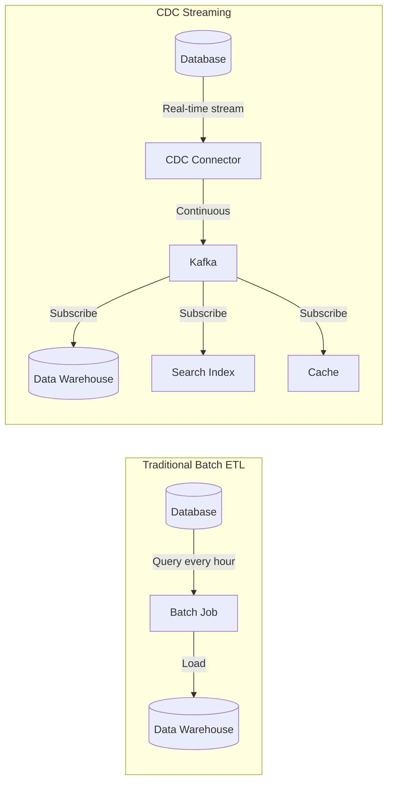
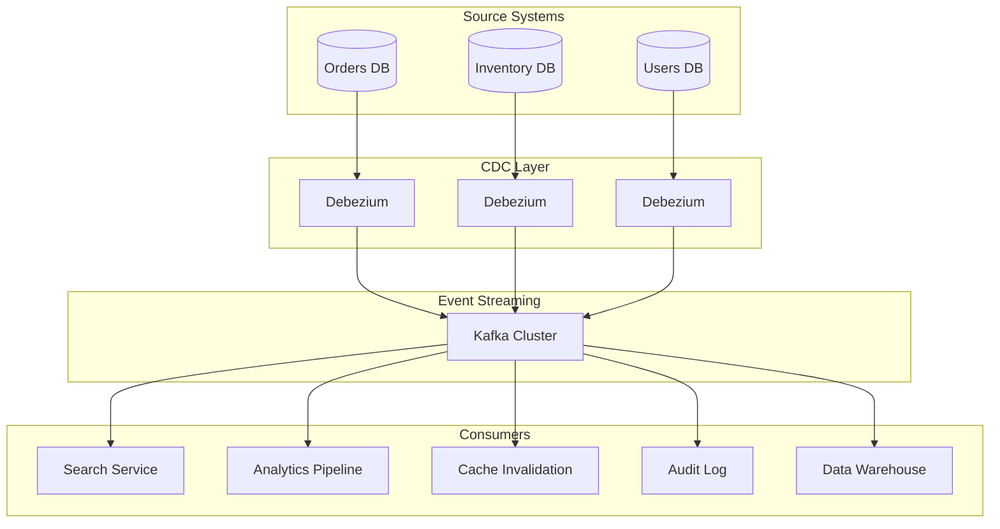

# How to Handle Change Data Capture (CDC)

Author: [nawazdhandala](https://www.github.com/nawazdhandala)

Tags: CDC, Change Data Capture, Data Engineering, Debezium, Kafka, Database Replication, Real-time Data

Description: Learn how to implement Change Data Capture (CDC) to stream database changes in real-time for analytics, replication, and event-driven architectures.

---

Change Data Capture (CDC) is a technique for tracking and capturing changes in a database so that downstream systems can react to those changes in real-time. Instead of running periodic batch queries to find what changed, CDC streams every insert, update, and delete as it happens. This guide covers CDC concepts, implementation patterns, and practical examples using popular tools.

## Why Use CDC?

Traditional approaches to moving data between systems involve periodic batch jobs that query source databases for changes. This creates several problems: high latency between when changes occur and when they appear downstream, heavy load on source databases from repeated queries, and difficulty in capturing deletes or intermediate states.



## CDC Implementation Methods

### 1. Log-Based CDC (Recommended)

The most reliable approach reads the database's transaction log directly.

**PostgreSQL with Debezium:**

```yaml
# docker-compose.yml for Debezium CDC
version: '3'
services:
  postgres:
    image: postgres:15
    environment:
      POSTGRES_PASSWORD: postgres
    command:
      - "postgres"
      - "-c"
      - "wal_level=logical"  # Enable logical replication
      - "-c"
      - "max_wal_senders=4"
      - "-c"
      - "max_replication_slots=4"
    ports:
      - "5432:5432"

  zookeeper:
    image: confluentinc/cp-zookeeper:7.5.0
    environment:
      ZOOKEEPER_CLIENT_PORT: 2181

  kafka:
    image: confluentinc/cp-kafka:7.5.0
    depends_on:
      - zookeeper
    environment:
      KAFKA_BROKER_ID: 1
      KAFKA_ZOOKEEPER_CONNECT: zookeeper:2181
      KAFKA_ADVERTISED_LISTENERS: PLAINTEXT://kafka:9092
      KAFKA_OFFSETS_TOPIC_REPLICATION_FACTOR: 1
    ports:
      - "9092:9092"

  debezium:
    image: debezium/connect:2.4
    depends_on:
      - kafka
      - postgres
    environment:
      BOOTSTRAP_SERVERS: kafka:9092
      GROUP_ID: 1
      CONFIG_STORAGE_TOPIC: connect_configs
      OFFSET_STORAGE_TOPIC: connect_offsets
      STATUS_STORAGE_TOPIC: connect_statuses
    ports:
      - "8083:8083"
```

**Register the Debezium Connector:**

```bash
curl -X POST http://localhost:8083/connectors \
  -H "Content-Type: application/json" \
  -d '{
    "name": "orders-connector",
    "config": {
      "connector.class": "io.debezium.connector.postgresql.PostgresConnector",
      "database.hostname": "postgres",
      "database.port": "5432",
      "database.user": "postgres",
      "database.password": "postgres",
      "database.dbname": "myapp",
      "database.server.name": "myapp",
      "table.include.list": "public.orders,public.order_items",
      "plugin.name": "pgoutput",
      "slot.name": "debezium_slot",
      "publication.name": "dbz_publication",
      "topic.prefix": "cdc",
      "transforms": "unwrap",
      "transforms.unwrap.type": "io.debezium.transforms.ExtractNewRecordState",
      "transforms.unwrap.drop.tombstones": "false",
      "transforms.unwrap.delete.handling.mode": "rewrite"
    }
  }'
```

### 2. Trigger-Based CDC

For databases without log access, triggers can capture changes.

```sql
-- Create audit table
CREATE TABLE order_changes (
    change_id BIGSERIAL PRIMARY KEY,
    operation VARCHAR(10) NOT NULL,
    changed_at TIMESTAMP DEFAULT CURRENT_TIMESTAMP,
    order_id BIGINT NOT NULL,
    old_data JSONB,
    new_data JSONB
);

-- Create trigger function
CREATE OR REPLACE FUNCTION capture_order_changes()
RETURNS TRIGGER AS $$
BEGIN
    IF TG_OP = 'INSERT' THEN
        INSERT INTO order_changes (operation, order_id, new_data)
        VALUES ('INSERT', NEW.id, to_jsonb(NEW));
        RETURN NEW;
    ELSIF TG_OP = 'UPDATE' THEN
        INSERT INTO order_changes (operation, order_id, old_data, new_data)
        VALUES ('UPDATE', NEW.id, to_jsonb(OLD), to_jsonb(NEW));
        RETURN NEW;
    ELSIF TG_OP = 'DELETE' THEN
        INSERT INTO order_changes (operation, order_id, old_data)
        VALUES ('DELETE', OLD.id, to_jsonb(OLD));
        RETURN OLD;
    END IF;
END;
$$ LANGUAGE plpgsql;

-- Attach trigger to table
CREATE TRIGGER orders_cdc_trigger
    AFTER INSERT OR UPDATE OR DELETE ON orders
    FOR EACH ROW EXECUTE FUNCTION capture_order_changes();
```

### 3. Query-Based CDC (Last Resort)

When other methods are not available, track changes with timestamps.

```sql
-- Table needs change tracking columns
ALTER TABLE orders ADD COLUMN updated_at TIMESTAMP DEFAULT CURRENT_TIMESTAMP;
ALTER TABLE orders ADD COLUMN is_deleted BOOLEAN DEFAULT FALSE;

-- Create index for efficient change queries
CREATE INDEX idx_orders_updated_at ON orders(updated_at);

-- Polling query for changes
SELECT * FROM orders
WHERE updated_at > :last_sync_timestamp
ORDER BY updated_at ASC
LIMIT 1000;
```

## Processing CDC Events

### Kafka Consumer in Python

```python
from confluent_kafka import Consumer, KafkaError
import json

# Configure consumer
consumer_config = {
    'bootstrap.servers': 'localhost:9092',
    'group.id': 'cdc-processor',
    'auto.offset.reset': 'earliest',
    'enable.auto.commit': False  # Manual commit for exactly-once
}

consumer = Consumer(consumer_config)
consumer.subscribe(['cdc.public.orders'])

def process_cdc_event(event):
    """Process a single CDC event."""
    payload = json.loads(event.value())

    operation = payload.get('__op', 'r')  # r=read, c=create, u=update, d=delete

    if operation == 'c':
        # Handle insert
        handle_insert(payload)
    elif operation == 'u':
        # Handle update
        handle_update(payload)
    elif operation == 'd':
        # Handle delete
        handle_delete(payload)

    return True

def handle_insert(data):
    """Process new record."""
    order_id = data['id']
    print(f"New order created: {order_id}")
    # Update search index, cache, analytics, etc.

def handle_update(data):
    """Process updated record."""
    order_id = data['id']
    print(f"Order updated: {order_id}")
    # Propagate changes to downstream systems

def handle_delete(data):
    """Process deleted record."""
    order_id = data['id']
    print(f"Order deleted: {order_id}")
    # Remove from downstream systems

# Main processing loop
try:
    while True:
        msg = consumer.poll(timeout=1.0)

        if msg is None:
            continue
        if msg.error():
            if msg.error().code() == KafkaError._PARTITION_EOF:
                continue
            else:
                print(f"Error: {msg.error()}")
                continue

        if process_cdc_event(msg):
            # Commit offset after successful processing
            consumer.commit(asynchronous=False)

except KeyboardInterrupt:
    pass
finally:
    consumer.close()
```

### Streaming to Data Warehouse with Flink SQL

```sql
-- Create CDC source table
CREATE TABLE orders_cdc (
    id BIGINT,
    customer_id BIGINT,
    status STRING,
    total_amount DECIMAL(10, 2),
    created_at TIMESTAMP(3),
    updated_at TIMESTAMP(3),
    PRIMARY KEY (id) NOT ENFORCED
) WITH (
    'connector' = 'kafka',
    'topic' = 'cdc.public.orders',
    'properties.bootstrap.servers' = 'kafka:9092',
    'properties.group.id' = 'flink-cdc',
    'format' = 'debezium-json',
    'scan.startup.mode' = 'earliest-offset'
);

-- Create sink table in data warehouse
CREATE TABLE orders_warehouse (
    id BIGINT,
    customer_id BIGINT,
    status STRING,
    total_amount DECIMAL(10, 2),
    created_at TIMESTAMP(3),
    updated_at TIMESTAMP(3),
    PRIMARY KEY (id) NOT ENFORCED
) WITH (
    'connector' = 'jdbc',
    'url' = 'jdbc:postgresql://warehouse:5432/analytics',
    'table-name' = 'orders',
    'driver' = 'org.postgresql.Driver',
    'username' = 'analytics',
    'password' = 'secret'
);

-- Stream changes to warehouse
INSERT INTO orders_warehouse
SELECT * FROM orders_cdc;
```

## CDC Architecture Patterns



## Handling CDC Challenges

### 1. Schema Evolution

```python
# Use schema registry for compatibility
from confluent_kafka.schema_registry import SchemaRegistryClient
from confluent_kafka.schema_registry.avro import AvroDeserializer

schema_registry_conf = {'url': 'http://schema-registry:8081'}
schema_registry_client = SchemaRegistryClient(schema_registry_conf)

# Deserializer handles schema evolution automatically
avro_deserializer = AvroDeserializer(
    schema_registry_client,
    schema_str=None  # Fetch from registry
)
```

### 2. Ordering Guarantees

```python
# Ensure ordering by partitioning on primary key
connector_config = {
    # ... other config ...
    "key.converter": "org.apache.kafka.connect.json.JsonConverter",
    "transforms": "extractKey",
    "transforms.extractKey.type": "org.apache.kafka.connect.transforms.ExtractField$Key",
    "transforms.extractKey.field": "id",
    # Kafka will route same key to same partition
}
```

### 3. Exactly-Once Processing

```python
from confluent_kafka import Producer, Consumer

def process_with_exactly_once(consumer, producer, process_func):
    """Process CDC events with exactly-once semantics."""

    # Initialize transaction
    producer.init_transactions()

    while True:
        msg = consumer.poll(timeout=1.0)
        if msg is None:
            continue

        try:
            # Begin transaction
            producer.begin_transaction()

            # Process and produce output
            result = process_func(msg)
            if result:
                producer.produce('output-topic', value=result)

            # Commit consumer offset as part of transaction
            producer.send_offsets_to_transaction(
                consumer.position(consumer.assignment()),
                consumer.consumer_group_metadata()
            )

            # Commit transaction atomically
            producer.commit_transaction()

        except Exception as e:
            producer.abort_transaction()
            raise e
```

## Best Practices

1. **Use log-based CDC when possible** - It is the most reliable and has the lowest overhead on source databases
2. **Monitor replication lag** - Set up alerts when CDC falls behind
3. **Plan for schema changes** - Use schema registry and test migrations thoroughly
4. **Handle duplicates** - Design consumers to be idempotent
5. **Secure the pipeline** - Encrypt data in transit and use proper access controls
6. **Test failure scenarios** - Verify recovery works correctly

## Conclusion

Change Data Capture transforms how we build data pipelines by enabling real-time data movement with minimal impact on source systems. Whether you choose Debezium for log-based CDC, triggers for simpler setups, or query-based approaches for legacy systems, the key is matching the method to your requirements for latency, reliability, and operational complexity. Start with a single table, validate the pipeline end-to-end, then expand to more sources as you gain confidence in your CDC infrastructure.
