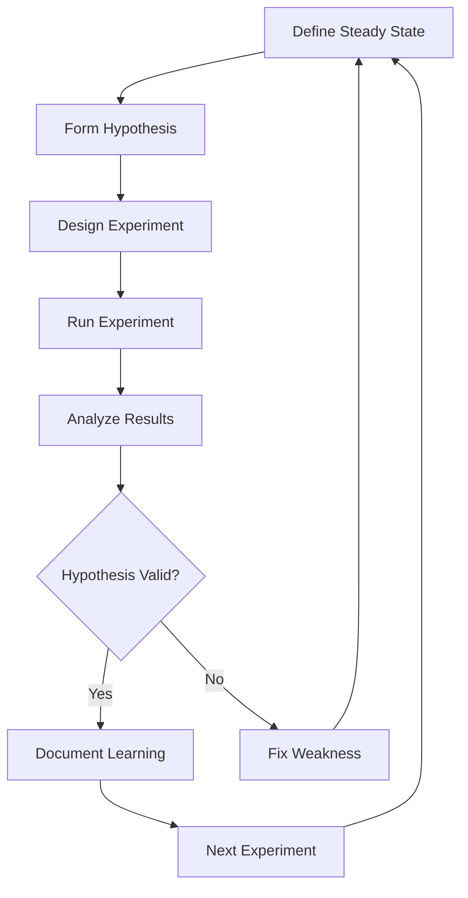
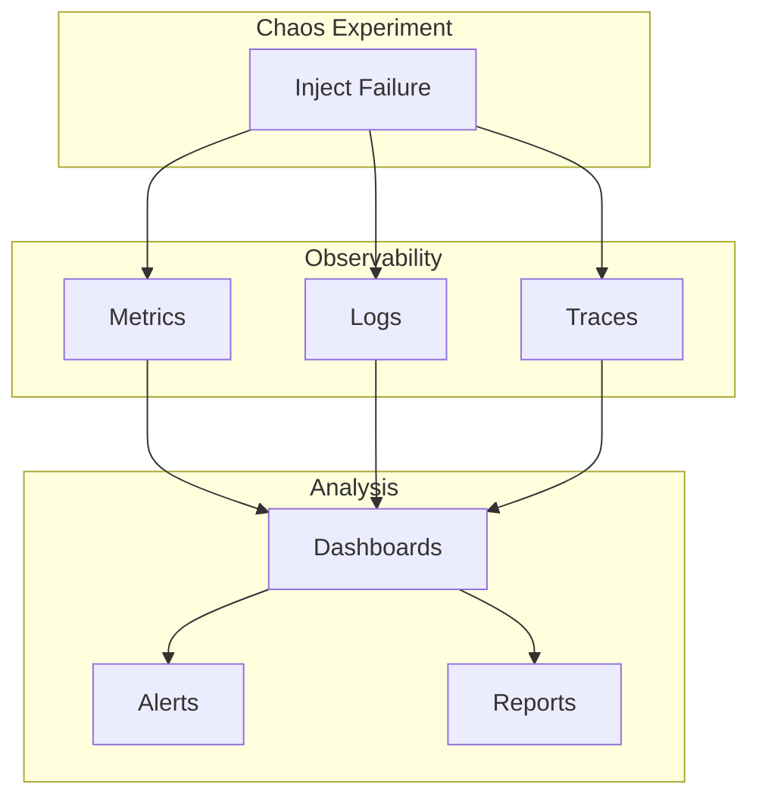

# How to Handle Chaos Engineering in Microservices

Author: [nawazdhandala](https://www.github.com/nawazdhandala)

Tags: Chaos Engineering, Microservices, Resilience, Fault Injection, Testing, Site Reliability, Netflix, Gremlin, Observability

Description: A practical guide to implementing chaos engineering practices in microservices architectures to build resilient systems through controlled failure injection.

---

> Chaos engineering is the practice of intentionally introducing failures to verify system resilience. This guide shows you how to implement chaos experiments in microservices to discover weaknesses before they cause production incidents.

The goal is not to break things randomly, but to learn how your system behaves under adverse conditions and improve its resilience.

---

## Understanding Chaos Engineering

Chaos engineering follows a scientific method:



Key principles:

1. **Define steady state**: What does "working" look like?
2. **Hypothesize**: What should happen when we inject chaos?
3. **Minimize blast radius**: Start small, expand gradually
4. **Run in production**: That is where real conditions exist

---

## Building a Chaos Framework

### Core Chaos Engine

```python
# chaos_engine.py
from dataclasses import dataclass, field
from typing import Callable, Optional, Dict, List, Any
from datetime import datetime, timedelta
from enum import Enum
import asyncio
import random
from opentelemetry import trace

tracer = trace.get_tracer(__name__)

class ChaosType(Enum):
    LATENCY = "latency"
    ERROR = "error"
    RESOURCE = "resource"
    NETWORK = "network"
    DATA = "data"


class ExperimentStatus(Enum):
    PENDING = "pending"
    RUNNING = "running"
    COMPLETED = "completed"
    FAILED = "failed"
    ABORTED = "aborted"


@dataclass
class SteadyStateMetric:
    """Defines what normal looks like"""
    name: str
    query: str  # Prometheus query or similar
    threshold_min: float
    threshold_max: float
    description: str = ""


@dataclass
class ChaosExperiment:
    """Defines a chaos experiment"""
    id: str
    name: str
    description: str
    chaos_type: ChaosType
    target_service: str
    target_percentage: float = 100.0  # Percentage of requests affected
    duration_seconds: int = 60
    steady_state_metrics: List[SteadyStateMetric] = field(default_factory=list)
    parameters: Dict[str, Any] = field(default_factory=dict)
    abort_conditions: List[str] = field(default_factory=list)
    status: ExperimentStatus = ExperimentStatus.PENDING
    started_at: Optional[str] = None
    completed_at: Optional[str] = None
    results: Dict[str, Any] = field(default_factory=dict)


class ChaosEngine:
    """Core chaos engineering engine"""

    def __init__(self, metrics_client, alerting_client):
        self.metrics = metrics_client
        self.alerting = alerting_client
        self.active_experiments: Dict[str, ChaosExperiment] = {}
        self.chaos_handlers: Dict[ChaosType, Callable] = {}

    def register_handler(self, chaos_type: ChaosType, handler: Callable):
        """Register a chaos injection handler"""
        self.chaos_handlers[chaos_type] = handler

    async def check_steady_state(self, metrics: List[SteadyStateMetric]) -> Dict[str, Any]:
        """Check if system is in steady state"""

        with tracer.start_as_current_span("check_steady_state") as span:
            results = {"healthy": True, "metrics": []}

            for metric in metrics:
                value = await self.metrics.query(metric.query)

                is_healthy = metric.threshold_min <= value <= metric.threshold_max

                results["metrics"].append({
                    "name": metric.name,
                    "value": value,
                    "threshold_min": metric.threshold_min,
                    "threshold_max": metric.threshold_max,
                    "healthy": is_healthy
                })

                if not is_healthy:
                    results["healthy"] = False

                span.set_attribute(f"metric.{metric.name}", value)
                span.set_attribute(f"metric.{metric.name}.healthy", is_healthy)

            span.set_attribute("steady_state.healthy", results["healthy"])

            return results

    async def run_experiment(self, experiment: ChaosExperiment) -> Dict[str, Any]:
        """Run a chaos experiment"""

        with tracer.start_as_current_span("chaos_experiment") as span:
            span.set_attribute("experiment.id", experiment.id)
            span.set_attribute("experiment.type", experiment.chaos_type.value)
            span.set_attribute("experiment.target", experiment.target_service)

            # Verify steady state before starting
            pre_check = await self.check_steady_state(experiment.steady_state_metrics)

            if not pre_check["healthy"]:
                span.set_attribute("experiment.status", "aborted_pre_check")
                return {
                    "status": "aborted",
                    "reason": "System not in steady state before experiment",
                    "pre_check": pre_check
                }

            # Start experiment
            experiment.status = ExperimentStatus.RUNNING
            experiment.started_at = datetime.utcnow().isoformat()
            self.active_experiments[experiment.id] = experiment

            try:
                # Get chaos handler
                handler = self.chaos_handlers.get(experiment.chaos_type)
                if not handler:
                    raise ValueError(f"No handler for chaos type: {experiment.chaos_type}")

                # Inject chaos
                span.add_event("chaos_injection_started")
                await handler(experiment)

                # Monitor during experiment
                abort_triggered = await self._monitor_experiment(experiment)

                if abort_triggered:
                    span.set_attribute("experiment.aborted", True)
                    experiment.status = ExperimentStatus.ABORTED
                else:
                    experiment.status = ExperimentStatus.COMPLETED

                # Stop chaos injection
                span.add_event("chaos_injection_stopped")
                await self._stop_chaos(experiment)

                # Verify steady state recovery
                await asyncio.sleep(30)  # Wait for recovery
                post_check = await self.check_steady_state(experiment.steady_state_metrics)

                experiment.completed_at = datetime.utcnow().isoformat()
                experiment.results = {
                    "pre_check": pre_check,
                    "post_check": post_check,
                    "recovered": post_check["healthy"],
                    "aborted": abort_triggered
                }

                span.set_attribute("experiment.recovered", post_check["healthy"])

                return experiment.results

            except Exception as e:
                span.record_exception(e)
                experiment.status = ExperimentStatus.FAILED
                await self._stop_chaos(experiment)
                raise

            finally:
                del self.active_experiments[experiment.id]

    async def _monitor_experiment(self, experiment: ChaosExperiment) -> bool:
        """Monitor experiment and check abort conditions"""

        end_time = datetime.utcnow() + timedelta(seconds=experiment.duration_seconds)

        while datetime.utcnow() < end_time:
            # Check abort conditions
            for condition in experiment.abort_conditions:
                if await self._check_abort_condition(condition):
                    return True

            await asyncio.sleep(5)

        return False

    async def _check_abort_condition(self, condition: str) -> bool:
        """Check if an abort condition is met"""
        # Example conditions: error_rate > 50%, latency_p99 > 5s
        # In production, parse and evaluate condition against metrics
        return False

    async def _stop_chaos(self, experiment: ChaosExperiment):
        """Stop chaos injection for an experiment"""
        # Implementation depends on chaos type
        pass
```

### Chaos Injection Handlers

```python
# chaos_handlers.py
import asyncio
import random
from typing import Dict, Any
from opentelemetry import trace

tracer = trace.get_tracer(__name__)

class LatencyChaos:
    """Injects latency into service calls"""

    def __init__(self, service_registry):
        self.registry = service_registry
        self.active_injections: Dict[str, Dict] = {}

    async def inject(self, experiment):
        """Start injecting latency"""

        with tracer.start_as_current_span("inject_latency") as span:
            target = experiment.target_service
            delay_ms = experiment.parameters.get("delay_ms", 1000)
            jitter_ms = experiment.parameters.get("jitter_ms", 200)

            span.set_attribute("latency.delay_ms", delay_ms)
            span.set_attribute("latency.jitter_ms", jitter_ms)
            span.set_attribute("latency.target", target)

            self.active_injections[experiment.id] = {
                "target": target,
                "delay_ms": delay_ms,
                "jitter_ms": jitter_ms,
                "percentage": experiment.target_percentage
            }

            # Register with service mesh or proxy
            await self.registry.set_latency_fault(
                service=target,
                delay_ms=delay_ms,
                jitter_ms=jitter_ms,
                percentage=experiment.target_percentage
            )

    async def stop(self, experiment):
        """Stop latency injection"""
        if experiment.id in self.active_injections:
            injection = self.active_injections[experiment.id]
            await self.registry.clear_latency_fault(injection["target"])
            del self.active_injections[experiment.id]

    def should_delay(self, experiment_id: str) -> tuple:
        """Check if request should be delayed and return delay amount"""
        if experiment_id not in self.active_injections:
            return False, 0

        injection = self.active_injections[experiment_id]

        # Check percentage
        if random.random() * 100 > injection["percentage"]:
            return False, 0

        # Calculate delay with jitter
        delay = injection["delay_ms"] + random.randint(
            -injection["jitter_ms"],
            injection["jitter_ms"]
        )

        return True, max(0, delay)


class ErrorChaos:
    """Injects errors into service responses"""

    def __init__(self, service_registry):
        self.registry = service_registry
        self.active_injections: Dict[str, Dict] = {}

    async def inject(self, experiment):
        """Start injecting errors"""

        with tracer.start_as_current_span("inject_errors") as span:
            target = experiment.target_service
            error_code = experiment.parameters.get("error_code", 500)
            error_message = experiment.parameters.get("error_message", "Chaos injection error")

            span.set_attribute("error.code", error_code)
            span.set_attribute("error.target", target)

            self.active_injections[experiment.id] = {
                "target": target,
                "error_code": error_code,
                "error_message": error_message,
                "percentage": experiment.target_percentage
            }

            await self.registry.set_error_fault(
                service=target,
                error_code=error_code,
                percentage=experiment.target_percentage
            )

    async def stop(self, experiment):
        """Stop error injection"""
        if experiment.id in self.active_injections:
            injection = self.active_injections[experiment.id]
            await self.registry.clear_error_fault(injection["target"])
            del self.active_injections[experiment.id]


class ResourceChaos:
    """Injects resource exhaustion"""

    async def inject(self, experiment):
        """Start resource exhaustion"""

        with tracer.start_as_current_span("inject_resource_chaos") as span:
            resource_type = experiment.parameters.get("resource_type", "cpu")
            intensity = experiment.parameters.get("intensity", 80)  # Percentage

            span.set_attribute("resource.type", resource_type)
            span.set_attribute("resource.intensity", intensity)

            if resource_type == "cpu":
                await self._stress_cpu(intensity, experiment.duration_seconds)
            elif resource_type == "memory":
                await self._stress_memory(intensity, experiment.duration_seconds)
            elif resource_type == "disk":
                await self._stress_disk(intensity, experiment.duration_seconds)

    async def _stress_cpu(self, intensity: int, duration: int):
        """Stress CPU to specified intensity"""
        # Use stress-ng or similar tool
        import subprocess
        subprocess.Popen([
            "stress-ng",
            "--cpu", "0",
            "--cpu-load", str(intensity),
            "--timeout", f"{duration}s"
        ])

    async def _stress_memory(self, intensity: int, duration: int):
        """Stress memory to specified intensity"""
        import subprocess
        subprocess.Popen([
            "stress-ng",
            "--vm", "1",
            "--vm-bytes", f"{intensity}%",
            "--timeout", f"{duration}s"
        ])


class NetworkChaos:
    """Injects network failures"""

    async def inject(self, experiment):
        """Inject network chaos"""

        with tracer.start_as_current_span("inject_network_chaos") as span:
            failure_type = experiment.parameters.get("type", "partition")
            target = experiment.target_service

            span.set_attribute("network.failure_type", failure_type)
            span.set_attribute("network.target", target)

            if failure_type == "partition":
                await self._network_partition(target)
            elif failure_type == "packet_loss":
                loss_percent = experiment.parameters.get("loss_percent", 10)
                await self._packet_loss(target, loss_percent)
            elif failure_type == "bandwidth":
                limit_kbps = experiment.parameters.get("limit_kbps", 100)
                await self._bandwidth_limit(target, limit_kbps)

    async def _network_partition(self, target: str):
        """Create network partition to target"""
        import subprocess
        # Using tc (traffic control) or iptables
        subprocess.run([
            "iptables", "-A", "OUTPUT",
            "-d", target,
            "-j", "DROP"
        ])

    async def _packet_loss(self, target: str, loss_percent: int):
        """Introduce packet loss"""
        import subprocess
        subprocess.run([
            "tc", "qdisc", "add", "dev", "eth0",
            "root", "netem", "loss", f"{loss_percent}%"
        ])

    async def _bandwidth_limit(self, target: str, limit_kbps: int):
        """Limit bandwidth"""
        import subprocess
        subprocess.run([
            "tc", "qdisc", "add", "dev", "eth0",
            "root", "tbf",
            "rate", f"{limit_kbps}kbit",
            "burst", "32kbit",
            "latency", "400ms"
        ])
```

---

## Application-Level Chaos

Inject chaos directly in your application code:

```python
# chaos_middleware.py
from fastapi import FastAPI, Request, HTTPException
from starlette.middleware.base import BaseHTTPMiddleware
import random
import asyncio
import redis
import json
from opentelemetry import trace

tracer = trace.get_tracer(__name__)

app = FastAPI()

class ChaosMiddleware(BaseHTTPMiddleware):
    """
    Middleware that injects chaos based on configuration
    Safe for production use with proper controls
    """

    def __init__(self, app, redis_client: redis.Redis):
        super().__init__(app)
        self.redis = redis_client
        self.service_name = "my-service"

    def get_active_chaos(self) -> dict:
        """Get active chaos configuration from Redis"""
        config = self.redis.get(f"chaos:{self.service_name}")
        if config:
            return json.loads(config)
        return {}

    async def dispatch(self, request: Request, call_next):
        chaos_config = self.get_active_chaos()

        if not chaos_config.get("enabled", False):
            return await call_next(request)

        with tracer.start_as_current_span("chaos_injection") as span:
            span.set_attribute("chaos.enabled", True)

            # Check if this request should be affected
            if not self._should_affect_request(chaos_config, request):
                span.set_attribute("chaos.affected", False)
                return await call_next(request)

            span.set_attribute("chaos.affected", True)

            # Apply chaos effects
            chaos_type = chaos_config.get("type")

            if chaos_type == "latency":
                delay_ms = chaos_config.get("delay_ms", 1000)
                span.set_attribute("chaos.type", "latency")
                span.set_attribute("chaos.delay_ms", delay_ms)
                await asyncio.sleep(delay_ms / 1000)

            elif chaos_type == "error":
                error_code = chaos_config.get("error_code", 500)
                span.set_attribute("chaos.type", "error")
                span.set_attribute("chaos.error_code", error_code)
                raise HTTPException(
                    status_code=error_code,
                    detail="Chaos injection: simulated error"
                )

            elif chaos_type == "exception":
                span.set_attribute("chaos.type", "exception")
                raise Exception("Chaos injection: simulated exception")

            return await call_next(request)

    def _should_affect_request(self, config: dict, request: Request) -> bool:
        """Determine if this request should be affected by chaos"""

        # Check percentage
        percentage = config.get("percentage", 100)
        if random.random() * 100 > percentage:
            return False

        # Check path filters
        path_filter = config.get("path_filter")
        if path_filter and not request.url.path.startswith(path_filter):
            return False

        # Check header filters (e.g., only affect certain clients)
        header_filter = config.get("header_filter")
        if header_filter:
            header_name = header_filter.get("name")
            header_value = header_filter.get("value")
            if request.headers.get(header_name) != header_value:
                return False

        return True


# Chaos configuration API
@app.post("/chaos/enable")
async def enable_chaos(config: dict, api_key: str):
    """Enable chaos injection - requires authentication"""

    # Verify authorization
    if not verify_chaos_authorization(api_key):
        raise HTTPException(status_code=403, detail="Unauthorized")

    with tracer.start_as_current_span("enable_chaos") as span:
        span.set_attribute("chaos.type", config.get("type"))
        span.set_attribute("chaos.percentage", config.get("percentage", 100))

        redis_client.set(
            f"chaos:{service_name}",
            json.dumps({
                "enabled": True,
                **config
            }),
            ex=config.get("duration_seconds", 60)  # Auto-expire
        )

        return {"status": "chaos_enabled", "config": config}


@app.post("/chaos/disable")
async def disable_chaos(api_key: str):
    """Disable chaos injection"""

    if not verify_chaos_authorization(api_key):
        raise HTTPException(status_code=403, detail="Unauthorized")

    redis_client.delete(f"chaos:{service_name}")

    return {"status": "chaos_disabled"}


app.add_middleware(ChaosMiddleware, redis_client=redis.Redis())
```

---

## Circuit Breaker Chaos Testing

Test your circuit breakers work correctly:

```python
# circuit_breaker_chaos.py
from dataclasses import dataclass
from typing import Dict, Optional
import time
from opentelemetry import trace

tracer = trace.get_tracer(__name__)

@dataclass
class CircuitBreakerConfig:
    failure_threshold: int = 5  # Failures before opening
    success_threshold: int = 3  # Successes before closing
    timeout_seconds: float = 30.0  # Time before trying again
    half_open_max_calls: int = 3


class CircuitBreaker:
    """Circuit breaker implementation for chaos testing"""

    CLOSED = "closed"
    OPEN = "open"
    HALF_OPEN = "half_open"

    def __init__(self, name: str, config: CircuitBreakerConfig = None):
        self.name = name
        self.config = config or CircuitBreakerConfig()
        self.state = self.CLOSED
        self.failure_count = 0
        self.success_count = 0
        self.last_failure_time: Optional[float] = None
        self.half_open_calls = 0

    def can_execute(self) -> bool:
        """Check if circuit allows execution"""

        with tracer.start_as_current_span("circuit_breaker_check") as span:
            span.set_attribute("circuit.name", self.name)
            span.set_attribute("circuit.state", self.state)

            if self.state == self.CLOSED:
                return True

            if self.state == self.OPEN:
                # Check if timeout has passed
                if self.last_failure_time:
                    elapsed = time.time() - self.last_failure_time
                    if elapsed >= self.config.timeout_seconds:
                        self._transition_to_half_open()
                        span.set_attribute("circuit.transition", "half_open")
                        return True
                return False

            if self.state == self.HALF_OPEN:
                if self.half_open_calls < self.config.half_open_max_calls:
                    self.half_open_calls += 1
                    return True
                return False

            return False

    def record_success(self):
        """Record a successful call"""

        with tracer.start_as_current_span("circuit_breaker_success") as span:
            span.set_attribute("circuit.name", self.name)

            if self.state == self.CLOSED:
                self.failure_count = 0
            elif self.state == self.HALF_OPEN:
                self.success_count += 1
                if self.success_count >= self.config.success_threshold:
                    self._transition_to_closed()
                    span.set_attribute("circuit.transition", "closed")

    def record_failure(self):
        """Record a failed call"""

        with tracer.start_as_current_span("circuit_breaker_failure") as span:
            span.set_attribute("circuit.name", self.name)
            self.last_failure_time = time.time()

            if self.state == self.CLOSED:
                self.failure_count += 1
                if self.failure_count >= self.config.failure_threshold:
                    self._transition_to_open()
                    span.set_attribute("circuit.transition", "open")
            elif self.state == self.HALF_OPEN:
                self._transition_to_open()
                span.set_attribute("circuit.transition", "open")

    def _transition_to_open(self):
        self.state = self.OPEN
        self.success_count = 0
        self.half_open_calls = 0

    def _transition_to_half_open(self):
        self.state = self.HALF_OPEN
        self.success_count = 0
        self.half_open_calls = 0

    def _transition_to_closed(self):
        self.state = self.CLOSED
        self.failure_count = 0
        self.success_count = 0


class CircuitBreakerChaosTest:
    """Test circuit breaker behavior under chaos"""

    def __init__(self, chaos_engine, circuit_breaker: CircuitBreaker):
        self.chaos = chaos_engine
        self.circuit = circuit_breaker

    async def test_opens_on_failures(self) -> dict:
        """Test that circuit opens after threshold failures"""

        with tracer.start_as_current_span("test_circuit_opens"):
            results = {
                "test": "circuit_opens_on_failures",
                "passed": False,
                "details": []
            }

            # Inject errors
            experiment = ChaosExperiment(
                id="circuit-test-1",
                name="Circuit Breaker Open Test",
                description="Verify circuit opens on failures",
                chaos_type=ChaosType.ERROR,
                target_service="payment-service",
                target_percentage=100,
                duration_seconds=30,
                parameters={"error_code": 500}
            )

            await self.chaos.run_experiment(experiment)

            # Verify circuit opened
            if self.circuit.state == CircuitBreaker.OPEN:
                results["passed"] = True
                results["details"].append("Circuit correctly opened after failures")
            else:
                results["details"].append(f"Circuit in state {self.circuit.state}, expected OPEN")

            return results

    async def test_half_open_recovery(self) -> dict:
        """Test that circuit recovers through half-open state"""

        with tracer.start_as_current_span("test_half_open_recovery"):
            results = {
                "test": "half_open_recovery",
                "passed": False,
                "details": []
            }

            # First, open the circuit
            for _ in range(self.circuit.config.failure_threshold):
                self.circuit.record_failure()

            results["details"].append(f"Circuit opened: {self.circuit.state}")

            # Wait for timeout
            await asyncio.sleep(self.circuit.config.timeout_seconds + 1)

            # Try to execute - should be half-open
            if self.circuit.can_execute():
                results["details"].append(f"Circuit in half-open: {self.circuit.state}")

                # Record successes to close
                for _ in range(self.circuit.config.success_threshold):
                    self.circuit.record_success()

                if self.circuit.state == CircuitBreaker.CLOSED:
                    results["passed"] = True
                    results["details"].append("Circuit correctly closed after recovery")

            return results
```

---

## Chaos Experiment Catalog

Pre-defined experiments for common scenarios:

```python
# experiment_catalog.py
from typing import List

class ExperimentCatalog:
    """Catalog of pre-defined chaos experiments"""

    @staticmethod
    def service_latency(
        service: str,
        delay_ms: int = 2000,
        percentage: float = 50.0
    ) -> ChaosExperiment:
        """Test service behavior under latency"""

        return ChaosExperiment(
            id=f"latency-{service}-{delay_ms}ms",
            name=f"Latency Injection: {service}",
            description=f"Inject {delay_ms}ms latency to {percentage}% of {service} calls",
            chaos_type=ChaosType.LATENCY,
            target_service=service,
            target_percentage=percentage,
            duration_seconds=300,
            parameters={
                "delay_ms": delay_ms,
                "jitter_ms": int(delay_ms * 0.1)
            },
            steady_state_metrics=[
                SteadyStateMetric(
                    name="error_rate",
                    query=f'sum(rate(http_requests_total{{service="{service}",status=~"5.."}}[5m])) / sum(rate(http_requests_total{{service="{service}"}}[5m]))',
                    threshold_min=0,
                    threshold_max=0.1,
                    description="Error rate should stay below 10%"
                ),
                SteadyStateMetric(
                    name="p99_latency",
                    query=f'histogram_quantile(0.99, rate(http_request_duration_seconds_bucket{{service="{service}"}}[5m]))',
                    threshold_min=0,
                    threshold_max=5.0,
                    description="P99 latency should stay below 5s"
                )
            ],
            abort_conditions=[
                "error_rate > 0.5",  # Abort if error rate exceeds 50%
            ]
        )

    @staticmethod
    def service_failure(
        service: str,
        error_code: int = 503,
        percentage: float = 100.0
    ) -> ChaosExperiment:
        """Test resilience to service failures"""

        return ChaosExperiment(
            id=f"failure-{service}-{error_code}",
            name=f"Service Failure: {service}",
            description=f"Simulate {service} returning {error_code} errors",
            chaos_type=ChaosType.ERROR,
            target_service=service,
            target_percentage=percentage,
            duration_seconds=120,
            parameters={
                "error_code": error_code,
                "error_message": f"Chaos: {service} unavailable"
            },
            steady_state_metrics=[
                SteadyStateMetric(
                    name="dependent_service_error_rate",
                    query='sum(rate(http_requests_total{status=~"5.."}[5m])) / sum(rate(http_requests_total[5m]))',
                    threshold_min=0,
                    threshold_max=0.2,
                    description="Dependent services should handle failure gracefully"
                )
            ]
        )

    @staticmethod
    def database_slowdown(
        db_name: str,
        delay_ms: int = 5000
    ) -> ChaosExperiment:
        """Test behavior when database is slow"""

        return ChaosExperiment(
            id=f"db-slow-{db_name}",
            name=f"Database Slowdown: {db_name}",
            description=f"Simulate slow database queries",
            chaos_type=ChaosType.LATENCY,
            target_service=f"database-{db_name}",
            target_percentage=100.0,
            duration_seconds=180,
            parameters={
                "delay_ms": delay_ms,
                "target_type": "database"
            },
            steady_state_metrics=[
                SteadyStateMetric(
                    name="connection_pool_exhaustion",
                    query=f'pg_stat_activity_count{{datname="{db_name}"}} / pg_settings_max_connections',
                    threshold_min=0,
                    threshold_max=0.8,
                    description="Connection pool should not exhaust"
                )
            ]
        )

    @staticmethod
    def network_partition(
        service_a: str,
        service_b: str
    ) -> ChaosExperiment:
        """Test network partition between services"""

        return ChaosExperiment(
            id=f"partition-{service_a}-{service_b}",
            name=f"Network Partition: {service_a} <-> {service_b}",
            description=f"Simulate network partition between {service_a} and {service_b}",
            chaos_type=ChaosType.NETWORK,
            target_service=service_a,
            target_percentage=100.0,
            duration_seconds=60,
            parameters={
                "type": "partition",
                "target_b": service_b
            },
            steady_state_metrics=[
                SteadyStateMetric(
                    name="user_facing_errors",
                    query='sum(rate(http_requests_total{service="api-gateway",status=~"5.."}[5m]))',
                    threshold_min=0,
                    threshold_max=100,  # Actual threshold depends on traffic
                    description="User-facing errors should be minimal"
                )
            ]
        )

    @staticmethod
    def pod_termination(
        service: str,
        count: int = 1
    ) -> ChaosExperiment:
        """Test resilience to pod termination"""

        return ChaosExperiment(
            id=f"pod-kill-{service}",
            name=f"Pod Termination: {service}",
            description=f"Terminate {count} pod(s) of {service}",
            chaos_type=ChaosType.RESOURCE,
            target_service=service,
            target_percentage=100.0,
            duration_seconds=300,
            parameters={
                "resource_type": "pod",
                "action": "terminate",
                "count": count
            },
            steady_state_metrics=[
                SteadyStateMetric(
                    name="service_availability",
                    query=f'up{{service="{service}"}}',
                    threshold_min=1,
                    threshold_max=1,
                    description="Service should remain available"
                )
            ]
        )
```

---

## Running Chaos in CI/CD

Integrate chaos testing into your pipeline:

```python
# chaos_ci.py
import asyncio
from typing import List

class ChaosCIPipeline:
    """Run chaos experiments as part of CI/CD"""

    def __init__(self, chaos_engine: ChaosEngine):
        self.engine = chaos_engine
        self.catalog = ExperimentCatalog()

    async def run_smoke_tests(self) -> dict:
        """Run quick chaos smoke tests"""

        experiments = [
            self.catalog.service_latency("user-service", delay_ms=500, percentage=10),
            self.catalog.service_latency("order-service", delay_ms=500, percentage=10),
        ]

        return await self._run_experiments(experiments, "smoke")

    async def run_resilience_suite(self) -> dict:
        """Run full resilience test suite"""

        experiments = [
            # Latency tests
            self.catalog.service_latency("user-service", delay_ms=2000),
            self.catalog.service_latency("payment-service", delay_ms=5000),

            # Failure tests
            self.catalog.service_failure("inventory-service"),
            self.catalog.service_failure("notification-service"),

            # Database tests
            self.catalog.database_slowdown("postgres-main", delay_ms=3000),

            # Network tests
            self.catalog.network_partition("order-service", "payment-service"),
        ]

        return await self._run_experiments(experiments, "resilience")

    async def _run_experiments(self, experiments: List[ChaosExperiment], suite_name: str) -> dict:
        """Run a list of experiments"""

        results = {
            "suite": suite_name,
            "total": len(experiments),
            "passed": 0,
            "failed": 0,
            "experiments": []
        }

        for experiment in experiments:
            try:
                result = await self.engine.run_experiment(experiment)

                experiment_result = {
                    "id": experiment.id,
                    "name": experiment.name,
                    "passed": result.get("recovered", False),
                    "details": result
                }

                if experiment_result["passed"]:
                    results["passed"] += 1
                else:
                    results["failed"] += 1

                results["experiments"].append(experiment_result)

            except Exception as e:
                results["failed"] += 1
                results["experiments"].append({
                    "id": experiment.id,
                    "name": experiment.name,
                    "passed": False,
                    "error": str(e)
                })

        results["success_rate"] = results["passed"] / results["total"] if results["total"] > 0 else 0

        return results


# GitHub Actions / CI Integration
async def run_chaos_tests():
    """Entry point for CI chaos tests"""

    engine = ChaosEngine(metrics_client, alerting_client)
    pipeline = ChaosCIPipeline(engine)

    # Run appropriate suite based on environment
    import os
    env = os.getenv("CHAOS_TEST_LEVEL", "smoke")

    if env == "smoke":
        results = await pipeline.run_smoke_tests()
    elif env == "full":
        results = await pipeline.run_resilience_suite()

    # Output results
    print(f"Chaos Test Results: {results['suite']}")
    print(f"  Passed: {results['passed']}/{results['total']}")
    print(f"  Success Rate: {results['success_rate']:.1%}")

    # Fail CI if tests failed
    if results["failed"] > 0:
        print("\nFailed experiments:")
        for exp in results["experiments"]:
            if not exp["passed"]:
                print(f"  - {exp['name']}: {exp.get('error', 'Did not recover')}")
        exit(1)

    exit(0)


if __name__ == "__main__":
    asyncio.run(run_chaos_tests())
```

---

## Observability During Chaos

Monitor system behavior during experiments:



```python
# chaos_observability.py
from prometheus_client import Counter, Histogram, Gauge
from opentelemetry import trace

# Chaos experiment metrics
chaos_experiments_total = Counter(
    'chaos_experiments_total',
    'Total chaos experiments run',
    ['type', 'target', 'result']
)

chaos_experiment_duration = Histogram(
    'chaos_experiment_duration_seconds',
    'Duration of chaos experiments',
    ['type', 'target'],
    buckets=[10, 30, 60, 120, 300, 600]
)

chaos_blast_radius = Gauge(
    'chaos_blast_radius',
    'Percentage of traffic affected by chaos',
    ['experiment_id', 'target']
)

system_recovery_time = Histogram(
    'chaos_recovery_time_seconds',
    'Time to recover from chaos injection',
    ['type', 'target'],
    buckets=[5, 10, 30, 60, 120, 300]
)


class ChaosObserver:
    """Observe and record chaos experiment results"""

    def __init__(self, metrics_client, tracing_provider):
        self.metrics = metrics_client
        self.tracer = trace.get_tracer(__name__)

    async def observe_experiment(self, experiment: ChaosExperiment):
        """Create observation context for experiment"""

        with self.tracer.start_as_current_span(
            "chaos_experiment",
            attributes={
                "experiment.id": experiment.id,
                "experiment.type": experiment.chaos_type.value,
                "experiment.target": experiment.target_service,
                "experiment.duration": experiment.duration_seconds
            }
        ) as span:
            # Set blast radius metric
            chaos_blast_radius.labels(
                experiment_id=experiment.id,
                target=experiment.target_service
            ).set(experiment.target_percentage)

            yield span

            # Record completion
            span.set_attribute("experiment.status", experiment.status.value)

    async def record_steady_state(self, experiment: ChaosExperiment, metrics: dict):
        """Record steady state metrics during experiment"""

        with self.tracer.start_as_current_span("steady_state_check") as span:
            for metric in metrics["metrics"]:
                span.set_attribute(f"metric.{metric['name']}", metric["value"])
                span.set_attribute(f"metric.{metric['name']}.healthy", metric["healthy"])

    async def record_recovery(self, experiment: ChaosExperiment, recovery_time_seconds: float):
        """Record system recovery time"""

        system_recovery_time.labels(
            type=experiment.chaos_type.value,
            target=experiment.target_service
        ).observe(recovery_time_seconds)

    async def generate_report(self, experiment: ChaosExperiment) -> dict:
        """Generate experiment report"""

        return {
            "experiment": {
                "id": experiment.id,
                "name": experiment.name,
                "type": experiment.chaos_type.value,
                "target": experiment.target_service
            },
            "timing": {
                "started": experiment.started_at,
                "completed": experiment.completed_at,
                "duration_seconds": experiment.duration_seconds
            },
            "results": experiment.results,
            "findings": self._analyze_findings(experiment),
            "recommendations": self._generate_recommendations(experiment)
        }

    def _analyze_findings(self, experiment: ChaosExperiment) -> list:
        """Analyze experiment results for findings"""

        findings = []

        if not experiment.results.get("recovered"):
            findings.append({
                "severity": "high",
                "finding": "System did not recover to steady state",
                "evidence": experiment.results.get("post_check")
            })

        return findings

    def _generate_recommendations(self, experiment: ChaosExperiment) -> list:
        """Generate recommendations based on results"""

        recommendations = []

        if not experiment.results.get("recovered"):
            recommendations.append(
                f"Improve resilience of {experiment.target_service} "
                f"to {experiment.chaos_type.value} failures"
            )

        return recommendations
```

---

## Best Practices

1. **Start small**: Begin with low blast radius (small percentage, short duration)
2. **Run in production**: Staging does not replicate real conditions
3. **Automate rollback**: Always have automatic abort conditions
4. **Monitor everything**: Full observability during experiments
5. **Document learnings**: Every experiment should produce documentation
6. **Iterate continuously**: Chaos engineering is an ongoing practice
7. **Get buy-in**: Ensure stakeholders understand the value

---

## Conclusion

Chaos engineering helps you:

- **Discover weaknesses** before they cause incidents
- **Validate resilience** patterns like circuit breakers and retries
- **Build confidence** in system reliability
- **Improve observability** by understanding failure modes

Start with simple experiments and gradually increase complexity as you learn.

---

*Need visibility during chaos experiments? [OneUptime](https://oneuptime.com) provides real-time monitoring, distributed tracing, and alerting to help you observe system behavior under chaos conditions.*

**Related Reading:**
- [How to Implement Observability in Microservices](https://oneuptime.com/blog/post/2026-01-24-implement-observability-microservices/view)
- [How to Fix Service Dependency Cycle Issues](https://oneuptime.com/blog/post/2026-01-24-fix-service-dependency-cycle-issues/view)
