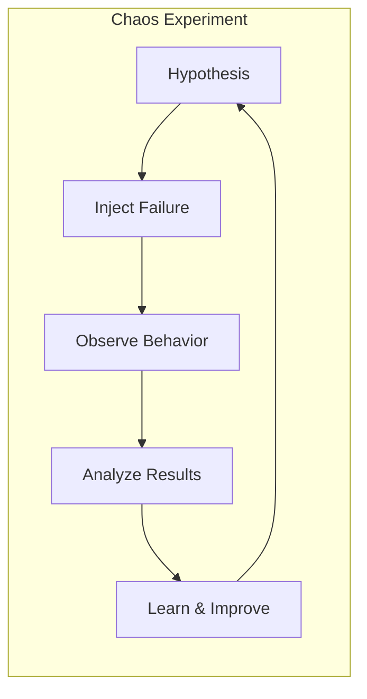
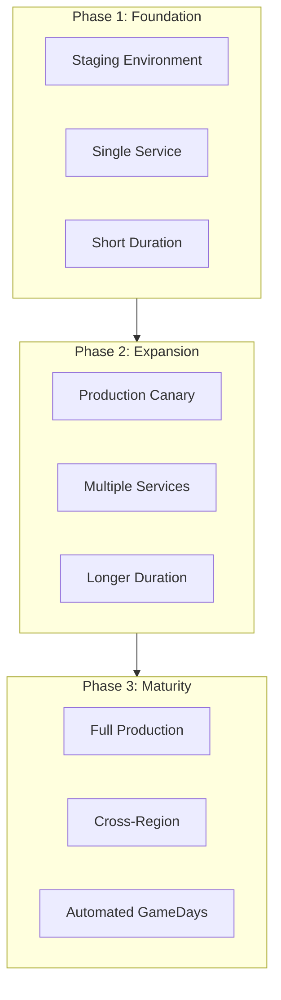

# How to Handle Chaos Engineering Testing

Author: [nawazdhandala](https://www.github.com/nawazdhandala)

Tags: Chaos Engineering, Testing, Reliability, SRE, DevOps, Resilience

Description: Learn how to implement chaos engineering testing to improve system resilience by intentionally injecting failures and observing how your system responds.

---

Production systems fail in unexpected ways. Chaos engineering is the practice of intentionally breaking things to discover weaknesses before they cause real outages. Instead of hoping your system handles failures gracefully, you prove it does through controlled experiments.

## What is Chaos Engineering?

Chaos engineering involves introducing controlled failures into your system to test its resilience. The goal is not to break things randomly but to run scientific experiments that reveal how your system behaves under stress.



The key principles are:

1. **Build a hypothesis** about steady-state behavior
2. **Introduce realistic failures** that could happen in production
3. **Run experiments in production** (or production-like environments)
4. **Minimize blast radius** by starting small
5. **Automate experiments** for continuous validation

## Setting Up Your First Chaos Experiment

Before injecting chaos, you need to understand your system's normal behavior. Define what "healthy" looks like with specific metrics.

### Define Steady State

```python
# steady_state.py - Define what normal looks like

class SteadyStateMetrics:
    def __init__(self, prometheus_client):
        self.prometheus = prometheus_client

    def capture_baseline(self, duration_minutes=30):
        """Capture baseline metrics before chaos experiment"""
        return {
            'request_rate': self.get_avg_request_rate(duration_minutes),
            'error_rate': self.get_error_rate(duration_minutes),
            'latency_p99': self.get_p99_latency(duration_minutes),
            'success_rate': self.get_success_rate(duration_minutes)
        }

    def get_avg_request_rate(self, duration):
        query = f'rate(http_requests_total[{duration}m])'
        return self.prometheus.query(query)

    def get_error_rate(self, duration):
        query = f'sum(rate(http_requests_total{{status=~"5.."}}[{duration}m])) / sum(rate(http_requests_total[{duration}m]))'
        return self.prometheus.query(query)

    def get_p99_latency(self, duration):
        query = f'histogram_quantile(0.99, rate(http_request_duration_seconds_bucket[{duration}m]))'
        return self.prometheus.query(query)

    def is_within_tolerance(self, current, baseline, tolerance=0.1):
        """Check if current metrics are within acceptable range"""
        return abs(current - baseline) / baseline <= tolerance
```

### Create a Chaos Experiment

```python
# chaos_experiment.py - Framework for running experiments

import time
import logging
from dataclasses import dataclass
from typing import Callable, Optional

@dataclass
class ChaosExperiment:
    name: str
    hypothesis: str
    inject_failure: Callable
    verify_steady_state: Callable
    rollback: Callable
    duration_seconds: int = 300

class ChaosRunner:
    def __init__(self, metrics_client):
        self.metrics = metrics_client
        self.logger = logging.getLogger('chaos')

    def run_experiment(self, experiment: ChaosExperiment) -> dict:
        """Execute a chaos experiment with safety controls"""

        self.logger.info(f"Starting experiment: {experiment.name}")
        self.logger.info(f"Hypothesis: {experiment.hypothesis}")

        # Step 1: Capture baseline
        baseline = self.metrics.capture_baseline()
        self.logger.info(f"Baseline captured: {baseline}")

        # Step 2: Verify system is healthy before starting
        if not experiment.verify_steady_state(baseline):
            self.logger.error("System not in steady state, aborting experiment")
            return {'status': 'aborted', 'reason': 'unhealthy_baseline'}

        results = {
            'experiment': experiment.name,
            'baseline': baseline,
            'observations': [],
            'status': 'running'
        }

        try:
            # Step 3: Inject failure
            self.logger.info("Injecting failure...")
            experiment.inject_failure()

            # Step 4: Observe behavior during experiment
            start_time = time.time()
            while time.time() - start_time < experiment.duration_seconds:
                current_metrics = self.metrics.capture_baseline(duration_minutes=1)
                results['observations'].append({
                    'timestamp': time.time(),
                    'metrics': current_metrics
                })

                # Safety check: abort if things go too wrong
                if self._should_abort(current_metrics, baseline):
                    self.logger.warning("Safety threshold exceeded, rolling back")
                    experiment.rollback()
                    results['status'] = 'aborted_safety'
                    return results

                time.sleep(30)

            results['status'] = 'completed'

        except Exception as e:
            self.logger.error(f"Experiment failed: {e}")
            results['status'] = 'error'
            results['error'] = str(e)

        finally:
            # Always rollback
            self.logger.info("Rolling back failure injection")
            experiment.rollback()

        # Step 5: Analyze results
        results['analysis'] = self._analyze_results(results, baseline)
        return results

    def _should_abort(self, current, baseline, max_degradation=0.5):
        """Abort if error rate exceeds 50% degradation from baseline"""
        error_increase = current.get('error_rate', 0) - baseline.get('error_rate', 0)
        return error_increase > max_degradation

    def _analyze_results(self, results, baseline):
        """Analyze experiment results"""
        observations = results['observations']
        if not observations:
            return {'verdict': 'inconclusive'}

        # Calculate average metrics during experiment
        avg_error_rate = sum(o['metrics'].get('error_rate', 0) for o in observations) / len(observations)
        avg_latency = sum(o['metrics'].get('latency_p99', 0) for o in observations) / len(observations)

        return {
            'avg_error_rate_during_chaos': avg_error_rate,
            'avg_latency_during_chaos': avg_latency,
            'baseline_error_rate': baseline.get('error_rate', 0),
            'baseline_latency': baseline.get('latency_p99', 0),
            'verdict': 'passed' if avg_error_rate < 0.01 else 'failed'
        }
```

## Common Chaos Experiments

### Network Latency Injection

Simulate slow network connections between services.

```python
# network_chaos.py - Network latency experiments

import subprocess

class NetworkChaos:
    def __init__(self, target_service: str, namespace: str = "default"):
        self.target = target_service
        self.namespace = namespace

    def inject_latency(self, delay_ms: int = 200, jitter_ms: int = 50):
        """Add network latency to a service using tc"""
        # Using Chaos Mesh CRD
        manifest = f"""
apiVersion: chaos-mesh.org/v1alpha1
kind: NetworkChaos
metadata:
  name: network-delay-{self.target}
  namespace: {self.namespace}
spec:
  action: delay
  mode: all
  selector:
    namespaces:
      - {self.namespace}
    labelSelectors:
      app: {self.target}
  delay:
    latency: "{delay_ms}ms"
    jitter: "{jitter_ms}ms"
  duration: "5m"
"""
        self._apply_manifest(manifest)

    def inject_packet_loss(self, loss_percent: int = 10):
        """Simulate packet loss"""
        manifest = f"""
apiVersion: chaos-mesh.org/v1alpha1
kind: NetworkChaos
metadata:
  name: packet-loss-{self.target}
  namespace: {self.namespace}
spec:
  action: loss
  mode: all
  selector:
    namespaces:
      - {self.namespace}
    labelSelectors:
      app: {self.target}
  loss:
    loss: "{loss_percent}"
  duration: "5m"
"""
        self._apply_manifest(manifest)

    def rollback(self):
        """Remove all network chaos"""
        subprocess.run([
            "kubectl", "delete", "networkchaos",
            f"network-delay-{self.target}",
            f"packet-loss-{self.target}",
            "-n", self.namespace,
            "--ignore-not-found"
        ])

    def _apply_manifest(self, manifest: str):
        process = subprocess.run(
            ["kubectl", "apply", "-f", "-"],
            input=manifest,
            text=True,
            capture_output=True
        )
        if process.returncode != 0:
            raise Exception(f"Failed to apply chaos: {process.stderr}")
```

### Pod Failure Experiment

Kill pods randomly to test recovery mechanisms.

```python
# pod_chaos.py - Pod failure experiments

class PodChaos:
    def __init__(self, target_deployment: str, namespace: str = "default"):
        self.deployment = target_deployment
        self.namespace = namespace

    def kill_random_pod(self):
        """Kill a random pod from the deployment"""
        manifest = f"""
apiVersion: chaos-mesh.org/v1alpha1
kind: PodChaos
metadata:
  name: pod-kill-{self.deployment}
  namespace: {self.namespace}
spec:
  action: pod-kill
  mode: one
  selector:
    namespaces:
      - {self.namespace}
    labelSelectors:
      app: {self.deployment}
  scheduler:
    cron: "@every 2m"
"""
        self._apply_manifest(manifest)

    def kill_all_pods(self):
        """Kill all pods - tests if system can recover from total failure"""
        manifest = f"""
apiVersion: chaos-mesh.org/v1alpha1
kind: PodChaos
metadata:
  name: pod-kill-all-{self.deployment}
  namespace: {self.namespace}
spec:
  action: pod-kill
  mode: all
  selector:
    namespaces:
      - {self.namespace}
    labelSelectors:
      app: {self.deployment}
"""
        self._apply_manifest(manifest)
```

### CPU and Memory Stress

Test how your application handles resource exhaustion.

```python
# resource_chaos.py - CPU and memory stress tests

class ResourceChaos:
    def __init__(self, target_service: str, namespace: str = "default"):
        self.target = target_service
        self.namespace = namespace

    def stress_cpu(self, workers: int = 2, load_percent: int = 80):
        """Stress CPU to test behavior under high load"""
        manifest = f"""
apiVersion: chaos-mesh.org/v1alpha1
kind: StressChaos
metadata:
  name: cpu-stress-{self.target}
  namespace: {self.namespace}
spec:
  mode: all
  selector:
    namespaces:
      - {self.namespace}
    labelSelectors:
      app: {self.target}
  stressors:
    cpu:
      workers: {workers}
      load: {load_percent}
  duration: "5m"
"""
        self._apply_manifest(manifest)

    def stress_memory(self, memory_mb: int = 512):
        """Consume memory to test OOM handling"""
        manifest = f"""
apiVersion: chaos-mesh.org/v1alpha1
kind: StressChaos
metadata:
  name: memory-stress-{self.target}
  namespace: {self.namespace}
spec:
  mode: all
  selector:
    namespaces:
      - {self.namespace}
    labelSelectors:
      app: {self.target}
  stressors:
    memory:
      workers: 1
      size: "{memory_mb}MB"
  duration: "5m"
"""
        self._apply_manifest(manifest)
```

## Running Chaos in CI/CD

Integrate chaos experiments into your pipeline for continuous resilience testing.

```yaml
# .github/workflows/chaos-tests.yml

name: Chaos Engineering Tests

on:
  schedule:
    - cron: '0 2 * * *'  # Run nightly
  workflow_dispatch:

jobs:
  chaos-tests:
    runs-on: ubuntu-latest
    steps:
      - uses: actions/checkout@v4

      - name: Setup Kubernetes cluster
        uses: azure/setup-kubectl@v3

      - name: Install Chaos Mesh
        run: |
          helm repo add chaos-mesh https://charts.chaos-mesh.org
          helm install chaos-mesh chaos-mesh/chaos-mesh \
            --namespace chaos-testing --create-namespace

      - name: Run Network Latency Experiment
        run: python chaos_experiments/run_experiment.py --type network-latency

      - name: Run Pod Kill Experiment
        run: python chaos_experiments/run_experiment.py --type pod-kill

      - name: Upload Results
        uses: actions/upload-artifact@v4
        with:
          name: chaos-results
          path: chaos_results/

      - name: Notify on Failure
        if: failure()
        run: |
          curl -X POST ${{ secrets.SLACK_WEBHOOK }} \
            -H 'Content-Type: application/json' \
            -d '{"text":"Chaos experiment failed! Check the results."}'
```

## Best Practices

### Start Small

Begin with non-critical services in staging environments. Gradually increase the blast radius as you build confidence.



### Document Everything

Every experiment should have clear documentation about what was tested, what was learned, and what improvements were made.

### Have Runbooks Ready

Before running any chaos experiment, ensure you have runbooks for recovering from the failure you are about to inject. This is not optional.

### Involve the Whole Team

Chaos engineering is not just for SREs. Developers should participate in designing and running experiments. The insights gained improve code quality and system design.

## Common Mistakes to Avoid

1. **Running chaos without monitoring** - You cannot learn from an experiment you cannot observe
2. **Skipping the hypothesis** - Random breakage is not chaos engineering
3. **No rollback plan** - Always have a way to stop the experiment immediately
4. **Starting in production** - Build confidence in staging first
5. **Ignoring results** - Every experiment should lead to improvements

---

Chaos engineering transforms reliability from hope into evidence. Start with simple experiments, learn from the results, and gradually build a culture where controlled failure is a normal part of development. Your systems will become more resilient, and your team will become more confident in their ability to handle real incidents.
