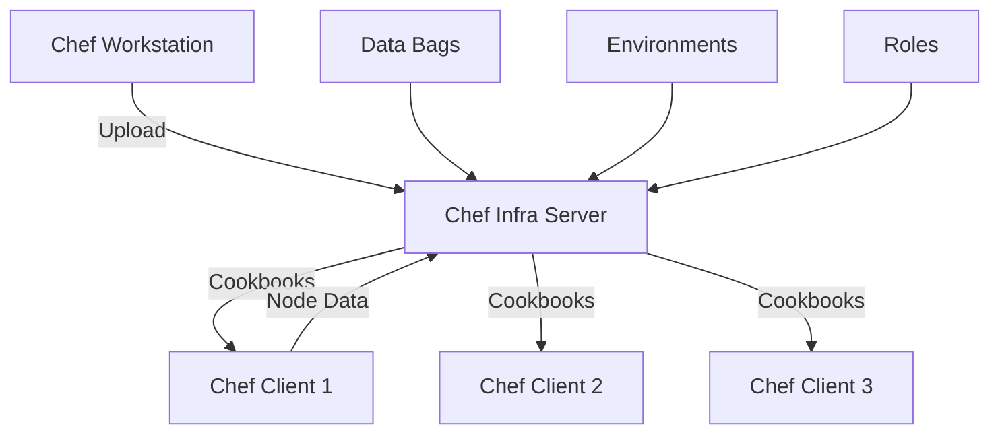

# How to Configure Chef for Configuration Management

Author: [nawazdhandala](https://www.github.com/nawazdhandala)

Tags: Chef, Configuration Management, DevOps, Infrastructure Automation, Ruby

Description: Set up Chef for configuration management using cookbooks, recipes, and the Chef Infra Server to automate infrastructure at scale with Ruby-based flexibility.

---

Chef is a powerful configuration management tool that uses Ruby for defining infrastructure as code. Its flexibility comes from full Ruby expressiveness in recipes, making it suitable for complex configurations that simpler declarative tools struggle with. Chef follows a pull-based model where nodes regularly check in with a central server for configuration updates.

This guide covers Chef installation, cookbook development, and production deployment patterns.

## Chef Architecture

Chef uses a hub-and-spoke model with a central server.



Key components:
- **Chef Infra Server**: Central repository for cookbooks and node data
- **Chef Infra Client**: Agent running on managed nodes
- **Chef Workstation**: Development environment with Knife CLI
- **Cookbooks**: Packages containing recipes and resources
- **Recipes**: Ruby files defining configuration
- **Data Bags**: Global variables available to all nodes

## Setting Up Chef Workstation

Start with the workstation where you develop and upload cookbooks.

```bash
# Download and install Chef Workstation
wget https://packages.chef.io/files/stable/chef-workstation/24.2.1058/ubuntu/22.04/chef-workstation_24.2.1058-1_amd64.deb
sudo dpkg -i chef-workstation_24.2.1058-1_amd64.deb

# Verify installation
chef --version

# Initialize Chef repository structure
chef generate repo chef-repo
cd chef-repo

# Repository structure:
# chef-repo/
# ├── cookbooks/          # Your cookbooks
# ├── data_bags/          # Encrypted data storage
# ├── environments/       # Environment configurations
# ├── roles/              # Role definitions
# └── .chef/              # Knife configuration
```

## Installing Chef Infra Server

Set up the central Chef server.

```bash
# Download Chef Infra Server
wget https://packages.chef.io/files/stable/chef-server/15.9.20/ubuntu/22.04/chef-server-core_15.9.20-1_amd64.deb
sudo dpkg -i chef-server-core_15.9.20-1_amd64.deb

# Configure and start Chef Server
sudo chef-server-ctl reconfigure

# Create admin user and organization
sudo chef-server-ctl user-create admin Admin User admin@example.com 'password123' --filename /tmp/admin.pem

sudo chef-server-ctl org-create myorg 'My Organization' --association_user admin --filename /tmp/myorg-validator.pem

# Copy keys to workstation
# admin.pem - for knife operations
# myorg-validator.pem - for bootstrapping new nodes
```

Configure Knife on your workstation:

```ruby
# .chef/config.rb
# Knife configuration

current_dir = File.dirname(__FILE__)

log_level                :info
log_location             STDOUT
node_name                'admin'
client_key               "#{current_dir}/admin.pem"
chef_server_url          'https://chef-server.example.com/organizations/myorg'
cookbook_path            ["#{current_dir}/../cookbooks"]

# SSL verification (disable only for testing)
ssl_verify_mode          :verify_peer
```

Test connectivity:

```bash
# Verify connection to Chef Server
knife ssl fetch
knife ssl check
knife client list
```

## Bootstrapping Nodes

Install Chef Client on managed nodes.

```bash
# Bootstrap a node from workstation
knife bootstrap web1.example.com \
  --ssh-user deploy \
  --sudo \
  --identity-file ~/.ssh/deploy_key \
  --node-name web1.example.com \
  --run-list 'recipe[base],recipe[webserver]'

# Bootstrap with specific environment
knife bootstrap web1.example.com \
  --environment production \
  --run-list 'role[webserver]'

# List bootstrapped nodes
knife node list

# View node details
knife node show web1.example.com
```

## Creating Cookbooks

Cookbooks organize related configuration code.

```bash
# Generate a new cookbook
chef generate cookbook cookbooks/webserver

# Cookbook structure:
# cookbooks/webserver/
# ├── attributes/
# │   └── default.rb       # Default attribute values
# ├── files/
# │   └── default/         # Static files
# ├── recipes/
# │   └── default.rb       # Default recipe
# ├── templates/
# │   └── default/         # ERB templates
# ├── test/
# │   └── integration/     # InSpec tests
# ├── metadata.rb          # Cookbook metadata
# └── README.md
```

## Writing Recipes

Recipes define configuration using Chef resources.

```ruby
# cookbooks/webserver/recipes/default.rb
# Main webserver recipe

# Include other recipes
include_recipe 'webserver::install'
include_recipe 'webserver::configure'
include_recipe 'webserver::service'
```

```ruby
# cookbooks/webserver/recipes/install.rb
# Install Nginx and dependencies

package 'nginx' do
  action :install
end

# Install multiple packages
%w[curl vim htop].each do |pkg|
  package pkg do
    action :install
  end
end

# Install specific version
package 'nginx' do
  version '1.24.0-1ubuntu1'
  action :install
end
```

```ruby
# cookbooks/webserver/recipes/configure.rb
# Configure Nginx

# Deploy main configuration from template
template '/etc/nginx/nginx.conf' do
  source 'nginx.conf.erb'
  owner 'root'
  group 'root'
  mode '0644'
  variables(
    worker_processes: node['webserver']['worker_processes'],
    worker_connections: node['webserver']['worker_connections']
  )
  notifies :reload, 'service[nginx]', :delayed
end

# Create web root directory
directory '/var/www/html' do
  owner 'www-data'
  group 'www-data'
  mode '0755'
  recursive true
  action :create
end

# Remove default site
file '/etc/nginx/sites-enabled/default' do
  action :delete
  notifies :reload, 'service[nginx]', :delayed
end

# Deploy virtual host configuration
template '/etc/nginx/sites-available/app.conf' do
  source 'vhost.conf.erb'
  owner 'root'
  group 'root'
  mode '0644'
  variables(
    server_name: node['webserver']['server_name'],
    document_root: node['webserver']['document_root']
  )
  notifies :reload, 'service[nginx]', :delayed
end

# Enable virtual host
link '/etc/nginx/sites-enabled/app.conf' do
  to '/etc/nginx/sites-available/app.conf'
  notifies :reload, 'service[nginx]', :delayed
end
```

```ruby
# cookbooks/webserver/recipes/service.rb
# Manage Nginx service

service 'nginx' do
  supports status: true, restart: true, reload: true
  action [:enable, :start]
end
```

## Attributes

Attributes provide configurable values for recipes.

```ruby
# cookbooks/webserver/attributes/default.rb
# Default attribute values

default['webserver']['worker_processes'] = 'auto'
default['webserver']['worker_connections'] = 1024
default['webserver']['server_name'] = node['fqdn']
default['webserver']['document_root'] = '/var/www/html'
default['webserver']['ssl_enabled'] = false

# Environment-specific overrides happen in environments or roles
```

Attribute precedence (lowest to highest):
1. `default` attributes
2. `force_default` attributes
3. `normal` attributes
4. `override` attributes
5. `force_override` attributes
6. `automatic` attributes (Ohai facts)

## Templates

ERB templates generate dynamic configuration files.

```erb
# cookbooks/webserver/templates/default/nginx.conf.erb
# Nginx configuration template

user www-data;
worker_processes <%= @worker_processes %>;
pid /run/nginx.pid;

events {
    worker_connections <%= @worker_connections %>;
    multi_accept on;
}

http {
    sendfile on;
    tcp_nopush on;
    keepalive_timeout 65;

    include /etc/nginx/mime.types;
    default_type application/octet-stream;

    access_log /var/log/nginx/access.log;
    error_log /var/log/nginx/error.log;

    gzip on;
    gzip_types text/plain text/css application/json application/javascript;

    include /etc/nginx/conf.d/*.conf;
    include /etc/nginx/sites-enabled/*;
}
```

```erb
# cookbooks/webserver/templates/default/vhost.conf.erb
# Virtual host template

server {
    listen 80;
    server_name <%= @server_name %>;
    root <%= @document_root %>;
    index index.html index.htm;

    location / {
        try_files $uri $uri/ =404;
    }

    access_log /var/log/nginx/<%= @server_name %>-access.log;
    error_log /var/log/nginx/<%= @server_name %>-error.log;
}
```

## Data Bags

Data bags store global data accessible to all nodes.

```bash
# Create a data bag
knife data bag create users

# Create an item in the data bag
knife data bag create users deploy
```

```json
// data_bags/users/deploy.json
{
  "id": "deploy",
  "uid": 1001,
  "gid": "deploy",
  "shell": "/bin/bash",
  "ssh_keys": [
    "ssh-ed25519 AAAAC3NzaC1lZDI1NTE5AAAAI... deploy@workstation"
  ]
}
```

Use data bags in recipes:

```ruby
# cookbooks/base/recipes/users.rb
# Create users from data bag

deploy_user = data_bag_item('users', 'deploy')

group deploy_user['gid'] do
  gid deploy_user['uid']
  action :create
end

user deploy_user['id'] do
  uid deploy_user['uid']
  gid deploy_user['gid']
  shell deploy_user['shell']
  home "/home/#{deploy_user['id']}"
  manage_home true
  action :create
end

directory "/home/#{deploy_user['id']}/.ssh" do
  owner deploy_user['id']
  group deploy_user['gid']
  mode '0700'
  action :create
end

file "/home/#{deploy_user['id']}/.ssh/authorized_keys" do
  owner deploy_user['id']
  group deploy_user['gid']
  mode '0600'
  content deploy_user['ssh_keys'].join("\n")
  action :create
end
```

## Encrypted Data Bags

Store sensitive data securely.

```bash
# Generate encryption key
openssl rand -base64 512 | tr -d '\r\n' > ~/.chef/encrypted_data_bag_secret

# Create encrypted data bag
knife data bag create secrets --secret-file ~/.chef/encrypted_data_bag_secret

# Edit encrypted data bag item
knife data bag edit secrets database --secret-file ~/.chef/encrypted_data_bag_secret
```

```ruby
# Use encrypted data bag in recipe
db_secrets = data_bag_item('secrets', 'database')

template '/app/config/database.yml' do
  source 'database.yml.erb'
  variables(
    db_password: db_secrets['password']
  )
  mode '0600'
end
```

## Roles

Roles group recipes and attributes for specific server types.

```json
// roles/webserver.json
{
  "name": "webserver",
  "description": "Web server role",
  "chef_type": "role",
  "json_class": "Chef::Role",
  "default_attributes": {
    "webserver": {
      "worker_processes": 4,
      "worker_connections": 4096
    }
  },
  "override_attributes": {},
  "run_list": [
    "recipe[base]",
    "recipe[webserver]",
    "recipe[monitoring::client]"
  ]
}
```

```bash
# Upload role to server
knife role from file roles/webserver.json

# Assign role to node
knife node run_list add web1.example.com 'role[webserver]'
```

## Environments

Environments manage different deployment stages.

```json
// environments/production.json
{
  "name": "production",
  "description": "Production environment",
  "chef_type": "environment",
  "json_class": "Chef::Environment",
  "default_attributes": {
    "webserver": {
      "ssl_enabled": true
    }
  },
  "override_attributes": {},
  "cookbook_versions": {
    "webserver": "= 2.1.0",
    "base": ">= 1.0.0"
  }
}
```

```bash
# Upload environment
knife environment from file environments/production.json

# Set node environment
knife node environment_set web1.example.com production
```

## Running Chef Client

Execute configuration on nodes.

```bash
# Run Chef Client manually on a node
sudo chef-client

# Run with specific run list
sudo chef-client --runlist 'recipe[webserver]'

# Dry run (why-run mode)
sudo chef-client --why-run

# Run from workstation using knife
knife ssh 'role:webserver' 'sudo chef-client' --ssh-user deploy

# Upload cookbooks to server
knife cookbook upload webserver --include-dependencies
```

---

Chef's Ruby foundation provides unmatched flexibility for complex configuration scenarios. The trade-off is a steeper learning curve compared to YAML-based tools. Start with simple recipes, build reusable cookbooks, and leverage data bags for environment-specific configuration. Chef shines in large enterprises where configuration requirements exceed what declarative tools can express cleanly.
