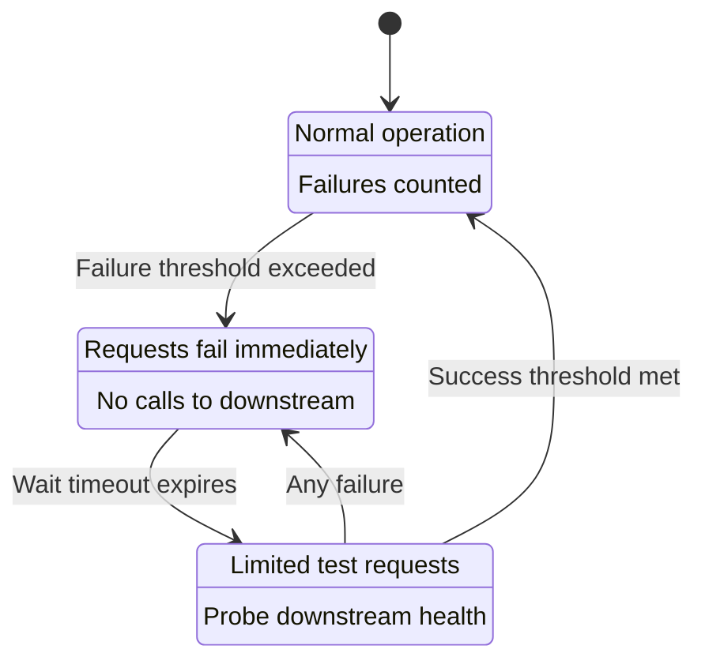
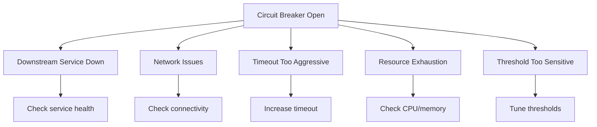
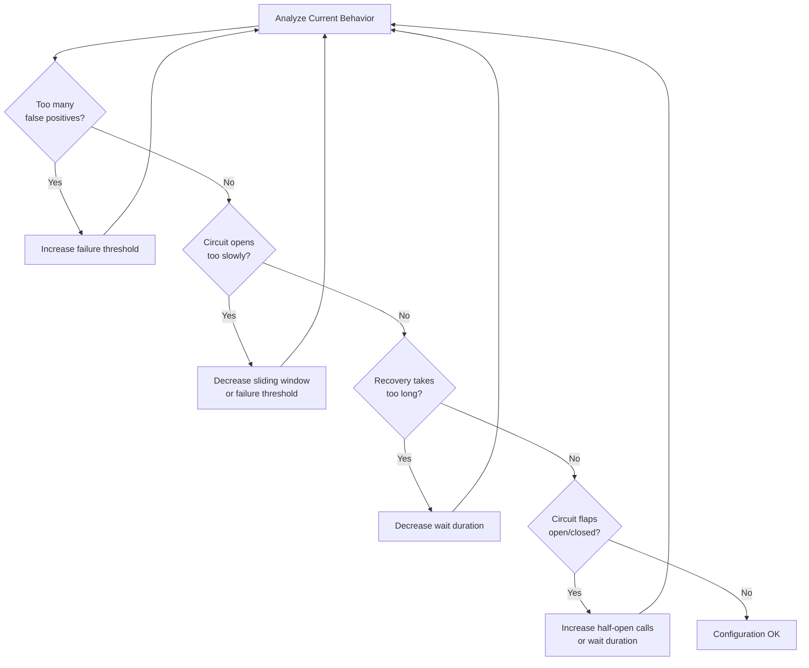
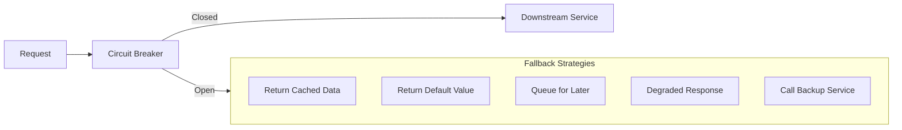

# How to Fix "Circuit Breaker Open" Errors

Author: [nawazdhandala](https://www.github.com/nawazdhandala)

Tags: Circuit Breaker, Microservices, Resilience, Error Handling, Hystrix, Resilience4j, DevOps

Description: Learn how to diagnose and fix circuit breaker open errors in microservices, including tuning thresholds, implementing fallbacks, and monitoring circuit state.

---

"Circuit breaker open" errors are a sign that your resilience patterns are working. The circuit breaker detected too many failures and is protecting your system from cascading collapse. But when it stays open, you have a real problem to fix.

## Understanding Circuit Breakers

A circuit breaker prevents repeated calls to a failing service, giving it time to recover while providing fallback behavior.



### Circuit Breaker States

| State | Behavior | Transition |
|-------|----------|------------|
| Closed | Normal operation, requests pass through | Opens when failure rate exceeds threshold |
| Open | All requests fail immediately | Moves to half-open after timeout |
| Half-Open | Limited requests allowed to test | Closes on success, opens on failure |

## Diagnosing Circuit Breaker Open Errors

### Step 1: Identify Which Circuit is Open

```bash
# Check application metrics for circuit breaker state
curl http://localhost:8080/actuator/metrics/resilience4j.circuitbreaker.state | jq

# Check circuit breaker events
curl http://localhost:8080/actuator/circuitbreakerevents | jq

# Look for circuit breaker logs
grep -i "circuit.*open\|circuitbreaker" /var/log/app/*.log | tail -50
```

### Step 2: Find the Root Cause

Common causes for circuit breakers opening:



### Step 3: Check Downstream Service

```bash
# Check if downstream service is running
curl -w "\n%{http_code}\n" http://order-service:8080/health

# Check DNS resolution
nslookup order-service

# Test network connectivity
nc -zv order-service 8080

# Check downstream service logs
kubectl logs -l app=order-service --tail=100
```

## Implementing Circuit Breakers

### Resilience4j (Java/Spring Boot)

```java
package com.example.order.service;

import io.github.resilience4j.circuitbreaker.annotation.CircuitBreaker;
import io.github.resilience4j.circuitbreaker.CircuitBreakerRegistry;
import io.github.resilience4j.retry.annotation.Retry;
import org.springframework.stereotype.Service;
import org.springframework.web.client.RestTemplate;

@Service
public class PaymentService {

    private final RestTemplate restTemplate;
    private final CircuitBreakerRegistry circuitBreakerRegistry;

    public PaymentService(RestTemplate restTemplate,
                         CircuitBreakerRegistry circuitBreakerRegistry) {
        this.restTemplate = restTemplate;
        this.circuitBreakerRegistry = circuitBreakerRegistry;
    }

    @CircuitBreaker(name = "paymentService", fallbackMethod = "processPaymentFallback")
    @Retry(name = "paymentService")
    public PaymentResult processPayment(PaymentRequest request) {
        return restTemplate.postForObject(
            "http://payment-service/api/payments",
            request,
            PaymentResult.class
        );
    }

    // Fallback method when circuit is open
    private PaymentResult processPaymentFallback(PaymentRequest request, Exception e) {
        // Log the failure for monitoring
        log.warn("Payment service unavailable, using fallback. Error: {}", e.getMessage());

        // Return a pending status for later processing
        return PaymentResult.builder()
            .status(PaymentStatus.PENDING)
            .message("Payment queued for processing")
            .transactionId(generatePendingTransactionId())
            .build();
    }

    // Method to check circuit breaker status
    public CircuitBreakerStatus getCircuitStatus() {
        var cb = circuitBreakerRegistry.circuitBreaker("paymentService");
        return new CircuitBreakerStatus(
            cb.getState().name(),
            cb.getMetrics().getFailureRate(),
            cb.getMetrics().getNumberOfBufferedCalls(),
            cb.getMetrics().getNumberOfFailedCalls()
        );
    }
}
```

### Resilience4j Configuration

```yaml
# application.yml
resilience4j:
  circuitbreaker:
    instances:
      paymentService:
        # Number of calls to evaluate
        slidingWindowSize: 10
        slidingWindowType: COUNT_BASED
        # Minimum calls before evaluating failure rate
        minimumNumberOfCalls: 5
        # Failure rate threshold to open circuit
        failureRateThreshold: 50
        # Time to wait before transitioning to half-open
        waitDurationInOpenState: 30s
        # Calls allowed in half-open state
        permittedNumberOfCallsInHalfOpenState: 3
        # Automatically transition to half-open
        automaticTransitionFromOpenToHalfOpenEnabled: true
        # Exceptions that count as failures
        recordExceptions:
          - java.io.IOException
          - java.util.concurrent.TimeoutException
          - org.springframework.web.client.HttpServerErrorException
        # Exceptions that don't count as failures
        ignoreExceptions:
          - com.example.BusinessException

  retry:
    instances:
      paymentService:
        maxAttempts: 3
        waitDuration: 1s
        exponentialBackoffMultiplier: 2
        retryExceptions:
          - java.io.IOException
          - java.util.concurrent.TimeoutException

  timelimiter:
    instances:
      paymentService:
        timeoutDuration: 5s
        cancelRunningFuture: true
```

### Node.js Implementation with Opossum

```javascript
const CircuitBreaker = require('opossum');
const axios = require('axios');

// Create circuit breaker for payment service
const paymentServiceBreaker = new CircuitBreaker(
    async function callPaymentService(paymentData) {
        const response = await axios.post(
            'http://payment-service/api/payments',
            paymentData,
            { timeout: 5000 }
        );
        return response.data;
    },
    {
        // Open circuit after 50% failures
        errorThresholdPercentage: 50,
        // Time window to track failures (10 seconds)
        rollingCountTimeout: 10000,
        // Buckets for rolling window
        rollingCountBuckets: 10,
        // Time to wait before half-open (30 seconds)
        resetTimeout: 30000,
        // Request timeout
        timeout: 5000,
        // Minimum requests before tripping
        volumeThreshold: 5
    }
);

// Fallback function when circuit is open
paymentServiceBreaker.fallback((paymentData, error) => {
    console.warn('Circuit open, using fallback:', error.message);
    return {
        status: 'PENDING',
        message: 'Payment queued for processing',
        transactionId: `pending-${Date.now()}`
    };
});

// Event handlers for monitoring
paymentServiceBreaker.on('success', (result) => {
    console.log('Payment successful');
});

paymentServiceBreaker.on('timeout', () => {
    console.warn('Payment request timed out');
});

paymentServiceBreaker.on('reject', () => {
    console.warn('Payment rejected - circuit is open');
});

paymentServiceBreaker.on('open', () => {
    console.error('Circuit breaker opened for payment service');
    // Alert operations team
    alertOps('Payment service circuit breaker opened');
});

paymentServiceBreaker.on('halfOpen', () => {
    console.info('Circuit breaker half-open, testing payment service');
});

paymentServiceBreaker.on('close', () => {
    console.info('Circuit breaker closed, payment service recovered');
});

// Use the circuit breaker
async function processPayment(paymentData) {
    try {
        return await paymentServiceBreaker.fire(paymentData);
    } catch (error) {
        if (error.message === 'Breaker is open') {
            console.error('Circuit breaker is open');
        }
        throw error;
    }
}

// Expose circuit breaker status for health checks
function getCircuitStatus() {
    const stats = paymentServiceBreaker.stats;
    return {
        state: paymentServiceBreaker.opened ? 'OPEN' :
               paymentServiceBreaker.halfOpen ? 'HALF_OPEN' : 'CLOSED',
        failures: stats.failures,
        successes: stats.successes,
        fallbacks: stats.fallbacks,
        timeouts: stats.timeouts,
        percentile95: stats.percentiles['0.95']
    };
}

module.exports = { processPayment, getCircuitStatus };
```

### Go Implementation

```go
package circuit

import (
    "context"
    "errors"
    "fmt"
    "net/http"
    "sync"
    "time"
)

// State represents circuit breaker state
type State int

const (
    StateClosed State = iota
    StateOpen
    StateHalfOpen
)

func (s State) String() string {
    switch s {
    case StateClosed:
        return "CLOSED"
    case StateOpen:
        return "OPEN"
    case StateHalfOpen:
        return "HALF_OPEN"
    default:
        return "UNKNOWN"
    }
}

// CircuitBreaker implements the circuit breaker pattern
type CircuitBreaker struct {
    name               string
    maxFailures        int
    timeout            time.Duration
    halfOpenMaxCalls   int

    mutex              sync.RWMutex
    state              State
    failures           int
    successes          int
    lastFailure        time.Time
    halfOpenCalls      int
}

// Config holds circuit breaker configuration
type Config struct {
    Name             string
    MaxFailures      int
    Timeout          time.Duration
    HalfOpenMaxCalls int
}

// NewCircuitBreaker creates a new circuit breaker
func NewCircuitBreaker(config Config) *CircuitBreaker {
    return &CircuitBreaker{
        name:             config.Name,
        maxFailures:      config.MaxFailures,
        timeout:          config.Timeout,
        halfOpenMaxCalls: config.HalfOpenMaxCalls,
        state:            StateClosed,
    }
}

// ErrCircuitOpen is returned when circuit is open
var ErrCircuitOpen = errors.New("circuit breaker is open")

// Execute runs the given function with circuit breaker protection
func (cb *CircuitBreaker) Execute(fn func() error) error {
    if !cb.allowRequest() {
        return ErrCircuitOpen
    }

    err := fn()
    cb.recordResult(err)

    return err
}

// allowRequest checks if request should be allowed
func (cb *CircuitBreaker) allowRequest() bool {
    cb.mutex.Lock()
    defer cb.mutex.Unlock()

    switch cb.state {
    case StateClosed:
        return true

    case StateOpen:
        // Check if timeout has passed
        if time.Since(cb.lastFailure) > cb.timeout {
            cb.state = StateHalfOpen
            cb.halfOpenCalls = 0
            cb.successes = 0
            return true
        }
        return false

    case StateHalfOpen:
        // Allow limited requests in half-open state
        if cb.halfOpenCalls < cb.halfOpenMaxCalls {
            cb.halfOpenCalls++
            return true
        }
        return false
    }

    return false
}

// recordResult records the result of a request
func (cb *CircuitBreaker) recordResult(err error) {
    cb.mutex.Lock()
    defer cb.mutex.Unlock()

    if err != nil {
        cb.failures++
        cb.lastFailure = time.Now()

        if cb.state == StateHalfOpen {
            // Any failure in half-open goes back to open
            cb.state = StateOpen
            return
        }

        if cb.failures >= cb.maxFailures {
            cb.state = StateOpen
        }
    } else {
        cb.successes++

        if cb.state == StateHalfOpen {
            // Successful calls in half-open close the circuit
            if cb.successes >= cb.halfOpenMaxCalls {
                cb.state = StateClosed
                cb.failures = 0
            }
        }
    }
}

// GetState returns current circuit state
func (cb *CircuitBreaker) GetState() State {
    cb.mutex.RLock()
    defer cb.mutex.RUnlock()
    return cb.state
}

// GetStats returns circuit breaker statistics
func (cb *CircuitBreaker) GetStats() map[string]interface{} {
    cb.mutex.RLock()
    defer cb.mutex.RUnlock()

    return map[string]interface{}{
        "name":     cb.name,
        "state":    cb.state.String(),
        "failures": cb.failures,
        "successes": cb.successes,
    }
}

// Example usage
type PaymentClient struct {
    cb         *CircuitBreaker
    httpClient *http.Client
    baseURL    string
}

func NewPaymentClient(baseURL string) *PaymentClient {
    return &PaymentClient{
        cb: NewCircuitBreaker(Config{
            Name:             "payment-service",
            MaxFailures:      5,
            Timeout:          30 * time.Second,
            HalfOpenMaxCalls: 3,
        }),
        httpClient: &http.Client{Timeout: 5 * time.Second},
        baseURL:    baseURL,
    }
}

func (pc *PaymentClient) ProcessPayment(ctx context.Context, payment Payment) (*PaymentResult, error) {
    var result *PaymentResult

    err := pc.cb.Execute(func() error {
        req, _ := http.NewRequestWithContext(ctx, "POST",
            pc.baseURL+"/api/payments", nil)

        resp, err := pc.httpClient.Do(req)
        if err != nil {
            return err
        }
        defer resp.Body.Close()

        if resp.StatusCode >= 500 {
            return fmt.Errorf("server error: %d", resp.StatusCode)
        }

        // Parse response into result
        // ...

        return nil
    })

    if errors.Is(err, ErrCircuitOpen) {
        // Return fallback response
        return &PaymentResult{
            Status:  "PENDING",
            Message: "Payment queued for processing",
        }, nil
    }

    return result, err
}
```

## Tuning Circuit Breaker Thresholds

### Finding the Right Configuration



### Configuration Guidelines

```yaml
# Conservative configuration (reduce false positives)
resilience4j:
  circuitbreaker:
    instances:
      conservativeService:
        slidingWindowSize: 20
        minimumNumberOfCalls: 10
        failureRateThreshold: 60
        waitDurationInOpenState: 60s
        permittedNumberOfCallsInHalfOpenState: 5

# Aggressive configuration (fast failure detection)
resilience4j:
  circuitbreaker:
    instances:
      aggressiveService:
        slidingWindowSize: 5
        minimumNumberOfCalls: 3
        failureRateThreshold: 40
        waitDurationInOpenState: 15s
        permittedNumberOfCallsInHalfOpenState: 2

# Time-based sliding window (for bursty traffic)
resilience4j:
  circuitbreaker:
    instances:
      timeBasedService:
        slidingWindowSize: 30
        slidingWindowType: TIME_BASED
        minimumNumberOfCalls: 10
        failureRateThreshold: 50
        waitDurationInOpenState: 30s
```

## Implementing Fallbacks

### Fallback Strategies



### Implementing Multiple Fallback Levels

```java
@Service
public class ProductService {

    private final RestTemplate restTemplate;
    private final CacheManager cacheManager;
    private final ProductRepository localRepository;

    @CircuitBreaker(name = "productService", fallbackMethod = "getProductFromCache")
    public Product getProduct(String productId) {
        return restTemplate.getForObject(
            "http://product-catalog/products/{id}",
            Product.class,
            productId
        );
    }

    // Level 1 fallback: Try cache
    private Product getProductFromCache(String productId, Exception e) {
        log.warn("Primary service failed, trying cache: {}", e.getMessage());

        Cache cache = cacheManager.getCache("products");
        Product cached = cache.get(productId, Product.class);

        if (cached != null) {
            return cached.withStale(true);
        }

        return getProductFromLocalDb(productId, e);
    }

    // Level 2 fallback: Try local database
    private Product getProductFromLocalDb(String productId, Exception e) {
        log.warn("Cache miss, trying local DB");

        return localRepository.findById(productId)
            .map(p -> p.withStale(true))
            .orElseGet(() -> getDefaultProduct(productId, e));
    }

    // Level 3 fallback: Return default
    private Product getDefaultProduct(String productId, Exception e) {
        log.error("All fallbacks exhausted for product {}", productId);

        return Product.builder()
            .id(productId)
            .name("Product Temporarily Unavailable")
            .available(false)
            .stale(true)
            .build();
    }
}
```

## Monitoring Circuit Breakers

### Exposing Circuit Breaker Metrics

```java
@RestController
@RequestMapping("/admin/circuit-breakers")
public class CircuitBreakerAdminController {

    private final CircuitBreakerRegistry registry;

    @GetMapping
    public Map<String, CircuitBreakerStatus> getAllCircuitBreakers() {
        return registry.getAllCircuitBreakers()
            .stream()
            .collect(Collectors.toMap(
                CircuitBreaker::getName,
                cb -> new CircuitBreakerStatus(
                    cb.getState().name(),
                    cb.getMetrics().getFailureRate(),
                    cb.getMetrics().getSlowCallRate(),
                    cb.getMetrics().getNumberOfBufferedCalls(),
                    cb.getMetrics().getNumberOfFailedCalls(),
                    cb.getMetrics().getNumberOfSuccessfulCalls()
                )
            ));
    }

    @GetMapping("/{name}")
    public CircuitBreakerStatus getCircuitBreaker(@PathVariable String name) {
        CircuitBreaker cb = registry.circuitBreaker(name);
        return new CircuitBreakerStatus(
            cb.getState().name(),
            cb.getMetrics().getFailureRate(),
            cb.getMetrics().getSlowCallRate(),
            cb.getMetrics().getNumberOfBufferedCalls(),
            cb.getMetrics().getNumberOfFailedCalls(),
            cb.getMetrics().getNumberOfSuccessfulCalls()
        );
    }

    // Manual circuit control for emergencies
    @PostMapping("/{name}/force-open")
    public void forceOpen(@PathVariable String name) {
        registry.circuitBreaker(name).transitionToForcedOpenState();
    }

    @PostMapping("/{name}/reset")
    public void reset(@PathVariable String name) {
        registry.circuitBreaker(name).reset();
    }
}
```

### Prometheus Metrics

```yaml
# Prometheus alert rules for circuit breakers
groups:
  - name: circuit-breaker-alerts
    rules:
      - alert: CircuitBreakerOpen
        expr: resilience4j_circuitbreaker_state{state="open"} == 1
        for: 1m
        labels:
          severity: warning
        annotations:
          summary: "Circuit breaker {{ $labels.name }} is open"
          description: "Circuit breaker has been open for more than 1 minute"

      - alert: CircuitBreakerHighFailureRate
        expr: resilience4j_circuitbreaker_failure_rate > 40
        for: 5m
        labels:
          severity: warning
        annotations:
          summary: "High failure rate on {{ $labels.name }}"
          description: "Failure rate is {{ $value }}%"

      - alert: CircuitBreakerFlapping
        expr: changes(resilience4j_circuitbreaker_state[10m]) > 5
        labels:
          severity: warning
        annotations:
          summary: "Circuit breaker {{ $labels.name }} is flapping"
          description: "Circuit breaker changed state {{ $value }} times in 10 minutes"
```

### Grafana Dashboard Query Examples

```promql
# Circuit breaker state over time
resilience4j_circuitbreaker_state{application="order-service"}

# Failure rate trend
resilience4j_circuitbreaker_failure_rate{name="paymentService"}

# Request distribution by state
sum by (name, kind) (
  rate(resilience4j_circuitbreaker_calls_total[5m])
)

# Slow call percentage
resilience4j_circuitbreaker_slow_call_rate{name="paymentService"}
```

## Troubleshooting Checklist

When a circuit breaker is open, follow this checklist:

1. **Check downstream service health**
   - Is the service running?
   - Are health checks passing?
   - Check service logs for errors

2. **Verify network connectivity**
   - DNS resolution working?
   - Firewall rules correct?
   - Network latency acceptable?

3. **Review circuit breaker metrics**
   - What is the failure rate?
   - What types of errors are occurring?
   - When did failures start?

4. **Check resource utilization**
   - CPU/memory on downstream service
   - Connection pool exhaustion
   - Thread pool saturation

5. **Review recent changes**
   - New deployments?
   - Configuration changes?
   - Infrastructure changes?

6. **Consider threshold adjustments**
   - Is the threshold too aggressive?
   - Is the timeout too short?
   - Is the sliding window appropriate?

---

Circuit breakers are a critical resilience pattern. When you see "circuit breaker open" errors, it means the pattern is working as designed. The key is to quickly identify the root cause of downstream failures and fix them while your fallbacks keep the system running.
