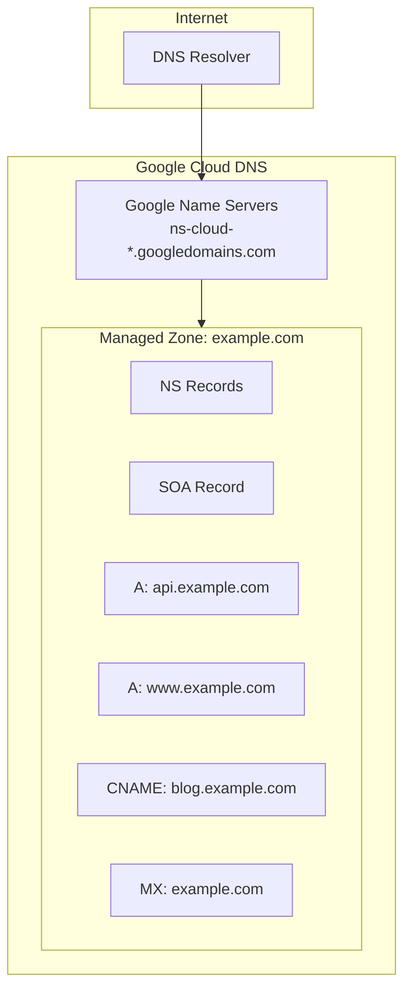
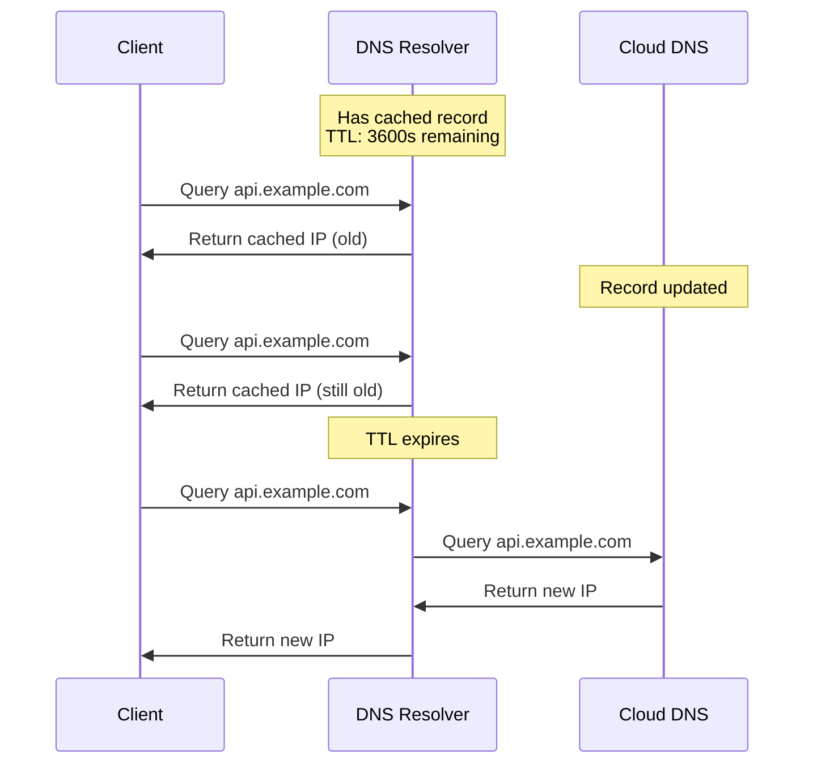
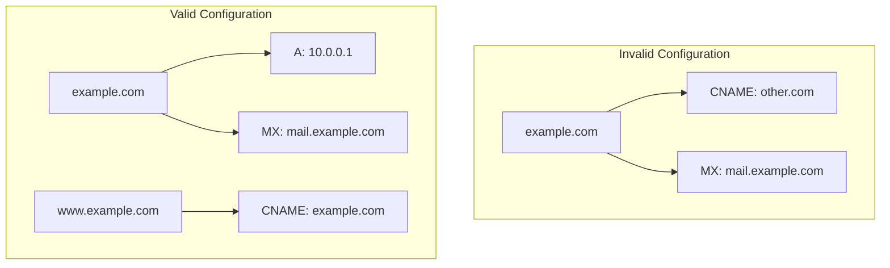

# How to Fix 'Cloud DNS' Record Errors

Author: [nawazdhandala](https://www.github.com/nawazdhandala)

Tags: Google Cloud, Cloud DNS, DNS, Networking, Troubleshooting, GCP

Description: A practical guide to diagnosing and fixing common Cloud DNS record errors including propagation issues, DNSSEC problems, and zone configuration mistakes.

---

Cloud DNS is Google's managed DNS service. When DNS breaks, everything breaks. Users cannot reach your services, email stops flowing, and SSL certificate validation fails. Let's walk through the most common Cloud DNS errors and how to fix them.

## Understanding Cloud DNS Architecture

Cloud DNS uses a hierarchical zone structure with authoritative name servers.



## Common Error 1: Records Not Resolving

You created DNS records but they are not resolving.

### Diagnosis

```bash
# Check if the record exists in Cloud DNS
gcloud dns record-sets list \
    --zone=my-zone \
    --filter="name=api.example.com."

# Query Google's public DNS directly
dig @8.8.8.8 api.example.com A

# Query Cloud DNS name servers directly
# First, get the name servers
gcloud dns managed-zones describe my-zone \
    --format="value(nameServers)"

# Then query one of them
dig @ns-cloud-a1.googledomains.com api.example.com A
```

### Fix: Name Server Delegation Not Set

The most common cause is that your domain registrar is not pointing to Cloud DNS name servers.

```bash
# Get Cloud DNS name servers
gcloud dns managed-zones describe my-zone \
    --format="value(nameServers)"

# Output example:
# ns-cloud-a1.googledomains.com.
# ns-cloud-a2.googledomains.com.
# ns-cloud-a3.googledomains.com.
# ns-cloud-a4.googledomains.com.

# Update these at your domain registrar (GoDaddy, Namecheap, etc.)
```

### Fix: Missing Trailing Dot

DNS records require fully qualified domain names with a trailing dot.

```bash
# Wrong - missing trailing dot
gcloud dns record-sets create api.example.com \
    --zone=my-zone \
    --type=A \
    --rrdatas="10.0.0.1"

# Correct - with trailing dot
gcloud dns record-sets create "api.example.com." \
    --zone=my-zone \
    --type=A \
    --ttl=300 \
    --rrdatas="10.0.0.1"
```

### Fix: Zone Name Mismatch

Ensure the record belongs to the correct zone.

```bash
# List all zones
gcloud dns managed-zones list

# Verify the zone's DNS name matches your domain
gcloud dns managed-zones describe my-zone \
    --format="value(dnsName)"

# The record must be within this domain
# Zone: example.com.
# Valid: api.example.com., www.example.com.
# Invalid: api.otherdomain.com.
```

## Common Error 2: Propagation Delays

Changes are not visible immediately after updating records.

### Understanding TTL



### Fix: Lower TTL Before Changes

```bash
# Step 1: Lower TTL (do this hours before the actual change)
gcloud dns record-sets update "api.example.com." \
    --zone=my-zone \
    --type=A \
    --ttl=60 \
    --rrdatas="10.0.0.1"

# Wait for old TTL to expire (e.g., if old TTL was 3600, wait 1 hour)

# Step 2: Make the actual IP change
gcloud dns record-sets update "api.example.com." \
    --zone=my-zone \
    --type=A \
    --ttl=60 \
    --rrdatas="10.0.0.2"

# Step 3: After change is confirmed working, increase TTL
gcloud dns record-sets update "api.example.com." \
    --zone=my-zone \
    --type=A \
    --ttl=3600 \
    --rrdatas="10.0.0.2"
```

### Check Propagation Status

```bash
# Check from multiple locations
for server in 8.8.8.8 1.1.1.1 9.9.9.9; do
    echo "Checking $server:"
    dig @$server api.example.com A +short
done

# Check TTL remaining
dig api.example.com A | grep -E "^api" | awk '{print "TTL remaining: " $2 " seconds"}'
```

## Common Error 3: CNAME and Other Record Conflicts

CNAME records have specific rules that cause errors when violated.

### The CNAME Problem



### Fix: Cannot Have CNAME at Zone Apex

```bash
# Wrong - CNAME at zone apex (root domain)
gcloud dns record-sets create "example.com." \
    --zone=my-zone \
    --type=CNAME \
    --rrdatas="loadbalancer.googleusercontent.com."
# Error: CNAME not allowed at zone apex

# Correct - Use A/AAAA records at apex, CNAME for subdomains
gcloud dns record-sets create "example.com." \
    --zone=my-zone \
    --type=A \
    --ttl=300 \
    --rrdatas="35.190.0.1"

gcloud dns record-sets create "www.example.com." \
    --zone=my-zone \
    --type=CNAME \
    --ttl=300 \
    --rrdatas="example.com."
```

### Fix: CNAME Cannot Coexist with Other Records

```bash
# Wrong - CNAME with other records for same name
gcloud dns record-sets create "api.example.com." \
    --zone=my-zone \
    --type=CNAME \
    --rrdatas="backend.example.com."

gcloud dns record-sets create "api.example.com." \
    --zone=my-zone \
    --type=TXT \
    --rrdatas="verification=abc123"
# Error: CNAME cannot coexist with other records

# Correct - use the target directly or use different names
gcloud dns record-sets create "api.example.com." \
    --zone=my-zone \
    --type=A \
    --ttl=300 \
    --rrdatas="10.0.0.1"

gcloud dns record-sets create "api.example.com." \
    --zone=my-zone \
    --type=TXT \
    --ttl=300 \
    --rrdatas="\"verification=abc123\""
```

## Common Error 4: DNSSEC Validation Failures

DNSSEC-signed zones can cause resolution failures if misconfigured.

### Diagnosis

```bash
# Check if DNSSEC is enabled
gcloud dns managed-zones describe my-zone \
    --format="value(dnssecConfig.state)"

# Verify DNSSEC chain
dig +dnssec example.com A

# Check DS record at registrar
dig example.com DS

# Validate DNSSEC
delv @8.8.8.8 example.com A +rtrace
```

### Fix: Enable DNSSEC Properly

```bash
# Step 1: Enable DNSSEC on the zone
gcloud dns managed-zones update my-zone \
    --dnssec-state=on

# Step 2: Get the DS records
gcloud dns managed-zones describe my-zone \
    --format="value(dnssecConfig.defaultKeySpecs)"

# Get DS record to add to registrar
gcloud dns dns-keys list --zone=my-zone

# Step 3: Add DS record at your domain registrar
# Key Tag: 12345
# Algorithm: 8 (RSASHA256)
# Digest Type: 2 (SHA-256)
# Digest: ABC123...
```

### Fix: DNSSEC Key Rollover Issues

```bash
# Check key status
gcloud dns dns-keys list --zone=my-zone

# If keys are in bad state, you may need to disable and re-enable DNSSEC
# WARNING: This will cause validation failures during transition

# Step 1: Remove DS record from registrar first
# Step 2: Wait for TTL to expire
# Step 3: Disable DNSSEC
gcloud dns managed-zones update my-zone \
    --dnssec-state=off

# Step 4: Re-enable DNSSEC
gcloud dns managed-zones update my-zone \
    --dnssec-state=on

# Step 5: Add new DS record to registrar
```

## Common Error 5: Private Zone Resolution Issues

Private zones are not resolving from VMs.

### Diagnosis

```bash
# Check private zone configuration
gcloud dns managed-zones describe my-private-zone \
    --format="yaml(visibility,privateVisibilityConfig)"

# Test from a VM in the authorized network
gcloud compute ssh my-vm --command="dig internal.example.local A"

# Check VM's DNS configuration
gcloud compute ssh my-vm --command="cat /etc/resolv.conf"
```

### Fix: Authorize Networks for Private Zone

```bash
# List current authorized networks
gcloud dns managed-zones describe my-private-zone \
    --format="value(privateVisibilityConfig.networks)"

# Add a network to the private zone
gcloud dns managed-zones update my-private-zone \
    --networks=my-vpc-network,other-vpc-network
```

### Fix: Configure VPC DNS Policy

```bash
# Create a DNS policy to use Cloud DNS for resolution
gcloud dns policies create my-dns-policy \
    --networks=my-vpc-network \
    --enable-inbound-forwarding \
    --description="Enable Cloud DNS for VPC"

# For hybrid environments, add forwarding
gcloud dns policies update my-dns-policy \
    --networks=my-vpc-network \
    --alternative-name-servers=10.0.0.53,10.0.0.54
```

## Common Error 6: Terraform Errors

Infrastructure as code deployments fail with DNS errors.

### Correct Terraform Configuration

```hcl
# Create a public managed zone
resource "google_dns_managed_zone" "public" {
  name        = "example-zone"
  dns_name    = "example.com."  # Trailing dot required
  description = "Public DNS zone for example.com"

  dnssec_config {
    state = "on"
  }
}

# Create A record
resource "google_dns_record_set" "api" {
  name         = "api.${google_dns_managed_zone.public.dns_name}"
  type         = "A"
  ttl          = 300
  managed_zone = google_dns_managed_zone.public.name
  rrdatas      = ["10.0.0.1"]
}

# Create CNAME record
resource "google_dns_record_set" "www" {
  name         = "www.${google_dns_managed_zone.public.dns_name}"
  type         = "CNAME"
  ttl          = 300
  managed_zone = google_dns_managed_zone.public.name
  rrdatas      = ["example.com."]  # Trailing dot required
}

# Create MX records
resource "google_dns_record_set" "mx" {
  name         = google_dns_managed_zone.public.dns_name
  type         = "MX"
  ttl          = 3600
  managed_zone = google_dns_managed_zone.public.name
  rrdatas = [
    "10 mail1.example.com.",
    "20 mail2.example.com."
  ]
}

# Create TXT record for SPF
resource "google_dns_record_set" "spf" {
  name         = google_dns_managed_zone.public.dns_name
  type         = "TXT"
  ttl          = 300
  managed_zone = google_dns_managed_zone.public.name
  rrdatas      = ["\"v=spf1 include:_spf.google.com ~all\""]
}

# Private zone
resource "google_dns_managed_zone" "private" {
  name        = "internal-zone"
  dns_name    = "internal.example.com."
  description = "Private DNS zone"

  visibility = "private"

  private_visibility_config {
    networks {
      network_url = google_compute_network.vpc.id
    }
  }
}
```

### Common Terraform Errors

**Error: "Invalid rrdatas"**

```hcl
# Wrong - missing quotes around TXT value
rrdatas = [v=spf1 include:_spf.google.com ~all]

# Correct - properly escaped quotes
rrdatas = ["\"v=spf1 include:_spf.google.com ~all\""]
```

**Error: "Zone not found"**

```hcl
# Wrong - using dns_name instead of name
managed_zone = google_dns_managed_zone.public.dns_name

# Correct - use the zone name
managed_zone = google_dns_managed_zone.public.name
```

## DNS Record Type Reference

| Type | Purpose | Example |
|------|---------|---------|
| A | IPv4 address | 10.0.0.1 |
| AAAA | IPv6 address | 2001:db8::1 |
| CNAME | Alias to another name | www.example.com. |
| MX | Mail server | 10 mail.example.com. |
| TXT | Text data | "v=spf1 ..." |
| NS | Name server | ns1.example.com. |
| SOA | Zone authority | (auto-managed) |
| SRV | Service location | 10 5 5060 sip.example.com. |
| CAA | Certificate authority | 0 issue "letsencrypt.org" |

## Troubleshooting Checklist

When Cloud DNS is not working, run through this checklist:

1. **Check name server delegation** - Registrar must point to Cloud DNS servers
2. **Verify trailing dots** - All FQDNs need trailing dots
3. **Check zone membership** - Record must be within the zone's domain
4. **Review CNAME rules** - No CNAME at apex, no coexisting records
5. **Consider TTL** - Old records may be cached
6. **Verify DNSSEC** - DS record must match zone's keys
7. **Check private zone networks** - VMs must be in authorized networks
8. **Test from multiple resolvers** - Propagation is not instant

DNS issues can be tricky because caching obscures the current state. Always test with multiple resolvers and be patient with TTL-related propagation delays.
