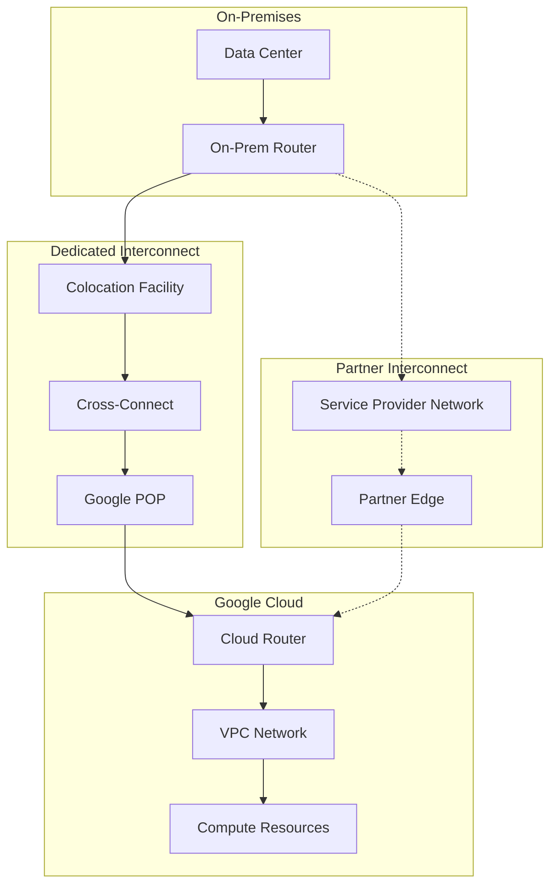
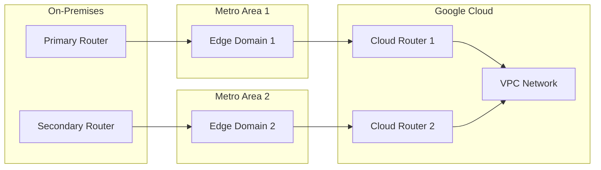

# How to Configure Cloud Interconnect

Author: [nawazdhandala](https://www.github.com/nawazdhandala)

Tags: Cloud Interconnect, Google Cloud, Networking, Hybrid Cloud, GCP, VPN, Enterprise

Description: Learn how to configure Google Cloud Interconnect for dedicated, high-bandwidth connectivity between your on-premises infrastructure and Google Cloud.

---

Google Cloud Interconnect provides dedicated, high-bandwidth connections between your on-premises network and Google Cloud. Unlike VPN connections that traverse the public internet, Interconnect offers lower latency, higher throughput, and more consistent performance. This guide covers both Dedicated Interconnect and Partner Interconnect configurations.

## Interconnect Options Overview

Google Cloud offers two main types of Interconnect, each suited for different requirements.



### When to Use Each Option

**Dedicated Interconnect** is best when you need:
- 10 Gbps or 100 Gbps connections
- Direct physical connection to Google
- Highest possible performance and lowest latency

**Partner Interconnect** is best when you need:
- Connections smaller than 10 Gbps
- Cannot meet Google at a colocation facility
- More flexible connection options

## Prerequisites

Before configuring Interconnect, ensure you have the following in place.

```bash
# Verify you have the necessary IAM permissions
gcloud projects get-iam-policy my-project \
    --flatten="bindings[].members" \
    --filter="bindings.role:roles/compute.networkAdmin"

# Create a VPC network if you do not have one
gcloud compute networks create my-vpc \
    --subnet-mode=custom \
    --bgp-routing-mode=global

# Create subnets in regions where you need connectivity
gcloud compute networks subnets create my-subnet \
    --network=my-vpc \
    --region=us-central1 \
    --range=10.0.0.0/24
```

## Configuring Dedicated Interconnect

Dedicated Interconnect requires physical cross-connects at a Google colocation facility.

### Step 1: Create an Interconnect Connection

```bash
# List available colocation facilities
gcloud compute interconnects locations list

# Create the Interconnect connection
# This reserves capacity at the specified location
gcloud compute interconnects create my-interconnect \
    --interconnect-type=DEDICATED \
    --link-type=LINK_TYPE_ETHERNET_10G_LR \
    --location=las-vegas-zone1-2 \
    --requested-link-count=2 \
    --description="Primary datacenter connection" \
    --admin-enabled
```

After creation, Google provides a Letter of Authorization (LOA) that you give to your colocation provider to establish the physical cross-connect.

### Step 2: Create a Cloud Router

The Cloud Router handles BGP peering with your on-premises router.

```bash
# Create a Cloud Router in each region where you need connectivity
gcloud compute routers create my-cloud-router \
    --network=my-vpc \
    --region=us-central1 \
    --asn=65001 \
    --advertise-mode=custom \
    --set-advertised-groups=ALL_SUBNETS \
    --set-advertised-ranges=10.0.0.0/8
```

### Step 3: Create VLAN Attachments

VLAN attachments connect your Interconnect to Cloud Router.

```bash
# Create a VLAN attachment
gcloud compute interconnects attachments dedicated create my-attachment \
    --interconnect=my-interconnect \
    --router=my-cloud-router \
    --region=us-central1 \
    --bandwidth=10g \
    --vlan=100 \
    --candidate-subnets=169.254.0.0/29
```

### Step 4: Configure BGP Peering

After creating the VLAN attachment, configure BGP on your on-premises router.

```bash
# Get the VLAN attachment details for BGP configuration
gcloud compute interconnects attachments describe my-attachment \
    --region=us-central1 \
    --format="yaml(cloudRouterIpAddress,customerRouterIpAddress,pairingKey)"
```

Configure your on-premises router with the peering information. Here is an example for Cisco IOS:

```text
! Cisco IOS BGP configuration for Cloud Interconnect
!
interface GigabitEthernet0/0/0.100
 description "Google Cloud Interconnect VLAN 100"
 encapsulation dot1Q 100
 ip address 169.254.0.2 255.255.255.248
!
router bgp 65002
 neighbor 169.254.0.1 remote-as 65001
 neighbor 169.254.0.1 description "Google Cloud Router"
 !
 address-family ipv4
  neighbor 169.254.0.1 activate
  network 192.168.0.0 mask 255.255.0.0
 exit-address-family
```

## Configuring Partner Interconnect

Partner Interconnect uses a service provider's network to reach Google Cloud.

### Step 1: Choose a Partner

```bash
# List available partners and their supported locations
gcloud compute interconnects locations list --filter="availableFeatures:PARTNER_POD"

# View details about a specific location
gcloud compute interconnects locations describe las-vegas-zone1-2
```

### Step 2: Create a VLAN Attachment

For Partner Interconnect, you create a VLAN attachment first and then work with your provider.

```bash
# Create a Cloud Router
gcloud compute routers create partner-router \
    --network=my-vpc \
    --region=us-central1 \
    --asn=16550

# Create a Partner Interconnect VLAN attachment
gcloud compute interconnects attachments partner create partner-attachment \
    --router=partner-router \
    --region=us-central1 \
    --edge-availability-domain=availability-domain-1
```

### Step 3: Get the Pairing Key

The pairing key is used by your service provider to complete the connection.

```bash
# Get the pairing key to share with your provider
gcloud compute interconnects attachments describe partner-attachment \
    --region=us-central1 \
    --format="value(pairingKey)"
```

Share this pairing key with your service provider. They will use it to provision the connection on their side.

### Step 4: Activate the Attachment

Once the provider completes their configuration, activate the attachment.

```bash
# Check the attachment state
gcloud compute interconnects attachments describe partner-attachment \
    --region=us-central1 \
    --format="value(state)"

# Activate the attachment after provider confirmation
gcloud compute interconnects attachments partner update partner-attachment \
    --region=us-central1 \
    --admin-enabled
```

## High Availability Configuration

For production workloads, configure redundant connections across different edge availability domains.



### Create Redundant Attachments

```bash
# Create attachments in different availability domains for redundancy
# First attachment in availability-domain-1
gcloud compute interconnects attachments dedicated create attachment-zone1 \
    --interconnect=interconnect-zone1 \
    --router=cloud-router-1 \
    --region=us-central1 \
    --bandwidth=10g \
    --vlan=100

# Second attachment in availability-domain-2
gcloud compute interconnects attachments dedicated create attachment-zone2 \
    --interconnect=interconnect-zone2 \
    --router=cloud-router-2 \
    --region=us-central1 \
    --bandwidth=10g \
    --vlan=200
```

### Configure MED for Traffic Engineering

Use Multi-Exit Discriminator (MED) values to control traffic flow preferences.

```bash
# Update Cloud Router to advertise routes with MED values
gcloud compute routers update cloud-router-1 \
    --region=us-central1 \
    --advertisement-mode=custom \
    --set-advertised-ranges='10.0.0.0/8:100'

gcloud compute routers update cloud-router-2 \
    --region=us-central1 \
    --advertisement-mode=custom \
    --set-advertised-ranges='10.0.0.0/8:200'
```

## Monitoring Interconnect Health

Set up monitoring to track connection health and utilization.

```bash
# Check Interconnect status
gcloud compute interconnects describe my-interconnect \
    --format="yaml(operationalStatus,provisionedLinkCount,state)"

# Check VLAN attachment status
gcloud compute interconnects attachments describe my-attachment \
    --region=us-central1 \
    --format="yaml(operationalStatus,state,privateInterconnectInfo)"

# View BGP session status on Cloud Router
gcloud compute routers get-status my-cloud-router \
    --region=us-central1 \
    --format="yaml(result.bgpPeerStatus)"
```

### Create Monitoring Alerts

```python
from google.cloud import monitoring_v3
from google.protobuf import duration_pb2

def create_interconnect_alert(project_id, interconnect_name):
    """Create an alert policy for Interconnect down events."""

    client = monitoring_v3.AlertPolicyServiceClient()
    project_name = f"projects/{project_id}"

    # Alert when Interconnect operational status is not UP
    alert_policy = {
        "display_name": f"Interconnect {interconnect_name} Down",
        "conditions": [
            {
                "display_name": "Interconnect operational status",
                "condition_threshold": {
                    "filter": f'''
                        resource.type="interconnect"
                        resource.labels.interconnect_name="{interconnect_name}"
                        metric.type="compute.googleapis.com/interconnect/link/operational_status"
                    ''',
                    "comparison": "COMPARISON_LT",
                    "threshold_value": 1,  # 1 = UP, 0 = DOWN
                    "duration": duration_pb2.Duration(seconds=300),
                    "aggregations": [
                        {
                            "alignment_period": duration_pb2.Duration(seconds=60),
                            "per_series_aligner": "ALIGN_MEAN",
                        }
                    ],
                },
            }
        ],
        "combiner": "OR",
        "notification_channels": [
            f"projects/{project_id}/notificationChannels/12345"
        ],
    }

    policy = client.create_alert_policy(
        name=project_name,
        alert_policy=alert_policy
    )

    return policy
```

## Firewall Configuration

Configure firewall rules to control traffic over the Interconnect.

```bash
# Allow traffic from on-premises network to cloud resources
gcloud compute firewall-rules create allow-onprem-to-cloud \
    --network=my-vpc \
    --direction=INGRESS \
    --action=ALLOW \
    --source-ranges=192.168.0.0/16 \
    --rules=tcp:22,tcp:443,tcp:3306,icmp \
    --description="Allow traffic from on-premises network"

# Allow traffic from cloud to on-premises (for return traffic and initiated connections)
gcloud compute firewall-rules create allow-cloud-to-onprem \
    --network=my-vpc \
    --direction=EGRESS \
    --action=ALLOW \
    --destination-ranges=192.168.0.0/16 \
    --rules=all \
    --description="Allow traffic to on-premises network"
```

## Testing the Connection

After configuration, verify connectivity between on-premises and cloud resources.

```bash
# From a GCE instance, ping an on-premises host
ping 192.168.1.100

# Test TCP connectivity
nc -zv 192.168.1.100 22

# Verify route propagation
gcloud compute routes list --filter="network:my-vpc"

# Check effective routes for a specific instance
gcloud compute instances network-interfaces get-effective-routes my-instance \
    --zone=us-central1-a \
    --network-interface=nic0
```

## Cost Optimization

Interconnect pricing includes port fees and egress charges. Here are some optimization strategies.

```bash
# Use committed use discounts for predictable traffic
# Monitor traffic patterns before committing

# Check current utilization
gcloud monitoring read \
    "fetch compute.googleapis.com/interconnect/link/received_bytes_count" \
    --filter='resource.labels.interconnect_name="my-interconnect"' \
    --interval="$(date -d '7 days ago' -Iseconds)/$(date -Iseconds)"

# For variable workloads, consider Partner Interconnect with smaller capacity
# and scale up as needed
```

## Summary

Configuring Cloud Interconnect requires careful planning and coordination with either colocation providers or service partners. Key considerations include:

- Choose Dedicated Interconnect for highest performance (10G or 100G connections)
- Choose Partner Interconnect for flexibility and smaller capacity needs
- Always configure redundant connections across different availability domains
- Use BGP MED values to control traffic engineering preferences
- Monitor connection health and set up alerts for operational status changes
- Test connectivity thoroughly before migrating production workloads

A properly configured Interconnect provides reliable, high-performance connectivity that is essential for hybrid cloud architectures and latency-sensitive applications.
