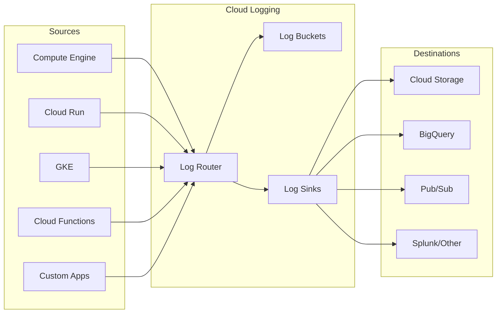

# How to Handle Cloud Logging

Author: [nawazdhandala](https://www.github.com/nawazdhandala)

Tags: Cloud Logging, Google Cloud, Observability, Monitoring, DevOps, GCP

Description: Learn how to effectively handle cloud logging in Google Cloud Platform, including structured logging, log routing, and best practices for production environments.

---

Cloud logging is one of the most critical components of any production system. Without proper logging, debugging issues becomes guesswork. Google Cloud Logging provides a centralized solution for collecting, storing, and analyzing logs from all your cloud resources. This guide covers everything from basic setup to advanced log routing and analysis.

## Understanding Cloud Logging Architecture

Before diving into implementation, it is important to understand how Cloud Logging works. Logs flow from various sources into Cloud Logging, where they can be filtered, routed, and stored according to your requirements.



## Setting Up the Logging Client

The Google Cloud Logging client library provides a simple way to send logs from your applications. Here is how to set it up in different languages.

### Python Setup

Install the client library and configure structured logging for your Python application.

```python
# Install: pip install google-cloud-logging

import google.cloud.logging
from google.cloud.logging import Client
import logging

def setup_cloud_logging():
    """Initialize Cloud Logging for Python applications."""

    # Create a client - uses default credentials
    client = Client()

    # Attach the Cloud Logging handler to the root logger
    # This automatically sends all logs to Cloud Logging
    client.setup_logging()

    # Now standard Python logging goes to Cloud Logging
    logging.info("Application started successfully")

    return client

# Initialize logging at application startup
client = setup_cloud_logging()
```

### Node.js Setup

For Node.js applications, the winston transport provides seamless integration.

```javascript
// Install: npm install @google-cloud/logging-winston winston

const winston = require('winston');
const { LoggingWinston } = require('@google-cloud/logging-winston');

// Create the Cloud Logging transport
const loggingWinston = new LoggingWinston({
  projectId: 'your-project-id',
  // Optionally specify a log name
  logName: 'my-app-logs',
});

// Create a winston logger with both Console and Cloud Logging
const logger = winston.createLogger({
  level: 'info',
  transports: [
    // Log to console for local development
    new winston.transports.Console(),
    // Log to Cloud Logging for production
    loggingWinston,
  ],
});

// Use structured logging with metadata
logger.info('User logged in', {
  userId: '12345',
  action: 'login',
  ipAddress: '192.168.1.1',
});
```

### Go Setup

Go applications can use the official Cloud Logging package.

```go
package main

import (
    "context"
    "log"

    "cloud.google.com/go/logging"
)

func main() {
    ctx := context.Background()

    // Create a Cloud Logging client
    client, err := logging.NewClient(ctx, "your-project-id")
    if err != nil {
        log.Fatalf("Failed to create logging client: %v", err)
    }
    defer client.Close()

    // Get a logger for your application
    logger := client.Logger("my-app-logs")

    // Log a structured entry
    logger.Log(logging.Entry{
        Severity: logging.Info,
        Payload: map[string]interface{}{
            "message": "Application started",
            "version": "1.2.3",
            "environment": "production",
        },
    })

    // Flush logs before exiting
    if err := logger.Flush(); err != nil {
        log.Printf("Failed to flush logs: %v", err)
    }
}
```

## Structured Logging Best Practices

Structured logs are significantly easier to search and analyze compared to plain text logs. Always include relevant context in a machine-readable format.

```python
import json
import logging
from datetime import datetime

class StructuredLogFormatter(logging.Formatter):
    """Custom formatter that outputs JSON structured logs."""

    def format(self, record):
        # Build the structured log entry
        log_entry = {
            "timestamp": datetime.utcnow().isoformat(),
            "severity": record.levelname,
            "message": record.getMessage(),
            "logger": record.name,
            "module": record.module,
            "function": record.funcName,
            "line": record.lineno,
        }

        # Include any extra fields passed to the log call
        if hasattr(record, 'extra_fields'):
            log_entry.update(record.extra_fields)

        # Include exception info if present
        if record.exc_info:
            log_entry["exception"] = self.formatException(record.exc_info)

        return json.dumps(log_entry)

# Configure the structured formatter
handler = logging.StreamHandler()
handler.setFormatter(StructuredLogFormatter())

logger = logging.getLogger(__name__)
logger.addHandler(handler)
logger.setLevel(logging.INFO)

# Log with extra structured fields
logger.info(
    "Order processed successfully",
    extra={
        "extra_fields": {
            "orderId": "ORD-12345",
            "customerId": "CUST-789",
            "totalAmount": 99.99,
            "currency": "USD",
        }
    }
)
```

## Creating Log Sinks for Routing

Log sinks allow you to route logs to different destinations based on filters. This is useful for long-term storage, analysis, or external integrations.

```bash
# Create a sink to export all error logs to BigQuery
gcloud logging sinks create error-logs-to-bigquery \
    bigquery.googleapis.com/projects/your-project/datasets/logs_dataset \
    --log-filter='severity >= ERROR'

# Create a sink to export audit logs to Cloud Storage
gcloud logging sinks create audit-logs-to-gcs \
    storage.googleapis.com/your-bucket-name/audit-logs \
    --log-filter='logName:"cloudaudit.googleapis.com"'

# Create a sink to send security logs to Pub/Sub for real-time processing
gcloud logging sinks create security-logs-to-pubsub \
    pubsub.googleapis.com/projects/your-project/topics/security-alerts \
    --log-filter='resource.type="gce_instance" AND protoPayload.methodName:"delete"'
```

After creating sinks, you need to grant the sink's service account permission to write to the destination.

```bash
# Get the sink's writer identity
gcloud logging sinks describe error-logs-to-bigquery --format='value(writerIdentity)'

# Grant BigQuery Data Editor role to the sink's service account
gcloud projects add-iam-policy-binding your-project \
    --member='serviceAccount:p123456789-123456@gcp-sa-logging.iam.gserviceaccount.com' \
    --role='roles/bigquery.dataEditor'
```

## Log-Based Metrics

Create metrics from log entries to monitor specific events and trigger alerts.

```bash
# Create a metric that counts authentication failures
gcloud logging metrics create auth-failures \
    --description="Count of authentication failures" \
    --log-filter='jsonPayload.event="auth_failure" OR textPayload:"authentication failed"'

# Create a metric for response times from access logs
gcloud logging metrics create api-latency \
    --description="API response latency distribution" \
    --log-filter='resource.type="cloud_run_revision" AND httpRequest.latency!=""' \
    --bucket-options=exponential,num-finite-buckets=10,growth-factor=2,scale=0.01
```

You can then use these metrics in Cloud Monitoring dashboards and alerting policies.

```yaml
# alerting-policy.yaml - Alert when auth failures exceed threshold
displayName: "High Authentication Failure Rate"
conditions:
  - displayName: "Auth failures per minute"
    conditionThreshold:
      filter: 'metric.type="logging.googleapis.com/user/auth-failures"'
      comparison: COMPARISON_GT
      thresholdValue: 10
      duration: "60s"
      aggregations:
        - alignmentPeriod: "60s"
          perSeriesAligner: ALIGN_RATE
combiner: OR
notificationChannels:
  - projects/your-project/notificationChannels/12345
```

## Querying Logs with Log Explorer

The Log Explorer in the Google Cloud Console provides powerful filtering capabilities. Here are some useful query patterns.

```text
# Find all errors from a specific service in the last hour
resource.type="cloud_run_revision"
resource.labels.service_name="my-api"
severity>=ERROR
timestamp>="2026-01-24T00:00:00Z"

# Search for logs containing specific text
textPayload:"connection refused"
OR jsonPayload.error:"connection refused"

# Find slow requests (latency > 5 seconds)
httpRequest.latency>"5s"
resource.type="http_load_balancer"

# Track a request across services using trace ID
trace="projects/your-project/traces/abc123def456"

# Find all logs for a specific user
jsonPayload.userId="user-12345"
OR labels.userId="user-12345"
```

## Log Retention and Cost Management

Cloud Logging charges based on log volume ingested. Configure retention and exclusion filters to manage costs.

```bash
# Create a log bucket with custom retention (90 days)
gcloud logging buckets create long-term-logs \
    --location=global \
    --retention-days=90 \
    --description="Logs retained for 90 days"

# Create an exclusion filter to reduce log volume
# This excludes debug-level logs from non-production environments
gcloud logging sinks create exclude-debug-logs \
    logging.googleapis.com/projects/your-project/locations/global/buckets/_Default \
    --log-filter='severity="DEBUG"' \
    --exclusion

# Exclude health check logs that add noise
gcloud logging sinks create exclude-health-checks \
    logging.googleapis.com/projects/your-project/locations/global/buckets/_Default \
    --log-filter='httpRequest.requestUrl="/health" OR httpRequest.requestUrl="/ready"' \
    --exclusion
```

## Integrating with Error Reporting

Cloud Error Reporting automatically groups and tracks errors. Ensure your logs include the proper format for error detection.

```python
import logging
import traceback

def log_exception_properly(logger, error, context=None):
    """Log an exception in a format that Error Reporting can parse."""

    # Format the exception with full stack trace
    error_message = {
        "message": str(error),
        "stack_trace": traceback.format_exc(),
        "@type": "type.googleapis.com/google.devtools.clouderrorreporting.v1beta1.ReportedErrorEvent",
    }

    # Add context if provided
    if context:
        error_message["context"] = context

    # Log at ERROR severity - Error Reporting will pick this up
    logger.error(error_message)

# Usage in a request handler
try:
    process_order(order_id)
except Exception as e:
    log_exception_properly(
        logger,
        e,
        context={
            "httpRequest": {
                "method": "POST",
                "url": "/api/orders",
            },
            "user": current_user_id,
        }
    )
    raise
```

## Real-Time Log Streaming

For debugging production issues, stream logs in real-time using the gcloud CLI.

```bash
# Stream all logs from a Cloud Run service
gcloud logging read "resource.type=cloud_run_revision AND resource.labels.service_name=my-api" \
    --format="value(textPayload)" \
    --freshness=1m

# Follow logs in real-time (similar to tail -f)
gcloud alpha logging tail "severity>=WARNING" --format="table(timestamp,severity,textPayload)"

# Stream logs from multiple services
gcloud alpha logging tail \
    'resource.labels.service_name="api" OR resource.labels.service_name="worker"' \
    --buffer-window=10s
```

## Summary

Effective cloud logging requires thoughtful setup and ongoing maintenance. Key takeaways include:

- Use structured logging with consistent field names across all services
- Set up log sinks early to route important logs to long-term storage
- Create log-based metrics to monitor business events and trigger alerts
- Configure retention policies and exclusion filters to manage costs
- Include trace IDs in logs to correlate requests across services
- Format exceptions properly so Error Reporting can group and track them

Good logging is an investment that pays off significantly during incident response. The time spent setting up proper logging infrastructure will save hours of debugging when production issues occur.
