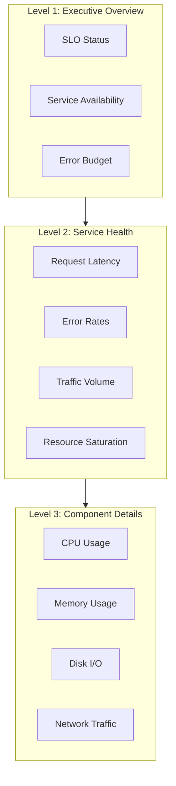
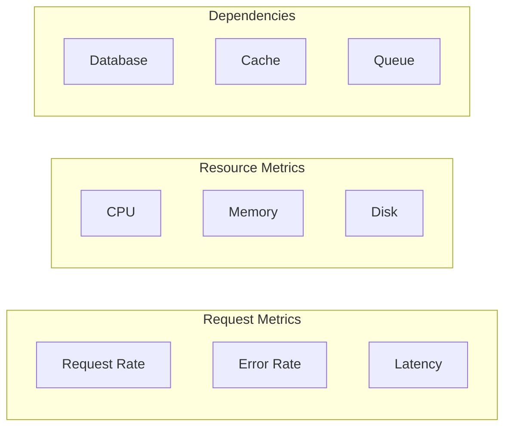

# How to Handle Cloud Monitoring Dashboards

Author: [nawazdhandala](https://www.github.com/nawazdhandala)

Tags: Google Cloud, Cloud Monitoring, Dashboards, Observability, Metrics, GCP

Description: A comprehensive guide to creating, managing, and optimizing Google Cloud Monitoring dashboards for effective infrastructure and application observability.

---

Cloud Monitoring dashboards give you visibility into your Google Cloud resources and applications. But a dashboard full of random metrics is worse than no dashboard at all. Let's build dashboards that actually help you understand system health and diagnose problems quickly.

## Dashboard Architecture Principles

Good dashboards follow a hierarchy from high-level overview to detailed debugging.



## Creating Dashboards via Console

Start with the Cloud Console to understand available metrics.

### Step 1: Create a Dashboard

```bash
# Navigate to Cloud Console > Monitoring > Dashboards
# Click "Create Dashboard"

# Or use gcloud to list existing dashboards
gcloud monitoring dashboards list --format="table(name,displayName)"
```

### Step 2: Add Widgets

Common widget types:
- **Line Chart** - Time series trends
- **Stacked Area** - Show composition over time
- **Heatmap** - Distribution visualization
- **Scorecard** - Single important values
- **Table** - Multiple metrics comparison

## Creating Dashboards via API

For reproducible dashboards, use the API or Terraform.

### Dashboard JSON Structure

```json
{
  "displayName": "Production Services Overview",
  "gridLayout": {
    "columns": "2",
    "widgets": [
      {
        "title": "Request Latency (p99)",
        "xyChart": {
          "dataSets": [
            {
              "timeSeriesQuery": {
                "timeSeriesFilter": {
                  "filter": "resource.type=\"gce_instance\" AND metric.type=\"compute.googleapis.com/instance/cpu/utilization\"",
                  "aggregation": {
                    "alignmentPeriod": "60s",
                    "perSeriesAligner": "ALIGN_MEAN",
                    "crossSeriesReducer": "REDUCE_PERCENTILE_99",
                    "groupByFields": ["resource.label.instance_id"]
                  }
                }
              }
            }
          ],
          "timeshiftDuration": "0s",
          "yAxis": {
            "scale": "LINEAR"
          }
        }
      }
    ]
  }
}
```

### Create Dashboard with gcloud

```bash
# Save dashboard config to file
cat > dashboard.json << 'EOF'
{
  "displayName": "My Application Dashboard",
  "mosaicLayout": {
    "columns": 12,
    "tiles": [
      {
        "width": 6,
        "height": 4,
        "widget": {
          "title": "CPU Utilization",
          "xyChart": {
            "dataSets": [{
              "timeSeriesQuery": {
                "timeSeriesFilter": {
                  "filter": "resource.type=\"gce_instance\" metric.type=\"compute.googleapis.com/instance/cpu/utilization\"",
                  "aggregation": {
                    "alignmentPeriod": "60s",
                    "perSeriesAligner": "ALIGN_MEAN"
                  }
                }
              }
            }]
          }
        }
      }
    ]
  }
}
EOF

# Create the dashboard
gcloud monitoring dashboards create --config-from-file=dashboard.json
```

## Terraform Dashboard Configuration

```hcl
# Define a comprehensive monitoring dashboard
resource "google_monitoring_dashboard" "main" {
  dashboard_json = jsonencode({
    displayName = "Production Services"

    mosaicLayout = {
      columns = 12
      tiles = [
        # Row 1: Key Metrics Scorecards
        {
          width  = 3
          height = 2
          widget = {
            title = "Error Rate"
            scorecard = {
              timeSeriesQuery = {
                timeSeriesFilter = {
                  filter = "resource.type=\"https_lb_rule\" metric.type=\"loadbalancing.googleapis.com/https/request_count\""
                  aggregation = {
                    alignmentPeriod    = "60s"
                    perSeriesAligner   = "ALIGN_RATE"
                    crossSeriesReducer = "REDUCE_SUM"
                  }
                }
              }
              thresholds = [
                {
                  value     = 0.01
                  color     = "YELLOW"
                  direction = "ABOVE"
                },
                {
                  value     = 0.05
                  color     = "RED"
                  direction = "ABOVE"
                }
              ]
            }
          }
        },
        {
          width  = 3
          height = 2
          widget = {
            title = "Request Rate"
            scorecard = {
              timeSeriesQuery = {
                timeSeriesFilter = {
                  filter = "resource.type=\"https_lb_rule\" metric.type=\"loadbalancing.googleapis.com/https/request_count\""
                  aggregation = {
                    alignmentPeriod    = "60s"
                    perSeriesAligner   = "ALIGN_RATE"
                    crossSeriesReducer = "REDUCE_SUM"
                  }
                }
              }
            }
          }
        },

        # Row 2: Latency Charts
        {
          xPos   = 0
          yPos   = 2
          width  = 6
          height = 4
          widget = {
            title = "Request Latency Distribution"
            xyChart = {
              dataSets = [
                {
                  timeSeriesQuery = {
                    timeSeriesFilter = {
                      filter = "resource.type=\"https_lb_rule\" metric.type=\"loadbalancing.googleapis.com/https/total_latencies\""
                      aggregation = {
                        alignmentPeriod    = "60s"
                        perSeriesAligner   = "ALIGN_PERCENTILE_50"
                        crossSeriesReducer = "REDUCE_MEAN"
                      }
                    }
                  }
                  legendTemplate = "p50"
                },
                {
                  timeSeriesQuery = {
                    timeSeriesFilter = {
                      filter = "resource.type=\"https_lb_rule\" metric.type=\"loadbalancing.googleapis.com/https/total_latencies\""
                      aggregation = {
                        alignmentPeriod    = "60s"
                        perSeriesAligner   = "ALIGN_PERCENTILE_95"
                        crossSeriesReducer = "REDUCE_MEAN"
                      }
                    }
                  }
                  legendTemplate = "p95"
                },
                {
                  timeSeriesQuery = {
                    timeSeriesFilter = {
                      filter = "resource.type=\"https_lb_rule\" metric.type=\"loadbalancing.googleapis.com/https/total_latencies\""
                      aggregation = {
                        alignmentPeriod    = "60s"
                        perSeriesAligner   = "ALIGN_PERCENTILE_99"
                        crossSeriesReducer = "REDUCE_MEAN"
                      }
                    }
                  }
                  legendTemplate = "p99"
                }
              ]
              yAxis = {
                scale = "LINEAR"
                label = "Latency (ms)"
              }
            }
          }
        }
      ]
    }
  })
}
```

## Common Dashboard Patterns

### RED Method Dashboard (Rate, Errors, Duration)

```json
{
  "displayName": "RED Method - API Service",
  "mosaicLayout": {
    "columns": 12,
    "tiles": [
      {
        "width": 4,
        "height": 4,
        "widget": {
          "title": "Request Rate",
          "xyChart": {
            "dataSets": [{
              "timeSeriesQuery": {
                "timeSeriesFilter": {
                  "filter": "metric.type=\"custom.googleapis.com/http/request_count\"",
                  "aggregation": {
                    "alignmentPeriod": "60s",
                    "perSeriesAligner": "ALIGN_RATE",
                    "crossSeriesReducer": "REDUCE_SUM",
                    "groupByFields": ["metric.label.endpoint"]
                  }
                }
              }
            }]
          }
        }
      },
      {
        "xPos": 4,
        "width": 4,
        "height": 4,
        "widget": {
          "title": "Error Rate",
          "xyChart": {
            "dataSets": [{
              "timeSeriesQuery": {
                "timeSeriesQueryLanguage": "fetch https_lb_rule | metric 'loadbalancing.googleapis.com/https/request_count' | filter response_code_class != '2xx' | align rate(1m) | group_by [], sum(value.request_count)"
              }
            }]
          }
        }
      },
      {
        "xPos": 8,
        "width": 4,
        "height": 4,
        "widget": {
          "title": "Duration (p99)",
          "xyChart": {
            "dataSets": [{
              "timeSeriesQuery": {
                "timeSeriesFilter": {
                  "filter": "metric.type=\"custom.googleapis.com/http/request_latency\"",
                  "aggregation": {
                    "alignmentPeriod": "60s",
                    "perSeriesAligner": "ALIGN_PERCENTILE_99"
                  }
                }
              }
            }]
          }
        }
      }
    ]
  }
}
```

### USE Method Dashboard (Utilization, Saturation, Errors)

```json
{
  "displayName": "USE Method - Compute Resources",
  "mosaicLayout": {
    "columns": 12,
    "tiles": [
      {
        "width": 6,
        "height": 4,
        "widget": {
          "title": "CPU Utilization",
          "xyChart": {
            "dataSets": [{
              "timeSeriesQuery": {
                "timeSeriesFilter": {
                  "filter": "resource.type=\"gce_instance\" metric.type=\"compute.googleapis.com/instance/cpu/utilization\"",
                  "aggregation": {
                    "alignmentPeriod": "60s",
                    "perSeriesAligner": "ALIGN_MEAN",
                    "groupByFields": ["resource.label.instance_id"]
                  }
                }
              }
            }],
            "yAxis": {
              "scale": "LINEAR"
            },
            "thresholds": [{
              "value": 0.8,
              "color": "RED",
              "direction": "ABOVE"
            }]
          }
        }
      },
      {
        "xPos": 6,
        "width": 6,
        "height": 4,
        "widget": {
          "title": "Memory Utilization",
          "xyChart": {
            "dataSets": [{
              "timeSeriesQuery": {
                "timeSeriesFilter": {
                  "filter": "resource.type=\"gce_instance\" metric.type=\"agent.googleapis.com/memory/percent_used\"",
                  "aggregation": {
                    "alignmentPeriod": "60s",
                    "perSeriesAligner": "ALIGN_MEAN"
                  }
                }
              }
            }]
          }
        }
      }
    ]
  }
}
```

## MQL (Monitoring Query Language)

MQL provides more powerful querying capabilities than filters.

```bash
# Basic MQL query
fetch gce_instance
| metric 'compute.googleapis.com/instance/cpu/utilization'
| align mean(1m)
| group_by [resource.instance_id], mean(value.utilization)

# Calculate error percentage
fetch https_lb_rule
| metric 'loadbalancing.googleapis.com/https/request_count'
| align rate(1m)
| group_by [resource.url_map_name],
    sum(if(metric.response_code_class = "5xx", value.request_count, 0))
    / sum(value.request_count) * 100

# Join metrics for ratio calculation
{
  t_0: fetch gce_instance | metric 'compute.googleapis.com/instance/cpu/utilization' ;
  t_1: fetch gce_instance | metric 'compute.googleapis.com/instance/cpu/reserved_cores'
}
| join
| value [cpu_per_core: t_0.value.utilization / t_1.value.reserved_cores]
```

## Custom Metrics for Dashboards

Create application-specific metrics for better visibility.

```python
# Python example using Cloud Monitoring client
from google.cloud import monitoring_v3
import time

client = monitoring_v3.MetricServiceClient()
project_name = f"projects/my-project"

# Create a custom metric descriptor
descriptor = monitoring_v3.MetricDescriptor()
descriptor.type = "custom.googleapis.com/app/request_latency"
descriptor.metric_kind = monitoring_v3.MetricDescriptor.MetricKind.GAUGE
descriptor.value_type = monitoring_v3.MetricDescriptor.ValueType.DISTRIBUTION
descriptor.unit = "ms"
descriptor.description = "Application request latency"

descriptor.labels.append(
    monitoring_v3.LabelDescriptor(
        key="endpoint",
        value_type=monitoring_v3.LabelDescriptor.ValueType.STRING,
        description="API endpoint"
    )
)

client.create_metric_descriptor(name=project_name, metric_descriptor=descriptor)

# Write metric data
series = monitoring_v3.TimeSeries()
series.metric.type = "custom.googleapis.com/app/request_latency"
series.metric.labels["endpoint"] = "/api/users"
series.resource.type = "global"

point = monitoring_v3.Point()
point.value.double_value = 150.5  # latency in ms
point.interval.end_time.seconds = int(time.time())

series.points.append(point)

client.create_time_series(name=project_name, time_series=[series])
```

## Dashboard Best Practices

### 1. Use Consistent Time Ranges

```json
{
  "widget": {
    "title": "CPU Over Time",
    "xyChart": {
      "dataSets": [{
        "timeSeriesQuery": {
          "timeSeriesFilter": {
            "filter": "...",
            "aggregation": {
              "alignmentPeriod": "60s"  // Keep consistent across widgets
            }
          }
        }
      }],
      "chartOptions": {
        "mode": "COLOR"
      }
    }
  }
}
```

### 2. Add Meaningful Thresholds

```json
{
  "widget": {
    "title": "Error Rate",
    "xyChart": {
      "thresholds": [
        {
          "value": 0.01,
          "color": "YELLOW",
          "direction": "ABOVE",
          "label": "Warning: 1%"
        },
        {
          "value": 0.05,
          "color": "RED",
          "direction": "ABOVE",
          "label": "Critical: 5%"
        }
      ]
    }
  }
}
```

### 3. Group Related Metrics



### 4. Use Variables for Filtering

```bash
# Create dashboard with template variables
# In the dashboard JSON, reference variables like:
# ${project_id}, ${region}, ${service_name}

# This allows users to filter the entire dashboard at once
```

## Troubleshooting Dashboard Issues

### Metrics Not Showing

```bash
# Verify metric exists
gcloud monitoring metrics list --filter="metric.type:custom"

# Check metric data is being written
gcloud monitoring time-series list \
    --filter='metric.type="custom.googleapis.com/my/metric"' \
    --limit=5

# Verify permissions
gcloud projects get-iam-policy my-project \
    --flatten="bindings[].members" \
    --filter="bindings.role:monitoring"
```

### Dashboard Loading Slowly

- Reduce the number of widgets per dashboard
- Use appropriate alignment periods (do not go below 60s for most metrics)
- Avoid complex MQL queries with many joins
- Split into multiple focused dashboards

### Metrics Delayed

```bash
# Check metric latency
# Most GCP metrics have 1-3 minute latency
# Custom metrics can have up to 1 minute latency

# For near-real-time, consider using:
# - Log-based metrics (faster)
# - Uptime checks (seconds)
```

## Exporting and Sharing Dashboards

```bash
# Export dashboard configuration
gcloud monitoring dashboards describe \
    projects/my-project/dashboards/dashboard-id \
    --format=json > dashboard-backup.json

# Import to another project
gcloud monitoring dashboards create \
    --config-from-file=dashboard-backup.json \
    --project=other-project
```

Well-designed dashboards reduce mean time to detection and resolution. Start with the RED and USE methods, add custom metrics for your specific services, and iterate based on what questions you find yourself asking during incidents.
