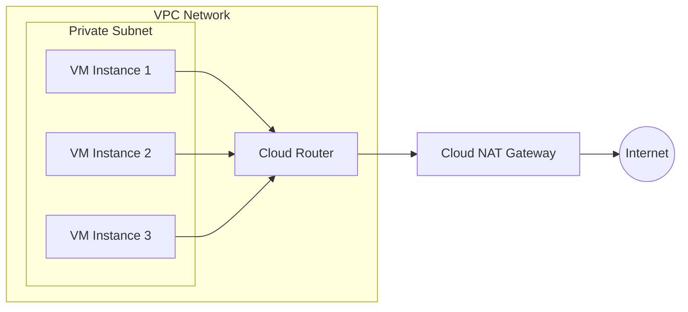
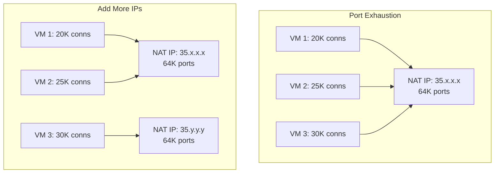
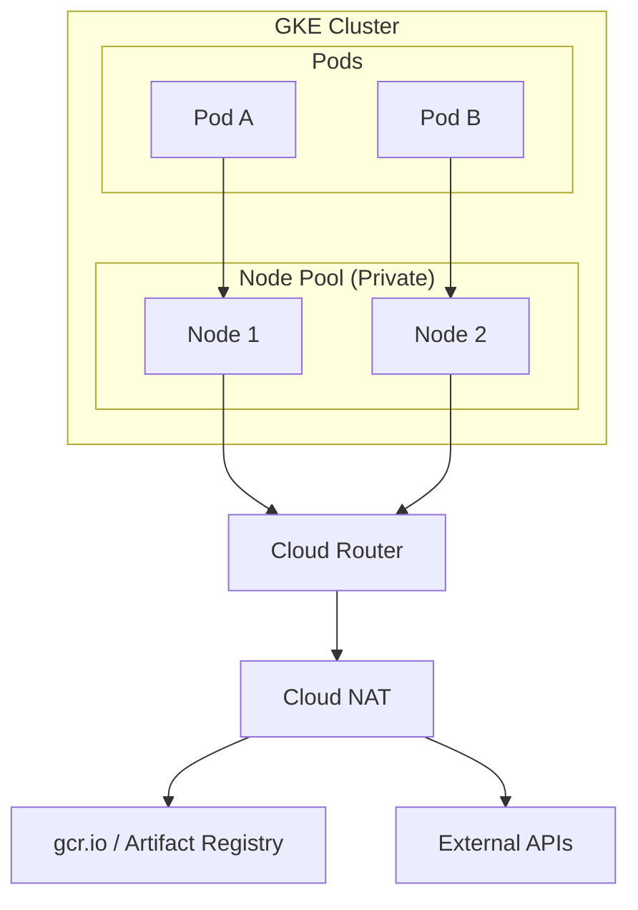

# How to Fix 'Cloud NAT' Configuration Errors

Author: [nawazdhandala](https://www.github.com/nawazdhandala)

Tags: Google Cloud, Cloud NAT, Networking, GCP, NAT Gateway, Troubleshooting

Description: A practical guide to diagnosing and fixing common Cloud NAT configuration errors in Google Cloud Platform, including port exhaustion, routing issues, and logging problems.

---

Cloud NAT lets your private instances access the internet without external IP addresses. But when it breaks, your applications lose external connectivity entirely. Let's walk through the most common Cloud NAT errors and how to fix them.

## Understanding Cloud NAT Architecture

Before diving into fixes, you need to understand how Cloud NAT works.



Cloud NAT performs source network address translation (SNAT) for packets sent from instances in your VPC network. It requires a Cloud Router and can use automatic or manual NAT IP allocation.

## Common Error 1: No External Connectivity

Your VM cannot reach external endpoints even with Cloud NAT configured.

### Diagnosis

```bash
# Check if Cloud NAT is associated with the right network and region
gcloud compute routers nats list \
    --router=my-router \
    --region=us-central1

# Verify the subnet is covered by NAT
gcloud compute routers nats describe my-nat \
    --router=my-router \
    --region=us-central1 \
    --format="yaml(sourceSubnetworkIpRangesToNat)"
```

### Fix: Subnet Not Covered

The most common cause is that your subnet is not included in the NAT configuration.

```bash
# Update NAT to cover all subnets in the region
gcloud compute routers nats update my-nat \
    --router=my-router \
    --region=us-central1 \
    --nat-all-subnet-ip-ranges

# Or add specific subnets
gcloud compute routers nats update my-nat \
    --router=my-router \
    --region=us-central1 \
    --nat-custom-subnet-ip-ranges=my-subnet:ALL
```

### Fix: Cloud Router Not Associated

Ensure the Cloud Router is in the same region and network as your instances.

```bash
# Create a Cloud Router if missing
gcloud compute routers create my-router \
    --network=my-vpc \
    --region=us-central1

# Create NAT gateway attached to the router
gcloud compute routers nats create my-nat \
    --router=my-router \
    --region=us-central1 \
    --nat-all-subnet-ip-ranges \
    --auto-allocate-nat-external-ips
```

## Common Error 2: Port Exhaustion

You see dropped connections or intermittent connectivity failures. Logs show "Out of resources" or high port usage.

### Understanding the Problem

Each NAT IP address can handle approximately 64,000 concurrent connections. With many VMs or connection-heavy workloads, you can exhaust available ports.



### Diagnosis

```bash
# Check port allocation per VM
gcloud compute routers get-nat-mapping-info my-router \
    --region=us-central1

# View NAT metrics in Cloud Monitoring
# Look for: nat_allocation_failed, dropped_sent_packets_count
```

### Fix: Increase Port Allocation

```bash
# Increase minimum ports per VM (default is 64)
gcloud compute routers nats update my-nat \
    --router=my-router \
    --region=us-central1 \
    --min-ports-per-vm=2048

# Enable dynamic port allocation
gcloud compute routers nats update my-nat \
    --router=my-router \
    --region=us-central1 \
    --enable-dynamic-port-allocation \
    --min-ports-per-vm=64 \
    --max-ports-per-vm=65536
```

### Fix: Add More NAT IP Addresses

```bash
# Reserve additional external IPs
gcloud compute addresses create nat-ip-1 nat-ip-2 nat-ip-3 \
    --region=us-central1

# Update NAT to use manual IP allocation
gcloud compute routers nats update my-nat \
    --router=my-router \
    --region=us-central1 \
    --nat-external-ip-pool=nat-ip-1,nat-ip-2,nat-ip-3
```

## Common Error 3: Endpoint-Independent Mapping Conflicts

You receive errors about endpoint-independent mapping when using certain protocols.

### The Problem

Cloud NAT uses endpoint-independent mapping by default. Some applications (WebRTC, SIP, certain gaming protocols) require this, but it can cause issues with port reuse.

### Fix: Configure Mapping Behavior

```bash
# For applications that need endpoint-independent mapping
gcloud compute routers nats update my-nat \
    --router=my-router \
    --region=us-central1 \
    --endpoint-independent-mapping

# For maximum port efficiency (breaks some protocols)
gcloud compute routers nats update my-nat \
    --router=my-router \
    --region=us-central1 \
    --no-endpoint-independent-mapping
```

## Common Error 4: NAT Logging Not Working

You enabled logging but cannot see NAT logs in Cloud Logging.

### Fix: Enable Logging Correctly

```bash
# Enable all NAT logging
gcloud compute routers nats update my-nat \
    --router=my-router \
    --region=us-central1 \
    --enable-logging \
    --log-filter=ALL

# Or log only errors
gcloud compute routers nats update my-nat \
    --router=my-router \
    --region=us-central1 \
    --enable-logging \
    --log-filter=ERRORS_ONLY

# Or log only translations
gcloud compute routers nats update my-nat \
    --router=my-router \
    --region=us-central1 \
    --enable-logging \
    --log-filter=TRANSLATIONS_ONLY
```

### Query NAT Logs

```bash
# View NAT logs in Cloud Logging
gcloud logging read 'resource.type="nat_gateway"' \
    --limit=50 \
    --format="table(timestamp,jsonPayload.connection)"
```

## Common Error 5: GKE Nodes Cannot Reach Internet

GKE nodes with private IPs cannot pull images or reach external APIs.

### Understanding GKE and Cloud NAT



### Fix: Configure NAT for GKE Subnets

```bash
# Get the subnet used by GKE
gcloud container clusters describe my-cluster \
    --region=us-central1 \
    --format="value(networkConfig.subnetwork)"

# Ensure NAT covers secondary ranges (for Pods and Services)
gcloud compute routers nats update my-nat \
    --router=my-router \
    --region=us-central1 \
    --nat-custom-subnet-ip-ranges=gke-subnet:ALL
```

For more control, specify exact ranges:

```bash
# Cover only primary range and pod range
gcloud compute routers nats update my-nat \
    --router=my-router \
    --region=us-central1 \
    --nat-custom-subnet-ip-ranges=gke-subnet:PRIMARY,gke-subnet:my-pods-range
```

## Common Error 6: Terraform Configuration Errors

Infrastructure as Code deployments fail with Cloud NAT errors.

### Correct Terraform Configuration

```hcl
# Create VPC network
resource "google_compute_network" "vpc" {
  name                    = "my-vpc"
  auto_create_subnetworks = false
}

# Create subnet
resource "google_compute_subnetwork" "subnet" {
  name          = "my-subnet"
  ip_cidr_range = "10.0.0.0/24"
  region        = "us-central1"
  network       = google_compute_network.vpc.id

  # Secondary ranges for GKE
  secondary_ip_range {
    range_name    = "pods"
    ip_cidr_range = "10.1.0.0/16"
  }

  secondary_ip_range {
    range_name    = "services"
    ip_cidr_range = "10.2.0.0/20"
  }
}

# Create Cloud Router
resource "google_compute_router" "router" {
  name    = "my-router"
  region  = "us-central1"
  network = google_compute_network.vpc.id
}

# Create Cloud NAT
resource "google_compute_router_nat" "nat" {
  name                               = "my-nat"
  router                             = google_compute_router.router.name
  region                             = google_compute_router.router.region
  nat_ip_allocate_option             = "AUTO_ONLY"
  source_subnetwork_ip_ranges_to_nat = "ALL_SUBNETWORKS_ALL_IP_RANGES"

  # Port allocation settings
  min_ports_per_vm                    = 64
  max_ports_per_vm                    = 65536
  enable_dynamic_port_allocation      = true
  enable_endpoint_independent_mapping = false

  # Logging
  log_config {
    enable = true
    filter = "ERRORS_ONLY"
  }
}
```

### Common Terraform Errors

**Error: "Router not found"**

```hcl
# Wrong - referencing by name without region
router = "my-router"

# Correct - use resource reference
router = google_compute_router.router.name
region = google_compute_router.router.region
```

**Error: "Invalid subnetwork"**

```hcl
# Wrong - mixing options
source_subnetwork_ip_ranges_to_nat = "LIST_OF_SUBNETWORKS"
# But not providing subnetwork list

# Correct - provide subnetwork configuration
source_subnetwork_ip_ranges_to_nat = "LIST_OF_SUBNETWORKS"
subnetwork {
  name                    = google_compute_subnetwork.subnet.id
  source_ip_ranges_to_nat = ["ALL_IP_RANGES"]
}
```

## Monitoring Cloud NAT Health

Set up proper monitoring to catch issues before they impact users.

### Create Alert Policies

```bash
# Alert on high port usage
gcloud alpha monitoring policies create \
    --display-name="Cloud NAT Port Exhaustion" \
    --condition-display-name="Port allocation failures" \
    --condition-filter='resource.type="nat_gateway" AND metric.type="router.googleapis.com/nat/nat_allocation_failed"' \
    --condition-threshold-value=1 \
    --condition-threshold-duration=60s \
    --notification-channels=projects/my-project/notificationChannels/123
```

### Key Metrics to Monitor

| Metric | Description | Alert Threshold |
|--------|-------------|-----------------|
| `nat/allocated_ports` | Ports currently allocated | >80% of max |
| `nat/nat_allocation_failed` | Failed port allocations | >0 |
| `nat/dropped_sent_packets_count` | Packets dropped due to NAT | >0 |
| `nat/port_usage` | Port utilization percentage | >70% |

## Troubleshooting Checklist

When Cloud NAT is not working, run through this checklist:

1. **Verify NAT exists in the correct region** - Cloud NAT is regional
2. **Check subnet coverage** - Ensure your subnets are included
3. **Verify Cloud Router association** - Router must be in same network/region
4. **Check firewall rules** - Egress rules might be blocking traffic
5. **Review port allocation** - Increase if you have high connection counts
6. **Check NAT IP health** - Ensure NAT IPs are not blacklisted
7. **Enable logging** - Use logs to diagnose specific connection failures
8. **Monitor metrics** - Set up alerts for port exhaustion

Cloud NAT is straightforward once you understand the relationship between routers, subnets, and NAT gateways. Most errors come from misconfigured subnet coverage or port exhaustion under load.
