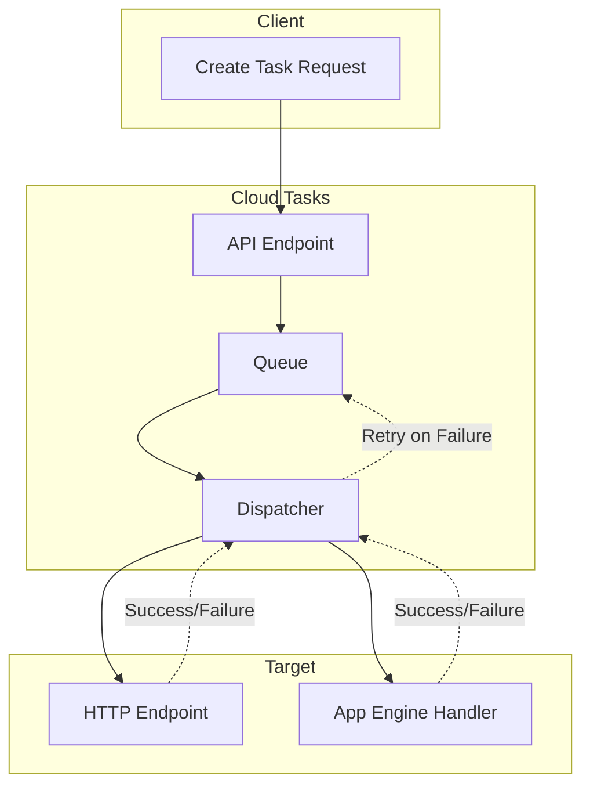

# How to Fix 'Cloud Tasks' Queue Errors

Author: [nawazdhandala](https://www.github.com/nawazdhandala)

Tags: Cloud Tasks, Google Cloud, Queue, Errors, Troubleshooting, GCP, Distributed Systems

Description: Learn how to diagnose and fix common Google Cloud Tasks queue errors including permission issues, rate limiting, and task execution failures.

---

Google Cloud Tasks is a fully managed service for executing, dispatching, and delivering tasks asynchronously. When things go wrong, the error messages can be cryptic and debugging can be frustrating. This guide covers the most common Cloud Tasks errors and provides practical solutions for each.

## Understanding Cloud Tasks Architecture

Before troubleshooting, it helps to understand how Cloud Tasks processes your requests. Tasks flow through several stages, and errors can occur at any point.



## Error: PERMISSION_DENIED

This is one of the most common errors. It typically occurs when the service account lacks the necessary IAM roles.

### Symptoms

```text
google.api_core.exceptions.PermissionDenied: 403 The principal does not have
cloudtasks.tasks.create permission for the resource queue.
```

### Solution

Grant the Cloud Tasks Enqueuer role to your service account.

```bash
# Check current IAM bindings for the queue
gcloud tasks queues get-iam-policy my-queue --location=us-central1

# Grant the Cloud Tasks Enqueuer role
gcloud tasks queues add-iam-policy-binding my-queue \
    --location=us-central1 \
    --member="serviceAccount:my-service@my-project.iam.gserviceaccount.com" \
    --role="roles/cloudtasks.enqueuer"

# For HTTP target tasks, the service account also needs to invoke the target
# If targeting Cloud Run:
gcloud run services add-iam-policy-binding my-service \
    --region=us-central1 \
    --member="serviceAccount:my-service@my-project.iam.gserviceaccount.com" \
    --role="roles/run.invoker"
```

For tasks that use OIDC authentication, you also need to allow the service account to create tokens.

```bash
# Grant Service Account Token Creator role
gcloud iam service-accounts add-iam-policy-binding \
    target-service@my-project.iam.gserviceaccount.com \
    --member="serviceAccount:my-service@my-project.iam.gserviceaccount.com" \
    --role="roles/iam.serviceAccountTokenCreator"
```

## Error: RESOURCE_EXHAUSTED (Rate Limiting)

Cloud Tasks has quotas on task creation and dispatch rates. Exceeding these limits triggers rate limiting errors.

### Symptoms

```text
google.api_core.exceptions.ResourceExhausted: 429 Quota exceeded for quota metric
'Task queue executions' and limit 'Task queue executions per minute per queue'
```

### Solution

Adjust your queue configuration to handle the rate limits appropriately.

```bash
# View current queue configuration
gcloud tasks queues describe my-queue --location=us-central1

# Update queue rate limits
gcloud tasks queues update my-queue \
    --location=us-central1 \
    --max-dispatches-per-second=500 \
    --max-concurrent-dispatches=1000
```

For bursting workloads, implement client-side rate limiting.

```python
from google.cloud import tasks_v2
from google.api_core import retry
from google.api_core.exceptions import ResourceExhausted
import time

class TaskQueueClient:
    """Client with built-in rate limiting for Cloud Tasks."""

    def __init__(self, project, location, queue):
        self.client = tasks_v2.CloudTasksClient()
        self.queue_path = self.client.queue_path(project, location, queue)
        self.last_request_time = 0
        self.min_interval = 0.01  # 100 requests per second max

    def create_task_with_backoff(self, task_config, max_retries=5):
        """Create a task with exponential backoff on rate limit errors."""

        for attempt in range(max_retries):
            try:
                # Enforce minimum interval between requests
                elapsed = time.time() - self.last_request_time
                if elapsed < self.min_interval:
                    time.sleep(self.min_interval - elapsed)

                task = {
                    "http_request": task_config
                }

                response = self.client.create_task(
                    parent=self.queue_path,
                    task=task
                )

                self.last_request_time = time.time()
                return response

            except ResourceExhausted as e:
                if attempt == max_retries - 1:
                    raise

                # Exponential backoff: 1s, 2s, 4s, 8s, 16s
                wait_time = (2 ** attempt)
                print(f"Rate limited, waiting {wait_time}s before retry")
                time.sleep(wait_time)
```

## Error: DEADLINE_EXCEEDED

Tasks can fail if the target endpoint does not respond within the timeout period.

### Symptoms

```text
Task failed with status: DEADLINE_EXCEEDED
The deadline was exceeded while waiting for the target to respond.
```

### Solution

Increase the task timeout and ensure your handler responds quickly.

```python
from google.cloud import tasks_v2
from google.protobuf import duration_pb2

def create_task_with_timeout(project, location, queue, url, payload):
    """Create a task with extended timeout for long-running operations."""

    client = tasks_v2.CloudTasksClient()
    parent = client.queue_path(project, location, queue)

    # Set a longer timeout (max is 30 minutes for HTTP targets)
    task = {
        "http_request": {
            "http_method": tasks_v2.HttpMethod.POST,
            "url": url,
            "headers": {
                "Content-Type": "application/json",
            },
            "body": payload.encode(),
        },
        # Dispatch deadline - how long Cloud Tasks waits for response
        "dispatch_deadline": duration_pb2.Duration(seconds=1800),  # 30 minutes
    }

    response = client.create_task(parent=parent, task=task)
    return response
```

For tasks that genuinely take a long time, use a quick-acknowledge pattern.

```python
from flask import Flask, request, jsonify
import threading

app = Flask(__name__)

@app.route('/process-task', methods=['POST'])
def handle_task():
    """Immediately acknowledge the task and process asynchronously."""

    task_data = request.get_json()

    # Start processing in a background thread
    thread = threading.Thread(
        target=process_long_running_task,
        args=(task_data,)
    )
    thread.start()

    # Return 200 immediately to acknowledge receipt
    # Cloud Tasks considers the task successful
    return jsonify({"status": "accepted"}), 200

def process_long_running_task(data):
    """Process the actual work asynchronously."""
    try:
        # Your long-running logic here
        result = heavy_computation(data)
        store_result(result)
    except Exception as e:
        # Log the error - you will need separate monitoring for these
        log_error(e, data)
```

## Error: INVALID_ARGUMENT

This error occurs when the task configuration is malformed or contains invalid values.

### Symptoms

```text
google.api_core.exceptions.InvalidArgument: 400 The task's schedule_time is in the past.
```

### Common Causes and Fixes

```python
from google.cloud import tasks_v2
from google.protobuf import timestamp_pb2
from datetime import datetime, timezone, timedelta

def create_scheduled_task(project, location, queue, url, delay_seconds):
    """Create a task scheduled for future execution with proper timestamp handling."""

    client = tasks_v2.CloudTasksClient()
    parent = client.queue_path(project, location, queue)

    # Calculate schedule time - must be in the future
    schedule_time = datetime.now(timezone.utc) + timedelta(seconds=delay_seconds)

    # Convert to protobuf timestamp
    timestamp = timestamp_pb2.Timestamp()
    timestamp.FromDatetime(schedule_time)

    task = {
        "http_request": {
            "http_method": tasks_v2.HttpMethod.POST,
            "url": url,
            "headers": {
                "Content-Type": "application/json",
            },
        },
        "schedule_time": timestamp,
    }

    # Validate URL format before sending
    if not url.startswith("https://"):
        raise ValueError("HTTP targets must use HTTPS")

    response = client.create_task(parent=parent, task=task)
    return response
```

### Task Name Validation

Task names must follow specific rules. Here is a helper function to ensure valid names.

```python
import re
import hashlib

def generate_valid_task_name(project, location, queue, task_id):
    """Generate a valid Cloud Tasks task name from arbitrary input."""

    # Task names can only contain letters, numbers, hyphens, and underscores
    # Max length is 500 characters

    # Clean the task ID
    clean_id = re.sub(r'[^a-zA-Z0-9_-]', '-', task_id)

    # If the ID is too long, hash it
    if len(clean_id) > 100:
        hash_suffix = hashlib.sha256(task_id.encode()).hexdigest()[:16]
        clean_id = clean_id[:80] + '-' + hash_suffix

    # Construct the full task name
    task_name = f"projects/{project}/locations/{location}/queues/{queue}/tasks/{clean_id}"

    return task_name
```

## Error: Task Handler Returns Non-2xx Status

When your task handler returns an error status code, Cloud Tasks will retry the task according to the queue's retry configuration.

### Diagnosing Handler Failures

```bash
# View recent task attempts and their results
gcloud tasks list --queue=my-queue --location=us-central1

# Check Cloud Logging for task execution details
gcloud logging read 'resource.type="cloud_tasks_queue" severity>=WARNING' \
    --limit=50 \
    --format="table(timestamp,jsonPayload.status,jsonPayload.targetAddress)"
```

### Configure Retry Behavior

```bash
# Update queue retry configuration
gcloud tasks queues update my-queue \
    --location=us-central1 \
    --max-attempts=10 \
    --min-backoff=1s \
    --max-backoff=3600s \
    --max-doublings=10
```

Implement idempotent handlers to safely handle retries.

```python
from flask import Flask, request, jsonify
import redis

app = Flask(__name__)
redis_client = redis.Redis(host='localhost', port=6379, db=0)

@app.route('/process-order', methods=['POST'])
def process_order():
    """Idempotent task handler that safely handles retries."""

    # Get the task name from headers - unique per task
    task_name = request.headers.get('X-CloudTasks-TaskName', '')

    # Check if we have already processed this task
    if redis_client.get(f"processed:{task_name}"):
        # Already processed - return success to prevent further retries
        return jsonify({"status": "already_processed"}), 200

    try:
        order_data = request.get_json()

        # Process the order
        result = process_order_logic(order_data)

        # Mark as processed with 24-hour expiry
        redis_client.setex(f"processed:{task_name}", 86400, "1")

        return jsonify({"status": "success", "result": result}), 200

    except TemporaryError as e:
        # Return 503 to trigger retry
        return jsonify({"error": str(e)}), 503

    except PermanentError as e:
        # Return 400 to prevent retries - task is fundamentally broken
        return jsonify({"error": str(e)}), 400
```

## Error: Queue Does Not Exist

This happens when trying to create tasks in a queue that has not been created or was deleted.

### Solution

```bash
# List existing queues
gcloud tasks queues list --location=us-central1

# Create a new queue with appropriate configuration
gcloud tasks queues create my-queue \
    --location=us-central1 \
    --max-dispatches-per-second=100 \
    --max-concurrent-dispatches=100 \
    --max-attempts=5 \
    --min-backoff=10s \
    --max-backoff=300s
```

Create queues programmatically as part of your deployment.

```python
from google.cloud import tasks_v2
from google.api_core.exceptions import AlreadyExists

def ensure_queue_exists(project, location, queue_name, config=None):
    """Create a queue if it does not exist."""

    client = tasks_v2.CloudTasksClient()
    parent = f"projects/{project}/locations/{location}"
    queue_path = f"{parent}/queues/{queue_name}"

    default_config = {
        "name": queue_path,
        "rate_limits": {
            "max_dispatches_per_second": 100,
            "max_concurrent_dispatches": 100,
        },
        "retry_config": {
            "max_attempts": 5,
            "min_backoff": {"seconds": 10},
            "max_backoff": {"seconds": 300},
            "max_doublings": 4,
        },
    }

    queue_config = config or default_config

    try:
        queue = client.create_queue(parent=parent, queue=queue_config)
        print(f"Created queue: {queue.name}")
        return queue
    except AlreadyExists:
        print(f"Queue already exists: {queue_path}")
        return client.get_queue(name=queue_path)
```

## Monitoring and Alerting

Set up monitoring to catch queue issues before they become critical.

```yaml
# alert-policy.yaml - Alert on high task failure rate
displayName: "Cloud Tasks High Failure Rate"
conditions:
  - displayName: "Task failures exceed threshold"
    conditionThreshold:
      filter: |
        resource.type="cloud_tasks_queue"
        metric.type="cloudtasks.googleapis.com/queue/task_attempt_count"
        metric.label.response_code!="200"
      comparison: COMPARISON_GT
      thresholdValue: 100
      duration: "300s"
      aggregations:
        - alignmentPeriod: "60s"
          perSeriesAligner: ALIGN_RATE
combiner: OR
notificationChannels:
  - projects/my-project/notificationChannels/12345
```

## Summary

Cloud Tasks errors generally fall into a few categories: permissions, rate limiting, timeouts, and handler failures. Key strategies for handling them include:

- Always verify IAM permissions for both queue access and target invocation
- Implement client-side rate limiting to avoid quota exhaustion
- Use the quick-acknowledge pattern for long-running tasks
- Build idempotent handlers that safely handle retries
- Monitor task success rates and set up alerts for anomalies
- Create queues as part of your infrastructure-as-code deployment

With proper error handling and monitoring, Cloud Tasks provides a reliable foundation for asynchronous task processing at scale.
