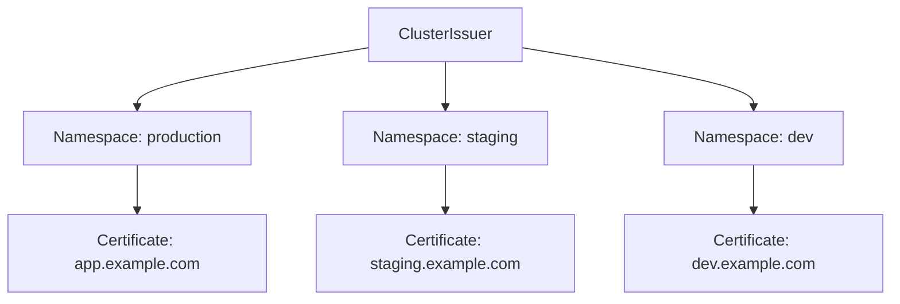

# How to Configure ClusterIssuer with Let's Encrypt and cert-manager

Author: [nawazdhandala](https://www.github.com/nawazdhandala)

Tags: Kubernetes, TLS, cert-manager, Let's Encrypt, Security

Description: Learn how to set up automatic TLS certificate management in Kubernetes using cert-manager and Let's Encrypt. This guide covers ClusterIssuer configuration, DNS and HTTP challenges, and troubleshooting.

---

Running HTTPS in Kubernetes requires TLS certificates. Managing certificates manually is tedious and error-prone. cert-manager automates the entire lifecycle: requesting certificates from Let's Encrypt, validating domain ownership, and renewing before expiration. This guide shows you how to set it up.

## Install cert-manager

First, install cert-manager in your cluster:

```bash
# Install cert-manager using kubectl
kubectl apply -f https://github.com/cert-manager/cert-manager/releases/download/v1.14.4/cert-manager.yaml

# Wait for cert-manager pods to be ready
kubectl wait --for=condition=Ready pods --all -n cert-manager --timeout=120s

# Verify installation
kubectl get pods -n cert-manager
# NAME                                       READY   STATUS    RESTARTS   AGE
# cert-manager-5d7f97b46d-xxxxx             1/1     Running   0          60s
# cert-manager-cainjector-d9bc5979d-xxxxx   1/1     Running   0          60s
# cert-manager-webhook-7f9f8648b9-xxxxx     1/1     Running   0          60s
```

## Understanding Issuers vs ClusterIssuers

cert-manager has two issuer types:
- **Issuer**: Works in a single namespace
- **ClusterIssuer**: Works across all namespaces

Use ClusterIssuer when you have multiple namespaces that need certificates:



## Create a ClusterIssuer for Staging

Always test with Let's Encrypt staging first. Staging has higher rate limits and will not burn your production quota:

```yaml
# letsencrypt-staging.yaml
apiVersion: cert-manager.io/v1
kind: ClusterIssuer
metadata:
  name: letsencrypt-staging
spec:
  acme:
    # Let's Encrypt staging server for testing
    server: https://acme-staging-v02.api.letsencrypt.org/directory
    # Your email for certificate expiration notifications
    email: admin@example.com
    # Secret to store the ACME account private key
    privateKeySecretRef:
      name: letsencrypt-staging-account-key
    # Use HTTP-01 challenge via Ingress
    solvers:
    - http01:
        ingress:
          ingressClassName: nginx
```

Apply it:

```bash
kubectl apply -f letsencrypt-staging.yaml

# Check the ClusterIssuer status
kubectl get clusterissuer letsencrypt-staging
kubectl describe clusterissuer letsencrypt-staging
```

## Create a Production ClusterIssuer

Once staging works, create a production issuer:

```yaml
# letsencrypt-prod.yaml
apiVersion: cert-manager.io/v1
kind: ClusterIssuer
metadata:
  name: letsencrypt-prod
spec:
  acme:
    # Production Let's Encrypt server
    server: https://acme-v02.api.letsencrypt.org/directory
    email: admin@example.com
    privateKeySecretRef:
      name: letsencrypt-prod-account-key
    solvers:
    - http01:
        ingress:
          ingressClassName: nginx
```

```bash
kubectl apply -f letsencrypt-prod.yaml
```

## HTTP-01 vs DNS-01 Challenges

Let's Encrypt needs to verify you control the domain. Two challenge types are available:

| Challenge | How It Works | Best For |
|-----------|--------------|----------|
| HTTP-01 | Serves a token at `/.well-known/acme-challenge/` | Public web servers |
| DNS-01 | Creates a DNS TXT record | Wildcards, private servers |

### HTTP-01 Challenge

The default and simplest option. cert-manager creates a temporary Ingress to serve the challenge:

```yaml
solvers:
- http01:
    ingress:
      ingressClassName: nginx  # Match your Ingress controller class
```

Requirements:
- Your Ingress must be publicly accessible on port 80
- DNS must point to your Ingress controller

### DNS-01 Challenge with Cloudflare

For wildcard certificates or when HTTP-01 is not possible, use DNS-01:

```yaml
# letsencrypt-dns.yaml
apiVersion: cert-manager.io/v1
kind: ClusterIssuer
metadata:
  name: letsencrypt-dns
spec:
  acme:
    server: https://acme-v02.api.letsencrypt.org/directory
    email: admin@example.com
    privateKeySecretRef:
      name: letsencrypt-dns-account-key
    solvers:
    - dns01:
        cloudflare:
          email: cloudflare@example.com
          apiTokenSecretRef:
            name: cloudflare-api-token
            key: api-token
```

Create the API token secret:

```bash
# Create secret with Cloudflare API token
kubectl create secret generic cloudflare-api-token \
  --namespace cert-manager \
  --from-literal=api-token=your-cloudflare-api-token
```

Other supported DNS providers include Route53, Google Cloud DNS, Azure DNS, and many more.

## Request a Certificate with Ingress

The easiest way to get a certificate is through Ingress annotations:

```yaml
# ingress.yaml
apiVersion: networking.k8s.io/v1
kind: Ingress
metadata:
  name: web-app
  annotations:
    # Tell cert-manager to issue a certificate
    cert-manager.io/cluster-issuer: letsencrypt-prod
spec:
  ingressClassName: nginx
  tls:
  - hosts:
    - app.example.com
    # cert-manager creates this Secret with the certificate
    secretName: app-example-com-tls
  rules:
  - host: app.example.com
    http:
      paths:
      - path: /
        pathType: Prefix
        backend:
          service:
            name: web-app
            port:
              number: 80
```

Apply it and cert-manager handles the rest:

```bash
kubectl apply -f ingress.yaml

# Watch certificate progress
kubectl get certificate -w
# NAME                  READY   SECRET                AGE
# app-example-com-tls   False   app-example-com-tls   10s
# app-example-com-tls   True    app-example-com-tls   45s
```

## Request a Certificate Directly

You can also create Certificate resources explicitly:

```yaml
# certificate.yaml
apiVersion: cert-manager.io/v1
kind: Certificate
metadata:
  name: wildcard-example-com
  namespace: production
spec:
  secretName: wildcard-example-com-tls
  issuerRef:
    name: letsencrypt-dns  # DNS issuer for wildcard
    kind: ClusterIssuer
  # Wildcard certificate for all subdomains
  dnsNames:
  - "*.example.com"
  - example.com
```

```bash
kubectl apply -f certificate.yaml

# Check certificate status
kubectl describe certificate wildcard-example-com -n production
```

## Troubleshooting Certificate Issues

### Check Certificate Status

```bash
# List all certificates
kubectl get certificate --all-namespaces

# Get detailed status
kubectl describe certificate app-example-com-tls

# Check the Certificate Request
kubectl get certificaterequest --all-namespaces
kubectl describe certificaterequest app-example-com-tls-xxxxx
```

### Check Challenge Status

If certificate stays in pending state, check challenges:

```bash
# List active challenges
kubectl get challenges --all-namespaces

# Describe a specific challenge
kubectl describe challenge app-example-com-tls-xxxxx-xxxxx
```

Common issues:
- "Waiting for HTTP-01 challenge propagation" - Ingress not accessible from internet
- "DNS record not yet propagated" - DNS challenge not visible yet (wait or check DNS)
- "Invalid response from..." - Something is intercepting the challenge request

### Check cert-manager Logs

```bash
# Check cert-manager controller logs
kubectl logs -n cert-manager -l app=cert-manager --tail=100

# Check webhook logs
kubectl logs -n cert-manager -l app=webhook --tail=100
```

### Test HTTP-01 Challenge Path

Verify the challenge endpoint is reachable:

```bash
# The challenge URL format
curl -v http://app.example.com/.well-known/acme-challenge/test

# Should return 404 (not found) not 403 (forbidden) or connection error
```

## Renewing Certificates

cert-manager automatically renews certificates before expiration (default: 30 days before). To manually trigger renewal:

```bash
# Delete the certificate secret to force renewal
kubectl delete secret app-example-com-tls -n production

# Or add an annotation to the Certificate
kubectl annotate certificate app-example-com-tls \
  cert-manager.io/issuer-name- --overwrite
```

Check renewal status:

```bash
kubectl describe certificate app-example-com-tls | grep -A5 "Renewal"
```

## Summary

cert-manager with Let's Encrypt automates TLS certificate management in Kubernetes. Install cert-manager, create a ClusterIssuer pointing to Let's Encrypt, and add annotations to your Ingress resources. Use staging for testing, production for real certificates. Choose HTTP-01 challenges for simple public setups, DNS-01 for wildcards or complex scenarios. Monitor certificate status with `kubectl get certificate` and check challenges when things get stuck.
