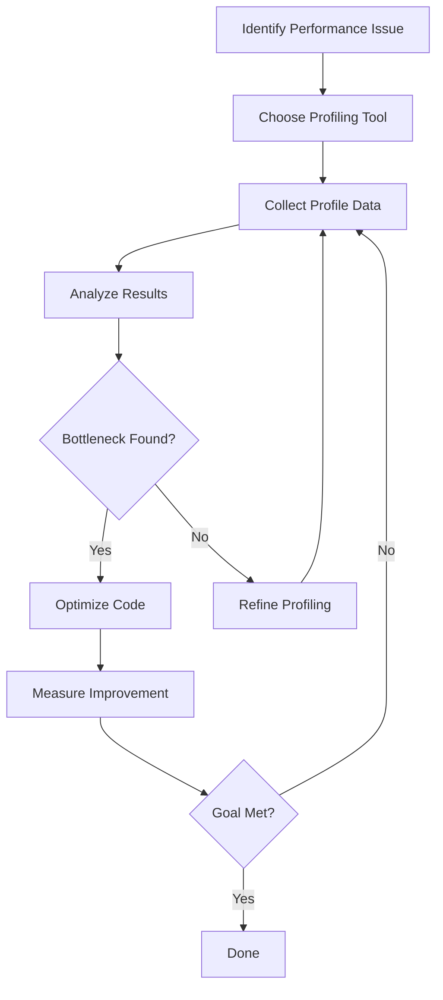
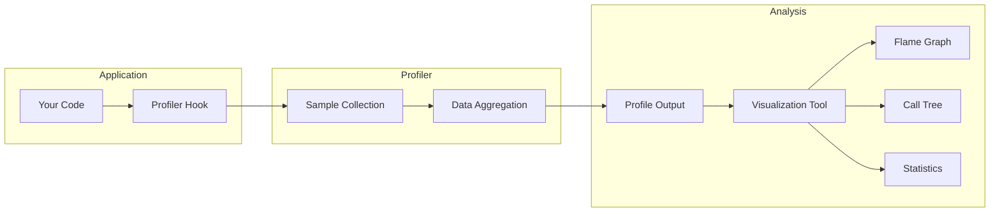
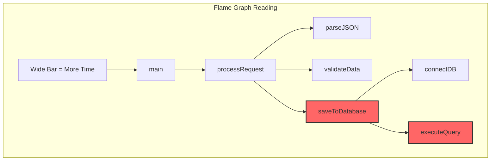

# How to Handle Code Profiling

Author: [nawazdhandala](https://www.github.com/nawazdhandala)

Tags: Performance, Profiling, Optimization, CPU, Memory, Debugging

Description: Learn how to profile your code effectively to identify performance bottlenecks and optimize application performance.

---

Code profiling is the process of analyzing your application to understand where time and resources are being spent. Without proper profiling, optimization efforts are often misguided and can waste valuable development time on code paths that do not matter.

---

## Why Profile Your Code?

Before making any performance improvements, you need data. Profiling helps you:

- Identify actual bottlenecks rather than perceived ones
- Measure the impact of optimizations
- Understand memory allocation patterns
- Find CPU-intensive operations
- Detect unexpected behavior in production

---

## Profiling Workflow



---

## CPU Profiling in Node.js

Node.js has built-in profiling capabilities through the V8 profiler.

```javascript
// Using the built-in profiler
// Run with: node --prof app.js
// Process with: node --prof-process isolate-*.log > profile.txt

const http = require('http');

// Simulate CPU-intensive work
function fibonacci(n) {
    if (n <= 1) return n;
    return fibonacci(n - 1) + fibonacci(n - 2);
}

const server = http.createServer((req, res) => {
    // This will show up in the profile as a hot path
    const result = fibonacci(40);
    res.writeHead(200);
    res.end(`Result: ${result}`);
});

server.listen(3000, () => {
    console.log('Server running on port 3000');
});
```

---

## Memory Profiling in Node.js

```javascript
// memory-profile.js
// Demonstrates memory profiling techniques

const v8 = require('v8');
const fs = require('fs');

// Take a heap snapshot
function takeHeapSnapshot(filename) {
    const snapshotStream = v8.writeHeapSnapshot(filename);
    console.log(`Heap snapshot written to: ${snapshotStream}`);
    return snapshotStream;
}

// Get heap statistics
function logHeapStats() {
    const stats = v8.getHeapStatistics();
    console.log('Heap Statistics:');
    console.log(`  Total heap size: ${(stats.total_heap_size / 1024 / 1024).toFixed(2)} MB`);
    console.log(`  Used heap size: ${(stats.used_heap_size / 1024 / 1024).toFixed(2)} MB`);
    console.log(`  Heap size limit: ${(stats.heap_size_limit / 1024 / 1024).toFixed(2)} MB`);
}

// Simulate memory leak for demonstration
class LeakyCache {
    constructor() {
        this.cache = [];
    }

    // This method leaks memory by never cleaning up
    add(data) {
        this.cache.push(data);
    }
}

const cache = new LeakyCache();

// Log initial state
logHeapStats();

// Simulate adding data
for (let i = 0; i < 10000; i++) {
    cache.add({ id: i, data: 'x'.repeat(1000) });
}

// Log after allocation
logHeapStats();

// Take snapshot for analysis
takeHeapSnapshot();
```

---

## Python Profiling with cProfile

```python
# profiling_example.py
import cProfile
import pstats
import io
from functools import lru_cache

# Function to profile
def slow_function(n):
    """Simulates slow computation"""
    result = 0
    for i in range(n):
        for j in range(n):
            result += i * j
    return result

# Optimized version with caching
@lru_cache(maxsize=128)
def cached_computation(n):
    """Cached version of computation"""
    return sum(i * j for i in range(n) for j in range(n))

def main():
    # Profile the slow function
    profiler = cProfile.Profile()
    profiler.enable()

    # Run the code to profile
    for _ in range(10):
        slow_function(100)
        cached_computation(100)

    profiler.disable()

    # Print statistics
    stream = io.StringIO()
    stats = pstats.Stats(profiler, stream=stream)
    stats.sort_stats('cumulative')
    stats.print_stats(10)  # Top 10 functions

    print(stream.getvalue())

if __name__ == '__main__':
    main()
```

Run with: `python -m cProfile -s cumulative profiling_example.py`

---

## Go Profiling with pprof

```go
package main

import (
    "log"
    "net/http"
    _ "net/http/pprof"  // Import for side effects
    "time"
)

// Simulate CPU-intensive work
func cpuIntensiveTask() {
    sum := 0
    for i := 0; i < 1000000; i++ {
        sum += i
    }
}

// Simulate memory allocation
func memoryIntensiveTask() []byte {
    // Allocate 1MB
    data := make([]byte, 1024*1024)
    for i := range data {
        data[i] = byte(i % 256)
    }
    return data
}

func handler(w http.ResponseWriter, r *http.Request) {
    cpuIntensiveTask()
    data := memoryIntensiveTask()
    w.Write([]byte("Done: " + string(len(data))))
}

func main() {
    // pprof endpoints are available at /debug/pprof/
    http.HandleFunc("/", handler)

    log.Println("Server starting on :6060")
    log.Println("Profile at: http://localhost:6060/debug/pprof/")

    if err := http.ListenAndServe(":6060", nil); err != nil {
        log.Fatal(err)
    }
}
```

Access profiles at:
- CPU: `go tool pprof http://localhost:6060/debug/pprof/profile?seconds=30`
- Heap: `go tool pprof http://localhost:6060/debug/pprof/heap`
- Goroutines: `go tool pprof http://localhost:6060/debug/pprof/goroutine`

---

## Profiling Architecture



---

## Browser Performance Profiling

```javascript
// Browser performance API for profiling
class PerformanceProfiler {
    constructor() {
        this.marks = new Map();
    }

    // Start a measurement
    start(label) {
        performance.mark(`${label}-start`);
        this.marks.set(label, performance.now());
    }

    // End a measurement and log results
    end(label) {
        performance.mark(`${label}-end`);

        try {
            performance.measure(label, `${label}-start`, `${label}-end`);
            const measure = performance.getEntriesByName(label)[0];
            console.log(`${label}: ${measure.duration.toFixed(2)}ms`);
            return measure.duration;
        } catch (e) {
            console.error(`No start mark for ${label}`);
            return null;
        }
    }

    // Get all measurements
    getReport() {
        const entries = performance.getEntriesByType('measure');
        return entries.map(entry => ({
            name: entry.name,
            duration: entry.duration.toFixed(2) + 'ms'
        }));
    }

    // Clear all measurements
    clear() {
        performance.clearMarks();
        performance.clearMeasures();
        this.marks.clear();
    }
}

// Usage example
const profiler = new PerformanceProfiler();

async function fetchAndProcessData() {
    profiler.start('fetch');
    const response = await fetch('/api/data');
    profiler.end('fetch');

    profiler.start('parse');
    const data = await response.json();
    profiler.end('parse');

    profiler.start('process');
    const processed = processData(data);
    profiler.end('process');

    console.log('Performance Report:', profiler.getReport());
    return processed;
}

function processData(data) {
    // Simulate processing
    return data.map(item => item * 2);
}
```

---

## Continuous Profiling Setup

```yaml
# docker-compose.yml for continuous profiling
version: '3.8'
services:
  app:
    build: .
    ports:
      - "3000:3000"
    environment:
      - ENABLE_PROFILING=true
      - PROFILE_INTERVAL=60

  # Pyroscope for continuous profiling
  pyroscope:
    image: pyroscope/pyroscope:latest
    ports:
      - "4040:4040"
    command:
      - "server"

  # Grafana for visualization
  grafana:
    image: grafana/grafana:latest
    ports:
      - "3001:3000"
    environment:
      - GF_SECURITY_ADMIN_PASSWORD=admin
```

---

## Flame Graph Interpretation



The wider a bar in a flame graph, the more time that function consumed. Look for:
- Wide functions at the top of the stack (the actual bottleneck)
- Functions that appear in multiple branches
- Unexpected functions taking significant time

---

## Profiling Best Practices

| Practice | Description |
|----------|-------------|
| Profile in production-like environments | Development may not reflect real workloads |
| Profile before optimizing | Never guess where bottlenecks are |
| Use sampling profilers | They have lower overhead |
| Profile regularly | Catch regressions early |
| Compare before and after | Measure improvement quantitatively |
| Profile under load | Single requests may not reveal issues |

---

## Common Pitfalls

1. **Micro-optimizing**: Spending hours optimizing code that runs for 1ms
2. **Profiler overhead**: Some profilers add significant overhead
3. **Wrong environment**: Development profiling may miss production issues
4. **Insufficient samples**: Short profiling sessions may miss important paths
5. **Ignoring context**: A slow function called once matters less than a fast one called millions of times

---

## Summary

Effective code profiling follows a simple process:

1. Establish a baseline with metrics
2. Use the right profiling tool for your language and environment
3. Identify actual bottlenecks with data
4. Optimize the critical paths first
5. Measure the improvement
6. Repeat until performance goals are met

Remember that premature optimization is the root of all evil. Profile first, optimize second.

---

*Need to monitor your application performance continuously? [OneUptime](https://oneuptime.com) provides real-time performance monitoring, alerting, and profiling integration for production applications.*
