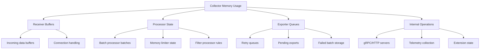
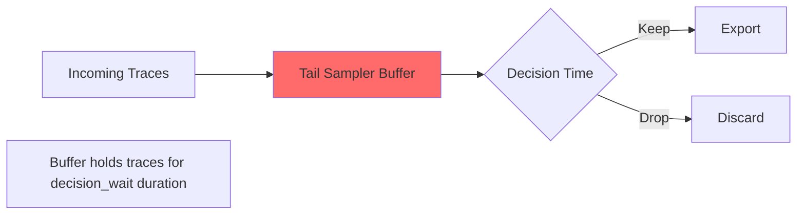
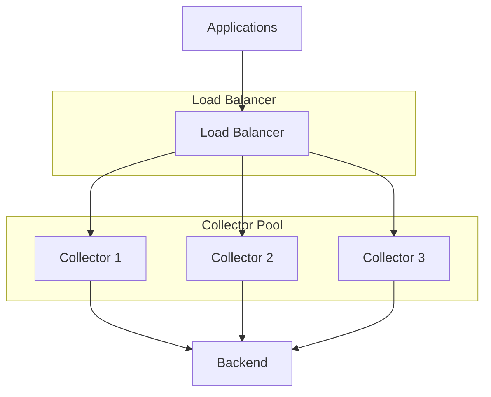
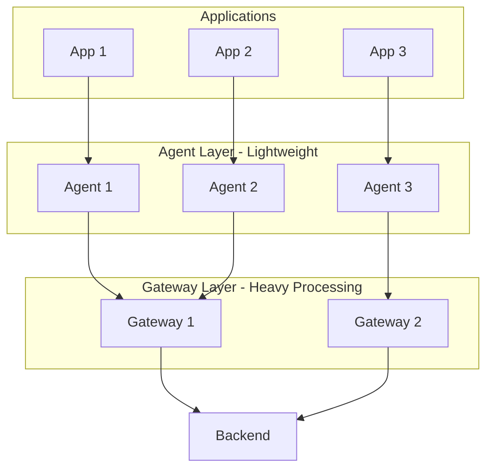
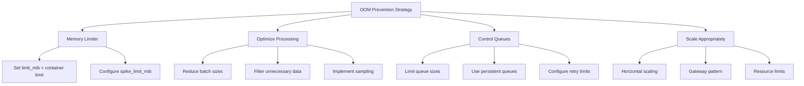

# How to Fix "Collector OOM Killed" Errors

Author: [nawazdhandala](https://www.github.com/nawazdhandala)

Tags: OpenTelemetry, Collector, Memory, Kubernetes, Performance, Troubleshooting

Description: Diagnose and resolve OpenTelemetry Collector out-of-memory errors by optimizing configuration, implementing memory limits, and scaling appropriately.

---

The OpenTelemetry Collector being killed due to Out of Memory (OOM) errors is a critical issue that leads to data loss and gaps in observability. This guide covers the root causes of OOM errors and provides practical solutions to prevent them.

## Understanding Collector Memory Usage

The Collector uses memory for several purposes:



## Identifying OOM Issues

### Kubernetes OOM Kill Signs

```bash
# Check if collector was OOM killed
kubectl describe pod otel-collector-xxx | grep -A 5 "Last State"

# Output showing OOM:
# Last State:     Terminated
#   Reason:       OOMKilled
#   Exit Code:    137

# Check events for OOM
kubectl get events --field-selector reason=OOMKilling

# View memory usage over time
kubectl top pod otel-collector-xxx --containers
```

### Collector Metrics to Monitor

```promql
# Current memory usage
process_resident_memory_bytes{job="otel-collector"}

# Memory allocation rate
rate(go_memstats_alloc_bytes_total{job="otel-collector"}[5m])

# Heap usage
go_memstats_heap_inuse_bytes{job="otel-collector"}

# GC pressure - high values indicate memory pressure
rate(go_gc_duration_seconds_sum{job="otel-collector"}[5m])
```

## Fix 1: Configure Memory Limiter Processor

The memory limiter processor is your first line of defense:

```yaml
# otel-collector-config.yaml
processors:
  # Memory limiter MUST be first processor in pipeline
  memory_limiter:
    # Check memory usage at this interval
    check_interval: 1s

    # Hard limit - start dropping data when reached
    # Set to 80% of container memory limit
    limit_mib: 800

    # Soft limit - start applying backpressure
    # Set to 60% of container memory limit
    spike_limit_mib: 200

    # Percentage-based limits (alternative to MiB)
    # limit_percentage: 80
    # spike_limit_percentage: 25

service:
  pipelines:
    traces:
      receivers: [otlp]
      # Memory limiter MUST be first
      processors: [memory_limiter, batch]
      exporters: [otlp]
    metrics:
      receivers: [otlp]
      processors: [memory_limiter, batch]
      exporters: [otlp]
    logs:
      receivers: [otlp]
      processors: [memory_limiter, batch]
      exporters: [otlp]
```

### Kubernetes Resource Configuration

```yaml
# kubernetes-deployment.yaml
apiVersion: apps/v1
kind: Deployment
metadata:
  name: otel-collector
spec:
  template:
    spec:
      containers:
        - name: collector
          image: otel/opentelemetry-collector-contrib:latest
          resources:
            requests:
              # Request what you need
              memory: "512Mi"
              cpu: "200m"
            limits:
              # Set limit higher than memory_limiter limit_mib
              # This gives the limiter room to work
              memory: "1Gi"
              cpu: "1000m"
          env:
            # Set GOMEMLIMIT to help Go runtime
            - name: GOMEMLIMIT
              value: "900MiB"
```

## Fix 2: Optimize Batch Processor Settings

Large batches consume significant memory:

```yaml
# otel-collector-config.yaml
processors:
  memory_limiter:
    check_interval: 1s
    limit_mib: 800
    spike_limit_mib: 200

  # Optimize batch settings for lower memory usage
  batch:
    # Smaller batches = less memory per batch
    send_batch_size: 200        # Default is 8192
    send_batch_max_size: 500    # Hard limit per batch

    # Export more frequently to free memory
    timeout: 5s                 # Default is 200ms

  # Alternative: Use batch with size limits
  batch/memory-optimized:
    send_batch_size: 100
    send_batch_max_size: 200
    timeout: 2s
```

## Fix 3: Control Exporter Queue Size

Exporter queues can grow unbounded during backend outages:

```yaml
# otel-collector-config.yaml
exporters:
  otlp:
    endpoint: backend.example.com:4317

    # Limit the sending queue size
    sending_queue:
      enabled: true
      # Limit number of batches in queue
      num_consumers: 10
      queue_size: 1000          # Default is 5000

      # Enable persistent queue to survive restarts
      # This moves data to disk instead of memory
      storage: file_storage/otlp_queue

    # Configure retry to prevent queue buildup
    retry_on_failure:
      enabled: true
      initial_interval: 1s
      max_interval: 30s
      max_elapsed_time: 5m      # Give up after 5 minutes

extensions:
  # File storage for persistent queues
  file_storage/otlp_queue:
    directory: /var/lib/otel/queue
    timeout: 10s
    compaction:
      on_start: true
      on_rebound: true
      directory: /var/lib/otel/queue/compaction
```

## Fix 4: Implement Data Filtering

Reduce memory pressure by filtering unnecessary data:

```yaml
# otel-collector-config.yaml
processors:
  memory_limiter:
    check_interval: 1s
    limit_mib: 800

  # Filter out verbose or unnecessary data
  filter/drop-debug:
    error_mode: ignore
    traces:
      span:
        # Drop debug spans
        - 'attributes["log.level"] == "debug"'
        # Drop health check spans
        - 'name == "health_check"'
        - 'name == "readiness_probe"'
    logs:
      log_record:
        # Drop debug logs
        - 'severity_number < 9'  # Below INFO
        # Drop verbose logs
        - 'body == "heartbeat"'

  # Remove large attributes that consume memory
  attributes/trim:
    actions:
      # Delete large attributes
      - key: http.request.body
        action: delete
      - key: http.response.body
        action: delete
      - key: db.statement
        action: delete
      # Truncate long values
      - key: exception.stacktrace
        action: hash  # Replace with hash to save space
```

## Fix 5: Use Sampling to Reduce Volume

Implement sampling to reduce data volume:

```yaml
# otel-collector-config.yaml
processors:
  memory_limiter:
    check_interval: 1s
    limit_mib: 800

  # Probabilistic sampling - keep 10% of traces
  probabilistic_sampler:
    sampling_percentage: 10

  # Tail-based sampling - smart sampling
  tail_sampling:
    decision_wait: 10s
    num_traces: 50000           # Limit traces in memory
    expected_new_traces_per_sec: 1000
    policies:
      # Always keep errors
      - name: errors
        type: status_code
        status_code: {status_codes: [ERROR]}
      # Always keep slow requests
      - name: slow-requests
        type: latency
        latency: {threshold_ms: 1000}
      # Sample normal requests
      - name: normal
        type: probabilistic
        probabilistic: {sampling_percentage: 5}
```

### Warning About Tail Sampling Memory

Tail sampling requires holding traces in memory:



```yaml
# Memory-optimized tail sampling
processors:
  tail_sampling:
    # Shorter wait = less memory
    decision_wait: 5s           # Reduced from 10s
    # Fewer traces in memory
    num_traces: 10000           # Reduced from 50000
    expected_new_traces_per_sec: 500
```

## Fix 6: Horizontal Scaling

When a single collector is not enough, scale horizontally:



### Kubernetes Horizontal Pod Autoscaler

```yaml
# hpa.yaml
apiVersion: autoscaling/v2
kind: HorizontalPodAutoscaler
metadata:
  name: otel-collector-hpa
spec:
  scaleTargetRef:
    apiVersion: apps/v1
    kind: Deployment
    name: otel-collector
  minReplicas: 2
  maxReplicas: 10
  metrics:
    # Scale based on memory usage
    - type: Resource
      resource:
        name: memory
        target:
          type: Utilization
          averageUtilization: 70
    # Scale based on CPU
    - type: Resource
      resource:
        name: cpu
        target:
          type: Utilization
          averageUtilization: 70
  behavior:
    scaleUp:
      stabilizationWindowSeconds: 60
      policies:
        - type: Pods
          value: 2
          periodSeconds: 60
    scaleDown:
      stabilizationWindowSeconds: 300
      policies:
        - type: Pods
          value: 1
          periodSeconds: 120
```

### Load Balancing Configuration

```yaml
# collector-service.yaml
apiVersion: v1
kind: Service
metadata:
  name: otel-collector
spec:
  type: ClusterIP
  # Use client IP affinity for trace context continuity
  sessionAffinity: ClientIP
  sessionAffinityConfig:
    clientIP:
      timeoutSeconds: 300
  ports:
    - name: otlp-grpc
      port: 4317
      targetPort: 4317
    - name: otlp-http
      port: 4318
      targetPort: 4318
  selector:
    app: otel-collector
```

## Fix 7: Use Gateway Pattern

Deploy collectors in a tiered architecture:



### Agent Configuration (Lightweight)

```yaml
# agent-config.yaml
# Minimal processing, forward quickly
receivers:
  otlp:
    protocols:
      grpc:
        endpoint: 0.0.0.0:4317

processors:
  # Only memory limiting, no heavy processing
  memory_limiter:
    check_interval: 1s
    limit_mib: 100

  # Small batches for quick forwarding
  batch:
    send_batch_size: 100
    timeout: 1s

exporters:
  otlp:
    endpoint: gateway.otel-system:4317
    tls:
      insecure: true

service:
  pipelines:
    traces:
      receivers: [otlp]
      processors: [memory_limiter, batch]
      exporters: [otlp]
```

### Gateway Configuration (Heavy Processing)

```yaml
# gateway-config.yaml
# All heavy processing happens here
receivers:
  otlp:
    protocols:
      grpc:
        endpoint: 0.0.0.0:4317

processors:
  memory_limiter:
    check_interval: 1s
    limit_mib: 3000
    spike_limit_mib: 800

  # Heavy processors on gateway only
  tail_sampling:
    decision_wait: 10s
    num_traces: 100000
    policies:
      - name: errors
        type: status_code
        status_code: {status_codes: [ERROR]}
      - name: slow
        type: latency
        latency: {threshold_ms: 500}
      - name: default
        type: probabilistic
        probabilistic: {sampling_percentage: 10}

  batch:
    send_batch_size: 1000
    timeout: 10s

exporters:
  otlp:
    endpoint: backend.example.com:4317
    sending_queue:
      enabled: true
      queue_size: 5000

service:
  pipelines:
    traces:
      receivers: [otlp]
      processors: [memory_limiter, tail_sampling, batch]
      exporters: [otlp]
```

## Fix 8: Monitor and Alert

Set up monitoring to catch issues before OOM:

```yaml
# prometheus-alerts.yaml
groups:
  - name: otel-collector-memory
    rules:
      # Alert when memory usage is high
      - alert: CollectorMemoryHigh
        expr: |
          (container_memory_usage_bytes{container="otel-collector"} /
           container_spec_memory_limit_bytes{container="otel-collector"}) > 0.8
        for: 5m
        labels:
          severity: warning
        annotations:
          summary: "Collector memory usage above 80%"
          description: "Collector {{ $labels.pod }} is using {{ $value | humanizePercentage }} of memory limit"

      # Alert on rapid memory growth
      - alert: CollectorMemoryGrowing
        expr: |
          rate(container_memory_usage_bytes{container="otel-collector"}[5m]) > 10000000
        for: 10m
        labels:
          severity: warning
        annotations:
          summary: "Collector memory growing rapidly"
          description: "Memory growing at {{ $value | humanize }}B/s"

      # Alert when memory limiter is dropping data
      - alert: CollectorDroppingData
        expr: |
          rate(otelcol_processor_dropped_spans[5m]) > 0
        for: 5m
        labels:
          severity: critical
        annotations:
          summary: "Collector dropping spans due to memory pressure"
          description: "Dropping {{ $value | humanize }} spans/second"

      # Alert on queue buildup
      - alert: CollectorQueueBacklog
        expr: otelcol_exporter_queue_size > 3000
        for: 10m
        labels:
          severity: warning
        annotations:
          summary: "Export queue building up"
```

### Grafana Dashboard Queries

```promql
# Memory usage percentage
container_memory_usage_bytes{container="otel-collector"} /
container_spec_memory_limit_bytes{container="otel-collector"} * 100

# Data throughput
sum(rate(otelcol_receiver_accepted_spans[5m])) by (receiver)

# Drop rate
sum(rate(otelcol_processor_dropped_spans[5m])) by (processor)

# Queue size trend
otelcol_exporter_queue_size

# GC time percentage
rate(go_gc_duration_seconds_sum{job="otel-collector"}[5m]) * 100
```

## Fix 9: Tune Go Runtime

Configure Go's garbage collector for better memory management:

```yaml
# kubernetes-deployment.yaml
spec:
  containers:
    - name: collector
      env:
        # Set soft memory limit for Go runtime
        # Should be ~90% of container limit
        - name: GOMEMLIMIT
          value: "900MiB"

        # GC target percentage (default 100)
        # Lower = more frequent GC = lower peak memory
        - name: GOGC
          value: "80"

        # Enable memory ballast (deprecated but still works)
        # Reduces GC frequency
        - name: OTEL_MEMORY_BALLAST_SIZE_MIB
          value: "165"
```

### Memory Ballast Extension (Legacy)

```yaml
# For older collector versions
extensions:
  memory_ballast:
    size_mib: 165  # ~1/3 to 1/2 of memory limit
    size_in_percentage: 20  # Or use percentage

service:
  extensions: [memory_ballast]
```

## Complete Production Configuration

Here is a production-ready configuration with all OOM protections:

```yaml
# production-collector-config.yaml
receivers:
  otlp:
    protocols:
      grpc:
        endpoint: 0.0.0.0:4317
        max_recv_msg_size_mib: 4  # Limit message size
      http:
        endpoint: 0.0.0.0:4318

processors:
  # First: Memory limiter
  memory_limiter:
    check_interval: 1s
    limit_mib: 800
    spike_limit_mib: 200

  # Second: Filter unnecessary data
  filter/noise:
    error_mode: ignore
    traces:
      span:
        - 'name == "health"'
        - 'name == "ping"'

  # Third: Remove large attributes
  attributes/trim:
    actions:
      - key: http.request.body
        action: delete
      - key: http.response.body
        action: delete

  # Fourth: Sampling
  probabilistic_sampler:
    sampling_percentage: 20

  # Fifth: Optimized batching
  batch:
    send_batch_size: 200
    send_batch_max_size: 500
    timeout: 5s

exporters:
  otlp:
    endpoint: backend.example.com:4317
    timeout: 30s
    sending_queue:
      enabled: true
      num_consumers: 10
      queue_size: 1000
      storage: file_storage/queue
    retry_on_failure:
      enabled: true
      initial_interval: 1s
      max_interval: 30s
      max_elapsed_time: 5m
    compression: gzip

extensions:
  file_storage/queue:
    directory: /var/lib/otel/queue
    timeout: 10s
    compaction:
      on_start: true
      on_rebound: true

  health_check:
    endpoint: 0.0.0.0:13133

service:
  extensions: [health_check, file_storage/queue]

  telemetry:
    metrics:
      address: 0.0.0.0:8888
      level: detailed

  pipelines:
    traces:
      receivers: [otlp]
      processors: [memory_limiter, filter/noise, attributes/trim, probabilistic_sampler, batch]
      exporters: [otlp]
    metrics:
      receivers: [otlp]
      processors: [memory_limiter, batch]
      exporters: [otlp]
    logs:
      receivers: [otlp]
      processors: [memory_limiter, filter/noise, batch]
      exporters: [otlp]
```

## Summary

Preventing Collector OOM errors requires a multi-layered approach:



Key takeaways:

1. **Always use memory_limiter** - It must be the first processor
2. **Set container limits higher than memory_limiter** - Give the limiter room to work
3. **Use GOMEMLIMIT** - Help Go runtime manage memory
4. **Control queue sizes** - Prevent unbounded growth during outages
5. **Filter and sample** - Reduce data volume at the source
6. **Monitor continuously** - Alert before OOM occurs
7. **Scale horizontally** - Use multiple collectors with load balancing

By implementing these strategies, you can run the OpenTelemetry Collector reliably without OOM issues, ensuring continuous observability for your applications.
