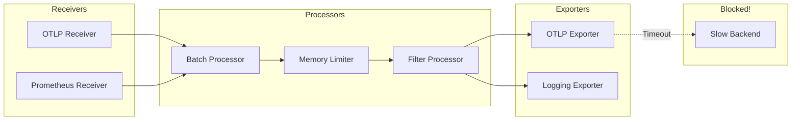
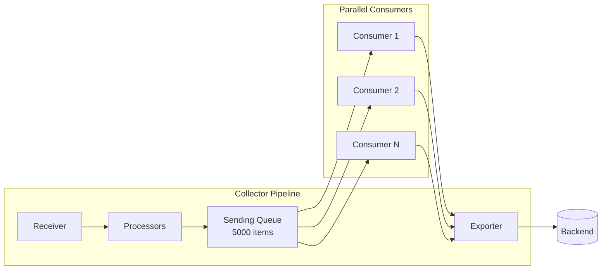
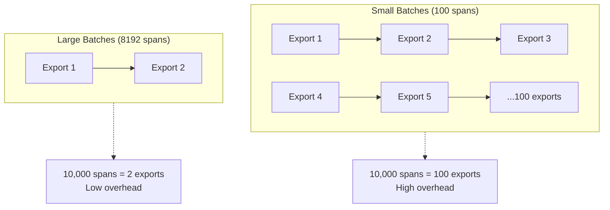
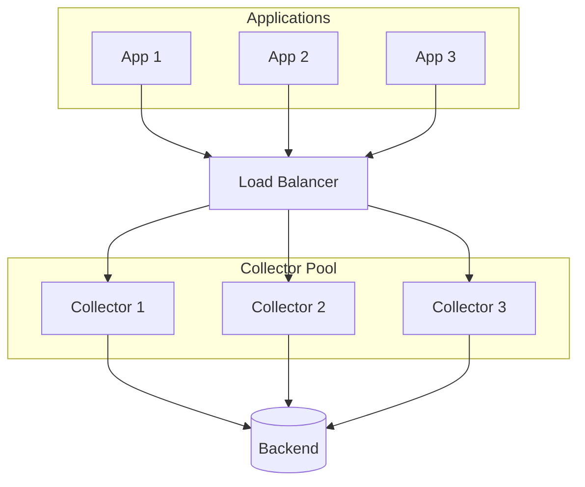

# How to Fix "Collector Pipeline Blocked" Errors

Author: [nawazdhandala](https://www.github.com/nawazdhandala)

Tags: OpenTelemetry, Collector, Pipeline, Debugging, Performance, Observability

Description: Learn how to diagnose and fix OpenTelemetry Collector pipeline blocked errors that cause telemetry data loss.

---

The OpenTelemetry Collector pipeline blocked error occurs when data cannot flow through the collector fast enough, causing backpressure that eventually leads to data loss. This guide will help you understand why this happens and how to fix it.

## Understanding the Collector Pipeline

The OpenTelemetry Collector processes telemetry through a pipeline of receivers, processors, and exporters.



## Common Causes of Pipeline Blocked Errors

### 1. Slow or Unavailable Backend

The most common cause is an exporter unable to send data fast enough.

```yaml
# Problematic configuration - no retry or queue
exporters:
  otlp:
    endpoint: "slow-backend:4317"
    # No timeout configured
    # No retry configured
    # No sending queue
```

### 2. Insufficient Batch Processing

Not batching data efficiently increases the number of export operations.

```yaml
# Inefficient batching
processors:
  batch:
    send_batch_size: 100  # Too small
    timeout: 1s           # Too frequent
```

### 3. Memory Limiter Triggering Too Aggressively

```yaml
# Too aggressive memory limiting
processors:
  memory_limiter:
    check_interval: 100ms  # Checking too frequently
    limit_mib: 100         # Limit too low for workload
    spike_limit_mib: 20    # Spike limit too restrictive
```

## Diagnosing Pipeline Blocked Errors

### Step 1: Check Collector Metrics

The collector exposes metrics that indicate pipeline health.

```bash
# Query collector metrics endpoint
curl http://localhost:8888/metrics | grep -E "otelcol_exporter|otelcol_processor|otelcol_receiver"
```

Key metrics to watch:

```prometheus
# Spans received by the receiver
otelcol_receiver_accepted_spans{receiver="otlp"}

# Spans sent by the exporter
otelcol_exporter_sent_spans{exporter="otlp"}

# Failed export attempts
otelcol_exporter_send_failed_spans{exporter="otlp"}

# Queue size (if using queued retry)
otelcol_exporter_queue_size{exporter="otlp"}

# Queue capacity
otelcol_exporter_queue_capacity{exporter="otlp"}
```

### Step 2: Enable Debug Logging

```yaml
service:
  telemetry:
    logs:
      level: debug
    metrics:
      address: 0.0.0.0:8888
```

Look for messages like:

```
Dropping data because sending_queue is full
Exporter is not ready to send: context deadline exceeded
Pipeline blocked: batch processor queue is full
```

### Step 3: Check Resource Usage

```bash
# Monitor collector resource usage
docker stats otel-collector

# Or for Kubernetes
kubectl top pod otel-collector-0
```

## Fixing Pipeline Blocked Errors

### Solution 1: Configure Sending Queue

Add a sending queue to buffer data when the backend is slow.

```yaml
exporters:
  otlp:
    endpoint: "backend:4317"
    # Configure sending queue
    sending_queue:
      enabled: true
      num_consumers: 10      # Parallel export workers
      queue_size: 5000       # Buffer up to 5000 batches
    # Configure retry
    retry_on_failure:
      enabled: true
      initial_interval: 5s
      max_interval: 30s
      max_elapsed_time: 300s
```



### Solution 2: Optimize Batch Processing

Configure batching to reduce export frequency while maintaining reasonable latency.

```yaml
processors:
  batch:
    # Increase batch size for better throughput
    send_batch_size: 8192
    send_batch_max_size: 10000
    # Increase timeout to allow larger batches
    timeout: 10s
```

Compare batch configurations:



### Solution 3: Configure Memory Limiter Appropriately

The memory limiter should protect against OOM but not trigger during normal operation.

```yaml
processors:
  memory_limiter:
    # Check every second instead of milliseconds
    check_interval: 1s
    # Set limit based on container/pod memory
    # If container has 2GB, set to ~80%
    limit_mib: 1600
    # Allow spikes up to 90%
    spike_limit_mib: 1800
    # Configure what happens when limit is reached
    limit_percentage: 80
    spike_limit_percentage: 90
```

### Solution 4: Add Timeout Configuration

Prevent slow backends from blocking the pipeline indefinitely.

```yaml
exporters:
  otlp:
    endpoint: "backend:4317"
    # Set reasonable timeouts
    timeout: 30s
    # TLS configuration with timeouts
    tls:
      insecure: false
      cert_file: /certs/client.crt
      key_file: /certs/client.key
    # Compression to reduce payload size
    compression: gzip
```

### Solution 5: Implement Load Shedding

When under extreme load, drop lower priority data to protect the pipeline.

```yaml
processors:
  # Filter out low-priority spans when under pressure
  filter/load_shed:
    error_mode: ignore
    traces:
      span:
        # Drop debug spans first
        - 'attributes["priority"] == "debug"'
        # Drop health checks
        - 'name == "health_check"'
        - 'name == "readiness_probe"'

  # Probabilistic sampling as a last resort
  probabilistic_sampler:
    sampling_percentage: 50

service:
  pipelines:
    traces:
      receivers: [otlp]
      processors: [memory_limiter, filter/load_shed, batch]
      exporters: [otlp]
```

## Complete Optimized Configuration

Here is a complete collector configuration optimized for high throughput:

```yaml
# otel-collector-optimized.yaml
receivers:
  otlp:
    protocols:
      grpc:
        endpoint: 0.0.0.0:4317
        # Increase max message size for large payloads
        max_recv_msg_size_mib: 16
      http:
        endpoint: 0.0.0.0:4318

processors:
  # Memory limiter should be first processor
  memory_limiter:
    check_interval: 1s
    limit_mib: 1600
    spike_limit_mib: 1800

  # Batch for efficiency
  batch:
    send_batch_size: 8192
    send_batch_max_size: 10000
    timeout: 10s

  # Resource detection for context
  resourcedetection:
    detectors: [env, system]
    timeout: 5s

exporters:
  otlp:
    endpoint: "backend:4317"
    compression: gzip
    timeout: 30s
    sending_queue:
      enabled: true
      num_consumers: 10
      queue_size: 5000
    retry_on_failure:
      enabled: true
      initial_interval: 5s
      max_interval: 30s
      max_elapsed_time: 300s

extensions:
  # Health check for orchestrator
  health_check:
    endpoint: 0.0.0.0:13133

  # Performance profiling
  pprof:
    endpoint: 0.0.0.0:1777

  # Prometheus metrics
  zpages:
    endpoint: 0.0.0.0:55679

service:
  extensions: [health_check, pprof, zpages]

  telemetry:
    logs:
      level: info
    metrics:
      address: 0.0.0.0:8888

  pipelines:
    traces:
      receivers: [otlp]
      processors: [memory_limiter, resourcedetection, batch]
      exporters: [otlp]

    metrics:
      receivers: [otlp]
      processors: [memory_limiter, batch]
      exporters: [otlp]

    logs:
      receivers: [otlp]
      processors: [memory_limiter, batch]
      exporters: [otlp]
```

## Scaling the Collector

### Horizontal Scaling with Load Balancing



### Kubernetes Deployment with HPA

```yaml
# collector-deployment.yaml
apiVersion: apps/v1
kind: Deployment
metadata:
  name: otel-collector
spec:
  replicas: 3
  selector:
    matchLabels:
      app: otel-collector
  template:
    metadata:
      labels:
        app: otel-collector
    spec:
      containers:
        - name: collector
          image: otel/opentelemetry-collector-contrib:latest
          resources:
            requests:
              memory: "1Gi"
              cpu: "500m"
            limits:
              memory: "2Gi"
              cpu: "1000m"
          ports:
            - containerPort: 4317
              name: otlp-grpc
            - containerPort: 4318
              name: otlp-http
            - containerPort: 8888
              name: metrics
          volumeMounts:
            - name: config
              mountPath: /etc/otelcol
      volumes:
        - name: config
          configMap:
            name: otel-collector-config
---
# Horizontal Pod Autoscaler
apiVersion: autoscaling/v2
kind: HorizontalPodAutoscaler
metadata:
  name: otel-collector-hpa
spec:
  scaleTargetRef:
    apiVersion: apps/v1
    kind: Deployment
    name: otel-collector
  minReplicas: 3
  maxReplicas: 10
  metrics:
    - type: Resource
      resource:
        name: cpu
        target:
          type: Utilization
          averageUtilization: 70
    - type: Resource
      resource:
        name: memory
        target:
          type: Utilization
          averageUtilization: 80
```

## Monitoring Pipeline Health

Create alerts for pipeline issues:

```yaml
# prometheus-alerts.yaml
groups:
  - name: otel-collector
    rules:
      - alert: CollectorQueueNearFull
        expr: |
          otelcol_exporter_queue_size / otelcol_exporter_queue_capacity > 0.8
        for: 5m
        labels:
          severity: warning
        annotations:
          summary: "Collector export queue is nearly full"
          description: "Queue is at {{ $value | humanizePercentage }} capacity"

      - alert: CollectorDroppingData
        expr: |
          rate(otelcol_exporter_send_failed_spans[5m]) > 0
        for: 2m
        labels:
          severity: critical
        annotations:
          summary: "Collector is dropping spans"
          description: "{{ $value }} spans/sec being dropped"

      - alert: CollectorHighMemory
        expr: |
          process_resident_memory_bytes{job="otel-collector"} / 1024 / 1024 > 1500
        for: 5m
        labels:
          severity: warning
        annotations:
          summary: "Collector memory usage is high"
          description: "Memory at {{ $value }}MB"
```

## Troubleshooting Checklist

When you encounter pipeline blocked errors, follow this checklist:

1. **Check exporter connectivity**
   - Can the collector reach the backend?
   - Is TLS configured correctly?
   - Are there network issues or firewalls?

2. **Review queue metrics**
   - Is the sending queue full?
   - Are consumers keeping up with incoming data?

3. **Analyze batch settings**
   - Is batch size appropriate for your workload?
   - Is timeout too short?

4. **Monitor resources**
   - Is the collector CPU-bound?
   - Is memory usage near limits?

5. **Check backend health**
   - Is the backend accepting connections?
   - Is the backend under heavy load?

6. **Review sampling configuration**
   - Are you sending more data than necessary?
   - Can you sample or filter some data?

## Conclusion

Pipeline blocked errors in the OpenTelemetry Collector indicate that data is arriving faster than it can be processed or exported. By configuring appropriate sending queues, optimizing batch processing, setting proper timeouts, and scaling the collector horizontally, you can build a robust telemetry pipeline that handles high volumes of data without loss. Remember to monitor pipeline metrics and set up alerts to catch issues before they result in data loss.
