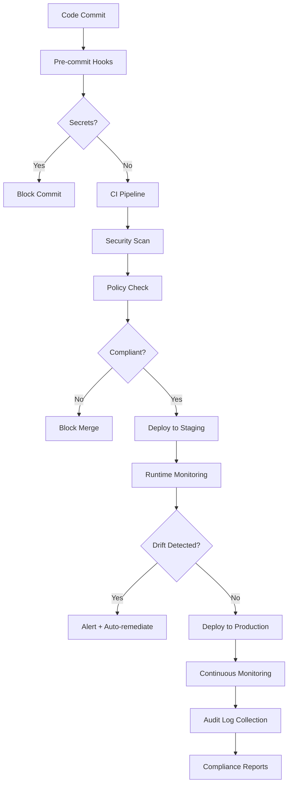

# How to Fix "Compliance" Automation Issues

Author: [nawazdhandala](https://www.github.com/nawazdhandala)

Tags: Compliance, Automation, Security, DevSecOps, Policy as Code, Kubernetes

Description: Learn how to fix compliance automation issues including policy enforcement, audit logging, automated scanning, and continuous compliance monitoring in cloud infrastructure.

---

Compliance automation turns manual checklists into automated checks that run continuously. When done right, it catches violations before they reach production and generates audit evidence automatically. When done wrong, it either blocks legitimate work or misses real violations. This guide covers practical approaches to making compliance automation actually work.

## Why Compliance Automation Fails

Common reasons compliance automation breaks down:

- **Too strict** - Policies block legitimate use cases, so teams find workarounds
- **Too lenient** - Policies miss real violations
- **No context** - Same rules applied everywhere regardless of risk
- **Poor feedback** - Developers do not understand why something failed
- **Stale policies** - Rules do not keep up with changing requirements

## Policy as Code Foundation

Define compliance policies in code so they can be versioned, tested, and reviewed.

Open Policy Agent (OPA) with Gatekeeper is the standard for Kubernetes policy enforcement.

```yaml
# constraint-template.yaml
apiVersion: templates.gatekeeper.sh/v1
kind: ConstraintTemplate
metadata:
  name: k8srequiredlabels
spec:
  crd:
    spec:
      names:
        kind: K8sRequiredLabels
      validation:
        openAPIV3Schema:
          type: object
          properties:
            labels:
              type: array
              items:
                type: string
  targets:
    - target: admission.k8s.gatekeeper.sh
      rego: |
        package k8srequiredlabels

        violation[{"msg": msg}] {
          provided := {label | input.review.object.metadata.labels[label]}
          required := {label | label := input.parameters.labels[_]}
          missing := required - provided
          count(missing) > 0
          msg := sprintf("Missing required labels: %v", [missing])
        }
```

Apply the constraint to enforce the policy.

```yaml
# require-labels-constraint.yaml
apiVersion: constraints.gatekeeper.sh/v1beta1
kind: K8sRequiredLabels
metadata:
  name: require-team-label
spec:
  match:
    kinds:
      - apiGroups: [""]
        kinds: ["Pod"]
      - apiGroups: ["apps"]
        kinds: ["Deployment", "StatefulSet"]
  parameters:
    labels:
      - team
      - environment
      - app
```

## Fixing Common Policy Violations

When policies block deployments, developers need clear guidance on how to fix them.

Create a policy documentation system that explains each policy and shows how to comply.

```yaml
# policy-docs/required-labels.yaml
policy:
  name: require-team-label
  id: SEC-001
  severity: high
  description: |
    All workloads must have team, environment, and app labels for
    cost allocation, access control, and incident response.

why_it_matters: |
  - Team labels enable cost chargeback to the correct team
  - Environment labels prevent accidental production changes
  - App labels are required for monitoring and alerting

how_to_fix: |
  Add the required labels to your deployment metadata:

  ```yaml
  metadata:
    labels:
      team: platform       # Your team name
      environment: prod    # dev, staging, or prod
      app: api-server     # Application name
  ```

exceptions: |
  System namespaces (kube-system, monitoring) are exempt.
  Request exception via JIRA ticket with business justification.

references:
  - https://wiki.company.com/labeling-standards
  - https://wiki.company.com/cost-allocation
```

## Automated Security Scanning

Integrate security scanning into the CI/CD pipeline to catch issues early.

```yaml
# .github/workflows/security-scan.yml
name: Security Scan

on:
  pull_request:
    branches: [main]
  push:
    branches: [main]

jobs:
  container-scan:
    runs-on: ubuntu-latest
    steps:
      - uses: actions/checkout@v4

      - name: Build image
        run: docker build -t app:${{ github.sha }} .

      - name: Run Trivy vulnerability scanner
        uses: aquasecurity/trivy-action@master
        with:
          image-ref: app:${{ github.sha }}
          format: 'sarif'
          output: 'trivy-results.sarif'
          severity: 'CRITICAL,HIGH'
          exit-code: '1'  # Fail on critical/high vulnerabilities

      - name: Upload scan results
        uses: github/codeql-action/upload-sarif@v2
        if: always()
        with:
          sarif_file: 'trivy-results.sarif'

  infrastructure-scan:
    runs-on: ubuntu-latest
    steps:
      - uses: actions/checkout@v4

      - name: Run Checkov
        uses: bridgecrewio/checkov-action@master
        with:
          directory: ./terraform
          framework: terraform
          output_format: sarif
          output_file_path: checkov-results.sarif
          soft_fail: false

      - name: Upload scan results
        uses: github/codeql-action/upload-sarif@v2
        if: always()
        with:
          sarif_file: 'checkov-results.sarif'

  secrets-scan:
    runs-on: ubuntu-latest
    steps:
      - uses: actions/checkout@v4
        with:
          fetch-depth: 0

      - name: Detect secrets
        uses: gitleaks/gitleaks-action@v2
        env:
          GITHUB_TOKEN: ${{ secrets.GITHUB_TOKEN }}
```

## Runtime Compliance Monitoring

Scanning at build time is not enough. Monitor runtime for compliance drift.

```yaml
# falco-rules.yaml
- rule: Unauthorized Process in Container
  desc: Detect when a process not in the allowed list runs in container
  condition: >
    spawned_process and container and
    container.image.repository = "company/api-server" and
    not proc.name in (node, npm, sh)
  output: >
    Unauthorized process started in container
    (user=%user.name command=%proc.cmdline container=%container.name image=%container.image.repository)
  priority: WARNING
  tags: [compliance, process]

- rule: Write to Sensitive Directory
  desc: Detect writes to sensitive directories
  condition: >
    open_write and container and
    fd.name startswith /etc/
  output: >
    Write to sensitive directory
    (user=%user.name file=%fd.name container=%container.name)
  priority: ERROR
  tags: [compliance, filesystem]

- rule: Outbound Connection to Unknown Host
  desc: Detect connections to non-whitelisted destinations
  condition: >
    outbound and container and
    not fd.sip in (allowed_egress_ips)
  output: >
    Outbound connection to unknown host
    (container=%container.name dest=%fd.sip:%fd.sport)
  priority: WARNING
  tags: [compliance, network]
```

## Audit Logging

Compliance requires audit trails. Configure comprehensive logging that captures who did what and when.

```yaml
# audit-policy.yaml
apiVersion: audit.k8s.io/v1
kind: Policy
rules:
  # Log all changes to secrets at metadata level
  - level: Metadata
    resources:
      - group: ""
        resources: ["secrets"]
    verbs: ["create", "update", "patch", "delete"]

  # Log all changes to RBAC at request level
  - level: Request
    resources:
      - group: "rbac.authorization.k8s.io"
        resources: ["clusterroles", "clusterrolebindings", "roles", "rolebindings"]

  # Log all pod exec/attach at request+response level
  - level: RequestResponse
    resources:
      - group: ""
        resources: ["pods/exec", "pods/attach", "pods/portforward"]

  # Log authentication at metadata level
  - level: Metadata
    users: ["system:anonymous"]
    verbs: ["get", "list", "watch"]

  # Skip logging read-only requests to common endpoints
  - level: None
    resources:
      - group: ""
        resources: ["events"]
    verbs: ["get", "list", "watch"]
```

Send audit logs to a secure, tamper-evident store.

```yaml
# fluent-bit-audit.yaml
apiVersion: v1
kind: ConfigMap
metadata:
  name: fluent-bit-config
  namespace: logging
data:
  fluent-bit.conf: |
    [SERVICE]
        Flush         5
        Log_Level     info
        Parsers_File  parsers.conf

    [INPUT]
        Name              tail
        Path              /var/log/kubernetes/audit/*.log
        Parser            json
        Tag               audit.*
        Refresh_Interval  10
        Mem_Buf_Limit     50MB

    [FILTER]
        Name    modify
        Match   audit.*
        Add     cluster production
        Add     log_type audit

    [OUTPUT]
        Name            s3
        Match           audit.*
        bucket          company-audit-logs
        region          us-west-2
        total_file_size 100M
        upload_timeout  10m
        s3_key_format   /audit/%Y/%m/%d/$TAG[1].%H%M%S.log
```

## Compliance Reporting

Generate compliance reports automatically for auditors.

```python
# compliance_report.py
import json
from datetime import datetime, timedelta
from typing import List, Dict

class ComplianceReporter:
    def __init__(self, policy_engine, audit_log_store, scanner_results):
        self.policy_engine = policy_engine
        self.audit_logs = audit_log_store
        self.scanner = scanner_results

    def generate_report(self, start_date: datetime, end_date: datetime) -> Dict:
        """Generate a compliance report for the specified period."""
        report = {
            'period': {
                'start': start_date.isoformat(),
                'end': end_date.isoformat()
            },
            'generated_at': datetime.utcnow().isoformat(),
            'summary': {},
            'policy_violations': [],
            'security_findings': [],
            'access_audit': [],
            'recommendations': []
        }

        # Collect policy violations
        violations = self.policy_engine.get_violations(start_date, end_date)
        report['policy_violations'] = [
            {
                'policy_id': v.policy_id,
                'resource': v.resource,
                'timestamp': v.timestamp.isoformat(),
                'severity': v.severity,
                'remediation_status': v.remediation_status
            }
            for v in violations
        ]

        # Collect security scan findings
        findings = self.scanner.get_findings(start_date, end_date)
        report['security_findings'] = [
            {
                'finding_id': f.id,
                'type': f.type,
                'severity': f.severity,
                'affected_resource': f.resource,
                'status': f.status
            }
            for f in findings
        ]

        # Collect privileged access events
        access_events = self.audit_logs.query(
            start_time=start_date,
            end_time=end_date,
            event_types=['pod/exec', 'secret/read', 'rbac/modify']
        )
        report['access_audit'] = [
            {
                'timestamp': e.timestamp.isoformat(),
                'user': e.user,
                'action': e.action,
                'resource': e.resource,
                'approved': e.approved
            }
            for e in access_events
        ]

        # Generate summary
        report['summary'] = {
            'total_violations': len(report['policy_violations']),
            'critical_findings': len([f for f in report['security_findings'] if f['severity'] == 'critical']),
            'privileged_access_events': len(report['access_audit']),
            'compliance_score': self._calculate_score(report)
        }

        return report

    def _calculate_score(self, report: Dict) -> float:
        """Calculate a compliance score from 0-100."""
        # Weight factors
        violation_weight = 0.4
        finding_weight = 0.4
        access_weight = 0.2

        # Calculate violation score
        if report['policy_violations']:
            violation_score = max(0, 100 - (len(report['policy_violations']) * 5))
        else:
            violation_score = 100

        # Calculate finding score
        critical = len([f for f in report['security_findings'] if f['severity'] == 'critical'])
        high = len([f for f in report['security_findings'] if f['severity'] == 'high'])
        finding_score = max(0, 100 - (critical * 20) - (high * 10))

        # Calculate access score
        unapproved = len([a for a in report['access_audit'] if not a['approved']])
        access_score = max(0, 100 - (unapproved * 10))

        return (
            violation_score * violation_weight +
            finding_score * finding_weight +
            access_score * access_weight
        )
```

## Compliance Workflow Architecture

The flow of compliance checks from development to production looks like this.



## Handling Exceptions

Not every workload can meet every policy. Build an exception process that maintains security while allowing legitimate use cases.

```yaml
# exception-request.yaml
apiVersion: compliance.company.io/v1
kind: PolicyException
metadata:
  name: legacy-app-privileged-exception
  namespace: legacy-system
spec:
  policy: disallow-privileged-containers
  resource:
    kind: Deployment
    name: legacy-app

  justification: |
    Legacy application requires host network access for service discovery.
    Modernization planned for Q3 2026.

  risk_assessment:
    level: medium
    mitigations:
      - Network policies restrict egress to specific IPs
      - Read-only root filesystem enabled
      - No capabilities beyond NET_ADMIN

  approval:
    approver: security-team@company.com
    approved_date: "2026-01-15"
    expiration: "2026-07-15"  # 6-month exception

  review_schedule: monthly
  owner: platform-team@company.com
```

Automatically expire and review exceptions.

```python
# exception_manager.py
from datetime import datetime, timedelta

def review_exceptions():
    """Review all active exceptions and alert on upcoming expirations."""
    exceptions = get_active_exceptions()

    for exc in exceptions:
        days_until_expiry = (exc.expiration - datetime.utcnow()).days

        if days_until_expiry <= 0:
            # Exception expired, enforce policy
            revoke_exception(exc)
            notify_owner(exc, "Exception expired and policy is now enforced")

        elif days_until_expiry <= 14:
            # Warn about upcoming expiration
            notify_owner(exc, f"Exception expires in {days_until_expiry} days")

        # Check if review is due
        if exc.needs_review():
            schedule_review(exc)
            notify_owner(exc, "Monthly review required")
```

## Best Practices

1. **Start permissive, then tighten** - Blocking everything from day one causes workarounds
2. **Provide clear feedback** - Developers need to know why something failed and how to fix it
3. **Automate remediation** - Where possible, fix issues automatically
4. **Version policies** - Treat policies like code with reviews and testing
5. **Allow exceptions** - Build a process for legitimate exceptions with expiration
6. **Monitor continuously** - Point-in-time scans miss drift

## Troubleshooting Checklist

When compliance automation is not working as expected, check these common issues.

- [ ] Are policies being applied to the right resources?
- [ ] Are error messages clear enough for developers to fix issues?
- [ ] Are exceptions documented and tracked?
- [ ] Is the policy engine healthy and processing requests?
- [ ] Are audit logs being collected and stored correctly?
- [ ] Are alerts reaching the right people?
- [ ] Is there a process for updating policies?

---

Compliance automation should make security easier, not harder. Start with the highest-risk policies, provide clear guidance for developers, and continuously improve based on feedback. The goal is not to block everything but to catch real risks while enabling teams to move fast safely.
