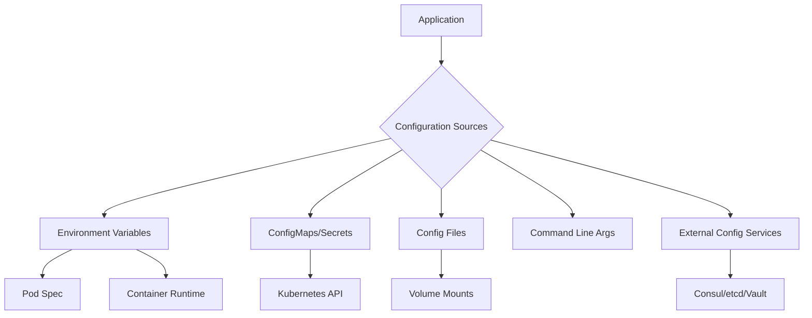
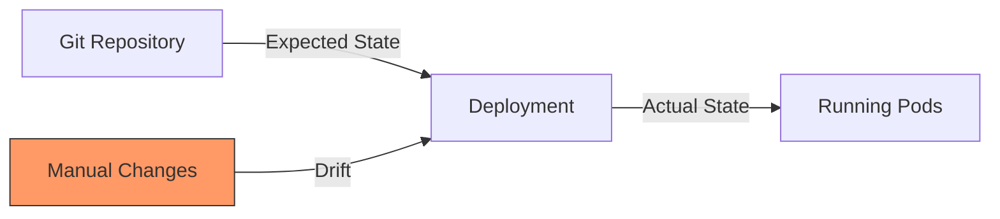

# How to Fix "Configuration Management" Issues

Author: [nawazdhandala](https://www.github.com/nawazdhandala)

Tags: Configuration Management, DevOps, Kubernetes, ConfigMaps, Environment Variables, Best Practices

Description: A practical guide to diagnosing and fixing common configuration management issues in cloud-native applications, including environment variables, ConfigMaps, and configuration drift.

---

Configuration management issues are among the most common causes of application failures in production. A mistyped environment variable, a missing ConfigMap, or configuration drift between environments can bring down services. This guide covers how to identify, debug, and fix the most frequent configuration problems.

## Understanding Configuration Sources

Modern applications pull configuration from multiple sources. Understanding this hierarchy helps you debug where problems originate.



## Fixing Missing Environment Variables

When your application fails because an expected environment variable is not set, you will typically see errors like "undefined variable" or "configuration key not found."

First, check what environment variables are actually available in your container:

```bash
# Check environment variables in a running pod
kubectl exec -it myapp-pod -- env | sort

# If the pod is crashing, use a debug container
kubectl debug myapp-pod -it --image=busybox -- env | sort

# Check what the deployment defines
kubectl get deployment myapp -o jsonpath='{.spec.template.spec.containers[0].env}' | jq
```

Common causes and fixes for missing environment variables:

```yaml
# Problem: Variable defined but not passed to container
# Before - env defined at wrong level
apiVersion: apps/v1
kind: Deployment
metadata:
  name: myapp
spec:
  template:
    spec:
      containers:
        - name: myapp
          image: myapp:latest
          # Missing env section entirely

# After - properly defined environment variables
apiVersion: apps/v1
kind: Deployment
metadata:
  name: myapp
spec:
  template:
    spec:
      containers:
        - name: myapp
          image: myapp:latest
          env:
            # Direct value
            - name: LOG_LEVEL
              value: "info"
            # From ConfigMap
            - name: DATABASE_HOST
              valueFrom:
                configMapKeyRef:
                  name: myapp-config
                  key: database.host
            # From Secret
            - name: DATABASE_PASSWORD
              valueFrom:
                secretKeyRef:
                  name: myapp-secrets
                  key: db-password
```

## Fixing ConfigMap Issues

ConfigMaps are a common source of configuration problems. Here are the most frequent issues and their solutions.

### ConfigMap Not Found

```bash
# Check if ConfigMap exists
kubectl get configmap myapp-config -n myapp

# If missing, the pod events will show the error
kubectl describe pod myapp-pod | grep -A5 Events

# Create the missing ConfigMap
kubectl create configmap myapp-config \
  --from-literal=database.host=postgres.db.svc \
  --from-literal=cache.host=redis.cache.svc
```

### ConfigMap Key Not Found

```bash
# List all keys in a ConfigMap
kubectl get configmap myapp-config -o jsonpath='{.data}' | jq 'keys'

# Check the exact key name (watch for typos)
kubectl get configmap myapp-config -o yaml
```

Fix the key reference in your deployment:

```yaml
# Problem: Key name mismatch
env:
  - name: DATABASE_HOST
    valueFrom:
      configMapKeyRef:
        name: myapp-config
        key: database_host  # Wrong: uses underscore

# Fix: Use the correct key name
env:
  - name: DATABASE_HOST
    valueFrom:
      configMapKeyRef:
        name: myapp-config
        key: database.host  # Correct: uses dot
```

### ConfigMap Updates Not Reflected

By default, environment variables from ConfigMaps are not updated when the ConfigMap changes. Pods must be restarted.

```bash
# Force a rolling restart to pick up ConfigMap changes
kubectl rollout restart deployment myapp

# Or use a hash annotation to trigger updates automatically
```

For automatic updates, add a ConfigMap hash to your deployment:

```yaml
apiVersion: apps/v1
kind: Deployment
metadata:
  name: myapp
spec:
  template:
    metadata:
      annotations:
        # This hash changes when ConfigMap changes
        checksum/config: {{ include (print $.Template.BasePath "/configmap.yaml") . | sha256sum }}
    spec:
      containers:
        - name: myapp
          envFrom:
            - configMapRef:
                name: myapp-config
```

## Fixing Configuration Drift

Configuration drift occurs when your running configuration differs from what is defined in your source of truth. This causes inconsistent behavior across environments.



### Detecting Drift

Use tools to compare actual versus expected state:

```bash
# Compare deployed resources against Git
kubectl diff -f deployment.yaml

# Use ArgoCD to detect drift
argocd app diff myapp

# Script to check for drift
#!/bin/bash
for file in k8s/*.yaml; do
  echo "Checking $file..."
  kubectl diff -f "$file" 2>&1 | head -20
done
```

### Preventing Drift

Implement policies that prevent manual changes:

```yaml
# Kubernetes ValidatingWebhookConfiguration to block direct changes
apiVersion: admissionregistration.k8s.io/v1
kind: ValidatingWebhookConfiguration
metadata:
  name: prevent-direct-changes
webhooks:
  - name: gitops-only.example.com
    rules:
      - operations: ["CREATE", "UPDATE", "DELETE"]
        apiGroups: ["apps"]
        apiVersions: ["v1"]
        resources: ["deployments"]
    clientConfig:
      service:
        name: admission-webhook
        namespace: kube-system
        path: "/validate"
```

## Fixing Environment-Specific Configuration

Managing configuration across environments is challenging. Use Kustomize overlays to handle differences cleanly.

```bash
# Directory structure for environment-specific config
config/
├── base/
│   ├── kustomization.yaml
│   ├── deployment.yaml
│   └── configmap.yaml
└── overlays/
    ├── development/
    │   ├── kustomization.yaml
    │   └── config-patch.yaml
    ├── staging/
    │   ├── kustomization.yaml
    │   └── config-patch.yaml
    └── production/
        ├── kustomization.yaml
        └── config-patch.yaml
```

Base configuration:

```yaml
# base/configmap.yaml
apiVersion: v1
kind: ConfigMap
metadata:
  name: myapp-config
data:
  LOG_LEVEL: "info"
  CACHE_TTL: "300"
  # Placeholder for environment-specific values
  DATABASE_HOST: "REPLACE_ME"
```

Production overlay:

```yaml
# overlays/production/kustomization.yaml
apiVersion: kustomize.config.k8s.io/v1beta1
kind: Kustomization
resources:
  - ../../base
patches:
  - path: config-patch.yaml
    target:
      kind: ConfigMap
      name: myapp-config

# overlays/production/config-patch.yaml
apiVersion: v1
kind: ConfigMap
metadata:
  name: myapp-config
data:
  LOG_LEVEL: "warn"
  DATABASE_HOST: "prod-postgres.database.svc"
  CACHE_TTL: "3600"
```

Build and apply the configuration:

```bash
# Preview the final configuration
kustomize build overlays/production

# Apply to cluster
kubectl apply -k overlays/production
```

## Fixing Configuration File Issues

When mounting configuration files, common issues include wrong paths and permission problems.

```yaml
# Problem: Config file not found at expected path
apiVersion: apps/v1
kind: Deployment
spec:
  template:
    spec:
      containers:
        - name: myapp
          volumeMounts:
            - name: config
              mountPath: /etc/myapp/config.yaml  # Mounts directory, not file

# Fix: Mount as subPath for single file
      containers:
        - name: myapp
          volumeMounts:
            - name: config
              mountPath: /etc/myapp/config.yaml
              subPath: config.yaml  # Now mounts just the file
      volumes:
        - name: config
          configMap:
            name: myapp-config
            items:
              - key: config.yaml
                path: config.yaml
```

### Debugging File Mount Issues

```bash
# Check if the volume is mounted correctly
kubectl exec myapp-pod -- ls -la /etc/myapp/

# Check file contents
kubectl exec myapp-pod -- cat /etc/myapp/config.yaml

# Check file permissions
kubectl exec myapp-pod -- stat /etc/myapp/config.yaml
```

## Implementing Configuration Validation

Catch configuration errors before deployment with validation:

```python
# config_validator.py
import yaml
import sys
from jsonschema import validate, ValidationError

# Define your configuration schema
CONFIG_SCHEMA = {
    "type": "object",
    "required": ["database", "cache", "logging"],
    "properties": {
        "database": {
            "type": "object",
            "required": ["host", "port"],
            "properties": {
                "host": {"type": "string"},
                "port": {"type": "integer", "minimum": 1, "maximum": 65535}
            }
        },
        "cache": {
            "type": "object",
            "required": ["host"],
            "properties": {
                "host": {"type": "string"},
                "ttl": {"type": "integer", "minimum": 0}
            }
        },
        "logging": {
            "type": "object",
            "properties": {
                "level": {"enum": ["debug", "info", "warn", "error"]}
            }
        }
    }
}

def validate_config(config_path):
    """Validate configuration file against schema."""
    with open(config_path) as f:
        config = yaml.safe_load(f)

    try:
        validate(instance=config, schema=CONFIG_SCHEMA)
        print(f"Configuration valid: {config_path}")
        return True
    except ValidationError as e:
        print(f"Configuration invalid: {e.message}")
        print(f"Path: {' -> '.join(str(p) for p in e.path)}")
        return False

if __name__ == "__main__":
    config_file = sys.argv[1]
    if not validate_config(config_file):
        sys.exit(1)
```

Add validation to your CI pipeline:

```yaml
# .github/workflows/validate-config.yaml
name: Validate Configuration
on:
  pull_request:
    paths:
      - 'config/**'

jobs:
  validate:
    runs-on: ubuntu-latest
    steps:
      - uses: actions/checkout@v4

      - name: Validate ConfigMaps
        run: |
          for env in development staging production; do
            echo "Validating $env configuration..."
            kustomize build config/overlays/$env > /tmp/manifests.yaml
            python scripts/config_validator.py /tmp/manifests.yaml
          done

      - name: Dry-run against cluster
        run: |
          kubectl apply --dry-run=server -f /tmp/manifests.yaml
```

## Best Practices for Configuration Management

Follow these practices to avoid configuration issues:

**Use a single source of truth** - Store all configuration in version control. Never modify ConfigMaps directly in the cluster.

**Validate early and often** - Add schema validation to your CI pipeline. Catch type errors and missing required fields before deployment.

**Separate secrets from configuration** - Use Kubernetes Secrets or external secret managers for sensitive data. Never store passwords in ConfigMaps.

**Document configuration options** - Maintain documentation for each configuration key, including defaults and valid values:

```yaml
# config-reference.yaml
# Documentation for myapp configuration options
database:
  host:
    description: "PostgreSQL server hostname"
    required: true
    example: "postgres.database.svc"
  port:
    description: "PostgreSQL server port"
    required: false
    default: 5432
  pool_size:
    description: "Maximum database connections"
    required: false
    default: 10
    valid_range: "1-100"
```

Configuration management issues are preventable with the right processes and tools. Implement validation, use GitOps workflows, and maintain clear documentation. When issues do occur, methodically check each configuration source to identify where the problem originates.
