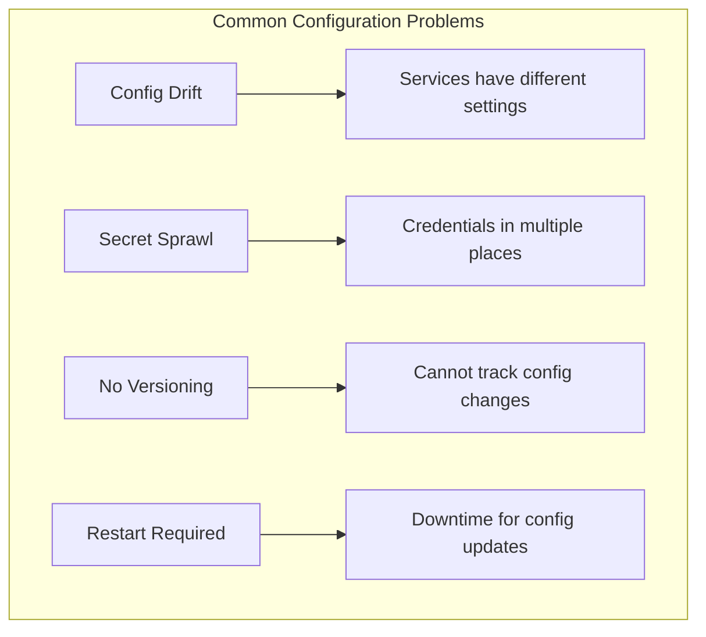
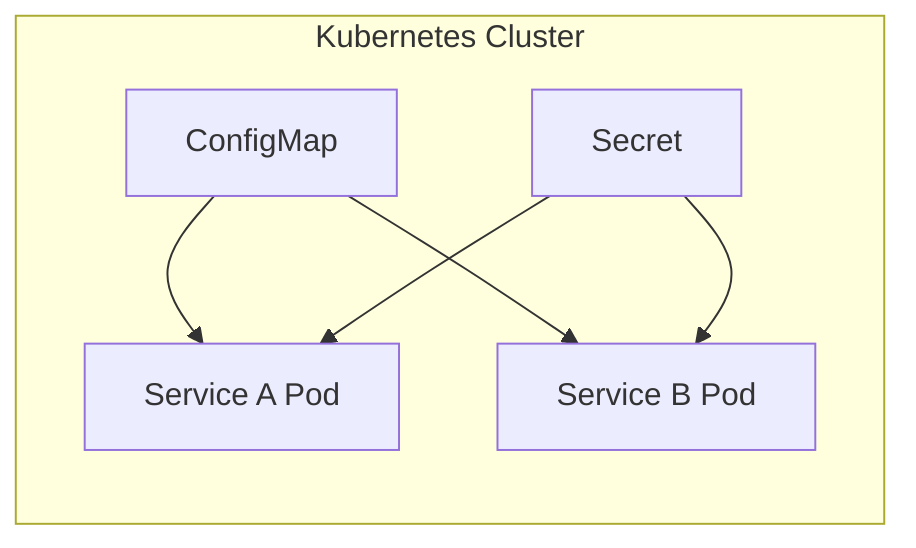
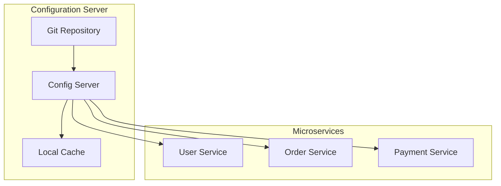
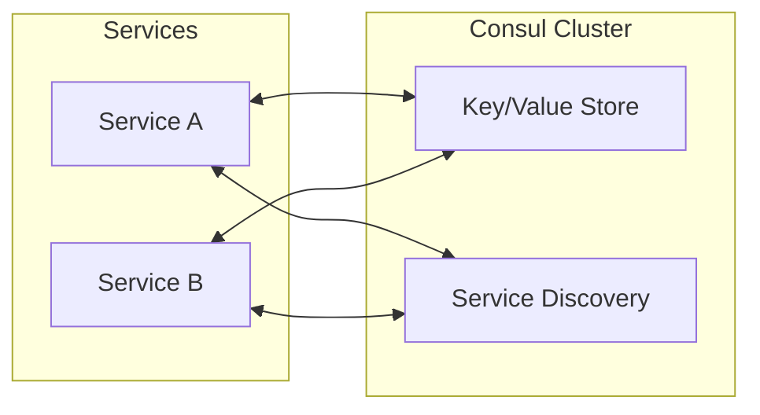
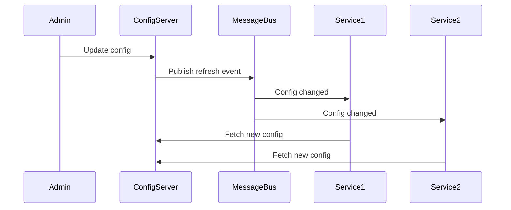
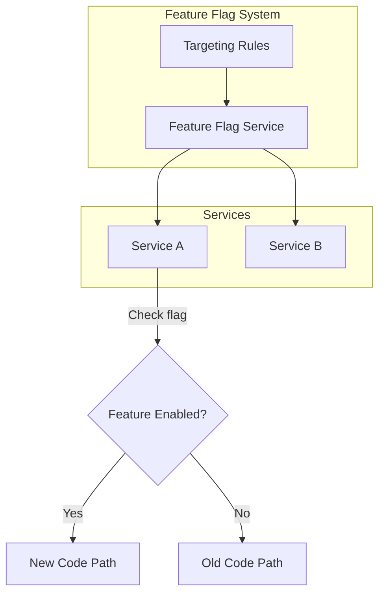
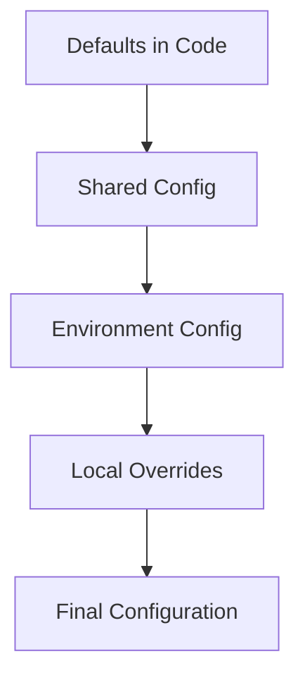

# How to Handle Configuration Management in Microservices

Author: [nawazdhandala](https://www.github.com/nawazdhandala)

Tags: Microservices, Configuration Management, Kubernetes, Spring Cloud Config, Consul, Environment Variables, DevOps

Description: A comprehensive guide to managing configuration across microservices, including centralized config servers, environment-specific overrides, and dynamic configuration updates.

---

> Managing configuration in a monolithic application is straightforward. In microservices, it becomes a complex challenge of consistency, versioning, and dynamic updates across dozens of services. This guide shows you practical patterns for handling configuration at scale.

When you have 50+ microservices, each with its own configuration, managing settings like database URLs, API keys, feature flags, and service endpoints becomes a significant operational challenge.

---

## Configuration Management Challenges



---

## Architecture Patterns

### Pattern 1: Environment Variables with ConfigMaps

The simplest approach uses Kubernetes ConfigMaps and Secrets for environment-based configuration.



**ConfigMap Definition:**

```yaml
# config/base-config.yaml
apiVersion: v1
kind: ConfigMap
metadata:
  name: shared-config
  namespace: production
data:
  # Database settings
  DB_HOST: "postgres.database.svc.cluster.local"
  DB_PORT: "5432"
  DB_NAME: "app_production"

  # Service discovery
  USER_SERVICE_URL: "http://user-service.default.svc.cluster.local:8080"
  ORDER_SERVICE_URL: "http://order-service.default.svc.cluster.local:8080"

  # Feature flags
  FEATURE_NEW_CHECKOUT: "true"
  FEATURE_DARK_MODE: "false"

  # Observability
  LOG_LEVEL: "info"
  TRACING_ENABLED: "true"
  OTLP_ENDPOINT: "http://otel-collector.monitoring:4317"
```

**Secret Definition:**

```yaml
# config/secrets.yaml
apiVersion: v1
kind: Secret
metadata:
  name: app-secrets
  namespace: production
type: Opaque
stringData:
  DB_PASSWORD: "your-secure-password"
  API_KEY: "your-api-key"
  JWT_SECRET: "your-jwt-secret"
```

**Using Configuration in Deployment:**

```yaml
# deployments/user-service.yaml
apiVersion: apps/v1
kind: Deployment
metadata:
  name: user-service
spec:
  replicas: 3
  template:
    spec:
      containers:
      - name: user-service
        image: user-service:v1.2.0
        envFrom:
        # Load all keys from ConfigMap as environment variables
        - configMapRef:
            name: shared-config
        # Load all keys from Secret as environment variables
        - secretRef:
            name: app-secrets
        env:
        # Override specific values for this service
        - name: SERVICE_NAME
          value: "user-service"
        - name: DB_NAME
          value: "users_production"  # Service-specific database
```

---

### Pattern 2: Centralized Configuration Server

For more complex scenarios, use a dedicated configuration server that services query at startup and runtime.



**Spring Cloud Config Server Setup:**

```java
// config-server/src/main/java/ConfigServerApplication.java
package com.example.configserver;

import org.springframework.boot.SpringApplication;
import org.springframework.boot.autoconfigure.SpringBootApplication;
import org.springframework.cloud.config.server.EnableConfigServer;

@SpringBootApplication
@EnableConfigServer
public class ConfigServerApplication {
    public static void main(String[] args) {
        SpringApplication.run(ConfigServerApplication.class, args);
    }
}
```

```yaml
# config-server/src/main/resources/application.yml
server:
  port: 8888

spring:
  cloud:
    config:
      server:
        git:
          uri: https://github.com/your-org/config-repo
          default-label: main
          search-paths:
            - '{application}'
            - shared
          clone-on-start: true
          # Refresh configuration periodically
          refresh-rate: 30

        # Encryption for sensitive values
        encrypt:
          enabled: true

management:
  endpoints:
    web:
      exposure:
        include: health,refresh,bus-refresh
```

**Git Repository Structure:**

```
config-repo/
  application.yml           # Shared defaults for all services
  application-production.yml # Production overrides
  application-staging.yml    # Staging overrides

  user-service/
    application.yml          # User service defaults
    application-production.yml

  order-service/
    application.yml
    application-production.yml

  payment-service/
    application.yml
    application-production.yml
```

**Shared Configuration (application.yml):**

```yaml
# config-repo/application.yml
# Shared settings inherited by all services

logging:
  level:
    root: INFO
    com.example: DEBUG
  pattern:
    console: "%d{yyyy-MM-dd HH:mm:ss} [%thread] %-5level %logger{36} - %msg%n"

management:
  endpoints:
    web:
      exposure:
        include: health,info,metrics,prometheus
  metrics:
    export:
      prometheus:
        enabled: true

resilience4j:
  circuitbreaker:
    configs:
      default:
        slidingWindowSize: 10
        failureRateThreshold: 50
        waitDurationInOpenState: 10s
```

**Service-Specific Configuration:**

```yaml
# config-repo/user-service/application.yml
spring:
  datasource:
    url: jdbc:postgresql://${DB_HOST:localhost}:5432/users
    username: ${DB_USERNAME:postgres}
    password: ${DB_PASSWORD:}
    hikari:
      maximum-pool-size: 20
      minimum-idle: 5

user-service:
  cache:
    ttl-seconds: 300
  validation:
    email-regex: "^[A-Za-z0-9+_.-]+@(.+)$"
    password-min-length: 8
```

**Client Service Configuration:**

```yaml
# user-service/src/main/resources/bootstrap.yml
spring:
  application:
    name: user-service
  cloud:
    config:
      uri: http://config-server:8888
      fail-fast: true
      retry:
        initial-interval: 1000
        max-attempts: 6
        max-interval: 2000
        multiplier: 1.1
```

---

### Pattern 3: HashiCorp Consul for Dynamic Configuration

Consul provides both service discovery and a key-value store for configuration.



**Python Service with Consul Configuration:**

```python
# config/consul_config.py
import consul
import json
import os
from typing import Any, Dict, Optional
from functools import lru_cache
import threading
import time

class ConsulConfigManager:
    """
    Manages configuration from Consul KV store with local caching
    and automatic refresh on changes.
    """

    def __init__(self, service_name: str):
        self.service_name = service_name
        self.consul = consul.Consul(
            host=os.getenv("CONSUL_HOST", "localhost"),
            port=int(os.getenv("CONSUL_PORT", 8500))
        )
        self._config_cache: Dict[str, Any] = {}
        self._watch_index = None
        self._callbacks = []
        self._running = False

    def start(self):
        """Start the configuration manager and begin watching for changes."""
        self._load_all_config()
        self._running = True

        # Start background thread to watch for changes
        watch_thread = threading.Thread(target=self._watch_changes, daemon=True)
        watch_thread.start()

    def stop(self):
        """Stop watching for configuration changes."""
        self._running = False

    def _load_all_config(self):
        """Load all configuration for this service from Consul."""
        # Load shared configuration
        self._load_prefix("config/shared/")

        # Load service-specific configuration (overrides shared)
        self._load_prefix(f"config/{self.service_name}/")

        # Load environment-specific configuration
        env = os.getenv("ENVIRONMENT", "development")
        self._load_prefix(f"config/{self.service_name}/{env}/")

    def _load_prefix(self, prefix: str):
        """Load all keys under a prefix."""
        index, data = self.consul.kv.get(prefix, recurse=True)

        if data:
            for item in data:
                key = item["Key"].replace(prefix, "")
                if item["Value"]:
                    try:
                        # Try to parse as JSON
                        value = json.loads(item["Value"].decode("utf-8"))
                    except json.JSONDecodeError:
                        # Fall back to string value
                        value = item["Value"].decode("utf-8")
                    self._config_cache[key] = value

    def _watch_changes(self):
        """Watch for configuration changes and reload when detected."""
        prefix = f"config/{self.service_name}/"

        while self._running:
            try:
                # Long poll for changes
                index, data = self.consul.kv.get(
                    prefix,
                    recurse=True,
                    index=self._watch_index,
                    wait="30s"
                )

                if index != self._watch_index:
                    self._watch_index = index
                    self._load_all_config()
                    self._notify_callbacks()

            except Exception as e:
                print(f"Error watching config: {e}")
                time.sleep(5)

    def on_change(self, callback):
        """Register a callback to be notified of configuration changes."""
        self._callbacks.append(callback)

    def _notify_callbacks(self):
        """Notify all registered callbacks of configuration change."""
        for callback in self._callbacks:
            try:
                callback(self._config_cache)
            except Exception as e:
                print(f"Error in config callback: {e}")

    def get(self, key: str, default: Any = None) -> Any:
        """Get a configuration value."""
        return self._config_cache.get(key, default)

    def get_int(self, key: str, default: int = 0) -> int:
        """Get a configuration value as integer."""
        value = self.get(key, default)
        return int(value) if value is not None else default

    def get_bool(self, key: str, default: bool = False) -> bool:
        """Get a configuration value as boolean."""
        value = self.get(key, default)
        if isinstance(value, bool):
            return value
        if isinstance(value, str):
            return value.lower() in ("true", "1", "yes")
        return default

    def get_json(self, key: str, default: Dict = None) -> Dict:
        """Get a configuration value as JSON object."""
        value = self.get(key, default)
        if isinstance(value, dict):
            return value
        if isinstance(value, str):
            try:
                return json.loads(value)
            except json.JSONDecodeError:
                return default or {}
        return default or {}


# Usage example
config = ConsulConfigManager("user-service")
config.start()

# Register callback for dynamic updates
def on_config_change(new_config):
    print(f"Configuration updated: {new_config}")
    # Reinitialize connections, update feature flags, etc.

config.on_change(on_config_change)

# Access configuration
db_host = config.get("database.host", "localhost")
cache_ttl = config.get_int("cache.ttl_seconds", 300)
feature_enabled = config.get_bool("features.new_checkout", False)
```

**Setting Configuration in Consul:**

```bash
# Set shared configuration
consul kv put config/shared/database/host "postgres.database.svc.cluster.local"
consul kv put config/shared/database/port "5432"
consul kv put config/shared/logging/level "info"

# Set service-specific configuration
consul kv put config/user-service/database/name "users"
consul kv put config/user-service/cache/ttl_seconds "300"

# Set feature flags as JSON
consul kv put config/user-service/features '{"new_checkout": true, "dark_mode": false}'

# Set environment-specific overrides
consul kv put config/user-service/production/database/host "prod-db.example.com"
consul kv put config/user-service/production/logging/level "warn"
```

---

## Dynamic Configuration Updates

### Hot Reloading Without Restarts



**Python Implementation with Redis Pub/Sub:**

```python
# config/dynamic_config.py
import redis
import json
import threading
from typing import Any, Callable, Dict, List

class DynamicConfigManager:
    """
    Configuration manager that supports hot reloading via Redis pub/sub.
    """

    def __init__(self, service_name: str, redis_url: str = "redis://localhost:6379"):
        self.service_name = service_name
        self.redis = redis.from_url(redis_url)
        self.pubsub = self.redis.pubsub()
        self._config: Dict[str, Any] = {}
        self._watchers: Dict[str, List[Callable]] = {}
        self._lock = threading.Lock()

    def start(self):
        """Initialize configuration and start listening for updates."""
        self._load_config()

        # Subscribe to configuration change channel
        channel = f"config:{self.service_name}:updates"
        self.pubsub.subscribe(**{channel: self._handle_update})

        # Start listener thread
        self._listener_thread = self.pubsub.run_in_thread(sleep_time=0.01)

    def stop(self):
        """Stop the configuration manager."""
        self._listener_thread.stop()
        self.pubsub.close()

    def _load_config(self):
        """Load configuration from Redis hash."""
        config_key = f"config:{self.service_name}"
        raw_config = self.redis.hgetall(config_key)

        with self._lock:
            self._config = {}
            for key, value in raw_config.items():
                key_str = key.decode("utf-8") if isinstance(key, bytes) else key
                value_str = value.decode("utf-8") if isinstance(value, bytes) else value

                try:
                    self._config[key_str] = json.loads(value_str)
                except json.JSONDecodeError:
                    self._config[key_str] = value_str

    def _handle_update(self, message):
        """Handle configuration update notification."""
        if message["type"] != "message":
            return

        try:
            update = json.loads(message["data"])
            key = update.get("key")
            value = update.get("value")
            action = update.get("action", "set")

            with self._lock:
                if action == "delete":
                    self._config.pop(key, None)
                else:
                    self._config[key] = value

            # Notify watchers
            self._notify_watchers(key, value)

        except Exception as e:
            print(f"Error handling config update: {e}")

    def watch(self, key: str, callback: Callable[[Any], None]):
        """
        Watch a configuration key for changes.
        Callback is invoked with new value when the key changes.
        """
        if key not in self._watchers:
            self._watchers[key] = []
        self._watchers[key].append(callback)

    def _notify_watchers(self, key: str, value: Any):
        """Notify watchers of a configuration change."""
        # Notify exact key watchers
        for callback in self._watchers.get(key, []):
            try:
                callback(value)
            except Exception as e:
                print(f"Error in config watcher: {e}")

        # Notify wildcard watchers
        for callback in self._watchers.get("*", []):
            try:
                callback({key: value})
            except Exception as e:
                print(f"Error in config watcher: {e}")

    def get(self, key: str, default: Any = None) -> Any:
        """Get a configuration value."""
        with self._lock:
            return self._config.get(key, default)

    def set(self, key: str, value: Any):
        """
        Set a configuration value and notify all instances.
        This is typically called from an admin API or CLI.
        """
        config_key = f"config:{self.service_name}"
        channel = f"config:{self.service_name}:updates"

        # Store in Redis
        self.redis.hset(config_key, key, json.dumps(value))

        # Publish update notification
        self.redis.publish(channel, json.dumps({
            "key": key,
            "value": value,
            "action": "set"
        }))

    def delete(self, key: str):
        """Delete a configuration key."""
        config_key = f"config:{self.service_name}"
        channel = f"config:{self.service_name}:updates"

        self.redis.hdel(config_key, key)

        self.redis.publish(channel, json.dumps({
            "key": key,
            "action": "delete"
        }))


# Usage in a FastAPI application
from fastapi import FastAPI
import uvicorn

app = FastAPI()
config = DynamicConfigManager("user-service")

@app.on_event("startup")
async def startup():
    config.start()

    # Watch for specific configuration changes
    def on_rate_limit_change(new_value):
        print(f"Rate limit updated to: {new_value}")
        # Update rate limiter instance

    config.watch("rate_limit.requests_per_minute", on_rate_limit_change)

@app.on_event("shutdown")
async def shutdown():
    config.stop()

@app.get("/api/users")
async def get_users():
    # Configuration is always current
    page_size = config.get("pagination.page_size", 20)
    cache_enabled = config.get("cache.enabled", True)

    # Use configuration values
    return {"page_size": page_size}
```

---

## Feature Flags Integration



**Feature Flag Manager:**

```python
# config/feature_flags.py
from dataclasses import dataclass
from typing import Any, Dict, List, Optional
import hashlib

@dataclass
class FeatureFlag:
    name: str
    enabled: bool
    rollout_percentage: int = 100
    allowed_users: List[str] = None
    allowed_groups: List[str] = None

class FeatureFlagManager:
    """
    Feature flag manager with gradual rollout support.
    """

    def __init__(self, config_manager):
        self.config = config_manager
        self._flags: Dict[str, FeatureFlag] = {}
        self._load_flags()

        # Watch for flag updates
        config_manager.watch("feature_flags", self._on_flags_update)

    def _load_flags(self):
        """Load feature flags from configuration."""
        flags_config = self.config.get("feature_flags", {})

        for name, settings in flags_config.items():
            self._flags[name] = FeatureFlag(
                name=name,
                enabled=settings.get("enabled", False),
                rollout_percentage=settings.get("rollout_percentage", 100),
                allowed_users=settings.get("allowed_users", []),
                allowed_groups=settings.get("allowed_groups", [])
            )

    def _on_flags_update(self, new_flags):
        """Handle feature flag configuration update."""
        self._load_flags()

    def is_enabled(
        self,
        flag_name: str,
        user_id: Optional[str] = None,
        user_groups: Optional[List[str]] = None
    ) -> bool:
        """
        Check if a feature flag is enabled for a user.

        Args:
            flag_name: Name of the feature flag
            user_id: Optional user ID for percentage-based rollout
            user_groups: Optional list of groups the user belongs to
        """
        flag = self._flags.get(flag_name)

        if flag is None:
            return False

        if not flag.enabled:
            return False

        # Check user allowlist
        if user_id and flag.allowed_users:
            if user_id in flag.allowed_users:
                return True

        # Check group allowlist
        if user_groups and flag.allowed_groups:
            if any(g in flag.allowed_groups for g in user_groups):
                return True

        # Percentage-based rollout
        if flag.rollout_percentage < 100 and user_id:
            # Use consistent hashing for stable rollout
            hash_input = f"{flag_name}:{user_id}"
            hash_value = int(hashlib.md5(hash_input.encode()).hexdigest(), 16)
            bucket = hash_value % 100

            return bucket < flag.rollout_percentage

        return flag.rollout_percentage == 100


# Usage example
feature_flags = FeatureFlagManager(config)

@app.get("/api/checkout")
async def checkout(user: User):
    if feature_flags.is_enabled("new_checkout", user_id=user.id):
        return await new_checkout_flow(user)
    else:
        return await legacy_checkout_flow(user)
```

---

## Configuration Validation

```python
# config/validation.py
from pydantic import BaseModel, Field, validator
from typing import List, Optional
import os

class DatabaseConfig(BaseModel):
    host: str
    port: int = Field(ge=1, le=65535)
    name: str
    username: str
    password: str
    pool_size: int = Field(ge=1, le=100, default=10)

    @validator("host")
    def validate_host(cls, v):
        if not v or v == "":
            raise ValueError("Database host cannot be empty")
        return v

class CacheConfig(BaseModel):
    enabled: bool = True
    ttl_seconds: int = Field(ge=0, default=300)
    max_size: int = Field(ge=0, default=1000)

class ServiceConfig(BaseModel):
    """
    Validated configuration schema for a microservice.
    Invalid configuration will fail fast at startup.
    """
    service_name: str
    environment: str

    database: DatabaseConfig
    cache: CacheConfig

    log_level: str = "INFO"

    rate_limit_enabled: bool = True
    rate_limit_requests_per_minute: int = Field(ge=1, default=100)

    allowed_origins: List[str] = ["*"]

    @validator("log_level")
    def validate_log_level(cls, v):
        valid_levels = ["DEBUG", "INFO", "WARNING", "ERROR", "CRITICAL"]
        if v.upper() not in valid_levels:
            raise ValueError(f"Invalid log level. Must be one of: {valid_levels}")
        return v.upper()

    @validator("environment")
    def validate_environment(cls, v):
        valid_envs = ["development", "staging", "production"]
        if v not in valid_envs:
            raise ValueError(f"Invalid environment. Must be one of: {valid_envs}")
        return v


def load_and_validate_config() -> ServiceConfig:
    """Load configuration from environment and validate."""
    try:
        config = ServiceConfig(
            service_name=os.getenv("SERVICE_NAME", "unknown"),
            environment=os.getenv("ENVIRONMENT", "development"),
            database=DatabaseConfig(
                host=os.getenv("DB_HOST", "localhost"),
                port=int(os.getenv("DB_PORT", "5432")),
                name=os.getenv("DB_NAME", "app"),
                username=os.getenv("DB_USERNAME", "postgres"),
                password=os.getenv("DB_PASSWORD", ""),
                pool_size=int(os.getenv("DB_POOL_SIZE", "10"))
            ),
            cache=CacheConfig(
                enabled=os.getenv("CACHE_ENABLED", "true").lower() == "true",
                ttl_seconds=int(os.getenv("CACHE_TTL", "300")),
                max_size=int(os.getenv("CACHE_MAX_SIZE", "1000"))
            ),
            log_level=os.getenv("LOG_LEVEL", "INFO"),
            rate_limit_enabled=os.getenv("RATE_LIMIT_ENABLED", "true").lower() == "true",
            rate_limit_requests_per_minute=int(os.getenv("RATE_LIMIT_RPM", "100")),
            allowed_origins=os.getenv("ALLOWED_ORIGINS", "*").split(",")
        )

        return config

    except Exception as e:
        print(f"Configuration validation failed: {e}")
        raise SystemExit(1)


# Usage at startup
config = load_and_validate_config()
print(f"Loaded valid configuration for {config.service_name} in {config.environment}")
```

---

## Best Practices

### 1. Use a Layered Configuration Approach



### 2. Never Store Secrets in Plain Text

```python
# Use environment variables or secret managers
import os
from cryptography.fernet import Fernet

def get_secret(key: str) -> str:
    """Get a secret from environment or secret manager."""
    # First try environment variable
    value = os.getenv(key)
    if value:
        return value

    # Fall back to encrypted value from config
    encrypted = config.get(f"secrets.{key}")
    if encrypted:
        cipher = Fernet(os.getenv("ENCRYPTION_KEY").encode())
        return cipher.decrypt(encrypted.encode()).decode()

    raise ValueError(f"Secret {key} not found")
```

### 3. Version Your Configuration

```yaml
# Include version in configuration
config_version: "2.1.0"

# Track changes
changelog:
  - version: "2.1.0"
    date: "2024-01-15"
    changes:
      - "Increased default cache TTL from 300 to 600"
      - "Added new feature flag for checkout flow"
```

### 4. Implement Configuration Drift Detection

```python
# config/drift_detection.py
import hashlib
import json

def compute_config_hash(config: dict) -> str:
    """Compute a hash of the configuration for drift detection."""
    sorted_config = json.dumps(config, sort_keys=True)
    return hashlib.sha256(sorted_config.encode()).hexdigest()

def check_config_drift(expected_hash: str, current_config: dict) -> bool:
    """Check if configuration has drifted from expected state."""
    current_hash = compute_config_hash(current_config)
    return current_hash != expected_hash
```

---

## Conclusion

Effective configuration management in microservices requires:

- **Centralization**: Use a config server or distributed KV store
- **Layering**: Support defaults, shared, service-specific, and environment overrides
- **Dynamic Updates**: Enable hot reloading without service restarts
- **Validation**: Fail fast on invalid configuration
- **Security**: Never store secrets in plain text

Choose the pattern that fits your scale. Start with ConfigMaps for small deployments, add a config server as you grow, and implement full dynamic configuration for complex systems.

---

*Need to monitor configuration changes across your microservices? [OneUptime](https://oneuptime.com) provides real-time alerting when configuration drift is detected, helping you maintain consistency across your infrastructure.*

**Related Reading:**
- [How to Implement Distributed Tracing in Python Microservices](https://oneuptime.com/blog/post/2025-01-06-python-distributed-tracing-microservices/view)
- [What is SLA, SLI and SLO's?](https://oneuptime.com/blog/post/2023-06-12-sli-sla-slo/view)
