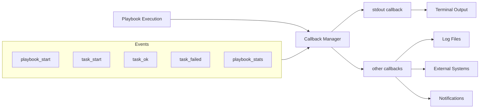
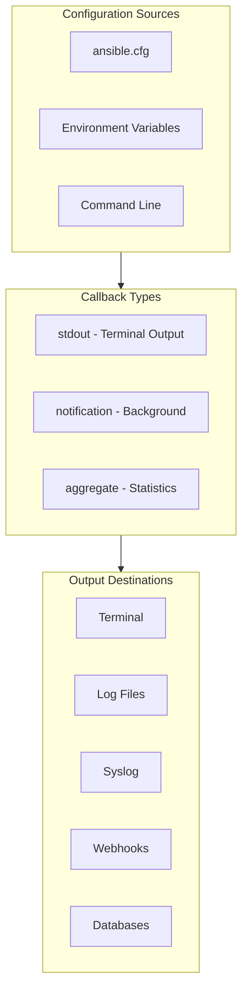

# How to Configure Ansible Callbacks for Logging

Author: [nawazdhandala](https://www.github.com/nawazdhandala)

Tags: Ansible, Logging, Callbacks, Automation, DevOps, Monitoring, Observability

Description: Learn how to configure Ansible callback plugins to capture detailed logs, customize output formats, and integrate with external logging systems.

---

Running Ansible playbooks in production requires proper logging. By default, Ansible output scrolls by on the terminal and disappears. Callback plugins let you capture this output, format it for readability, send it to logging systems, and create audit trails. This guide shows you how to configure and create Ansible callbacks for comprehensive logging.

## Understanding Ansible Callbacks

Callback plugins intercept events during playbook execution and can process them however you need.



## Built-in Callback Plugins

Ansible includes several useful callback plugins out of the box.

### Listing Available Callbacks

```bash
# List all available callback plugins
ansible-doc -t callback -l

# Get details about a specific callback
ansible-doc -t callback json
ansible-doc -t callback yaml
ansible-doc -t callback log_plays
```

### Common Built-in Callbacks

| Callback | Purpose |
|----------|---------|
| default | Standard terminal output |
| json | JSON formatted output |
| yaml | YAML formatted output |
| minimal | Minimal output |
| timer | Adds timing information |
| profile_tasks | Shows task timing |
| log_plays | Logs to files |

## Configuring Callbacks in ansible.cfg

### Basic Configuration

```ini
# ansible.cfg
[defaults]
# Set the stdout callback (only one can be active)
stdout_callback = yaml

# Enable additional callbacks (can enable multiple)
callbacks_enabled = timer, profile_tasks, log_plays

# Set callback plugin path for custom plugins
callback_plugins = ./plugins/callbacks:/usr/share/ansible/plugins/callback

# Increase verbosity for callbacks
# 0 = normal, 1-4 = increasing detail
verbosity = 1
```

### Using Environment Variables

```bash
# Set stdout callback via environment
export ANSIBLE_STDOUT_CALLBACK=json

# Enable additional callbacks
export ANSIBLE_CALLBACKS_ENABLED=timer,profile_tasks

# Run playbook with these settings
ansible-playbook playbook.yml
```

## Configuring the log_plays Callback

The `log_plays` callback writes playbook output to log files.

```ini
# ansible.cfg
[defaults]
callbacks_enabled = log_plays

[callback_log_plays]
# Directory to store log files
log_folder = /var/log/ansible/plays

# Make sure the directory exists and has proper permissions
# mkdir -p /var/log/ansible/plays
# chmod 755 /var/log/ansible/plays
```

```yaml
# Create log directory with Ansible
- name: Ensure Ansible log directory exists
  hosts: localhost
  become: yes
  tasks:
    - name: Create log directory
      file:
        path: /var/log/ansible/plays
        state: directory
        mode: '0755'
        owner: ansible
        group: ansible
```

## JSON Logging Callback

For structured logging, use the JSON callback.

```ini
# ansible.cfg
[defaults]
stdout_callback = json

# Or for non-stdout JSON logging
callbacks_enabled = json
```

```bash
# Capture JSON output to file
ansible-playbook playbook.yml > playbook_output.json 2>&1

# Parse with jq
ansible-playbook playbook.yml 2>/dev/null | jq '.plays[].tasks[] | select(.task.name != null) | {task: .task.name, status: .hosts | to_entries[].value.changed}'
```

## Profile Tasks Callback

Get timing information for performance analysis.

```ini
# ansible.cfg
[defaults]
callbacks_enabled = profile_tasks

[callback_profile_tasks]
# Show task timing in output
sort_order = descending

# Minimum time to display (in seconds)
task_output_limit = 20
```

Sample output:

```
PLAY RECAP *********************************************************************
Saturday 24 January 2026  14:23:45 +0000 (0:00:02.345)       0:05:23.456 *******
===============================================================================
Install packages ---------------------------------------------------- 120.45s
Configure database --------------------------------------------------- 45.23s
Deploy application --------------------------------------------------- 30.12s
Start services ------------------------------------------------------- 15.67s
```

## Creating Custom Callback Plugins

### Basic Callback Structure

```python
# plugins/callbacks/custom_logger.py
from __future__ import (absolute_import, division, print_function)
__metaclass__ = type

DOCUMENTATION = '''
    name: custom_logger
    type: notification
    short_description: Custom logging callback
    description:
        - This callback logs playbook events to a custom file format
    requirements:
        - whitelisting in configuration
'''

from ansible.plugins.callback import CallbackBase
from datetime import datetime
import json
import os


class CallbackModule(CallbackBase):
    """
    Custom callback plugin for detailed logging.

    This plugin captures all playbook events and writes them
    to a structured log file for later analysis.
    """

    CALLBACK_VERSION = 2.0
    CALLBACK_TYPE = 'notification'
    CALLBACK_NAME = 'custom_logger'
    CALLBACK_NEEDS_WHITELIST = True

    def __init__(self):
        super(CallbackModule, self).__init__()
        self.log_file = os.environ.get(
            'ANSIBLE_CUSTOM_LOG_FILE',
            '/var/log/ansible/custom.log'
        )
        self.playbook_name = None
        self.play_name = None

    def _log(self, category, data):
        """Write a log entry to the log file."""
        entry = {
            'timestamp': datetime.utcnow().isoformat(),
            'category': category,
            'playbook': self.playbook_name,
            'play': self.play_name,
            'data': data
        }

        # Ensure directory exists
        os.makedirs(os.path.dirname(self.log_file), exist_ok=True)

        with open(self.log_file, 'a') as f:
            f.write(json.dumps(entry) + '\n')

    def v2_playbook_on_start(self, playbook):
        """Called when playbook execution starts."""
        self.playbook_name = playbook._file_name
        self._log('playbook_start', {
            'playbook': self.playbook_name
        })

    def v2_playbook_on_play_start(self, play):
        """Called when a play starts."""
        self.play_name = play.get_name()
        self._log('play_start', {
            'play': self.play_name,
            'hosts': play.hosts
        })

    def v2_runner_on_ok(self, result):
        """Called when a task succeeds."""
        self._log('task_ok', {
            'host': result._host.get_name(),
            'task': result._task.get_name(),
            'changed': result._result.get('changed', False)
        })

    def v2_runner_on_failed(self, result, ignore_errors=False):
        """Called when a task fails."""
        self._log('task_failed', {
            'host': result._host.get_name(),
            'task': result._task.get_name(),
            'msg': result._result.get('msg', ''),
            'ignored': ignore_errors
        })

    def v2_runner_on_skipped(self, result):
        """Called when a task is skipped."""
        self._log('task_skipped', {
            'host': result._host.get_name(),
            'task': result._task.get_name()
        })

    def v2_playbook_on_stats(self, stats):
        """Called at the end with playbook statistics."""
        hosts = sorted(stats.processed.keys())
        summary = {}

        for host in hosts:
            summary[host] = stats.summarize(host)

        self._log('playbook_stats', {
            'summary': summary
        })
```

### Advanced Callback with External Integration

```python
# plugins/callbacks/webhook_notifier.py
from __future__ import (absolute_import, division, print_function)
__metaclass__ = type

DOCUMENTATION = '''
    name: webhook_notifier
    type: notification
    short_description: Send notifications to webhook
    description:
        - Sends playbook events to a webhook endpoint
    options:
        webhook_url:
            description: URL to send notifications to
            env:
                - name: ANSIBLE_WEBHOOK_URL
            ini:
                - section: callback_webhook_notifier
                  key: webhook_url
        webhook_events:
            description: Events to send (comma-separated)
            default: playbook_start,playbook_stats,task_failed
            env:
                - name: ANSIBLE_WEBHOOK_EVENTS
            ini:
                - section: callback_webhook_notifier
                  key: events
'''

from ansible.plugins.callback import CallbackBase
import requests
import json
from datetime import datetime


class CallbackModule(CallbackBase):
    """
    Webhook notification callback.

    Sends playbook events to a configurable webhook endpoint
    for integration with external systems like Slack, PagerDuty, etc.
    """

    CALLBACK_VERSION = 2.0
    CALLBACK_TYPE = 'notification'
    CALLBACK_NAME = 'webhook_notifier'
    CALLBACK_NEEDS_WHITELIST = True

    def __init__(self):
        super(CallbackModule, self).__init__()
        self.webhook_url = None
        self.events = []
        self.playbook_name = None
        self.failed_tasks = []

    def set_options(self, task_keys=None, var_options=None, direct=None):
        """Load options from configuration."""
        super(CallbackModule, self).set_options(
            task_keys=task_keys,
            var_options=var_options,
            direct=direct
        )
        self.webhook_url = self.get_option('webhook_url')
        events_str = self.get_option('webhook_events')
        self.events = [e.strip() for e in events_str.split(',')]

    def _send_webhook(self, event_type, data):
        """Send event to webhook if configured and event type is enabled."""
        if not self.webhook_url:
            return

        if event_type not in self.events:
            return

        payload = {
            'event': event_type,
            'timestamp': datetime.utcnow().isoformat(),
            'playbook': self.playbook_name,
            'data': data
        }

        try:
            response = requests.post(
                self.webhook_url,
                json=payload,
                headers={'Content-Type': 'application/json'},
                timeout=10
            )
            response.raise_for_status()
        except requests.exceptions.RequestException as e:
            # Log error but do not fail playbook
            self._display.warning(f"Webhook notification failed: {e}")

    def v2_playbook_on_start(self, playbook):
        """Called when playbook starts."""
        self.playbook_name = playbook._file_name
        self.failed_tasks = []

        self._send_webhook('playbook_start', {
            'playbook': self.playbook_name,
            'message': f'Playbook {self.playbook_name} started'
        })

    def v2_runner_on_failed(self, result, ignore_errors=False):
        """Track failed tasks."""
        if not ignore_errors:
            self.failed_tasks.append({
                'host': result._host.get_name(),
                'task': result._task.get_name(),
                'msg': result._result.get('msg', 'Unknown error')
            })

            self._send_webhook('task_failed', {
                'host': result._host.get_name(),
                'task': result._task.get_name(),
                'error': result._result.get('msg', 'Unknown error')
            })

    def v2_playbook_on_stats(self, stats):
        """Send summary at end of playbook."""
        hosts = sorted(stats.processed.keys())
        summary = {host: stats.summarize(host) for host in hosts}

        # Calculate totals
        total_ok = sum(s['ok'] for s in summary.values())
        total_changed = sum(s['changed'] for s in summary.values())
        total_failed = sum(s['failures'] for s in summary.values())

        status = 'success' if total_failed == 0 else 'failed'

        self._send_webhook('playbook_stats', {
            'playbook': self.playbook_name,
            'status': status,
            'summary': {
                'hosts': len(hosts),
                'ok': total_ok,
                'changed': total_changed,
                'failed': total_failed
            },
            'failed_tasks': self.failed_tasks
        })
```

## Logging to Syslog

```python
# plugins/callbacks/syslog_logger.py
from __future__ import (absolute_import, division, print_function)
__metaclass__ = type

DOCUMENTATION = '''
    name: syslog_logger
    type: notification
    short_description: Log to syslog
    description:
        - Sends Ansible events to syslog
'''

from ansible.plugins.callback import CallbackBase
import syslog


class CallbackModule(CallbackBase):
    """
    Syslog logging callback.

    Writes playbook events to the system syslog for
    centralized log collection and compliance.
    """

    CALLBACK_VERSION = 2.0
    CALLBACK_TYPE = 'notification'
    CALLBACK_NAME = 'syslog_logger'
    CALLBACK_NEEDS_WHITELIST = True

    def __init__(self):
        super(CallbackModule, self).__init__()
        # Open syslog connection
        syslog.openlog('ansible', syslog.LOG_PID, syslog.LOG_LOCAL0)
        self.playbook_name = None

    def _log(self, priority, message):
        """Write message to syslog."""
        prefix = f"[{self.playbook_name}]" if self.playbook_name else "[ansible]"
        syslog.syslog(priority, f"{prefix} {message}")

    def v2_playbook_on_start(self, playbook):
        self.playbook_name = playbook._file_name
        self._log(syslog.LOG_INFO, f"Playbook started: {self.playbook_name}")

    def v2_runner_on_ok(self, result):
        host = result._host.get_name()
        task = result._task.get_name()
        changed = result._result.get('changed', False)
        status = 'changed' if changed else 'ok'
        self._log(syslog.LOG_INFO, f"Task {status}: {task} on {host}")

    def v2_runner_on_failed(self, result, ignore_errors=False):
        host = result._host.get_name()
        task = result._task.get_name()
        msg = result._result.get('msg', 'Unknown error')

        if ignore_errors:
            self._log(syslog.LOG_WARNING, f"Task failed (ignored): {task} on {host}: {msg}")
        else:
            self._log(syslog.LOG_ERR, f"Task failed: {task} on {host}: {msg}")

    def v2_playbook_on_stats(self, stats):
        hosts = sorted(stats.processed.keys())
        for host in hosts:
            s = stats.summarize(host)
            self._log(
                syslog.LOG_INFO,
                f"Stats for {host}: ok={s['ok']} changed={s['changed']} "
                f"failures={s['failures']} unreachable={s['unreachable']}"
            )
```

## Callback Configuration Reference



### Complete ansible.cfg Example

```ini
# ansible.cfg - Complete callback configuration
[defaults]
# Primary output format (choose one)
stdout_callback = yaml
# Options: default, json, yaml, minimal, dense, unixy, null

# Enable multiple notification callbacks
callbacks_enabled = timer, profile_tasks, log_plays, custom_logger

# Custom callback plugins location
callback_plugins = ./plugins/callbacks

# Show diffs for file changes
diff = True

# Number of parallel processes
forks = 10

[callback_log_plays]
# Log plays callback settings
log_folder = /var/log/ansible/plays

[callback_profile_tasks]
# Profile tasks settings
sort_order = descending
task_output_limit = 20

[callback_timer]
# Timer callback has no special settings
# It just shows total execution time

[callback_custom_logger]
# Custom callback settings
log_file = /var/log/ansible/detailed.log
log_level = info

[callback_webhook_notifier]
# Webhook notification settings
webhook_url = https://hooks.example.com/ansible
events = playbook_start,playbook_stats,task_failed
```

## Practical Examples

### CI/CD Pipeline Logging

```yaml
# .gitlab-ci.yml
ansible_deploy:
  script:
    - export ANSIBLE_STDOUT_CALLBACK=json
    - export ANSIBLE_CALLBACKS_ENABLED=log_plays,profile_tasks
    - ansible-playbook deploy.yml | tee ansible_output.json
    - python parse_results.py ansible_output.json
  artifacts:
    paths:
      - ansible_output.json
      - /var/log/ansible/plays/
    when: always
```

### Monitoring Integration

```yaml
# playbook.yml - with monitoring integration
---
- name: Deploy with monitoring
  hosts: all
  vars:
    deployment_id: "{{ lookup('pipe', 'uuidgen') }}"

  pre_tasks:
    - name: Notify monitoring - deployment start
      uri:
        url: "{{ monitoring_webhook }}"
        method: POST
        body_format: json
        body:
          event: deployment_start
          deployment_id: "{{ deployment_id }}"
          timestamp: "{{ ansible_date_time.iso8601 }}"
      delegate_to: localhost
      run_once: true

  roles:
    - application

  post_tasks:
    - name: Notify monitoring - deployment complete
      uri:
        url: "{{ monitoring_webhook }}"
        method: POST
        body_format: json
        body:
          event: deployment_complete
          deployment_id: "{{ deployment_id }}"
          timestamp: "{{ ansible_date_time.iso8601 }}"
      delegate_to: localhost
      run_once: true
```

---

Proper logging transforms Ansible from a manual tool into an auditable automation platform. Start with the built-in callbacks like `log_plays` and `profile_tasks`, then build custom callbacks for your specific needs. Always capture JSON output in CI/CD pipelines for structured analysis, and integrate with your existing logging infrastructure for complete observability.
