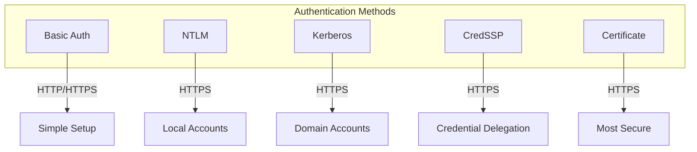
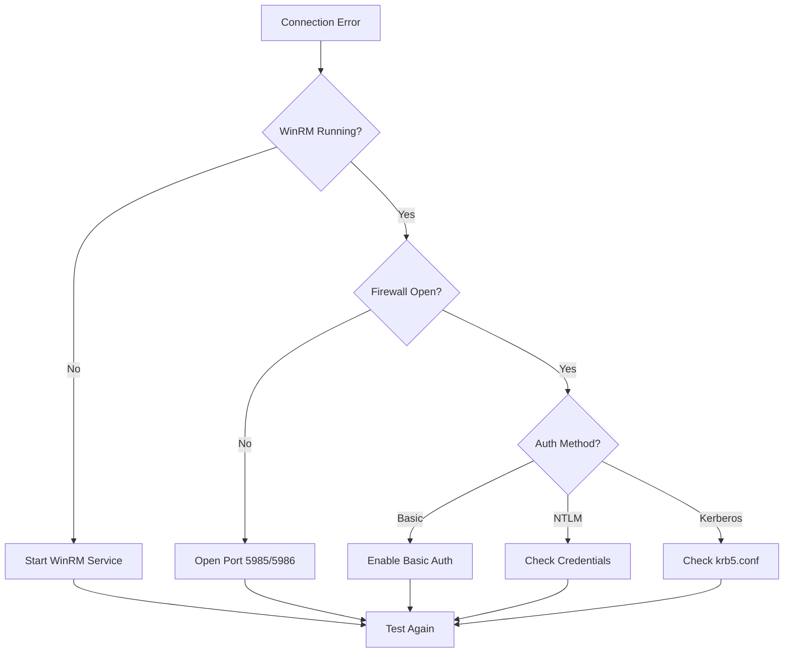

# How to Configure Ansible for Windows Hosts

Author: [nawazdhandala](https://www.github.com/nawazdhandala)

Tags: Ansible, Windows, Automation, DevOps, WinRM, Configuration Management

Description: A comprehensive guide to configuring Ansible for managing Windows hosts using WinRM, including authentication setup and common tasks.

---

Ansible is primarily designed for Linux, but it works well with Windows hosts through the Windows Remote Management (WinRM) protocol. This guide covers everything you need to connect Ansible to Windows machines and automate common administrative tasks.

## Understanding Ansible Windows Architecture

Unlike Linux hosts that use SSH, Windows hosts require WinRM for communication. Ansible connects to Windows using the pywinrm library and executes PowerShell commands remotely.


## Prerequisites

Before configuring Windows hosts, ensure you have the following:

1. Ansible installed on your control node (Linux or macOS)
2. Python pywinrm library installed
3. Windows hosts with WinRM enabled
4. Network connectivity on ports 5985 (HTTP) or 5986 (HTTPS)

### Install Required Python Libraries

```bash
# Install pywinrm and its dependencies
pip install pywinrm

# For Kerberos authentication (optional but recommended for domains)
pip install pywinrm[kerberos]

# For certificate authentication
pip install pywinrm[credssp]
```

## Configuring WinRM on Windows Hosts

WinRM must be enabled and configured on each Windows host before Ansible can connect.

### Quick Setup Script

Run this PowerShell script as Administrator on each Windows host:

```powershell
# Enable-WinRM.ps1 - Configure WinRM for Ansible

# Enable WinRM service
Enable-PSRemoting -Force

# Set WinRM service to start automatically
Set-Service WinRM -StartupType Automatic

# Configure WinRM listener for HTTPS (recommended for production)
# First, create a self-signed certificate
$cert = New-SelfSignedCertificate -DnsName $env:COMPUTERNAME -CertStoreLocation Cert:\LocalMachine\My

# Create HTTPS listener using the certificate
winrm create winrm/config/Listener?Address=*+Transport=HTTPS "@{Hostname=`"$env:COMPUTERNAME`";CertificateThumbprint=`"$($cert.Thumbprint)`"}"

# Configure WinRM settings
winrm set winrm/config/service '@{AllowUnencrypted="false"}'
winrm set winrm/config/service/auth '@{Basic="true"}'
winrm set winrm/config/service/auth '@{CredSSP="true"}'

# Open firewall for WinRM HTTPS
New-NetFirewallRule -Name "WinRM-HTTPS" -DisplayName "WinRM HTTPS" -Enabled True -Direction Inbound -Protocol TCP -LocalPort 5986 -Action Allow

# Verify configuration
winrm enumerate winrm/config/listener
```

### Manual Configuration Steps

If you prefer manual configuration:

```powershell
# Step 1: Enable WinRM
winrm quickconfig -q

# Step 2: Set execution policy for PowerShell
Set-ExecutionPolicy RemoteSigned -Force

# Step 3: Configure WinRM memory settings (important for large playbooks)
winrm set winrm/config/winrs '@{MaxMemoryPerShellMB="1024"}'

# Step 4: Allow local account authentication over network
# Warning: Only use in test environments or with proper network security
winrm set winrm/config/service/auth '@{Basic="true"}'

# Step 5: Configure TrustedHosts (if not using domain authentication)
# Replace * with specific IP addresses in production
winrm set winrm/config/client '@{TrustedHosts="*"}'
```

## Ansible Inventory Configuration

Create an inventory file that defines your Windows hosts with the appropriate connection variables.

### Basic Inventory File

```ini
# inventory/windows.ini

[windows]
win-server-01 ansible_host=192.168.1.100
win-server-02 ansible_host=192.168.1.101
win-workstation ansible_host=192.168.1.102

[windows:vars]
# Connection settings
ansible_connection=winrm
ansible_port=5986
ansible_winrm_transport=ntlm
ansible_winrm_server_cert_validation=ignore

# Authentication
ansible_user=Administrator
ansible_password={{ vault_windows_password }}
```

### YAML Inventory Format

```yaml
# inventory/windows.yml

all:
  children:
    windows:
      hosts:
        win-server-01:
          ansible_host: 192.168.1.100
        win-server-02:
          ansible_host: 192.168.1.101
      vars:
        ansible_connection: winrm
        ansible_port: 5986
        ansible_winrm_transport: ntlm
        ansible_winrm_server_cert_validation: ignore
        ansible_user: Administrator
        ansible_password: "{{ vault_windows_password }}"

    # Group for domain-joined machines using Kerberos
    domain_servers:
      hosts:
        dc01.example.com:
        app01.example.com:
      vars:
        ansible_connection: winrm
        ansible_port: 5986
        ansible_winrm_transport: kerberos
        ansible_user: admin@EXAMPLE.COM
```

## Authentication Methods

Ansible supports multiple authentication methods for Windows hosts.



### NTLM Authentication

Best for local accounts and non-domain environments:

```yaml
# group_vars/windows.yml

ansible_connection: winrm
ansible_port: 5986
ansible_winrm_transport: ntlm
ansible_winrm_server_cert_validation: ignore
ansible_user: Administrator
ansible_password: "{{ vault_windows_password }}"
```

### Kerberos Authentication

Recommended for Active Directory environments:

```yaml
# group_vars/domain_servers.yml

ansible_connection: winrm
ansible_port: 5986
ansible_winrm_transport: kerberos
ansible_user: admin@EXAMPLE.COM
ansible_password: "{{ vault_domain_password }}"
```

Configure Kerberos on the Ansible controller:

```ini
# /etc/krb5.conf

[libdefaults]
    default_realm = EXAMPLE.COM
    dns_lookup_realm = false
    dns_lookup_kdc = true

[realms]
    EXAMPLE.COM = {
        kdc = dc01.example.com
        admin_server = dc01.example.com
    }

[domain_realm]
    .example.com = EXAMPLE.COM
    example.com = EXAMPLE.COM
```

### Certificate Authentication

Most secure option for production environments:

```yaml
# group_vars/secure_windows.yml

ansible_connection: winrm
ansible_port: 5986
ansible_winrm_transport: certificate
ansible_winrm_cert_pem: /path/to/client_cert.pem
ansible_winrm_cert_key_pem: /path/to/client_key.pem
ansible_winrm_ca_trust_path: /path/to/ca_cert.pem
```

## Testing the Connection

Before running playbooks, verify that Ansible can connect to your Windows hosts.

```bash
# Test connectivity using win_ping module
ansible windows -i inventory/windows.ini -m win_ping

# Test with verbose output for debugging
ansible windows -i inventory/windows.ini -m win_ping -vvv

# Run a simple command
ansible windows -i inventory/windows.ini -m win_shell -a "hostname"
```

Expected successful output:

```
win-server-01 | SUCCESS => {
    "changed": false,
    "ping": "pong"
}
```

## Common Windows Modules

Ansible provides Windows-specific modules prefixed with `win_`.

### Managing Windows Features

```yaml
# playbooks/install-features.yml

---
- name: Configure Windows Server Features
  hosts: windows
  tasks:
    - name: Install IIS web server
      win_feature:
        name: Web-Server
        state: present
        include_sub_features: yes
        include_management_tools: yes

    - name: Install .NET Framework
      win_feature:
        name: NET-Framework-45-Core
        state: present

    - name: Remove Telnet Client
      win_feature:
        name: Telnet-Client
        state: absent
```

### Managing Windows Services

```yaml
# playbooks/manage-services.yml

---
- name: Manage Windows Services
  hosts: windows
  tasks:
    - name: Ensure Windows Update service is running
      win_service:
        name: wuauserv
        state: started
        start_mode: auto

    - name: Stop and disable Print Spooler
      win_service:
        name: Spooler
        state: stopped
        start_mode: disabled

    - name: Configure custom service
      win_service:
        name: MyAppService
        path: C:\Apps\myapp.exe
        display_name: My Application Service
        description: Custom application service
        state: started
        start_mode: auto
        username: .\ServiceAccount
        password: "{{ vault_service_password }}"
```

### Managing Files and Directories

```yaml
# playbooks/manage-files.yml

---
- name: Manage Windows Files
  hosts: windows
  tasks:
    - name: Create application directory
      win_file:
        path: C:\Apps\MyApplication
        state: directory

    - name: Copy configuration file
      win_copy:
        src: files/app.config
        dest: C:\Apps\MyApplication\app.config

    - name: Download file from URL
      win_get_url:
        url: https://example.com/installer.msi
        dest: C:\Temp\installer.msi

    - name: Template configuration file
      win_template:
        src: templates/web.config.j2
        dest: C:\inetpub\wwwroot\web.config
```

### Installing Software

```yaml
# playbooks/install-software.yml

---
- name: Install Software on Windows
  hosts: windows
  tasks:
    - name: Install MSI package
      win_package:
        path: C:\Temp\installer.msi
        state: present
        arguments: /quiet /norestart

    - name: Install from Chocolatey
      win_chocolatey:
        name:
          - git
          - vscode
          - 7zip
        state: present

    - name: Install specific version
      win_chocolatey:
        name: nodejs
        version: '18.17.0'
        state: present

    - name: Remove package
      win_package:
        product_id: '{12345678-1234-1234-1234-123456789012}'
        state: absent
```

### Managing Windows Registry

```yaml
# playbooks/manage-registry.yml

---
- name: Configure Windows Registry
  hosts: windows
  tasks:
    - name: Disable Windows Firewall notification
      win_regedit:
        path: HKLM:\SOFTWARE\Microsoft\Security Center
        name: FirewallDisableNotify
        data: 1
        type: dword

    - name: Set environment variable
      win_regedit:
        path: HKLM:\SYSTEM\CurrentControlSet\Control\Session Manager\Environment
        name: MY_APP_HOME
        data: C:\Apps\MyApplication
        type: string

    - name: Delete registry key
      win_regedit:
        path: HKLM:\SOFTWARE\OldApplication
        state: absent
        delete_key: yes
```

## Complete Example Playbook

Here is a comprehensive playbook that sets up a Windows web server:

```yaml
# playbooks/setup-webserver.yml

---
- name: Configure Windows Web Server
  hosts: windows
  vars:
    app_name: MyWebApp
    app_path: C:\inetpub\wwwroot\{{ app_name }}
    app_pool_name: "{{ app_name }}Pool"

  tasks:
    - name: Install IIS and management tools
      win_feature:
        name:
          - Web-Server
          - Web-Mgmt-Tools
          - Web-Mgmt-Console
        state: present

    - name: Create application directory
      win_file:
        path: "{{ app_path }}"
        state: directory

    - name: Create application pool
      win_iis_webapppool:
        name: "{{ app_pool_name }}"
        state: started
        attributes:
          managedRuntimeVersion: v4.0
          managedPipelineMode: Integrated

    - name: Create IIS website
      win_iis_website:
        name: "{{ app_name }}"
        state: started
        port: 80
        ip: "*"
        hostname: ""
        application_pool: "{{ app_pool_name }}"
        physical_path: "{{ app_path }}"

    - name: Deploy application files
      win_copy:
        src: "files/webapp/"
        dest: "{{ app_path }}"

    - name: Configure web.config
      win_template:
        src: templates/web.config.j2
        dest: "{{ app_path }}\\web.config"

    - name: Open firewall for HTTP
      win_firewall_rule:
        name: HTTP-In
        localport: 80
        action: allow
        direction: in
        protocol: tcp
        state: present
        enabled: yes

    - name: Ensure IIS service is running
      win_service:
        name: W3SVC
        state: started
        start_mode: auto
```

## Troubleshooting Connection Issues

Common connection problems and their solutions:



### Debug Connection Issues

```bash
# Test WinRM connectivity from Linux
curl -k -u Administrator:Password https://192.168.1.100:5986/wsman

# Check WinRM configuration on Windows
winrm get winrm/config

# List WinRM listeners
winrm enumerate winrm/config/listener

# Test with increased verbosity
ansible windows -i inventory/windows.ini -m win_ping -vvvv
```

### Common Error Messages

**Error: "ssl: HTTPSConnectionPool"**

```yaml
# Solution: Disable certificate validation or configure proper certificates
ansible_winrm_server_cert_validation: ignore
```

**Error: "kerberos: the specified credentials were rejected"**

```bash
# Solution: Get a fresh Kerberos ticket
kinit admin@EXAMPLE.COM
klist  # Verify ticket
```

**Error: "winrm connection error"**

```powershell
# On Windows host, verify WinRM is accepting connections
Test-WSMan -ComputerName localhost
winrm identify -r:https://localhost:5986 -u:Administrator -p:Password
```

## Security Best Practices

1. **Always use HTTPS** - Never use HTTP (port 5985) in production
2. **Use Kerberos or certificates** - Avoid basic authentication
3. **Limit TrustedHosts** - Do not use wildcard (*) in production
4. **Use Ansible Vault** - Never store passwords in plain text
5. **Minimize privileges** - Use service accounts with least required permissions
6. **Enable auditing** - Log WinRM connections for security monitoring

```yaml
# Example: Secure inventory with vault
# Run with: ansible-playbook -i inventory/windows.yml playbook.yml --ask-vault-pass

ansible_password: !vault |
  $ANSIBLE_VAULT;1.1;AES256
  61626364656667686970...
```

---

Configuring Ansible for Windows hosts requires careful setup of WinRM and authentication, but once configured, you can automate Windows administration just as effectively as Linux. Start with basic NTLM authentication for testing, then move to Kerberos or certificate authentication for production environments. The Windows-specific modules provide comprehensive coverage for managing features, services, files, and applications.
