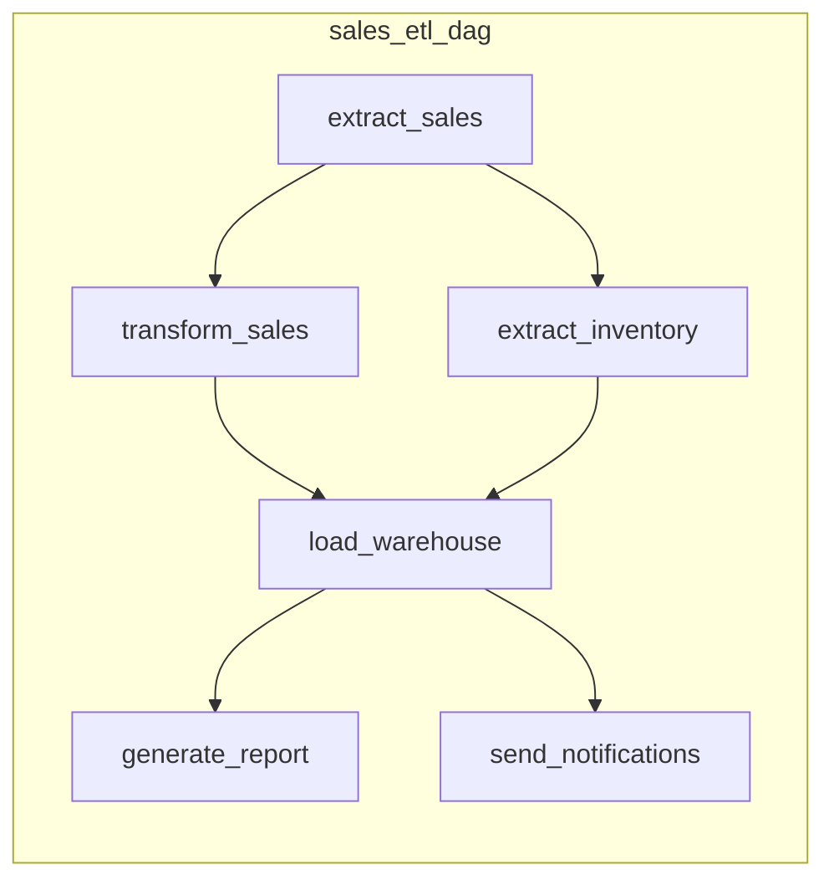

# How to Configure Apache Airflow DAGs

Author: [nawazdhandala](https://www.github.com/nawazdhandala)

Tags: Apache Airflow, DAG, Data Pipelines, Workflow Orchestration, ETL, Python

Description: A practical guide to configuring Apache Airflow DAGs including scheduling, dependencies, task groups, variables, and production best practices.

---

Apache Airflow is the standard for orchestrating data pipelines. A DAG (Directed Acyclic Graph) defines the workflow, including what tasks to run, in what order, and on what schedule. This guide covers everything you need to configure production-ready Airflow DAGs.

## DAG Structure Overview



## Basic DAG Configuration

### Minimal DAG

```python
from datetime import datetime, timedelta
from airflow import DAG
from airflow.operators.python import PythonOperator

# Define default arguments for all tasks
default_args = {
    'owner': 'data-team',
    'depends_on_past': False,
    'email': ['alerts@company.com'],
    'email_on_failure': True,
    'email_on_retry': False,
    'retries': 3,
    'retry_delay': timedelta(minutes=5),
}

# Create the DAG
with DAG(
    dag_id='sales_etl',
    default_args=default_args,
    description='Daily sales data ETL pipeline',
    schedule_interval='0 6 * * *',  # Run at 6 AM daily
    start_date=datetime(2026, 1, 1),
    catchup=False,
    tags=['etl', 'sales'],
) as dag:

    def extract_data(**context):
        """Extract sales data from source."""
        execution_date = context['ds']
        print(f"Extracting data for {execution_date}")
        # Your extraction logic here

    def transform_data(**context):
        """Transform extracted data."""
        print("Transforming data")
        # Your transformation logic here

    def load_data(**context):
        """Load data to warehouse."""
        print("Loading data to warehouse")
        # Your loading logic here

    # Define tasks
    extract = PythonOperator(
        task_id='extract',
        python_callable=extract_data,
    )

    transform = PythonOperator(
        task_id='transform',
        python_callable=transform_data,
    )

    load = PythonOperator(
        task_id='load',
        python_callable=load_data,
    )

    # Define dependencies
    extract >> transform >> load
```

## Schedule Configuration

### Schedule Intervals

```python
# Cron expressions
schedule_interval='0 6 * * *'     # Daily at 6 AM
schedule_interval='0 */2 * * *'   # Every 2 hours
schedule_interval='0 0 * * 0'     # Weekly on Sunday
schedule_interval='0 0 1 * *'     # Monthly on 1st

# Preset schedules
schedule_interval='@daily'        # Midnight daily
schedule_interval='@hourly'       # Every hour
schedule_interval='@weekly'       # Midnight on Sunday
schedule_interval='@monthly'      # Midnight on 1st

# Timedelta
from datetime import timedelta
schedule_interval=timedelta(hours=6)  # Every 6 hours

# None for manual/triggered only
schedule_interval=None
```

### Data-Aware Scheduling (Airflow 2.4+)

```python
from airflow import Dataset

# Define datasets
sales_data = Dataset('s3://bucket/sales/')
inventory_data = Dataset('s3://bucket/inventory/')

# Producer DAG updates the dataset
with DAG(
    dag_id='produce_sales_data',
    schedule_interval='@daily',
    start_date=datetime(2026, 1, 1),
) as producer_dag:

    @task(outlets=[sales_data])
    def generate_sales():
        # Generate sales data
        pass

# Consumer DAG runs when dataset is updated
with DAG(
    dag_id='consume_sales_data',
    schedule=[sales_data, inventory_data],  # Runs when both are updated
    start_date=datetime(2026, 1, 1),
) as consumer_dag:

    @task
    def process_data():
        # Process when data is ready
        pass
```

## Task Dependencies

### Basic Dependencies

```python
# Chain operator
from airflow.models.baseoperator import chain

# Linear dependency
extract >> transform >> load

# Multiple dependencies
extract >> [transform_a, transform_b] >> load

# Chain multiple tasks
chain(extract, transform, validate, load)

# Cross dependencies
from airflow.models.baseoperator import cross_downstream

# All tasks in first list trigger all in second
cross_downstream([extract_a, extract_b], [transform_a, transform_b])
```

### Conditional Dependencies

```python
from airflow.operators.python import BranchPythonOperator
from airflow.operators.empty import EmptyOperator

def decide_branch(**context):
    """Decide which branch to take based on data."""
    data_size = context['ti'].xcom_pull(task_ids='check_data')

    if data_size > 1000000:
        return 'process_large_dataset'
    else:
        return 'process_small_dataset'

with DAG('branching_example', ...) as dag:

    check_data = PythonOperator(
        task_id='check_data',
        python_callable=get_data_size,
    )

    branch = BranchPythonOperator(
        task_id='branch',
        python_callable=decide_branch,
    )

    process_large = PythonOperator(
        task_id='process_large_dataset',
        python_callable=process_large_data,
    )

    process_small = PythonOperator(
        task_id='process_small_dataset',
        python_callable=process_small_data,
    )

    # Join point after branching
    join = EmptyOperator(
        task_id='join',
        trigger_rule='none_failed_min_one_success',
    )

    check_data >> branch >> [process_large, process_small] >> join
```

## Task Groups

```python
from airflow.utils.task_group import TaskGroup

with DAG('task_groups_example', ...) as dag:

    start = EmptyOperator(task_id='start')

    # Group related tasks
    with TaskGroup(group_id='extract') as extract_group:
        extract_sales = PythonOperator(
            task_id='sales',
            python_callable=extract_sales_data,
        )
        extract_inventory = PythonOperator(
            task_id='inventory',
            python_callable=extract_inventory_data,
        )
        extract_customers = PythonOperator(
            task_id='customers',
            python_callable=extract_customer_data,
        )

    with TaskGroup(group_id='transform') as transform_group:
        transform_sales = PythonOperator(
            task_id='sales',
            python_callable=transform_sales_data,
        )
        transform_inventory = PythonOperator(
            task_id='inventory',
            python_callable=transform_inventory_data,
        )

    load = PythonOperator(
        task_id='load',
        python_callable=load_to_warehouse,
    )

    start >> extract_group >> transform_group >> load
```

## Variables and Configuration

### Using Airflow Variables

```python
from airflow.models import Variable

# Get variables (set via UI or CLI)
warehouse_host = Variable.get('warehouse_host')
api_key = Variable.get('api_key', default_var='default_key')

# Get JSON variable
config = Variable.get('etl_config', deserialize_json=True)
batch_size = config.get('batch_size', 1000)

# Use in DAG
with DAG('variables_example', ...) as dag:

    def process_data(**context):
        host = Variable.get('warehouse_host')
        # Use host in processing
```

### Using Connections

```python
from airflow.hooks.base import BaseHook

# Get connection (configured in UI or as env vars)
def get_database_connection():
    conn = BaseHook.get_connection('warehouse_db')
    return {
        'host': conn.host,
        'port': conn.port,
        'login': conn.login,
        'password': conn.password,
        'schema': conn.schema,
    }

# Use with operators
from airflow.providers.postgres.operators.postgres import PostgresOperator

query_task = PostgresOperator(
    task_id='run_query',
    postgres_conn_id='warehouse_db',  # Connection ID
    sql='SELECT * FROM sales WHERE date = {{ ds }}',
)
```

### Environment-Specific Configuration

```python
import os

# Different configs per environment
ENVIRONMENT = os.getenv('AIRFLOW_ENV', 'development')

CONFIG = {
    'development': {
        'warehouse': 'dev-warehouse.company.com',
        'batch_size': 100,
        'email_on_failure': False,
    },
    'staging': {
        'warehouse': 'staging-warehouse.company.com',
        'batch_size': 1000,
        'email_on_failure': True,
    },
    'production': {
        'warehouse': 'prod-warehouse.company.com',
        'batch_size': 10000,
        'email_on_failure': True,
    },
}

env_config = CONFIG[ENVIRONMENT]

default_args = {
    'owner': 'data-team',
    'email_on_failure': env_config['email_on_failure'],
}
```

## XCom for Task Communication

```python
# Push and pull data between tasks
def extract_data(**context):
    data = fetch_from_source()

    # Push to XCom
    context['ti'].xcom_push(key='record_count', value=len(data))
    context['ti'].xcom_push(key='data_path', value='/tmp/extracted_data.parquet')

    return data  # Return value is automatically pushed as 'return_value'

def transform_data(**context):
    # Pull from XCom
    ti = context['ti']
    record_count = ti.xcom_pull(task_ids='extract', key='record_count')
    data_path = ti.xcom_pull(task_ids='extract', key='data_path')

    print(f"Processing {record_count} records from {data_path}")

# Using TaskFlow API (Airflow 2.0+)
from airflow.decorators import task

@task
def extract():
    return {'data': [1, 2, 3], 'count': 3}

@task
def transform(extract_result):
    # Automatically receives return value from extract
    data = extract_result['data']
    return [x * 2 for x in data]

with DAG('taskflow_example', ...) as dag:
    extracted = extract()
    transformed = transform(extracted)
```

## Error Handling and Retries

```python
from airflow.exceptions import AirflowException

default_args = {
    'retries': 3,
    'retry_delay': timedelta(minutes=5),
    'retry_exponential_backoff': True,
    'max_retry_delay': timedelta(hours=1),
}

def task_with_error_handling(**context):
    try:
        result = process_data()
        return result
    except ConnectionError as e:
        # Retryable error
        raise AirflowException(f"Connection failed, will retry: {e}")
    except ValueError as e:
        # Non-retryable error - fail immediately
        raise AirflowException(f"Invalid data, cannot retry: {e}")

# Task-specific retry settings
critical_task = PythonOperator(
    task_id='critical_task',
    python_callable=critical_function,
    retries=5,  # Override default
    retry_delay=timedelta(minutes=10),
)

# Callback functions
def on_failure_callback(context):
    """Called when task fails."""
    task_id = context['task_instance'].task_id
    exception = context['exception']
    send_alert(f"Task {task_id} failed: {exception}")

def on_success_callback(context):
    """Called when task succeeds."""
    log_success(context['task_instance'].task_id)

task_with_callbacks = PythonOperator(
    task_id='task_with_callbacks',
    python_callable=my_function,
    on_failure_callback=on_failure_callback,
    on_success_callback=on_success_callback,
)
```

## Trigger Rules

```python
from airflow.utils.trigger_rule import TriggerRule

# Task runs only when all upstream tasks succeed (default)
task_a = EmptyOperator(task_id='task_a', trigger_rule=TriggerRule.ALL_SUCCESS)

# Task runs if all upstream are done (success or failed)
task_b = EmptyOperator(task_id='task_b', trigger_rule=TriggerRule.ALL_DONE)

# Task runs if at least one upstream succeeded
task_c = EmptyOperator(task_id='task_c', trigger_rule=TriggerRule.ONE_SUCCESS)

# Task runs if at least one upstream failed
task_d = EmptyOperator(task_id='task_d', trigger_rule=TriggerRule.ONE_FAILED)

# Task runs if no upstream failed (skipped counts as success)
task_e = EmptyOperator(task_id='task_e', trigger_rule=TriggerRule.NONE_FAILED)

# Cleanup task that always runs
cleanup = PythonOperator(
    task_id='cleanup',
    python_callable=cleanup_function,
    trigger_rule=TriggerRule.ALL_DONE,
)
```

## Production Best Practices

### DAG File Organization

```
dags/
    common/
        __init__.py
        operators.py
        hooks.py
        utils.py
    sales/
        __init__.py
        sales_etl.py
        sales_reporting.py
    inventory/
        __init__.py
        inventory_sync.py
```

### DAG Testing

```python
# tests/test_sales_etl.py
import pytest
from airflow.models import DagBag

def test_dag_loads_without_errors():
    """Test that DAG file loads without errors."""
    dag_bag = DagBag(dag_folder='dags/', include_examples=False)
    assert len(dag_bag.import_errors) == 0

def test_dag_has_correct_tasks():
    """Test that DAG has expected tasks."""
    dag_bag = DagBag(dag_folder='dags/', include_examples=False)
    dag = dag_bag.get_dag('sales_etl')

    expected_tasks = ['extract', 'transform', 'load']
    actual_tasks = list(dag.task_ids)

    assert set(expected_tasks) == set(actual_tasks)

def test_task_dependencies():
    """Test that task dependencies are correct."""
    dag_bag = DagBag(dag_folder='dags/', include_examples=False)
    dag = dag_bag.get_dag('sales_etl')

    extract_task = dag.get_task('extract')
    transform_task = dag.get_task('transform')

    assert transform_task.task_id in [t.task_id for t in extract_task.downstream_list]
```

### Performance Configuration

```python
with DAG(
    dag_id='optimized_dag',
    default_args=default_args,
    schedule_interval='@daily',
    start_date=datetime(2026, 1, 1),
    catchup=False,
    max_active_runs=1,  # Prevent overlapping runs
    concurrency=10,     # Max parallel tasks in this DAG
    dagrun_timeout=timedelta(hours=2),  # Kill if running too long
) as dag:
    pass
```

---

Well-configured Airflow DAGs are the foundation of reliable data pipelines. Start with clear task dependencies, use appropriate retry settings, and leverage TaskGroups to organize complex workflows. Always test your DAGs before deployment and use callbacks to handle failures gracefully. The key is making DAGs that are easy to understand, monitor, and debug when things go wrong.
