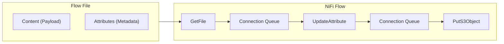
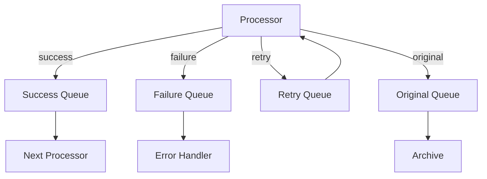
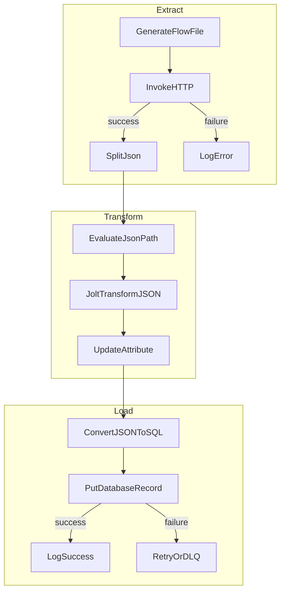

# How to Configure Apache NiFi Flows

Author: [nawazdhandala](https://www.github.com/nawazdhandala)

Tags: Apache NiFi, Data Engineering, ETL, Data Pipelines, Data Integration, Flow Configuration

Description: A practical guide to configuring Apache NiFi flows for building robust data pipelines with processors, connections, and flow management best practices.

---

Apache NiFi is a powerful data integration tool that lets you automate data movement between systems. Unlike traditional ETL tools that require extensive coding, NiFi provides a visual interface for building data flows. But that visual simplicity can be deceiving. Getting NiFi flows right requires understanding processors, relationships, backpressure, and flow file attributes.

## Understanding NiFi Architecture

Before diving into configuration, let's understand how NiFi processes data.



NiFi works with FlowFiles, which contain two parts: content (the actual data) and attributes (metadata like filename, timestamp, and custom properties). Processors transform FlowFiles, and connections queue them between processors.

## Setting Up Your First Flow

### Basic File Transfer Flow

Let's start with a simple flow that reads files from a directory and writes them to another location.

```xml
<!-- GetFile Processor Configuration -->
<processor>
    <name>GetFile</name>
    <type>org.apache.nifi.processors.standard.GetFile</type>
    <properties>
        <!-- Directory to read files from -->
        <property name="Input Directory">/data/input</property>
        <!-- File filter pattern (regex) -->
        <property name="File Filter">[^\.].*</property>
        <!-- Keep source file after reading -->
        <property name="Keep Source File">false</property>
        <!-- Minimum file age before processing -->
        <property name="Minimum File Age">0 sec</property>
        <!-- Recursive directory scanning -->
        <property name="Recurse Subdirectories">true</property>
    </properties>
    <scheduling>
        <!-- How often to check for files -->
        <schedulingPeriod>10 sec</schedulingPeriod>
        <schedulingStrategy>TIMER_DRIVEN</schedulingStrategy>
    </scheduling>
</processor>
```

### Adding Data Transformation

Most flows need to transform data. Here's how to add a JoltTransformJSON processor for JSON transformation.

```json
// Jolt specification for transforming JSON
// Converts flat structure to nested
[
  {
    "operation": "shift",
    "spec": {
      "user_id": "user.id",
      "user_name": "user.name",
      "user_email": "user.contact.email",
      "created_at": "metadata.created",
      "*": "data.&"
    }
  },
  {
    "operation": "default",
    "spec": {
      "metadata": {
        "processed": true,
        "processor": "nifi"
      }
    }
  }
]
```

## Configuring Processor Relationships

Every processor has relationships that determine where FlowFiles go after processing. Common relationships include:



### Handling Failures Gracefully

```xml
<!-- RouteOnAttribute for error handling -->
<processor>
    <name>RouteOnAttribute</name>
    <type>org.apache.nifi.processors.standard.RouteOnAttribute</type>
    <properties>
        <!-- Route based on error count attribute -->
        <property name="max_retries_exceeded">${retry.count:ge(3)}</property>
        <property name="has_error">${error.message:isEmpty():not()}</property>
    </properties>
    <relationships>
        <relationship name="max_retries_exceeded" destination="DeadLetterQueue"/>
        <relationship name="has_error" destination="RetryWithDelay"/>
        <relationship name="unmatched" destination="ContinueProcessing"/>
    </relationships>
</processor>
```

## Managing Backpressure

Backpressure prevents NiFi from overwhelming downstream systems. Configure it on connections:

```xml
<!-- Connection with backpressure settings -->
<connection>
    <source>GetFile</source>
    <destination>TransformJSON</destination>
    <settings>
        <!-- Maximum number of FlowFiles in queue -->
        <backPressureObjectThreshold>10000</backPressureObjectThreshold>
        <!-- Maximum data size in queue -->
        <backPressureDataSizeThreshold>1 GB</backPressureDataSizeThreshold>
        <!-- Expiration time for queued FlowFiles -->
        <flowFileExpiration>0 sec</flowFileExpiration>
        <!-- Prioritizers for queue ordering -->
        <prioritizers>
            <prioritizer>org.apache.nifi.prioritizer.FirstInFirstOutPrioritizer</prioritizer>
        </prioritizers>
    </settings>
</connection>
```

## Working with Controller Services

Controller services provide shared resources like database connections and SSL contexts.

```xml
<!-- DBCPConnectionPool for database access -->
<controllerService>
    <name>PostgreSQL Connection Pool</name>
    <type>org.apache.nifi.dbcp.DBCPConnectionPool</type>
    <properties>
        <property name="Database Connection URL">jdbc:postgresql://localhost:5432/mydb</property>
        <property name="Database Driver Class Name">org.postgresql.Driver</property>
        <property name="Database User">nifi_user</property>
        <!-- Use NiFi sensitive properties for passwords -->
        <property name="Password">${db.password}</property>
        <property name="Max Wait Time">500 millis</property>
        <property name="Max Total Connections">10</property>
        <property name="Validation Query">SELECT 1</property>
    </properties>
</controllerService>
```

## Building a Complete ETL Pipeline

Here's a complete flow for extracting data from an API, transforming it, and loading into a database.



### Extract Stage

```xml
<!-- InvokeHTTP to call REST API -->
<processor>
    <name>InvokeHTTP</name>
    <type>org.apache.nifi.processors.standard.InvokeHTTP</type>
    <properties>
        <property name="HTTP Method">GET</property>
        <property name="Remote URL">https://api.example.com/data</property>
        <property name="SSL Context Service">SSL Context</property>
        <!-- Add authentication header -->
        <property name="Authorization">Bearer ${api.token}</property>
        <!-- Timeout settings -->
        <property name="Connection Timeout">30 secs</property>
        <property name="Read Timeout">30 secs</property>
    </properties>
</processor>

<!-- SplitJson to handle array responses -->
<processor>
    <name>SplitJson</name>
    <type>org.apache.nifi.processors.standard.SplitJson</type>
    <properties>
        <!-- JsonPath to array elements -->
        <property name="JsonPath Expression">$.data[*]</property>
    </properties>
</processor>
```

### Transform Stage

```xml
<!-- EvaluateJsonPath to extract fields as attributes -->
<processor>
    <name>EvaluateJsonPath</name>
    <type>org.apache.nifi.processors.standard.EvaluateJsonPath</type>
    <properties>
        <property name="Destination">flowfile-attribute</property>
        <!-- Extract specific fields -->
        <property name="record.id">$.id</property>
        <property name="record.name">$.name</property>
        <property name="record.timestamp">$.created_at</property>
    </properties>
</processor>
```

### Load Stage

```xml
<!-- PutDatabaseRecord for efficient batch inserts -->
<processor>
    <name>PutDatabaseRecord</name>
    <type>org.apache.nifi.processors.standard.PutDatabaseRecord</type>
    <properties>
        <property name="Record Reader">JsonTreeReader</property>
        <property name="Database Connection Pooling Service">PostgreSQL Connection Pool</property>
        <property name="Statement Type">INSERT</property>
        <property name="Table Name">records</property>
        <property name="Translate Field Names">true</property>
        <!-- Batch size for performance -->
        <property name="Max Batch Size">1000</property>
    </properties>
</processor>
```

## Flow File Attributes Best Practices

Attributes are powerful for routing and tracking. Use them wisely:

```xml
<!-- UpdateAttribute processor for adding metadata -->
<processor>
    <name>UpdateAttribute</name>
    <type>org.apache.nifi.processors.standard.UpdateAttribute</type>
    <properties>
        <!-- Timestamp when processed -->
        <property name="processed.timestamp">${now():format('yyyy-MM-dd HH:mm:ss')}</property>
        <!-- Source system identifier -->
        <property name="source.system">api-extract</property>
        <!-- Unique processing ID -->
        <property name="processing.id">${UUID()}</property>
        <!-- Retry counter for error handling -->
        <property name="retry.count">${retry.count:replaceNull('0'):toNumber():plus(1)}</property>
    </properties>
</processor>
```

## Monitoring and Alerting

Configure bulletins and reporting for operational visibility:

```xml
<!-- ReportingTask for monitoring -->
<reportingTask>
    <name>SiteToSiteProvenanceReportingTask</name>
    <type>org.apache.nifi.reporting.SiteToSiteProvenanceReportingTask</type>
    <properties>
        <property name="Destination URL">https://monitoring-nifi:8443/nifi</property>
        <property name="Batch Size">1000</property>
        <property name="Platform">production</property>
    </properties>
    <scheduling>
        <schedulingPeriod>5 mins</schedulingPeriod>
    </scheduling>
</reportingTask>
```

## Performance Tuning

### Processor Concurrency

```xml
<!-- High-throughput processor settings -->
<processor>
    <name>TransformJSON</name>
    <scheduling>
        <!-- Number of concurrent tasks -->
        <concurrentTasks>4</concurrentTasks>
        <!-- Run schedule -->
        <schedulingPeriod>0 sec</schedulingPeriod>
        <!-- Penalty duration for yielded FlowFiles -->
        <penaltyDuration>30 sec</penaltyDuration>
        <!-- Yield duration when no work -->
        <yieldDuration>1 sec</yieldDuration>
    </scheduling>
</processor>
```

### Memory Management

```bash
# nifi.properties for JVM tuning
# Increase heap for large flows
java.arg.2=-Xms4g
java.arg.3=-Xmx8g

# Content repository settings
nifi.content.repository.directory.default=./content_repository
nifi.content.claim.max.appendable.size=1 MB
nifi.content.repository.archive.max.retention.period=24 hours
nifi.content.repository.archive.max.usage.percentage=50%

# FlowFile repository settings
nifi.flowfile.repository.checkpoint.interval=20 secs
nifi.flowfile.repository.always.sync=false
```

## Common Pitfalls and Solutions

**Problem: FlowFiles stuck in queue**
Check backpressure settings and downstream processor status. Use the "Empty Queue" option carefully in development.

**Problem: Out of memory errors**
Reduce concurrent tasks, increase JVM heap, or add MergeContent processors to batch small files.

**Problem: Duplicate processing**
Use DistributedMapCache or database deduplication. Add idempotency checks in your flow.

**Problem: Slow performance**
Profile your flow using NiFi's built-in statistics. Look for processors with high average lineage duration.

---

Apache NiFi flows are deceptively simple to create but require careful configuration for production use. Focus on proper error handling, backpressure settings, and monitoring from the start. A well-configured NiFi flow can handle millions of records reliably, but a poorly configured one will fail at the worst possible time.
