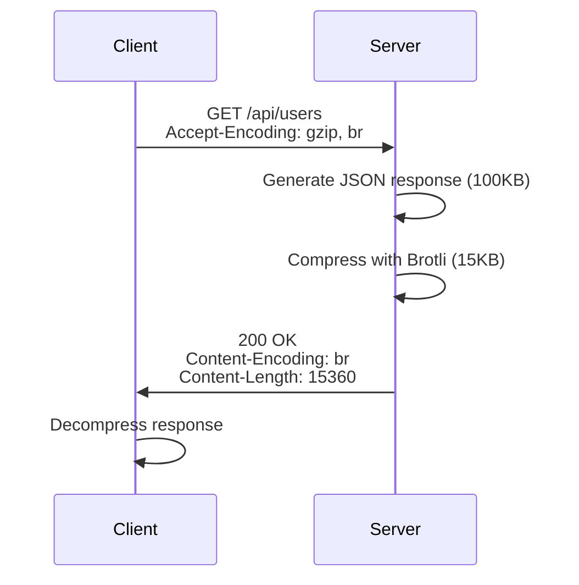
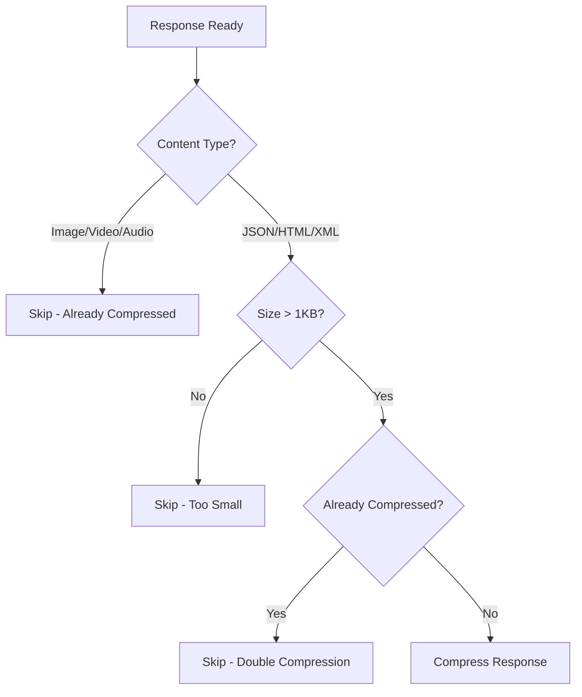

# How to Configure Compression for APIs

Author: [nawazdhandala](https://www.github.com/nawazdhandala)

Tags: API, Performance, Compression, Gzip, Brotli, HTTP, Backend, Nginx

Description: Learn how to configure gzip and Brotli compression for APIs to reduce bandwidth usage and improve response times.

---

API compression can reduce response sizes by 70-90%, dramatically improving load times and reducing bandwidth costs. Modern compression algorithms like gzip and Brotli are fast enough to compress responses on the fly with minimal CPU overhead. This guide covers how to configure compression at different layers of your stack, when to use each algorithm, and common pitfalls to avoid.

## How HTTP Compression Works

When a client makes a request, it tells the server which compression algorithms it supports via the `Accept-Encoding` header. The server compresses the response and indicates the algorithm used in the `Content-Encoding` header.



## Compression Algorithms Compared

| Algorithm | Compression Ratio | Speed | Browser Support | Best For |
|-----------|------------------|-------|-----------------|----------|
| **gzip** | Good (60-70%) | Fast | Universal | General use, real-time compression |
| **Brotli** | Excellent (70-80%) | Slower | Modern browsers | Static assets, pre-compressed files |
| **deflate** | Good | Fast | Universal | Legacy systems (prefer gzip) |

## Configuring Compression in Nginx

Nginx is often used as a reverse proxy in front of API servers. Configuring compression here offloads work from your application.

### Basic Gzip Configuration

```nginx
# /etc/nginx/nginx.conf or /etc/nginx/conf.d/compression.conf

http {
    # Enable gzip compression
    gzip on;

    # Minimum response size to compress (bytes)
    # Responses smaller than this are not worth compressing
    gzip_min_length 1000;

    # Compression level (1-9)
    # 6 offers good balance between CPU and compression ratio
    gzip_comp_level 6;

    # Buffer size for compression
    gzip_buffers 16 8k;

    # Compress responses for proxied requests
    gzip_proxied any;

    # Enable Vary header for caching
    gzip_vary on;

    # MIME types to compress
    gzip_types
        application/json
        application/javascript
        application/xml
        application/rss+xml
        text/plain
        text/css
        text/xml
        text/javascript
        image/svg+xml;

    # Disable for old IE versions
    gzip_disable "msie6";
}
```

### Adding Brotli Compression

Brotli provides better compression ratios than gzip. You need the `ngx_brotli` module.

```nginx
# Enable Brotli (requires ngx_brotli module)
http {
    # Brotli on-the-fly compression
    brotli on;
    brotli_comp_level 6;
    brotli_min_length 1000;

    brotli_types
        application/json
        application/javascript
        application/xml
        text/plain
        text/css
        text/xml
        text/javascript
        image/svg+xml;

    # Pre-compressed static files (serve .br files if available)
    brotli_static on;

    # Also keep gzip as fallback
    gzip on;
    gzip_comp_level 6;
    gzip_min_length 1000;
    gzip_types
        application/json
        application/javascript
        text/plain
        text/css;
}
```

## Node.js Express Compression

For Node.js applications, the `compression` middleware handles gzip compression.

```javascript
const express = require('express');
const compression = require('compression');

const app = express();

// Basic compression with defaults
app.use(compression());

// Or with custom options
app.use(compression({
    // Only compress responses larger than 1KB
    threshold: 1024,

    // Compression level (1-9, higher = better compression, more CPU)
    level: 6,

    // Filter function to decide what to compress
    filter: (req, res) => {
        // Don't compress if client doesn't support it
        if (req.headers['x-no-compression']) {
            return false;
        }

        // Use default filter (compresses based on Content-Type)
        return compression.filter(req, res);
    },

    // Memory level for compression
    memLevel: 8
}));

// Your API routes
app.get('/api/users', async (req, res) => {
    const users = await getUsers();
    res.json(users);  // Will be compressed automatically
});

app.listen(3000);
```

### Adding Brotli Support in Node.js

```javascript
const express = require('express');
const shrinkRay = require('shrink-ray-current');  // Supports Brotli

const app = express();

// shrink-ray supports both gzip and Brotli
app.use(shrinkRay({
    // Use Brotli when available
    brotli: {
        quality: 6  // Brotli quality (1-11)
    },

    // Fallback to gzip
    zlib: {
        level: 6
    },

    // Cache compressed responses
    cache: (req, res) => {
        return req.method === 'GET';
    },

    threshold: 1024
}));

app.get('/api/data', (req, res) => {
    res.json({ /* large response */ });
});

app.listen(3000);
```

## Python Flask/FastAPI Compression

### Flask with gzip

```python
from flask import Flask
from flask_compress import Compress

app = Flask(__name__)

# Configure compression
app.config['COMPRESS_MIMETYPES'] = [
    'application/json',
    'application/javascript',
    'text/html',
    'text/css',
    'text/xml',
    'text/javascript'
]
app.config['COMPRESS_LEVEL'] = 6
app.config['COMPRESS_MIN_SIZE'] = 1000  # Minimum response size in bytes

# Initialize compression
Compress(app)

@app.route('/api/users')
def get_users():
    users = fetch_all_users()  # Returns large list
    return {'users': users}  # Automatically compressed
```

### FastAPI with Middleware

```python
from fastapi import FastAPI
from fastapi.middleware.gzip import GZipMiddleware

app = FastAPI()

# Add gzip middleware
# minimum_size: only compress responses larger than this (bytes)
app.add_middleware(GZipMiddleware, minimum_size=1000)

@app.get("/api/users")
async def get_users():
    users = await fetch_all_users()
    return {"users": users}  # Compressed if >1000 bytes
```

### Custom Brotli Middleware for FastAPI

```python
from fastapi import FastAPI, Request
from starlette.middleware.base import BaseHTTPMiddleware
from starlette.responses import Response
import brotli

class BrotliMiddleware(BaseHTTPMiddleware):
    def __init__(self, app, minimum_size: int = 1000, quality: int = 6):
        super().__init__(app)
        self.minimum_size = minimum_size
        self.quality = quality

    async def dispatch(self, request: Request, call_next):
        response = await call_next(request)

        # Check if client accepts Brotli
        accept_encoding = request.headers.get('accept-encoding', '')
        if 'br' not in accept_encoding:
            return response

        # Get response body
        body = b''
        async for chunk in response.body_iterator:
            body += chunk

        # Skip small responses
        if len(body) < self.minimum_size:
            return Response(
                content=body,
                status_code=response.status_code,
                headers=dict(response.headers),
                media_type=response.media_type
            )

        # Compress with Brotli
        compressed = brotli.compress(body, quality=self.quality)

        # Only use compressed version if it's smaller
        if len(compressed) < len(body):
            headers = dict(response.headers)
            headers['content-encoding'] = 'br'
            headers['content-length'] = str(len(compressed))

            return Response(
                content=compressed,
                status_code=response.status_code,
                headers=headers,
                media_type=response.media_type
            )

        return response

app = FastAPI()
app.add_middleware(BrotliMiddleware, minimum_size=1000, quality=6)
```

## Go HTTP Server Compression

```go
package main

import (
    "compress/gzip"
    "io"
    "net/http"
    "strings"
)

// GzipResponseWriter wraps http.ResponseWriter with gzip compression
type GzipResponseWriter struct {
    io.Writer
    http.ResponseWriter
}

func (w GzipResponseWriter) Write(b []byte) (int, error) {
    return w.Writer.Write(b)
}

// GzipMiddleware compresses responses with gzip
func GzipMiddleware(next http.Handler) http.Handler {
    return http.HandlerFunc(func(w http.ResponseWriter, r *http.Request) {
        // Check if client accepts gzip
        if !strings.Contains(r.Header.Get("Accept-Encoding"), "gzip") {
            next.ServeHTTP(w, r)
            return
        }

        // Create gzip writer
        gz, err := gzip.NewWriterLevel(w, gzip.DefaultCompression)
        if err != nil {
            next.ServeHTTP(w, r)
            return
        }
        defer gz.Close()

        // Set headers
        w.Header().Set("Content-Encoding", "gzip")
        w.Header().Del("Content-Length")  // Length will change

        // Wrap response writer
        gzw := GzipResponseWriter{Writer: gz, ResponseWriter: w}
        next.ServeHTTP(gzw, r)
    })
}

func main() {
    mux := http.NewServeMux()

    mux.HandleFunc("/api/users", func(w http.ResponseWriter, r *http.Request) {
        w.Header().Set("Content-Type", "application/json")
        w.Write([]byte(`{"users": [...]}`))  // Will be compressed
    })

    // Apply middleware
    http.ListenAndServe(":8080", GzipMiddleware(mux))
}
```

## When NOT to Compress

Not all responses benefit from compression:



### Types to Skip

```nginx
# Don't compress these - they're already compressed
# Images: JPEG, PNG, GIF, WebP
# Videos: MP4, WebM
# Audio: MP3, AAC
# Archives: ZIP, GZIP, TAR

# Only compress text-based formats
gzip_types
    application/json
    application/javascript
    application/xml
    text/plain
    text/css
    text/html
    text/xml
    image/svg+xml;  # SVG is text-based, compress it
```

## Pre-compressing Static Files

For static API documentation or large JSON files, pre-compress them at build time:

```bash
#!/bin/bash
# pre-compress.sh - Run during build/deploy

# Find JSON and JS files and create compressed versions
find ./public -type f \( -name "*.json" -o -name "*.js" \) | while read file; do
    # Create gzip version
    gzip -9 -k "$file"

    # Create Brotli version (if brotli is installed)
    if command -v brotli &> /dev/null; then
        brotli -q 11 -k "$file"
    fi

    echo "Compressed: $file"
done
```

Configure Nginx to serve pre-compressed files:

```nginx
location /api/docs {
    # Serve .br file if available and client supports it
    brotli_static on;

    # Fall back to .gz if Brotli not supported
    gzip_static on;

    # Original file as final fallback
    try_files $uri $uri/ =404;
}
```

## Testing Compression

Verify your compression is working:

```bash
# Test gzip support
curl -H "Accept-Encoding: gzip" -I https://api.example.com/users

# Should see: Content-Encoding: gzip

# Compare sizes
curl -s https://api.example.com/users | wc -c                    # Uncompressed
curl -s -H "Accept-Encoding: gzip" https://api.example.com/users | wc -c  # Compressed

# Test with verbose output
curl -v -H "Accept-Encoding: gzip, br" https://api.example.com/users 2>&1 | grep -i encoding
```

## Performance Considerations

| Compression Level | CPU Usage | Compression Ratio | Use Case |
|------------------|-----------|-------------------|----------|
| 1-3 | Low | 50-60% | High-traffic APIs, real-time |
| 4-6 | Medium | 60-70% | General purpose (recommended) |
| 7-9 | High | 70-80% | Pre-compression, static files |

For most APIs, level 6 provides the best balance. Higher levels give diminishing returns while significantly increasing CPU usage.

## Summary

Configuring API compression is one of the highest-impact performance optimizations you can make:

1. **Use gzip for universal compatibility** - All modern clients support it
2. **Add Brotli for better compression** - Modern browsers get 10-20% better compression
3. **Set minimum size threshold** - Skip responses under 1KB
4. **Compress at the edge** - Nginx/CDN compression offloads your application servers
5. **Pre-compress static files** - Use maximum compression for files that do not change
6. **Skip already-compressed content** - Images, videos, and archives should not be double-compressed

With proper compression configured, you can reduce bandwidth by 70-90% and significantly improve API response times for your users.
