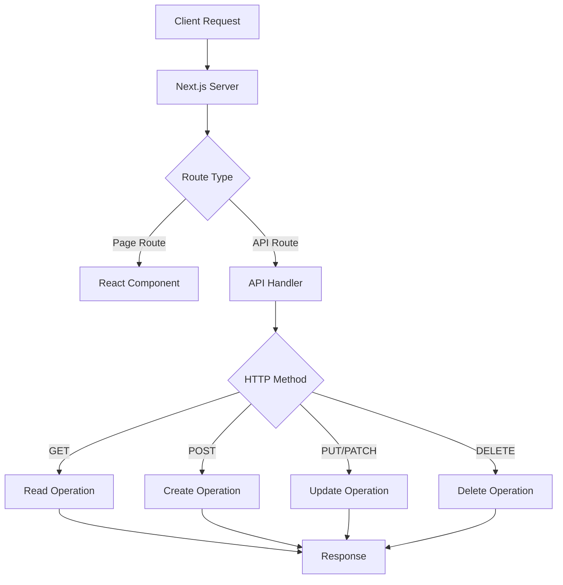
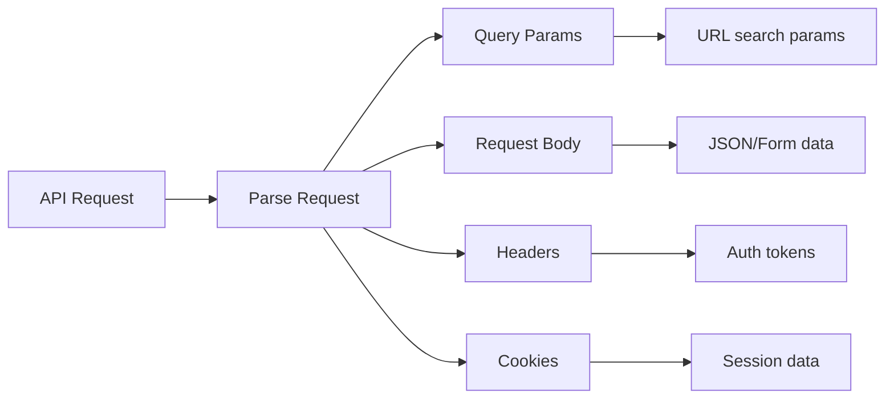

# How to Configure API Routes in Next.js

Author: [nawazdhandala](https://www.github.com/nawazdhandala)

Tags: Next.js, API Routes, Backend, JavaScript, TypeScript, REST API, Web Development

Description: A complete guide to setting up and configuring API routes in Next.js for building full-stack applications.

---

## Introduction

Next.js API routes allow you to build a complete backend within your Next.js application. These serverless functions handle API requests without requiring a separate server. This guide covers everything from basic setup to advanced patterns for production-ready APIs.

## API Routes Architecture



## Basic API Route Setup

### Pages Router (pages/api)

```javascript
// pages/api/hello.js
// Accessible at: /api/hello

export default function handler(req, res) {
  res.status(200).json({ message: 'Hello from Next.js API!' });
}
```

### App Router (app/api)

```javascript
// app/api/hello/route.js
// Accessible at: /api/hello

export async function GET(request) {
  return Response.json({ message: 'Hello from Next.js API!' });
}
```

## Handling HTTP Methods

### Pages Router Pattern

```javascript
// pages/api/users.js

export default async function handler(req, res) {
  const { method } = req;

  switch (method) {
    case 'GET':
      // Fetch all users
      try {
        const users = await getAllUsers();
        res.status(200).json(users);
      } catch (error) {
        res.status(500).json({ error: 'Failed to fetch users' });
      }
      break;

    case 'POST':
      // Create a new user
      try {
        const { name, email } = req.body;

        // Validate input
        if (!name || !email) {
          return res.status(400).json({ error: 'Name and email are required' });
        }

        const user = await createUser({ name, email });
        res.status(201).json(user);
      } catch (error) {
        res.status(500).json({ error: 'Failed to create user' });
      }
      break;

    default:
      res.setHeader('Allow', ['GET', 'POST']);
      res.status(405).json({ error: `Method ${method} not allowed` });
  }
}
```

### App Router Pattern

```javascript
// app/api/users/route.js

import { NextResponse } from 'next/server';

// GET /api/users
export async function GET(request) {
  try {
    const users = await getAllUsers();
    return NextResponse.json(users);
  } catch (error) {
    return NextResponse.json(
      { error: 'Failed to fetch users' },
      { status: 500 }
    );
  }
}

// POST /api/users
export async function POST(request) {
  try {
    const body = await request.json();
    const { name, email } = body;

    // Validate input
    if (!name || !email) {
      return NextResponse.json(
        { error: 'Name and email are required' },
        { status: 400 }
      );
    }

    const user = await createUser({ name, email });
    return NextResponse.json(user, { status: 201 });
  } catch (error) {
    return NextResponse.json(
      { error: 'Failed to create user' },
      { status: 500 }
    );
  }
}
```

## Dynamic API Routes

### Single Parameter Routes

```javascript
// pages/api/users/[id].js
// Matches: /api/users/1, /api/users/abc

export default async function handler(req, res) {
  const { id } = req.query;
  const { method } = req;

  switch (method) {
    case 'GET':
      const user = await getUserById(id);
      if (!user) {
        return res.status(404).json({ error: 'User not found' });
      }
      res.status(200).json(user);
      break;

    case 'PUT':
      const updatedUser = await updateUser(id, req.body);
      res.status(200).json(updatedUser);
      break;

    case 'DELETE':
      await deleteUser(id);
      res.status(204).end();
      break;

    default:
      res.setHeader('Allow', ['GET', 'PUT', 'DELETE']);
      res.status(405).end();
  }
}
```

```javascript
// app/api/users/[id]/route.js

import { NextResponse } from 'next/server';

export async function GET(request, { params }) {
  const { id } = params;

  const user = await getUserById(id);
  if (!user) {
    return NextResponse.json(
      { error: 'User not found' },
      { status: 404 }
    );
  }

  return NextResponse.json(user);
}

export async function PUT(request, { params }) {
  const { id } = params;
  const body = await request.json();

  const updatedUser = await updateUser(id, body);
  return NextResponse.json(updatedUser);
}

export async function DELETE(request, { params }) {
  const { id } = params;

  await deleteUser(id);
  return new Response(null, { status: 204 });
}
```

### Catch-All Routes

```javascript
// pages/api/posts/[...slug].js
// Matches: /api/posts/a, /api/posts/a/b, /api/posts/a/b/c

export default function handler(req, res) {
  const { slug } = req.query;
  // slug is an array: ['a'], ['a', 'b'], or ['a', 'b', 'c']

  res.status(200).json({ slug });
}
```

```javascript
// app/api/posts/[...slug]/route.js

export async function GET(request, { params }) {
  const { slug } = params;
  // slug is an array

  return Response.json({ slug });
}
```

## Query Parameters and Request Body



### Pages Router

```javascript
// pages/api/search.js

export default async function handler(req, res) {
  // Query parameters: /api/search?q=nextjs&page=1&limit=10
  const { q, page = '1', limit = '10' } = req.query;

  // Request body (for POST/PUT)
  const body = req.body;

  // Headers
  const authHeader = req.headers.authorization;
  const contentType = req.headers['content-type'];

  // Cookies
  const sessionId = req.cookies.sessionId;

  // Perform search
  const results = await searchPosts({
    query: q,
    page: parseInt(page, 10),
    limit: parseInt(limit, 10),
  });

  res.status(200).json(results);
}
```

### App Router

```javascript
// app/api/search/route.js

import { NextResponse } from 'next/server';
import { cookies, headers } from 'next/headers';

export async function GET(request) {
  // Query parameters
  const { searchParams } = new URL(request.url);
  const q = searchParams.get('q');
  const page = searchParams.get('page') || '1';
  const limit = searchParams.get('limit') || '10';

  // Headers
  const headersList = headers();
  const authHeader = headersList.get('authorization');

  // Cookies
  const cookieStore = cookies();
  const sessionId = cookieStore.get('sessionId')?.value;

  // Perform search
  const results = await searchPosts({
    query: q,
    page: parseInt(page, 10),
    limit: parseInt(limit, 10),
  });

  return NextResponse.json(results);
}

export async function POST(request) {
  // Parse JSON body
  const body = await request.json();

  // Parse form data
  // const formData = await request.formData();
  // const name = formData.get('name');

  return NextResponse.json({ received: body });
}
```

## Middleware and Authentication

### Custom Middleware Pattern

```javascript
// lib/middleware.js

export function withAuth(handler) {
  return async (req, res) => {
    const token = req.headers.authorization?.replace('Bearer ', '');

    if (!token) {
      return res.status(401).json({ error: 'Authentication required' });
    }

    try {
      const user = await verifyToken(token);
      req.user = user;
      return handler(req, res);
    } catch (error) {
      return res.status(401).json({ error: 'Invalid token' });
    }
  };
}

export function withValidation(schema) {
  return (handler) => async (req, res) => {
    try {
      const validated = schema.parse(req.body);
      req.body = validated;
      return handler(req, res);
    } catch (error) {
      return res.status(400).json({
        error: 'Validation failed',
        details: error.errors,
      });
    }
  };
}
```

```javascript
// pages/api/protected.js

import { withAuth } from '@/lib/middleware';

async function handler(req, res) {
  // req.user is available here
  const { user } = req;

  res.status(200).json({
    message: `Hello, ${user.name}!`,
    userId: user.id,
  });
}

export default withAuth(handler);
```

### App Router Middleware

```javascript
// middleware.js (at project root)

import { NextResponse } from 'next/server';

export function middleware(request) {
  // Check if it's an API route
  if (request.nextUrl.pathname.startsWith('/api/protected')) {
    const token = request.headers.get('authorization')?.replace('Bearer ', '');

    if (!token) {
      return NextResponse.json(
        { error: 'Authentication required' },
        { status: 401 }
      );
    }

    // Verify token and add user info to headers
    try {
      const user = verifyTokenSync(token);
      const requestHeaders = new Headers(request.headers);
      requestHeaders.set('x-user-id', user.id);
      requestHeaders.set('x-user-role', user.role);

      return NextResponse.next({
        request: {
          headers: requestHeaders,
        },
      });
    } catch {
      return NextResponse.json(
        { error: 'Invalid token' },
        { status: 401 }
      );
    }
  }

  return NextResponse.next();
}

export const config = {
  matcher: '/api/:path*',
};
```

## Error Handling

```javascript
// lib/api-error.js

export class ApiError extends Error {
  constructor(statusCode, message, details = null) {
    super(message);
    this.statusCode = statusCode;
    this.details = details;
  }
}

export function handleApiError(error, res) {
  console.error('API Error:', error);

  if (error instanceof ApiError) {
    return res.status(error.statusCode).json({
      error: error.message,
      details: error.details,
    });
  }

  // Handle specific error types
  if (error.name === 'ValidationError') {
    return res.status(400).json({
      error: 'Validation failed',
      details: error.errors,
    });
  }

  if (error.code === 'P2025') {
    // Prisma not found error
    return res.status(404).json({
      error: 'Resource not found',
    });
  }

  // Default server error
  return res.status(500).json({
    error: 'Internal server error',
  });
}
```

```javascript
// pages/api/users/[id].js

import { ApiError, handleApiError } from '@/lib/api-error';

export default async function handler(req, res) {
  try {
    const { id } = req.query;

    if (!id || isNaN(parseInt(id, 10))) {
      throw new ApiError(400, 'Invalid user ID');
    }

    const user = await getUserById(parseInt(id, 10));

    if (!user) {
      throw new ApiError(404, 'User not found');
    }

    res.status(200).json(user);
  } catch (error) {
    handleApiError(error, res);
  }
}
```

## CORS Configuration

```javascript
// lib/cors.js

export function cors(handler) {
  return async (req, res) => {
    // Set CORS headers
    res.setHeader('Access-Control-Allow-Origin', process.env.ALLOWED_ORIGIN || '*');
    res.setHeader('Access-Control-Allow-Methods', 'GET, POST, PUT, DELETE, OPTIONS');
    res.setHeader('Access-Control-Allow-Headers', 'Content-Type, Authorization');
    res.setHeader('Access-Control-Max-Age', '86400');

    // Handle preflight request
    if (req.method === 'OPTIONS') {
      res.status(200).end();
      return;
    }

    return handler(req, res);
  };
}
```

```javascript
// pages/api/public.js

import { cors } from '@/lib/cors';

async function handler(req, res) {
  res.status(200).json({ data: 'This is publicly accessible' });
}

export default cors(handler);
```

```javascript
// next.config.js - Global CORS configuration

module.exports = {
  async headers() {
    return [
      {
        // Apply to all API routes
        source: '/api/:path*',
        headers: [
          { key: 'Access-Control-Allow-Origin', value: '*' },
          { key: 'Access-Control-Allow-Methods', value: 'GET,POST,PUT,DELETE,OPTIONS' },
          { key: 'Access-Control-Allow-Headers', value: 'Content-Type, Authorization' },
        ],
      },
    ];
  },
};
```

## Rate Limiting

```javascript
// lib/rate-limit.js

const rateLimit = new Map();

export function rateLimiter(options = {}) {
  const {
    interval = 60 * 1000,  // 1 minute
    uniqueTokenPerInterval = 500,
    limit = 10,
  } = options;

  return {
    check: (req) => {
      return new Promise((resolve, reject) => {
        // Get client identifier
        const ip = req.headers['x-forwarded-for'] ||
                   req.connection.remoteAddress ||
                   'unknown';

        const tokenKey = `${ip}`;
        const now = Date.now();
        const windowStart = now - interval;

        // Get existing record
        const record = rateLimit.get(tokenKey) || { count: 0, resetAt: now + interval };

        // Reset if window expired
        if (now > record.resetAt) {
          record.count = 0;
          record.resetAt = now + interval;
        }

        record.count += 1;
        rateLimit.set(tokenKey, record);

        // Clean up old entries periodically
        if (rateLimit.size > uniqueTokenPerInterval) {
          for (const [key, value] of rateLimit.entries()) {
            if (now > value.resetAt) {
              rateLimit.delete(key);
            }
          }
        }

        if (record.count > limit) {
          reject({
            remaining: 0,
            resetAt: record.resetAt,
          });
        } else {
          resolve({
            remaining: limit - record.count,
            resetAt: record.resetAt,
          });
        }
      });
    },
  };
}
```

```javascript
// pages/api/limited.js

import { rateLimiter } from '@/lib/rate-limit';

const limiter = rateLimiter({
  interval: 60 * 1000,  // 1 minute
  limit: 10,            // 10 requests per minute
});

export default async function handler(req, res) {
  try {
    const { remaining, resetAt } = await limiter.check(req);

    res.setHeader('X-RateLimit-Remaining', remaining);
    res.setHeader('X-RateLimit-Reset', resetAt);

    // Your API logic here
    res.status(200).json({ message: 'Success' });
  } catch (rateLimitError) {
    res.setHeader('X-RateLimit-Remaining', 0);
    res.setHeader('X-RateLimit-Reset', rateLimitError.resetAt);
    res.setHeader('Retry-After', Math.ceil((rateLimitError.resetAt - Date.now()) / 1000));

    res.status(429).json({
      error: 'Too many requests',
      retryAfter: Math.ceil((rateLimitError.resetAt - Date.now()) / 1000),
    });
  }
}
```

## File Uploads

```javascript
// pages/api/upload.js

import formidable from 'formidable';
import fs from 'fs';
import path from 'path';

// Disable default body parser
export const config = {
  api: {
    bodyParser: false,
  },
};

export default async function handler(req, res) {
  if (req.method !== 'POST') {
    return res.status(405).json({ error: 'Method not allowed' });
  }

  const uploadDir = path.join(process.cwd(), 'public', 'uploads');

  // Ensure upload directory exists
  if (!fs.existsSync(uploadDir)) {
    fs.mkdirSync(uploadDir, { recursive: true });
  }

  const form = formidable({
    uploadDir,
    keepExtensions: true,
    maxFileSize: 10 * 1024 * 1024, // 10MB
    filter: ({ mimetype }) => {
      // Only allow images
      return mimetype && mimetype.includes('image');
    },
  });

  try {
    const [fields, files] = await form.parse(req);

    const uploadedFile = files.file?.[0];
    if (!uploadedFile) {
      return res.status(400).json({ error: 'No file uploaded' });
    }

    // Generate public URL
    const fileName = path.basename(uploadedFile.filepath);
    const publicUrl = `/uploads/${fileName}`;

    res.status(200).json({
      message: 'File uploaded successfully',
      url: publicUrl,
      size: uploadedFile.size,
      type: uploadedFile.mimetype,
    });
  } catch (error) {
    console.error('Upload error:', error);
    res.status(500).json({ error: 'Upload failed' });
  }
}
```

## API Response Helpers

```javascript
// lib/api-response.js

export function success(res, data, statusCode = 200) {
  return res.status(statusCode).json({
    success: true,
    data,
  });
}

export function created(res, data) {
  return success(res, data, 201);
}

export function noContent(res) {
  return res.status(204).end();
}

export function error(res, message, statusCode = 500, details = null) {
  return res.status(statusCode).json({
    success: false,
    error: {
      message,
      details,
    },
  });
}

export function badRequest(res, message, details = null) {
  return error(res, message, 400, details);
}

export function unauthorized(res, message = 'Unauthorized') {
  return error(res, message, 401);
}

export function forbidden(res, message = 'Forbidden') {
  return error(res, message, 403);
}

export function notFound(res, message = 'Not found') {
  return error(res, message, 404);
}

export function paginated(res, data, pagination) {
  return res.status(200).json({
    success: true,
    data,
    pagination: {
      page: pagination.page,
      limit: pagination.limit,
      total: pagination.total,
      totalPages: Math.ceil(pagination.total / pagination.limit),
      hasMore: pagination.page * pagination.limit < pagination.total,
    },
  });
}
```

```javascript
// pages/api/posts.js

import { success, created, badRequest, paginated } from '@/lib/api-response';

export default async function handler(req, res) {
  if (req.method === 'GET') {
    const page = parseInt(req.query.page || '1', 10);
    const limit = parseInt(req.query.limit || '10', 10);

    const { posts, total } = await getPosts({ page, limit });

    return paginated(res, posts, { page, limit, total });
  }

  if (req.method === 'POST') {
    const { title, content } = req.body;

    if (!title || !content) {
      return badRequest(res, 'Title and content are required');
    }

    const post = await createPost({ title, content });
    return created(res, post);
  }
}
```

## Testing API Routes

```javascript
// __tests__/api/users.test.js

import { createMocks } from 'node-mocks-http';
import handler from '@/pages/api/users';

describe('/api/users', () => {
  it('returns users on GET', async () => {
    const { req, res } = createMocks({
      method: 'GET',
    });

    await handler(req, res);

    expect(res._getStatusCode()).toBe(200);
    expect(JSON.parse(res._getData())).toHaveProperty('data');
  });

  it('creates user on POST', async () => {
    const { req, res } = createMocks({
      method: 'POST',
      body: {
        name: 'John Doe',
        email: 'john@example.com',
      },
    });

    await handler(req, res);

    expect(res._getStatusCode()).toBe(201);
    const data = JSON.parse(res._getData());
    expect(data.data.name).toBe('John Doe');
  });

  it('returns 400 on invalid POST', async () => {
    const { req, res } = createMocks({
      method: 'POST',
      body: {},
    });

    await handler(req, res);

    expect(res._getStatusCode()).toBe(400);
  });
});
```

## Summary

Configuring API routes in Next.js enables you to build full-stack applications efficiently. Key points:

1. Use the Pages Router (`pages/api`) or App Router (`app/api`) based on your project structure
2. Handle different HTTP methods appropriately
3. Implement dynamic routes for resource-based APIs
4. Add authentication middleware for protected endpoints
5. Configure CORS for cross-origin requests
6. Implement rate limiting to prevent abuse
7. Use consistent error handling and response formats
8. Test your API routes thoroughly

By following these patterns, you can build robust, maintainable APIs that scale with your application.
