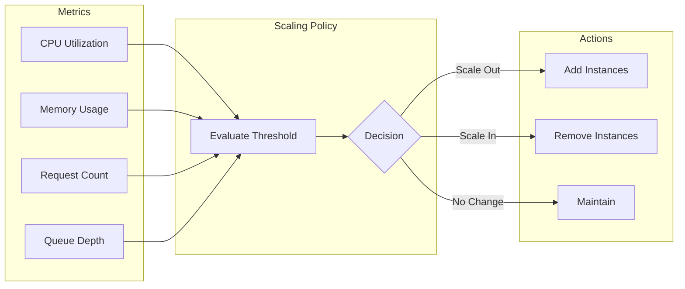

# How to Configure Auto-Scaling Policies

Author: [nawazdhandala](https://www.github.com/nawazdhandala)

Tags: Auto-Scaling, AWS, Kubernetes, Cloud, Infrastructure, DevOps, Performance

Description: A comprehensive guide to configuring auto-scaling policies across cloud platforms, including target tracking, step scaling, and predictive scaling strategies.

---

Auto-scaling automatically adjusts compute capacity based on demand. Properly configured scaling policies keep your application responsive during traffic spikes while minimizing costs during low-traffic periods. This guide covers auto-scaling configuration across major platforms.

## Auto-Scaling Concepts



## AWS Auto Scaling

### Target Tracking Policy

Target tracking is the simplest and most effective policy type. It automatically adjusts capacity to maintain a specified metric at a target value.

```yaml
# CloudFormation for EC2 Auto Scaling
Resources:
  WebServerGroup:
    Type: AWS::AutoScaling::AutoScalingGroup
    Properties:
      AutoScalingGroupName: web-servers
      MinSize: 2
      MaxSize: 20
      DesiredCapacity: 4
      LaunchTemplate:
        LaunchTemplateId: !Ref WebServerLaunchTemplate
        Version: !GetAtt WebServerLaunchTemplate.LatestVersionNumber
      VPCZoneIdentifier:
        - !Ref PrivateSubnet1
        - !Ref PrivateSubnet2
      TargetGroupARNs:
        - !Ref WebTargetGroup
      HealthCheckType: ELB
      HealthCheckGracePeriod: 300
      Tags:
        - Key: Name
          Value: web-server
          PropagateAtLaunch: true

  # Target tracking for CPU utilization
  CPUTargetTrackingPolicy:
    Type: AWS::AutoScaling::ScalingPolicy
    Properties:
      AutoScalingGroupName: !Ref WebServerGroup
      PolicyType: TargetTrackingScaling
      TargetTrackingConfiguration:
        # Maintain 60% average CPU across all instances
        TargetValue: 60.0
        PredefinedMetricSpecification:
          PredefinedMetricType: ASGAverageCPUUtilization
        # Wait 5 minutes before scaling in
        ScaleInCooldown: 300
        # Scale out quickly in 1 minute
        ScaleOutCooldown: 60
```

### Step Scaling Policy

Step scaling provides more control with different scaling amounts based on metric thresholds.

```yaml
# Step scaling for more granular control
Resources:
  StepScalingPolicy:
    Type: AWS::AutoScaling::ScalingPolicy
    Properties:
      AutoScalingGroupName: !Ref WebServerGroup
      PolicyType: StepScaling
      AdjustmentType: ChangeInCapacity
      MetricAggregationType: Average
      EstimatedInstanceWarmup: 120
      StepAdjustments:
        # CPU 60-70%: add 1 instance
        - MetricIntervalLowerBound: 0
          MetricIntervalUpperBound: 10
          ScalingAdjustment: 1
        # CPU 70-80%: add 2 instances
        - MetricIntervalLowerBound: 10
          MetricIntervalUpperBound: 20
          ScalingAdjustment: 2
        # CPU 80%+: add 4 instances
        - MetricIntervalLowerBound: 20
          ScalingAdjustment: 4

  # CloudWatch alarm triggers the step scaling
  HighCPUAlarm:
    Type: AWS::CloudWatch::Alarm
    Properties:
      AlarmName: high-cpu-alarm
      MetricName: CPUUtilization
      Namespace: AWS/EC2
      Statistic: Average
      Period: 60
      EvaluationPeriods: 2
      Threshold: 60
      ComparisonOperator: GreaterThanThreshold
      Dimensions:
        - Name: AutoScalingGroupName
          Value: !Ref WebServerGroup
      AlarmActions:
        - !Ref StepScalingPolicy
```

### Predictive Scaling

Predictive scaling uses machine learning to forecast traffic and pre-scale capacity.

```yaml
# Predictive scaling policy
Resources:
  PredictiveScalingPolicy:
    Type: AWS::AutoScaling::ScalingPolicy
    Properties:
      AutoScalingGroupName: !Ref WebServerGroup
      PolicyType: PredictiveScaling
      PredictiveScalingConfiguration:
        # Scale based on prediction, with actual data as backup
        Mode: ForecastAndScale

        # Analyze 14 days of history
        SchedulingBufferTime: 300

        MetricSpecifications:
          - TargetValue: 60.0
            PredefinedMetricPairSpecification:
              PredefinedMetricType: ASGCPUUtilization

        # Scale proactively before predicted demand
        MaxCapacityBreachBehavior: IncreaseMaxCapacity
        MaxCapacityBuffer: 10
```

## AWS Application Auto Scaling

For services like ECS, DynamoDB, and Lambda, use Application Auto Scaling.

### ECS Service Scaling

```yaml
# ECS Service Auto Scaling
Resources:
  ECSService:
    Type: AWS::ECS::Service
    Properties:
      ServiceName: web-api
      Cluster: !Ref ECSCluster
      TaskDefinition: !Ref TaskDefinition
      DesiredCount: 2
      LaunchType: FARGATE

  # Register the ECS service as a scalable target
  ServiceScalableTarget:
    Type: AWS::ApplicationAutoScaling::ScalableTarget
    Properties:
      MaxCapacity: 20
      MinCapacity: 2
      ResourceId: !Sub service/${ECSCluster}/${ECSService.Name}
      RoleARN: !GetAtt AutoScalingRole.Arn
      ScalableDimension: ecs:service:DesiredCount
      ServiceNamespace: ecs

  # Scale based on requests per task
  RequestCountPolicy:
    Type: AWS::ApplicationAutoScaling::ScalingPolicy
    Properties:
      PolicyName: RequestCountPolicy
      PolicyType: TargetTrackingScaling
      ScalingTargetId: !Ref ServiceScalableTarget
      TargetTrackingScalingPolicyConfiguration:
        # Target 1000 requests per task per minute
        TargetValue: 1000
        ScaleInCooldown: 300
        ScaleOutCooldown: 60
        CustomizedMetricSpecification:
          MetricName: RequestCountPerTarget
          Namespace: AWS/ApplicationELB
          Statistic: Sum
          Dimensions:
            - Name: TargetGroup
              Value: !GetAtt TargetGroup.TargetGroupFullName
```

### DynamoDB Scaling

```yaml
# DynamoDB Auto Scaling
Resources:
  DynamoDBTable:
    Type: AWS::DynamoDB::Table
    Properties:
      TableName: orders
      BillingMode: PROVISIONED
      ProvisionedThroughput:
        ReadCapacityUnits: 10
        WriteCapacityUnits: 10
      AttributeDefinitions:
        - AttributeName: orderId
          AttributeType: S
      KeySchema:
        - AttributeName: orderId
          KeyType: HASH

  # Read capacity scaling
  ReadScalableTarget:
    Type: AWS::ApplicationAutoScaling::ScalableTarget
    Properties:
      MaxCapacity: 1000
      MinCapacity: 5
      ResourceId: !Sub table/${DynamoDBTable}
      ScalableDimension: dynamodb:table:ReadCapacityUnits
      ServiceNamespace: dynamodb

  ReadScalingPolicy:
    Type: AWS::ApplicationAutoScaling::ScalingPolicy
    Properties:
      PolicyName: ReadAutoScaling
      PolicyType: TargetTrackingScaling
      ScalingTargetId: !Ref ReadScalableTarget
      TargetTrackingScalingPolicyConfiguration:
        # Target 70% utilization of provisioned capacity
        TargetValue: 70.0
        PredefinedMetricSpecification:
          PredefinedMetricType: DynamoDBReadCapacityUtilization
        ScaleInCooldown: 60
        ScaleOutCooldown: 60
```

## Kubernetes Horizontal Pod Autoscaler

Kubernetes HPA scales pods based on metrics.

```yaml
# HPA with custom metrics
apiVersion: autoscaling/v2
kind: HorizontalPodAutoscaler
metadata:
  name: web-api
  namespace: production
spec:
  scaleTargetRef:
    apiVersion: apps/v1
    kind: Deployment
    name: web-api

  # Scaling boundaries
  minReplicas: 3
  maxReplicas: 50

  metrics:
    # CPU-based scaling
    - type: Resource
      resource:
        name: cpu
        target:
          type: Utilization
          averageUtilization: 70

    # Memory-based scaling
    - type: Resource
      resource:
        name: memory
        target:
          type: Utilization
          averageUtilization: 80

    # Custom metric: requests per second per pod
    - type: Pods
      pods:
        metric:
          name: http_requests_per_second
        target:
          type: AverageValue
          averageValue: 500

  # Scaling behavior configuration
  behavior:
    scaleUp:
      # Scale up aggressively
      stabilizationWindowSeconds: 0
      policies:
        - type: Percent
          value: 100
          periodSeconds: 60
        - type: Pods
          value: 5
          periodSeconds: 60
      selectPolicy: Max

    scaleDown:
      # Scale down conservatively
      stabilizationWindowSeconds: 300
      policies:
        - type: Percent
          value: 10
          periodSeconds: 60
      selectPolicy: Min
```

## KEDA: Event-Driven Autoscaling

KEDA enables scaling based on event sources like message queues.

```yaml
# KEDA ScaledObject for queue-based scaling
apiVersion: keda.sh/v1alpha1
kind: ScaledObject
metadata:
  name: order-processor
  namespace: production
spec:
  scaleTargetRef:
    name: order-processor

  # Can scale to zero when no messages
  minReplicaCount: 0
  maxReplicaCount: 100

  # Cooldown periods
  cooldownPeriod: 300
  pollingInterval: 15

  triggers:
    # Scale based on AWS SQS queue depth
    - type: aws-sqs-queue
      metadata:
        queueURL: https://sqs.us-east-1.amazonaws.com/123456789/orders
        queueLength: "30"  # Target 30 messages per pod
        awsRegion: us-east-1
      authenticationRef:
        name: aws-credentials

---
# KEDA trigger for Kafka consumer lag
apiVersion: keda.sh/v1alpha1
kind: ScaledObject
metadata:
  name: kafka-consumer
  namespace: production
spec:
  scaleTargetRef:
    name: kafka-consumer
  minReplicaCount: 1
  maxReplicaCount: 50
  triggers:
    - type: kafka
      metadata:
        bootstrapServers: kafka.production.svc:9092
        consumerGroup: order-events
        topic: orders
        lagThreshold: "100"  # Scale when lag exceeds 100
```

## Scaling Policy Best Practices

### 1. Set Appropriate Cooldown Periods

```mermaid
gantt
    title Scaling Timeline with Cooldowns
    dateFormat X
    axisFormat %S

    section Events
    Traffic Spike          :0, 10
    Scale Out Triggered    :10, 15
    Instances Launching    :15, 60
    Scale Out Cooldown     :60, 120
    Traffic Stabilizes     :90, 100
    Scale In Cooldown      :120, 420
```



```yaml
# Asymmetric cooldowns - fast out, slow in
TargetTrackingConfiguration:
  TargetValue: 60.0
  ScaleOutCooldown: 60    # 1 minute - respond quickly to load
  ScaleInCooldown: 300    # 5 minutes - avoid premature scale-in
```

### 2. Use Multiple Metrics

```yaml
# Scale based on multiple metrics
Resources:
  CPUPolicy:
    Type: AWS::AutoScaling::ScalingPolicy
    Properties:
      PolicyType: TargetTrackingScaling
      TargetTrackingConfiguration:
        TargetValue: 60.0
        PredefinedMetricSpecification:
          PredefinedMetricType: ASGAverageCPUUtilization

  RequestCountPolicy:
    Type: AWS::AutoScaling::ScalingPolicy
    Properties:
      PolicyType: TargetTrackingScaling
      TargetTrackingConfiguration:
        TargetValue: 1000
        PredefinedMetricSpecification:
          PredefinedMetricType: ALBRequestCountPerTarget
          ResourceLabel: !Sub ${LoadBalancer.LoadBalancerFullName}/${TargetGroup.TargetGroupFullName}
```

### 3. Account for Instance Warmup

```yaml
# Give new instances time to initialize
AutoScalingGroup:
  Properties:
    # Time for instance to start and pass health checks
    HealthCheckGracePeriod: 300

ScalingPolicy:
  Properties:
    # Time for instance to be ready to receive traffic
    EstimatedInstanceWarmup: 180
```

### 4. Set Realistic Min/Max Values

```python
# Calculate min instances for high availability
def calculate_min_instances(
    availability_target: float,  # e.g., 99.9%
    instance_failure_rate: float,  # e.g., 0.01 per hour
    recovery_time_hours: float  # e.g., 0.1 (6 minutes)
) -> int:
    """
    Calculate minimum instances needed to meet availability target.
    """
    import math

    # Probability of at least one instance surviving
    # P(survival) = 1 - P(all fail)
    # P(all fail) = (failure_rate * recovery_time)^n

    failure_prob = instance_failure_rate * recovery_time_hours
    target_survival = availability_target

    # Solve for n: 1 - failure_prob^n >= target_survival
    # n >= log(1 - target_survival) / log(failure_prob)

    min_instances = math.ceil(
        math.log(1 - target_survival) / math.log(failure_prob)
    )

    return max(2, min_instances)  # At least 2 for HA

# Example: 99.9% availability
print(calculate_min_instances(0.999, 0.01, 0.1))  # Output: 2
```

## Monitoring and Alerting

Set up alerts for scaling issues:

```yaml
# CloudWatch alarms for scaling health
Resources:
  AtMaxCapacityAlarm:
    Type: AWS::CloudWatch::Alarm
    Properties:
      AlarmName: asg-at-max-capacity
      AlarmDescription: ASG is at maximum capacity
      MetricName: GroupDesiredCapacity
      Namespace: AWS/AutoScaling
      Statistic: Average
      Period: 300
      EvaluationPeriods: 3
      Threshold: 19  # Max is 20
      ComparisonOperator: GreaterThanOrEqualToThreshold
      Dimensions:
        - Name: AutoScalingGroupName
          Value: !Ref WebServerGroup
      AlarmActions:
        - !Ref OpsNotificationTopic

  ScalingActivityAlarm:
    Type: AWS::CloudWatch::Alarm
    Properties:
      AlarmName: high-scaling-activity
      AlarmDescription: Frequent scaling may indicate instability
      MetricName: GroupTotalInstances
      Namespace: AWS/AutoScaling
      Statistic: SampleCount
      Period: 3600  # 1 hour
      EvaluationPeriods: 1
      Threshold: 10  # More than 10 scaling actions per hour
      ComparisonOperator: GreaterThanThreshold
```

## Cost Optimization

Use scheduled scaling to reduce costs during known low-traffic periods:

```yaml
# Scheduled scaling for predictable patterns
Resources:
  ScaleDownNight:
    Type: AWS::AutoScaling::ScheduledAction
    Properties:
      AutoScalingGroupName: !Ref WebServerGroup
      # Scale down at 10 PM
      Recurrence: "0 22 * * *"
      MinSize: 2
      MaxSize: 10
      DesiredCapacity: 2

  ScaleUpMorning:
    Type: AWS::AutoScaling::ScheduledAction
    Properties:
      AutoScalingGroupName: !Ref WebServerGroup
      # Scale up at 6 AM
      Recurrence: "0 6 * * *"
      MinSize: 4
      MaxSize: 20
      DesiredCapacity: 6
```

---

Auto-scaling policies are essential for maintaining performance and controlling costs. Start with target tracking for simplicity, add step scaling for more control, and use predictive scaling when you have consistent traffic patterns. Monitor scaling activity to catch configuration issues early and adjust policies based on real-world behavior.
