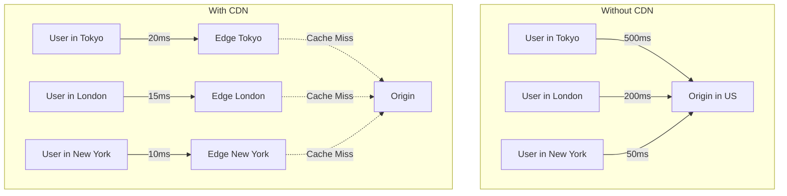
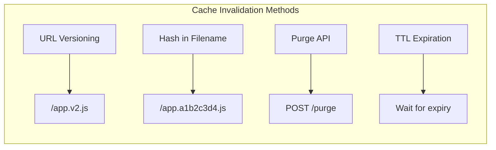

# How to Configure CDN for Performance

Author: [nawazdhandala](https://www.github.com/nawazdhandala)

Tags: CDN, Performance, Caching, Cloudflare, AWS CloudFront, Infrastructure, Web Performance

Description: A complete guide to configuring a CDN for optimal performance, including caching strategies, cache invalidation, and edge computing.

---

A Content Delivery Network (CDN) can dramatically improve your application's performance by serving content from locations geographically closer to your users. In this guide, we will cover how to configure a CDN properly to maximize performance gains.

## How CDNs Work



## Step 1: Choose What to Cache

Not everything should be cached the same way:

| Content Type | Cache Duration | Cache-Control Header |
|-------------|----------------|---------------------|
| Static assets (JS, CSS) | 1 year | `public, max-age=31536000, immutable` |
| Images | 1 month | `public, max-age=2592000` |
| Fonts | 1 year | `public, max-age=31536000, immutable` |
| HTML pages | Short or no cache | `no-cache` or `max-age=300` |
| API responses | Varies | `private, max-age=60` or `no-store` |
| User-specific data | No cache | `private, no-store` |

### Setting Cache Headers

```nginx
# nginx.conf - Cache headers for different content types

server {
    listen 80;
    server_name example.com;

    # Static assets with cache busting (hash in filename)
    location ~* \.(js|css)$ {
        expires 1y;
        add_header Cache-Control "public, max-age=31536000, immutable";
        add_header Vary "Accept-Encoding";
    }

    # Images
    location ~* \.(jpg|jpeg|png|gif|webp|svg|ico)$ {
        expires 30d;
        add_header Cache-Control "public, max-age=2592000";
    }

    # Fonts
    location ~* \.(woff|woff2|ttf|otf|eot)$ {
        expires 1y;
        add_header Cache-Control "public, max-age=31536000, immutable";
        add_header Access-Control-Allow-Origin "*";
    }

    # HTML - short cache for dynamic content
    location ~* \.html$ {
        add_header Cache-Control "no-cache, must-revalidate";
    }

    # API endpoints - no caching
    location /api/ {
        add_header Cache-Control "private, no-store, no-cache";
        proxy_pass http://backend;
    }
}
```

### Express.js Cache Headers

```javascript
// cache-middleware.js
// Express middleware for setting cache headers

const express = require('express');
const path = require('path');

const app = express();

// Middleware to set cache headers based on file type
function setCacheHeaders(req, res, next) {
    const ext = path.extname(req.path).toLowerCase();

    // Static assets with hash in filename
    if (req.path.match(/\.[a-f0-9]{8,}\.(js|css)$/)) {
        res.set('Cache-Control', 'public, max-age=31536000, immutable');
    }
    // Regular JS/CSS files
    else if (['.js', '.css'].includes(ext)) {
        res.set('Cache-Control', 'public, max-age=86400');
    }
    // Images
    else if (['.jpg', '.jpeg', '.png', '.gif', '.webp', '.svg'].includes(ext)) {
        res.set('Cache-Control', 'public, max-age=2592000');
    }
    // Fonts
    else if (['.woff', '.woff2', '.ttf', '.otf'].includes(ext)) {
        res.set('Cache-Control', 'public, max-age=31536000, immutable');
    }
    // HTML
    else if (ext === '.html') {
        res.set('Cache-Control', 'no-cache');
    }

    next();
}

app.use(setCacheHeaders);
app.use(express.static('public'));

// API routes - no caching
app.use('/api', (req, res, next) => {
    res.set('Cache-Control', 'private, no-store');
    next();
});
```

## Step 2: Configure Your CDN

### Cloudflare Configuration

```javascript
// cloudflare-worker.js
// Edge worker for custom caching logic

addEventListener('fetch', event => {
    event.respondWith(handleRequest(event.request));
});

async function handleRequest(request) {
    const url = new URL(request.url);

    // Define cache key
    const cacheKey = new Request(url.toString(), request);
    const cache = caches.default;

    // Check cache first
    let response = await cache.match(cacheKey);

    if (!response) {
        // Cache miss - fetch from origin
        response = await fetch(request);

        // Clone response to modify headers
        response = new Response(response.body, response);

        // Set caching based on content type
        const contentType = response.headers.get('content-type') || '';

        if (contentType.includes('text/html')) {
            // Short cache for HTML
            response.headers.set('Cache-Control', 'public, max-age=300');
        } else if (url.pathname.match(/\.(js|css)$/)) {
            // Long cache for static assets
            response.headers.set('Cache-Control', 'public, max-age=31536000, immutable');
        }

        // Store in edge cache
        event.waitUntil(cache.put(cacheKey, response.clone()));
    }

    return response;
}
```

### Cloudflare Page Rules (via API)

```bash
# Create cache rules using Cloudflare API

# Cache everything rule for static assets
curl -X POST "https://api.cloudflare.com/client/v4/zones/{zone_id}/pagerules" \
    -H "Authorization: Bearer {api_token}" \
    -H "Content-Type: application/json" \
    --data '{
        "targets": [
            {
                "target": "url",
                "constraint": {
                    "operator": "matches",
                    "value": "*example.com/static/*"
                }
            }
        ],
        "actions": [
            {
                "id": "cache_level",
                "value": "cache_everything"
            },
            {
                "id": "edge_cache_ttl",
                "value": 2592000
            },
            {
                "id": "browser_cache_ttl",
                "value": 2592000
            }
        ],
        "priority": 1,
        "status": "active"
    }'
```

### AWS CloudFront Configuration

```yaml
# cloudfront-distribution.yaml
# CloudFormation template for CloudFront distribution

AWSTemplateFormatVersion: '2010-09-09'
Description: CloudFront distribution with optimized caching

Resources:
  CloudFrontDistribution:
    Type: AWS::CloudFront::Distribution
    Properties:
      DistributionConfig:
        Enabled: true
        HttpVersion: http2and3
        PriceClass: PriceClass_100

        Origins:
          - Id: S3Origin
            DomainName: !Sub "${S3Bucket}.s3.amazonaws.com"
            S3OriginConfig:
              OriginAccessIdentity: !Sub "origin-access-identity/cloudfront/${CloudFrontOAI}"

          - Id: APIOrigin
            DomainName: api.example.com
            CustomOriginConfig:
              HTTPSPort: 443
              OriginProtocolPolicy: https-only
              OriginSSLProtocols:
                - TLSv1.2

        DefaultCacheBehavior:
          TargetOriginId: S3Origin
          ViewerProtocolPolicy: redirect-to-https
          CachePolicyId: !Ref StaticAssetsCachePolicy
          Compress: true

        CacheBehaviors:
          # Static assets - long cache
          - PathPattern: "/static/*"
            TargetOriginId: S3Origin
            ViewerProtocolPolicy: redirect-to-https
            CachePolicyId: !Ref StaticAssetsCachePolicy
            Compress: true

          # API - no caching
          - PathPattern: "/api/*"
            TargetOriginId: APIOrigin
            ViewerProtocolPolicy: redirect-to-https
            CachePolicyId: !Ref APICachePolicy
            AllowedMethods:
              - GET
              - HEAD
              - OPTIONS
              - PUT
              - POST
              - PATCH
              - DELETE

  StaticAssetsCachePolicy:
    Type: AWS::CloudFront::CachePolicy
    Properties:
      CachePolicyConfig:
        Name: StaticAssetsPolicy
        DefaultTTL: 86400
        MaxTTL: 31536000
        MinTTL: 1
        ParametersInCacheKeyAndForwardedToOrigin:
          CookiesConfig:
            CookieBehavior: none
          HeadersConfig:
            HeaderBehavior: none
          QueryStringsConfig:
            QueryStringBehavior: none
          EnableAcceptEncodingGzip: true
          EnableAcceptEncodingBrotli: true

  APICachePolicy:
    Type: AWS::CloudFront::CachePolicy
    Properties:
      CachePolicyConfig:
        Name: APIPolicy
        DefaultTTL: 0
        MaxTTL: 1
        MinTTL: 0
        ParametersInCacheKeyAndForwardedToOrigin:
          CookiesConfig:
            CookieBehavior: all
          HeadersConfig:
            HeaderBehavior: whitelist
            Headers:
              - Authorization
              - Accept
          QueryStringsConfig:
            QueryStringBehavior: all
          EnableAcceptEncodingGzip: true
```

## Step 3: Cache Invalidation Strategies



### File Hashing in Build Process

```javascript
// webpack.config.js
// Add content hash to filenames for cache busting

module.exports = {
    output: {
        filename: '[name].[contenthash].js',
        chunkFilename: '[name].[contenthash].chunk.js',
        assetModuleFilename: 'assets/[name].[contenthash][ext]',
        clean: true
    },

    optimization: {
        moduleIds: 'deterministic',
        runtimeChunk: 'single',
        splitChunks: {
            cacheGroups: {
                vendor: {
                    test: /[\\/]node_modules[\\/]/,
                    name: 'vendors',
                    chunks: 'all'
                }
            }
        }
    }
};
```

### Programmatic Cache Purge

```python
# cache_purge.py
# Purge CDN cache after deployment

import requests
import os

class CDNCachePurger:
    def __init__(self):
        self.cloudflare_token = os.environ.get('CLOUDFLARE_API_TOKEN')
        self.cloudflare_zone = os.environ.get('CLOUDFLARE_ZONE_ID')

    def purge_cloudflare(self, urls=None, purge_all=False):
        """Purge Cloudflare cache."""
        endpoint = f"https://api.cloudflare.com/client/v4/zones/{self.cloudflare_zone}/purge_cache"
        headers = {
            "Authorization": f"Bearer {self.cloudflare_token}",
            "Content-Type": "application/json"
        }

        if purge_all:
            data = {"purge_everything": True}
        elif urls:
            data = {"files": urls}
        else:
            raise ValueError("Must specify urls or purge_all=True")

        response = requests.post(endpoint, headers=headers, json=data)
        response.raise_for_status()

        result = response.json()
        if result.get('success'):
            print(f"Successfully purged cache")
        else:
            print(f"Purge failed: {result.get('errors')}")

        return result

    def purge_cloudfront(self, distribution_id, paths):
        """Purge CloudFront cache."""
        import boto3
        import time

        client = boto3.client('cloudfront')

        response = client.create_invalidation(
            DistributionId=distribution_id,
            InvalidationBatch={
                'Paths': {
                    'Quantity': len(paths),
                    'Items': paths
                },
                'CallerReference': str(time.time())
            }
        )

        invalidation_id = response['Invalidation']['Id']
        print(f"Created invalidation: {invalidation_id}")

        return invalidation_id

# Usage in deployment script
if __name__ == '__main__':
    purger = CDNCachePurger()

    # Purge specific URLs after deployment
    purger.purge_cloudflare(urls=[
        "https://example.com/",
        "https://example.com/index.html",
        "https://example.com/manifest.json"
    ])
```

## Step 4: Advanced CDN Features

### Edge Computing for Dynamic Content

```javascript
// edge-personalization.js
// Cloudflare Worker for edge personalization

addEventListener('fetch', event => {
    event.respondWith(handleRequest(event.request));
});

async function handleRequest(request) {
    const url = new URL(request.url);

    // Get user's country from Cloudflare headers
    const country = request.headers.get('CF-IPCountry') || 'US';
    const city = request.cf?.city || 'Unknown';

    // Fetch base HTML from origin
    let response = await fetch(request);
    let html = await response.text();

    // Personalize content at the edge
    html = html.replace('{{USER_COUNTRY}}', country);
    html = html.replace('{{USER_CITY}}', city);

    // Set appropriate pricing based on region
    const pricing = getPricingForRegion(country);
    html = html.replace('{{PRICE}}', pricing.price);
    html = html.replace('{{CURRENCY}}', pricing.currency);

    return new Response(html, {
        headers: {
            'Content-Type': 'text/html',
            'Cache-Control': 'private, max-age=60'
        }
    });
}

function getPricingForRegion(country) {
    const pricing = {
        'US': { price: '99', currency: 'USD' },
        'GB': { price: '79', currency: 'GBP' },
        'EU': { price: '89', currency: 'EUR' },
        'default': { price: '99', currency: 'USD' }
    };

    return pricing[country] || pricing['default'];
}
```

### Stale-While-Revalidate Pattern

```javascript
// stale-while-revalidate.js
// Serve stale content while fetching fresh content

addEventListener('fetch', event => {
    event.respondWith(handleRequest(event));
});

async function handleRequest(event) {
    const request = event.request;
    const cache = caches.default;

    // Try to get from cache
    let response = await cache.match(request);

    if (response) {
        // Check if stale (older than 5 minutes)
        const cachedDate = response.headers.get('x-cached-at');
        const age = Date.now() - new Date(cachedDate).getTime();
        const maxAge = 5 * 60 * 1000; // 5 minutes

        if (age > maxAge) {
            // Revalidate in background
            event.waitUntil(revalidateCache(request, cache));
        }

        // Return cached response immediately
        return response;
    }

    // Cache miss - fetch and cache
    return fetchAndCache(request, cache);
}

async function fetchAndCache(request, cache) {
    const response = await fetch(request);

    // Clone and add timestamp
    const responseToCache = new Response(response.body, response);
    responseToCache.headers.set('x-cached-at', new Date().toISOString());

    // Store in cache
    await cache.put(request, responseToCache.clone());

    return responseToCache;
}

async function revalidateCache(request, cache) {
    try {
        const freshResponse = await fetch(request);
        const responseToCache = new Response(freshResponse.body, freshResponse);
        responseToCache.headers.set('x-cached-at', new Date().toISOString());
        await cache.put(request, responseToCache);
    } catch (error) {
        console.error('Background revalidation failed:', error);
    }
}
```

## Monitoring CDN Performance

```javascript
// cdn-metrics.js
// Track CDN performance metrics

function trackCDNMetrics() {
    // Use Resource Timing API
    const resources = performance.getEntriesByType('resource');

    resources.forEach(resource => {
        const metrics = {
            url: resource.name,
            duration: resource.duration,
            transferSize: resource.transferSize,
            encodedBodySize: resource.encodedBodySize,
            decodedBodySize: resource.decodedBodySize,

            // Cache hit indicator
            // transferSize = 0 usually means cache hit
            cacheHit: resource.transferSize === 0,

            // Timing breakdown
            dns: resource.domainLookupEnd - resource.domainLookupStart,
            tcp: resource.connectEnd - resource.connectStart,
            ttfb: resource.responseStart - resource.requestStart,
            download: resource.responseEnd - resource.responseStart
        };

        // Send to analytics
        if (resource.initiatorType !== 'xmlhttprequest') {
            sendMetrics('cdn-performance', metrics);
        }
    });
}

// Run after page load
window.addEventListener('load', () => {
    setTimeout(trackCDNMetrics, 0);
});
```

## CDN Configuration Checklist

Before going live, verify these settings:

1. **Enable compression** - Gzip and Brotli at the edge
2. **Set proper TTLs** - Long for static, short for dynamic
3. **Configure cache keys** - Exclude unnecessary query params
4. **Enable HTTP/2 or HTTP/3** - Multiplexing improves performance
5. **Set up origin shields** - Reduce load on origin server
6. **Configure failover** - Multiple origins for reliability
7. **Enable real-time logs** - Monitor cache hit rates
8. **Set up alerts** - Cache hit ratio below threshold
9. **Test from multiple locations** - Verify global performance
10. **Document purge process** - Know how to invalidate quickly

---

*OneUptime monitors your CDN performance from multiple global locations. Track cache hit rates, response times, and get alerted when CDN performance degrades.*
