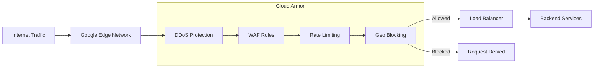

# How to Configure Cloud Armor Security

Author: [nawazdhandala](https://www.github.com/nawazdhandala)

Tags: Google Cloud, Cloud Armor, Security, WAF, DDoS Protection, GCP, Load Balancing

Description: A comprehensive guide to configuring Google Cloud Armor for web application security, including WAF rules, DDoS protection, and rate limiting.

---

Google Cloud Armor provides DDoS protection and web application firewall (WAF) capabilities for applications behind Google Cloud load balancers. This guide covers how to configure Cloud Armor security policies to protect your applications from attacks.

## Understanding Cloud Armor Architecture



## Creating a Security Policy

### Basic Policy Setup

```bash
# Create a new security policy
gcloud compute security-policies create my-security-policy \
    --description="Security policy for production application"

# View policy details
gcloud compute security-policies describe my-security-policy

# List all policies
gcloud compute security-policies list
```

### Attach Policy to Backend Service

```bash
# Get your backend service name
gcloud compute backend-services list

# Attach security policy
gcloud compute backend-services update my-backend-service \
    --security-policy=my-security-policy \
    --global
```

## Configuring WAF Rules

### Enable Preconfigured WAF Rules

Cloud Armor provides preconfigured rules based on OWASP ModSecurity Core Rule Set.

```bash
# Enable SQL injection protection
gcloud compute security-policies rules create 1000 \
    --security-policy=my-security-policy \
    --expression="evaluatePreconfiguredExpr('sqli-v33-stable')" \
    --action=deny-403 \
    --description="Block SQL injection attacks"

# Enable XSS protection
gcloud compute security-policies rules create 1001 \
    --security-policy=my-security-policy \
    --expression="evaluatePreconfiguredExpr('xss-v33-stable')" \
    --action=deny-403 \
    --description="Block cross-site scripting attacks"

# Enable Local File Inclusion protection
gcloud compute security-policies rules create 1002 \
    --security-policy=my-security-policy \
    --expression="evaluatePreconfiguredExpr('lfi-v33-stable')" \
    --action=deny-403 \
    --description="Block local file inclusion attacks"

# Enable Remote File Inclusion protection
gcloud compute security-policies rules create 1003 \
    --security-policy=my-security-policy \
    --expression="evaluatePreconfiguredExpr('rfi-v33-stable')" \
    --action=deny-403 \
    --description="Block remote file inclusion attacks"

# Enable Remote Code Execution protection
gcloud compute security-policies rules create 1004 \
    --security-policy=my-security-policy \
    --expression="evaluatePreconfiguredExpr('rce-v33-stable')" \
    --action=deny-403 \
    --description="Block remote code execution attacks"

# Enable Protocol Attack protection
gcloud compute security-policies rules create 1005 \
    --security-policy=my-security-policy \
    --expression="evaluatePreconfiguredExpr('protocolattack-v33-stable')" \
    --action=deny-403 \
    --description="Block protocol attacks"

# Enable Scanner Detection
gcloud compute security-policies rules create 1006 \
    --security-policy=my-security-policy \
    --expression="evaluatePreconfiguredExpr('scannerdetection-v33-stable')" \
    --action=deny-403 \
    --description="Block vulnerability scanners"
```

### Sensitivity Levels

```bash
# Use different sensitivity levels to balance security and false positives
# Available: sensitivity-level-0 through sensitivity-level-4

# High sensitivity (more strict, may have false positives)
gcloud compute security-policies rules update 1000 \
    --security-policy=my-security-policy \
    --expression="evaluatePreconfiguredExpr('sqli-v33-stable', ['owasp-crs-v030301-id942251-sqli', 'owasp-crs-v030301-id942420-sqli'])"

# Or use sensitivity level parameter
gcloud compute security-policies rules create 1010 \
    --security-policy=my-security-policy \
    --expression="evaluatePreconfiguredExpr('sqli-v33-stable', {'sensitivity': 1})" \
    --action=deny-403 \
    --description="SQL injection with sensitivity level 1"
```

## IP-Based Access Control

### Block Specific IPs

```bash
# Block a single IP
gcloud compute security-policies rules create 100 \
    --security-policy=my-security-policy \
    --src-ip-ranges="192.168.1.100" \
    --action=deny-403 \
    --description="Block malicious IP"

# Block IP ranges
gcloud compute security-policies rules create 101 \
    --security-policy=my-security-policy \
    --src-ip-ranges="10.0.0.0/8,172.16.0.0/12" \
    --action=deny-403 \
    --description="Block internal IP ranges from external access"
```

### Allow Only Specific IPs

```bash
# Create allowlist for admin endpoints
gcloud compute security-policies rules create 200 \
    --security-policy=my-security-policy \
    --expression="request.path.matches('/admin/.*') && !inIpRange(origin.ip, '203.0.113.0/24')" \
    --action=deny-403 \
    --description="Only allow admin access from office IP range"
```

### Geographic Restrictions

```bash
# Block traffic from specific countries
gcloud compute security-policies rules create 300 \
    --security-policy=my-security-policy \
    --expression="origin.region_code == 'CN' || origin.region_code == 'RU'" \
    --action=deny-403 \
    --description="Block traffic from China and Russia"

# Allow only specific countries
gcloud compute security-policies rules create 301 \
    --security-policy=my-security-policy \
    --expression="!origin.region_code.matches('US|CA|GB|DE|FR')" \
    --action=deny-403 \
    --description="Only allow traffic from US, Canada, UK, Germany, France"
```

## Rate Limiting

### Configure Rate Limiting Rules

```bash
# Rate limit by IP - 100 requests per minute
gcloud compute security-policies rules create 400 \
    --security-policy=my-security-policy \
    --src-ip-ranges="*" \
    --action=throttle \
    --rate-limit-threshold-count=100 \
    --rate-limit-threshold-interval-sec=60 \
    --conform-action=allow \
    --exceed-action=deny-429 \
    --enforce-on-key=IP \
    --description="Rate limit 100 requests per minute per IP"

# Stricter rate limit for login endpoints
gcloud compute security-policies rules create 401 \
    --security-policy=my-security-policy \
    --expression="request.path.matches('/api/auth/login')" \
    --action=throttle \
    --rate-limit-threshold-count=5 \
    --rate-limit-threshold-interval-sec=60 \
    --conform-action=allow \
    --exceed-action=deny-429 \
    --enforce-on-key=IP \
    --description="Rate limit login to 5 attempts per minute"

# Rate limit by header (for authenticated users)
gcloud compute security-policies rules create 402 \
    --security-policy=my-security-policy \
    --expression="has(request.headers['x-api-key'])" \
    --action=throttle \
    --rate-limit-threshold-count=1000 \
    --rate-limit-threshold-interval-sec=60 \
    --conform-action=allow \
    --exceed-action=deny-429 \
    --enforce-on-key=HTTP-HEADER \
    --enforce-on-key-name=x-api-key \
    --description="Rate limit by API key"
```

## Advanced Expression Rules

### Custom CEL Expressions

Cloud Armor uses Common Expression Language (CEL) for advanced rules.

```bash
# Block requests with suspicious user agents
gcloud compute security-policies rules create 500 \
    --security-policy=my-security-policy \
    --expression="request.headers['user-agent'].lower().contains('sqlmap') || request.headers['user-agent'].lower().contains('nikto')" \
    --action=deny-403 \
    --description="Block known attack tools"

# Block requests with excessive query parameters
gcloud compute security-policies rules create 501 \
    --security-policy=my-security-policy \
    --expression="request.query.size() > 50" \
    --action=deny-403 \
    --description="Block requests with too many query parameters"

# Protect specific API endpoints
gcloud compute security-policies rules create 502 \
    --security-policy=my-security-policy \
    --expression="request.path.startsWith('/api/v1/admin') && !request.headers['x-admin-token'].matches('[a-f0-9]{64}')" \
    --action=deny-403 \
    --description="Require valid admin token for admin endpoints"

# Block empty or missing host header
gcloud compute security-policies rules create 503 \
    --security-policy=my-security-policy \
    --expression="!has(request.headers['host']) || request.headers['host'] == ''" \
    --action=deny-403 \
    --description="Block requests without host header"
```

## Using Terraform for Policy Management

```hcl
# terraform/cloud-armor.tf

resource "google_compute_security_policy" "policy" {
  name        = "production-security-policy"
  description = "Security policy for production workloads"

  # Default rule - allow all traffic
  rule {
    action   = "allow"
    priority = "2147483647"
    match {
      versioned_expr = "SRC_IPS_V1"
      config {
        src_ip_ranges = ["*"]
      }
    }
    description = "Default allow rule"
  }

  # SQL Injection Protection
  rule {
    action   = "deny(403)"
    priority = "1000"
    match {
      expr {
        expression = "evaluatePreconfiguredExpr('sqli-v33-stable')"
      }
    }
    description = "Block SQL injection"
  }

  # XSS Protection
  rule {
    action   = "deny(403)"
    priority = "1001"
    match {
      expr {
        expression = "evaluatePreconfiguredExpr('xss-v33-stable')"
      }
    }
    description = "Block XSS attacks"
  }

  # Rate Limiting
  rule {
    action   = "throttle"
    priority = "2000"
    match {
      versioned_expr = "SRC_IPS_V1"
      config {
        src_ip_ranges = ["*"]
      }
    }
    rate_limit_options {
      conform_action = "allow"
      exceed_action  = "deny(429)"
      rate_limit_threshold {
        count        = 100
        interval_sec = 60
      }
      enforce_on_key = "IP"
    }
    description = "Rate limit by IP"
  }

  # Geographic Blocking
  rule {
    action   = "deny(403)"
    priority = "3000"
    match {
      expr {
        expression = "origin.region_code == 'CN'"
      }
    }
    description = "Block traffic from China"
  }

  # Adaptive Protection (requires Cloud Armor Managed Protection Plus)
  adaptive_protection_config {
    layer_7_ddos_defense_config {
      enable = true
      rule_visibility = "STANDARD"
    }
  }
}

# Attach to backend service
resource "google_compute_backend_service" "default" {
  name                  = "my-backend-service"
  security_policy       = google_compute_security_policy.policy.id

  # ... other backend configuration
}
```

## Monitoring and Logging

### Enable Security Policy Logging

```bash
# Enable verbose logging for the policy
gcloud compute security-policies update my-security-policy \
    --log-level=VERBOSE

# View security policy logs
gcloud logging read '
resource.type="http_load_balancer"
jsonPayload.enforcedSecurityPolicy.name="my-security-policy"
' --limit=50 --format=json
```

### Create Alert Policies

```bash
# Alert on high rate of blocked requests
gcloud monitoring alert-policies create \
    --display-name="High Cloud Armor Block Rate" \
    --condition-display-name="Blocked requests > 1000/min" \
    --condition-filter='
        resource.type="http_load_balancer"
        AND metric.type="loadbalancing.googleapis.com/https/request_count"
        AND metric.labels.response_code_class="400"
    ' \
    --condition-threshold-value=1000 \
    --condition-threshold-comparison=COMPARISON_GT \
    --aggregation-period=60s \
    --notification-channels=CHANNEL_ID
```

### Dashboard Query Examples

```sql
-- Blocked requests by rule
SELECT
  jsonPayload.enforcedSecurityPolicy.matchedFieldType AS rule_type,
  jsonPayload.enforcedSecurityPolicy.outcome AS outcome,
  COUNT(*) AS request_count
FROM `project.dataset.requests_*`
WHERE jsonPayload.enforcedSecurityPolicy.name = "my-security-policy"
GROUP BY rule_type, outcome
ORDER BY request_count DESC

-- Top blocked IPs
SELECT
  httpRequest.remoteIp AS ip,
  COUNT(*) AS blocked_count
FROM `project.dataset.requests_*`
WHERE jsonPayload.enforcedSecurityPolicy.outcome = "DENY"
GROUP BY ip
ORDER BY blocked_count DESC
LIMIT 20
```

## Testing Your Configuration

### Test Rules Without Blocking

```bash
# Set rule to preview mode (log but don't block)
gcloud compute security-policies rules update 1000 \
    --security-policy=my-security-policy \
    --preview

# After testing, enable enforcement
gcloud compute security-policies rules update 1000 \
    --security-policy=my-security-policy \
    --no-preview
```

### Manual Testing

```bash
# Test SQL injection rule
curl -v "https://your-app.com/search?q=1' OR '1'='1"

# Test XSS rule
curl -v "https://your-app.com/page?input=<script>alert(1)</script>"

# Test rate limiting
for i in {1..150}; do curl -s -o /dev/null -w "%{http_code}\n" https://your-app.com/api/data; done
```

## Best Practices

1. Start with preview mode - Test rules before enforcing them
2. Use sensitivity levels - Start with lower sensitivity and increase as needed
3. Monitor false positives - Review logs regularly and adjust rules
4. Layer your defenses - Combine WAF rules with rate limiting and geo-blocking
5. Keep rules updated - Cloud Armor rule sets are updated regularly
6. Document your rules - Use descriptive names and descriptions
7. Use priority ordering - Lower numbers = higher priority

```bash
# Recommended rule priority structure
# 100-199: IP blocklists (emergency blocks)
# 200-299: IP allowlists (trusted sources)
# 300-399: Geographic restrictions
# 400-499: Rate limiting
# 1000-1999: WAF rules (SQLi, XSS, etc.)
# 2000-2999: Custom application rules
# 2147483647: Default allow (always last)
```

---

Cloud Armor provides robust protection for applications behind Google Cloud load balancers. Start with preconfigured WAF rules for common attacks, add rate limiting to prevent abuse, and use geographic restrictions based on your user base. Always test rules in preview mode before enforcing them, and monitor logs for false positives. With proper configuration, Cloud Armor significantly reduces your attack surface while maintaining application availability.
