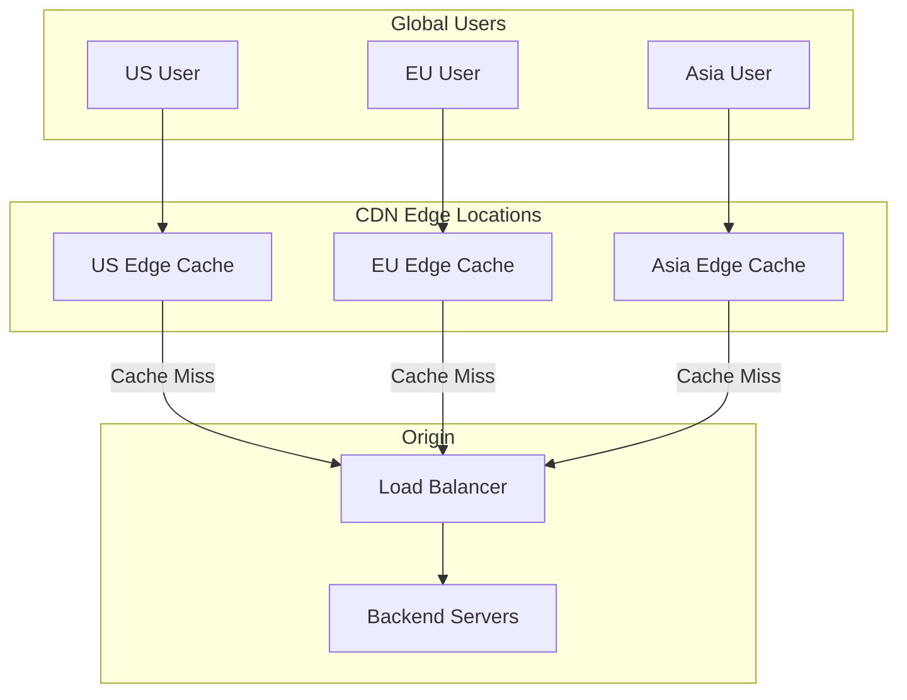
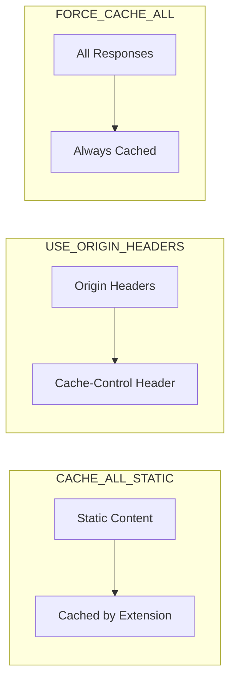

# How to Configure Cloud CDN

Author: [nawazdhandala](https://www.github.com/nawazdhandala)

Tags: CDN, Cloud CDN, Google Cloud, Performance, Caching, DevOps, Web Performance

Description: A practical guide to configuring Google Cloud CDN for optimal content delivery, including cache policies, invalidation strategies, and performance tuning.

---

A Content Delivery Network (CDN) can dramatically reduce latency and server load by caching your content at edge locations worldwide. Google Cloud CDN integrates with Cloud Load Balancing to provide fast, reliable content delivery. This guide walks you through setup, configuration, and optimization.

## Understanding CDN Architecture



Cloud CDN works by caching responses from your backend services. When a user requests content, the request goes to the nearest edge location. If the content is cached (cache hit), it is served immediately. If not (cache miss), the request goes to your origin server.

## Enabling Cloud CDN

### Prerequisites

Cloud CDN requires a Cloud Load Balancer with a backend service. Here is how to set it up from scratch.

```bash
# Create a health check
gcloud compute health-checks create http my-health-check \
    --port=80 \
    --request-path="/health"

# Create a backend service with CDN enabled
gcloud compute backend-services create my-backend \
    --protocol=HTTP \
    --port-name=http \
    --health-checks=my-health-check \
    --enable-cdn \
    --global

# Add your backend (instance group, NEG, or Cloud Storage bucket)
gcloud compute backend-services add-backend my-backend \
    --instance-group=my-instance-group \
    --instance-group-zone=us-central1-a \
    --global
```

### Enable CDN on Existing Backend

```bash
# Enable CDN on existing backend service
gcloud compute backend-services update my-backend \
    --enable-cdn \
    --global

# Verify CDN is enabled
gcloud compute backend-services describe my-backend \
    --global \
    --format="value(enableCdn)"
```

## Cache Modes and Policies

Cloud CDN offers three cache modes with different behaviors.



### CACHE_ALL_STATIC (Default)

Caches content based on file extension and Content-Type header.

```bash
gcloud compute backend-services update my-backend \
    --cache-mode=CACHE_ALL_STATIC \
    --global
```

Cached by default:
- CSS, JavaScript, fonts
- Images (JPEG, PNG, GIF, WebP, SVG)
- Audio and video files
- PDF, documents

### USE_ORIGIN_HEADERS

Respects Cache-Control headers from your origin server. This gives you fine-grained control.

```bash
gcloud compute backend-services update my-backend \
    --cache-mode=USE_ORIGIN_HEADERS \
    --global
```

Configure your application to send proper headers:

```python
# Flask example - setting cache headers
from flask import Flask, make_response

app = Flask(__name__)

@app.route('/api/static-data')
def static_data():
    response = make_response(get_static_data())
    # Cache for 1 hour at CDN, 5 minutes in browser
    response.headers['Cache-Control'] = 'public, max-age=300, s-maxage=3600'
    return response

@app.route('/api/user-data')
def user_data():
    response = make_response(get_user_data())
    # Never cache user-specific data
    response.headers['Cache-Control'] = 'private, no-store'
    return response

@app.route('/api/semi-dynamic')
def semi_dynamic():
    response = make_response(get_data())
    # Cache but always revalidate
    response.headers['Cache-Control'] = 'public, no-cache, max-age=3600'
    response.headers['ETag'] = generate_etag()
    return response
```

```javascript
// Express.js example
const express = require('express');
const app = express();

// Middleware to set cache headers
app.use('/static', (req, res, next) => {
    // Cache static assets for 1 year
    res.set('Cache-Control', 'public, max-age=31536000, immutable');
    next();
});

app.use('/api', (req, res, next) => {
    // API responses cached for 5 minutes at edge
    res.set('Cache-Control', 'public, max-age=60, s-maxage=300');
    next();
});

// Dynamic content - no caching
app.get('/api/user/:id', (req, res) => {
    res.set('Cache-Control', 'private, no-store');
    res.json(getUserData(req.params.id));
});
```

### FORCE_CACHE_ALL

Caches everything regardless of headers. Use with caution.

```bash
gcloud compute backend-services update my-backend \
    --cache-mode=FORCE_CACHE_ALL \
    --default-ttl=3600 \
    --max-ttl=86400 \
    --global
```

## Cache Key Configuration

The cache key determines what makes a request unique. By default, Cloud CDN uses the full URL including query parameters.

### Customizing Cache Keys

```bash
# Include only specific query parameters in cache key
gcloud compute backend-services update my-backend \
    --cache-key-include-query-string \
    --cache-key-query-string-whitelist=version,lang \
    --global

# Or exclude specific parameters
gcloud compute backend-services update my-backend \
    --cache-key-include-query-string \
    --cache-key-query-string-blacklist=utm_source,utm_campaign,fbclid \
    --global

# Include HTTP headers in cache key
gcloud compute backend-services update my-backend \
    --cache-key-include-http-header=Accept-Language \
    --global
```

### Terraform Configuration

```hcl
resource "google_compute_backend_service" "cdn_backend" {
  name                  = "my-cdn-backend"
  protocol              = "HTTP"
  port_name             = "http"
  timeout_sec           = 30
  enable_cdn            = true
  health_checks         = [google_compute_health_check.default.id]

  cdn_policy {
    cache_mode = "USE_ORIGIN_HEADERS"

    # Cache key configuration
    cache_key_policy {
      include_host         = true
      include_protocol     = true
      include_query_string = true

      # Only include these query params in cache key
      query_string_whitelist = ["version", "lang"]

      # Include specific headers
      include_http_headers = ["Accept-Encoding"]
    }

    # Negative caching for error responses
    negative_caching = true
    negative_caching_policy {
      code = 404
      ttl  = 60  # Cache 404s for 1 minute
    }
    negative_caching_policy {
      code = 502
      ttl  = 10  # Cache 502s briefly to protect origin
    }

    # Signed URLs for protected content
    signed_url_cache_max_age_sec = 3600
  }

  backend {
    group = google_compute_instance_group.default.id
  }
}
```

## Cache Invalidation

When you need to clear cached content immediately, use cache invalidation.

```bash
# Invalidate a specific path
gcloud compute url-maps invalidate-cdn-cache my-url-map \
    --path="/images/logo.png"

# Invalidate with wildcard
gcloud compute url-maps invalidate-cdn-cache my-url-map \
    --path="/css/*"

# Invalidate everything (use sparingly)
gcloud compute url-maps invalidate-cdn-cache my-url-map \
    --path="/*"

# Check invalidation status
gcloud compute operations list \
    --filter="operationType=invalidateCache"
```

### Automating Invalidation in CI/CD

```yaml
# cloudbuild.yaml - Invalidate CDN after deployment
steps:
  - name: 'gcr.io/cloud-builders/gcloud'
    args:
      - 'compute'
      - 'url-maps'
      - 'invalidate-cdn-cache'
      - 'my-url-map'
      - '--path=/static/*'
      - '--async'  # Don't wait for completion
```

```python
# Python script for selective invalidation
from google.cloud import compute_v1
import hashlib

def invalidate_changed_files(url_map: str, changed_files: list):
    """Invalidate only files that changed."""
    client = compute_v1.UrlMapsClient()

    paths = [f"/{f}" for f in changed_files if should_invalidate(f)]

    if not paths:
        print("No files need invalidation")
        return

    # Batch invalidation (max 50 paths per request)
    for i in range(0, len(paths), 50):
        batch = paths[i:i+50]
        request = compute_v1.InvalidateCacheUrlMapRequest(
            project="my-project",
            url_map=url_map,
            cache_invalidation_rule_resource={
                "path": batch[0] if len(batch) == 1 else None,
                "host": "*"
            }
        )
        client.invalidate_cache(request=request)
        print(f"Invalidated {len(batch)} paths")

def should_invalidate(filepath: str) -> bool:
    """Check if file type should trigger CDN invalidation."""
    invalidate_extensions = {'.js', '.css', '.html', '.json', '.png', '.jpg'}
    return any(filepath.endswith(ext) for ext in invalidate_extensions)
```

## Signed URLs for Protected Content

Serve private content through CDN with signed URLs.

```bash
# Create a signing key
head -c 16 /dev/urandom | base64 | tr '+/' '-_' > key.txt
KEY_VALUE=$(cat key.txt)

# Add key to backend service
gcloud compute backend-services add-signed-url-key my-backend \
    --key-name=my-key \
    --key-file=key.txt \
    --global
```

```python
# Generate signed URLs in Python
import datetime
import base64
import hashlib
import hmac
from urllib.parse import urlparse, urlencode

def generate_signed_url(
    url: str,
    key_name: str,
    key_value: str,
    expiration_hours: int = 24
) -> str:
    """Generate a signed URL for Cloud CDN."""

    # Calculate expiration timestamp
    expiration = datetime.datetime.utcnow() + datetime.timedelta(hours=expiration_hours)
    expiration_timestamp = int(expiration.timestamp())

    # Parse the URL
    parsed = urlparse(url)

    # Build the URL prefix to sign
    url_to_sign = f"{url}{'&' if '?' in url else '?'}Expires={expiration_timestamp}&KeyName={key_name}"

    # Decode the key (base64url encoded)
    decoded_key = base64.urlsafe_b64decode(key_value + '==')

    # Create signature
    signature = hmac.new(
        decoded_key,
        url_to_sign.encode('utf-8'),
        hashlib.sha1
    ).digest()

    # Encode signature as base64url
    encoded_signature = base64.urlsafe_b64encode(signature).decode('utf-8').rstrip('=')

    return f"{url_to_sign}&Signature={encoded_signature}"

# Usage
signed_url = generate_signed_url(
    url="https://cdn.example.com/private/video.mp4",
    key_name="my-key",
    key_value="your-base64-key",
    expiration_hours=1
)
```

## Monitoring and Debugging

### View Cache Hit Rates

```bash
# Using Cloud Monitoring
gcloud monitoring metrics list --filter="metric.type:cdn"

# Check CDN logs
gcloud logging read 'resource.type="http_load_balancer" AND jsonPayload.cacheHit=true' \
    --limit=100 \
    --format="table(timestamp,httpRequest.requestUrl,jsonPayload.cacheHit)"
```

### Debug Cache Headers

```bash
# Check response headers
curl -I https://your-cdn-url.com/image.png

# Look for these headers:
# X-Cache-Status: hit (or miss)
# Age: 3600 (seconds since cached)
# Cache-Control: public, max-age=3600
```

### Common Issues

**Issue: Low cache hit rate**
```bash
# Check if cache keys are too specific
gcloud compute backend-services describe my-backend \
    --global \
    --format="yaml(cdnPolicy.cacheKeyPolicy)"

# Solution: Remove unnecessary query params from cache key
```

**Issue: Stale content after deployment**
```bash
# Use versioned URLs instead of invalidation
# Before: /js/app.js
# After: /js/app.v123.js or /js/app.js?v=abc123
```

**Issue: Dynamic content being cached**
```python
# Ensure proper Cache-Control headers
@app.route('/api/user')
def get_user():
    response = make_response(jsonify(user_data))
    response.headers['Cache-Control'] = 'private, no-store, no-cache'
    response.headers['Vary'] = 'Authorization'  # Different cache per auth token
    return response
```

## Best Practices

1. **Version your static assets**: Use content hashes in filenames for automatic cache busting
2. **Set appropriate TTLs**: Balance freshness vs cache hit rate
3. **Use compression**: Enable gzip/brotli at the origin
4. **Monitor cache hit rates**: Aim for 90%+ for static content
5. **Implement graceful degradation**: Handle CDN failures in your application

---

Cloud CDN is a powerful tool for improving performance and reducing origin load. Start with CACHE_ALL_STATIC for simple setups, then move to USE_ORIGIN_HEADERS when you need fine-grained control. Monitor your cache hit rates and adjust your caching strategy based on real usage patterns.
