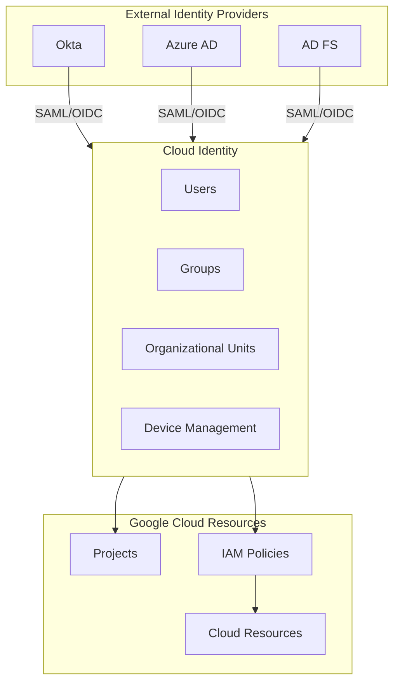
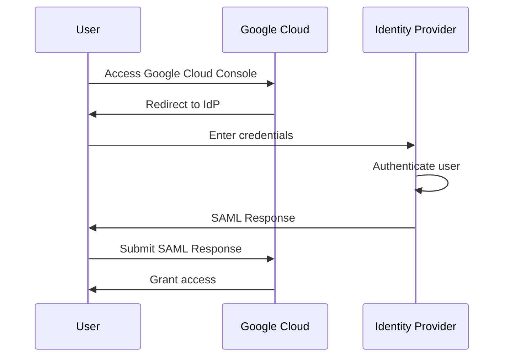

# How to Configure Cloud Identity

Author: [nawazdhandala](https://www.github.com/nawazdhandala)

Tags: Google Cloud, Cloud Identity, IAM, Identity Management, SSO, Security

Description: A comprehensive guide to configuring Google Cloud Identity for enterprise identity management, including user provisioning, SSO setup, and security policies.

---

Cloud Identity is Google's identity-as-a-service (IDaaS) solution that provides user and group management for Google Cloud and Google Workspace. Getting it configured correctly is essential for secure and manageable cloud environments.

## Understanding Cloud Identity Architecture

Cloud Identity sits at the foundation of your Google Cloud security model.



## Initial Setup

### Step 1: Sign Up for Cloud Identity

If you do not have a Google Workspace domain, start with Cloud Identity Free.

```bash
# Verify your domain ownership first
# Then create the Cloud Identity account via:
# https://workspace.google.com/signup/gcpidentity/welcome

# After setup, verify your organization
gcloud organizations list
```

### Step 2: Configure Super Admin Account

```bash
# Create a dedicated super admin (not your personal account)
# This should be done in the Admin Console: admin.google.com

# Verify admin access
gcloud auth list

# Check organization policies
gcloud resource-manager org-policies list \
    --organization=ORGANIZATION_ID
```

## User Provisioning

### Manual User Creation

For small teams, create users directly in the Admin Console.

```bash
# Using gcloud (requires Workspace admin privileges)
# Note: Direct user creation via gcloud is limited
# Use Admin Console or Admin SDK for full control

# List existing users
gcloud identity groups memberships list \
    --group-email="all-users@yourdomain.com"
```

### Automated Provisioning with GCDS

Google Cloud Directory Sync (GCDS) synchronizes users from Active Directory or LDAP.

```xml
<!-- gcds-config.xml - Example configuration -->
<configuration>
  <ldap>
    <hostname>ldap.yourdomain.com</hostname>
    <port>636</port>
    <authType>SIMPLE</authType>
    <bindDn>CN=GCDS Service,OU=Service Accounts,DC=yourdomain,DC=com</bindDn>
    <ssl>true</ssl>
  </ldap>

  <google>
    <domain>yourdomain.com</domain>
    <adminEmail>admin@yourdomain.com</adminEmail>
  </google>

  <userSync>
    <userSearchBase>OU=Users,DC=yourdomain,DC=com</userSearchBase>
    <userSearchFilter>(&amp;(objectClass=user)(mail=*))</userSearchFilter>
    <userAttributes>
      <mail>mail</mail>
      <givenName>givenName</givenName>
      <sn>sn</sn>
    </userAttributes>
  </userSync>
</configuration>
```

### SCIM-Based Provisioning

For modern identity providers, use SCIM for real-time user provisioning.

```bash
# Enable SCIM in Admin Console:
# Security > API Controls > App Access Control > Manage Third-Party App Access

# Configure your IdP (example: Okta) with:
# SCIM Base URL: https://www.googleapis.com/scim/v2
# OAuth Bearer Token: Generated from Admin Console
```

## Configuring Single Sign-On (SSO)

### SAML-Based SSO Setup



### Configure SAML in Admin Console

1. Navigate to Security > Authentication > SSO with third party IdP
2. Enable SSO with the following settings:

```yaml
# Example SAML Configuration
sign_in_page_url: https://idp.yourdomain.com/saml/login
sign_out_page_url: https://idp.yourdomain.com/saml/logout
change_password_url: https://idp.yourdomain.com/change-password
verification_certificate: |
  -----BEGIN CERTIFICATE-----
  MIIDXTCCAkWgAwIBAgIJAJC1...
  -----END CERTIFICATE-----
```

### Configure Your Identity Provider

For Okta, create a SAML app with these settings:

```yaml
# Okta SAML Configuration
single_sign_on_url: https://www.google.com/a/yourdomain.com/acs
audience_uri: google.com/a/yourdomain.com
name_id_format: EmailAddress
name_id_attribute: user.email

# Attribute Statements
attributes:
  - name: firstName
    value: user.firstName
  - name: lastName
    value: user.lastName
```

For Azure AD:

```yaml
# Azure AD SAML Configuration
identifier: google.com
reply_url: https://www.google.com/a/yourdomain.com/acs
sign_on_url: https://www.google.com/a/yourdomain.com

# Claims
claims:
  - type: emailaddress
    source: user.mail
  - type: givenname
    source: user.givenname
  - type: surname
    source: user.surname
```

## Group Management

### Create Groups for Access Control

```bash
# Create a Cloud Identity group
gcloud identity groups create security-team@yourdomain.com \
    --organization=organizations/ORGANIZATION_ID \
    --display-name="Security Team" \
    --description="Members of the security team"

# Add members to the group
gcloud identity groups memberships add \
    --group-email=security-team@yourdomain.com \
    --member-email=alice@yourdomain.com \
    --roles=MEMBER

# Add as manager (can manage group membership)
gcloud identity groups memberships add \
    --group-email=security-team@yourdomain.com \
    --member-email=bob@yourdomain.com \
    --roles=MEMBER,MANAGER
```

### Nested Groups for Hierarchical Access

```mermaid
flowchart TB
    subgraph Groups["Group Hierarchy"]
        AllEngineers[all-engineers@domain.com]
        BackendTeam[backend-team@domain.com]
        FrontendTeam[frontend-team@domain.com]
        PlatformTeam[platform-team@domain.com]
    end

    BackendTeam --> AllEngineers
    FrontendTeam --> AllEngineers
    PlatformTeam --> AllEngineers
```

```bash
# Add a group as a member of another group
gcloud identity groups memberships add \
    --group-email=all-engineers@yourdomain.com \
    --member-email=backend-team@yourdomain.com \
    --roles=MEMBER
```

### Dynamic Groups (Requires Cloud Identity Premium)

```bash
# Create a dynamic group based on user attributes
# This requires the Admin SDK or Admin Console

# Example: All users in the Engineering department
# Query: user.organizations.department == 'Engineering'
```

## Security Policies

### Configure Password Policies

In Admin Console, navigate to Security > Authentication > Password management:

```yaml
# Recommended Password Policy
minimum_length: 12
require_symbols: true
require_numbers: true
require_mixed_case: true
password_expiration_days: 90
prevent_reuse_count: 10
```

### Enable 2-Step Verification

```bash
# In Admin Console: Security > 2-Step Verification

# Recommended settings:
enforcement: required
allowed_methods:
  - security_key  # Most secure
  - google_prompt
  - authenticator_app
  # Avoid SMS if possible

new_user_enrollment_period_days: 7
```

### Configure Login Challenges

```yaml
# Security > Authentication > Login challenges
enable_login_challenges: true
suspicious_login_protection: enabled
actions:
  - require_2sv_for_suspicious_logins
  - require_identity_verification
```

## Integrating with Google Cloud IAM

### Grant Roles to Cloud Identity Groups

```bash
# Grant viewer role to a group at organization level
gcloud organizations add-iam-policy-binding ORGANIZATION_ID \
    --member="group:security-team@yourdomain.com" \
    --role="roles/viewer"

# Grant editor role at project level
gcloud projects add-iam-policy-binding my-project \
    --member="group:developers@yourdomain.com" \
    --role="roles/editor"

# Grant specific service roles
gcloud projects add-iam-policy-binding my-project \
    --member="group:data-analysts@yourdomain.com" \
    --role="roles/bigquery.dataViewer"
```

### Create Custom Roles

```bash
# Create a custom role with specific permissions
gcloud iam roles create customDeveloperRole \
    --organization=ORGANIZATION_ID \
    --title="Custom Developer Role" \
    --description="Developer role with restricted permissions" \
    --permissions=compute.instances.get,compute.instances.list,storage.objects.get,storage.objects.list

# Assign custom role to a group
gcloud projects add-iam-policy-binding my-project \
    --member="group:junior-devs@yourdomain.com" \
    --role="organizations/ORGANIZATION_ID/roles/customDeveloperRole"
```

## Terraform Configuration

```hcl
# Configure the Google provider
provider "google" {
  project = "my-project"
  region  = "us-central1"
}

# Create a Cloud Identity group
resource "google_cloud_identity_group" "developers" {
  display_name = "Developers"

  parent = "customers/C0xxxxxxx"  # Customer ID from Admin Console

  group_key {
    id = "developers@yourdomain.com"
  }

  labels = {
    "cloudidentity.googleapis.com/groups.discussion_forum" = ""
  }
}

# Add a member to the group
resource "google_cloud_identity_group_membership" "developer_member" {
  group = google_cloud_identity_group.developers.id

  preferred_member_key {
    id = "alice@yourdomain.com"
  }

  roles {
    name = "MEMBER"
  }
}

# Grant IAM role to the group
resource "google_project_iam_member" "developer_access" {
  project = "my-project"
  role    = "roles/editor"
  member  = "group:developers@yourdomain.com"

  depends_on = [google_cloud_identity_group.developers]
}
```

## Troubleshooting Common Issues

### SSO Not Working

```bash
# Check SAML certificate expiration
openssl x509 -in saml-cert.pem -text -noout | grep -A2 "Validity"

# Verify ACS URL matches exactly
# Common issues:
# - Trailing slash mismatch
# - HTTP vs HTTPS
# - Incorrect domain in URL

# Test SAML response (use browser dev tools)
# Network tab > filter for "acs" > check POST request
```

### Users Not Syncing

```bash
# For GCDS, check sync logs
# Location: C:\GCDS\sync-logs\ (Windows) or ~/GCDS/sync-logs/ (Linux)

# Verify LDAP connectivity
ldapsearch -H ldaps://ldap.yourdomain.com:636 \
    -D "CN=GCDS Service,OU=Service Accounts,DC=yourdomain,DC=com" \
    -W \
    -b "OU=Users,DC=yourdomain,DC=com" \
    "(mail=*)" mail
```

### Group Membership Not Reflected in IAM

```bash
# Check group membership
gcloud identity groups memberships list \
    --group-email=developers@yourdomain.com

# Verify IAM binding
gcloud projects get-iam-policy my-project \
    --flatten="bindings[].members" \
    --filter="bindings.members:group:developers@yourdomain.com"

# Note: Group membership changes can take up to 24 hours to propagate
# For faster propagation, remove and re-add the IAM binding
```

## Best Practices

1. **Use groups, not individual users** - Always assign IAM roles to groups
2. **Implement least privilege** - Start with minimal access and add as needed
3. **Enable audit logging** - Track all admin and data access activities
4. **Require 2-Step Verification** - Enforce for all users, prefer security keys
5. **Regular access reviews** - Quarterly review of group memberships and IAM bindings
6. **Separate admin accounts** - Super admins should not be daily use accounts
7. **Automate provisioning** - Use SCIM or GCDS to reduce manual errors
8. **Document group purposes** - Clear descriptions help during audits

Cloud Identity forms the foundation of your Google Cloud security posture. Take time to set it up correctly, and you will have a much easier time managing access as your organization grows.
