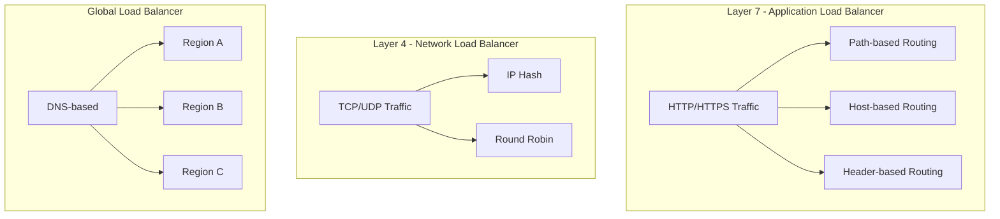
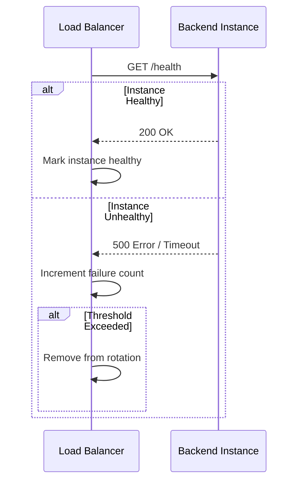

# How to Configure Cloud Load Balancing

Author: [nawazdhandala](https://www.github.com/nawazdhandala)

Tags: Cloud, Load Balancing, GCP, AWS, Infrastructure, High Availability, DevOps

Description: A practical guide to configuring cloud load balancers for high availability and optimal traffic distribution across your applications.

---

Load balancing is the backbone of scalable cloud architecture. Without it, your application is just one server failure away from a complete outage. This guide walks you through configuring cloud load balancers on major cloud platforms with real-world examples and best practices.

## Understanding Load Balancer Types

Before diving into configuration, you need to understand the different types of load balancers available.



### When to Use Each Type

- **Application Load Balancer (L7)**: HTTP/HTTPS traffic, path-based routing, microservices
- **Network Load Balancer (L4)**: TCP/UDP traffic, low latency requirements, gaming servers
- **Global Load Balancer**: Multi-region deployments, disaster recovery, geographic routing

## Google Cloud Platform Load Balancing

GCP offers several load balancing options. Here is how to set up an HTTP(S) load balancer.

### Create a Backend Service

First, create instance groups and health checks.

```bash
# Create a health check
gcloud compute health-checks create http my-health-check \
    --port=80 \
    --request-path="/health" \
    --check-interval=10s \
    --timeout=5s \
    --healthy-threshold=2 \
    --unhealthy-threshold=3

# Create an instance group
gcloud compute instance-groups managed create my-instance-group \
    --base-instance-name=web-server \
    --template=my-instance-template \
    --size=3 \
    --zone=us-central1-a

# Set named ports for the instance group
gcloud compute instance-groups managed set-named-ports my-instance-group \
    --named-ports=http:80 \
    --zone=us-central1-a
```

### Create the Backend Service

```bash
# Create backend service
gcloud compute backend-services create my-backend-service \
    --protocol=HTTP \
    --port-name=http \
    --health-checks=my-health-check \
    --global

# Add instance group to backend service
gcloud compute backend-services add-backend my-backend-service \
    --instance-group=my-instance-group \
    --instance-group-zone=us-central1-a \
    --balancing-mode=UTILIZATION \
    --max-utilization=0.8 \
    --global
```

### Create URL Map and Frontend

```bash
# Create URL map for routing
gcloud compute url-maps create my-url-map \
    --default-service=my-backend-service

# Create target HTTP proxy
gcloud compute target-http-proxies create my-http-proxy \
    --url-map=my-url-map

# Create forwarding rule (frontend)
gcloud compute forwarding-rules create my-forwarding-rule \
    --global \
    --target-http-proxy=my-http-proxy \
    --ports=80
```

### Using Terraform for GCP

Infrastructure as code makes load balancer configuration reproducible.

```hcl
# main.tf - GCP Load Balancer with Terraform

# Health check
resource "google_compute_health_check" "default" {
  name               = "my-health-check"
  check_interval_sec = 10
  timeout_sec        = 5
  healthy_threshold  = 2
  unhealthy_threshold = 3

  http_health_check {
    port         = 80
    request_path = "/health"
  }
}

# Backend service
resource "google_compute_backend_service" "default" {
  name                  = "my-backend-service"
  protocol              = "HTTP"
  port_name             = "http"
  timeout_sec           = 30
  health_checks         = [google_compute_health_check.default.id]
  load_balancing_scheme = "EXTERNAL"

  backend {
    group           = google_compute_instance_group_manager.default.instance_group
    balancing_mode  = "UTILIZATION"
    max_utilization = 0.8
  }
}

# URL map
resource "google_compute_url_map" "default" {
  name            = "my-url-map"
  default_service = google_compute_backend_service.default.id

  # Path-based routing example
  host_rule {
    hosts        = ["api.example.com"]
    path_matcher = "api-paths"
  }

  path_matcher {
    name            = "api-paths"
    default_service = google_compute_backend_service.default.id

    path_rule {
      paths   = ["/v1/*"]
      service = google_compute_backend_service.api_v1.id
    }

    path_rule {
      paths   = ["/v2/*"]
      service = google_compute_backend_service.api_v2.id
    }
  }
}

# HTTP proxy
resource "google_compute_target_http_proxy" "default" {
  name    = "my-http-proxy"
  url_map = google_compute_url_map.default.id
}

# Global forwarding rule
resource "google_compute_global_forwarding_rule" "default" {
  name       = "my-forwarding-rule"
  target     = google_compute_target_http_proxy.default.id
  port_range = "80"
}
```

## AWS Application Load Balancer

AWS ALB is perfect for containerized applications and microservices.

### Create ALB with AWS CLI

```bash
# Create the load balancer
aws elbv2 create-load-balancer \
    --name my-alb \
    --subnets subnet-12345678 subnet-87654321 \
    --security-groups sg-12345678 \
    --scheme internet-facing \
    --type application

# Create target group
aws elbv2 create-target-group \
    --name my-targets \
    --protocol HTTP \
    --port 80 \
    --vpc-id vpc-12345678 \
    --health-check-protocol HTTP \
    --health-check-path /health \
    --health-check-interval-seconds 30 \
    --healthy-threshold-count 2 \
    --unhealthy-threshold-count 3

# Create listener
aws elbv2 create-listener \
    --load-balancer-arn arn:aws:elasticloadbalancing:region:account:loadbalancer/app/my-alb/xxx \
    --protocol HTTP \
    --port 80 \
    --default-actions Type=forward,TargetGroupArn=arn:aws:elasticloadbalancing:region:account:targetgroup/my-targets/xxx
```

### AWS ALB with Terraform

```hcl
# main.tf - AWS Application Load Balancer

resource "aws_lb" "main" {
  name               = "my-alb"
  internal           = false
  load_balancer_type = "application"
  security_groups    = [aws_security_group.alb.id]
  subnets            = var.public_subnet_ids

  enable_deletion_protection = true

  tags = {
    Environment = "production"
  }
}

resource "aws_lb_target_group" "main" {
  name     = "my-targets"
  port     = 80
  protocol = "HTTP"
  vpc_id   = var.vpc_id

  health_check {
    enabled             = true
    healthy_threshold   = 2
    unhealthy_threshold = 3
    interval            = 30
    path                = "/health"
    port                = "traffic-port"
    protocol            = "HTTP"
    timeout             = 5
  }

  # Enable sticky sessions if needed
  stickiness {
    type            = "lb_cookie"
    cookie_duration = 86400
    enabled         = true
  }
}

resource "aws_lb_listener" "http" {
  load_balancer_arn = aws_lb.main.arn
  port              = 80
  protocol          = "HTTP"

  default_action {
    type             = "forward"
    target_group_arn = aws_lb_target_group.main.arn
  }
}

# Path-based routing rules
resource "aws_lb_listener_rule" "api" {
  listener_arn = aws_lb_listener.http.arn
  priority     = 100

  action {
    type             = "forward"
    target_group_arn = aws_lb_target_group.api.arn
  }

  condition {
    path_pattern {
      values = ["/api/*"]
    }
  }
}
```

## Health Check Configuration

Health checks are critical for load balancer reliability. Poor health check configuration leads to either false positives or delayed failure detection.



### Best Practices for Health Checks

```python
# health_check.py - A proper health check endpoint

from flask import Flask, jsonify
import psycopg2
import redis

app = Flask(__name__)

@app.route('/health')
def health_check():
    """
    Comprehensive health check that validates:
    - Database connectivity
    - Cache connectivity
    - Application readiness
    """
    health_status = {
        "status": "healthy",
        "checks": {}
    }

    # Check database connection
    try:
        conn = psycopg2.connect(DATABASE_URL)
        conn.close()
        health_status["checks"]["database"] = "ok"
    except Exception as e:
        health_status["checks"]["database"] = f"error: {str(e)}"
        health_status["status"] = "unhealthy"

    # Check Redis connection
    try:
        r = redis.Redis(host=REDIS_HOST)
        r.ping()
        health_status["checks"]["redis"] = "ok"
    except Exception as e:
        health_status["checks"]["redis"] = f"error: {str(e)}"
        health_status["status"] = "unhealthy"

    status_code = 200 if health_status["status"] == "healthy" else 503
    return jsonify(health_status), status_code
```

## Session Persistence and Sticky Sessions

Sometimes you need requests from the same client to go to the same backend. Configure sticky sessions carefully because they can cause uneven load distribution.

### Cookie-Based Sticky Sessions

```hcl
# AWS ALB sticky sessions
resource "aws_lb_target_group" "sticky" {
  name     = "sticky-targets"
  port     = 80
  protocol = "HTTP"
  vpc_id   = var.vpc_id

  stickiness {
    type            = "lb_cookie"
    cookie_duration = 3600  # 1 hour
    enabled         = true
  }
}
```

```bash
# GCP backend service with session affinity
gcloud compute backend-services update my-backend-service \
    --session-affinity=GENERATED_COOKIE \
    --affinity-cookie-ttl=3600 \
    --global
```

## Monitoring and Troubleshooting

### Key Metrics to Monitor

- **Request count and latency**: Track response times at p50, p95, and p99
- **Error rates**: Monitor 4xx and 5xx responses
- **Backend health**: Track healthy vs unhealthy instances
- **Connection counts**: Watch for connection exhaustion

### Common Issues and Fixes

**Issue: All backends marked unhealthy**
```bash
# Check health check configuration
gcloud compute health-checks describe my-health-check

# Verify backend can respond to health checks
curl -v http://backend-ip:80/health

# Check firewall rules allow health check traffic
gcloud compute firewall-rules list --filter="name~health"
```

**Issue: Uneven traffic distribution**
```bash
# Check backend utilization
gcloud compute backend-services get-health my-backend-service --global

# Adjust balancing mode
gcloud compute backend-services update-backend my-backend-service \
    --instance-group=my-instance-group \
    --balancing-mode=RATE \
    --max-rate-per-instance=100 \
    --global
```

## Security Best Practices

1. **Use HTTPS**: Always terminate TLS at the load balancer
2. **Enable WAF**: Protect against common attacks
3. **Restrict backend access**: Backends should only accept traffic from the load balancer
4. **Enable access logging**: Log all requests for security auditing

```hcl
# Enable access logging on AWS ALB
resource "aws_lb" "main" {
  # ... other configuration

  access_logs {
    bucket  = aws_s3_bucket.lb_logs.id
    prefix  = "alb-logs"
    enabled = true
  }
}
```

---

Cloud load balancing is not just about distributing traffic. It is about building resilient, scalable applications that can handle failures gracefully. Start with the basics, add health checks, and gradually implement advanced features like path-based routing and sticky sessions as your architecture demands.
