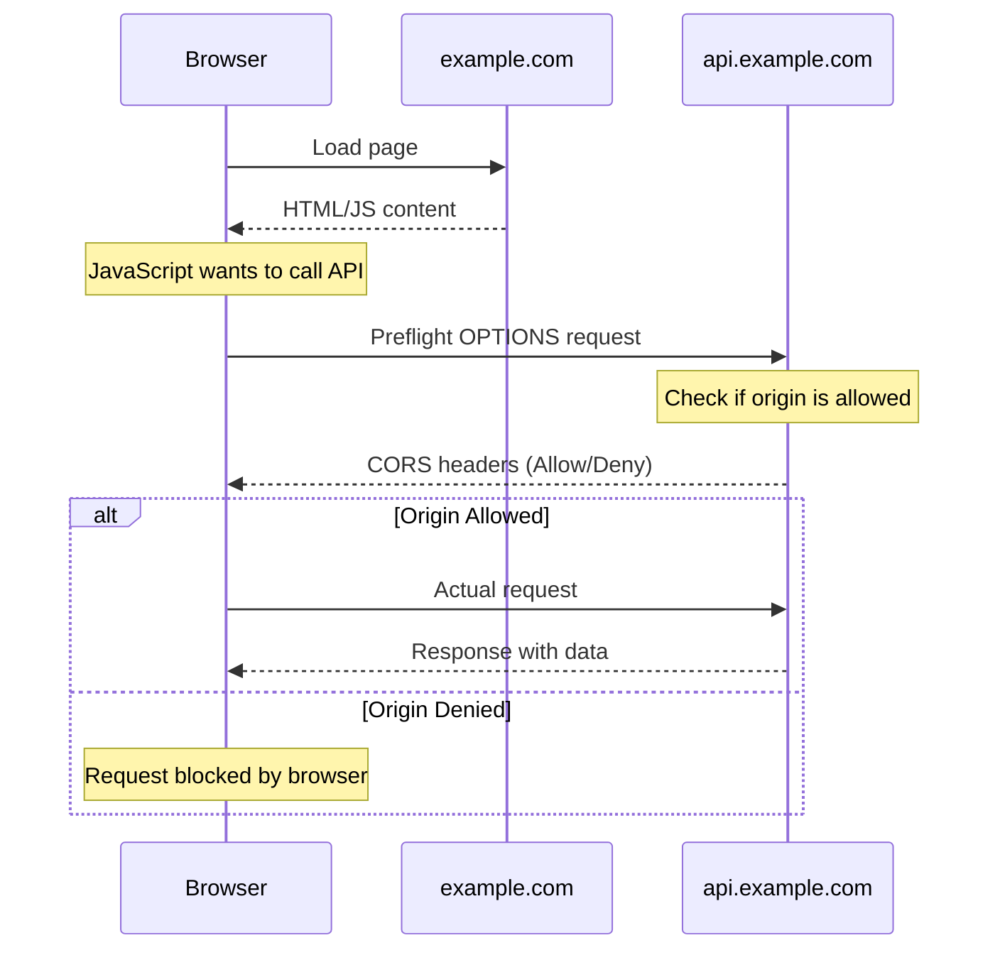
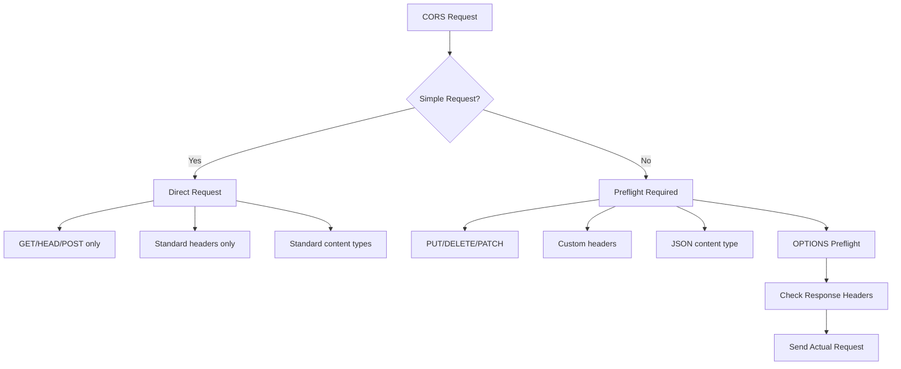
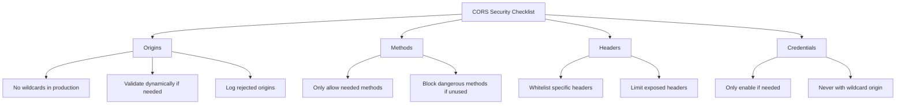

# How to Configure CORS Securely

Author: [nawazdhandala](https://www.github.com/nawazdhandala)

Tags: Security, CORS, Web Development, API, Node.js, Python, Go, Headers, Cross-Origin

Description: Learn how to configure Cross-Origin Resource Sharing (CORS) securely to protect your APIs from unauthorized cross-origin requests while enabling legitimate access.

---

> Cross-Origin Resource Sharing (CORS) is a security feature that controls how web pages from one origin can request resources from another origin. Misconfigured CORS can expose your API to attacks, while overly restrictive settings can break legitimate functionality. This guide shows you how to configure CORS correctly.

CORS misconfiguration is a common security issue that can lead to data theft, session hijacking, and other attacks.

---

## Understanding CORS



---

## CORS Request Types



Simple requests do not trigger a preflight. They include:
- Methods: GET, HEAD, POST
- Headers: Accept, Accept-Language, Content-Language, Content-Type (with restrictions)
- Content-Type: application/x-www-form-urlencoded, multipart/form-data, text/plain

All other requests require a preflight OPTIONS request.

---

## Secure CORS Configuration

### Node.js with Express

```javascript
// cors-config.js
// Secure CORS configuration for Express

const cors = require('cors');

// Define allowed origins explicitly - never use wildcards in production
const allowedOrigins = [
    'https://example.com',
    'https://app.example.com',
    'https://dashboard.example.com'
];

// Development origins (only in non-production)
if (process.env.NODE_ENV !== 'production') {
    allowedOrigins.push('http://localhost:3000');
    allowedOrigins.push('http://localhost:8080');
}

const corsOptions = {
    // Origin validation function
    origin: function (origin, callback) {
        // Allow requests with no origin (mobile apps, curl, etc.)
        // Only if you need to support these cases
        if (!origin) {
            // Be careful - consider if you really need this
            return callback(null, true);
        }

        if (allowedOrigins.includes(origin)) {
            callback(null, true);
        } else {
            callback(new Error('Not allowed by CORS'));
        }
    },

    // Allowed HTTP methods
    methods: ['GET', 'POST', 'PUT', 'DELETE', 'PATCH'],

    // Allowed headers in requests
    allowedHeaders: [
        'Content-Type',
        'Authorization',
        'X-Requested-With',
        'X-Request-ID'
    ],

    // Headers exposed to the browser
    exposedHeaders: [
        'X-Request-ID',
        'X-RateLimit-Limit',
        'X-RateLimit-Remaining'
    ],

    // Allow credentials (cookies, authorization headers)
    // Only enable if you need to send credentials
    credentials: true,

    // Preflight cache duration (in seconds)
    // Browsers will cache preflight responses
    maxAge: 86400, // 24 hours

    // Respond to OPTIONS with 204 (some legacy browsers need 200)
    optionsSuccessStatus: 204
};

// Apply CORS middleware
const app = require('express')();
app.use(cors(corsOptions));

// For specific routes only
app.get('/api/public', cors({ origin: '*' }), (req, res) => {
    // This endpoint allows all origins
    res.json({ message: 'Public data' });
});

// Handle CORS errors gracefully
app.use((err, req, res, next) => {
    if (err.message === 'Not allowed by CORS') {
        res.status(403).json({
            error: 'Cross-origin request blocked',
            message: 'This origin is not allowed to access this resource'
        });
    } else {
        next(err);
    }
});
```

---

### Python with Flask

```python
# cors_config.py
# Secure CORS configuration for Flask

from flask import Flask, request, jsonify
from flask_cors import CORS
from functools import wraps
import os

app = Flask(__name__)

# Define allowed origins
ALLOWED_ORIGINS = [
    'https://example.com',
    'https://app.example.com',
]

# Add development origins
if os.getenv('FLASK_ENV') != 'production':
    ALLOWED_ORIGINS.extend([
        'http://localhost:3000',
        'http://localhost:5000',
    ])

# Configure CORS
CORS(app, resources={
    # API routes with strict CORS
    r"/api/*": {
        "origins": ALLOWED_ORIGINS,
        "methods": ["GET", "POST", "PUT", "DELETE", "PATCH"],
        "allow_headers": ["Content-Type", "Authorization", "X-Request-ID"],
        "expose_headers": ["X-Request-ID", "X-RateLimit-Remaining"],
        "supports_credentials": True,
        "max_age": 86400
    },
    # Public routes with relaxed CORS
    r"/public/*": {
        "origins": "*",
        "methods": ["GET"],
        "allow_headers": ["Content-Type"],
        "supports_credentials": False
    }
})


# Custom CORS decorator for fine-grained control
def cors_restricted(allowed_origins):
    """Decorator for route-specific CORS restrictions"""
    def decorator(f):
        @wraps(f)
        def wrapped(*args, **kwargs):
            origin = request.headers.get('Origin')

            # Check if origin is allowed
            if origin and origin not in allowed_origins:
                return jsonify({'error': 'Origin not allowed'}), 403

            response = f(*args, **kwargs)

            # Add CORS headers to response
            if origin and origin in allowed_origins:
                response.headers['Access-Control-Allow-Origin'] = origin
                response.headers['Access-Control-Allow-Credentials'] = 'true'

            return response
        return wrapped
    return decorator


# Example usage
@app.route('/api/sensitive')
@cors_restricted(['https://admin.example.com'])
def sensitive_data():
    """Only accessible from admin subdomain"""
    return jsonify({'data': 'sensitive information'})


# Validate origin dynamically (e.g., from database)
def validate_origin_from_db(origin):
    """Check if origin is registered in database"""
    # Example: Query database for registered origins
    # registered = db.query(AllowedOrigin).filter_by(url=origin).first()
    # return registered is not None
    return origin in ALLOWED_ORIGINS


@app.before_request
def check_origin():
    """Validate origin for all requests"""
    origin = request.headers.get('Origin')

    if origin and not validate_origin_from_db(origin):
        # Log suspicious request
        app.logger.warning(f'Blocked request from unauthorized origin: {origin}')
```

---

### Go with Standard Library

```go
// cors.go
// Secure CORS middleware for Go

package main

import (
    "net/http"
    "strings"
)

// CORSConfig holds CORS configuration
type CORSConfig struct {
    AllowedOrigins   []string
    AllowedMethods   []string
    AllowedHeaders   []string
    ExposedHeaders   []string
    AllowCredentials bool
    MaxAge           int
}

// DefaultCORSConfig returns secure default configuration
func DefaultCORSConfig() CORSConfig {
    return CORSConfig{
        AllowedOrigins: []string{
            "https://example.com",
            "https://app.example.com",
        },
        AllowedMethods: []string{
            "GET", "POST", "PUT", "DELETE", "PATCH",
        },
        AllowedHeaders: []string{
            "Content-Type", "Authorization", "X-Request-ID",
        },
        ExposedHeaders: []string{
            "X-Request-ID", "X-RateLimit-Remaining",
        },
        AllowCredentials: true,
        MaxAge:           86400,
    }
}

// CORSMiddleware creates CORS middleware with given config
func CORSMiddleware(config CORSConfig) func(http.Handler) http.Handler {
    // Pre-compute allowed origins map for O(1) lookup
    allowedOriginsMap := make(map[string]bool)
    for _, origin := range config.AllowedOrigins {
        allowedOriginsMap[origin] = true
    }

    // Pre-compute header values
    methodsHeader := strings.Join(config.AllowedMethods, ", ")
    headersHeader := strings.Join(config.AllowedHeaders, ", ")
    exposedHeader := strings.Join(config.ExposedHeaders, ", ")

    return func(next http.Handler) http.Handler {
        return http.HandlerFunc(func(w http.ResponseWriter, r *http.Request) {
            origin := r.Header.Get("Origin")

            // No origin header means same-origin request
            if origin == "" {
                next.ServeHTTP(w, r)
                return
            }

            // Check if origin is allowed
            if !allowedOriginsMap[origin] {
                // Log blocked request
                http.Error(w, "Origin not allowed", http.StatusForbidden)
                return
            }

            // Set CORS headers
            w.Header().Set("Access-Control-Allow-Origin", origin)
            w.Header().Set("Access-Control-Allow-Methods", methodsHeader)
            w.Header().Set("Access-Control-Allow-Headers", headersHeader)
            w.Header().Set("Access-Control-Expose-Headers", exposedHeader)
            w.Header().Set("Access-Control-Max-Age", "86400")

            if config.AllowCredentials {
                w.Header().Set("Access-Control-Allow-Credentials", "true")
            }

            // Handle preflight requests
            if r.Method == http.MethodOptions {
                w.WriteHeader(http.StatusNoContent)
                return
            }

            next.ServeHTTP(w, r)
        })
    }
}

// Usage example
func main() {
    mux := http.NewServeMux()

    mux.HandleFunc("/api/data", func(w http.ResponseWriter, r *http.Request) {
        w.Header().Set("Content-Type", "application/json")
        w.Write([]byte(`{"message": "Hello from API"}`))
    })

    // Apply CORS middleware
    config := DefaultCORSConfig()
    handler := CORSMiddleware(config)(mux)

    http.ListenAndServe(":8080", handler)
}
```

---

## Common CORS Mistakes

### Mistake 1: Using Wildcard with Credentials

```javascript
// WRONG - This will not work and is insecure
app.use(cors({
    origin: '*',
    credentials: true  // Cannot use credentials with wildcard origin
}));

// CORRECT - Use specific origins with credentials
app.use(cors({
    origin: ['https://example.com'],
    credentials: true
}));
```

### Mistake 2: Reflecting Origin Without Validation

```javascript
// DANGEROUS - Reflects any origin back
app.use((req, res, next) => {
    const origin = req.headers.origin;
    res.header('Access-Control-Allow-Origin', origin);  // Reflects ANY origin
    res.header('Access-Control-Allow-Credentials', 'true');
    next();
});

// SECURE - Validate origin before reflecting
const allowedOrigins = new Set(['https://example.com', 'https://app.example.com']);

app.use((req, res, next) => {
    const origin = req.headers.origin;
    if (allowedOrigins.has(origin)) {
        res.header('Access-Control-Allow-Origin', origin);
        res.header('Access-Control-Allow-Credentials', 'true');
    }
    next();
});
```

### Mistake 3: Overly Permissive Headers

```javascript
// DANGEROUS - Allows any header
app.use(cors({
    allowedHeaders: '*'
}));

// SECURE - Specify exactly which headers are needed
app.use(cors({
    allowedHeaders: ['Content-Type', 'Authorization']
}));
```

---

## CORS Security Checklist



| Check | Description | Priority |
|-------|-------------|----------|
| No wildcard origins | Use explicit origin list in production | Critical |
| Validate origins | Check origins against allowlist | Critical |
| Limit methods | Only allow necessary HTTP methods | High |
| Whitelist headers | Specify exact headers needed | High |
| Credentials policy | Only enable if sending cookies/auth | High |
| Cache preflight | Set appropriate max-age | Medium |
| Log violations | Monitor blocked cross-origin requests | Medium |

---

## Testing CORS Configuration

```bash
#!/bin/bash
# test_cors.sh
# Test CORS configuration

API_URL="https://api.example.com"
ALLOWED_ORIGIN="https://example.com"
BLOCKED_ORIGIN="https://malicious.com"

echo "Testing CORS Configuration"
echo "========================="

# Test preflight request from allowed origin
echo ""
echo "1. Testing allowed origin preflight..."
curl -s -X OPTIONS "$API_URL/api/data" \
    -H "Origin: $ALLOWED_ORIGIN" \
    -H "Access-Control-Request-Method: POST" \
    -H "Access-Control-Request-Headers: Content-Type, Authorization" \
    -D - -o /dev/null | grep -i "access-control"

# Test actual request from allowed origin
echo ""
echo "2. Testing allowed origin request..."
curl -s "$API_URL/api/data" \
    -H "Origin: $ALLOWED_ORIGIN" \
    -D - -o /dev/null | grep -i "access-control"

# Test blocked origin
echo ""
echo "3. Testing blocked origin (should fail)..."
response=$(curl -s -w "%{http_code}" "$API_URL/api/data" \
    -H "Origin: $BLOCKED_ORIGIN" \
    -o /dev/null)

if [ "$response" == "403" ]; then
    echo "Blocked origin correctly rejected (403)"
else
    echo "WARNING: Blocked origin was not rejected (status: $response)"
fi

# Test credentials with wildcard (should fail)
echo ""
echo "4. Checking credentials are not sent with wildcard..."
curl -s "$API_URL/api/public" \
    -H "Origin: https://random.com" \
    --cookie "session=test" \
    -D - -o /dev/null | grep -i "access-control-allow-credentials"
```

---

## Key Takeaways

1. **Never use wildcard origins in production** - Always specify exact allowed origins
2. **Validate origins server-side** - Do not rely only on browser enforcement
3. **Credentials require specific origins** - Cannot use `*` with `credentials: true`
4. **Limit allowed methods and headers** - Only permit what your API actually needs
5. **Cache preflight responses** - Use `max-age` to reduce preflight requests
6. **Monitor CORS violations** - Log and alert on rejected cross-origin requests

---

*Need to monitor your API security including CORS violations? [OneUptime](https://oneuptime.com) provides comprehensive API monitoring with security alerting capabilities.*

**Related Reading:**
- [How to Fix "Security Misconfiguration" Issues](https://oneuptime.com/blog/post/2026-01-24-fix-security-misconfiguration/view)
- [How to Fix "Sensitive Data Exposure" Issues](https://oneuptime.com/blog/post/2026-01-24-fix-sensitive-data-exposure/view)
- [How to Handle Input Validation](https://oneuptime.com/blog/post/2026-01-24-handle-input-validation/view)
