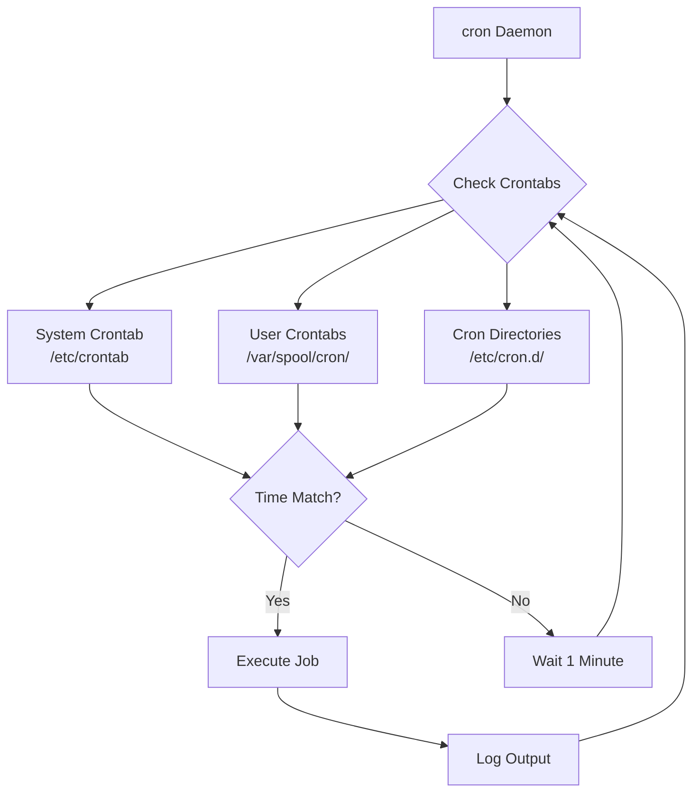
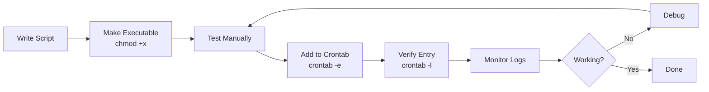

# How to Configure cron Jobs for Scheduled Tasks

Author: [nawazdhandala](https://www.github.com/nawazdhandala)

Tags: Linux, Cron, Automation, System Administration, Scheduling

Description: Learn how to create, manage, and troubleshoot cron jobs for automating scheduled tasks on Linux systems.

---

Cron is the time-based job scheduler in Unix-like operating systems. It enables you to run scripts, commands, or programs at specified times and intervals without manual intervention. This guide covers everything from basic cron syntax to advanced scheduling techniques.

## Understanding Cron Architecture

Before diving into configuration, let's understand how cron works at a high level.



## 1. Cron Syntax Explained

Every cron job follows a specific format with five time fields followed by the command to execute.

```
# Cron time field format
# ┌───────────── minute (0-59)
# │ ┌───────────── hour (0-23)
# │ │ ┌───────────── day of month (1-31)
# │ │ │ ┌───────────── month (1-12)
# │ │ │ │ ┌───────────── day of week (0-7, 0 and 7 are Sunday)
# │ │ │ │ │
# * * * * * command_to_execute
```

### Special Characters

| Character | Meaning | Example |
|-----------|---------|---------|
| `*` | Any value | `* * * * *` runs every minute |
| `,` | List separator | `0,30 * * * *` runs at 0 and 30 minutes |
| `-` | Range | `0-5 * * * *` runs minutes 0 through 5 |
| `/` | Step values | `*/15 * * * *` runs every 15 minutes |

## 2. Managing User Crontabs

Each user can have their own crontab file. Use these commands to manage personal cron jobs.

```bash
# Edit your personal crontab - opens in default editor
crontab -e

# List all cron jobs for current user
crontab -l

# Remove all cron jobs for current user (use with caution)
crontab -r

# Edit crontab for a specific user (requires root)
sudo crontab -u username -e

# List cron jobs for a specific user
sudo crontab -u username -l
```

## 3. Common Cron Schedule Examples

Here are practical examples covering the most common scheduling patterns.

```bash
# Run a backup script every day at 2:30 AM
30 2 * * * /home/admin/scripts/backup.sh

# Run a cleanup script every Sunday at midnight
0 0 * * 0 /usr/local/bin/cleanup.sh

# Run a health check every 5 minutes
*/5 * * * * /opt/monitoring/health-check.sh

# Run a report generator on the 1st of every month at 6 AM
0 6 1 * * /home/admin/scripts/monthly-report.sh

# Run a task every weekday (Monday through Friday) at 9 AM
0 9 * * 1-5 /home/admin/scripts/workday-task.sh

# Run a task every 2 hours
0 */2 * * * /home/admin/scripts/bi-hourly-task.sh

# Run a task at 8 AM, 12 PM, and 5 PM daily
0 8,12,17 * * * /home/admin/scripts/three-times-daily.sh
```

## 4. Using Predefined Schedule Strings

Many cron implementations support convenient shorthand notations for common schedules.

```bash
# These special strings replace the five time fields

@reboot     # Run once at system startup
@yearly     # Run once a year (0 0 1 1 *)
@annually   # Same as @yearly
@monthly    # Run once a month (0 0 1 * *)
@weekly     # Run once a week (0 0 * * 0)
@daily      # Run once a day (0 0 * * *)
@midnight   # Same as @daily
@hourly     # Run once an hour (0 * * * *)

# Example: Run a script at every system boot
@reboot /home/admin/scripts/startup-tasks.sh
```

## 5. System-Wide Cron Configuration

System administrators can configure cron jobs that run as specific users in `/etc/crontab` or drop files in `/etc/cron.d/`.

```bash
# /etc/crontab format includes a username field
# min hour dom month dow user command

# Example /etc/crontab entry - run as www-data user
15 3 * * * www-data /var/www/scripts/cache-clear.sh

# Example /etc/crontab entry - run as root
0 4 * * * root /usr/local/sbin/system-maintenance.sh
```

### Cron Directory Structure

```bash
# List system cron directories
ls -la /etc/cron.*

# /etc/cron.hourly/  - Scripts run every hour
# /etc/cron.daily/   - Scripts run once daily
# /etc/cron.weekly/  - Scripts run once weekly
# /etc/cron.monthly/ - Scripts run once monthly
# /etc/cron.d/       - Custom cron job files
```

## 6. Handling Output and Logging

By default, cron emails output to the user. Configure output handling explicitly to avoid mail buildup.

```bash
# Redirect stdout and stderr to a log file
0 2 * * * /home/admin/scripts/backup.sh >> /var/log/backup.log 2>&1

# Discard all output (use only when you don't need logs)
0 3 * * * /home/admin/scripts/cleanup.sh > /dev/null 2>&1

# Log stdout to file, email stderr
0 4 * * * /home/admin/scripts/task.sh >> /var/log/task.log 2>&1

# Set a custom email address for cron output
MAILTO="admin@example.com"
0 5 * * * /home/admin/scripts/important-task.sh

# Disable email notifications entirely
MAILTO=""
0 6 * * * /home/admin/scripts/silent-task.sh
```

## 7. Environment Variables in Cron

Cron runs with a minimal environment. Set required variables explicitly.

```bash
# Set environment variables at the top of crontab
SHELL=/bin/bash
PATH=/usr/local/sbin:/usr/local/bin:/usr/sbin:/usr/bin:/sbin:/bin
HOME=/home/admin
MAILTO=admin@example.com

# These variables apply to all jobs below them
0 2 * * * /home/admin/scripts/backup.sh

# Or set variables inline for a specific job
0 3 * * * export JAVA_HOME=/usr/lib/jvm/java-11 && /opt/app/run-job.sh
```

## 8. Cron Job Workflow

This diagram shows the lifecycle of a cron job from creation to execution.



## 9. Creating a Complete Cron Job Script

Here's a production-ready backup script with proper logging and error handling.

```bash
#!/bin/bash
# /home/admin/scripts/backup.sh
# Database backup script with logging and error handling

# Configuration
BACKUP_DIR="/var/backups/db"
DB_NAME="myapp_production"
DB_USER="backup_user"
DATE=$(date +%Y%m%d_%H%M%S)
LOG_FILE="/var/log/backup.log"
RETENTION_DAYS=7

# Function to log messages with timestamps
log_message() {
    echo "[$(date '+%Y-%m-%d %H:%M:%S')] $1" >> "$LOG_FILE"
}

# Create backup directory if it doesn't exist
mkdir -p "$BACKUP_DIR"

log_message "Starting backup of $DB_NAME"

# Perform the backup
if pg_dump -U "$DB_USER" "$DB_NAME" | gzip > "$BACKUP_DIR/${DB_NAME}_${DATE}.sql.gz"; then
    log_message "Backup completed successfully: ${DB_NAME}_${DATE}.sql.gz"
else
    log_message "ERROR: Backup failed for $DB_NAME"
    exit 1
fi

# Remove backups older than retention period
find "$BACKUP_DIR" -name "*.sql.gz" -mtime +$RETENTION_DAYS -delete
log_message "Cleaned up backups older than $RETENTION_DAYS days"

log_message "Backup process finished"
exit 0
```

Add it to crontab:

```bash
# Run backup every day at 2 AM
0 2 * * * /home/admin/scripts/backup.sh
```

## 10. Troubleshooting Cron Jobs

When cron jobs fail silently, use these debugging techniques.

```bash
# Check if cron daemon is running
systemctl status cron
# or on older systems
service cron status

# View cron logs (location varies by distribution)
# Debian/Ubuntu
sudo grep CRON /var/log/syslog

# RHEL/CentOS
sudo grep CRON /var/log/cron

# View recent cron activity
sudo journalctl -u cron --since "1 hour ago"

# Test your script manually with cron's minimal environment
env -i /bin/bash --noprofile --norc -c '/path/to/your/script.sh'
```

### Common Issues and Solutions

| Problem | Cause | Solution |
|---------|-------|----------|
| Job not running | Wrong permissions | `chmod +x script.sh` |
| Command not found | PATH not set | Use full paths or set PATH |
| No output | Output not redirected | Redirect to log file |
| Wrong timezone | System timezone | Check `timedatectl` |
| Script works manually | Environment differences | Set variables in crontab |

## 11. Cron Security Best Practices

Control who can use cron and secure your scheduled tasks.

```bash
# Allow only specific users to use cron
# Create /etc/cron.allow with permitted usernames
echo "admin" | sudo tee /etc/cron.allow
echo "deploy" | sudo tee -a /etc/cron.allow

# Deny specific users from using cron
# Create /etc/cron.deny with blocked usernames
echo "guest" | sudo tee /etc/cron.deny

# Secure your cron scripts
chmod 700 /home/admin/scripts/*.sh
chown admin:admin /home/admin/scripts/*.sh

# Never store passwords in crontab - use secure methods
# Bad: 0 2 * * * mysqldump -p'password' ...
# Good: Use ~/.my.cnf with restricted permissions
```

## 12. Alternative: Using systemd Timers

Modern Linux systems can use systemd timers as a cron alternative with better logging and dependency management.

```bash
# Create a service unit: /etc/systemd/system/backup.service
[Unit]
Description=Daily Database Backup
After=postgresql.service

[Service]
Type=oneshot
ExecStart=/home/admin/scripts/backup.sh
User=admin

# Create a timer unit: /etc/systemd/system/backup.timer
[Unit]
Description=Run backup daily at 2 AM

[Timer]
OnCalendar=*-*-* 02:00:00
Persistent=true

[Install]
WantedBy=timers.target
```

Enable and manage the timer:

```bash
# Enable and start the timer
sudo systemctl enable backup.timer
sudo systemctl start backup.timer

# Check timer status
systemctl list-timers --all

# View logs for the service
journalctl -u backup.service
```

---

Cron remains one of the most reliable tools for task automation on Linux. Master its syntax, implement proper logging, and follow security best practices to build a robust scheduled task infrastructure.
