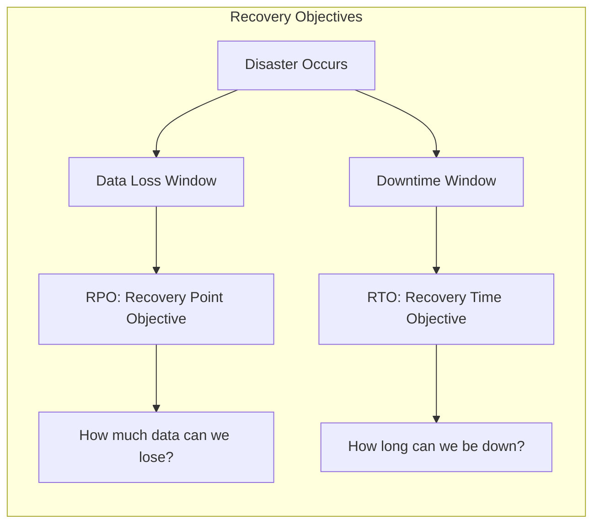
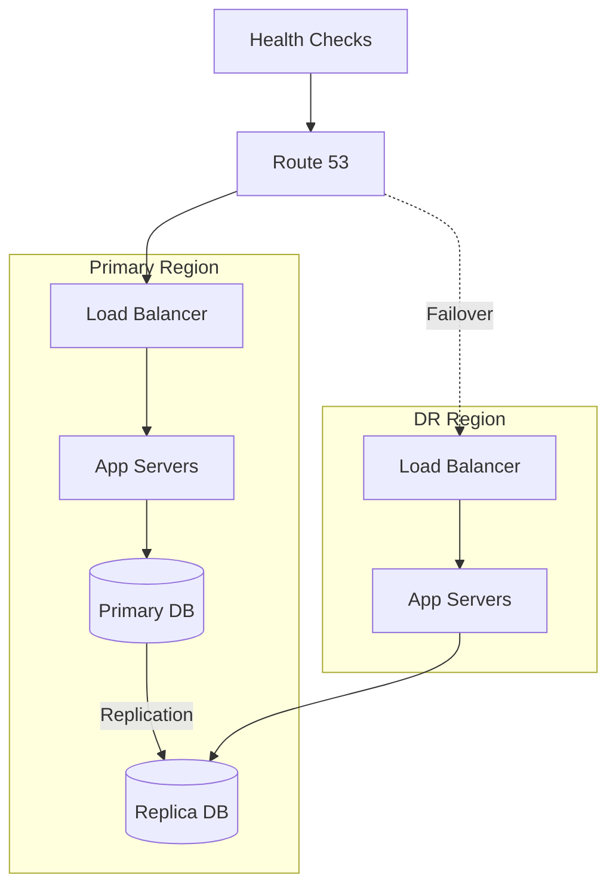

# How to Configure Disaster Recovery

Author: [nawazdhandala](https://www.github.com/nawazdhandala)

Tags: Disaster Recovery, Business Continuity, High Availability, Backup, DevOps, SRE, Infrastructure

Description: A practical guide to configuring disaster recovery plans, including RTO/RPO definitions, backup strategies, failover procedures, and testing protocols.

---

Disasters happen. Datacenters flood. Cloud regions go down. Engineers accidentally delete production databases. The question is not if something will go wrong, but when. A well-configured disaster recovery plan ensures your business survives when the worst happens.

## Understanding Recovery Objectives

Before configuring anything, define what recovery means for your business:



```yaml
# recovery-objectives.yaml
# Define RTO and RPO for each service tier

service_tiers:
  tier1_critical:
    description: "Revenue-generating, customer-facing services"
    examples:
      - "Payment processing"
      - "User authentication"
      - "Core API"
    rpo: "0 minutes"  # Zero data loss
    rto: "15 minutes"  # Back online within 15 min
    strategy: "Active-active multi-region"

  tier2_important:
    description: "Important but not immediately revenue-impacting"
    examples:
      - "Search functionality"
      - "Recommendations"
      - "Notifications"
    rpo: "15 minutes"
    rto: "1 hour"
    strategy: "Warm standby"

  tier3_standard:
    description: "Internal tools and non-critical features"
    examples:
      - "Admin dashboard"
      - "Analytics"
      - "Reporting"
    rpo: "1 hour"
    rto: "4 hours"
    strategy: "Cold standby with backups"

  tier4_low:
    description: "Development and testing environments"
    examples:
      - "Staging"
      - "Dev environments"
      - "CI/CD"
    rpo: "24 hours"
    rto: "24 hours"
    strategy: "Backup restore only"
```

## Database Backup Configuration

Databases are usually the most critical piece. Configure comprehensive backups:

```bash
#!/bin/bash
# database_backup.sh
# Comprehensive PostgreSQL backup script

set -euo pipefail

# Configuration
DB_HOST="${DB_HOST:-localhost}"
DB_NAME="${DB_NAME:-production}"
DB_USER="${DB_USER:-postgres}"
BACKUP_DIR="/var/backups/postgresql"
S3_BUCKET="s3://company-backups/postgresql"
RETENTION_DAYS=30

# Timestamp for this backup
TIMESTAMP=$(date +%Y%m%d_%H%M%S)
BACKUP_FILE="${BACKUP_DIR}/${DB_NAME}_${TIMESTAMP}.sql.gz"

# Create backup directory if needed
mkdir -p "${BACKUP_DIR}"

echo "[$(date)] Starting backup of ${DB_NAME}"

# Create compressed backup
pg_dump -h "${DB_HOST}" -U "${DB_USER}" -d "${DB_NAME}" \
    --format=custom \
    --compress=9 \
    --file="${BACKUP_FILE}"

# Verify backup integrity
pg_restore --list "${BACKUP_FILE}" > /dev/null 2>&1
if [ $? -eq 0 ]; then
    echo "[$(date)] Backup verified successfully"
else
    echo "[$(date)] ERROR: Backup verification failed!"
    exit 1
fi

# Calculate checksum
sha256sum "${BACKUP_FILE}" > "${BACKUP_FILE}.sha256"

# Upload to S3 with server-side encryption
aws s3 cp "${BACKUP_FILE}" "${S3_BUCKET}/${DB_NAME}/" \
    --sse aws:kms \
    --storage-class STANDARD_IA

aws s3 cp "${BACKUP_FILE}.sha256" "${S3_BUCKET}/${DB_NAME}/"

echo "[$(date)] Backup uploaded to S3"

# Cleanup old local backups
find "${BACKUP_DIR}" -name "*.sql.gz" -mtime +7 -delete

# Cleanup old S3 backups (keep 30 days)
aws s3 ls "${S3_BUCKET}/${DB_NAME}/" | while read -r line; do
    file_date=$(echo "$line" | awk '{print $1}')
    file_name=$(echo "$line" | awk '{print $4}')

    if [[ -n "$file_date" && -n "$file_name" ]]; then
        file_age=$(( ($(date +%s) - $(date -d "$file_date" +%s)) / 86400 ))
        if [ "$file_age" -gt "$RETENTION_DAYS" ]; then
            aws s3 rm "${S3_BUCKET}/${DB_NAME}/${file_name}"
            echo "[$(date)] Deleted old backup: ${file_name}"
        fi
    fi
done

echo "[$(date)] Backup completed successfully"
```

## Multi-Region Failover Architecture

For critical services, configure active-passive or active-active multi-region:



Configure DNS-based failover:

```yaml
# terraform/route53_failover.tf
# Configure Route 53 health checks and failover routing

resource "aws_route53_health_check" "primary" {
  fqdn              = "primary.api.company.com"
  port              = 443
  type              = "HTTPS"
  resource_path     = "/health"
  failure_threshold = "3"
  request_interval  = "10"

  tags = {
    Name = "primary-health-check"
  }
}

resource "aws_route53_health_check" "secondary" {
  fqdn              = "secondary.api.company.com"
  port              = 443
  type              = "HTTPS"
  resource_path     = "/health"
  failure_threshold = "3"
  request_interval  = "10"

  tags = {
    Name = "secondary-health-check"
  }
}

resource "aws_route53_record" "api_primary" {
  zone_id = aws_route53_zone.main.zone_id
  name    = "api.company.com"
  type    = "A"

  alias {
    name                   = aws_lb.primary.dns_name
    zone_id                = aws_lb.primary.zone_id
    evaluate_target_health = true
  }

  failover_routing_policy {
    type = "PRIMARY"
  }

  set_identifier  = "primary"
  health_check_id = aws_route53_health_check.primary.id
}

resource "aws_route53_record" "api_secondary" {
  zone_id = aws_route53_zone.main.zone_id
  name    = "api.company.com"
  type    = "A"

  alias {
    name                   = aws_lb.secondary.dns_name
    zone_id                = aws_lb.secondary.zone_id
    evaluate_target_health = true
  }

  failover_routing_policy {
    type = "SECONDARY"
  }

  set_identifier  = "secondary"
  health_check_id = aws_route53_health_check.secondary.id
}
```

## Database Replication Setup

Configure PostgreSQL streaming replication for zero-RPO recovery:

```yaml
# primary-postgresql.conf
# Primary database configuration

# Enable WAL archiving
wal_level = replica
max_wal_senders = 5
wal_keep_size = 1GB

# Archive WAL to S3 for point-in-time recovery
archive_mode = on
archive_command = 'aws s3 cp %p s3://company-wal-archive/%f'

# Synchronous replication for zero data loss (optional, adds latency)
# synchronous_standby_names = 'replica1'
```

```yaml
# replica-postgresql.conf
# Replica database configuration

# This server is a standby
hot_standby = on

# Connection to primary
primary_conninfo = 'host=primary.db.internal port=5432 user=replication password=xxx'

# Restore WAL from archive if streaming falls behind
restore_command = 'aws s3 cp s3://company-wal-archive/%f %p'
```

## Automated Failover Script

Create a runbook for manual failover with automation support:

```python
#!/usr/bin/env python3
# failover.py
# Orchestrate disaster recovery failover

import boto3
import subprocess
import time
import logging
from datetime import datetime

logging.basicConfig(level=logging.INFO)
logger = logging.getLogger('failover')

class DisasterRecoveryFailover:
    def __init__(self, config):
        self.config = config
        self.route53 = boto3.client('route53')
        self.rds = boto3.client('rds')
        self.sns = boto3.client('sns')

    def execute_failover(self, reason):
        """Execute full failover procedure"""

        logger.info(f"Starting failover. Reason: {reason}")
        start_time = datetime.now()

        try:
            # Step 1: Notify team
            self._notify_team(f"DR Failover initiated: {reason}")

            # Step 2: Verify DR region is healthy
            if not self._check_dr_health():
                raise Exception("DR region health check failed")

            # Step 3: Promote database replica
            self._promote_database()

            # Step 4: Update DNS to point to DR region
            self._update_dns()

            # Step 5: Verify failover
            self._verify_failover()

            # Step 6: Notify completion
            duration = (datetime.now() - start_time).total_seconds()
            self._notify_team(f"DR Failover completed in {duration:.0f} seconds")

            logger.info(f"Failover completed in {duration:.0f} seconds")
            return True

        except Exception as e:
            logger.error(f"Failover failed: {e}")
            self._notify_team(f"DR Failover FAILED: {e}")
            raise

    def _check_dr_health(self):
        """Verify DR region is ready to take traffic"""

        logger.info("Checking DR region health...")

        # Check application health
        health_url = f"https://{self.config['dr_endpoint']}/health"
        response = subprocess.run(
            ['curl', '-sf', health_url],
            capture_output=True
        )

        if response.returncode != 0:
            logger.error("DR application health check failed")
            return False

        # Check database connectivity
        db_check = subprocess.run(
            ['pg_isready', '-h', self.config['dr_db_host']],
            capture_output=True
        )

        if db_check.returncode != 0:
            logger.error("DR database health check failed")
            return False

        logger.info("DR region health check passed")
        return True

    def _promote_database(self):
        """Promote read replica to primary"""

        logger.info("Promoting database replica...")

        # For RDS
        if self.config.get('use_rds'):
            self.rds.promote_read_replica(
                DBInstanceIdentifier=self.config['dr_db_instance']
            )

            # Wait for promotion to complete
            waiter = self.rds.get_waiter('db_instance_available')
            waiter.wait(
                DBInstanceIdentifier=self.config['dr_db_instance'],
                WaiterConfig={'Delay': 30, 'MaxAttempts': 40}
            )

        # For self-managed PostgreSQL
        else:
            subprocess.run([
                'ssh', self.config['dr_db_host'],
                'pg_ctl', 'promote', '-D', '/var/lib/postgresql/data'
            ], check=True)

            # Wait for promotion
            time.sleep(30)

        logger.info("Database promotion completed")

    def _update_dns(self):
        """Update Route 53 to point to DR region"""

        logger.info("Updating DNS records...")

        # Get current records
        response = self.route53.list_resource_record_sets(
            HostedZoneId=self.config['hosted_zone_id'],
            StartRecordName=self.config['domain'],
            MaxItems='1'
        )

        # Update to DR endpoint
        self.route53.change_resource_record_sets(
            HostedZoneId=self.config['hosted_zone_id'],
            ChangeBatch={
                'Comment': f'DR Failover at {datetime.now().isoformat()}',
                'Changes': [{
                    'Action': 'UPSERT',
                    'ResourceRecordSet': {
                        'Name': self.config['domain'],
                        'Type': 'A',
                        'AliasTarget': {
                            'HostedZoneId': self.config['dr_alb_zone_id'],
                            'DNSName': self.config['dr_alb_dns'],
                            'EvaluateTargetHealth': True
                        }
                    }
                }]
            }
        )

        logger.info("DNS updated, waiting for propagation...")
        time.sleep(60)  # Wait for DNS propagation

    def _verify_failover(self):
        """Verify failover was successful"""

        logger.info("Verifying failover...")

        # Check that traffic is hitting DR region
        for _ in range(5):
            response = subprocess.run(
                ['curl', '-sf', f"https://{self.config['domain']}/health"],
                capture_output=True
            )

            if response.returncode == 0:
                logger.info("Failover verified - service is responding")
                return True

            time.sleep(10)

        raise Exception("Failover verification failed - service not responding")

    def _notify_team(self, message):
        """Send notification to operations team"""

        self.sns.publish(
            TopicArn=self.config['sns_topic'],
            Subject='DR Failover Notification',
            Message=message
        )


# Configuration
config = {
    'dr_endpoint': 'dr.api.company.com',
    'dr_db_host': 'db.dr.company.internal',
    'dr_db_instance': 'production-dr',
    'use_rds': True,
    'hosted_zone_id': 'Z1234567890',
    'domain': 'api.company.com',
    'dr_alb_zone_id': 'Z0987654321',
    'dr_alb_dns': 'dr-alb-123456.us-west-2.elb.amazonaws.com',
    'sns_topic': 'arn:aws:sns:us-east-1:123456789:dr-notifications'
}

if __name__ == '__main__':
    import sys
    reason = sys.argv[1] if len(sys.argv) > 1 else "Manual failover"

    dr = DisasterRecoveryFailover(config)
    dr.execute_failover(reason)
```

## DR Testing Schedule

Regular testing ensures your DR plan actually works:

```yaml
# dr-testing-schedule.yaml
# Schedule for disaster recovery tests

tests:
  # Weekly: Verify backups are restorable
  backup_verification:
    frequency: "weekly"
    day: "Sunday"
    time: "02:00 UTC"
    procedure:
      - "Select random backup from past week"
      - "Restore to test environment"
      - "Run data integrity checks"
      - "Verify application can connect and read data"
    success_criteria:
      - "Backup restores without errors"
      - "All tables present with expected row counts"
      - "Application health check passes"
    owner: "DBA team"

  # Monthly: Failover drill (non-production)
  failover_drill_staging:
    frequency: "monthly"
    week: "first"
    day: "Saturday"
    time: "10:00 UTC"
    procedure:
      - "Announce test to stakeholders"
      - "Simulate primary region failure"
      - "Execute failover runbook"
      - "Verify DR region handles traffic"
      - "Measure RTO achieved"
      - "Failback to primary"
    success_criteria:
      - "RTO under 15 minutes"
      - "No data loss"
      - "All services healthy in DR"
    owner: "SRE team"

  # Quarterly: Full production DR test
  full_dr_test:
    frequency: "quarterly"
    procedure:
      - "Schedule maintenance window"
      - "Notify all stakeholders 2 weeks ahead"
      - "Execute full failover to DR region"
      - "Run production traffic from DR for 2 hours"
      - "Monitor for issues"
      - "Failback to primary"
      - "Document lessons learned"
    success_criteria:
      - "RTO under target for all tiers"
      - "RPO met (no data loss)"
      - "Customer impact minimal"
      - "All critical features functional"
    owner: "VP Engineering"

  # Annual: Full disaster simulation
  disaster_simulation:
    frequency: "annual"
    procedure:
      - "Simulate complete primary region loss"
      - "Activate incident response"
      - "Execute DR without warning to test team"
      - "Run from DR for 24 hours"
      - "Full post-mortem and review"
    success_criteria:
      - "Business continuity maintained"
      - "Communication plan effective"
      - "Recovery within SLA"
    owner: "CTO"
```

## DR Runbook

Create a clear runbook for when disaster strikes:

```markdown
# Disaster Recovery Runbook

## When to Activate DR

Activate DR when:
- Primary region is completely unavailable
- Primary database is unrecoverable
- Estimated recovery time exceeds RTO
- Security incident requires isolation

Do NOT activate DR for:
- Single service outage (use service-level recovery)
- Partial degradation (use mitigation instead)
- Issues that can be resolved within RTO

## Pre-Failover Checklist

- [ ] Confirm primary region is truly unavailable
- [ ] Verify DR region is healthy
- [ ] Notify incident commander
- [ ] Open bridge call for coordination
- [ ] Confirm authorization from VP Engineering or higher

## Failover Steps

### 1. Database Failover (10 min)

```bash
# Promote replica to primary
./failover.py --component database --reason "Primary region failure"

# Verify database is accepting writes
psql -h dr.db.company.internal -c "INSERT INTO health_check VALUES (now());"
```

### 2. Application Failover (5 min)

```bash
# Scale up DR application servers
kubectl --context=dr-cluster scale deployment/api --replicas=10

# Verify applications are healthy
curl -f https://dr.api.company.com/health
```

### 3. DNS Failover (5 min)

```bash
# Update DNS to point to DR
./failover.py --component dns

# Verify DNS propagation
dig api.company.com
```

### 4. Verification (5 min)

- [ ] Main website loads
- [ ] User login works
- [ ] Core API endpoints respond
- [ ] Payment processing works
- [ ] Database writes succeed

## Post-Failover

- [ ] Update status page
- [ ] Notify customers
- [ ] Begin primary region recovery
- [ ] Schedule failback

## Failback Procedure

Only failback when:
- Primary region is fully recovered
- Data has been synchronized
- Maintenance window is scheduled
- Team is prepared for potential issues
```

## Best Practices

1. **Test regularly** - Untested DR plans fail when needed
2. **Document everything** - Clear runbooks save time during emergencies
3. **Automate where possible** - Manual steps introduce errors and delays
4. **Monitor your backups** - A backup that fails silently is no backup at all
5. **Calculate true RTO** - Include time for decision-making, not just technical steps
6. **Consider dependencies** - Your app may recover, but what about third-party services?
7. **Train your team** - Everyone should know their role during DR
8. **Review after incidents** - Every DR activation teaches something valuable

---

Disaster recovery is insurance you hope to never use. But when you need it, having a well-configured, well-tested DR plan is the difference between a bad day and a business-ending catastrophe. Invest the time now to configure it properly, and test it regularly.
