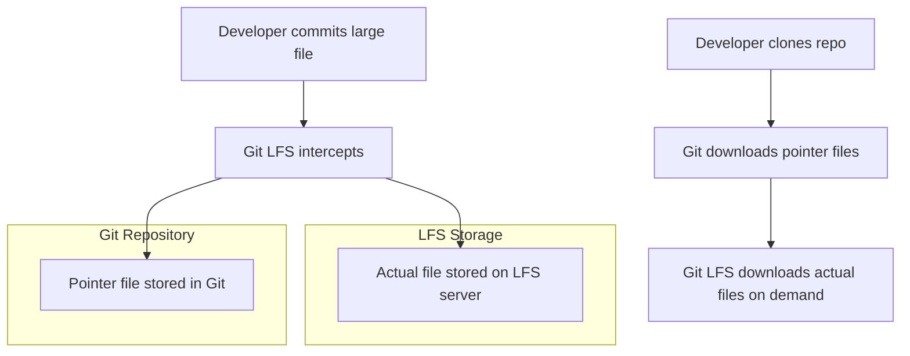
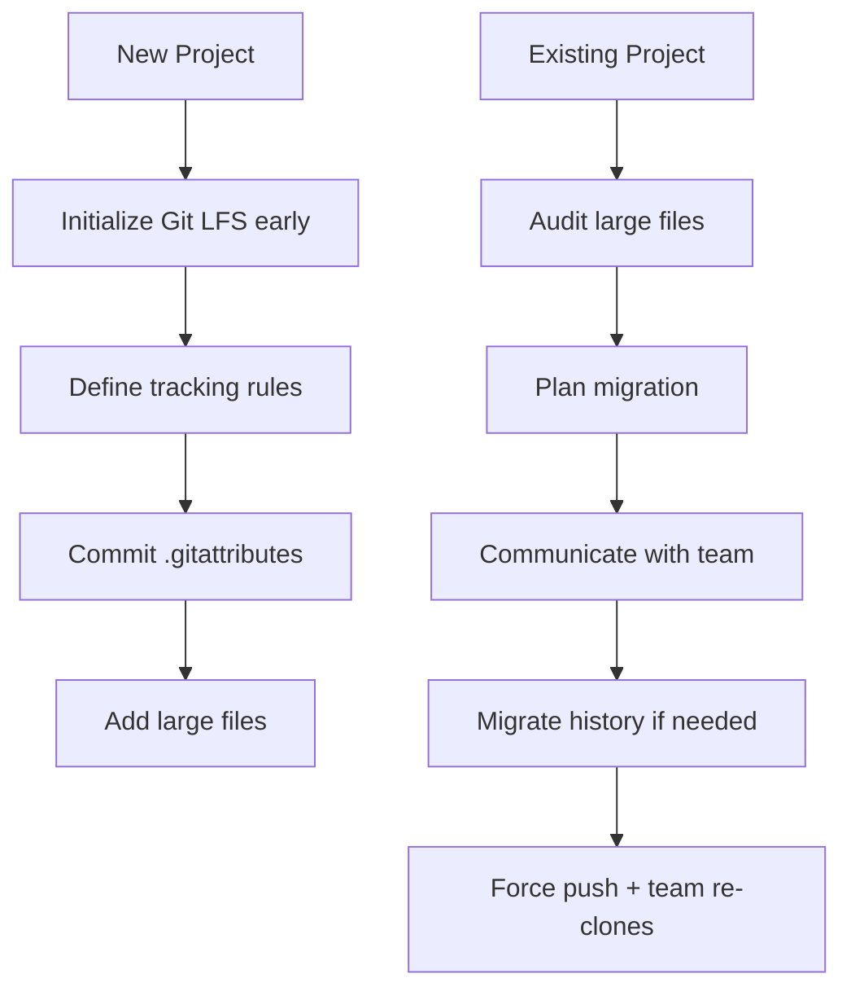

# How to Configure Git LFS for Large Files

Author: [nawazdhandala](https://www.github.com/nawazdhandala)

Tags: Git, Git LFS, Large Files, Version Control, DevOps, Binary Files

Description: A complete guide to setting up and using Git Large File Storage (LFS) to efficiently manage large binary files in your Git repositories.

---

Git was designed for tracking text files, not large binaries. When you store large files like videos, datasets, or compiled binaries directly in Git, your repository bloats and operations slow down dramatically. Git LFS solves this problem by storing large files outside your repository while maintaining seamless Git integration.

## How Git LFS Works



Instead of storing the actual file content, Git LFS stores a small pointer file in your repository. The real file lives on a separate LFS server. When you clone or checkout, Git LFS automatically fetches the files you need.

## Installing Git LFS

### macOS

```bash
# Using Homebrew
brew install git-lfs

# Initialize Git LFS for your user
git lfs install
```

### Linux (Ubuntu/Debian)

```bash
# Add the packagecloud repository
curl -s https://packagecloud.io/install/repositories/github/git-lfs/script.deb.sh | sudo bash

# Install git-lfs
sudo apt-get install git-lfs

# Initialize
git lfs install
```

### Linux (CentOS/RHEL)

```bash
# Add the packagecloud repository
curl -s https://packagecloud.io/install/repositories/github/git-lfs/script.rpm.sh | sudo bash

# Install
sudo yum install git-lfs

# Initialize
git lfs install
```

### Windows

```powershell
# Using winget
winget install GitHub.GitLFS

# Or download from https://git-lfs.github.com/

# Initialize
git lfs install
```

Verify installation:

```bash
git lfs version
# git-lfs/3.4.0 (GitHub; darwin amd64; go 1.21.1)
```

## Setting Up Git LFS in a Repository

### Step 1: Initialize LFS

```bash
# Navigate to your repository
cd your-repo

# Initialize Git LFS (if not done globally)
git lfs install
```

### Step 2: Track File Types

Tell Git LFS which files to manage:

```bash
# Track by extension
git lfs track "*.psd"
git lfs track "*.zip"
git lfs track "*.mp4"
git lfs track "*.bin"

# Track specific files
git lfs track "data/large-dataset.csv"

# Track entire directories
git lfs track "assets/videos/**"

# Track by size pattern (files over certain size)
# Note: This requires additional configuration
```

This creates or updates a `.gitattributes` file:

```bash
# View what is being tracked
cat .gitattributes
```

```
*.psd filter=lfs diff=lfs merge=lfs -text
*.zip filter=lfs diff=lfs merge=lfs -text
*.mp4 filter=lfs diff=lfs merge=lfs -text
*.bin filter=lfs diff=lfs merge=lfs -text
```

### Step 3: Commit the Configuration

```bash
# Always commit .gitattributes first
git add .gitattributes
git commit -m "Configure Git LFS tracking for binary files"
```

### Step 4: Add Large Files

```bash
# Now add your large files
git add assets/video.mp4
git commit -m "Add promotional video"
git push
```

## Common File Types to Track

Here is a recommended `.gitattributes` for various project types:

### General Purpose

```
# Archives
*.7z filter=lfs diff=lfs merge=lfs -text
*.br filter=lfs diff=lfs merge=lfs -text
*.gz filter=lfs diff=lfs merge=lfs -text
*.tar filter=lfs diff=lfs merge=lfs -text
*.zip filter=lfs diff=lfs merge=lfs -text

# Documents
*.pdf filter=lfs diff=lfs merge=lfs -text

# Images
*.gif filter=lfs diff=lfs merge=lfs -text
*.ico filter=lfs diff=lfs merge=lfs -text
*.jpg filter=lfs diff=lfs merge=lfs -text
*.png filter=lfs diff=lfs merge=lfs -text
*.psd filter=lfs diff=lfs merge=lfs -text
*.webp filter=lfs diff=lfs merge=lfs -text

# Fonts
*.woff2 filter=lfs diff=lfs merge=lfs -text

# Audio/Video
*.mp3 filter=lfs diff=lfs merge=lfs -text
*.mp4 filter=lfs diff=lfs merge=lfs -text
*.ogg filter=lfs diff=lfs merge=lfs -text
*.wav filter=lfs diff=lfs merge=lfs -text
*.webm filter=lfs diff=lfs merge=lfs -text
```

### Data Science Projects

```
# Datasets
*.csv filter=lfs diff=lfs merge=lfs -text
*.parquet filter=lfs diff=lfs merge=lfs -text
*.feather filter=lfs diff=lfs merge=lfs -text

# Model files
*.h5 filter=lfs diff=lfs merge=lfs -text
*.hdf5 filter=lfs diff=lfs merge=lfs -text
*.pkl filter=lfs diff=lfs merge=lfs -text
*.pickle filter=lfs diff=lfs merge=lfs -text
*.joblib filter=lfs diff=lfs merge=lfs -text
*.pt filter=lfs diff=lfs merge=lfs -text
*.pth filter=lfs diff=lfs merge=lfs -text
*.onnx filter=lfs diff=lfs merge=lfs -text

# Notebooks with outputs
*.ipynb filter=lfs diff=lfs merge=lfs -text
```

### Game Development

```
# Unity
*.asset filter=lfs diff=lfs merge=lfs -text
*.cubemap filter=lfs diff=lfs merge=lfs -text
*.unitypackage filter=lfs diff=lfs merge=lfs -text

# Unreal
*.uasset filter=lfs diff=lfs merge=lfs -text
*.umap filter=lfs diff=lfs merge=lfs -text

# 3D Models
*.blend filter=lfs diff=lfs merge=lfs -text
*.fbx filter=lfs diff=lfs merge=lfs -text
*.obj filter=lfs diff=lfs merge=lfs -text
*.glb filter=lfs diff=lfs merge=lfs -text
*.gltf filter=lfs diff=lfs merge=lfs -text
```

## Managing LFS Files

### View Tracked Files

```bash
# List tracked patterns
git lfs track

# List all LFS files in the repository
git lfs ls-files

# List LFS files with sizes
git lfs ls-files -s
```

### Check LFS Status

```bash
# Show LFS status
git lfs status

# Show detailed environment info
git lfs env
```

### Fetch and Pull

```bash
# Fetch LFS objects for current branch
git lfs fetch

# Fetch LFS objects for all branches
git lfs fetch --all

# Pull LFS objects (fetch + checkout)
git lfs pull

# Include/exclude specific files
git lfs fetch --include="*.mp4"
git lfs fetch --exclude="*.psd"
```

## Migrating Existing Files to LFS

If you already have large files in your repository:

### Migrate Recent Files

```bash
# Migrate all .psd files on current branch
git lfs migrate import --include="*.psd"

# Migrate specific file types
git lfs migrate import --include="*.zip,*.tar.gz"

# Migrate everything above a certain size
git lfs migrate import --above=10mb
```

### Migrate Full History

```bash
# Rewrite entire history (requires force push!)
git lfs migrate import --include="*.psd" --everything

# Check what would be migrated without doing it
git lfs migrate info --everything
```

**Warning**: History migration rewrites commits. All collaborators must re-clone after a force push.

### Verify Migration

```bash
# Check repository size before and after
git count-objects -vH

# Verify LFS is tracking the files
git lfs ls-files
```

## LFS Configuration Options

### Configure Transfer Settings

```bash
# Set concurrent transfers (default: 3)
git config lfs.concurrenttransfers 8

# Set transfer timeout
git config lfs.activitytimeout 30
```

### Configure Storage

```bash
# View current LFS endpoint
git lfs env | grep Endpoint

# Use a custom LFS server
git config lfs.url https://lfs.example.com/repo

# Per-remote configuration
git config remote.origin.lfsurl https://lfs.example.com/repo
```

### Skip Smudge for CI/CD

In CI pipelines, you might not need actual LFS files:

```bash
# Clone without LFS files
GIT_LFS_SKIP_SMUDGE=1 git clone https://github.com/user/repo.git

# Later, fetch only what you need
git lfs pull --include="path/needed/**"
```

## Troubleshooting

### Files Not Being Tracked

```bash
# Verify .gitattributes is committed
git ls-files .gitattributes

# Check if file matches a pattern
git check-attr -a path/to/file

# Ensure LFS is installed in repo
git lfs install --local
```

### Smudge/Clean Filter Errors

```bash
# Reinstall LFS hooks
git lfs install --force

# Reset LFS files
git lfs checkout

# Verify LFS configuration
git lfs env
```

### Missing LFS Objects

```bash
# Fetch missing objects
git lfs fetch --all

# Verify objects exist
git lfs fsck

# Prune old objects (careful!)
git lfs prune --dry-run
git lfs prune
```

### Authentication Issues

```bash
# Check credential helper
git config --list | grep credential

# Use SSH instead of HTTPS
git remote set-url origin git@github.com:user/repo.git

# Clear cached credentials
git credential-manager-core erase
```

## Best Practices



### 1. Track Early

Set up LFS before adding large files. Migrating later is more complex.

### 2. Be Selective

Only track files that actually need LFS. Small images under 100KB can stay in regular Git.

### 3. Document Your Setup

Add a note to your README:

```markdown
## Git LFS

This repository uses Git LFS. Install it before cloning:

\`\`\`bash
brew install git-lfs  # macOS
git lfs install
\`\`\`
```

### 4. Monitor Storage Usage

Most Git hosts have LFS bandwidth and storage limits:

```bash
# Check what is using space
git lfs ls-files -s | sort -k1 -h
```

### 5. Use .lfsconfig for Team Settings

```bash
# Create .lfsconfig
cat > .lfsconfig << 'EOF'
[lfs]
    fetchexclude = old-assets/*
EOF

git add .lfsconfig
git commit -m "Add LFS configuration"
```

## Quick Reference

| Command | Purpose |
|---------|---------|
| `git lfs install` | Initialize LFS |
| `git lfs track "*.ext"` | Track file pattern |
| `git lfs untrack "*.ext"` | Stop tracking pattern |
| `git lfs ls-files` | List LFS files |
| `git lfs status` | Show LFS status |
| `git lfs fetch` | Download LFS objects |
| `git lfs pull` | Fetch and checkout LFS files |
| `git lfs migrate import` | Move files to LFS |
| `git lfs prune` | Remove old local objects |

---

Git LFS transforms how you handle large files in version control. By storing only pointer files in Git and keeping actual content on a separate server, you maintain fast operations while properly versioning large assets. Set it up early in your project, track the right files, and your repository will stay lean and fast regardless of how many large files you need to manage.
