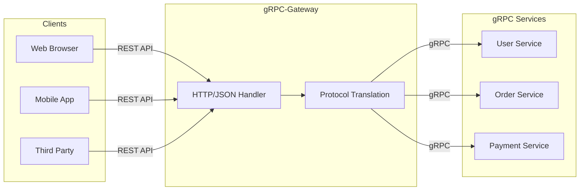
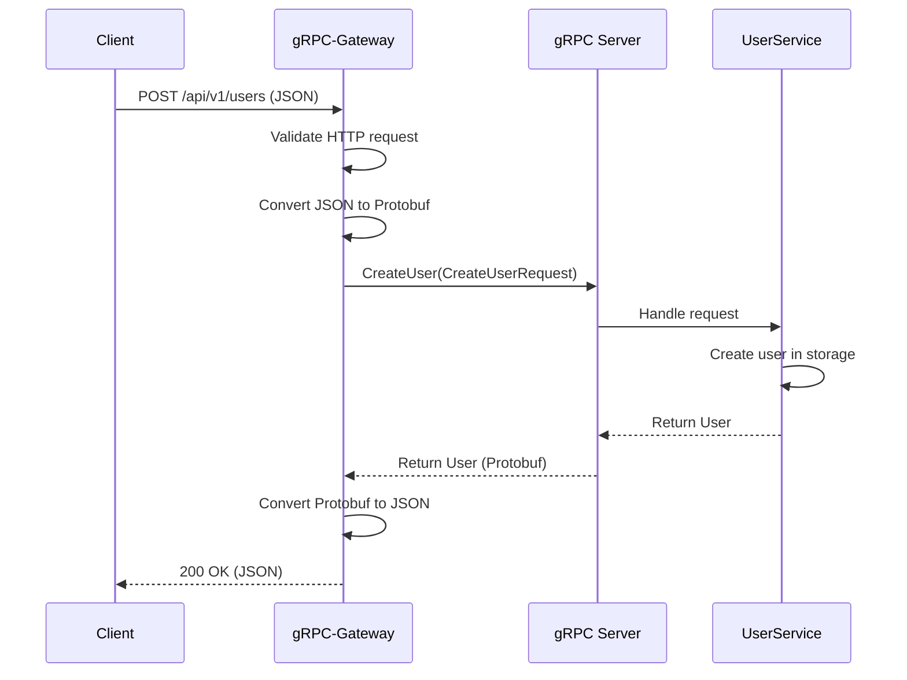

# How to Configure gRPC Gateway for REST APIs

Author: [nawazdhandala](https://www.github.com/nawazdhandala)

Tags: gRPC, REST, API Gateway, Go, Microservices, Protocol Buffers

Description: Learn how to set up gRPC-Gateway to automatically generate REST APIs from your gRPC service definitions, enabling clients to communicate via HTTP/JSON.

---

gRPC offers excellent performance for internal service communication, but many clients still need REST APIs. gRPC-Gateway bridges this gap by generating a reverse proxy that translates RESTful HTTP/JSON into gRPC calls.

## Architecture Overview



## Prerequisites

Install the required tools:

```bash
# Install protoc compiler
# macOS
brew install protobuf

# Linux
apt-get install -y protobuf-compiler

# Install Go plugins
go install google.golang.org/protobuf/cmd/protoc-gen-go@latest
go install google.golang.org/grpc/cmd/protoc-gen-go-grpc@latest
go install github.com/grpc-ecosystem/grpc-gateway/v2/protoc-gen-grpc-gateway@latest
go install github.com/grpc-ecosystem/grpc-gateway/v2/protoc-gen-openapiv2@latest
```

## Define the Protocol Buffer Service

Create a proto file with HTTP annotations:

```protobuf
// api/v1/user.proto
syntax = "proto3";

package api.v1;

option go_package = "github.com/example/myapp/gen/api/v1;apiv1";

import "google/api/annotations.proto";
import "google/protobuf/empty.proto";

// UserService handles user operations
service UserService {
  // CreateUser creates a new user
  rpc CreateUser(CreateUserRequest) returns (User) {
    option (google.api.http) = {
      post: "/api/v1/users"
      body: "*"
    };
  }

  // GetUser retrieves a user by ID
  rpc GetUser(GetUserRequest) returns (User) {
    option (google.api.http) = {
      get: "/api/v1/users/{user_id}"
    };
  }

  // ListUsers returns all users with pagination
  rpc ListUsers(ListUsersRequest) returns (ListUsersResponse) {
    option (google.api.http) = {
      get: "/api/v1/users"
    };
  }

  // UpdateUser updates an existing user
  rpc UpdateUser(UpdateUserRequest) returns (User) {
    option (google.api.http) = {
      put: "/api/v1/users/{user.user_id}"
      body: "user"
      additional_bindings {
        patch: "/api/v1/users/{user.user_id}"
        body: "user"
      }
    };
  }

  // DeleteUser removes a user
  rpc DeleteUser(DeleteUserRequest) returns (google.protobuf.Empty) {
    option (google.api.http) = {
      delete: "/api/v1/users/{user_id}"
    };
  }
}

message User {
  string user_id = 1;
  string email = 2;
  string name = 3;
  int64 created_at = 4;
}

message CreateUserRequest {
  string email = 1;
  string name = 2;
  string password = 3;
}

message GetUserRequest {
  string user_id = 1;
}

message ListUsersRequest {
  int32 page_size = 1;
  string page_token = 2;
}

message ListUsersResponse {
  repeated User users = 1;
  string next_page_token = 2;
}

message UpdateUserRequest {
  User user = 1;
}

message DeleteUserRequest {
  string user_id = 1;
}
```

## Set Up Google API Annotations

Download the required Google API proto files:

```bash
# Create directory for Google API protos
mkdir -p third_party/google/api

# Download required files
curl -o third_party/google/api/annotations.proto \
  https://raw.githubusercontent.com/googleapis/googleapis/master/google/api/annotations.proto

curl -o third_party/google/api/http.proto \
  https://raw.githubusercontent.com/googleapis/googleapis/master/google/api/http.proto
```

## Generate Code

Create a generation script:

```bash
#!/bin/bash
# scripts/generate.sh

# Set variables
PROTO_DIR="api/v1"
OUT_DIR="gen"
THIRD_PARTY="third_party"

# Create output directory
mkdir -p ${OUT_DIR}

# Generate Go code, gRPC code, and gateway code
protoc \
  -I ${PROTO_DIR} \
  -I ${THIRD_PARTY} \
  --go_out=${OUT_DIR} \
  --go_opt=paths=source_relative \
  --go-grpc_out=${OUT_DIR} \
  --go-grpc_opt=paths=source_relative \
  --grpc-gateway_out=${OUT_DIR} \
  --grpc-gateway_opt=paths=source_relative \
  --grpc-gateway_opt=generate_unbound_methods=true \
  --openapiv2_out=${OUT_DIR} \
  ${PROTO_DIR}/*.proto

echo "Code generation complete"
```

Run the script:

```bash
chmod +x scripts/generate.sh
./scripts/generate.sh
```

## Implement the gRPC Service

```go
// internal/service/user_service.go
package service

import (
    "context"
    "sync"
    "time"

    "google.golang.org/grpc/codes"
    "google.golang.org/grpc/status"
    "google.golang.org/protobuf/types/known/emptypb"

    pb "github.com/example/myapp/gen/api/v1"
)

// UserService implements the gRPC UserService
type UserService struct {
    pb.UnimplementedUserServiceServer

    // In-memory storage for demo purposes
    mu    sync.RWMutex
    users map[string]*pb.User
}

// NewUserService creates a new UserService instance
func NewUserService() *UserService {
    return &UserService{
        users: make(map[string]*pb.User),
    }
}

// CreateUser creates a new user
func (s *UserService) CreateUser(ctx context.Context, req *pb.CreateUserRequest) (*pb.User, error) {
    // Validate request
    if req.Email == "" {
        return nil, status.Error(codes.InvalidArgument, "email is required")
    }
    if req.Name == "" {
        return nil, status.Error(codes.InvalidArgument, "name is required")
    }

    s.mu.Lock()
    defer s.mu.Unlock()

    // Generate user ID
    userID := generateID()

    user := &pb.User{
        UserId:    userID,
        Email:     req.Email,
        Name:      req.Name,
        CreatedAt: time.Now().Unix(),
    }

    s.users[userID] = user
    return user, nil
}

// GetUser retrieves a user by ID
func (s *UserService) GetUser(ctx context.Context, req *pb.GetUserRequest) (*pb.User, error) {
    s.mu.RLock()
    defer s.mu.RUnlock()

    user, exists := s.users[req.UserId]
    if !exists {
        return nil, status.Error(codes.NotFound, "user not found")
    }

    return user, nil
}

// ListUsers returns all users with pagination
func (s *UserService) ListUsers(ctx context.Context, req *pb.ListUsersRequest) (*pb.ListUsersResponse, error) {
    s.mu.RLock()
    defer s.mu.RUnlock()

    pageSize := int(req.PageSize)
    if pageSize <= 0 {
        pageSize = 10
    }

    var users []*pb.User
    for _, user := range s.users {
        users = append(users, user)
        if len(users) >= pageSize {
            break
        }
    }

    return &pb.ListUsersResponse{
        Users:         users,
        NextPageToken: "",
    }, nil
}

// UpdateUser updates an existing user
func (s *UserService) UpdateUser(ctx context.Context, req *pb.UpdateUserRequest) (*pb.User, error) {
    if req.User == nil {
        return nil, status.Error(codes.InvalidArgument, "user is required")
    }

    s.mu.Lock()
    defer s.mu.Unlock()

    existing, exists := s.users[req.User.UserId]
    if !exists {
        return nil, status.Error(codes.NotFound, "user not found")
    }

    // Update fields
    if req.User.Email != "" {
        existing.Email = req.User.Email
    }
    if req.User.Name != "" {
        existing.Name = req.User.Name
    }

    return existing, nil
}

// DeleteUser removes a user
func (s *UserService) DeleteUser(ctx context.Context, req *pb.DeleteUserRequest) (*emptypb.Empty, error) {
    s.mu.Lock()
    defer s.mu.Unlock()

    if _, exists := s.users[req.UserId]; !exists {
        return nil, status.Error(codes.NotFound, "user not found")
    }

    delete(s.users, req.UserId)
    return &emptypb.Empty{}, nil
}

func generateID() string {
    return fmt.Sprintf("user_%d", time.Now().UnixNano())
}
```

## Create the Gateway Server

```go
// cmd/server/main.go
package main

import (
    "context"
    "flag"
    "fmt"
    "log"
    "net"
    "net/http"
    "os"
    "os/signal"
    "syscall"

    "github.com/grpc-ecosystem/grpc-gateway/v2/runtime"
    "google.golang.org/grpc"
    "google.golang.org/grpc/credentials/insecure"
    "google.golang.org/grpc/reflection"

    pb "github.com/example/myapp/gen/api/v1"
    "github.com/example/myapp/internal/service"
)

var (
    grpcPort = flag.Int("grpc-port", 50051, "gRPC server port")
    httpPort = flag.Int("http-port", 8080, "HTTP gateway port")
)

func main() {
    flag.Parse()

    // Create context that cancels on interrupt
    ctx, cancel := context.WithCancel(context.Background())
    defer cancel()

    // Handle shutdown signals
    go func() {
        sigCh := make(chan os.Signal, 1)
        signal.Notify(sigCh, syscall.SIGINT, syscall.SIGTERM)
        <-sigCh
        log.Println("Shutting down...")
        cancel()
    }()

    // Start gRPC server
    go runGRPCServer(ctx)

    // Start HTTP gateway
    runHTTPGateway(ctx)
}

func runGRPCServer(ctx context.Context) {
    listener, err := net.Listen("tcp", fmt.Sprintf(":%d", *grpcPort))
    if err != nil {
        log.Fatalf("Failed to listen: %v", err)
    }

    // Create gRPC server with interceptors
    server := grpc.NewServer(
        grpc.UnaryInterceptor(loggingInterceptor),
    )

    // Register services
    userService := service.NewUserService()
    pb.RegisterUserServiceServer(server, userService)

    // Enable reflection for debugging
    reflection.Register(server)

    log.Printf("gRPC server listening on :%d", *grpcPort)

    go func() {
        <-ctx.Done()
        server.GracefulStop()
    }()

    if err := server.Serve(listener); err != nil {
        log.Fatalf("Failed to serve gRPC: %v", err)
    }
}

func runHTTPGateway(ctx context.Context) {
    // Create gateway mux with custom options
    mux := runtime.NewServeMux(
        runtime.WithMarshalerOption(runtime.MIMEWildcard, &runtime.JSONPb{
            MarshalOptions: protojson.MarshalOptions{
                UseProtoNames:   true,
                EmitUnpopulated: true,
            },
            UnmarshalOptions: protojson.UnmarshalOptions{
                DiscardUnknown: true,
            },
        }),
        runtime.WithErrorHandler(customErrorHandler),
        runtime.WithMetadata(extractMetadata),
    )

    // Connect to gRPC server
    opts := []grpc.DialOption{
        grpc.WithTransportCredentials(insecure.NewCredentials()),
    }

    endpoint := fmt.Sprintf("localhost:%d", *grpcPort)
    err := pb.RegisterUserServiceHandlerFromEndpoint(ctx, mux, endpoint, opts)
    if err != nil {
        log.Fatalf("Failed to register gateway: %v", err)
    }

    // Create HTTP server with middleware
    handler := corsMiddleware(loggingMiddleware(mux))

    server := &http.Server{
        Addr:    fmt.Sprintf(":%d", *httpPort),
        Handler: handler,
    }

    log.Printf("HTTP gateway listening on :%d", *httpPort)

    go func() {
        <-ctx.Done()
        server.Shutdown(context.Background())
    }()

    if err := server.ListenAndServe(); err != http.ErrServerClosed {
        log.Fatalf("Failed to serve HTTP: %v", err)
    }
}

// loggingInterceptor logs gRPC requests
func loggingInterceptor(
    ctx context.Context,
    req interface{},
    info *grpc.UnaryServerInfo,
    handler grpc.UnaryHandler,
) (interface{}, error) {
    log.Printf("gRPC: %s", info.FullMethod)
    return handler(ctx, req)
}

// loggingMiddleware logs HTTP requests
func loggingMiddleware(next http.Handler) http.Handler {
    return http.HandlerFunc(func(w http.ResponseWriter, r *http.Request) {
        log.Printf("HTTP: %s %s", r.Method, r.URL.Path)
        next.ServeHTTP(w, r)
    })
}

// corsMiddleware adds CORS headers
func corsMiddleware(next http.Handler) http.Handler {
    return http.HandlerFunc(func(w http.ResponseWriter, r *http.Request) {
        w.Header().Set("Access-Control-Allow-Origin", "*")
        w.Header().Set("Access-Control-Allow-Methods", "GET, POST, PUT, PATCH, DELETE, OPTIONS")
        w.Header().Set("Access-Control-Allow-Headers", "Content-Type, Authorization")

        if r.Method == "OPTIONS" {
            w.WriteHeader(http.StatusOK)
            return
        }

        next.ServeHTTP(w, r)
    })
}

// customErrorHandler transforms gRPC errors to HTTP responses
func customErrorHandler(
    ctx context.Context,
    mux *runtime.ServeMux,
    marshaler runtime.Marshaler,
    w http.ResponseWriter,
    r *http.Request,
    err error,
) {
    // Use default error handler but you can customize here
    runtime.DefaultHTTPErrorHandler(ctx, mux, marshaler, w, r, err)
}

// extractMetadata extracts headers as gRPC metadata
func extractMetadata(ctx context.Context, r *http.Request) metadata.MD {
    md := make(map[string]string)

    // Forward authorization header
    if auth := r.Header.Get("Authorization"); auth != "" {
        md["authorization"] = auth
    }

    // Forward request ID
    if reqID := r.Header.Get("X-Request-ID"); reqID != "" {
        md["x-request-id"] = reqID
    }

    return metadata.New(md)
}
```

## Request Flow Diagram



## Advanced Configuration

### Custom Error Responses

```go
// internal/gateway/errors.go
package gateway

import (
    "context"
    "encoding/json"
    "net/http"

    "github.com/grpc-ecosystem/grpc-gateway/v2/runtime"
    "google.golang.org/grpc/codes"
    "google.golang.org/grpc/status"
)

// ErrorResponse is the custom error format
type ErrorResponse struct {
    Code    int    `json:"code"`
    Message string `json:"message"`
    Details string `json:"details,omitempty"`
}

// CustomErrorHandler provides consistent error responses
func CustomErrorHandler(
    ctx context.Context,
    mux *runtime.ServeMux,
    marshaler runtime.Marshaler,
    w http.ResponseWriter,
    r *http.Request,
    err error,
) {
    st, ok := status.FromError(err)
    if !ok {
        st = status.New(codes.Internal, err.Error())
    }

    httpCode := runtime.HTTPStatusFromCode(st.Code())

    response := ErrorResponse{
        Code:    httpCode,
        Message: st.Message(),
    }

    // Add details if available
    for _, detail := range st.Details() {
        if d, ok := detail.(fmt.Stringer); ok {
            response.Details = d.String()
        }
    }

    w.Header().Set("Content-Type", "application/json")
    w.WriteHeader(httpCode)
    json.NewEncoder(w).Encode(response)
}
```

### Request Validation

```go
// internal/gateway/validation.go
package gateway

import (
    "context"
    "net/http"

    "github.com/grpc-ecosystem/grpc-gateway/v2/runtime"
)

// ValidationMiddleware validates incoming requests
func ValidationMiddleware(next http.Handler) http.Handler {
    return http.HandlerFunc(func(w http.ResponseWriter, r *http.Request) {
        // Check content type for POST/PUT/PATCH
        if r.Method == http.MethodPost || r.Method == http.MethodPut || r.Method == http.MethodPatch {
            contentType := r.Header.Get("Content-Type")
            if contentType != "application/json" && contentType != "" {
                http.Error(w, "Content-Type must be application/json", http.StatusUnsupportedMediaType)
                return
            }
        }

        // Check request size
        if r.ContentLength > 10*1024*1024 { // 10MB limit
            http.Error(w, "Request body too large", http.StatusRequestEntityTooLarge)
            return
        }

        next.ServeHTTP(w, r)
    })
}
```

### Rate Limiting

```go
// internal/gateway/ratelimit.go
package gateway

import (
    "net/http"
    "sync"
    "time"

    "golang.org/x/time/rate"
)

// RateLimiter implements per-IP rate limiting
type RateLimiter struct {
    mu       sync.Mutex
    limiters map[string]*rate.Limiter
    rate     rate.Limit
    burst    int
}

// NewRateLimiter creates a new rate limiter
func NewRateLimiter(rps float64, burst int) *RateLimiter {
    return &RateLimiter{
        limiters: make(map[string]*rate.Limiter),
        rate:     rate.Limit(rps),
        burst:    burst,
    }
}

// GetLimiter returns the rate limiter for an IP
func (rl *RateLimiter) GetLimiter(ip string) *rate.Limiter {
    rl.mu.Lock()
    defer rl.mu.Unlock()

    limiter, exists := rl.limiters[ip]
    if !exists {
        limiter = rate.NewLimiter(rl.rate, rl.burst)
        rl.limiters[ip] = limiter
    }

    return limiter
}

// Middleware creates the rate limiting middleware
func (rl *RateLimiter) Middleware(next http.Handler) http.Handler {
    return http.HandlerFunc(func(w http.ResponseWriter, r *http.Request) {
        ip := r.RemoteAddr

        limiter := rl.GetLimiter(ip)
        if !limiter.Allow() {
            http.Error(w, "Rate limit exceeded", http.StatusTooManyRequests)
            return
        }

        next.ServeHTTP(w, r)
    })
}
```

## Testing the Gateway

```bash
# Create a user
curl -X POST http://localhost:8080/api/v1/users \
  -H "Content-Type: application/json" \
  -d '{"email": "john@example.com", "name": "John Doe", "password": "secret123"}'

# Response:
# {"user_id":"user_1234567890","email":"john@example.com","name":"John Doe","created_at":1706140800}

# Get a user
curl http://localhost:8080/api/v1/users/user_1234567890

# List users
curl "http://localhost:8080/api/v1/users?page_size=10"

# Update a user
curl -X PUT http://localhost:8080/api/v1/users/user_1234567890 \
  -H "Content-Type: application/json" \
  -d '{"user": {"user_id": "user_1234567890", "name": "John Updated"}}'

# Delete a user
curl -X DELETE http://localhost:8080/api/v1/users/user_1234567890
```

## Production Deployment

### Docker Compose Setup

```yaml
# docker-compose.yml
version: '3.8'

services:
  grpc-server:
    build:
      context: .
      dockerfile: Dockerfile
    command: ["/app/server", "-grpc-port=50051", "-http-port=8080"]
    ports:
      - "50051:50051"
      - "8080:8080"
    environment:
      - LOG_LEVEL=info
    healthcheck:
      test: ["CMD", "/app/healthcheck"]
      interval: 10s
      timeout: 5s
      retries: 3

  nginx:
    image: nginx:alpine
    ports:
      - "80:80"
      - "443:443"
    volumes:
      - ./nginx.conf:/etc/nginx/nginx.conf:ro
      - ./certs:/etc/nginx/certs:ro
    depends_on:
      - grpc-server
```

### Nginx Configuration

```nginx
# nginx.conf
upstream gateway {
    server grpc-server:8080;
    keepalive 32;
}

server {
    listen 80;
    server_name api.example.com;
    return 301 https://$server_name$request_uri;
}

server {
    listen 443 ssl http2;
    server_name api.example.com;

    ssl_certificate /etc/nginx/certs/server.crt;
    ssl_certificate_key /etc/nginx/certs/server.key;

    location / {
        proxy_pass http://gateway;
        proxy_http_version 1.1;
        proxy_set_header Host $host;
        proxy_set_header X-Real-IP $remote_addr;
        proxy_set_header X-Forwarded-For $proxy_add_x_forwarded_for;
        proxy_set_header X-Forwarded-Proto $scheme;

        # Timeouts
        proxy_connect_timeout 60s;
        proxy_send_timeout 60s;
        proxy_read_timeout 60s;
    }
}
```

---

gRPC-Gateway lets you maintain a single service definition while supporting both gRPC and REST clients. Define your API once in Protocol Buffers, and let the gateway handle the translation layer automatically.
