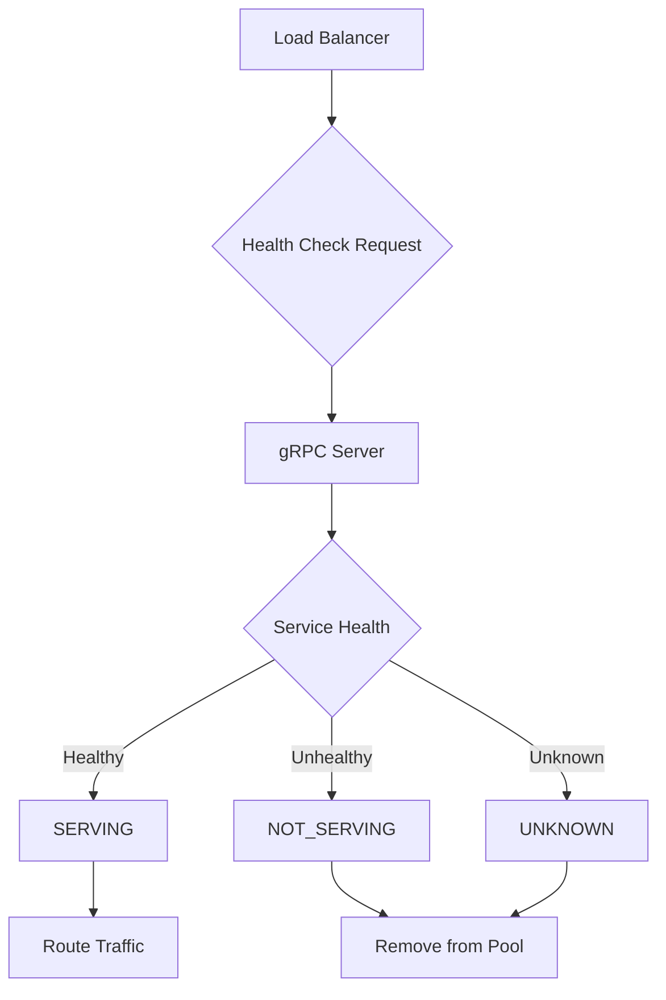
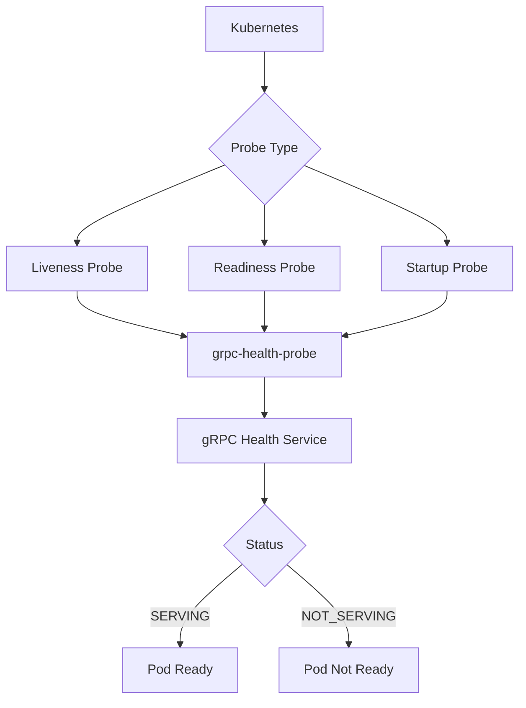
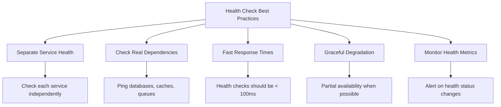

# How to Configure gRPC Health Checking

Author: [nawazdhandala](https://www.github.com/nawazdhandala)

Tags: gRPC, Health Checking, Microservices, Load Balancing, Kubernetes

Description: Learn how to implement and configure gRPC health checking for reliable service discovery and load balancing in distributed systems.

---

Health checking is essential for maintaining reliable gRPC services in production environments. The gRPC health checking protocol provides a standardized way for clients, load balancers, and orchestration systems to verify service availability. This guide covers implementing health checks across multiple languages and integrating them with common infrastructure.

## Understanding gRPC Health Checking

The gRPC health checking protocol defines a standard service that servers can implement to report their health status.



## 1. The Health Checking Protocol

The health checking protocol uses a simple proto definition.

```protobuf
// health.proto
// Standard gRPC health checking protocol definition

syntax = "proto3";

package grpc.health.v1;

// Health check request message
message HealthCheckRequest {
    // Service name to check
    // Empty string checks overall server health
    string service = 1;
}

// Health check response message
message HealthCheckResponse {
    // Possible serving statuses
    enum ServingStatus {
        UNKNOWN = 0;        // Status cannot be determined
        SERVING = 1;        // Service is healthy and accepting requests
        NOT_SERVING = 2;    // Service is unhealthy
        SERVICE_UNKNOWN = 3; // Requested service not found
    }
    ServingStatus status = 1;
}

// Health checking service definition
service Health {
    // Unary health check
    rpc Check(HealthCheckRequest) returns (HealthCheckResponse);

    // Streaming health check for watching status changes
    rpc Watch(HealthCheckRequest) returns (stream HealthCheckResponse);
}
```

## 2. Server-Side Implementation in Go

Implement health checking in a Go gRPC server.

```go
// server/main.go
package main

import (
    "context"
    "log"
    "net"
    "sync"
    "time"

    "google.golang.org/grpc"
    "google.golang.org/grpc/health"
    "google.golang.org/grpc/health/grpc_health_v1"
)

// ServiceHealthManager manages health status for multiple services
type ServiceHealthManager struct {
    healthServer *health.Server
    mu           sync.RWMutex
    dependencies map[string]func() bool
}

// NewServiceHealthManager creates a new health manager
func NewServiceHealthManager() *ServiceHealthManager {
    return &ServiceHealthManager{
        healthServer: health.NewServer(),
        dependencies: make(map[string]func() bool),
    }
}

// RegisterDependency registers a health check function for a service
func (m *ServiceHealthManager) RegisterDependency(service string, check func() bool) {
    m.mu.Lock()
    defer m.mu.Unlock()
    m.dependencies[service] = check
}

// StartHealthChecks begins periodic health checking
func (m *ServiceHealthManager) StartHealthChecks(ctx context.Context, interval time.Duration) {
    ticker := time.NewTicker(interval)
    defer ticker.Stop()

    for {
        select {
        case <-ctx.Done():
            return
        case <-ticker.C:
            m.updateHealthStatus()
        }
    }
}

// updateHealthStatus checks all dependencies and updates status
func (m *ServiceHealthManager) updateHealthStatus() {
    m.mu.RLock()
    defer m.mu.RUnlock()

    allHealthy := true
    for service, check := range m.dependencies {
        if check() {
            m.healthServer.SetServingStatus(service, grpc_health_v1.HealthCheckResponse_SERVING)
        } else {
            m.healthServer.SetServingStatus(service, grpc_health_v1.HealthCheckResponse_NOT_SERVING)
            allHealthy = false
        }
    }

    // Set overall server health
    if allHealthy {
        m.healthServer.SetServingStatus("", grpc_health_v1.HealthCheckResponse_SERVING)
    } else {
        m.healthServer.SetServingStatus("", grpc_health_v1.HealthCheckResponse_NOT_SERVING)
    }
}

// GetHealthServer returns the underlying health server
func (m *ServiceHealthManager) GetHealthServer() *health.Server {
    return m.healthServer
}

func main() {
    // Create gRPC server
    server := grpc.NewServer()

    // Create health manager
    healthManager := NewServiceHealthManager()

    // Register health check dependencies
    healthManager.RegisterDependency("myapp.UserService", checkDatabaseConnection)
    healthManager.RegisterDependency("myapp.CacheService", checkRedisConnection)
    healthManager.RegisterDependency("myapp.MessageService", checkKafkaConnection)

    // Register health service
    grpc_health_v1.RegisterHealthServer(server, healthManager.GetHealthServer())

    // Start background health checking
    ctx, cancel := context.WithCancel(context.Background())
    defer cancel()
    go healthManager.StartHealthChecks(ctx, 5*time.Second)

    // Set initial status
    healthManager.GetHealthServer().SetServingStatus("", grpc_health_v1.HealthCheckResponse_SERVING)

    // Start server
    listener, err := net.Listen("tcp", ":50051")
    if err != nil {
        log.Fatalf("Failed to listen: %v", err)
    }

    log.Println("Server starting on :50051")
    if err := server.Serve(listener); err != nil {
        log.Fatalf("Failed to serve: %v", err)
    }
}

// Example dependency check functions
func checkDatabaseConnection() bool {
    // Implement actual database ping
    return true
}

func checkRedisConnection() bool {
    // Implement actual Redis ping
    return true
}

func checkKafkaConnection() bool {
    // Implement actual Kafka connectivity check
    return true
}
```

## 3. Server-Side Implementation in Python

Implement health checking in a Python gRPC server.

```python
# server.py
import grpc
from concurrent import futures
import threading
import time
from grpc_health.v1 import health
from grpc_health.v1 import health_pb2
from grpc_health.v1 import health_pb2_grpc

class HealthServicer(health_pb2_grpc.HealthServicer):
    """Custom health servicer with dependency checking."""

    def __init__(self):
        self._status = {}
        self._lock = threading.RLock()
        self._watchers = {}

    def set_status(self, service: str, status: health_pb2.HealthCheckResponse.ServingStatus):
        """Set the health status for a service."""
        with self._lock:
            self._status[service] = status
            # Notify watchers
            if service in self._watchers:
                for callback in self._watchers[service]:
                    callback(status)

    def Check(self, request, context):
        """Handle unary health check request."""
        with self._lock:
            status = self._status.get(
                request.service,
                health_pb2.HealthCheckResponse.SERVICE_UNKNOWN
            )

        return health_pb2.HealthCheckResponse(status=status)

    def Watch(self, request, context):
        """Handle streaming health check request."""
        service = request.service

        # Send initial status
        with self._lock:
            status = self._status.get(
                service,
                health_pb2.HealthCheckResponse.SERVICE_UNKNOWN
            )
        yield health_pb2.HealthCheckResponse(status=status)

        # Create callback for status updates
        event = threading.Event()
        current_status = [status]

        def on_status_change(new_status):
            current_status[0] = new_status
            event.set()

        # Register watcher
        with self._lock:
            if service not in self._watchers:
                self._watchers[service] = []
            self._watchers[service].append(on_status_change)

        try:
            while context.is_active():
                # Wait for status change or timeout
                if event.wait(timeout=30):
                    event.clear()
                    yield health_pb2.HealthCheckResponse(status=current_status[0])
        finally:
            # Cleanup watcher
            with self._lock:
                if service in self._watchers:
                    self._watchers[service].remove(on_status_change)


class DependencyChecker:
    """Checks health of service dependencies."""

    def __init__(self, health_servicer: HealthServicer):
        self.health_servicer = health_servicer
        self.checks = {}
        self._running = False

    def register_check(self, service: str, check_func):
        """Register a health check function for a service."""
        self.checks[service] = check_func

    def start(self, interval: float = 5.0):
        """Start periodic health checking."""
        self._running = True
        self._thread = threading.Thread(target=self._check_loop, args=(interval,))
        self._thread.daemon = True
        self._thread.start()

    def stop(self):
        """Stop health checking."""
        self._running = False

    def _check_loop(self, interval: float):
        """Periodically check all dependencies."""
        while self._running:
            all_healthy = True

            for service, check_func in self.checks.items():
                try:
                    is_healthy = check_func()
                    status = (
                        health_pb2.HealthCheckResponse.SERVING
                        if is_healthy
                        else health_pb2.HealthCheckResponse.NOT_SERVING
                    )
                except Exception as e:
                    print(f"Health check failed for {service}: {e}")
                    status = health_pb2.HealthCheckResponse.NOT_SERVING
                    all_healthy = False

                self.health_servicer.set_status(service, status)
                if status != health_pb2.HealthCheckResponse.SERVING:
                    all_healthy = False

            # Set overall status
            overall_status = (
                health_pb2.HealthCheckResponse.SERVING
                if all_healthy
                else health_pb2.HealthCheckResponse.NOT_SERVING
            )
            self.health_servicer.set_status("", overall_status)

            time.sleep(interval)


# Example dependency check functions
def check_database():
    """Check database connectivity."""
    # Implement actual database ping
    return True

def check_redis():
    """Check Redis connectivity."""
    # Implement actual Redis ping
    return True


def serve():
    """Start the gRPC server with health checking."""
    server = grpc.server(futures.ThreadPoolExecutor(max_workers=10))

    # Create health servicer
    health_servicer = HealthServicer()
    health_pb2_grpc.add_HealthServicer_to_server(health_servicer, server)

    # Set up dependency checker
    checker = DependencyChecker(health_servicer)
    checker.register_check("myapp.UserService", check_database)
    checker.register_check("myapp.CacheService", check_redis)

    # Set initial status
    health_servicer.set_status("", health_pb2.HealthCheckResponse.SERVING)

    # Start health checking
    checker.start(interval=5.0)

    # Start server
    server.add_insecure_port("[::]:50051")
    server.start()
    print("Server started on port 50051")
    server.wait_for_termination()


if __name__ == "__main__":
    serve()
```

## 4. Client-Side Health Checking

Configure clients to use health checking for load balancing decisions.

```go
// client/main.go
package main

import (
    "context"
    "log"
    "time"

    "google.golang.org/grpc"
    "google.golang.org/grpc/credentials/insecure"
    "google.golang.org/grpc/health/grpc_health_v1"
)

func main() {
    // Create connection with health checking enabled
    conn, err := grpc.Dial(
        "localhost:50051",
        grpc.WithTransportCredentials(insecure.NewCredentials()),
        // Enable client-side health checking
        grpc.WithDefaultServiceConfig(`{
            "healthCheckConfig": {
                "serviceName": "myapp.UserService"
            },
            "loadBalancingConfig": [{"round_robin": {}}]
        }`),
    )
    if err != nil {
        log.Fatalf("Failed to connect: %v", err)
    }
    defer conn.Close()

    // Create health check client for manual checks
    healthClient := grpc_health_v1.NewHealthClient(conn)

    // Perform manual health check
    ctx, cancel := context.WithTimeout(context.Background(), 5*time.Second)
    defer cancel()

    resp, err := healthClient.Check(ctx, &grpc_health_v1.HealthCheckRequest{
        Service: "myapp.UserService",
    })
    if err != nil {
        log.Fatalf("Health check failed: %v", err)
    }

    log.Printf("Health status: %v", resp.Status)

    // Watch for health changes
    watchHealth(healthClient)
}

// watchHealth monitors service health changes
func watchHealth(client grpc_health_v1.HealthClient) {
    ctx := context.Background()

    stream, err := client.Watch(ctx, &grpc_health_v1.HealthCheckRequest{
        Service: "myapp.UserService",
    })
    if err != nil {
        log.Fatalf("Failed to watch health: %v", err)
    }

    for {
        resp, err := stream.Recv()
        if err != nil {
            log.Printf("Watch error: %v", err)
            return
        }
        log.Printf("Health status changed: %v", resp.Status)
    }
}
```

## 5. Kubernetes Integration

Configure Kubernetes to use gRPC health checks.



### Pod Configuration with gRPC Health Checks

```yaml
# deployment.yaml
apiVersion: apps/v1
kind: Deployment
metadata:
  name: grpc-service
spec:
  replicas: 3
  selector:
    matchLabels:
      app: grpc-service
  template:
    metadata:
      labels:
        app: grpc-service
    spec:
      containers:
      - name: grpc-service
        image: myregistry/grpc-service:latest
        ports:
        - containerPort: 50051
          name: grpc

        # Liveness probe - restart if unhealthy
        livenessProbe:
          grpc:
            port: 50051
            service: ""  # Empty string for overall health
          initialDelaySeconds: 10
          periodSeconds: 10
          timeoutSeconds: 5
          failureThreshold: 3

        # Readiness probe - remove from service if not ready
        readinessProbe:
          grpc:
            port: 50051
            service: "myapp.UserService"  # Check specific service
          initialDelaySeconds: 5
          periodSeconds: 5
          timeoutSeconds: 3
          failureThreshold: 2

        # Startup probe - wait for slow starting containers
        startupProbe:
          grpc:
            port: 50051
            service: ""
          initialDelaySeconds: 0
          periodSeconds: 5
          timeoutSeconds: 5
          failureThreshold: 30  # Allow 150 seconds to start

---
# Service definition
apiVersion: v1
kind: Service
metadata:
  name: grpc-service
spec:
  selector:
    app: grpc-service
  ports:
  - port: 50051
    targetPort: 50051
    name: grpc
  type: ClusterIP
```

### Using grpc-health-probe Binary (Pre-Kubernetes 1.24)

```yaml
# For Kubernetes versions before 1.24
# Requires grpc-health-probe binary in container

apiVersion: apps/v1
kind: Deployment
metadata:
  name: grpc-service
spec:
  template:
    spec:
      containers:
      - name: grpc-service
        image: myregistry/grpc-service:latest
        ports:
        - containerPort: 50051

        livenessProbe:
          exec:
            command:
            - /bin/grpc_health_probe
            - -addr=:50051
            - -service=
          initialDelaySeconds: 10
          periodSeconds: 10

        readinessProbe:
          exec:
            command:
            - /bin/grpc_health_probe
            - -addr=:50051
            - -service=myapp.UserService
            - -connect-timeout=250ms
            - -rpc-timeout=100ms
          initialDelaySeconds: 5
          periodSeconds: 5
```

### Dockerfile with grpc-health-probe

```dockerfile
# Dockerfile
FROM golang:1.21 AS builder

WORKDIR /app
COPY . .
RUN go build -o server .

# Download grpc-health-probe
RUN GRPC_HEALTH_PROBE_VERSION=v0.4.19 && \
    wget -qO/bin/grpc_health_probe \
    https://github.com/grpc-ecosystem/grpc-health-probe/releases/download/${GRPC_HEALTH_PROBE_VERSION}/grpc_health_probe-linux-amd64 && \
    chmod +x /bin/grpc_health_probe

FROM gcr.io/distroless/base-debian11

COPY --from=builder /app/server /server
COPY --from=builder /bin/grpc_health_probe /bin/grpc_health_probe

EXPOSE 50051
CMD ["/server"]
```

## 6. Load Balancer Integration

Configure common load balancers to use gRPC health checks.

### Envoy Proxy Configuration

```yaml
# envoy.yaml
static_resources:
  listeners:
  - name: grpc_listener
    address:
      socket_address:
        address: 0.0.0.0
        port_value: 8080
    filter_chains:
    - filters:
      - name: envoy.filters.network.http_connection_manager
        typed_config:
          "@type": type.googleapis.com/envoy.extensions.filters.network.http_connection_manager.v3.HttpConnectionManager
          stat_prefix: grpc
          codec_type: AUTO
          route_config:
            name: grpc_route
            virtual_hosts:
            - name: grpc_service
              domains: ["*"]
              routes:
              - match:
                  prefix: "/"
                route:
                  cluster: grpc_backend
          http_filters:
          - name: envoy.filters.http.router
            typed_config:
              "@type": type.googleapis.com/envoy.extensions.filters.http.router.v3.Router

  clusters:
  - name: grpc_backend
    connect_timeout: 5s
    type: STRICT_DNS
    lb_policy: ROUND_ROBIN
    http2_protocol_options: {}
    load_assignment:
      cluster_name: grpc_backend
      endpoints:
      - lb_endpoints:
        - endpoint:
            address:
              socket_address:
                address: grpc-service
                port_value: 50051

    # gRPC health checking configuration
    health_checks:
    - timeout: 5s
      interval: 10s
      unhealthy_threshold: 3
      healthy_threshold: 2
      grpc_health_check:
        service_name: "myapp.UserService"  # Service to check
```

### NGINX with gRPC Health Checks

```nginx
# nginx.conf
upstream grpc_backends {
    zone grpc_backends 64k;

    server backend1:50051;
    server backend2:50051;
    server backend3:50051;
}

server {
    listen 443 ssl http2;

    ssl_certificate /etc/nginx/ssl/cert.pem;
    ssl_certificate_key /etc/nginx/ssl/key.pem;

    location / {
        grpc_pass grpcs://grpc_backends;

        # Health check configuration (NGINX Plus only)
        health_check type=grpc grpc_status=12;  # 12 = UNIMPLEMENTED is OK
    }

    # Health check endpoint for external monitoring
    location /health {
        grpc_pass grpcs://grpc_backends;
        grpc_set_header Content-Type application/grpc;
    }
}
```

## 7. Advanced Health Check Patterns

### Graceful Shutdown with Health Status

```go
// graceful_shutdown.go
package main

import (
    "context"
    "log"
    "net"
    "os"
    "os/signal"
    "syscall"
    "time"

    "google.golang.org/grpc"
    "google.golang.org/grpc/health"
    "google.golang.org/grpc/health/grpc_health_v1"
)

func main() {
    server := grpc.NewServer()
    healthServer := health.NewServer()
    grpc_health_v1.RegisterHealthServer(server, healthServer)

    // Set initial health status
    healthServer.SetServingStatus("", grpc_health_v1.HealthCheckResponse_SERVING)

    listener, err := net.Listen("tcp", ":50051")
    if err != nil {
        log.Fatalf("Failed to listen: %v", err)
    }

    // Handle shutdown signals
    shutdown := make(chan os.Signal, 1)
    signal.Notify(shutdown, syscall.SIGINT, syscall.SIGTERM)

    go func() {
        <-shutdown
        log.Println("Shutdown signal received")

        // Step 1: Set health status to NOT_SERVING
        // This tells load balancers to stop sending new requests
        healthServer.SetServingStatus("", grpc_health_v1.HealthCheckResponse_NOT_SERVING)
        log.Println("Health status set to NOT_SERVING")

        // Step 2: Wait for load balancers to detect the change
        // and stop sending new requests
        drainTime := 10 * time.Second
        log.Printf("Waiting %v for connections to drain", drainTime)
        time.Sleep(drainTime)

        // Step 3: Gracefully stop the server
        // This waits for existing requests to complete
        log.Println("Stopping gRPC server gracefully")
        server.GracefulStop()
        log.Println("Server stopped")
    }()

    log.Println("Server starting on :50051")
    if err := server.Serve(listener); err != nil {
        log.Fatalf("Failed to serve: %v", err)
    }
}
```

### Circuit Breaker with Health Status

```go
// circuit_breaker.go
package main

import (
    "sync"
    "time"

    "google.golang.org/grpc/health"
    "google.golang.org/grpc/health/grpc_health_v1"
)

// CircuitBreaker tracks failures and updates health status
type CircuitBreaker struct {
    healthServer   *health.Server
    serviceName    string
    failureCount   int
    successCount   int
    threshold      int
    resetTimeout   time.Duration
    state          string
    mu             sync.Mutex
    lastFailure    time.Time
}

// NewCircuitBreaker creates a new circuit breaker
func NewCircuitBreaker(healthServer *health.Server, serviceName string, threshold int, resetTimeout time.Duration) *CircuitBreaker {
    cb := &CircuitBreaker{
        healthServer: healthServer,
        serviceName:  serviceName,
        threshold:    threshold,
        resetTimeout: resetTimeout,
        state:        "closed",
    }
    cb.updateHealthStatus()
    return cb
}

// RecordSuccess records a successful operation
func (cb *CircuitBreaker) RecordSuccess() {
    cb.mu.Lock()
    defer cb.mu.Unlock()

    cb.successCount++

    if cb.state == "half-open" {
        // Successful request in half-open state closes the circuit
        cb.state = "closed"
        cb.failureCount = 0
        cb.updateHealthStatus()
    }
}

// RecordFailure records a failed operation
func (cb *CircuitBreaker) RecordFailure() {
    cb.mu.Lock()
    defer cb.mu.Unlock()

    cb.failureCount++
    cb.lastFailure = time.Now()

    if cb.failureCount >= cb.threshold {
        cb.state = "open"
        cb.updateHealthStatus()

        // Schedule transition to half-open
        go func() {
            time.Sleep(cb.resetTimeout)
            cb.mu.Lock()
            if cb.state == "open" {
                cb.state = "half-open"
                cb.updateHealthStatus()
            }
            cb.mu.Unlock()
        }()
    }
}

// IsAllowed checks if requests are allowed
func (cb *CircuitBreaker) IsAllowed() bool {
    cb.mu.Lock()
    defer cb.mu.Unlock()

    return cb.state != "open"
}

// updateHealthStatus updates the health server based on circuit state
func (cb *CircuitBreaker) updateHealthStatus() {
    switch cb.state {
    case "closed":
        cb.healthServer.SetServingStatus(cb.serviceName, grpc_health_v1.HealthCheckResponse_SERVING)
    case "open":
        cb.healthServer.SetServingStatus(cb.serviceName, grpc_health_v1.HealthCheckResponse_NOT_SERVING)
    case "half-open":
        // In half-open state, we allow limited traffic
        cb.healthServer.SetServingStatus(cb.serviceName, grpc_health_v1.HealthCheckResponse_SERVING)
    }
}
```

## 8. Monitoring Health Check Metrics

Export health check metrics for observability.

```go
// metrics.go
package main

import (
    "github.com/prometheus/client_golang/prometheus"
    "github.com/prometheus/client_golang/prometheus/promauto"
)

var (
    // Health check request counter
    healthCheckRequests = promauto.NewCounterVec(
        prometheus.CounterOpts{
            Name: "grpc_health_check_requests_total",
            Help: "Total number of health check requests",
        },
        []string{"service", "status"},
    )

    // Health check latency histogram
    healthCheckLatency = promauto.NewHistogramVec(
        prometheus.HistogramOpts{
            Name:    "grpc_health_check_latency_seconds",
            Help:    "Health check request latency",
            Buckets: prometheus.DefBuckets,
        },
        []string{"service"},
    )

    // Current health status gauge
    healthStatus = promauto.NewGaugeVec(
        prometheus.GaugeOpts{
            Name: "grpc_health_status",
            Help: "Current health status (1=SERVING, 0=NOT_SERVING)",
        },
        []string{"service"},
    )
)

// RecordHealthCheck records metrics for a health check
func RecordHealthCheck(service string, status string, latencySeconds float64) {
    healthCheckRequests.WithLabelValues(service, status).Inc()
    healthCheckLatency.WithLabelValues(service).Observe(latencySeconds)

    if status == "SERVING" {
        healthStatus.WithLabelValues(service).Set(1)
    } else {
        healthStatus.WithLabelValues(service).Set(0)
    }
}
```

## 9. Testing Health Checks

Test health checking functionality.

```go
// health_test.go
package main

import (
    "context"
    "testing"
    "time"

    "google.golang.org/grpc"
    "google.golang.org/grpc/credentials/insecure"
    "google.golang.org/grpc/health/grpc_health_v1"
)

func TestHealthCheck(t *testing.T) {
    // Connect to server
    conn, err := grpc.Dial(
        "localhost:50051",
        grpc.WithTransportCredentials(insecure.NewCredentials()),
    )
    if err != nil {
        t.Fatalf("Failed to connect: %v", err)
    }
    defer conn.Close()

    client := grpc_health_v1.NewHealthClient(conn)

    tests := []struct {
        name           string
        service        string
        expectedStatus grpc_health_v1.HealthCheckResponse_ServingStatus
    }{
        {
            name:           "Overall health",
            service:        "",
            expectedStatus: grpc_health_v1.HealthCheckResponse_SERVING,
        },
        {
            name:           "UserService health",
            service:        "myapp.UserService",
            expectedStatus: grpc_health_v1.HealthCheckResponse_SERVING,
        },
    }

    for _, tt := range tests {
        t.Run(tt.name, func(t *testing.T) {
            ctx, cancel := context.WithTimeout(context.Background(), 5*time.Second)
            defer cancel()

            resp, err := client.Check(ctx, &grpc_health_v1.HealthCheckRequest{
                Service: tt.service,
            })
            if err != nil {
                t.Fatalf("Health check failed: %v", err)
            }

            if resp.Status != tt.expectedStatus {
                t.Errorf("Expected status %v, got %v", tt.expectedStatus, resp.Status)
            }
        })
    }
}

func TestHealthCheckWatch(t *testing.T) {
    conn, err := grpc.Dial(
        "localhost:50051",
        grpc.WithTransportCredentials(insecure.NewCredentials()),
    )
    if err != nil {
        t.Fatalf("Failed to connect: %v", err)
    }
    defer conn.Close()

    client := grpc_health_v1.NewHealthClient(conn)

    ctx, cancel := context.WithTimeout(context.Background(), 10*time.Second)
    defer cancel()

    stream, err := client.Watch(ctx, &grpc_health_v1.HealthCheckRequest{
        Service: "",
    })
    if err != nil {
        t.Fatalf("Failed to start watch: %v", err)
    }

    // Receive at least one status update
    resp, err := stream.Recv()
    if err != nil {
        t.Fatalf("Failed to receive status: %v", err)
    }

    if resp.Status != grpc_health_v1.HealthCheckResponse_SERVING {
        t.Errorf("Expected SERVING status, got %v", resp.Status)
    }
}
```

## 10. Best Practices

Follow these guidelines for reliable health checking.



### Configuration Recommendations

```yaml
# Health check configuration recommendations
health_checking:
  # Server-side settings
  server:
    check_interval: 5s          # How often to check dependencies
    dependency_timeout: 2s      # Timeout for each dependency check

  # Client-side settings
  client:
    health_check_interval: 10s  # How often to check server health
    health_check_timeout: 5s    # Timeout for health check RPC

  # Kubernetes probe settings
  kubernetes:
    liveness:
      initial_delay: 10s        # Wait for app to start
      period: 10s               # Check every 10 seconds
      timeout: 5s               # Fail if no response in 5s
      failure_threshold: 3      # Restart after 3 failures
    readiness:
      initial_delay: 5s         # Check readiness quickly
      period: 5s                # Check more frequently
      timeout: 3s               # Shorter timeout
      failure_threshold: 2      # Remove from service quickly
    startup:
      period: 5s                # Check during startup
      failure_threshold: 30     # Allow 150s total startup time
```

---

Proper gRPC health checking ensures your services remain reliable and responsive. By implementing the standard health checking protocol, integrating with load balancers and Kubernetes, and following best practices, you can build resilient distributed systems that gracefully handle failures and maintenance events.
