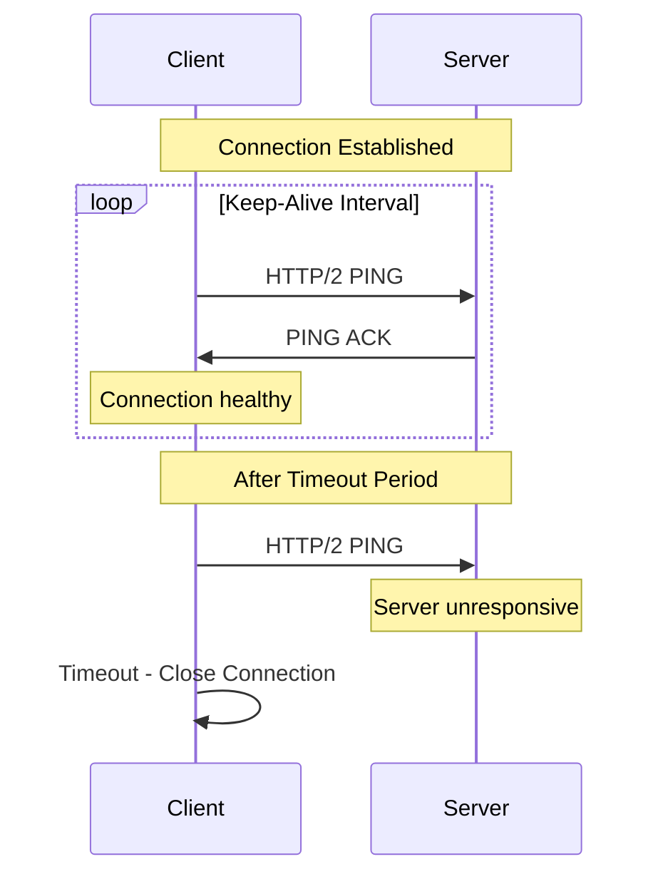
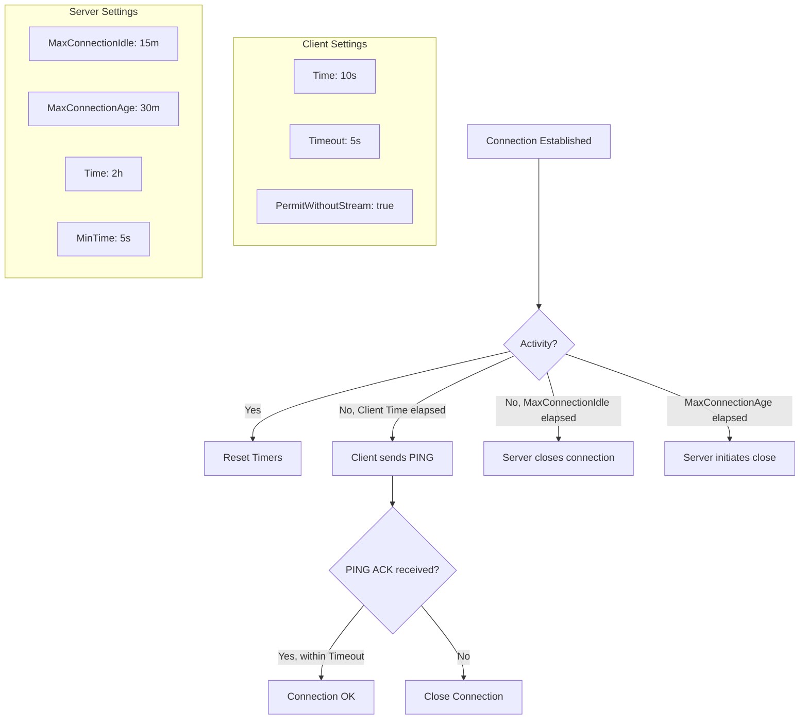
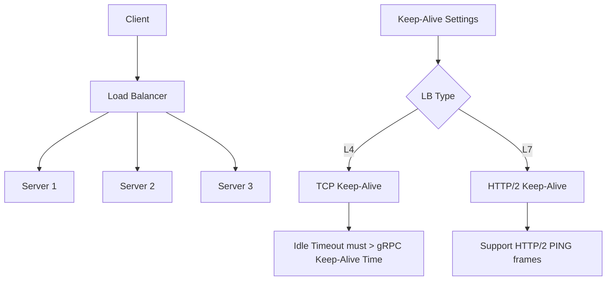
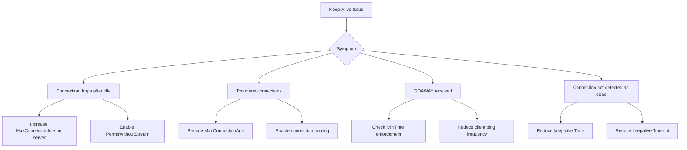
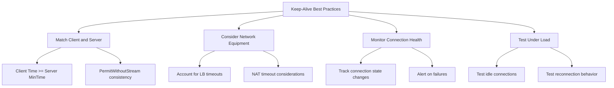

# How to Configure gRPC Keep-Alive Settings

Author: [nawazdhandala](https://www.github.com/nawazdhandala)

Tags: gRPC, Keep-Alive, Connection Management, Performance, Networking

Description: Learn how to configure gRPC keep-alive settings to maintain persistent connections, detect dead connections, and optimize network performance.

---

gRPC keep-alive settings control how connections are maintained between clients and servers. Properly configured keep-alive parameters help detect dead connections, maintain connections through network equipment, and optimize resource usage. This guide covers keep-alive configuration for both clients and servers with practical examples and best practices.

## Understanding gRPC Keep-Alive

Keep-alive in gRPC uses HTTP/2 PING frames to verify connection health.



## 1. Client-Side Keep-Alive Configuration

Configure keep-alive on the gRPC client to detect server unavailability.

```go
// client/main.go
package main

import (
    "context"
    "log"
    "time"

    "google.golang.org/grpc"
    "google.golang.org/grpc/credentials/insecure"
    "google.golang.org/grpc/keepalive"

    pb "myapp/proto"
)

func main() {
    // Configure keep-alive parameters
    kaParams := keepalive.ClientParameters{
        // Time after which client sends PING if no activity
        // Default: infinity (disabled)
        // Recommended: 10-30 seconds for most use cases
        Time: 10 * time.Second,

        // Timeout for PING ACK before considering connection dead
        // Default: 20 seconds
        // Should be less than Time parameter
        Timeout: 5 * time.Second,

        // Allow sending PINGs even without active streams
        // Default: false
        // Set true for long-lived connections
        PermitWithoutStream: true,
    }

    // Create connection with keep-alive
    conn, err := grpc.Dial(
        "localhost:50051",
        grpc.WithTransportCredentials(insecure.NewCredentials()),
        grpc.WithKeepaliveParams(kaParams),
    )
    if err != nil {
        log.Fatalf("Failed to connect: %v", err)
    }
    defer conn.Close()

    // Use the connection
    client := pb.NewUserServiceClient(conn)

    ctx, cancel := context.WithTimeout(context.Background(), 5*time.Second)
    defer cancel()

    resp, err := client.GetUser(ctx, &pb.GetUserRequest{UserId: "123"})
    if err != nil {
        log.Fatalf("Failed to get user: %v", err)
    }

    log.Printf("User: %v", resp)
}
```

### Environment-Based Configuration

```go
// config/keepalive.go
package config

import (
    "os"
    "strconv"
    "time"

    "google.golang.org/grpc/keepalive"
)

// KeepAliveConfig holds keep-alive configuration
type KeepAliveConfig struct {
    // Client parameters
    ClientTime              time.Duration
    ClientTimeout           time.Duration
    ClientPermitWithoutStream bool

    // Server parameters
    ServerMaxConnectionIdle     time.Duration
    ServerMaxConnectionAge      time.Duration
    ServerMaxConnectionAgeGrace time.Duration
    ServerTime                  time.Duration
    ServerTimeout               time.Duration
    ServerMinTime               time.Duration
    ServerPermitWithoutStream   bool
}

// DefaultKeepAliveConfig returns default keep-alive settings
func DefaultKeepAliveConfig() KeepAliveConfig {
    return KeepAliveConfig{
        // Client defaults
        ClientTime:               10 * time.Second,
        ClientTimeout:            5 * time.Second,
        ClientPermitWithoutStream: true,

        // Server defaults
        ServerMaxConnectionIdle:     15 * time.Minute,
        ServerMaxConnectionAge:      30 * time.Minute,
        ServerMaxConnectionAgeGrace: 5 * time.Second,
        ServerTime:                  2 * time.Hour,
        ServerTimeout:               20 * time.Second,
        ServerMinTime:               5 * time.Second,
        ServerPermitWithoutStream:   false,
    }
}

// LoadFromEnv loads keep-alive config from environment variables
func LoadFromEnv() KeepAliveConfig {
    config := DefaultKeepAliveConfig()

    if v := os.Getenv("GRPC_KEEPALIVE_TIME_SECONDS"); v != "" {
        if seconds, err := strconv.Atoi(v); err == nil {
            config.ClientTime = time.Duration(seconds) * time.Second
        }
    }

    if v := os.Getenv("GRPC_KEEPALIVE_TIMEOUT_SECONDS"); v != "" {
        if seconds, err := strconv.Atoi(v); err == nil {
            config.ClientTimeout = time.Duration(seconds) * time.Second
        }
    }

    if v := os.Getenv("GRPC_KEEPALIVE_PERMIT_WITHOUT_STREAM"); v == "true" {
        config.ClientPermitWithoutStream = true
    }

    return config
}

// ClientParams returns keepalive.ClientParameters
func (c KeepAliveConfig) ClientParams() keepalive.ClientParameters {
    return keepalive.ClientParameters{
        Time:                c.ClientTime,
        Timeout:             c.ClientTimeout,
        PermitWithoutStream: c.ClientPermitWithoutStream,
    }
}

// ServerParams returns keepalive.ServerParameters
func (c KeepAliveConfig) ServerParams() keepalive.ServerParameters {
    return keepalive.ServerParameters{
        MaxConnectionIdle:     c.ServerMaxConnectionIdle,
        MaxConnectionAge:      c.ServerMaxConnectionAge,
        MaxConnectionAgeGrace: c.ServerMaxConnectionAgeGrace,
        Time:                  c.ServerTime,
        Timeout:               c.ServerTimeout,
    }
}

// EnforcementPolicy returns keepalive.EnforcementPolicy
func (c KeepAliveConfig) EnforcementPolicy() keepalive.EnforcementPolicy {
    return keepalive.EnforcementPolicy{
        MinTime:             c.ServerMinTime,
        PermitWithoutStream: c.ServerPermitWithoutStream,
    }
}
```

## 2. Server-Side Keep-Alive Configuration

Configure keep-alive on the server to manage connections and detect dead clients.

```go
// server/main.go
package main

import (
    "log"
    "net"
    "time"

    "google.golang.org/grpc"
    "google.golang.org/grpc/keepalive"

    pb "myapp/proto"
)

func main() {
    // Server keep-alive parameters
    kaParams := keepalive.ServerParameters{
        // Maximum time a connection can be idle before server closes it
        // Default: infinity (disabled)
        // Recommended: 5-15 minutes for typical services
        MaxConnectionIdle: 15 * time.Minute,

        // Maximum time a connection may exist before server closes it
        // Default: infinity (disabled)
        // Useful for load balancing and refreshing connections
        MaxConnectionAge: 30 * time.Minute,

        // Grace period after MaxConnectionAge to complete ongoing RPCs
        // Default: infinity (disabled)
        MaxConnectionAgeGrace: 5 * time.Second,

        // Time after which server sends PING to client
        // Default: 2 hours
        // Server-initiated PINGs are less common
        Time: 2 * time.Hour,

        // Timeout for PING ACK from client
        // Default: 20 seconds
        Timeout: 20 * time.Second,
    }

    // Enforcement policy controls client behavior
    kaPolicy := keepalive.EnforcementPolicy{
        // Minimum time client must wait between PINGs
        // Default: 5 minutes
        // Prevent aggressive clients from overwhelming server
        MinTime: 5 * time.Second,

        // Allow client PINGs without active streams
        // Default: false
        // Set true if clients use PermitWithoutStream
        PermitWithoutStream: true,
    }

    // Create server with keep-alive settings
    server := grpc.NewServer(
        grpc.KeepaliveParams(kaParams),
        grpc.KeepaliveEnforcementPolicy(kaPolicy),
    )

    // Register services
    pb.RegisterUserServiceServer(server, &userServer{})

    // Start server
    listener, err := net.Listen("tcp", ":50051")
    if err != nil {
        log.Fatalf("Failed to listen: %v", err)
    }

    log.Println("Server starting on :50051")
    if err := server.Serve(listener); err != nil {
        log.Fatalf("Failed to serve: %v", err)
    }
}

type userServer struct {
    pb.UnimplementedUserServiceServer
}
```

## 3. Keep-Alive Flow and Timing

Understanding the interaction between client and server keep-alive settings.



### Timing Considerations

```go
// timing.go
package main

import (
    "time"

    "google.golang.org/grpc/keepalive"
)

// ValidateKeepAliveSettings checks for common configuration mistakes
func ValidateKeepAliveSettings(client keepalive.ClientParameters, server keepalive.ServerParameters, policy keepalive.EnforcementPolicy) []string {
    var warnings []string

    // Client timeout should be less than client time
    if client.Timeout >= client.Time {
        warnings = append(warnings, "Client timeout should be less than client time")
    }

    // Client time should be >= server MinTime
    if client.Time < policy.MinTime {
        warnings = append(warnings, "Client time is less than server MinTime - client may be disconnected")
    }

    // If client uses PermitWithoutStream, server should allow it
    if client.PermitWithoutStream && !policy.PermitWithoutStream {
        warnings = append(warnings, "Client sends PINGs without stream but server doesn't permit it")
    }

    // MaxConnectionIdle should be less than MaxConnectionAge
    if server.MaxConnectionIdle > 0 && server.MaxConnectionAge > 0 {
        if server.MaxConnectionIdle > server.MaxConnectionAge {
            warnings = append(warnings, "MaxConnectionIdle > MaxConnectionAge has no effect")
        }
    }

    // Server timeout should be reasonable
    if server.Timeout > 60*time.Second {
        warnings = append(warnings, "Server timeout is very long - dead connections may not be detected quickly")
    }

    return warnings
}

// RecommendedSettings returns recommended keep-alive settings for common scenarios
type Scenario string

const (
    ScenarioLowLatency     Scenario = "low_latency"     // Real-time, gaming
    ScenarioHighThroughput Scenario = "high_throughput" // Batch processing
    ScenarioLongLived      Scenario = "long_lived"      // Streaming, subscriptions
    ScenarioMobile         Scenario = "mobile"          // Mobile clients
)

func RecommendedSettings(scenario Scenario) (keepalive.ClientParameters, keepalive.ServerParameters, keepalive.EnforcementPolicy) {
    switch scenario {
    case ScenarioLowLatency:
        return keepalive.ClientParameters{
                Time:                5 * time.Second,
                Timeout:             2 * time.Second,
                PermitWithoutStream: true,
            },
            keepalive.ServerParameters{
                MaxConnectionIdle:     5 * time.Minute,
                MaxConnectionAge:      15 * time.Minute,
                MaxConnectionAgeGrace: 2 * time.Second,
                Time:                  5 * time.Second,
                Timeout:               2 * time.Second,
            },
            keepalive.EnforcementPolicy{
                MinTime:             3 * time.Second,
                PermitWithoutStream: true,
            }

    case ScenarioHighThroughput:
        return keepalive.ClientParameters{
                Time:                30 * time.Second,
                Timeout:             10 * time.Second,
                PermitWithoutStream: false,
            },
            keepalive.ServerParameters{
                MaxConnectionIdle:     30 * time.Minute,
                MaxConnectionAge:      1 * time.Hour,
                MaxConnectionAgeGrace: 10 * time.Second,
                Time:                  1 * time.Hour,
                Timeout:               20 * time.Second,
            },
            keepalive.EnforcementPolicy{
                MinTime:             10 * time.Second,
                PermitWithoutStream: false,
            }

    case ScenarioLongLived:
        return keepalive.ClientParameters{
                Time:                10 * time.Second,
                Timeout:             5 * time.Second,
                PermitWithoutStream: true,
            },
            keepalive.ServerParameters{
                MaxConnectionIdle:     0, // Disabled
                MaxConnectionAge:      0, // Disabled
                MaxConnectionAgeGrace: 0,
                Time:                  10 * time.Second,
                Timeout:               5 * time.Second,
            },
            keepalive.EnforcementPolicy{
                MinTime:             5 * time.Second,
                PermitWithoutStream: true,
            }

    case ScenarioMobile:
        return keepalive.ClientParameters{
                Time:                30 * time.Second,
                Timeout:             10 * time.Second,
                PermitWithoutStream: true,
            },
            keepalive.ServerParameters{
                MaxConnectionIdle:     10 * time.Minute,
                MaxConnectionAge:      30 * time.Minute,
                MaxConnectionAgeGrace: 5 * time.Second,
                Time:                  30 * time.Second,
                Timeout:               10 * time.Second,
            },
            keepalive.EnforcementPolicy{
                MinTime:             10 * time.Second,
                PermitWithoutStream: true,
            }

    default:
        // Default balanced settings
        return keepalive.ClientParameters{
                Time:                10 * time.Second,
                Timeout:             5 * time.Second,
                PermitWithoutStream: true,
            },
            keepalive.ServerParameters{
                MaxConnectionIdle:     15 * time.Minute,
                MaxConnectionAge:      30 * time.Minute,
                MaxConnectionAgeGrace: 5 * time.Second,
                Time:                  2 * time.Hour,
                Timeout:               20 * time.Second,
            },
            keepalive.EnforcementPolicy{
                MinTime:             5 * time.Second,
                PermitWithoutStream: true,
            }
    }
}
```

## 4. Python Keep-Alive Configuration

Configure keep-alive in Python gRPC.

```python
# client.py
import grpc
from grpc import ChannelCredentials

def create_channel(target: str) -> grpc.Channel:
    """Create a gRPC channel with keep-alive settings."""

    # Keep-alive options
    options = [
        # Time in milliseconds between keep-alive pings
        # Default: disabled (INT_MAX)
        ('grpc.keepalive_time_ms', 10000),  # 10 seconds

        # Timeout in milliseconds for keep-alive ping response
        # Default: 20000 (20 seconds)
        ('grpc.keepalive_timeout_ms', 5000),  # 5 seconds

        # Allow keep-alive pings without active streams
        # Default: 0 (false)
        ('grpc.keepalive_permit_without_calls', 1),  # true

        # Maximum time to wait for HTTP/2 ping response
        ('grpc.http2.min_time_between_pings_ms', 10000),

        # Minimum time between pings
        ('grpc.http2.min_ping_interval_without_data_ms', 5000),
    ]

    # Create channel
    channel = grpc.insecure_channel(target, options=options)
    return channel


def create_secure_channel(target: str, credentials: ChannelCredentials) -> grpc.Channel:
    """Create a secure gRPC channel with keep-alive settings."""

    options = [
        ('grpc.keepalive_time_ms', 10000),
        ('grpc.keepalive_timeout_ms', 5000),
        ('grpc.keepalive_permit_without_calls', 1),
    ]

    channel = grpc.secure_channel(target, credentials, options=options)
    return channel


# server.py
import grpc
from concurrent import futures

def create_server() -> grpc.Server:
    """Create a gRPC server with keep-alive settings."""

    # Server options
    options = [
        # Maximum idle time before closing connection
        # Default: disabled (INT_MAX)
        ('grpc.max_connection_idle_ms', 900000),  # 15 minutes

        # Maximum connection age
        # Default: disabled (INT_MAX)
        ('grpc.max_connection_age_ms', 1800000),  # 30 minutes

        # Grace period for ongoing RPCs after max age
        # Default: disabled (INT_MAX)
        ('grpc.max_connection_age_grace_ms', 5000),  # 5 seconds

        # Time between server keep-alive pings
        # Default: 7200000 (2 hours)
        ('grpc.keepalive_time_ms', 7200000),

        # Timeout for client ping response
        # Default: 20000 (20 seconds)
        ('grpc.keepalive_timeout_ms', 20000),

        # Minimum time client must wait between pings
        # Default: 300000 (5 minutes)
        ('grpc.http2.min_ping_interval_without_data_ms', 5000),

        # Allow pings without active calls
        # Default: 0 (false)
        ('grpc.keepalive_permit_without_calls', 1),
    ]

    server = grpc.server(
        futures.ThreadPoolExecutor(max_workers=10),
        options=options,
    )

    return server


# Usage
if __name__ == '__main__':
    # Client
    channel = create_channel('localhost:50051')
    # Use channel...

    # Server
    server = create_server()
    server.add_insecure_port('[::]:50051')
    server.start()
    server.wait_for_termination()
```

## 5. Kubernetes Configuration

Configure keep-alive for gRPC services in Kubernetes.

```yaml
# deployment.yaml
apiVersion: apps/v1
kind: Deployment
metadata:
  name: grpc-service
spec:
  replicas: 3
  selector:
    matchLabels:
      app: grpc-service
  template:
    metadata:
      labels:
        app: grpc-service
    spec:
      containers:
      - name: grpc-service
        image: myregistry/grpc-service:latest
        ports:
        - containerPort: 50051
        env:
        # Keep-alive configuration via environment variables
        - name: GRPC_KEEPALIVE_TIME_SECONDS
          value: "10"
        - name: GRPC_KEEPALIVE_TIMEOUT_SECONDS
          value: "5"
        - name: GRPC_MAX_CONNECTION_IDLE_SECONDS
          value: "900"
        - name: GRPC_MAX_CONNECTION_AGE_SECONDS
          value: "1800"

---
# service.yaml
apiVersion: v1
kind: Service
metadata:
  name: grpc-service
  annotations:
    # For cloud load balancers, configure backend timeout
    cloud.google.com/backend-config: '{"default": "grpc-backend-config"}'
spec:
  selector:
    app: grpc-service
  ports:
  - port: 50051
    targetPort: 50051
  type: ClusterIP

---
# backend-config.yaml (GKE specific)
apiVersion: cloud.google.com/v1
kind: BackendConfig
metadata:
  name: grpc-backend-config
spec:
  # Connection timeout
  timeoutSec: 3600
  connectionDraining:
    drainingTimeoutSec: 30
```

### Istio Configuration for Keep-Alive

```yaml
# destination-rule.yaml
apiVersion: networking.istio.io/v1beta1
kind: DestinationRule
metadata:
  name: grpc-service
spec:
  host: grpc-service
  trafficPolicy:
    connectionPool:
      tcp:
        # Maximum number of connections
        maxConnections: 100
        # TCP keep-alive (different from gRPC keep-alive)
        tcpKeepalive:
          time: 7200s
          interval: 75s
          probes: 10
      http:
        # HTTP/2 specific settings
        h2UpgradePolicy: UPGRADE
        # Maximum requests per connection before closing
        maxRequestsPerConnection: 1000

---
# envoy-filter.yaml (advanced keep-alive tuning)
apiVersion: networking.istio.io/v1alpha3
kind: EnvoyFilter
metadata:
  name: grpc-keepalive
spec:
  workloadSelector:
    labels:
      app: grpc-service
  configPatches:
  - applyTo: CLUSTER
    match:
      context: SIDECAR_OUTBOUND
    patch:
      operation: MERGE
      value:
        upstream_connection_options:
          tcp_keepalive:
            keepalive_time: 300
            keepalive_interval: 30
            keepalive_probes: 6
```

## 6. Load Balancer Considerations

Configure load balancers to work with gRPC keep-alive.



### NGINX Configuration

```nginx
# nginx.conf
upstream grpc_backends {
    server backend1:50051;
    server backend2:50051;
    server backend3:50051;

    # Keep connections alive to backends
    keepalive 100;          # Connection pool size
    keepalive_time 1h;      # Max time to keep connection
    keepalive_timeout 60s;  # Idle timeout
    keepalive_requests 1000; # Max requests per connection
}

server {
    listen 443 ssl http2;

    ssl_certificate /etc/nginx/ssl/cert.pem;
    ssl_certificate_key /etc/nginx/ssl/key.pem;

    location / {
        grpc_pass grpc://grpc_backends;

        # Important: Set timeouts higher than client keep-alive
        grpc_read_timeout 3600s;
        grpc_send_timeout 3600s;

        # HTTP/2 settings
        http2_max_concurrent_streams 128;
        http2_idle_timeout 3600s;
    }
}
```

### Envoy Proxy Configuration

```yaml
# envoy.yaml
static_resources:
  listeners:
  - name: grpc_listener
    address:
      socket_address:
        address: 0.0.0.0
        port_value: 8080
    filter_chains:
    - filters:
      - name: envoy.filters.network.http_connection_manager
        typed_config:
          "@type": type.googleapis.com/envoy.extensions.filters.network.http_connection_manager.v3.HttpConnectionManager
          stat_prefix: grpc
          codec_type: AUTO

          # HTTP/2 specific settings
          http2_protocol_options:
            # Maximum concurrent streams
            max_concurrent_streams: 100
            # Initial stream window size
            initial_stream_window_size: 65536
            # Initial connection window size
            initial_connection_window_size: 1048576

          # Stream idle timeout (for individual RPCs)
          stream_idle_timeout: 300s

          route_config:
            name: grpc_route
            virtual_hosts:
            - name: grpc_service
              domains: ["*"]
              routes:
              - match:
                  prefix: "/"
                route:
                  cluster: grpc_backend
                  # Request timeout
                  timeout: 60s
                  # Idle timeout for the route
                  idle_timeout: 300s

          http_filters:
          - name: envoy.filters.http.router
            typed_config:
              "@type": type.googleapis.com/envoy.extensions.filters.http.router.v3.Router

  clusters:
  - name: grpc_backend
    connect_timeout: 5s
    type: STRICT_DNS
    lb_policy: ROUND_ROBIN
    http2_protocol_options: {}

    # Connection pool settings
    circuit_breakers:
      thresholds:
      - max_connections: 100
        max_pending_requests: 100
        max_requests: 1000

    # TCP keep-alive to backends
    upstream_connection_options:
      tcp_keepalive:
        keepalive_time: 300
        keepalive_interval: 30
        keepalive_probes: 6

    load_assignment:
      cluster_name: grpc_backend
      endpoints:
      - lb_endpoints:
        - endpoint:
            address:
              socket_address:
                address: grpc-service
                port_value: 50051
```

## 7. Monitoring Keep-Alive

Track keep-alive related metrics.

```go
// monitoring.go
package main

import (
    "context"
    "log"

    "github.com/prometheus/client_golang/prometheus"
    "github.com/prometheus/client_golang/prometheus/promauto"
    "google.golang.org/grpc"
    "google.golang.org/grpc/connectivity"
)

var (
    connectionState = promauto.NewGaugeVec(
        prometheus.GaugeOpts{
            Name: "grpc_client_connection_state",
            Help: "Current state of gRPC client connections",
        },
        []string{"target", "state"},
    )

    connectionChanges = promauto.NewCounterVec(
        prometheus.CounterOpts{
            Name: "grpc_client_connection_state_changes_total",
            Help: "Total number of gRPC connection state changes",
        },
        []string{"target", "from_state", "to_state"},
    )

    pingsSent = promauto.NewCounterVec(
        prometheus.CounterOpts{
            Name: "grpc_keepalive_pings_sent_total",
            Help: "Total number of keep-alive pings sent",
        },
        []string{"target"},
    )

    pingLatency = promauto.NewHistogramVec(
        prometheus.HistogramOpts{
            Name:    "grpc_keepalive_ping_latency_seconds",
            Help:    "Latency of keep-alive ping responses",
            Buckets: []float64{.001, .005, .01, .025, .05, .1, .25, .5, 1},
        },
        []string{"target"},
    )
)

// MonitorConnection monitors a gRPC connection state
func MonitorConnection(ctx context.Context, conn *grpc.ClientConn, target string) {
    currentState := conn.GetState()
    updateStateMetric(target, currentState)

    for {
        // Wait for state change
        changed := conn.WaitForStateChange(ctx, currentState)
        if !changed {
            // Context canceled
            return
        }

        newState := conn.GetState()
        connectionChanges.WithLabelValues(target, currentState.String(), newState.String()).Inc()
        updateStateMetric(target, newState)

        log.Printf("Connection to %s: %s -> %s", target, currentState, newState)
        currentState = newState
    }
}

func updateStateMetric(target string, state connectivity.State) {
    // Reset all states for this target
    for _, s := range []connectivity.State{
        connectivity.Idle,
        connectivity.Connecting,
        connectivity.Ready,
        connectivity.TransientFailure,
        connectivity.Shutdown,
    } {
        if s == state {
            connectionState.WithLabelValues(target, s.String()).Set(1)
        } else {
            connectionState.WithLabelValues(target, s.String()).Set(0)
        }
    }
}
```

### Alerting Rules

```yaml
# prometheus-rules.yaml
groups:
  - name: grpc_keepalive
    rules:
      # Alert on frequent connection state changes (may indicate keep-alive issues)
      - alert: GRPCConnectionUnstable
        expr: |
          sum(rate(grpc_client_connection_state_changes_total[5m])) by (target)
          > 0.1
        for: 5m
        labels:
          severity: warning
        annotations:
          summary: "Unstable gRPC connection"
          description: "Connection to {{ $labels.target }} is changing state frequently"

      # Alert on connections stuck in TransientFailure
      - alert: GRPCConnectionFailing
        expr: |
          grpc_client_connection_state{state="TransientFailure"} == 1
        for: 5m
        labels:
          severity: critical
        annotations:
          summary: "gRPC connection in TransientFailure state"
          description: "Connection to {{ $labels.target }} has been failing for 5 minutes"

      # Alert on high ping latency
      - alert: GRPCHighPingLatency
        expr: |
          histogram_quantile(0.99, rate(grpc_keepalive_ping_latency_seconds_bucket[5m]))
          > 1
        for: 5m
        labels:
          severity: warning
        annotations:
          summary: "High gRPC keep-alive ping latency"
          description: "99th percentile ping latency to {{ $labels.target }} is {{ $value }}s"
```

## 8. Troubleshooting Keep-Alive Issues

Common problems and solutions.



### Debug Logging

```go
// debug.go
package main

import (
    "os"

    "google.golang.org/grpc/grpclog"
)

func EnableVerboseLogging() {
    // Enable gRPC verbose logging
    os.Setenv("GRPC_GO_LOG_VERBOSITY_LEVEL", "99")
    os.Setenv("GRPC_GO_LOG_SEVERITY_LEVEL", "info")

    // Or programmatically
    grpclog.SetLoggerV2(grpclog.NewLoggerV2WithVerbosity(
        os.Stdout, // Info
        os.Stdout, // Warning
        os.Stderr, // Error
        99,        // Verbosity level
    ))
}

// Look for these log messages to debug keep-alive:
// - "transport: loopyWriter.run returning" - Connection closed
// - "transport: http2Client.notifyError" - Connection error
// - "Subchannel Connectivity change to TRANSIENT_FAILURE" - Connection failing
// - "Subchannel picks a new address" - Reconnection attempt
```

### Common Configuration Mistakes

```go
// mistakes.go
package main

import (
    "time"

    "google.golang.org/grpc/keepalive"
)

// Mistake 1: Client time less than server MinTime
// Result: Server sends GOAWAY and closes connection
func BadConfig1() (keepalive.ClientParameters, keepalive.EnforcementPolicy) {
    client := keepalive.ClientParameters{
        Time: 1 * time.Second, // Too aggressive!
    }
    server := keepalive.EnforcementPolicy{
        MinTime: 5 * time.Second, // Server requires 5s minimum
    }
    return client, server
}

// Mistake 2: PermitWithoutStream mismatch
// Result: Connection closed when idle
func BadConfig2() (keepalive.ClientParameters, keepalive.EnforcementPolicy) {
    client := keepalive.ClientParameters{
        PermitWithoutStream: true, // Client sends pings without streams
    }
    server := keepalive.EnforcementPolicy{
        PermitWithoutStream: false, // Server doesn't allow it
    }
    return client, server
}

// Mistake 3: Timeout >= Time
// Result: Unpredictable behavior
func BadConfig3() keepalive.ClientParameters {
    return keepalive.ClientParameters{
        Time:    5 * time.Second,
        Timeout: 10 * time.Second, // Should be less than Time!
    }
}

// Correct configuration
func GoodConfig() (keepalive.ClientParameters, keepalive.ServerParameters, keepalive.EnforcementPolicy) {
    client := keepalive.ClientParameters{
        Time:                10 * time.Second,
        Timeout:             5 * time.Second,
        PermitWithoutStream: true,
    }
    server := keepalive.ServerParameters{
        MaxConnectionIdle:     15 * time.Minute,
        MaxConnectionAge:      30 * time.Minute,
        MaxConnectionAgeGrace: 5 * time.Second,
        Time:                  2 * time.Hour,
        Timeout:               20 * time.Second,
    }
    policy := keepalive.EnforcementPolicy{
        MinTime:             5 * time.Second,
        PermitWithoutStream: true,
    }
    return client, server, policy
}
```

## 9. Best Practices



### Configuration Checklist

```yaml
# Keep-alive configuration checklist
checklist:
  client:
    - name: Time
      recommendation: "10-30 seconds for most cases"
      note: "Must be >= server MinTime"

    - name: Timeout
      recommendation: "5-10 seconds"
      note: "Must be < Time"

    - name: PermitWithoutStream
      recommendation: "true for long-lived connections"
      note: "Must match server policy"

  server:
    - name: MaxConnectionIdle
      recommendation: "5-15 minutes"
      note: "Set based on expected idle time"

    - name: MaxConnectionAge
      recommendation: "15-60 minutes"
      note: "Helps with load balancing"

    - name: MaxConnectionAgeGrace
      recommendation: "5-10 seconds"
      note: "Allow time for in-flight RPCs"

    - name: MinTime (EnforcementPolicy)
      recommendation: "5 seconds"
      note: "Prevent aggressive clients"

  load_balancer:
    - name: Idle Timeout
      recommendation: "Greater than client Time"
      note: "Prevent LB from closing connections"

    - name: Backend Timeout
      recommendation: "Match gRPC deadline"
      note: "Allow long-running RPCs"
```

---

Proper keep-alive configuration is essential for maintaining reliable gRPC connections. By matching client and server settings, accounting for network equipment, monitoring connection health, and following best practices, you can ensure your gRPC services maintain healthy connections and quickly detect failures.
