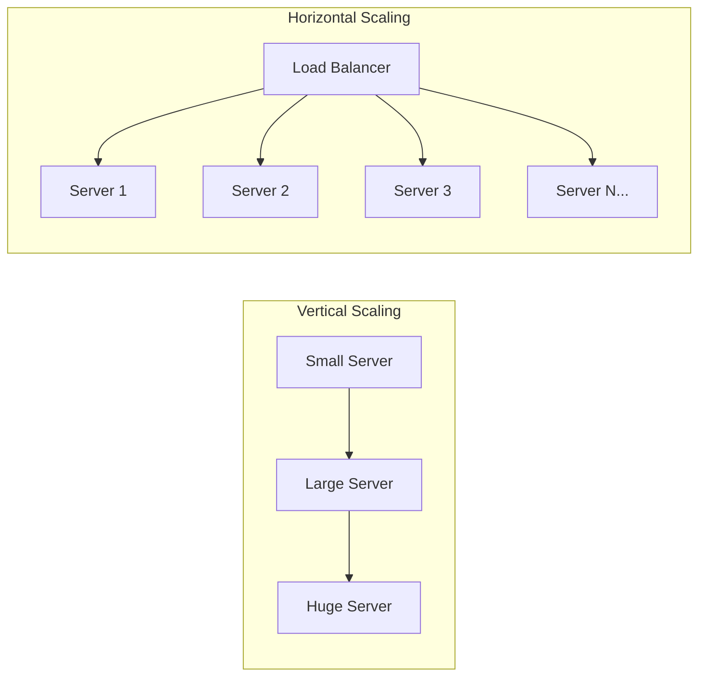
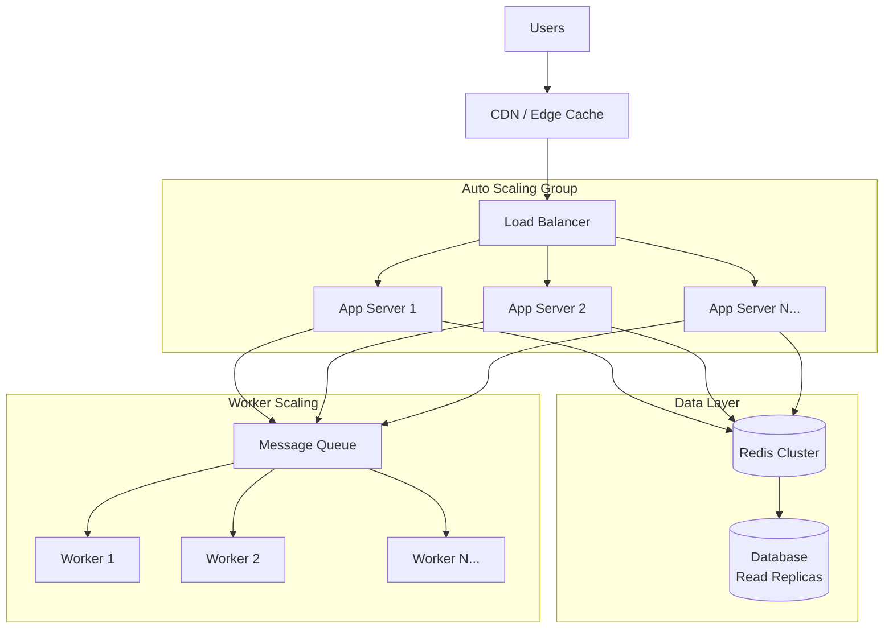

# How to Configure Horizontal Scaling

Author: [nawazdhandala](https://www.github.com/nawazdhandala)

Tags: Kubernetes, Scaling, DevOps, HPA, Cloud, Performance, Infrastructure

Description: A practical guide to configuring horizontal scaling for applications using Kubernetes HPA, cloud auto-scaling groups, and best practices for handling traffic spikes.

---

Horizontal scaling adds more instances of your application to handle increased load, rather than making a single instance more powerful. This approach provides better fault tolerance and cost efficiency. Let's explore how to configure horizontal scaling properly across different platforms.

## Understanding Horizontal vs Vertical Scaling

Before diving into configuration, it's important to understand the difference between these two scaling approaches.



Horizontal scaling wins in most scenarios because:
- No single point of failure
- Can scale beyond hardware limits
- More cost-effective with cloud pricing
- Enables zero-downtime deployments

## Kubernetes Horizontal Pod Autoscaler (HPA)

The HPA automatically scales pods based on observed metrics like CPU or memory utilization.

### Basic HPA Configuration

First, ensure your deployment has resource requests defined. The HPA uses these as the baseline for scaling decisions.

```yaml
# deployment.yaml
apiVersion: apps/v1
kind: Deployment
metadata:
  name: web-api
  labels:
    app: web-api
spec:
  replicas: 2
  selector:
    matchLabels:
      app: web-api
  template:
    metadata:
      labels:
        app: web-api
    spec:
      containers:
      - name: api
        image: myapp/web-api:v1.2.0
        # Resource requests are required for HPA to work
        resources:
          requests:
            cpu: 100m
            memory: 128Mi
          limits:
            cpu: 500m
            memory: 512Mi
        ports:
        - containerPort: 8080
```

Now create the HPA:

```yaml
# hpa.yaml
apiVersion: autoscaling/v2
kind: HorizontalPodAutoscaler
metadata:
  name: web-api-hpa
spec:
  scaleTargetRef:
    apiVersion: apps/v1
    kind: Deployment
    name: web-api
  # Minimum and maximum replicas
  minReplicas: 2
  maxReplicas: 20
  metrics:
  # Scale based on CPU utilization
  - type: Resource
    resource:
      name: cpu
      target:
        type: Utilization
        # Target 70% average CPU across all pods
        averageUtilization: 70
  # Also consider memory
  - type: Resource
    resource:
      name: memory
      target:
        type: Utilization
        averageUtilization: 80
  # Control scaling behavior
  behavior:
    scaleDown:
      stabilizationWindowSeconds: 300  # Wait 5 minutes before scaling down
      policies:
      - type: Percent
        value: 10
        periodSeconds: 60  # Scale down max 10% per minute
    scaleUp:
      stabilizationWindowSeconds: 0  # Scale up immediately
      policies:
      - type: Percent
        value: 100
        periodSeconds: 15  # Can double capacity every 15 seconds
      - type: Pods
        value: 4
        periodSeconds: 15  # Or add 4 pods every 15 seconds
```

Apply and verify:

```bash
# Apply the configurations
kubectl apply -f deployment.yaml
kubectl apply -f hpa.yaml

# Check HPA status
kubectl get hpa web-api-hpa

# Watch scaling in action
kubectl get hpa web-api-hpa --watch
```

### Custom Metrics Scaling

CPU and memory are not always the best indicators. You can scale based on custom metrics like requests per second or queue depth.

```yaml
# hpa-custom-metrics.yaml
apiVersion: autoscaling/v2
kind: HorizontalPodAutoscaler
metadata:
  name: web-api-hpa-custom
spec:
  scaleTargetRef:
    apiVersion: apps/v1
    kind: Deployment
    name: web-api
  minReplicas: 2
  maxReplicas: 50
  metrics:
  # Scale based on requests per second per pod
  - type: Pods
    pods:
      metric:
        name: http_requests_per_second
      target:
        type: AverageValue
        averageValue: 1000  # Target 1000 RPS per pod
  # Scale based on external queue depth
  - type: External
    external:
      metric:
        name: rabbitmq_queue_messages
        selector:
          matchLabels:
            queue: orders
      target:
        type: AverageValue
        averageValue: 30  # Target 30 messages per pod
```

## Cloud Provider Auto Scaling Groups

For non-Kubernetes workloads or node-level scaling, use cloud provider auto-scaling.

### AWS Auto Scaling Group

```yaml
# cloudformation-asg.yaml
AWSTemplateFormatVersion: '2010-09-09'
Description: Auto Scaling Group with scaling policies

Resources:
  WebServerLaunchTemplate:
    Type: AWS::EC2::LaunchTemplate
    Properties:
      LaunchTemplateName: web-server-template
      LaunchTemplateData:
        ImageId: ami-0123456789abcdef0
        InstanceType: t3.medium
        SecurityGroupIds:
          - !Ref WebServerSecurityGroup
        UserData:
          Fn::Base64: |
            #!/bin/bash
            yum update -y
            yum install -y docker
            systemctl start docker
            docker run -d -p 80:8080 myapp/web-api:latest

  WebServerASG:
    Type: AWS::AutoScaling::AutoScalingGroup
    Properties:
      AutoScalingGroupName: web-server-asg
      LaunchTemplate:
        LaunchTemplateId: !Ref WebServerLaunchTemplate
        Version: !GetAtt WebServerLaunchTemplate.LatestVersionNumber
      MinSize: 2
      MaxSize: 20
      DesiredCapacity: 2
      VPCZoneIdentifier:
        - subnet-abc123
        - subnet-def456
      TargetGroupARNs:
        - !Ref WebServerTargetGroup
      HealthCheckType: ELB
      HealthCheckGracePeriod: 300
      Tags:
        - Key: Name
          Value: web-server
          PropagateAtLaunch: true

  # Scale up policy
  ScaleUpPolicy:
    Type: AWS::AutoScaling::ScalingPolicy
    Properties:
      AutoScalingGroupName: !Ref WebServerASG
      PolicyType: TargetTrackingScaling
      TargetTrackingConfiguration:
        PredefinedMetricSpecification:
          PredefinedMetricType: ASGAverageCPUUtilization
        TargetValue: 70.0
        ScaleInCooldown: 300
        ScaleOutCooldown: 60
```

### Terraform Configuration for GCP

```hcl
# main.tf
resource "google_compute_instance_template" "web_server" {
  name_prefix  = "web-server-"
  machine_type = "e2-medium"
  region       = "us-central1"

  disk {
    source_image = "debian-cloud/debian-11"
    auto_delete  = true
    boot         = true
  }

  network_interface {
    network = "default"
    access_config {}
  }

  metadata_startup_script = <<-EOF
    #!/bin/bash
    apt-get update
    apt-get install -y docker.io
    docker run -d -p 80:8080 myapp/web-api:latest
  EOF

  lifecycle {
    create_before_destroy = true
  }
}

resource "google_compute_instance_group_manager" "web_server" {
  name               = "web-server-igm"
  base_instance_name = "web-server"
  zone               = "us-central1-a"

  version {
    instance_template = google_compute_instance_template.web_server.id
  }

  target_size = 2

  named_port {
    name = "http"
    port = 80
  }
}

resource "google_compute_autoscaler" "web_server" {
  name   = "web-server-autoscaler"
  zone   = "us-central1-a"
  target = google_compute_instance_group_manager.web_server.id

  autoscaling_policy {
    max_replicas    = 20
    min_replicas    = 2
    cooldown_period = 60

    cpu_utilization {
      target = 0.7
    }
  }
}
```

## Scaling Architecture Patterns

Here's a complete architecture showing how horizontal scaling fits together:



## Best Practices for Horizontal Scaling

### 1. Design for Statelessness

Your application must be stateless to scale horizontally. Store session data in Redis or a database.

```python
# Bad: In-memory session storage
sessions = {}

def handle_request(user_id):
    session = sessions.get(user_id, {})
    # This breaks with multiple instances

# Good: External session storage
import redis

redis_client = redis.Redis(host='redis-cluster', port=6379)

def handle_request(user_id):
    session = redis_client.hgetall(f"session:{user_id}")
    # Works across all instances
```

### 2. Set Appropriate Resource Requests

Underestimating resources leads to aggressive scaling. Overestimating wastes resources.

```bash
# Monitor actual usage to set accurate requests
kubectl top pods -l app=web-api

# Use Vertical Pod Autoscaler in recommendation mode
kubectl get vpa web-api-vpa -o jsonpath='{.status.recommendation}'
```

### 3. Configure Pod Disruption Budgets

Prevent scaling events from causing outages:

```yaml
# pdb.yaml
apiVersion: policy/v1
kind: PodDisruptionBudget
metadata:
  name: web-api-pdb
spec:
  minAvailable: 50%
  selector:
    matchLabels:
      app: web-api
```

### 4. Use Anti-Affinity for High Availability

Spread pods across nodes and zones:

```yaml
# In your deployment spec
affinity:
  podAntiAffinity:
    preferredDuringSchedulingIgnoredDuringExecution:
    - weight: 100
      podAffinityTerm:
        labelSelector:
          matchLabels:
            app: web-api
        topologyKey: topology.kubernetes.io/zone
```

### 5. Monitor and Alert on Scaling Events

```yaml
# prometheus-alert.yaml
groups:
- name: scaling-alerts
  rules:
  - alert: HPAMaxedOut
    expr: |
      kube_horizontalpodautoscaler_status_current_replicas
      == kube_horizontalpodautoscaler_spec_max_replicas
    for: 15m
    labels:
      severity: warning
    annotations:
      summary: "HPA {{ $labels.horizontalpodautoscaler }} is at max replicas"
      description: "Consider increasing max replicas or optimizing the application"
```

## Testing Your Scaling Configuration

Before going to production, test your scaling setup:

```bash
# Generate load to trigger scaling
kubectl run load-test --rm -i --tty --image=busybox -- sh -c "
  while true; do
    wget -q -O- http://web-api-service:8080/health
  done
"

# Watch the HPA respond
kubectl get hpa web-api-hpa --watch

# Check new pods spinning up
kubectl get pods -l app=web-api --watch
```

Horizontal scaling is not a set-and-forget configuration. Monitor your metrics, adjust thresholds based on real traffic patterns, and regularly test your scaling behavior to ensure your application can handle whatever load comes its way.
