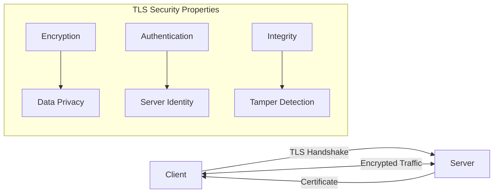

# How to Configure HTTPS/TLS Properly

Author: [nawazdhandala](https://www.github.com/nawazdhandala)

Tags: Security, HTTPS, TLS, SSL, Certificates, Web Security, Nginx, Apache

Description: Learn how to properly configure HTTPS/TLS for your web servers with modern cipher suites, certificate management, and security headers.

---

HTTPS is no longer optional for web applications. It protects data in transit from eavesdropping and tampering, verifies server identity, and is required for many modern web features. This guide covers proper TLS configuration for production environments, including certificate management, cipher suite selection, and security headers.

## Understanding TLS

TLS (Transport Layer Security) is the protocol that powers HTTPS. It provides three key security properties:



- **Encryption** - Data is encrypted so eavesdroppers cannot read it
- **Authentication** - The server proves its identity with a certificate
- **Integrity** - Any tampering with data is detected

## Obtaining TLS Certificates

### Let's Encrypt (Free, Automated)

Let's Encrypt provides free, automated certificates. Use Certbot for easy management.

```bash
# Install Certbot on Ubuntu/Debian
sudo apt update
sudo apt install certbot python3-certbot-nginx

# Obtain certificate for Nginx
sudo certbot --nginx -d example.com -d www.example.com

# Or for Apache
sudo certbot --apache -d example.com -d www.example.com

# Standalone mode (if no web server is running)
sudo certbot certonly --standalone -d example.com

# Test automatic renewal
sudo certbot renew --dry-run
```

### Certificate Renewal Automation

```bash
# Certbot creates a systemd timer automatically
# Check its status
sudo systemctl status certbot.timer

# Manual cron job alternative (runs twice daily)
# Add to /etc/cron.d/certbot
0 0,12 * * * root certbot renew --quiet --post-hook "systemctl reload nginx"
```

## Nginx TLS Configuration

### Modern TLS Configuration

```nginx
# /etc/nginx/conf.d/ssl-params.conf
# Modern TLS configuration - supports TLS 1.2 and 1.3

# SSL session settings
ssl_session_timeout 1d;
ssl_session_cache shared:SSL:50m;
ssl_session_tickets off;

# Diffie-Hellman parameter for DHE ciphersuites
# Generate with: openssl dhparam -out /etc/nginx/dhparam.pem 4096
ssl_dhparam /etc/nginx/dhparam.pem;

# Modern protocol versions only
ssl_protocols TLSv1.2 TLSv1.3;

# Modern cipher suite
ssl_ciphers ECDHE-ECDSA-AES128-GCM-SHA256:ECDHE-RSA-AES128-GCM-SHA256:ECDHE-ECDSA-AES256-GCM-SHA384:ECDHE-RSA-AES256-GCM-SHA384:ECDHE-ECDSA-CHACHA20-POLY1305:ECDHE-RSA-CHACHA20-POLY1305:DHE-RSA-AES128-GCM-SHA256:DHE-RSA-AES256-GCM-SHA384;

# Prefer server ciphers
ssl_prefer_server_ciphers off;

# OCSP Stapling
ssl_stapling on;
ssl_stapling_verify on;
resolver 8.8.8.8 8.8.4.4 valid=300s;
resolver_timeout 5s;

# Security headers
add_header Strict-Transport-Security "max-age=63072000; includeSubDomains; preload" always;
add_header X-Frame-Options "SAMEORIGIN" always;
add_header X-Content-Type-Options "nosniff" always;
add_header X-XSS-Protection "1; mode=block" always;
```

### Complete Server Block

```nginx
# /etc/nginx/sites-available/example.com

# Redirect HTTP to HTTPS
server {
    listen 80;
    listen [::]:80;
    server_name example.com www.example.com;

    # Allow Let's Encrypt ACME challenge
    location /.well-known/acme-challenge/ {
        root /var/www/certbot;
    }

    # Redirect all other traffic to HTTPS
    location / {
        return 301 https://$host$request_uri;
    }
}

# HTTPS server
server {
    listen 443 ssl http2;
    listen [::]:443 ssl http2;
    server_name example.com www.example.com;

    # Certificate files
    ssl_certificate /etc/letsencrypt/live/example.com/fullchain.pem;
    ssl_certificate_key /etc/letsencrypt/live/example.com/privkey.pem;

    # Include shared SSL configuration
    include /etc/nginx/conf.d/ssl-params.conf;

    # Root and index
    root /var/www/example.com;
    index index.html;

    # Application configuration
    location / {
        try_files $uri $uri/ =404;
    }

    # Proxy to backend API
    location /api/ {
        proxy_pass http://localhost:3000;
        proxy_http_version 1.1;
        proxy_set_header Host $host;
        proxy_set_header X-Real-IP $remote_addr;
        proxy_set_header X-Forwarded-For $proxy_add_x_forwarded_for;
        proxy_set_header X-Forwarded-Proto $scheme;
    }
}
```

## Apache TLS Configuration

### Modern TLS Configuration

```apache
# /etc/apache2/conf-available/ssl-params.conf

# Modern SSL configuration
SSLProtocol -all +TLSv1.2 +TLSv1.3

# Modern cipher suite
SSLCipherSuite ECDHE-ECDSA-AES128-GCM-SHA256:ECDHE-RSA-AES128-GCM-SHA256:ECDHE-ECDSA-AES256-GCM-SHA384:ECDHE-RSA-AES256-GCM-SHA384:ECDHE-ECDSA-CHACHA20-POLY1305:ECDHE-RSA-CHACHA20-POLY1305:DHE-RSA-AES128-GCM-SHA256:DHE-RSA-AES256-GCM-SHA384

SSLHonorCipherOrder off
SSLSessionTickets off

# OCSP Stapling
SSLUseStapling on
SSLStaplingCache "shmcb:logs/ssl_stapling(32768)"

# Security headers
Header always set Strict-Transport-Security "max-age=63072000; includeSubDomains; preload"
Header always set X-Frame-Options "SAMEORIGIN"
Header always set X-Content-Type-Options "nosniff"
```

### Virtual Host Configuration

```apache
# /etc/apache2/sites-available/example.com.conf

# Redirect HTTP to HTTPS
<VirtualHost *:80>
    ServerName example.com
    ServerAlias www.example.com

    # Let's Encrypt challenge
    Alias /.well-known/acme-challenge/ /var/www/certbot/.well-known/acme-challenge/

    # Redirect all other traffic
    RewriteEngine On
    RewriteCond %{REQUEST_URI} !^/.well-known/acme-challenge/
    RewriteRule ^(.*)$ https://%{HTTP_HOST}$1 [R=301,L]
</VirtualHost>

# HTTPS Virtual Host
<VirtualHost *:443>
    ServerName example.com
    ServerAlias www.example.com
    DocumentRoot /var/www/example.com

    # Enable SSL
    SSLEngine on
    SSLCertificateFile /etc/letsencrypt/live/example.com/fullchain.pem
    SSLCertificateKeyFile /etc/letsencrypt/live/example.com/privkey.pem

    # Include shared SSL configuration
    Include /etc/apache2/conf-available/ssl-params.conf

    # Application configuration
    <Directory /var/www/example.com>
        Options -Indexes +FollowSymLinks
        AllowOverride All
        Require all granted
    </Directory>

    # Proxy to backend
    ProxyPreserveHost On
    ProxyPass /api/ http://localhost:3000/api/
    ProxyPassReverse /api/ http://localhost:3000/api/
</VirtualHost>
```

## Node.js HTTPS Server

```javascript
const https = require('https');
const fs = require('fs');
const express = require('express');

const app = express();

// Read certificate files
const options = {
    key: fs.readFileSync('/etc/letsencrypt/live/example.com/privkey.pem'),
    cert: fs.readFileSync('/etc/letsencrypt/live/example.com/fullchain.pem'),

    // Modern TLS settings
    minVersion: 'TLSv1.2',

    // Cipher suite (Node.js uses OpenSSL cipher strings)
    ciphers: [
        'ECDHE-ECDSA-AES128-GCM-SHA256',
        'ECDHE-RSA-AES128-GCM-SHA256',
        'ECDHE-ECDSA-AES256-GCM-SHA384',
        'ECDHE-RSA-AES256-GCM-SHA384',
        'ECDHE-ECDSA-CHACHA20-POLY1305',
        'ECDHE-RSA-CHACHA20-POLY1305',
    ].join(':'),

    // Honor cipher order
    honorCipherOrder: true,
};

// Security headers middleware
app.use((req, res, next) => {
    res.setHeader('Strict-Transport-Security', 'max-age=63072000; includeSubDomains; preload');
    res.setHeader('X-Content-Type-Options', 'nosniff');
    res.setHeader('X-Frame-Options', 'SAMEORIGIN');
    next();
});

// Redirect HTTP to HTTPS
const http = require('http');
http.createServer((req, res) => {
    res.writeHead(301, { Location: `https://${req.headers.host}${req.url}` });
    res.end();
}).listen(80);

// HTTPS server
https.createServer(options, app).listen(443, () => {
    console.log('HTTPS server running on port 443');
});
```

## Security Headers Deep Dive

### HTTP Strict Transport Security (HSTS)

HSTS tells browsers to always use HTTPS for your domain.

```nginx
# Nginx
add_header Strict-Transport-Security "max-age=63072000; includeSubDomains; preload" always;
```


Parameters:
- `max-age` - How long to remember (in seconds)
- `includeSubDomains` - Apply to all subdomains
- `preload` - Allow inclusion in browser preload lists

### HSTS Preload

For maximum security, submit your domain to the HSTS preload list.

```bash
# Requirements for HSTS preload:
# 1. Valid certificate
# 2. Redirect HTTP to HTTPS
# 3. HSTS header with:
#    - max-age of at least 1 year (31536000)
#    - includeSubDomains directive
#    - preload directive

# Submit at: https://hstspreload.org/
```

### Certificate Transparency

Certificate Transparency helps detect misissued certificates.

```nginx
# Expect-CT header (deprecated but still useful for older browsers)
add_header Expect-CT "max-age=86400, enforce" always;
```

## Generating Strong DH Parameters

Diffie-Hellman parameters are used for key exchange. Generate custom parameters for better security.

```bash
# Generate 4096-bit DH parameters (takes several minutes)
openssl dhparam -out /etc/nginx/dhparam.pem 4096

# Or use 2048-bit for faster generation (still secure)
openssl dhparam -out /etc/nginx/dhparam.pem 2048
```

## Testing Your TLS Configuration

### SSL Labs Test

Test your configuration at https://www.ssllabs.com/ssltest/

Target: A+ rating with the configurations in this guide.

### Command Line Testing

```bash
# Test TLS connection
openssl s_client -connect example.com:443 -servername example.com

# Check certificate details
openssl s_client -connect example.com:443 -servername example.com 2>/dev/null | \
    openssl x509 -noout -dates -subject -issuer

# Test specific TLS version
openssl s_client -connect example.com:443 -tls1_3
openssl s_client -connect example.com:443 -tls1_2

# Verify TLS 1.0 and 1.1 are disabled (should fail)
openssl s_client -connect example.com:443 -tls1_1
openssl s_client -connect example.com:443 -tls1

# Test cipher suites
nmap --script ssl-enum-ciphers -p 443 example.com
```

### Using testssl.sh

```bash
# Install testssl.sh
git clone https://github.com/drwetter/testssl.sh.git
cd testssl.sh

# Run comprehensive test
./testssl.sh example.com

# Test specific aspects
./testssl.sh --protocols example.com
./testssl.sh --ciphers example.com
./testssl.sh --headers example.com
```

## Certificate Monitoring

Monitor your certificates to prevent expiration.

```python
#!/usr/bin/env python3
"""Certificate expiration monitor."""

import ssl
import socket
from datetime import datetime, timedelta
import smtplib
from email.message import EmailMessage

def check_certificate(hostname, port=443, warning_days=30):
    """Check certificate expiration for a host."""
    context = ssl.create_default_context()

    with socket.create_connection((hostname, port), timeout=10) as sock:
        with context.wrap_socket(sock, server_hostname=hostname) as ssock:
            cert = ssock.getpeercert()

    # Parse expiration date
    expire_date = datetime.strptime(
        cert['notAfter'],
        '%b %d %H:%M:%S %Y %Z'
    )

    days_until_expiry = (expire_date - datetime.now()).days

    return {
        'hostname': hostname,
        'expires': expire_date,
        'days_remaining': days_until_expiry,
        'warning': days_until_expiry <= warning_days
    }

def main():
    domains = [
        'example.com',
        'api.example.com',
        'www.example.com',
    ]

    warnings = []

    for domain in domains:
        try:
            result = check_certificate(domain)
            print(f"{domain}: {result['days_remaining']} days remaining")

            if result['warning']:
                warnings.append(result)
        except Exception as e:
            print(f"{domain}: Error - {e}")
            warnings.append({'hostname': domain, 'error': str(e)})

    if warnings:
        # Send alert email
        send_alert(warnings)

def send_alert(warnings):
    """Send email alert for expiring certificates."""
    msg = EmailMessage()
    msg['Subject'] = 'Certificate Expiration Warning'
    msg['From'] = 'monitor@example.com'
    msg['To'] = 'admin@example.com'

    body = "The following certificates need attention:\n\n"
    for w in warnings:
        if 'error' in w:
            body += f"- {w['hostname']}: ERROR - {w['error']}\n"
        else:
            body += f"- {w['hostname']}: Expires in {w['days_remaining']} days\n"

    msg.set_content(body)

    with smtplib.SMTP('localhost') as smtp:
        smtp.send_message(msg)

if __name__ == '__main__':
    main()
```

## Common Mistakes to Avoid

### Mixed Content

Ensure all resources are loaded over HTTPS.

```html
<!-- BAD - Mixed content -->
<script src="http://cdn.example.com/script.js"></script>


<!-- GOOD - Use HTTPS or protocol-relative URLs -->
<script src="https://cdn.example.com/script.js"></script>

```

### Insecure Cookie Settings

```javascript
// BAD - Cookies accessible over HTTP
res.cookie('session', token);

// GOOD - Secure cookie settings
res.cookie('session', token, {
    secure: true,      // Only send over HTTPS
    httpOnly: true,    // Not accessible via JavaScript
    sameSite: 'strict' // CSRF protection
});
```

### Certificate Chain Issues

Always include the full certificate chain.

```bash
# Check certificate chain
openssl s_client -connect example.com:443 -servername example.com -showcerts

# The fullchain.pem from Let's Encrypt includes intermediate certificates
ssl_certificate /etc/letsencrypt/live/example.com/fullchain.pem;  # Correct
ssl_certificate /etc/letsencrypt/live/example.com/cert.pem;       # Wrong - missing chain
```

## Best Practices Summary

1. **Use TLS 1.2 and 1.3 only** - Disable older versions
2. **Use strong cipher suites** - Prefer ECDHE and AES-GCM
3. **Enable HSTS** - With long max-age and preload
4. **Use OCSP stapling** - Improves performance and privacy
5. **Generate custom DH parameters** - At least 2048 bits
6. **Automate certificate renewal** - Use Certbot with cron
7. **Monitor certificate expiration** - Automated alerts
8. **Test regularly** - Use SSL Labs and testssl.sh
9. **Redirect HTTP to HTTPS** - No plaintext traffic
10. **Set secure cookie flags** - Secure, HttpOnly, SameSite

## Conclusion

Proper HTTPS/TLS configuration is essential for protecting your users and your application. With free certificates from Let's Encrypt and well-documented configuration options, there is no excuse for not implementing strong TLS security. Regular testing and certificate monitoring ensure your configuration remains secure as best practices evolve.

Remember that HTTPS is just one layer of security. Combine it with secure coding practices, proper authentication, and other security measures for comprehensive protection.
