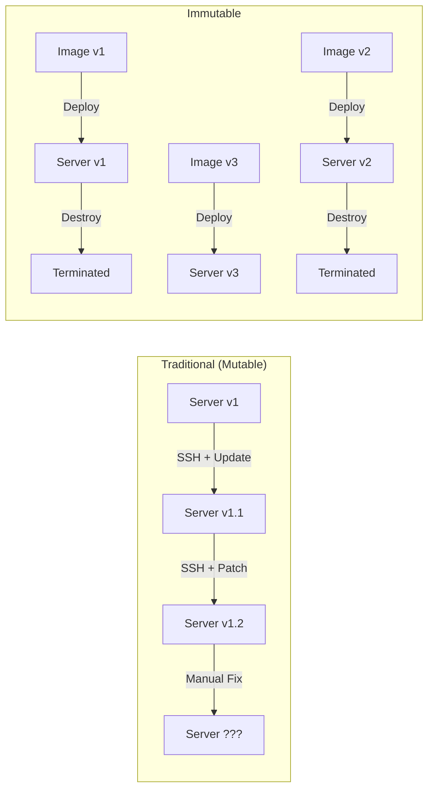
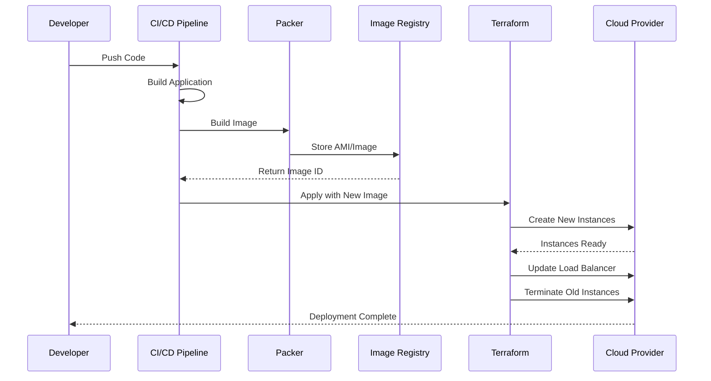

# How to Configure Immutable Infrastructure

Author: [nawazdhandala](https://www.github.com/nawazdhandala)

Tags: DevOps, Infrastructure, Terraform, Packer, AWS, Kubernetes, Immutable Infrastructure

Description: Learn how to implement immutable infrastructure where servers are never modified after deployment, only replaced with new versions.

---

Traditional infrastructure management involves SSHing into servers, running updates, and making configuration changes. This approach leads to configuration drift, snowflake servers, and the dreaded "it works on my machine" problem. Immutable infrastructure takes a different approach: once a server is deployed, it is never modified. If you need changes, you deploy a new server and destroy the old one.

This pattern brings consistency, reliability, and predictability to your infrastructure. Let's explore how to implement it properly.

## The Immutable Infrastructure Model



## Building Machine Images with Packer

Packer creates identical machine images for multiple platforms from a single configuration.

```hcl
# aws-app-server.pkr.hcl
packer {
  required_plugins {
    amazon = {
      version = ">= 1.2.0"
      source  = "github.com/hashicorp/amazon"
    }
  }
}

variable "app_version" {
  type        = string
  description = "Application version to bake into the image"
}

variable "base_ami" {
  type    = string
  default = "ami-0c55b159cbfafe1f0"  # Ubuntu 22.04 LTS
}

source "amazon-ebs" "app_server" {
  ami_name      = "app-server-${var.app_version}-{{timestamp}}"
  instance_type = "t3.medium"
  region        = "us-east-1"
  source_ami    = var.base_ami
  ssh_username  = "ubuntu"

  tags = {
    Name        = "app-server"
    Version     = var.app_version
    BuildTime   = "{{timestamp}}"
    Environment = "production"
  }

  # Enable EBS encryption
  encrypt_boot = true
}

build {
  sources = ["source.amazon-ebs.app_server"]

  # Update system packages
  provisioner "shell" {
    inline = [
      "sudo apt-get update",
      "sudo apt-get upgrade -y",
      "sudo apt-get install -y nginx docker.io",
      "sudo systemctl enable nginx docker"
    ]
  }

  # Copy application binary
  provisioner "file" {
    source      = "dist/app"
    destination = "/tmp/app"
  }

  # Install application
  provisioner "shell" {
    inline = [
      "sudo mv /tmp/app /usr/local/bin/app",
      "sudo chmod +x /usr/local/bin/app",
      "sudo useradd -r -s /bin/false appuser"
    ]
  }

  # Copy systemd service file
  provisioner "file" {
    source      = "config/app.service"
    destination = "/tmp/app.service"
  }

  provisioner "shell" {
    inline = [
      "sudo mv /tmp/app.service /etc/systemd/system/app.service",
      "sudo systemctl daemon-reload",
      "sudo systemctl enable app"
    ]
  }

  # Cleanup to reduce image size
  provisioner "shell" {
    inline = [
      "sudo apt-get clean",
      "sudo rm -rf /var/lib/apt/lists/*",
      "sudo rm -rf /tmp/*"
    ]
  }
}
```

Build the image:

```bash
# Build the AMI with version tag
packer build -var "app_version=1.2.3" aws-app-server.pkr.hcl
```

## Deploying with Terraform

Once you have immutable images, Terraform deploys them to your infrastructure.

```hcl
# main.tf
terraform {
  required_providers {
    aws = {
      source  = "hashicorp/aws"
      version = "~> 5.0"
    }
  }

  backend "s3" {
    bucket = "my-terraform-state"
    key    = "prod/app/terraform.tfstate"
    region = "us-east-1"
  }
}

variable "app_ami_id" {
  description = "AMI ID for the application server"
  type        = string
}

variable "app_version" {
  description = "Application version being deployed"
  type        = string
}

# Launch template with the immutable AMI
resource "aws_launch_template" "app" {
  name_prefix   = "app-server-"
  image_id      = var.app_ami_id
  instance_type = "t3.medium"

  # Prevent manual SSH access
  key_name = null

  network_interfaces {
    associate_public_ip_address = false
    security_groups             = [aws_security_group.app.id]
  }

  iam_instance_profile {
    name = aws_iam_instance_profile.app.name
  }

  user_data = base64encode(<<-EOF
    #!/bin/bash
    # Minimal bootstrap - app already installed in AMI
    /usr/local/bin/app --config /etc/app/config.yaml
  EOF
  )

  tag_specifications {
    resource_type = "instance"
    tags = {
      Name    = "app-server"
      Version = var.app_version
    }
  }

  lifecycle {
    create_before_destroy = true
  }
}

# Auto Scaling Group for blue-green deployments
resource "aws_autoscaling_group" "app" {
  name                = "app-${var.app_version}"
  desired_capacity    = 3
  max_size            = 6
  min_size            = 2
  vpc_zone_identifier = var.private_subnet_ids
  target_group_arns   = [aws_lb_target_group.app.arn]
  health_check_type   = "ELB"

  launch_template {
    id      = aws_launch_template.app.id
    version = "$Latest"
  }

  instance_refresh {
    strategy = "Rolling"
    preferences {
      min_healthy_percentage = 75
      instance_warmup        = 300
    }
  }

  tag {
    key                 = "Version"
    value               = var.app_version
    propagate_at_launch = true
  }

  lifecycle {
    create_before_destroy = true
  }
}
```

## Blue-Green Deployments

Blue-green deployments let you switch traffic between two identical environments.

```hcl
# blue-green.tf
variable "active_environment" {
  description = "Which environment receives traffic: blue or green"
  type        = string
  default     = "blue"
}

resource "aws_lb_listener_rule" "app" {
  listener_arn = aws_lb_listener.https.arn
  priority     = 100

  action {
    type             = "forward"
    target_group_arn = var.active_environment == "blue" ? aws_lb_target_group.blue.arn : aws_lb_target_group.green.arn
  }

  condition {
    path_pattern {
      values = ["/*"]
    }
  }
}

resource "aws_lb_target_group" "blue" {
  name     = "app-blue"
  port     = 8080
  protocol = "HTTP"
  vpc_id   = var.vpc_id

  health_check {
    enabled             = true
    path                = "/health"
    healthy_threshold   = 2
    unhealthy_threshold = 3
    interval            = 30
  }
}

resource "aws_lb_target_group" "green" {
  name     = "app-green"
  port     = 8080
  protocol = "HTTP"
  vpc_id   = var.vpc_id

  health_check {
    enabled             = true
    path                = "/health"
    healthy_threshold   = 2
    unhealthy_threshold = 3
    interval            = 30
  }
}
```

## Kubernetes and Immutable Containers

Kubernetes naturally supports immutable infrastructure through container images.

```yaml
# deployment.yaml
apiVersion: apps/v1
kind: Deployment
metadata:
  name: app
  labels:
    app: myapp
spec:
  replicas: 3
  strategy:
    type: RollingUpdate
    rollingUpdate:
      maxSurge: 1
      maxUnavailable: 0
  selector:
    matchLabels:
      app: myapp
  template:
    metadata:
      labels:
        app: myapp
    spec:
      containers:
        - name: app
          # Always use specific image digest, not tags
          image: myregistry.com/myapp@sha256:abc123...
          ports:
            - containerPort: 8080
          resources:
            requests:
              memory: "256Mi"
              cpu: "250m"
            limits:
              memory: "512Mi"
              cpu: "500m"
          # Read-only root filesystem
          securityContext:
            readOnlyRootFilesystem: true
            runAsNonRoot: true
            runAsUser: 1000
          volumeMounts:
            - name: tmp
              mountPath: /tmp
            - name: config
              mountPath: /etc/app
              readOnly: true
          livenessProbe:
            httpGet:
              path: /health
              port: 8080
            initialDelaySeconds: 10
            periodSeconds: 10
          readinessProbe:
            httpGet:
              path: /ready
              port: 8080
            initialDelaySeconds: 5
            periodSeconds: 5
      volumes:
        - name: tmp
          emptyDir: {}
        - name: config
          configMap:
            name: app-config
```

## Configuration Management Without Mutation

Store configuration externally so you never need to modify the image.

```yaml
# config-map.yaml
apiVersion: v1
kind: ConfigMap
metadata:
  name: app-config
data:
  config.yaml: |
    server:
      port: 8080
      host: 0.0.0.0
    database:
      host: ${DB_HOST}
      pool_size: 10
    logging:
      level: info
      format: json
```

For secrets, use external secret management:

```yaml
# external-secret.yaml (using External Secrets Operator)
apiVersion: external-secrets.io/v1beta1
kind: ExternalSecret
metadata:
  name: app-secrets
spec:
  refreshInterval: 1h
  secretStoreRef:
    name: aws-secrets-manager
    kind: ClusterSecretStore
  target:
    name: app-secrets
  data:
    - secretKey: database-password
      remoteRef:
        key: prod/app/database
        property: password
    - secretKey: api-key
      remoteRef:
        key: prod/app/api
        property: key
```

## CI/CD Pipeline for Immutable Infrastructure

```yaml
# .github/workflows/deploy.yml
name: Build and Deploy Immutable Infrastructure

on:
  push:
    branches: [main]

env:
  AWS_REGION: us-east-1

jobs:
  build-image:
    runs-on: ubuntu-latest
    outputs:
      ami_id: ${{ steps.packer.outputs.ami_id }}
      version: ${{ steps.version.outputs.version }}

    steps:
      - uses: actions/checkout@v4

      - name: Generate version
        id: version
        run: echo "version=$(git rev-parse --short HEAD)" >> $GITHUB_OUTPUT

      - name: Build application
        run: |
          go build -o dist/app .

      - name: Setup Packer
        uses: hashicorp/setup-packer@main

      - name: Build AMI
        id: packer
        run: |
          packer build -machine-readable \
            -var "app_version=${{ steps.version.outputs.version }}" \
            aws-app-server.pkr.hcl | tee packer.log
          AMI_ID=$(grep 'artifact,0,id' packer.log | cut -d, -f6 | cut -d: -f2)
          echo "ami_id=$AMI_ID" >> $GITHUB_OUTPUT

  deploy:
    needs: build-image
    runs-on: ubuntu-latest

    steps:
      - uses: actions/checkout@v4

      - name: Setup Terraform
        uses: hashicorp/setup-terraform@v3

      - name: Terraform Init
        run: terraform init

      - name: Terraform Plan
        run: |
          terraform plan \
            -var "app_ami_id=${{ needs.build-image.outputs.ami_id }}" \
            -var "app_version=${{ needs.build-image.outputs.version }}" \
            -out=tfplan

      - name: Terraform Apply
        run: terraform apply -auto-approve tfplan
```

## Deployment Flow Visualization



## Best Practices

When implementing immutable infrastructure, keep these principles in mind:

1. **Never SSH into production servers.** If you need to debug, deploy a new instance with debug tools or use centralized logging.

2. **Store all state externally.** Databases, caches, and file storage should be on managed services or persistent volumes, not on the instance.

3. **Use image digests, not tags.** Tags can be overwritten, but digests guarantee you get the exact image you tested.

4. **Implement health checks.** Your deployment system needs to know when new instances are ready before terminating old ones.

5. **Plan for rollbacks.** Keep previous image versions available so you can quickly roll back if needed.

6. **Automate everything.** Manual steps introduce drift and human error.

---

Immutable infrastructure requires a mindset shift from "fix it in place" to "replace it with something better." The initial investment in tooling and processes pays dividends in reliability, security, and operational simplicity. Start with a single service, prove the model, then expand across your infrastructure.
